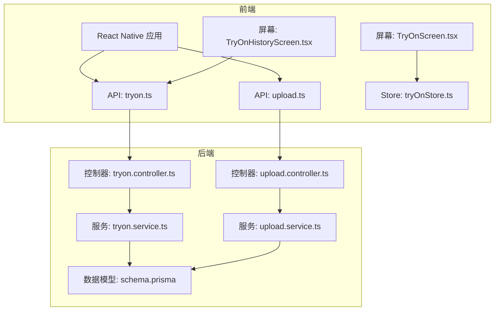
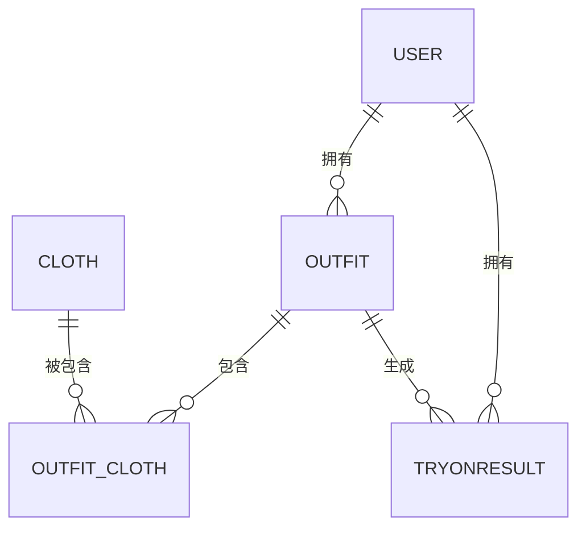
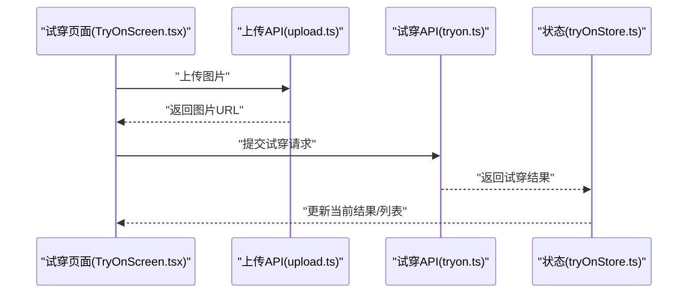
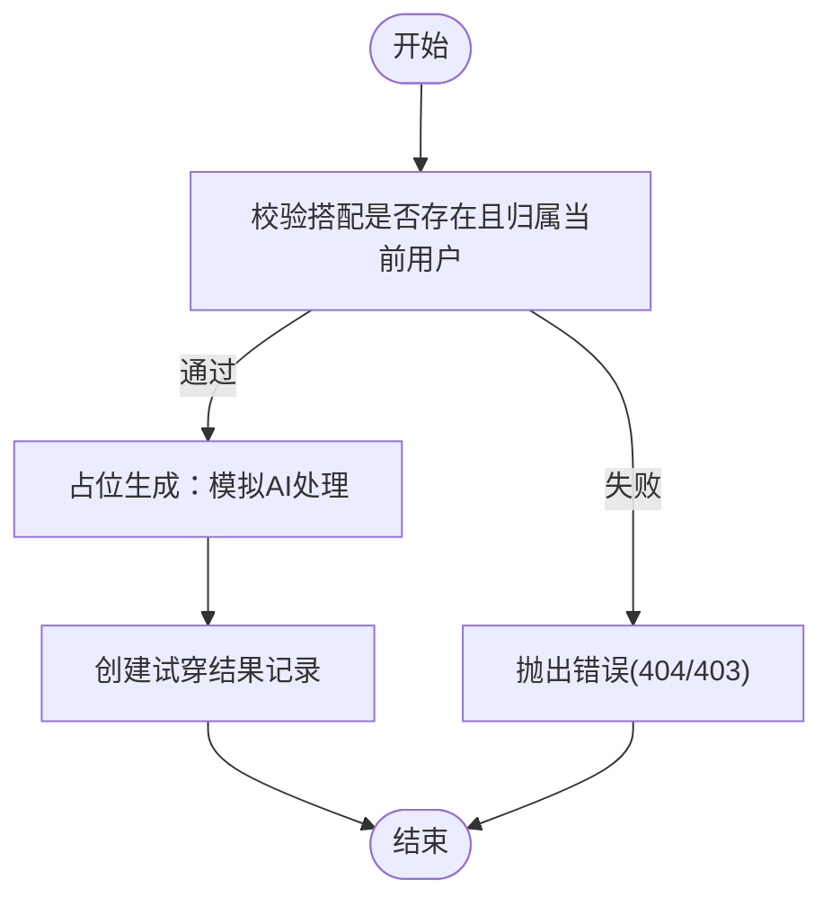
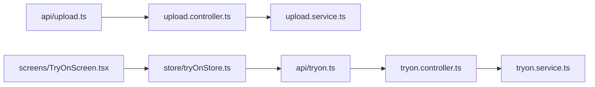

# AI试穿接口

<cite>
**本文引用的文件**
- [backend/src/modules/tryon/tryon.controller.ts](file://backend/src/modules/tryon/tryon.controller.ts)
- [backend/src/modules/tryon/tryon.service.ts](file://backend/src/modules/tryon/tryon.service.ts)
- [backend/src/modules/tryon/dto/create-tryon.dto.ts](file://backend/src/modules/tryon/dto/create-tryon.dto.ts)
- [backend/src/modules/tryon/tryon.module.ts](file://backend/src/modules/tryon/tryon.module.ts)
- [backend/src/modules/upload/upload.controller.ts](file://backend/src/modules/upload/upload.controller.ts)
- [backend/src/modules/upload/upload.service.ts](file://backend/src/modules/upload/upload.service.ts)
- [backend/src/modules/upload/upload.module.ts](file://backend/src/modules/upload/upload.module.ts)
- [backend/prisma/schema.prisma](file://backend/prisma/schema.prisma)
- [FreeDressApp/src/api/tryon.ts](file://FreeDressApp/src/api/tryon.ts)
- [FreeDressApp/src/store/tryOnStore.ts](file://FreeDressApp/src/store/tryOnStore.ts)
- [FreeDressApp/src/api/upload.ts](file://FreeDressApp/src/api/upload.ts)
- [FreeDressApp/src/screent/TryOnScreen.tsx](file://FreeDressApp/src/screens/TryOnScreen.tsx)
- [FreeDressApp/src/screens/TryOnHistoryScreen.tsx](file://FreeDressApp/src/screens/TryOnHistoryScreen.tsx)
- [FreeDressApp/src/types/index.ts](file://FreeDressApp/src/types/index.ts)
</cite>

## 目录
1. [简介](#简介)
2. [项目结构](#项目结构)
3. [核心组件](#核心组件)
4. [架构总览](#架构总览)
5. [详细组件分析](#详细组件分析)
6. [依赖分析](#依赖分析)
7. [性能考虑](#性能考虑)
8. [故障排查指南](#故障排查指南)
9. [结论](#结论)
10. [附录](#附录)

## 简介
本文件面向畅搭(FreeDress)应用的“AI试穿”能力，系统化梳理从“全身照上传”到“试穿结果生成与历史查询”的完整端到端接口与数据模型，并给出前端集成要点、服务端实现细节、数据存储策略与隐私保护建议、以及性能优化与最佳实践。当前后端采用NestJS + Prisma，前端采用React Native，AI试穿生成目前以占位逻辑实现，便于后续无缝对接真实AI服务。

## 项目结构
- 后端模块
  - 试穿模块：提供提交试穿请求、查询试穿记录的REST接口与业务逻辑
  - 上传模块：提供图片上传接口，支持JPG/PNG/WebP/GIF，限制10MB
  - 数据模型：通过Prisma定义用户、衣物、搭配、试穿结果等实体及索引
- 前端模块
  - API层：封装试穿与上传的HTTP调用
  - Store层：集中管理试穿结果列表与当前结果状态
  - 屏幕层：试穿工作流页面与历史记录页面



图表来源
- [backend/src/modules/tryon/tryon.controller.ts:1-41](file://backend/src/modules/tryon/tryon.controller.ts#L1-L41)
- [backend/src/modules/tryon/tryon.service.ts:1-88](file://backend/src/modules/tryon/tryon.service.ts#L1-L88)
- [backend/src/modules/upload/upload.controller.ts:1-51](file://backend/src/modules/upload/upload.controller.ts#L1-L51)
- [backend/src/modules/upload/upload.service.ts:1-49](file://backend/src/modules/upload/upload.service.ts#L1-L49)
- [backend/prisma/schema.prisma:116-131](file://backend/prisma/schema.prisma#L116-L131)
- [FreeDressApp/src/api/tryon.ts:1-28](file://FreeDressApp/src/api/tryon.ts#L1-L28)
- [FreeDressApp/src/api/upload.ts:1-21](file://FreeDressApp/src/api/upload.ts#L1-L21)
- [FreeDressApp/src/store/tryOnStore.ts:1-59](file://FreeDressApp/src/store/tryOnStore.ts#L1-L59)
- [FreeDressApp/src/screens/TryOnScreen.tsx:1-522](file://FreeDressApp/src/screens/TryOnScreen.tsx#L1-L522)
- [FreeDressApp/src/screens/TryOnHistoryScreen.tsx:1-189](file://FreeDressApp/src/screens/TryOnHistoryScreen.tsx#L1-L189)

章节来源
- [backend/src/modules/tryon/tryon.controller.ts:1-41](file://backend/src/modules/tryon/tryon.controller.ts#L1-L41)
- [backend/src/modules/tryon/tryon.service.ts:1-88](file://backend/src/modules/tryon/tryon.service.ts#L1-L88)
- [backend/src/modules/upload/upload.controller.ts:1-51](file://backend/src/modules/upload/upload.controller.ts#L1-L51)
- [backend/src/modules/upload/upload.service.ts:1-49](file://backend/src/modules/upload/upload.service.ts#L1-L49)
- [backend/prisma/schema.prisma:116-131](file://backend/prisma/schema.prisma#L116-L131)
- [FreeDressApp/src/api/tryon.ts:1-28](file://FreeDressApp/src/api/tryon.ts#L1-L28)
- [FreeDressApp/src/api/upload.ts:1-21](file://FreeDressApp/src/api/upload.ts#L1-L21)
- [FreeDressApp/src/store/tryOnStore.ts:1-59](file://FreeDressApp/src/store/tryOnStore.ts#L1-L59)
- [FreeDressApp/src/screens/TryOnScreen.tsx:1-522](file://FreeDressApp/src/screens/TryOnScreen.tsx#L1-L522)
- [FreeDressApp/src/screens/TryOnHistoryScreen.tsx:1-189](file://FreeDressApp/src/screens/TryOnHistoryScreen.tsx#L1-L189)

## 核心组件
- 试穿控制器与服务
  - 提交试穿请求：校验搭配归属、生成占位结果并持久化
  - 查询试穿记录：分页与关联搭配信息，按时间倒序
- 上传控制器与服务
  - 接收multipart二进制文件，校验类型与大小，保存至本地目录并返回URL
- 前端API与状态
  - 封装试穿与上传接口，统一响应格式
  - Zustand状态管理试穿结果列表与当前结果
- 数据模型
  - 试穿结果包含人物照片URL与AI生成结果URL，关联用户与搭配

章节来源
- [backend/src/modules/tryon/tryon.controller.ts:17-40](file://backend/src/modules/tryon/tryon.controller.ts#L17-L40)
- [backend/src/modules/tryon/tryon.service.ts:9-75](file://backend/src/modules/tryon/tryon.service.ts#L9-L75)
- [backend/src/modules/upload/upload.controller.ts:33-49](file://backend/src/modules/upload/upload.controller.ts#L33-L49)
- [backend/src/modules/upload/upload.service.ts:25-47](file://backend/src/modules/upload/upload.service.ts#L25-L47)
- [FreeDressApp/src/api/tryon.ts:17-27](file://FreeDressApp/src/api/tryon.ts#L17-L27)
- [FreeDressApp/src/api/upload.ts:4-19](file://FreeDressApp/src/api/upload.ts#L4-L19)
- [FreeDressApp/src/store/tryOnStore.ts:24-58](file://FreeDressApp/src/store/tryOnStore.ts#L24-L58)
- [backend/prisma/schema.prisma:116-131](file://backend/prisma/schema.prisma#L116-L131)

## 架构总览
下图展示从移动端发起请求到后端处理与数据持久化的整体流程。

```mermaid
sequenceDiagram
participant App as "移动端"
participant APIU as "上传API(upload.ts)"
participant CTRLU as "上传控制器(upload.controller.ts)"
participant SVCU as "上传服务(upload.service.ts)"
participant FS as "文件系统(uploads)"
participant APIT as "试穿API(tryon.ts)"
participant CTRLT as "试穿控制器(tryon.controller.ts)"
participant SVCT as "试穿服务(tryon.service.ts)"
participant DB as "数据库(Prisma)"
App->>APIU : "POST /upload/image (multipart)"
APIU->>CTRLU : "转发请求"
CTRLU->>SVCU : "uploadImage(file)"
SVCU->>FS : "写入文件"
SVCU-->>APIU : "{ url }"
APIU-->>App : "返回图片URL"
App->>APIT : "POST /tryon {personImageUrl,outfitId}"
APIT->>CTRLT : "create(userId,dto)"
CTRLT->>SVCT : "create(userId,dto)"
SVCT->>DB : "查询搭配是否存在且归属当前用户"
SVCT->>SVCT : "generateTryonImage(占位)"
SVCT->>DB : "创建试穿结果"
SVCT-->>CTRLL-->>APIT : "返回试穿结果"
APIT-->>App : "返回试穿结果"
```

图表来源
- [FreeDressApp/src/api/upload.ts:4-19](file://FreeDressApp/src/api/upload.ts#L4-L19)
- [backend/src/modules/upload/upload.controller.ts:33-49](file://backend/src/modules/upload/upload.controller.ts#L33-L49)
- [backend/src/modules/upload/upload.service.ts:25-47](file://backend/src/modules/upload/upload.service.ts#L25-L47)
- [FreeDressApp/src/api/tryon.ts:17-19](file://FreeDressApp/src/api/tryon.ts#L17-L19)
- [backend/src/modules/tryon/tryon.controller.ts:17-24](file://backend/src/modules/tryon/tryon.controller.ts#L17-L24)
- [backend/src/modules/tryon/tryon.service.ts:9-33](file://backend/src/modules/tryon/tryon.service.ts#L9-L33)
- [backend/prisma/schema.prisma:116-131](file://backend/prisma/schema.prisma#L116-L131)

## 详细组件分析

### 试穿接口规范
- 提交试穿请求
  - 方法与路径：POST /tryon
  - 认证：Bearer Token（JWT）
  - 请求体字段
    - personImageUrl: string（必填，人物全身照URL）
    - outfitId: string（必填，搭配ID）
  - 成功响应：返回试穿结果对象（包含人物照片URL、AI结果URL、所属搭配信息）
  - 错误码
    - 404：搭配不存在或不属于当前用户
    - 403：无权使用该搭配
- 获取试穿记录列表
  - 方法与路径：GET /tryon
  - 认证：Bearer Token（JWT）
  - 成功响应：数组，每项包含试穿结果与完整搭配详情（按创建时间倒序）
- 获取单条试穿记录
  - 方法与路径：GET /tryon/:id
  - 认证：Bearer Token（JWT）
  - 成功响应：单条试穿结果与搭配详情
  - 错误码
    - 404：记录不存在
    - 403：无权访问该记录

章节来源
- [backend/src/modules/tryon/tryon.controller.ts:17-40](file://backend/src/modules/tryon/tryon.controller.ts#L17-L40)
- [backend/src/modules/tryon/tryon.service.ts:35-75](file://backend/src/modules/tryon/tryon.service.ts#L35-L75)
- [backend/src/modules/tryon/dto/create-tryon.dto.ts:4-14](file://backend/src/modules/tryon/dto/create-tryon.dto.ts#L4-L14)
- [FreeDressApp/src/api/tryon.ts:17-27](file://FreeDressApp/src/api/tryon.ts#L17-L27)

### 上传接口规范
- 上传图片
  - 方法与路径：POST /upload/image
  - 认证：Bearer Token（JWT）
  - 内容类型：multipart/form-data
  - 字段：file（二进制图片）
  - 校验规则
    - 类型：仅允许 image/jpeg、image/png、image/webp、image/gif
    - 大小：不超过10MB
  - 成功响应：{ url: "/uploads/{filename}" }
  - 错误码：400（未选择文件、类型不支持、超出大小）

章节来源
- [backend/src/modules/upload/upload.controller.ts:33-49](file://backend/src/modules/upload/upload.controller.ts#L33-L49)
- [backend/src/modules/upload/upload.service.ts:25-47](file://backend/src/modules/upload/upload.service.ts#L25-L47)
- [FreeDressApp/src/api/upload.ts:4-19](file://FreeDressApp/src/api/upload.ts#L4-L19)

### 数据模型与关系
- 实体与字段
  - TryOnResult（试穿结果）
    - id、userId、outfitId、personImageUrl、resultImageUrl、createdAt
    - 关系：属于User与Outfit
  - Outfit（搭配）
    - id、userId、aiDescription、style、occasion、imageUrl、createdAt
    - 关系：包含OutfitCloth集合，可被收藏，可生成TryOnResult
  - User（用户）
    - id、phone、password、nickname、avatarUrl、role、createdAt、updatedAt
    - 关系：拥有Clothes、Outfits、Favorites、TryOnResults
- 索引
  - TryOnResult.userId、TryOnResult.outfitId
  - Outfit.userId
  - Cloth.userId、Cloth.category



图表来源
- [backend/prisma/schema.prisma:14-131](file://backend/prisma/schema.prisma#L14-L131)

章节来源
- [backend/prisma/schema.prisma:116-131](file://backend/prisma/schema.prisma#L116-L131)

### 前端集成与工作流
- 上传全身照
  - 调用上传API，接收图片URL
  - 在试穿页面预览并标记上传中状态
- 选择搭配
  - 从搭配列表中选择目标OutfitId
- 生成试穿
  - 调用试穿API，传入personImageUrl与outfitId
  - Store更新当前结果与列表
- 查看历史
  - 历史页面拉取列表，展示试穿结果缩略图与搭配信息



图表来源
- [FreeDressApp/src/screens/TryOnScreen.tsx:60-97](file://FreeDressApp/src/screens/TryOnScreen.tsx#L60-L97)
- [FreeDressApp/src/api/upload.ts:4-19](file://FreeDressApp/src/api/upload.ts#L4-L19)
- [FreeDressApp/src/api/tryon.ts:17-19](file://FreeDressApp/src/api/tryon.ts#L17-L19)
- [FreeDressApp/src/store/tryOnStore.ts:42-54](file://FreeDressApp/src/store/tryOnStore.ts#L42-L54)

章节来源
- [FreeDressApp/src/screens/TryOnScreen.tsx:60-97](file://FreeDressApp/src/screens/TryOnScreen.tsx#L60-L97)
- [FreeDressApp/src/api/upload.ts:4-19](file://FreeDressApp/src/api/upload.ts#L4-L19)
- [FreeDressApp/src/api/tryon.ts:17-19](file://FreeDressApp/src/api/tryon.ts#L17-L19)
- [FreeDressApp/src/store/tryOnStore.ts:42-54](file://FreeDressApp/src/store/tryOnStore.ts#L42-L54)

### 试穿结果生成流程（含占位逻辑）
- 输入：personImageUrl、outfitId
- 校验：搭配存在且归属当前用户
- 占位生成：模拟AI处理（延时+返回原图），后续替换为真实AI服务调用
- 持久化：创建TryOnResult记录
- 输出：返回试穿结果对象（包含关联的Outfit详情）



图表来源
- [backend/src/modules/tryon/tryon.service.ts:9-33](file://backend/src/modules/tryon/tryon.service.ts#L9-L33)

章节来源
- [backend/src/modules/tryon/tryon.service.ts:9-33](file://backend/src/modules/tryon/tryon.service.ts#L9-L33)

### 历史记录查询与管理
- 列表查询：GET /tryon，返回带Outfit详情的数组，按时间倒序
- 单条查询：GET /tryon/:id，校验归属后返回
- 前端展示：TryOnHistoryScreen.tsx加载并刷新列表，空态提示

章节来源
- [backend/src/modules/tryon/tryon.controller.ts:26-39](file://backend/src/modules/tryon/tryon.controller.ts#L26-L39)
- [backend/src/modules/tryon/tryon.service.ts:35-75](file://backend/src/modules/tryon/tryon.service.ts#L35-L75)
- [FreeDressApp/src/screens/TryOnHistoryScreen.tsx:41-60](file://FreeDressApp/src/screens/TryOnHistoryScreen.tsx#L41-L60)

### 下载与分享（扩展建议）
- 当前后端未提供专用下载/分享接口；可基于现有resultImageUrl进行下载
- 建议新增：
  - GET /tryon/:id/download（返回二进制图片）
  - POST /tryon/:id/share（生成分享链接/二维码）
- 注意：鉴权与访问控制需与现有JWT一致

（本节为概念性建议，不对应具体源码）

## 依赖分析
- 控制器与服务解耦：TryonController与TryonService通过DTO与Prisma交互
- 上传模块独立：UploadController/Service与试穿模块无直接耦合
- 前端API与Store：API层负责网络请求，Store负责状态聚合与缓存



图表来源
- [backend/src/modules/tryon/tryon.controller.ts:1-41](file://backend/src/modules/tryon/tryon.controller.ts#L1-L41)
- [backend/src/modules/tryon/tryon.service.ts:1-88](file://backend/src/modules/tryon/tryon.service.ts#L1-L88)
- [backend/src/modules/upload/upload.controller.ts:1-51](file://backend/src/modules/upload/upload.controller.ts#L1-L51)
- [backend/src/modules/upload/upload.service.ts:1-49](file://backend/src/modules/upload/upload.service.ts#L1-L49)
- [FreeDressApp/src/api/tryon.ts:1-28](file://FreeDressApp/src/api/tryon.ts#L1-L28)
- [FreeDressApp/src/api/upload.ts:1-21](file://FreeDressApp/src/api/upload.ts#L1-L21)
- [FreeDressApp/src/store/tryOnStore.ts:1-59](file://FreeDressApp/src/store/tryOnStore.ts#L1-L59)

章节来源
- [backend/src/modules/tryon/tryon.controller.ts:1-41](file://backend/src/modules/tryon/tryon.controller.ts#L1-L41)
- [backend/src/modules/tryon/tryon.service.ts:1-88](file://backend/src/modules/tryon/tryon.service.ts#L1-L88)
- [backend/src/modules/upload/upload.controller.ts:1-51](file://backend/src/modules/upload/upload.controller.ts#L1-L51)
- [backend/src/modules/upload/upload.service.ts:1-49](file://backend/src/modules/upload/upload.service.ts#L1-L49)
- [FreeDressApp/src/api/tryon.ts:1-28](file://FreeDressApp/src/api/tryon.ts#L1-L28)
- [FreeDressApp/src/api/upload.ts:1-21](file://FreeDressApp/src/api/upload.ts#L1-L21)
- [FreeDressApp/src/store/tryOnStore.ts:1-59](file://FreeDressApp/src/store/tryOnStore.ts#L1-L59)

## 性能考虑
- 上传优化
  - 前端压缩图片质量与尺寸，减少带宽与存储压力
  - 服务端限制文件大小与类型，避免异常请求
- 试穿生成
  - 占位阶段尽量短路，真实AI服务建议异步化并提供轮询/回调机制
  - 对热门搭配与常用组合做缓存（如结果URL可复用）
- 数据查询
  - 试穿列表按用户过滤并按时间倒序，确保索引命中
  - 分页与懒加载，避免一次性拉取过多历史记录
- 前端渲染
  - 使用FlatList/ScrollView优化长列表渲染
  - 图片懒加载与缩略图优先

（本节为通用指导，不对应具体源码）

## 故障排查指南
- 上传失败
  - 现象：提示“无法获取图片”或“上传失败”
  - 可能原因：未选择文件、文件类型不支持、文件过大、网络异常
  - 处理：检查文件类型与大小限制，确认网络连通
- 试穿失败
  - 现象：提示“请稍后重试”
  - 可能原因：搭配不存在、无权限、AI生成异常
  - 处理：确认outfitId归属、检查JWT有效性、查看后端日志
- 历史为空
  - 现象：历史页面显示空态
  - 处理：确认已成功生成至少一条试穿记录

章节来源
- [FreeDressApp/src/screens/TryOnScreen.tsx:60-97](file://FreeDressApp/src/screens/TryOnScreen.tsx#L60-L97)
- [backend/src/modules/tryon/tryon.service.ts:13-18](file://backend/src/modules/tryon/tryon.service.ts#L13-L18)
- [backend/src/modules/upload/upload.service.ts:26-38](file://backend/src/modules/upload/upload.service.ts#L26-L38)
- [FreeDressApp/src/screens/TryOnHistoryScreen.tsx:109-119](file://FreeDressApp/src/screens/TryOnHistoryScreen.tsx#L109-L119)

## 结论
本方案以清晰的模块划分与数据模型支撑了“全身照上传—选择搭配—生成试穿—历史查询”的完整闭环。当前AI生成采用占位逻辑，便于快速迭代与真实服务对接。建议后续重点推进以下方向：真实AI服务集成、异步生成与通知、下载/分享接口扩展、以及更完善的隐私与安全策略。

## 附录

### API调用示例（路径参考）
- 上传图片
  - POST /upload/image
  - 请求头：Content-Type: multipart/form-data
  - 请求体：file=二进制图片
  - 响应：{ url: "/uploads/..." }
  - 参考路径：[FreeDressApp/src/api/upload.ts:4-19](file://FreeDressApp/src/api/upload.ts#L4-L19)，[backend/src/modules/upload/upload.controller.ts:33-49](file://backend/src/modules/upload/upload.controller.ts#L33-L49)，[backend/src/modules/upload/upload.service.ts:25-47](file://backend/src/modules/upload/upload.service.ts#L25-L47)
- 提交试穿
  - POST /tryon
  - 请求体：{ personImageUrl, outfitId }
  - 响应：TryOnResult（含outfit详情）
  - 参考路径：[FreeDressApp/src/api/tryon.ts:17-19](file://FreeDressApp/src/api/tryon.ts#L17-L19)，[backend/src/modules/tryon/tryon.controller.ts:17-24](file://backend/src/modules/tryon/tryon.controller.ts#L17-L24)，[backend/src/modules/tryon/tryon.service.ts:9-33](file://backend/src/modules/tryon/tryon.service.ts#L9-L33)
- 查询试穿历史
  - GET /tryon
  - 响应：TryOnResult[]（含outfit详情）
  - 参考路径：[FreeDressApp/src/api/tryon.ts:21-23](file://FreeDressApp/src/api/tryon.ts#L21-L23)，[backend/src/modules/tryon/tryon.controller.ts:26-30](file://backend/src/modules/tryon/tryon.controller.ts#L26-L30)，[backend/src/modules/tryon/tryon.service.ts:35-49](file://backend/src/modules/tryon/tryon.service.ts#L35-L49)

### 前端集成要点
- 统一响应格式：所有API返回值遵循 ApiResponse<T>
- 状态管理：使用Zustand维护试穿结果列表与当前结果
- 工作流：TryOnScreen负责上传、选择与生成；TryOnHistoryScreen负责查看历史
- 类型定义：TryOnResult、ApiResponse等类型在types/index.ts中定义

章节来源
- [FreeDressApp/src/types/index.ts:48-64](file://FreeDressApp/src/types/index.ts#L48-L64)
- [FreeDressApp/src/store/tryOnStore.ts:1-59](file://FreeDressApp/src/store/tryOnStore.ts#L1-L59)
- [FreeDressApp/src/screens/TryOnScreen.tsx:1-522](file://FreeDressApp/src/screens/TryOnScreen.tsx#L1-L522)
- [FreeDressApp/src/screens/TryOnHistoryScreen.tsx:1-189](file://FreeDressApp/src/screens/TryOnHistoryScreen.tsx#L1-L189)

### 存储策略与隐私保护
- 存储策略
  - 上传文件落地至本地目录，返回相对URL；建议迁移至云存储（OSS/CDN）并开启CDN加速
  - 试穿结果仅保存URL与元数据，避免冗余大图
- 隐私保护
  - JWT鉴权贯穿上传与试穿接口
  - 严格校验资源归属（搭配与试穿记录均需绑定当前用户）
  - 建议对用户上传内容进行水印或脱敏处理

（本节为通用指导，不对应具体源码）