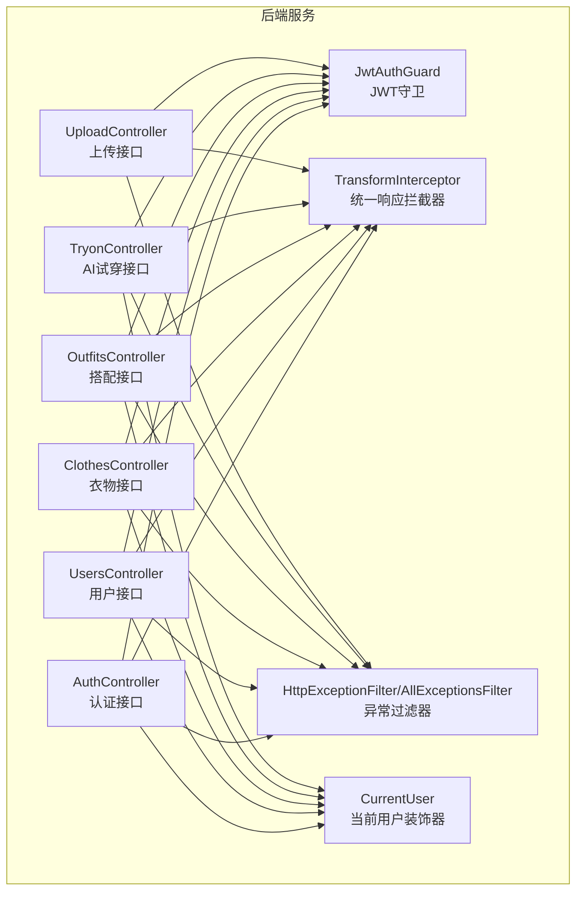
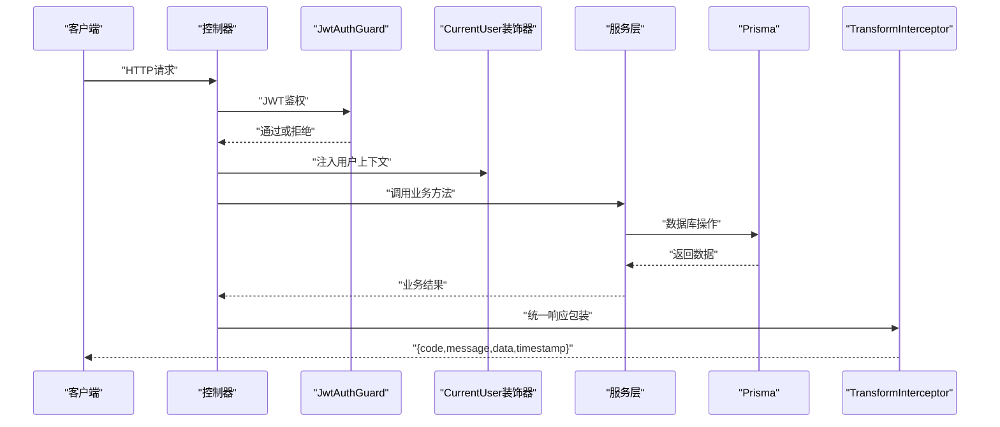
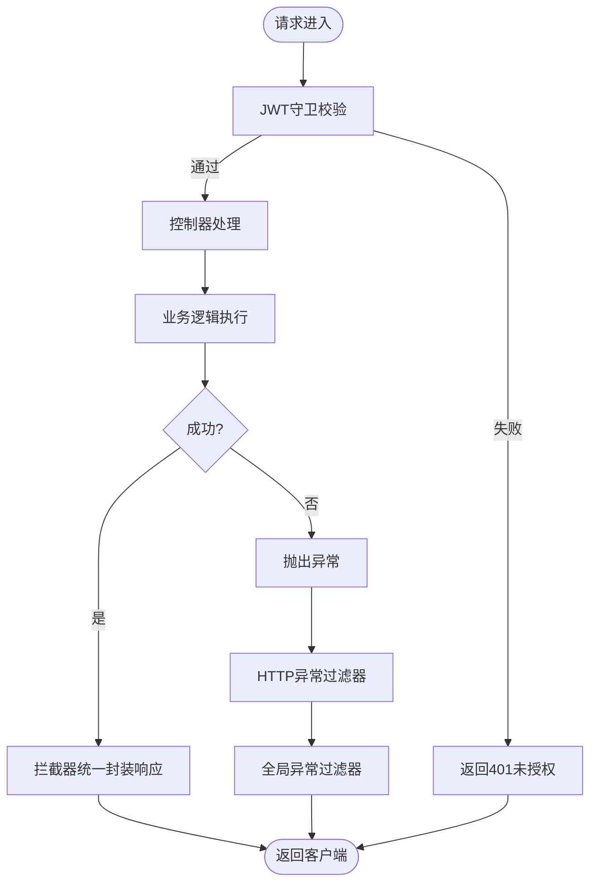

# API接口文档

<cite>
**本文档引用的文件**
- [backend/src/modules/auth/auth.controller.ts](file://backend/src/modules/auth/auth.controller.ts)
- [backend/src/modules/users/users.controller.ts](file://backend/src/modules/users/users.controller.ts)
- [backend/src/modules/clothes/clothes.controller.ts](file://backend/src/modules/clothes/clothes.controller.ts)
- [backend/src/modules/outfits/outfits.controller.ts](file://backend/src/modules/outfits/outfits.controller.ts)
- [backend/src/modules/tryon/tryon.controller.ts](file://backend/src/modules/tryon/tryon.controller.ts)
- [backend/src/modules/upload/upload.controller.ts](file://backend/src/modules/upload/upload.controller.ts)
- [backend/src/modules/auth/dto/login.dto.ts](file://backend/src/modules/auth/dto/login.dto.ts)
- [backend/src/modules/auth/dto/register.dto.ts](file://backend/src/modules/auth/dto/register.dto.ts)
- [backend/src/modules/auth/dto/reset-password.dto.ts](file://backend/src/modules/auth/dto/reset-password.dto.ts)
- [backend/src/modules/clothes/dto/create-cloth.dto.ts](file://backend/src/modules/clothes/dto/create-cloth.dto.ts)
- [backend/src/modules/clothes/dto/update-cloth.dto.ts](file://backend/src/modules/clothes/dto/update-cloth.dto.ts)
- [backend/src/modules/outfits/dto/create-outfit.dto.ts](file://backend/src/modules/outfits/dto/create-outfit.dto.ts)
- [backend/src/modules/tryon/dto/create-tryon.dto.ts](file://backend/src/modules/tryon/dto/create-tryon.dto.ts)
- [backend/src/modules/users/dto/update-profile.dto.ts](file://backend/src/modules/users/dto/update-profile.dto.ts)
- [backend/prisma/schema.prisma](file://backend/prisma/schema.prisma)
- [backend/src/common/interceptors/transform.interceptor.ts](file://backend/src/common/interceptors/transform.interceptor.ts)
- [backend/src/common/filters/http-exception.filter.ts](file://backend/src/common/filters/http-exception.filter.ts)
- [backend/src/common/guards/jwt-auth.guard.ts](file://backend/src/common/guards/jwt-auth.guard.ts)
- [backend/src/common/decorators/current-user.decorator.ts](file://backend/src/common/decorators/current-user.decorator.ts)
</cite>

## 目录
1. [简介](#简介)
2. [项目结构](#项目结构)
3. [核心组件](#核心组件)
4. [架构总览](#架构总览)
5. [详细组件分析](#详细组件分析)
6. [依赖关系分析](#依赖关系分析)
7. [性能考虑](#性能考虑)
8. [故障排除指南](#故障排除指南)
9. [结论](#结论)
10. [附录](#附录)

## 简介
本文件为畅搭(FreeDress)项目的完整API接口文档，覆盖认证、用户管理、衣物管理、搭配管理、AI试穿与文件上传等模块。文档提供每个RESTful端点的HTTP方法、URL路径、请求参数、响应格式与状态码说明；统一响应格式规范与JWT认证使用方法；错误处理机制与常见错误码解释；以及面向前端开发者的集成指南、版本管理与性能优化建议。

## 项目结构
后端采用NestJS框架，按功能模块划分：auth、users、clothes、outfits、tryon、upload，并通过Prisma管理数据库模型。全局拦截器统一响应格式，异常过滤器统一错误响应，JWT守卫保护受保护接口，当前用户装饰器注入用户上下文。

图表来源
- [backend/src/modules/auth/auth.controller.ts:16-91](file://backend/src/modules/auth/auth.controller.ts#L16-L91)
- [backend/src/modules/users/users.controller.ts:12-48](file://backend/src/modules/users/users.controller.ts#L12-L48)
- [backend/src/modules/clothes/clothes.controller.ts:24-101](file://backend/src/modules/clothes/clothes.controller.ts#L24-L101)
- [backend/src/modules/outfits/outfits.controller.ts:10-64](file://backend/src/modules/outfits/outfits.controller.ts#L10-L64)
- [backend/src/modules/tryon/tryon.controller.ts:10-40](file://backend/src/modules/tryon/tryon.controller.ts#L10-L40)
- [backend/src/modules/upload/upload.controller.ts:28-49](file://backend/src/modules/upload/upload.controller.ts#L28-L49)
- [backend/src/common/guards/jwt-auth.guard.ts:8-21](file://backend/src/common/guards/jwt-auth.guard.ts#L8-L21)
- [backend/src/common/interceptors/transform.interceptor.ts:19-31](file://backend/src/common/interceptors/transform.interceptor.ts#L19-L31)
- [backend/src/common/filters/http-exception.filter.ts:8-80](file://backend/src/common/filters/http-exception.filter.ts#L8-L80)
- [backend/src/common/decorators/current-user.decorator.ts:7-15](file://backend/src/common/decorators/current-user.decorator.ts#L7-L15)

章节来源
- [backend/src/modules/auth/auth.controller.ts:16-91](file://backend/src/modules/auth/auth.controller.ts#L16-L91)
- [backend/src/modules/users/users.controller.ts:12-48](file://backend/src/modules/users/users.controller.ts#L12-L48)
- [backend/src/modules/clothes/clothes.controller.ts:24-101](file://backend/src/modules/clothes/clothes.controller.ts#L24-L101)
- [backend/src/modules/outfits/outfits.controller.ts:10-64](file://backend/src/modules/outfits/outfits.controller.ts#L10-L64)
- [backend/src/modules/tryon/tryon.controller.ts:10-40](file://backend/src/modules/tryon/tryon.controller.ts#L10-L40)
- [backend/src/modules/upload/upload.controller.ts:28-49](file://backend/src/modules/upload/upload.controller.ts#L28-L49)

## 核心组件
- 统一响应格式：所有成功响应均包含code、message、data、timestamp四个字段，其中code默认200，message默认“success”，timestamp为ISO时间字符串。
- 统一错误格式：异常过滤器将错误包装为包含code、message、data、timestamp、path的JSON对象。
- JWT认证：使用JwtAuthGuard保护受保护接口，支持刷新令牌与当前用户信息获取。
- 数据模型：基于Prisma定义用户、衣物、搭配、收藏、试穿结果等模型及枚举。

章节来源
- [backend/src/common/interceptors/transform.interceptor.ts:8-31](file://backend/src/common/interceptors/transform.interceptor.ts#L8-L31)
- [backend/src/common/filters/http-exception.filter.ts:9-80](file://backend/src/common/filters/http-exception.filter.ts#L9-L80)
- [backend/src/common/guards/jwt-auth.guard.ts:8-21](file://backend/src/common/guards/jwt-auth.guard.ts#L8-L21)
- [backend/prisma/schema.prisma:14-131](file://backend/prisma/schema.prisma#L14-L131)

## 架构总览
下图展示API调用链路：客户端请求经守卫鉴权与装饰器注入用户信息，控制器处理业务逻辑，服务层执行具体操作，Prisma访问数据库，最终由拦截器统一响应格式返回。

图表来源
- [backend/src/common/guards/jwt-auth.guard.ts:9-20](file://backend/src/common/guards/jwt-auth.guard.ts#L9-L20)
- [backend/src/common/decorators/current-user.decorator.ts:7-15](file://backend/src/common/decorators/current-user.decorator.ts#L7-L15)
- [backend/src/common/interceptors/transform.interceptor.ts:20-31](file://backend/src/common/interceptors/transform.interceptor.ts#L20-L31)

## 详细组件分析

### 认证接口
- 获取图片验证码
  - 方法与路径：GET /auth/captcha
  - 认证：无需
  - 请求参数：无
  - 响应：SVG图片（二进制）
  - 状态码：200 成功；500 服务器错误
- 用户注册
  - 方法与路径：POST /auth/register
  - 认证：无需
  - 请求体：手机号、密码、验证码ID、验证码答案、昵称（可选）
  - 响应：统一响应格式
  - 状态码：201 注册成功；400 参数校验失败；409 已存在；500 服务器错误
- 用户登录
  - 方法与路径：POST /auth/login
  - 认证：无需
  - 请求体：手机号、密码
  - 响应：统一响应格式，包含访问令牌与刷新令牌
  - 状态码：200 登录成功；400 参数校验失败；401 未授权；500 服务器错误
- 忘记密码
  - 方法与路径：POST /auth/forgot-password
  - 认证：无需
  - 请求体：手机号、验证码ID、验证码答案
  - 响应：统一响应格式
  - 状态码：200 成功；400 参数校验失败；404 未找到；500 服务器错误
- 重置密码
  - 方法与路径：POST /auth/reset-password
  - 认证：无需
  - 请求体：重置令牌、新密码
  - 响应：统一响应格式
  - 状态码：200 成功；400 参数校验失败；404 未找到；500 服务器错误
- 刷新Token
  - 方法与路径：POST /auth/refresh
  - 认证：需要JWT
  - 请求体：无
  - 响应：统一响应格式，包含新的访问令牌
  - 状态码：200 成功；401 未授权；500 服务器错误
- 获取当前用户信息
  - 方法与路径：GET /auth/profile
  - 认证：需要JWT
  - 请求体：无
  - 响应：当前用户信息
  - 状态码：200 成功；401 未授权；500 服务器错误

章节来源
- [backend/src/modules/auth/auth.controller.ts:27-90](file://backend/src/modules/auth/auth.controller.ts#L27-L90)
- [backend/src/modules/auth/dto/register.dto.ts:8-37](file://backend/src/modules/auth/dto/register.dto.ts#L8-L37)
- [backend/src/modules/auth/dto/login.dto.ts:7-19](file://backend/src/modules/auth/dto/login.dto.ts#L7-L19)
- [backend/src/modules/auth/dto/reset-password.dto.ts:7-18](file://backend/src/modules/auth/dto/reset-password.dto.ts#L7-L18)

### 用户管理接口
- 获取当前用户信息
  - 方法与路径：GET /users/profile
  - 认证：需要JWT
  - 请求体：无
  - 响应：用户详情
  - 状态码：200 成功；401 未授权；500 服务器错误
- 更新用户资料
  - 方法与路径：PUT /users/profile
  - 认证：需要JWT
  - 请求体：昵称（可选）、头像URL（可选）
  - 响应：更新后的用户信息
  - 状态码：200 成功；400 参数校验失败；401 未授权；500 服务器错误
- 获取用户统计数据
  - 方法与路径：GET /users/stats
  - 认证：需要JWT
  - 请求体：无
  - 响应：用户衣物、搭配等统计
  - 状态码：200 成功；401 未授权；500 服务器错误

章节来源
- [backend/src/modules/users/users.controller.ts:22-47](file://backend/src/modules/users/users.controller.ts#L22-L47)
- [backend/src/modules/users/dto/update-profile.dto.ts:7-18](file://backend/src/modules/users/dto/update-profile.dto.ts#L7-L18)

### 衣物管理接口
- 创建衣物
  - 方法与路径：POST /clothes
  - 认证：需要JWT
  - 请求体：图片URL、分类（枚举）、颜色（可选）、风格（可选）、适用季节（可选数组）、标签（可选数组）
  - 响应：创建的衣物
  - 状态码：201 成功；400 参数校验失败；401 未授权；500 服务器错误
- 获取衣物列表
  - 方法与路径：GET /clothes
  - 查询参数：category（可选，按分类筛选）
  - 认证：需要JWT
  - 响应：衣物列表
  - 状态码：200 成功；401 未授权；500 服务器错误
- 获取衣物详情
  - 方法与路径：GET /clothes/:id
  - 认证：需要JWT
  - 响应：指定衣物详情
  - 状态码：200 成功；404 未找到；401 未授权；500 服务器错误
- 更新衣物
  - 方法与路径：PUT /clothes/:id
  - 认证：需要JWT
  - 请求体：同创建（所有字段可选）
  - 响应：更新后的衣物
  - 状态码：200 成功；400 参数校验失败；404 未找到；401 未授权；500 服务器错误
- 删除衣物
  - 方法与路径：DELETE /clothes/:id
  - 认证：需要JWT
  - 响应：空
  - 状态码：200 成功；404 未找到；401 未授权；500 服务器错误
- 获取分类统计
  - 方法与路径：GET /clothes/stats/categories
  - 认证：需要JWT
  - 响应：各分类数量统计
  - 状态码：200 成功；401 未授权；500 服务器错误

章节来源
- [backend/src/modules/clothes/clothes.controller.ts:34-100](file://backend/src/modules/clothes/clothes.controller.ts#L34-L100)
- [backend/src/modules/clothes/dto/create-cloth.dto.ts:8-42](file://backend/src/modules/clothes/dto/create-cloth.dto.ts#L8-L42)
- [backend/src/modules/clothes/dto/update-cloth.dto.ts:8-8](file://backend/src/modules/clothes/dto/update-cloth.dto.ts#L8-L8)

### 搭配接口
- 创建搭配
  - 方法与路径：POST /outfits
  - 认证：需要JWT
  - 请求体：衣物ID列表（至少一项）、风格（可选）、场合（可选）、AI生成描述（可选）、搭配效果图URL（可选）
  - 响应：创建的搭配
  - 状态码：201 成功；400 参数校验失败；401 未授权；500 服务器错误
- 获取搭配列表
  - 方法与路径：GET /outfits
  - 认证：需要JWT
  - 响应：搭配列表
  - 状态码：200 成功；401 未授权；500 服务器错误
- 获取收藏列表
  - 方法与路径：GET /outfits/favorites
  - 认证：需要JWT
  - 响应：收藏的搭配列表
  - 状态码：200 成功；401 未授权；500 服务器错误
- 获取搭配详情
  - 方法与路径：GET /outfits/:id
  - 认证：需要JWT
  - 响应：指定搭配详情
  - 状态码：200 成功；404 未找到；401 未授权；500 服务器错误
- 删除搭配
  - 方法与路径：DELETE /outfits/:id
  - 认证：需要JWT
  - 响应：空
  - 状态码：200 成功；404 未找到；401 未授权；500 服务器错误
- 收藏/取消收藏搭配
  - 方法与路径：POST /outfits/:id/favorite
  - 认证：需要JWT
  - 响应：收藏状态
  - 状态码：200 成功；404 未找到；401 未授权；500 服务器错误

章节来源
- [backend/src/modules/outfits/outfits.controller.ts:17-63](file://backend/src/modules/outfits/outfits.controller.ts#L17-L63)
- [backend/src/modules/outfits/dto/create-outfit.dto.ts:4-30](file://backend/src/modules/outfits/dto/create-outfit.dto.ts#L4-L30)

### AI试穿接口
- 提交试穿请求
  - 方法与路径：POST /tryon
  - 认证：需要JWT
  - 请求体：人物照片URL、搭配ID
  - 响应：试穿记录
  - 状态码：201 成功；400 参数校验失败；401 未授权；500 服务器错误
- 获取试穿记录列表
  - 方法与路径：GET /tryon
  - 认证：需要JWT
  - 响应：试穿记录列表
  - 状态码：200 成功；401 未授权；500 服务器错误
- 获取单条试穿记录
  - 方法与路径：GET /tryon/:id
  - 认证：需要JWT
  - 响应：试穿记录详情
  - 状态码：200 成功；404 未找到；401 未授权；500 服务器错误

章节来源
- [backend/src/modules/tryon/tryon.controller.ts:17-39](file://backend/src/modules/tryon/tryon.controller.ts#L17-L39)
- [backend/src/modules/tryon/dto/create-tryon.dto.ts:4-14](file://backend/src/modules/tryon/dto/create-tryon.dto.ts#L4-L14)

### 文件上传接口
- 上传图片
  - 方法与路径：POST /upload/image
  - 认证：需要JWT
  - 请求体：multipart/form-data，字段名为file（二进制）
  - 响应：上传结果（如文件URL）
  - 状态码：200 成功；400 参数校验失败；401 未授权；500 服务器错误

章节来源
- [backend/src/modules/upload/upload.controller.ts:33-49](file://backend/src/modules/upload/upload.controller.ts#L33-L49)

### 数据模型与枚举
- 用户模型：包含唯一手机号、密码、昵称、头像、角色、创建/更新时间等字段，以及与衣物、搭配、收藏、试穿结果的关联。
- 衣物模型：包含用户ID、图片URL、分类（枚举）、颜色、风格、适用季节数组、标签数组、创建/更新时间，以及与用户、搭配的关联。
- 搭配模型：包含用户ID、AI描述、风格、场合、效果图URL、创建时间，以及与用户、衣物、收藏、试穿结果的关联。
- 收藏模型：用户ID与搭配ID的联合主键，表示用户收藏的搭配。
- 试穿结果模型：包含用户ID、搭配ID、人物照片URL、结果图片URL、创建时间，以及与用户、搭配的关联。
- 枚举：用户角色（USER、VIP），衣物分类（TOP、BOTTOM、COAT、ACCESSORY、SHOE）。

章节来源
- [backend/prisma/schema.prisma:14-131](file://backend/prisma/schema.prisma#L14-L131)

## 依赖关系分析
- 控制器依赖服务层，服务层依赖Prisma进行数据库操作。
- 守卫JwtAuthGuard在所有受保护路由上生效，装饰器CurrentUser从请求中提取用户上下文。
- 拦截器TransformInterceptor统一包装响应，异常过滤器HttpExceptionFilter/AllExceptionsFilter统一包装错误响应。

```mermaid
classDiagram
class AuthController
class UsersController
class ClothesController
class OutfitsController
class TryonController
class UploadController
class JwtAuthGuard
class TransformInterceptor
class HttpExceptionFilter
class AllExceptionsFilter
class CurrentUser
AuthController --> JwtAuthGuard : "使用"
UsersController --> JwtAuthGuard : "使用"
ClothesController --> JwtAuthGuard : "使用"
OutfitsController --> JwtAuthGuard : "使用"
TryonController --> JwtAuthGuard : "使用"
UploadController --> JwtAuthGuard : "使用"
AuthController --> TransformInterceptor : "响应包装"
UsersController --> TransformInterceptor : "响应包装"
ClothesController --> TransformInterceptor : "响应包装"
OutfitsController --> TransformInterceptor : "响应包装"
TryonController --> TransformInterceptor : "响应包装"
UploadController --> TransformInterceptor : "响应包装"
AuthController --> HttpExceptionFilter : "异常处理"
AuthController --> AllExceptionsFilter : "异常处理"
UsersController --> HttpExceptionFilter : "异常处理"
UsersController --> AllExceptionsFilter : "异常处理"
ClothesController --> HttpExceptionFilter : "异常处理"
ClothesController --> AllExceptionsFilter : "异常处理"
OutfitsController --> HttpExceptionFilter : "异常处理"
OutfitsController --> AllExceptionsFilter : "异常处理"
TryonController --> HttpExceptionFilter : "异常处理"
TryonController --> AllExceptionsFilter : "异常处理"
UploadController --> HttpExceptionFilter : "异常处理"
UploadController --> AllExceptionsFilter : "异常处理"
AuthController --> CurrentUser : "注入用户"
UsersController --> CurrentUser : "注入用户"
ClothesController --> CurrentUser : "注入用户"
OutfitsController --> CurrentUser : "注入用户"
TryonController --> CurrentUser : "注入用户"
```

图表来源
- [backend/src/modules/auth/auth.controller.ts:16-91](file://backend/src/modules/auth/auth.controller.ts#L16-L91)
- [backend/src/modules/users/users.controller.ts:12-48](file://backend/src/modules/users/users.controller.ts#L12-L48)
- [backend/src/modules/clothes/clothes.controller.ts:24-101](file://backend/src/modules/clothes/clothes.controller.ts#L24-L101)
- [backend/src/modules/outfits/outfits.controller.ts:10-64](file://backend/src/modules/outfits/outfits.controller.ts#L10-L64)
- [backend/src/modules/tryon/tryon.controller.ts:10-40](file://backend/src/modules/tryon/tryon.controller.ts#L10-L40)
- [backend/src/modules/upload/upload.controller.ts:28-49](file://backend/src/modules/upload/upload.controller.ts#L28-L49)
- [backend/src/common/guards/jwt-auth.guard.ts:8-21](file://backend/src/common/guards/jwt-auth.guard.ts#L8-L21)
- [backend/src/common/interceptors/transform.interceptor.ts:19-31](file://backend/src/common/interceptors/transform.interceptor.ts#L19-L31)
- [backend/src/common/filters/http-exception.filter.ts:8-80](file://backend/src/common/filters/http-exception.filter.ts#L8-L80)
- [backend/src/common/decorators/current-user.decorator.ts:7-15](file://backend/src/common/decorators/current-user.decorator.ts#L7-L15)

## 性能考虑
- 统一响应与异常处理：减少重复代码，提升可观测性与一致性。
- 分页与索引：对用户ID、分类等常用查询字段建立索引，避免全表扫描。
- 缓存策略：对热门搭配、分类统计等读多写少的数据进行缓存。
- 限流与熔断：对验证码、登录等高频接口实施限流，防止暴力破解与攻击。
- 前端优化：懒加载图片、CDN加速、本地存储Token与用户信息，减少重复请求。
- 数据库连接池：合理配置连接数与超时，避免阻塞。

## 故障排除指南
- 400 参数校验失败：检查请求体字段类型、长度与必填项是否符合DTO约束。
- 401 未授权：确认已登录并携带有效JWT；若过期使用刷新接口获取新令牌。
- 404 资源不存在：确认ID有效性与资源归属（需当前用户权限）。
- 500 服务器内部错误：查看开发环境日志定位异常堆栈；生产环境避免泄露细节。
- 常见错误码含义：200成功、400参数错误、401未授权、403禁止访问、404资源不存在、409冲突、500服务器错误。

章节来源
- [backend/src/common/filters/http-exception.filter.ts:9-80](file://backend/src/common/filters/http-exception.filter.ts#L9-L80)

## 结论
本API文档系统化梳理了畅搭(FreeDress)后端接口，明确了统一响应与错误格式、JWT认证流程、数据模型与枚举、以及前后端集成要点。建议在生产环境中配合限流、缓存与监控体系，持续优化用户体验与系统稳定性。

## 附录

### 统一响应格式规范
- 字段说明
  - code：数字状态码，成功默认200
  - message：字符串消息，默认“success”
  - data：任意数据结构，承载业务返回
  - timestamp：ISO时间字符串
- 示例
  - 成功：{ "code": 200, "message": "success", "data": {}, "timestamp": "2025-04-05T12:00:00Z" }
  - 错误：{ "code": 400, "message": "参数校验失败", "data": null, "timestamp": "2025-04-05T12:00:00Z", "path": "/api/auth/login" }

章节来源
- [backend/src/common/interceptors/transform.interceptor.ts:8-31](file://backend/src/common/interceptors/transform.interceptor.ts#L8-L31)
- [backend/src/common/filters/http-exception.filter.ts:19-27](file://backend/src/common/filters/http-exception.filter.ts#L19-L27)

### JWT认证与Token管理
- 使用方式
  - 登录成功后获得访问令牌与刷新令牌；后续请求在Authorization头中携带Bearer Token。
  - 访问令牌过期后使用刷新接口获取新的访问令牌。
- Token管理策略
  - 前端安全存储访问令牌与刷新令牌；避免持久化在localStorage中；优先使用HttpOnly Cookie（建议）。
  - 在应用启动时检查令牌有效期，过期自动刷新或跳转登录。
  - 退出登录时清理令牌与用户信息。

章节来源
- [backend/src/modules/auth/auth.controller.ts:77-79](file://backend/src/modules/auth/auth.controller.ts#L77-L79)
- [backend/src/common/guards/jwt-auth.guard.ts:9-20](file://backend/src/common/guards/jwt-auth.guard.ts#L9-L20)

### API调用示例与集成指南
- 前端集成步骤
  - 初始化Axios实例，设置基础URL与默认Headers。
  - 在请求拦截器中注入Authorization头（Bearer Token）。
  - 在响应拦截器中统一处理code与message，必要时自动跳转登录。
  - 对401错误触发刷新流程，失败则清空本地状态并引导登录。
- 调用示例（路径与方法）
  - 获取验证码：GET /auth/captcha
  - 用户注册：POST /auth/register（含验证码ID与答案）
  - 用户登录：POST /auth/login（手机号+密码）
  - 刷新令牌：POST /auth/refresh
  - 获取用户信息：GET /users/profile
  - 上传图片：POST /upload/image（multipart/form-data）

章节来源
- [backend/src/modules/auth/auth.controller.ts:27-90](file://backend/src/modules/auth/auth.controller.ts#L27-L90)
- [backend/src/modules/upload/upload.controller.ts:33-49](file://backend/src/modules/upload/upload.controller.ts#L33-L49)

### 版本管理与向后兼容
- 版本策略
  - 采用语义化版本控制（主.次.补丁），在URL路径中体现版本号，如/api/v1。
  - 保持向后兼容：新增字段使用可选属性，变更字段保留旧字段一段时间并标注废弃。
- 迁移与降级
  - 数据库迁移使用Prisma，确保Schema演进与回滚能力。
  - 接口升级时提供过渡期，逐步引导客户端切换至新版本。

### 错误处理流程

图表来源
- [backend/src/common/guards/jwt-auth.guard.ts:9-20](file://backend/src/common/guards/jwt-auth.guard.ts#L9-L20)
- [backend/src/common/interceptors/transform.interceptor.ts:20-31](file://backend/src/common/interceptors/transform.interceptor.ts#L20-L31)
- [backend/src/common/filters/http-exception.filter.ts:8-80](file://backend/src/common/filters/http-exception.filter.ts#L8-L80)