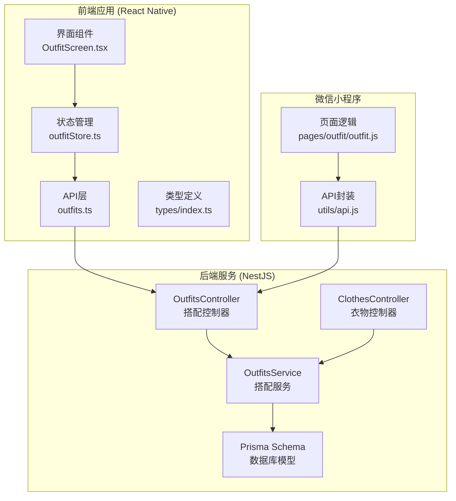
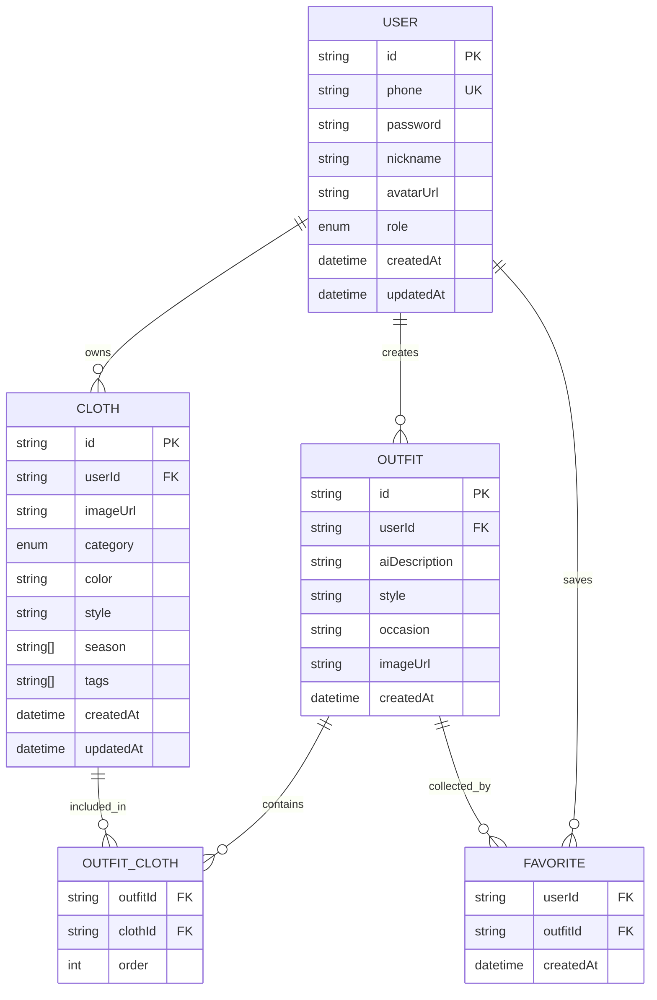
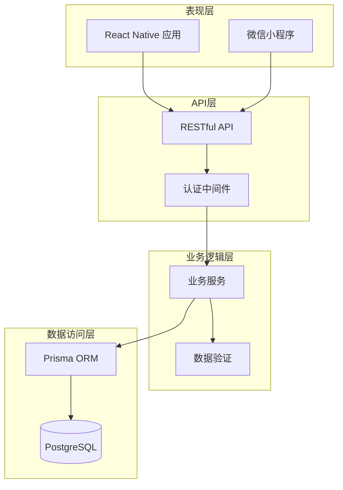
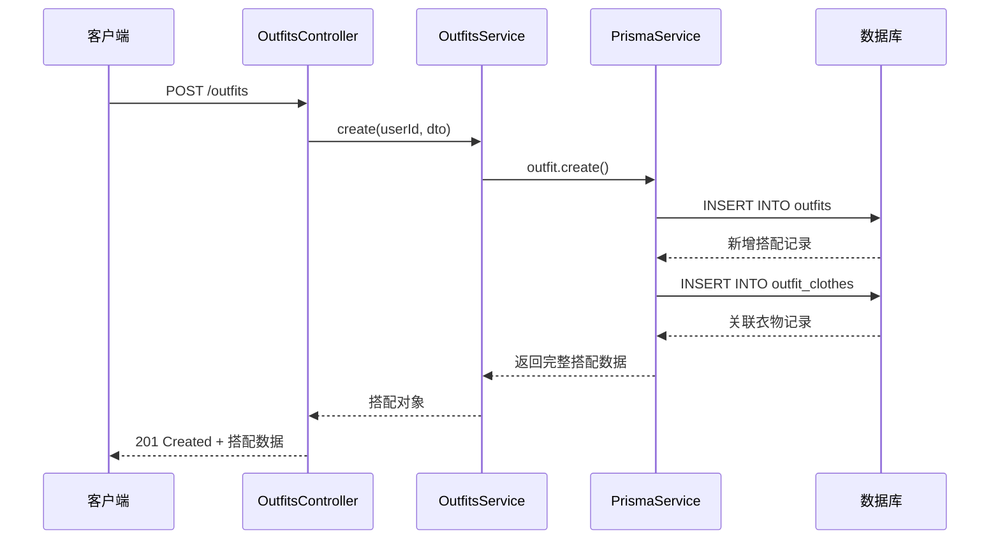
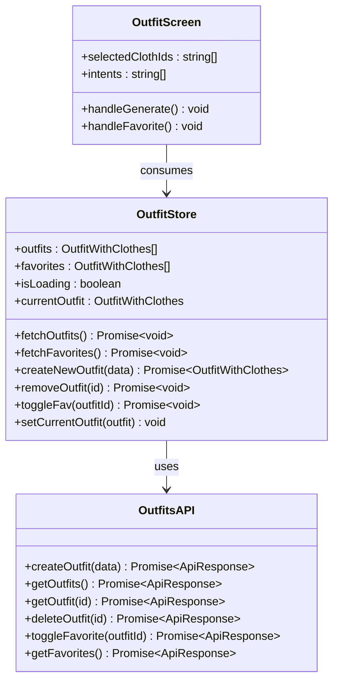
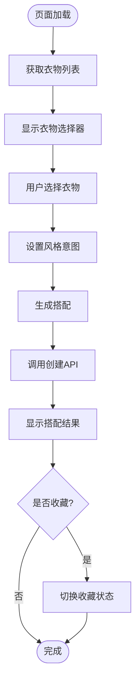
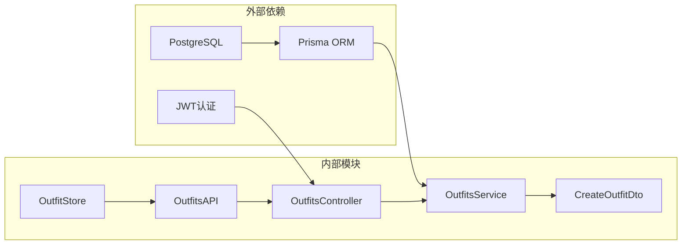

# 搭配管理接口

<cite>
**本文档引用的文件**
- [backend/src/modules/outfits/outfits.controller.ts](file://backend/src/modules/outfits/outfits.controller.ts)
- [backend/src/modules/outfits/outfits.service.ts](file://backend/src/modules/outfits/outfits.service.ts)
- [backend/src/modules/outfits/dto/create-outfit.dto.ts](file://backend/src/modules/outfits/dto/create-outfit.dto.ts)
- [backend/src/modules/clothes/clothes.controller.ts](file://backend/src/modules/clothes/clothes.controller.ts)
- [backend/prisma/schema.prisma](file://backend/prisma/schema.prisma)
- [FreeDressApp/src/api/outfits.ts](file://FreeDressApp/src/api/outfits.ts)
- [FreeDressApp/src/store/outfitStore.ts](file://FreeDressApp/src/store/outfitStore.ts)
- [FreeDressApp/src/types/index.ts](file://FreeDressApp/src/types/index.ts)
- [FreeDressApp/src/screens/OutfitScreen.tsx](file://FreeDressApp/src/screens/OutfitScreen.tsx)
- [FreeDressApp/src/screens/FavoritesScreen.tsx](file://FreeDressApp/src/screens/FavoritesScreen.tsx)
- [FreeDressApp/src/screens/OutfitHistoryScreen.tsx](file://FreeDressApp/src/screens/OutfitHistoryScreen.tsx)
- [FreeDressApp/src/navigation/MainTabNavigator.tsx](file://FreeDressApp/src/navigation/MainTabNavigator.tsx)
- [FreeDressApp/src/store/wardrobeStore.ts](file://FreeDressApp/src/store/wardrobeStore.ts)
- [freeDressWechat/pages/outfit/outfit.js](file://freeDressWechat/pages/outfit/outfit.js)
- [freeDressWechat/utils/api.js](file://freeDressWechat/utils/api.js)
</cite>

## 目录
1. [简介](#简介)
2. [项目结构](#项目结构)
3. [核心组件](#核心组件)
4. [架构概览](#架构概览)
5. [详细组件分析](#详细组件分析)
6. [依赖分析](#依赖分析)
7. [性能考虑](#性能考虑)
8. [故障排除指南](#故障排除指南)
9. [结论](#结论)
10. [附录](#附录)

## 简介

畅搭(FreeDress)应用的搭配管理系统是一个基于React Native和NestJS构建的完整解决方案，为用户提供智能搭配生成、管理和收藏功能。系统支持用户从个人衣橱中选择衣物，通过AI算法生成个性化搭配方案，并提供完整的搭配生命周期管理。

该系统采用前后端分离架构，后端使用NestJS框架和Prisma ORM，前端使用React Native开发移动应用，同时支持微信小程序版本。系统实现了完整的搭配管理功能，包括创建、编辑、删除、查询、收藏和历史记录管理。

## 项目结构

畅搭项目的整体架构采用模块化设计，主要分为三个部分：



**图表来源**
- [backend/src/modules/outfits/outfits.controller.ts:1-65](file://backend/src/modules/outfits/outfits.controller.ts#L1-L65)
- [backend/src/modules/outfits/outfits.service.ts:1-123](file://backend/src/modules/outfits/outfits.service.ts#L1-L123)
- [FreeDressApp/src/api/outfits.ts:1-40](file://FreeDressApp/src/api/outfits.ts#L1-L40)
- [FreeDressApp/src/store/outfitStore.ts:1-90](file://FreeDressApp/src/store/outfitStore.ts#L1-L90)

**章节来源**
- [backend/src/modules/outfits/outfits.controller.ts:1-65](file://backend/src/modules/outfits/outfits.controller.ts#L1-L65)
- [backend/src/modules/outfits/outfits.service.ts:1-123](file://backend/src/modules/outfits/outfits.service.ts#L1-L123)
- [FreeDressApp/src/api/outfits.ts:1-40](file://FreeDressApp/src/api/outfits.ts#L1-L40)

## 核心组件

### 数据模型

系统的核心数据模型围绕"搭配"概念构建，通过关联表实现搭配与衣物的多对多关系：



**图表来源**
- [backend/prisma/schema.prisma:14-131](file://backend/prisma/schema.prisma#L14-L131)

### 搭配数据模型字段定义

| 字段名 | 类型 | 必填 | 描述 | 示例值 |
|--------|------|------|------|--------|
| id | string | 是 | 搭配唯一标识符 | "outfit-uuid" |
| userId | string | 是 | 搭配所属用户ID | "user-uuid" |
| clothIds | string[] | 是 | 衣物ID数组 | ["cloth-1", "cloth-2"] |
| style | string | 否 | 搭配风格标签 | "简约" |
| occasion | string | 否 | 适用场合 | "通勤" |
| aiDescription | string | 否 | AI生成的搭配描述 | "以3件衣物组成的简约搭配" |
| imageUrl | string | 否 | 搭配效果图URL | "https://example.com/image.jpg" |
| createdAt | datetime | 是 | 创建时间 | "2024-01-01T00:00:00Z" |

**章节来源**
- [backend/prisma/schema.prisma:70-88](file://backend/prisma/schema.prisma#L70-L88)
- [FreeDressApp/src/types/index.ts:35-46](file://FreeDressApp/src/types/index.ts#L35-L46)

## 架构概览

畅搭应用采用分层架构设计，确保了良好的可维护性和扩展性：



**图表来源**
- [backend/src/modules/outfits/outfits.controller.ts:1-65](file://backend/src/modules/outfits/outfits.controller.ts#L1-L65)
- [backend/src/modules/outfits/outfits.service.ts:1-123](file://backend/src/modules/outfits/outfits.service.ts#L1-L123)

系统采用JWT认证机制，所有API请求都需要携带有效的访问令牌。控制器层负责处理HTTP请求和响应，服务层实现核心业务逻辑，数据访问层通过Prisma ORM与数据库交互。

## 详细组件分析

### 搭配管理API接口

#### 1. 创建搭配

**接口定义**
- 方法: POST
- 路径: `/outfits`
- 认证: 需要JWT令牌
- 请求体: CreateOutfitDto

**请求参数**

| 参数名 | 类型 | 必填 | 描述 |
|--------|------|------|------|
| clothIds | string[] | 是 | 衣物ID数组，至少包含一个元素 |
| style | string | 否 | 搭配风格标签 |
| occasion | string | 否 | 适用场合 |
| aiDescription | string | 否 | AI生成的搭配描述 |
| imageUrl | string | 否 | 搭配效果图URL |

**响应数据结构**
```typescript
{
  id: string,
  userId: string,
  style?: string,
  occasion?: string,
  aiDescription?: string,
  imageUrl?: string,
  createdAt: string,
  outfitClothes: [
    {
      clothId: string,
      order: number,
      cloth: Cloth
    }
  ]
}
```

**业务逻辑流程**



**图表来源**
- [backend/src/modules/outfits/outfits.controller.ts:17-24](file://backend/src/modules/outfits/outfits.controller.ts#L17-L24)
- [backend/src/modules/outfits/outfits.service.ts:9-33](file://backend/src/modules/outfits/outfits.service.ts#L9-L33)

**章节来源**
- [backend/src/modules/outfits/outfits.controller.ts:17-24](file://backend/src/modules/outfits/outfits.controller.ts#L17-L24)
- [backend/src/modules/outfits/outfits.service.ts:9-33](file://backend/src/modules/outfits/outfits.service.ts#L9-L33)
- [backend/src/modules/outfits/dto/create-outfit.dto.ts:1-31](file://backend/src/modules/outfits/dto/create-outfit.dto.ts#L1-L31)

#### 2. 获取搭配列表

**接口定义**
- 方法: GET
- 路径: `/outfits`
- 认证: 需要JWT令牌

**响应数据**
返回当前用户的所有搭配记录，按创建时间降序排列，包含每件搭配的收藏数量统计。

**章节来源**
- [backend/src/modules/outfits/outfits.controller.ts:26-30](file://backend/src/modules/outfits/outfits.controller.ts#L26-L30)
- [backend/src/modules/outfits/outfits.service.ts:35-47](file://backend/src/modules/outfits/outfits.service.ts#L35-L47)

#### 3. 获取搭配详情

**接口定义**
- 方法: GET
- 路径: `/outfits/:id`
- 认证: 需要JWT令牌

**权限控制**
- 只有搭配的创建者才能访问该搭配的详细信息
- 系统会验证用户身份和搭配所有权

**响应数据**
包含完整的搭配信息以及收藏状态标记。

**章节来源**
- [backend/src/modules/outfits/outfits.controller.ts:38-45](file://backend/src/modules/outfits/outfits.controller.ts#L38-L45)
- [backend/src/modules/outfits/outfits.service.ts:49-73](file://backend/src/modules/outfits/outfits.service.ts#L49-L73)

#### 4. 删除搭配

**接口定义**
- 方法: DELETE
- 路径: `/outfits/:id`
- 认证: 需要JWT令牌

**业务逻辑**
- 先验证搭配存在性和用户权限
- 删除对应的搭配记录
- 系统自动清理相关的收藏和关联数据

**章节来源**
- [backend/src/modules/outfits/outfits.controller.ts:47-54](file://backend/src/modules/outfits/outfits.controller.ts#L47-L54)
- [backend/src/modules/outfits/outfits.service.ts:75-79](file://backend/src/modules/outfits/outfits.service.ts#L75-L79)

#### 5. 收藏/取消收藏搭配

**接口定义**
- 方法: POST
- 路径: `/outfits/:id/favorite`
- 认证: 需要JWT令牌

**响应数据**
```typescript
{
  favorited: boolean
}
```

**业务逻辑**
- 如果用户已收藏该搭配，则执行取消收藏操作
- 如果用户未收藏该搭配，则执行收藏操作
- 返回最新的收藏状态

**章节来源**
- [backend/src/modules/outfits/outfits.controller.ts:56-63](file://backend/src/modules/outfits/outfits.controller.ts#L56-L63)
- [backend/src/modules/outfits/outfits.service.ts:81-102](file://backend/src/modules/outfits/outfits.service.ts#L81-L102)

#### 6. 获取收藏列表

**接口定义**
- 方法: GET
- 路径: `/outfits/favorites`
- 认证: 需要JWT令牌

**响应数据**
返回当前用户收藏的所有搭配，按收藏时间降序排列。

**章节来源**
- [backend/src/modules/outfits/outfits.controller.ts:32-36](file://backend/src/modules/outfits/outfits.controller.ts#L32-L36)
- [backend/src/modules/outfits/outfits.service.ts:104-121](file://backend/src/modules/outfits/outfits.service.ts#L104-L121)

### 前端集成实现

#### React Native前端集成

**API封装层**


**图表来源**
- [FreeDressApp/src/api/outfits.ts:1-40](file://FreeDressApp/src/api/outfits.ts#L1-L40)
- [FreeDressApp/src/store/outfitStore.ts:1-90](file://FreeDressApp/src/store/outfitStore.ts#L1-L90)
- [FreeDressApp/src/screens/OutfitScreen.tsx:1-603](file://FreeDressApp/src/screens/OutfitScreen.tsx#L1-L603)

**章节来源**
- [FreeDressApp/src/api/outfits.ts:1-40](file://FreeDressApp/src/api/outfits.ts#L1-L40)
- [FreeDressApp/src/store/outfitStore.ts:1-90](file://FreeDressApp/src/store/outfitStore.ts#L1-L90)
- [FreeDressApp/src/screens/OutfitScreen.tsx:1-603](file://FreeDressApp/src/screens/OutfitScreen.tsx#L1-L603)

#### 微信小程序集成

**页面逻辑实现**


**图表来源**
- [freeDressWechat/pages/outfit/outfit.js:1-107](file://freeDressWechat/pages/outfit/outfit.js#L1-L107)

**章节来源**
- [freeDressWechat/pages/outfit/outfit.js:1-107](file://freeDressWechat/pages/outfit/outfit.js#L1-L107)
- [freeDressWechat/utils/api.js:32-40](file://freeDressWechat/utils/api.js#L32-L40)

### 数据验证规则

系统在多个层面实施数据验证：

1. **后端验证** (DTO级别)
   - `clothIds`: 必须是非空数组，至少包含一个字符串元素
   - 所有字符串字段都必须是有效的非空字符串
   - 可选字段允许为空值

2. **业务逻辑验证**
   - 用户权限验证：确保只有搭配创建者可以访问和修改
   - 数据完整性检查：验证关联数据的一致性
   - 重复数据防止：避免重复收藏同一搭配

3. **前端验证**
   - 用户输入验证：确保用户选择了至少一件衣物
   - 界面状态管理：保持UI状态与数据状态同步

**章节来源**
- [backend/src/modules/outfits/dto/create-outfit.dto.ts:1-31](file://backend/src/modules/outfits/dto/create-outfit.dto.ts#L1-L31)
- [backend/src/modules/outfits/outfits.service.ts:49-73](file://backend/src/modules/outfits/outfits.service.ts#L49-L73)

## 依赖分析

### 组件耦合关系



**图表来源**
- [backend/src/modules/outfits/outfits.controller.ts:1-65](file://backend/src/modules/outfits/outfits.controller.ts#L1-L65)
- [backend/src/modules/outfits/outfits.service.ts:1-123](file://backend/src/modules/outfits/outfits.service.ts#L1-L123)
- [FreeDressApp/src/store/outfitStore.ts:1-90](file://FreeDressApp/src/store/outfitStore.ts#L1-L90)

### 数据流分析

系统遵循清晰的数据流向模式：

1. **请求流向**: 客户端 → 控制器 → 服务 → 数据库
2. **响应流向**: 数据库 → 服务 → 控制器 → 客户端
3. **状态流向**: 数据库 → 状态管理 → UI组件

**章节来源**
- [backend/src/modules/outfits/outfits.controller.ts:1-65](file://backend/src/modules/outfits/outfits.controller.ts#L1-L65)
- [backend/src/modules/outfits/outfits.service.ts:1-123](file://backend/src/modules/outfits/outfits.service.ts#L1-L123)

## 性能考虑

### 数据库优化

1. **索引策略**
   - 用户ID字段建立索引，优化查询性能
   - 多对多关联表使用复合主键，确保数据一致性

2. **查询优化**
   - 使用`orderBy`和`include`优化复杂查询
   - 实现分页和限制返回数据量的机制

3. **连接池管理**
   - 配置合适的连接池大小
   - 实现连接超时和重试机制

### 前端性能优化

1. **状态管理**
   - 使用Zustand实现轻量级状态管理
   - 避免不必要的组件重渲染

2. **网络请求优化**
   - 实现请求缓存机制
   - 支持并发请求的去重

3. **UI渲染优化**
   - 使用FlatList优化长列表渲染
   - 实现虚拟化列表提升性能

## 故障排除指南

### 常见问题及解决方案

**1. 认证失败**
- 检查JWT令牌是否有效和未过期
- 验证用户账户状态
- 确认API请求头包含正确的Authorization字段

**2. 权限不足**
- 确保用户对目标资源具有适当权限
- 检查资源所有权验证逻辑
- 验证用户角色和权限级别

**3. 数据验证错误**
- 检查请求数据格式是否符合DTO定义
- 验证必填字段是否完整
- 确认数据类型和范围约束

**4. 数据库连接问题**
- 检查数据库连接字符串配置
- 验证数据库服务状态
- 实现连接重试和降级策略

**章节来源**
- [backend/src/modules/outfits/outfits.service.ts:61-66](file://backend/src/modules/outfits/outfits.service.ts#L61-L66)
- [backend/src/modules/outfits/outfits.service.ts:83-85](file://backend/src/modules/outfits/outfits.service.ts#L83-L85)

## 结论

畅搭(FreeDress)搭配管理系统通过精心设计的架构和完善的API接口，为用户提供了完整的智能搭配管理体验。系统采用现代化的技术栈，实现了高可用性、可扩展性和良好的用户体验。

**核心优势**:
- 清晰的分层架构设计
- 完善的认证和授权机制
- 丰富的前端集成选项
- 可扩展的数据库模型
- 优秀的性能和可靠性

**未来发展方向**:
- 增强AI搭配算法的智能化程度
- 扩展社交分享和社区功能
- 优化移动端用户体验
- 增加更多个性化推荐算法

## 附录

### API调用示例

**创建搭配 (JavaScript)**
```javascript
// 基础调用
const response = await fetch('/outfits', {
  method: 'POST',
  headers: {
    'Content-Type': 'application/json',
    'Authorization': 'Bearer YOUR_JWT_TOKEN'
  },
  body: JSON.stringify({
    clothIds: ['cloth-1', 'cloth-2'],
    style: '简约',
    occasion: '通勤'
  })
});

const outfit = await response.json();
```

**获取搭配列表 (TypeScript)**
```typescript
// 使用封装的API函数
const { data: outfits } = await getOutfits();

// 使用原生fetch
const response = await fetch('/outfits', {
  headers: {
    'Authorization': `Bearer ${accessToken}`
  }
});
const { data } = await response.json();
```

**收藏搭配 (React Native)**
```typescript
// 在组件中使用
const handleFavorite = useCallback(async () => {
  if (!currentOutfit) return;
  
  try {
    const { data } = await toggleFavorite(currentOutfit.id);
    // 更新本地状态
    setOutfitState(prev => ({
      ...prev,
      isFavorited: data.favorited
    }));
  } catch (error) {
    console.error('收藏失败:', error);
  }
}, [currentOutfit]);
```

### 最佳实践建议

1. **错误处理**
   - 实现统一的错误处理机制
   - 提供友好的用户反馈
   - 记录详细的错误日志

2. **安全性**
   - 实施严格的输入验证
   - 使用HTTPS协议传输数据
   - 定期更新和审计安全配置

3. **可维护性**
   - 编写清晰的代码注释
   - 实现单元测试和集成测试
   - 定期进行代码审查

4. **性能监控**
   - 实施APM监控工具
   - 监控API响应时间和错误率
   - 定期分析性能瓶颈