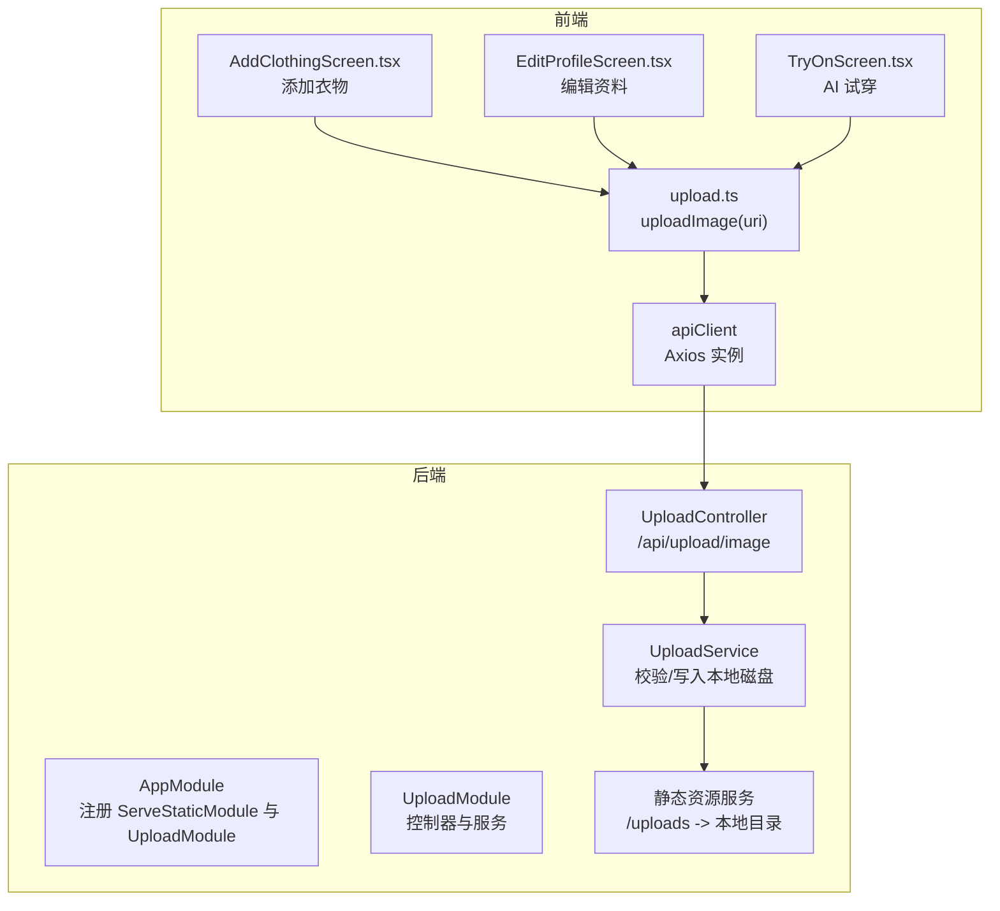
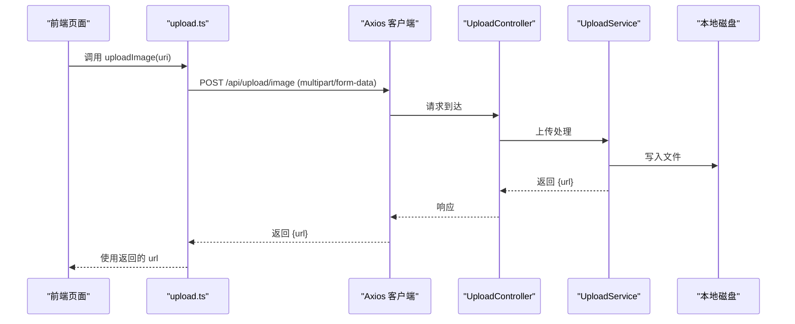
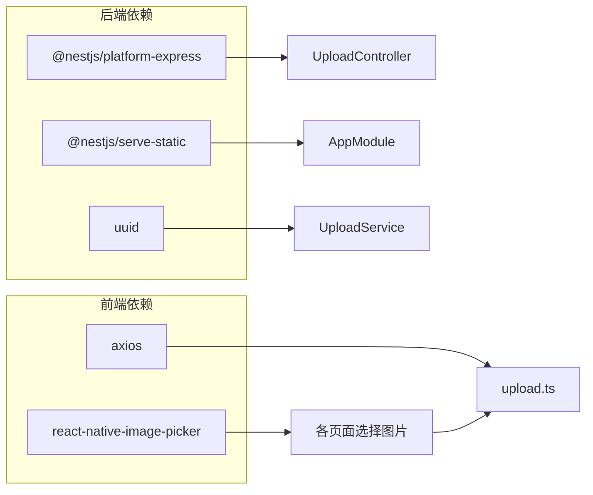

# 文件上传接口

<cite>
**本文引用的文件**
- [backend/src/modules/upload/upload.controller.ts](file://backend/src/modules/upload/upload.controller.ts)
- [backend/src/modules/upload/upload.service.ts](file://backend/src/modules/upload/upload.service.ts)
- [backend/src/modules/upload/upload.module.ts](file://backend/src/modules/upload/upload.module.ts)
- [backend/src/app.module.ts](file://backend/src/app.module.ts)
- [backend/src/main.ts](file://backend/src/main.ts)
- [FreeDressApp/src/api/upload.ts](file://FreeDressApp/src/api/upload.ts)
- [FreeDressApp/src/screens/AddClothingScreen.tsx](file://FreeDressApp/src/screens/AddClothingScreen.tsx)
- [FreeDressApp/src/screens/EditProfileScreen.tsx](file://FreeDressApp/src/screens/EditProfileScreen.tsx)
- [FreeDressApp/src/screens/TryOnScreen.tsx](file://FreeDressApp/src/screens/TryOnScreen.tsx)
- [backend/package.json](file://backend/package.json)
- [FreeDressApp/package.json](file://FreeDressApp/package.json)
</cite>

## 目录
1. [简介](#简介)
2. [项目结构](#项目结构)
3. [核心组件](#核心组件)
4. [架构总览](#架构总览)
5. [详细组件分析](#详细组件分析)
6. [依赖关系分析](#依赖关系分析)
7. [性能考虑](#性能考虑)
8. [故障排查指南](#故障排查指南)
9. [结论](#结论)
10. [附录](#附录)

## 简介
本文件为畅搭（FreeDress）应用的文件上传接口完整文档，覆盖图片上传、文件处理与存储管理、数据模型与字段定义、接口规范（类型/大小/格式限制）、处理流程（压缩/缩放/格式转换）、存储策略与云存储集成建议、访问与下载规范、安全检查与病毒扫描机制、API 调用示例与前端组件集成指南，以及性能优化与错误处理策略。

## 项目结构
后端采用 NestJS 架构，文件上传模块位于 backend/src/modules/upload；前端 React Native 应用通过 API 客户端调用后端上传接口，并在多个业务页面中集成使用。

图表来源
- [backend/src/app.module.ts:14-30](file://backend/src/app.module.ts#L14-L30)
- [backend/src/modules/upload/upload.module.ts:5-10](file://backend/src/modules/upload/upload.module.ts#L5-L10)
- [backend/src/modules/upload/upload.controller.ts:29-49](file://backend/src/modules/upload/upload.controller.ts#L29-L49)
- [backend/src/modules/upload/upload.service.ts:17-47](file://backend/src/modules/upload/upload.service.ts#L17-L47)
- [FreeDressApp/src/api/upload.ts:4-20](file://FreeDressApp/src/api/upload.ts#L4-L20)

章节来源
- [backend/src/app.module.ts:14-30](file://backend/src/app.module.ts#L14-L30)
- [backend/src/modules/upload/upload.module.ts:5-10](file://backend/src/modules/upload/upload.module.ts#L5-L10)
- [backend/src/modules/upload/upload.controller.ts:29-49](file://backend/src/modules/upload/upload.controller.ts#L29-L49)
- [backend/src/modules/upload/upload.service.ts:17-47](file://backend/src/modules/upload/upload.service.ts#L17-L47)
- [FreeDressApp/src/api/upload.ts:4-20](file://FreeDressApp/src/api/upload.ts#L4-L20)

## 核心组件
- 后端上传控制器：提供受 JWT 保护的图片上传接口，使用文件拦截器接收二进制流。
- 上传服务：执行文件类型与大小校验，生成唯一文件名，写入本地 uploads 目录，并返回可访问的相对路径。
- 前端上传 API：封装 multipart/form-data 请求，将原生图片 URI 转换为表单数据并提交。
- 静态资源服务：将本地 uploads 目录映射为 /uploads 访问路径，便于直接下载。

章节来源
- [backend/src/modules/upload/upload.controller.ts:33-49](file://backend/src/modules/upload/upload.controller.ts#L33-L49)
- [backend/src/modules/upload/upload.service.ts:25-47](file://backend/src/modules/upload/upload.service.ts#L25-L47)
- [FreeDressApp/src/api/upload.ts:4-20](file://FreeDressApp/src/api/upload.ts#L4-L20)
- [backend/src/app.module.ts:19-22](file://backend/src/app.module.ts#L19-L22)

## 架构总览
后端通过 Swagger 暴露 API 文档，设置全局前缀 /api，并启用 CORS。上传接口为受保护的 POST /api/upload/image，前端通过 Axios 客户端发起请求，后端将文件写入本地磁盘并通过 /uploads 路径提供访问。

图表来源
- [FreeDressApp/src/api/upload.ts:4-20](file://FreeDressApp/src/api/upload.ts#L4-L20)
- [backend/src/modules/upload/upload.controller.ts:33-49](file://backend/src/modules/upload/upload.controller.ts#L33-L49)
- [backend/src/modules/upload/upload.service.ts:25-47](file://backend/src/modules/upload/upload.service.ts#L25-L47)

## 详细组件分析

### 后端上传控制器
- 路由：POST /api/upload/image
- 认证：JWT 授权守卫
- 参数：multipart/form-data，字段名为 file 的二进制流
- 响应：统一包装后的 JSON，包含 url 字段

章节来源
- [backend/src/modules/upload/upload.controller.ts:29-49](file://backend/src/modules/upload/upload.controller.ts#L29-L49)

### 上传服务
- 输入：Multer 文件对象（fieldname/originalname/encoding/mimetype/size/buffer）
- 校验：
  - 类型：仅允许 image/jpeg、image/png、image/webp、image/gif
  - 大小：不超过 10MB
- 存储：
  - 目录：process.cwd()/uploads
  - 命名：UUID + 原扩展名
  - 返回：/uploads/{filename} 相对 URL
- 错误：缺失文件或不满足条件时抛出 400

章节来源
- [backend/src/modules/upload/upload.service.ts:25-47](file://backend/src/modules/upload/upload.service.ts#L25-L47)

### 前端上传 API
- 功能：将原生图片 URI 转换为 FormData，字段 file 对应二进制内容
- Content-Type：multipart/form-data
- 返回：Promise<ApiResponse<{ url: string }>>

章节来源
- [FreeDressApp/src/api/upload.ts:4-20](file://FreeDressApp/src/api/upload.ts#L4-L20)

### 静态资源服务
- 将 uploads 目录映射为 /uploads 前缀，便于直接访问已上传文件
- 与 ServeStaticModule 配置配合

章节来源
- [backend/src/app.module.ts:19-22](file://backend/src/app.module.ts#L19-L22)

### 前端页面集成
- 添加衣物：选择图片后上传，得到 url 后提交衣物信息
- 编辑资料：头像变更时上传，更新用户资料
- AI 试穿：上传全身照，生成试穿结果

章节来源
- [FreeDressApp/src/screens/AddClothingScreen.tsx:61-87](file://FreeDressApp/src/screens/AddClothingScreen.tsx#L61-L87)
- [FreeDressApp/src/screens/EditProfileScreen.tsx:55-77](file://FreeDressApp/src/screens/EditProfileScreen.tsx#L55-L77)
- [FreeDressApp/src/screens/TryOnScreen.tsx:65-83](file://FreeDressApp/src/screens/TryOnScreen.tsx#L65-L83)

## 依赖关系分析
- 后端依赖：
  - @nestjs/platform-express：文件上传中间件
  - @nestjs/serve-static：静态资源服务
  - uuid：生成唯一文件名
- 前端依赖：
  - axios：HTTP 客户端
  - react-native-image-picker：图片选择与相机拍摄

图表来源
- [backend/package.json:26-44](file://backend/package.json#L26-L44)
- [FreeDressApp/package.json:12-30](file://FreeDressApp/package.json#L12-L30)

章节来源
- [backend/package.json:26-44](file://backend/package.json#L26-L44)
- [FreeDressApp/package.json:12-30](file://FreeDressApp/package.json#L12-L30)

## 性能考虑
- 本地磁盘写入：适合开发与小规模场景，生产环境建议迁移到云存储（见“存储策略”）。
- 文件大小限制：10MB，避免大文件占用带宽与存储。
- 建议优化：
  - 前端预压缩/缩放：在上传前裁剪尺寸与质量，减少体积。
  - 并发控制：限制同时上传数量，避免阻塞。
  - CDN 加速：结合云存储与 CDN 提升访问速度。
  - 分片上传：对超大文件采用断点续传。
  - 缓存策略：对常用图片设置合理的缓存头。

## 故障排查指南
- 常见错误与原因：
  - 400 未选择文件：前端未正确构造 FormData 或未选择图片
  - 400 格式不支持：mimetype 不在允许列表
  - 400 超过大小限制：文件超过 10MB
  - 401 未授权：缺少或无效的 JWT
  - 500 服务器异常：磁盘写入失败或权限问题
- 排查步骤：
  - 检查前端是否设置了正确的 Content-Type 且包含 file 字段
  - 校验文件 MIME 与大小
  - 确认 JWT 已附加到请求头
  - 检查 uploads 目录是否存在且具备写权限
  - 查看后端日志与 Swagger 文档定位具体错误

章节来源
- [backend/src/modules/upload/upload.service.ts:25-47](file://backend/src/modules/upload/upload.service.ts#L25-L47)
- [backend/src/modules/upload/upload.controller.ts:33-49](file://backend/src/modules/upload/upload.controller.ts#L33-L49)
- [backend/src/main.ts:40-48](file://backend/src/main.ts#L40-L48)

## 结论
当前实现提供了简洁可靠的本地图片上传能力，满足基础业务需求。建议在生产环境中引入云存储与 CDN，增强可扩展性与可靠性；同时完善安全与病毒扫描机制，确保文件内容安全。

## 附录

### 接口规范

- 基础信息
  - 基础路径：/api
  - 全局前缀：/api
  - 文档地址：/api/docs

- 上传图片
  - 方法：POST
  - 路径：/api/upload/image
  - 认证：Bearer Token（JWT）
  - 请求体：multipart/form-data
    - 字段：file（二进制）
  - 成功响应：{ url: string }（相对路径，如 /uploads/{filename}）

- 访问与下载
  - 路径：/uploads/{filename}
  - 说明：由 ServeStaticModule 提供静态文件服务

章节来源
- [backend/src/modules/upload/upload.controller.ts:33-49](file://backend/src/modules/upload/upload.controller.ts#L33-L49)
- [backend/src/app.module.ts:19-22](file://backend/src/app.module.ts#L19-L22)
- [backend/src/main.ts:40-48](file://backend/src/main.ts#L40-L48)

### 数据模型与字段定义
- 上传请求参数
  - file: 二进制文件（image/*）
- 上传响应
  - url: string（后端返回的相对路径）

章节来源
- [backend/src/modules/upload/upload.controller.ts:39-46](file://backend/src/modules/upload/upload.controller.ts#L39-L46)
- [backend/src/modules/upload/upload.service.ts:46](file://backend/src/modules/upload/upload.service.ts#L46)

### 文件类型与大小限制
- 类型：image/jpeg、image/png、image/webp、image/gif
- 大小：≤ 10MB

章节来源
- [backend/src/modules/upload/upload.service.ts:30-38](file://backend/src/modules/upload/upload.service.ts#L30-L38)

### 处理流程（当前与建议）
- 当前流程
  - 前端构造 FormData，发送 file 字段
  - 后端校验类型与大小
  - 生成 UUID 文件名并写入本地 uploads 目录
  - 返回 /uploads/{filename}
- 建议流程（生产）
  - 前端预处理：压缩/缩放/裁剪
  - 后端接入云存储 SDK：上传至对象存储（如 OSS/COS/S3），返回可访问 URL
  - 可选：格式转换（WebP/JPEG）、水印、元数据提取
  - 可选：异步病毒扫描与内容审核

章节来源
- [FreeDressApp/src/api/upload.ts:4-20](file://FreeDressApp/src/api/upload.ts#L4-L20)
- [backend/src/modules/upload/upload.service.ts:25-47](file://backend/src/modules/upload/upload.service.ts#L25-L47)

### 存储策略与云存储集成
- 本地策略
  - 优点：部署简单、开发调试方便
  - 局限：单节点、扩展性差、备份复杂
- 云存储建议
  - 选择：OSS（阿里云）、COS（腾讯云）、S3（AWS）等
  - 流程：前端直传（预签名 URL）或后端代理上传
  - 安全：私有读取、CDN 加速、防盗链
  - 成本：按量计费、生命周期管理

章节来源
- [backend/src/app.module.ts:19-22](file://backend/src/app.module.ts#L19-L22)

### 安全检查与病毒扫描
- 传输安全
  - HTTPS 必须
  - JWT 严格校验与刷新机制
- 内容安全
  - 文件类型白名单校验（已在后端实现）
  - 大小限制（已在后端实现）
  - 病毒扫描：对接第三方扫描服务（如 VirusTotal API、云厂商安全服务）
  - 内容审核：敏感图片/文本识别（可选）
- 存储安全
  - 仅公开必要文件，其余私有化
  - 设置合适的 CORS 与防盗链策略

章节来源
- [backend/src/modules/upload/upload.service.ts:30-38](file://backend/src/modules/upload/upload.service.ts#L30-L38)
- [backend/src/main.ts:32-35](file://backend/src/main.ts#L32-L35)

### API 调用示例与前端集成
- 前端调用
  - 函数：uploadImage(uri)
  - 行为：构造 FormData，设置 Content-Type，POST 到 /api/upload/image
- 页面集成
  - 添加衣物：选择图片后上传，得到 url 后提交衣物信息
  - 编辑资料：头像变更时上传，更新用户资料
  - AI 试穿：上传全身照，生成试穿结果

章节来源
- [FreeDressApp/src/api/upload.ts:4-20](file://FreeDressApp/src/api/upload.ts#L4-L20)
- [FreeDressApp/src/screens/AddClothingScreen.tsx:61-87](file://FreeDressApp/src/screens/AddClothingScreen.tsx#L61-L87)
- [FreeDressApp/src/screens/EditProfileScreen.tsx:55-77](file://FreeDressApp/src/screens/EditProfileScreen.tsx#L55-L77)
- [FreeDressApp/src/screens/TryOnScreen.tsx:65-83](file://FreeDressApp/src/screens/TryOnScreen.tsx#L65-L83)

### 错误处理策略
- 前端
  - 捕获异常并提示用户
  - 上传状态管理（loading/错误/完成）
- 后端
  - 统一异常过滤器与响应拦截器
  - 明确的错误码与消息
  - 日志记录与告警

章节来源
- [backend/src/main.ts:24-29](file://backend/src/main.ts#L24-L29)