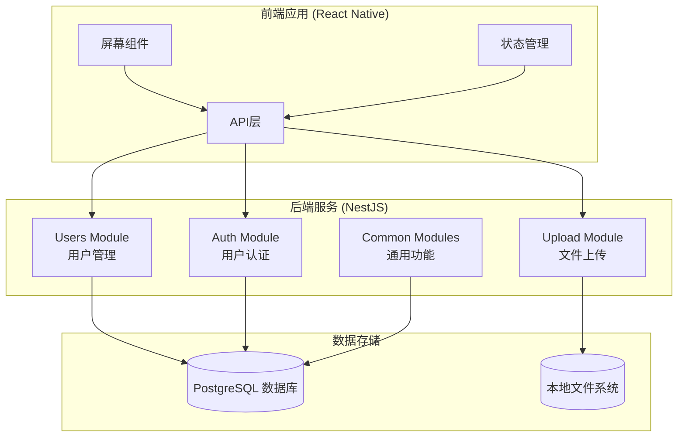
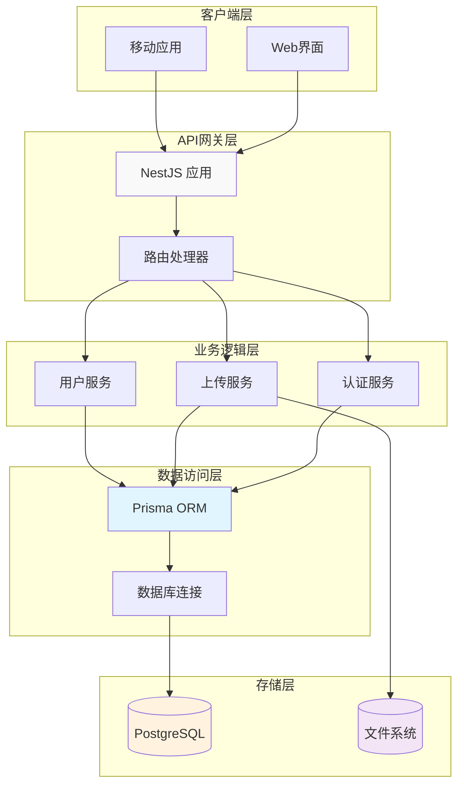
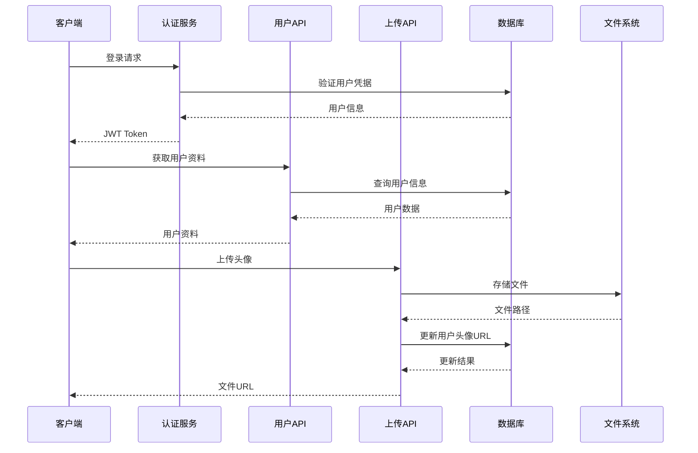
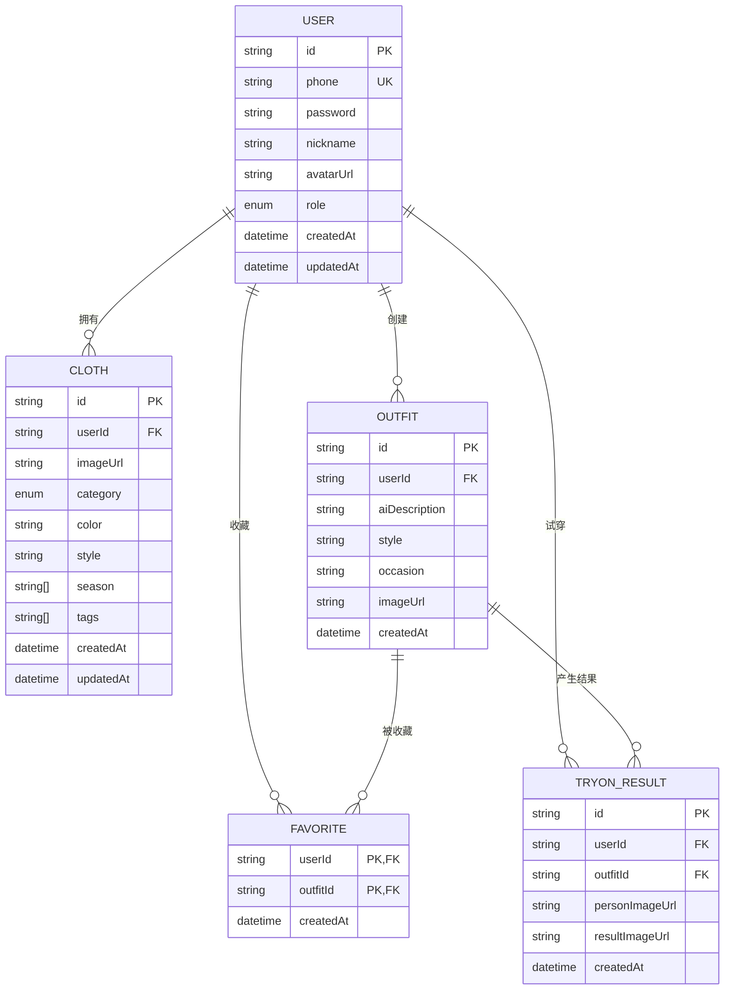
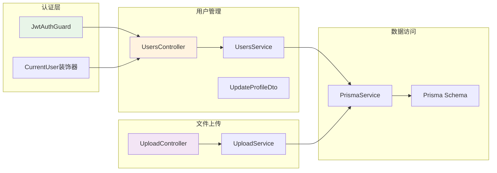

# 用户管理接口

<cite>
**本文档引用的文件**
- [backend/src/modules/users/users.controller.ts](file://backend/src/modules/users/users.controller.ts)
- [backend/src/modules/users/users.service.ts](file://backend/src/modules/users/users.service.ts)
- [backend/src/modules/users/dto/update-profile.dto.ts](file://backend/src/modules/users/dto/update-profile.dto.ts)
- [backend/src/modules/upload/upload.controller.ts](file://backend/src/modules/upload/upload.controller.ts)
- [backend/src/modules/upload/upload.service.ts](file://backend/src/modules/upload/upload.service.ts)
- [backend/src/common/guards/jwt-auth.guard.ts](file://backend/src/common/guards/jwt-auth.guard.ts)
- [backend/src/common/decorators/current-user.decorator.ts](file://backend/src/common/decorators/current-user.decorator.ts)
- [backend/prisma/schema.prisma](file://backend/prisma/schema.prisma)
- [backend/src/modules/auth/auth.controller.ts](file://backend/src/modules/auth/auth.controller.ts)
- [backend/src/modules/auth/auth.service.ts](file://backend/src/modules/auth/auth.service.ts)
- [FreeDressApp/src/api/users.ts](file://FreeDressApp/src/api/users.ts)
- [FreeDressApp/src/api/upload.ts](file://FreeDressApp/src/api/upload.ts)
</cite>

## 目录
1. [简介](#简介)
2. [项目结构](#项目结构)
3. [核心组件](#核心组件)
4. [架构概览](#架构概览)
5. [详细组件分析](#详细组件分析)
6. [依赖分析](#依赖分析)
7. [性能考虑](#性能考虑)
8. [故障排除指南](#故障排除指南)
9. [结论](#结论)
10. [附录](#附录)

## 简介

畅搭(FreeDress)应用的用户管理接口提供了完整的用户资料管理功能，包括用户信息查询、个人资料更新、头像上传以及用户统计数据获取。本系统采用前后端分离架构，后端基于NestJS框架构建RESTful API，前端使用React Native开发移动应用。

系统的核心特性包括：
- 基于JWT的用户认证和授权机制
- 完整的用户资料管理功能
- 安全的文件上传和存储策略
- 实时的用户统计数据展示
- 响应式设计的移动端用户体验

## 项目结构

畅搭项目的整体架构采用模块化设计，主要分为三个部分：



**图表来源**
- [backend/src/modules/users/users.controller.ts:1-49](file://backend/src/modules/users/users.controller.ts#L1-L49)
- [backend/src/modules/upload/upload.controller.ts:1-51](file://backend/src/modules/upload/upload.controller.ts#L1-L51)
- [backend/src/modules/auth/auth.controller.ts:1-92](file://backend/src/modules/auth/auth.controller.ts#L1-L92)

**章节来源**
- [backend/src/modules/users/users.controller.ts:1-49](file://backend/src/modules/users/users.controller.ts#L1-L49)
- [backend/src/modules/upload/upload.controller.ts:1-51](file://backend/src/modules/upload/upload.controller.ts#L1-L51)
- [backend/src/modules/auth/auth.controller.ts:1-92](file://backend/src/modules/auth/auth.controller.ts#L1-L92)

## 核心组件

### 用户管理模块

用户管理模块是整个系统的核心功能模块，负责处理所有与用户相关的业务逻辑。该模块包含以下关键组件：

#### 用户控制器 (UsersController)
- 提供RESTful API接口
- 实现JWT认证保护
- 处理用户资料查询和更新

#### 用户服务 (UsersService)
- 实现业务逻辑处理
- 管理数据库交互
- 提供数据验证和转换

#### DTO定义 (UpdateProfileDto)
- 定义请求参数结构
- 实现数据验证规则
- 提供API文档元数据

**章节来源**
- [backend/src/modules/users/users.controller.ts:1-49](file://backend/src/modules/users/users.controller.ts#L1-L49)
- [backend/src/modules/users/users.service.ts:1-102](file://backend/src/modules/users/users.service.ts#L1-L102)
- [backend/src/modules/users/dto/update-profile.dto.ts:1-19](file://backend/src/modules/users/dto/update-profile.dto.ts#L1-L19)

### 文件上传模块

文件上传模块专门处理用户头像上传功能，确保文件安全和高效传输：

#### 上传控制器 (UploadController)
- 处理multipart/form-data请求
- 实现文件类型和大小验证
- 返回上传后的文件URL

#### 上传服务 (UploadService)
- 实现文件存储逻辑
- 执行安全检查
- 生成唯一文件名

**章节来源**
- [backend/src/modules/upload/upload.controller.ts:1-51](file://backend/src/modules/upload/upload.controller.ts#L1-L51)
- [backend/src/modules/upload/upload.service.ts:1-49](file://backend/src/modules/upload/upload.service.ts#L1-L49)

### 认证模块

认证模块提供用户登录、注册和会话管理功能：

#### 认证控制器 (AuthController)
- 处理用户注册和登录
- 管理验证码系统
- 实现Token刷新机制

#### 认证服务 (AuthService)
- 实现密码加密和验证
- 管理JWT Token生命周期
- 处理忘记密码流程

**章节来源**
- [backend/src/modules/auth/auth.controller.ts:1-92](file://backend/src/modules/auth/auth.controller.ts#L1-L92)
- [backend/src/modules/auth/auth.service.ts:1-279](file://backend/src/modules/auth/auth.service.ts#L1-L279)

## 架构概览

畅搭系统的整体架构采用分层设计，确保了良好的可维护性和扩展性：



**图表来源**
- [backend/src/modules/users/users.controller.ts:1-49](file://backend/src/modules/users/users.controller.ts#L1-L49)
- [backend/src/modules/upload/upload.controller.ts:1-51](file://backend/src/modules/upload/upload.controller.ts#L1-L51)
- [backend/src/modules/auth/auth.controller.ts:1-92](file://backend/src/modules/auth/auth.controller.ts#L1-L92)

### 数据流图



**图表来源**
- [backend/src/modules/auth/auth.service.ts:102-135](file://backend/src/modules/auth/auth.service.ts#L102-L135)
- [backend/src/modules/users/users.service.ts:18-44](file://backend/src/modules/users/users.service.ts#L18-L44)
- [backend/src/modules/upload/upload.service.ts:25-47](file://backend/src/modules/upload/upload.service.ts#L25-L47)

## 详细组件分析

### 用户数据模型

畅搭系统采用Prisma ORM定义用户数据模型，确保数据一致性和完整性：



**图表来源**
- [backend/prisma/schema.prisma:14-31](file://backend/prisma/schema.prisma#L14-L31)
- [backend/prisma/schema.prisma:40-59](file://backend/prisma/schema.prisma#L40-L59)
- [backend/prisma/schema.prisma:71-88](file://backend/prisma/schema.prisma#L71-L88)
- [backend/prisma/schema.prisma:104-114](file://backend/prisma/schema.prisma#L104-L114)
- [backend/prisma/schema.prisma:117-131](file://backend/prisma/schema.prisma#L117-L131)

#### 用户模型字段定义

| 字段名 | 类型 | 约束 | 描述 | 默认值 |
|--------|------|------|------|--------|
| id | String | 主键, UUID | 用户唯一标识符 | 自动生成 |
| phone | String | 唯一索引 | 用户手机号码 | 必填 |
| password | String |  | 用户密码(加密存储) | 必填 |
| nickname | String |  | 用户昵称 | "用户" |
| avatarUrl | String |  | 头像图片URL | null |
| role | UserRole |  | 用户角色 | USER |
| createdAt | DateTime |  | 创建时间 | 当前时间 |
| updatedAt | DateTime |  | 更新时间 | 当前时间 |

#### 角色枚举定义

| 角色名称 | 权限描述 |
|----------|----------|
| USER | 普通用户权限 |
| VIP | VIP用户权限(预留) |

**章节来源**
- [backend/prisma/schema.prisma:14-31](file://backend/prisma/schema.prisma#L14-L31)
- [backend/prisma/schema.prisma:34-37](file://backend/prisma/schema.prisma#L34-L37)

### 用户资料管理API

#### 获取用户信息

**接口定义**
- 方法: GET
- 路径: `/users/profile`
- 认证: 需要JWT Token

**请求参数**
- 无参数

**响应数据结构**
```typescript
{
  id: string,
  phone: string,
  nickname: string,
  avatarUrl: string,
  role: 'USER' | 'VIP',
  createdAt: string,
  updatedAt: string,
  _count: {
    clothes: number,
    outfits: number,
    favorites: number
  }
}
```

**响应示例**
```json
{
  "success": true,
  "data": {
    "id": "user-123",
    "phone": "13800001111",
    "nickname": "小明",
    "avatarUrl": "https://example.com/uploads/avatar-456.jpg",
    "role": "USER",
    "createdAt": "2024-01-01T00:00:00Z",
    "updatedAt": "2024-01-15T10:30:00Z",
    "_count": {
      "clothes": 15,
      "outfits": 8,
      "favorites": 12
    }
  }
}
```

**章节来源**
- [backend/src/modules/users/users.controller.ts:22-26](file://backend/src/modules/users/users.controller.ts#L22-L26)
- [backend/src/modules/users/users.service.ts:18-44](file://backend/src/modules/users/users.service.ts#L18-L44)

#### 更新用户资料

**接口定义**
- 方法: PUT
- 路径: `/users/profile`
- 认证: 需要JWT Token

**请求参数**
```typescript
{
  nickname?: string,  // 昵称，1-20字符
  avatarUrl?: string  // 头像URL
}
```

**请求验证规则**
- nickname: 可选，字符串类型，长度1-20字符
- avatarUrl: 可选，字符串类型，有效的URL格式

**响应数据结构**
```typescript
{
  id: string,
  phone: string,
  nickname: string,
  avatarUrl: string,
  role: 'USER' | 'VIP',
  createdAt: string,
  updatedAt: string
}
```

**章节来源**
- [backend/src/modules/users/users.controller.ts:31-38](file://backend/src/modules/users/users.controller.ts#L31-L38)
- [backend/src/modules/users/users.service.ts:52-68](file://backend/src/modules/users/users.service.ts#L52-L68)
- [backend/src/modules/users/dto/update-profile.dto.ts:7-18](file://backend/src/modules/users/dto/update-profile.dto.ts#L7-L18)

#### 获取用户统计

**接口定义**
- 方法: GET
- 路径: `/users/stats`
- 认证: 需要JWT Token

**请求参数**
- 无参数

**响应数据结构**
```typescript
{
  clothesCount: number,     // 衣物数量
  outfitsCount: number,     // 搭配数量
  favoritesCount: number,   // 收藏数量
  tryOnCount: number       // 试穿次数
}
```

**响应示例**
```json
{
  "success": true,
  "data": {
    "clothesCount": 15,
    "outfitsCount": 8,
    "favoritesCount": 12,
    "tryOnCount": 5
  }
}
```

**章节来源**
- [backend/src/modules/users/users.controller.ts:43-47](file://backend/src/modules/users/users.controller.ts#L43-L47)
- [backend/src/modules/users/users.service.ts:75-100](file://backend/src/modules/users/users.service.ts#L75-L100)

### 头像上传API

#### 图片上传接口

**接口定义**
- 方法: POST
- 路径: `/upload/image`
- 认证: 需要JWT Token
- 内容类型: multipart/form-data

**请求参数**
- file: 二进制文件数据

**文件上传规范**
- 支持格式: JPG, PNG, WebP, GIF
- 最大文件大小: 10MB
- 文件名: 使用UUID生成唯一标识

**响应数据结构**
```typescript
{
  url: string  // 上传后的文件URL
}
```

**响应示例**
```json
{
  "success": true,
  "data": {
    "url": "/uploads/550e8400-e29b-41d4-a716-446655440000.jpg"
  }
}
```

**章节来源**
- [backend/src/modules/upload/upload.controller.ts:33-49](file://backend/src/modules/upload/upload.controller.ts#L33-L49)
- [backend/src/modules/upload/upload.service.ts:25-47](file://backend/src/modules/upload/upload.service.ts#L25-L47)

### 前端集成

#### 用户管理API封装

前端通过统一的API客户端进行调用：

**用户资料查询**
```typescript
export const getUserProfile = async (): Promise<ApiResponse<UserWithCounts>> => {
  return apiClient.get('/users/profile');
};
```

**用户资料更新**
```typescript
export const updateUserProfile = async (
  data: { nickname?: string; avatarUrl?: string }
): Promise<ApiResponse<User>> => {
  return apiClient.put('/users/profile', data);
};
```

**用户统计查询**
```typescript
export const getUserStats = async (): Promise<ApiResponse<UserStats>> => {
  return apiClient.get('/users/stats');
};
```

**章节来源**
- [FreeDressApp/src/api/users.ts:19-31](file://FreeDressApp/src/api/users.ts#L19-L31)

#### 文件上传封装

**图片上传函数**
```typescript
export const uploadImage = async (uri: string): Promise<ApiResponse<{ url: string }>> => {
  const formData = new FormData();
  // 构建FormData对象
  formData.append('file', {
    uri,
    name: filename,
    type,
  } as any);
  
  return apiClient.post('/upload/image', formData, {
    headers: { 'Content-Type': 'multipart/form-data' },
  });
};
```

**章节来源**
- [FreeDressApp/src/api/upload.ts:4-20](file://FreeDressApp/src/api/upload.ts#L4-L20)

## 依赖分析

### 组件依赖关系



**图表来源**
- [backend/src/common/guards/jwt-auth.guard.ts:1-22](file://backend/src/common/guards/jwt-auth.guard.ts#L1-L22)
- [backend/src/common/decorators/current-user.decorator.ts:1-16](file://backend/src/common/decorators/current-user.decorator.ts#L1-L16)
- [backend/src/modules/users/users.controller.ts:1-49](file://backend/src/modules/users/users.controller.ts#L1-L49)
- [backend/src/modules/upload/upload.controller.ts:1-51](file://backend/src/modules/upload/upload.controller.ts#L1-L51)

### 外部依赖

系统依赖的关键外部库和服务：

| 依赖项 | 版本 | 用途 | 安全考虑 |
|--------|------|------|----------|
| NestJS | ^9.0 | Web框架 | 定期更新安全补丁 |
| Prisma | ^5.0 | ORM框架 | 数据库连接池管理 |
| JWT | ^9.0 | 认证令牌 | 密钥安全存储 |
| Bcrypt | ^2.4 | 密码加密 | 盐值随机生成 |
| Multer | ^1.4 | 文件上传 | 文件类型验证 |

**章节来源**
- [backend/src/modules/auth/auth.service.ts:1-279](file://backend/src/modules/auth/auth.service.ts#L1-L279)
- [backend/src/modules/upload/upload.service.ts:1-49](file://backend/src/modules/upload/upload.service.ts#L1-L49)

## 性能考虑

### 数据库优化

1. **索引策略**
   - 用户表: phone字段建立唯一索引
   - 衣物表: userId和category字段建立索引
   - 搭配表: userId字段建立索引
   - 试穿结果表: userId和outfitId字段建立索引

2. **查询优化**
   - 使用select投影减少数据传输
   - 合理使用关联查询避免N+1问题
   - 实施分页查询处理大量数据

3. **缓存策略**
   - 用户基本信息短期缓存
   - 统计数据定期更新缓存
   - 避免热点数据缓存失效

### 文件存储优化

1. **存储策略**
   - 本地文件系统存储
   - 自动文件名生成避免冲突
   - 支持多种图片格式

2. **传输优化**
   - CDN加速静态资源
   - 图片压缩和格式优化
   - 响应式图片适配

### 安全优化

1. **认证安全**
   - JWT令牌过期时间合理设置
   - 刷新令牌机制防止频繁登录
   - 密码哈希算法安全配置

2. **数据安全**
   - 输入参数严格验证
   - SQL注入防护
   - XSS攻击防护

## 故障排除指南

### 常见错误及解决方案

#### 认证相关错误

| 错误类型 | 错误码 | 描述 | 解决方案 |
|----------|--------|------|----------|
| 未授权访问 | 401 | JWT令牌无效或过期 | 重新登录获取新令牌 |
| 权限不足 | 403 | 用户权限不足 | 检查用户角色和权限 |
| 会话超时 | 401 | 令牌过期 | 使用刷新令牌获取新令牌 |

#### 用户数据错误

| 错误类型 | 错误码 | 描述 | 解决方案 |
|----------|--------|------|----------|
| 用户不存在 | 404 | 查询用户ID不存在 | 检查用户ID有效性 |
| 数据冲突 | 409 | 手机号已被注册 | 更换手机号或联系客服 |
| 参数验证失败 | 400 | 请求参数不符合要求 | 检查参数格式和范围 |

#### 文件上传错误

| 错误类型 | 错误码 | 描述 | 解决方案 |
|----------|--------|------|----------|
| 文件格式不支持 | 400 | 不支持的文件类型 | 选择JPG/PNG/WebP/GIF格式 |
| 文件过大 | 400 | 超过10MB限制 | 压缩图片或选择更小文件 |
| 上传失败 | 500 | 服务器内部错误 | 稍后重试或联系技术支持 |

#### 数据库连接错误

| 错误类型 | 错误码 | 描述 | 解决方案 |
|----------|--------|------|----------|
| 连接超时 | 504 | 数据库连接超时 | 检查数据库服务状态 |
| 连接池耗尽 | 503 | 连接池无可用连接 | 优化查询或增加连接数 |
| 迁移失败 | 500 | 数据库迁移失败 | 检查迁移脚本和权限 |

**章节来源**
- [backend/src/common/guards/jwt-auth.guard.ts:14-20](file://backend/src/common/guards/jwt-auth.guard.ts#L14-L20)
- [backend/src/modules/users/users.service.ts:39-41](file://backend/src/modules/users/users.service.ts#L39-L41)
- [backend/src/modules/upload/upload.service.ts:26-38](file://backend/src/modules/upload/upload.service.ts#L26-L38)

### 调试技巧

1. **日志记录**
   - 启用详细的请求日志
   - 记录关键业务操作
   - 监控异常错误堆栈

2. **性能监控**
   - 监控数据库查询时间
   - 跟踪API响应延迟
   - 分析文件上传速度

3. **错误追踪**
   - 使用结构化错误信息
   - 记录用户操作上下文
   - 实施错误报告机制

## 结论

畅搭(FreeDress)应用的用户管理接口设计遵循了现代Web应用的最佳实践，具有以下特点：

1. **安全性**: 采用JWT认证机制，实现了完善的用户身份验证和授权控制
2. **可扩展性**: 模块化设计便于功能扩展和维护
3. **用户体验**: 提供流畅的移动端体验和直观的用户界面
4. **数据完整性**: 通过Prisma ORM确保数据一致性和完整性
5. **性能优化**: 实施了多项性能优化策略，包括缓存、索引和查询优化

系统在用户资料管理、文件上传和统计信息展示方面提供了完整的能力，能够满足现代移动应用的需求。建议在未来版本中进一步增强功能，如添加用户偏好设置、社交互动功能等。

## 附录

### API调用示例

#### 获取用户信息
```bash
curl -X GET https://api.example.com/users/profile \
  -H "Authorization: Bearer YOUR_JWT_TOKEN" \
  -H "Content-Type: application/json"
```

#### 更新用户资料
```bash
curl -X PUT https://api.example.com/users/profile \
  -H "Authorization: Bearer YOUR_JWT_TOKEN" \
  -H "Content-Type: application/json" \
  -d '{
    "nickname": "新昵称",
    "avatarUrl": "https://example.com/new-avatar.jpg"
  }'
```

#### 上传头像
```bash
curl -X POST https://api.example.com/upload/image \
  -H "Authorization: Bearer YOUR_JWT_TOKEN" \
  -H "Content-Type: multipart/form-data" \
  -F "file=@/path/to/avatar.jpg"
```

### 最佳实践

1. **安全实践**
   - 定期轮换JWT密钥
   - 实施HTTPS强制加密
   - 使用内容安全策略(CSP)

2. **性能实践**
   - 实施合理的缓存策略
   - 优化数据库查询
   - 使用CDN加速静态资源

3. **运维实践**
   - 建立完善的监控体系
   - 实施自动备份策略
   - 准备应急响应预案

4. **用户体验实践**
   - 提供清晰的错误提示
   - 实施渐进式加载
   - 优化移动端性能