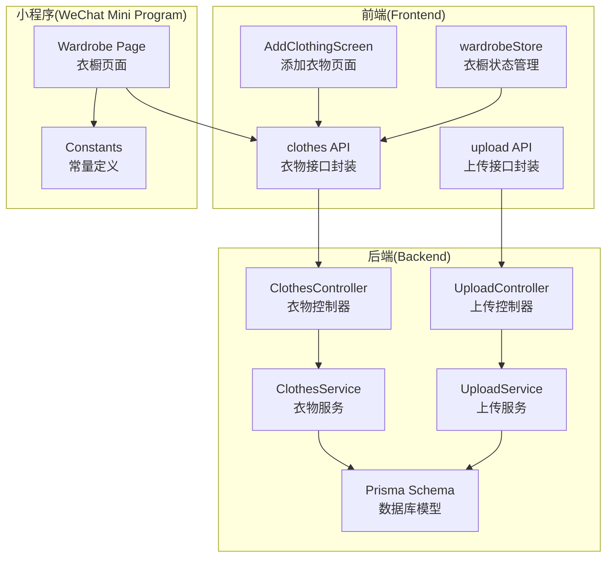
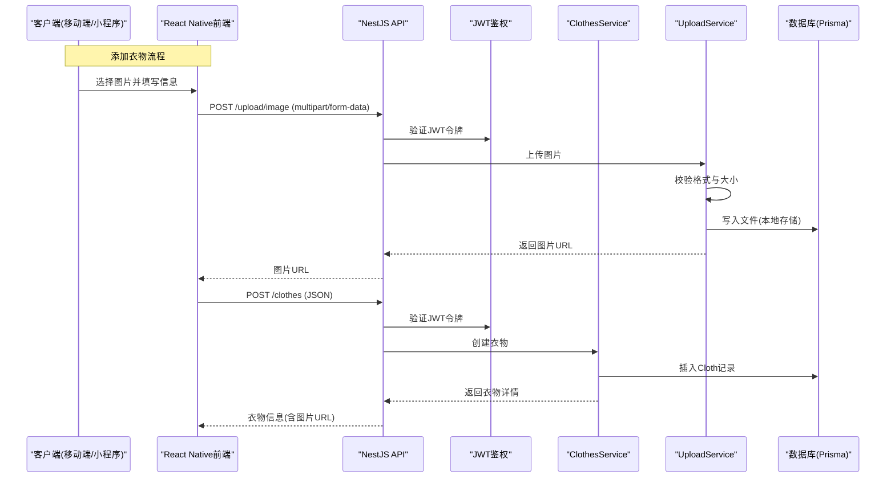
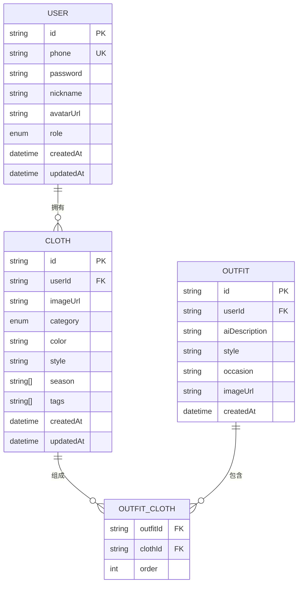
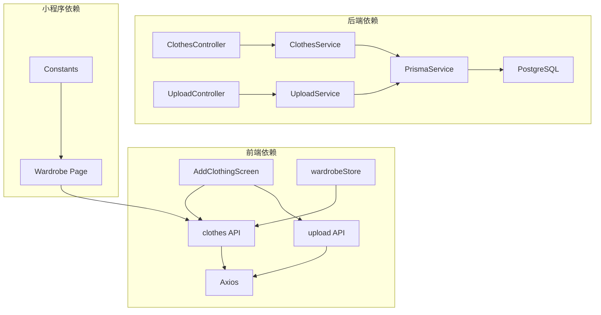

# 衣物管理接口

<cite>
**本文档引用的文件**
- [backend/src/modules/clothes/clothes.controller.ts](file://backend/src/modules/clothes/clothes.controller.ts)
- [backend/src/modules/clothes/clothes.service.ts](file://backend/src/modules/clothes/clothes.service.ts)
- [backend/src/modules/clothes/dto/create-cloth.dto.ts](file://backend/src/modules/clothes/dto/create-cloth.dto.ts)
- [backend/src/modules/clothes/dto/update-cloth.dto.ts](file://backend/src/modules/clothes/dto/update-cloth.dto.ts)
- [backend/src/modules/upload/upload.controller.ts](file://backend/src/modules/upload/upload.controller.ts)
- [backend/src/modules/upload/upload.service.ts](file://backend/src/modules/upload/upload.service.ts)
- [backend/prisma/schema.prisma](file://backend/prisma/schema.prisma)
- [FreeDressApp/src/api/clothes.ts](file://FreeDressApp/src/api/clothes.ts)
- [FreeDressApp/src/api/upload.ts](file://FreeDressApp/src/api/upload.ts)
- [FreeDressApp/src/types/index.ts](file://FreeDressApp/src/types/index.ts)
- [FreeDressApp/src/screens/AddClothingScreen.tsx](file://FreeDressApp/src/screens/AddClothingScreen.tsx)
- [FreeDressApp/src/store/wardrobeStore.ts](file://FreeDressApp/src/store/wardrobeStore.ts)
- [FreeDressApp/src/constants/index.ts](file://FreeDressApp/src/constants/index.ts)
- [freeDressWechat/pages/wardrobe/wardrobe.js](file://freeDressWechat/pages/wardrobe/wardrobe.js)
- [freeDressWechat/utils/constants.js](file://freeDressWechat/utils/constants.js)
</cite>

## 目录
1. [简介](#简介)
2. [项目结构](#项目结构)
3. [核心组件](#核心组件)
4. [架构概览](#架构概览)
5. [详细组件分析](#详细组件分析)
6. [依赖分析](#依赖分析)
7. [性能考虑](#性能考虑)
8. [故障排除指南](#故障排除指南)
9. [结论](#结论)
10. [附录](#附录)

## 简介
本文件为畅搭(FreeDress)应用的衣物管理接口技术文档，涵盖衣物的增删改查、分类统计、图片上传与管理、搜索筛选等功能的完整API规范。文档基于实际代码实现，提供数据模型定义、接口参数说明、错误处理策略、最佳实践与性能优化建议，并包含前后端集成指南。

## 项目结构
畅搭应用采用前后分离架构，后端使用NestJS + Prisma构建REST API，前端使用React Native开发移动应用，同时提供微信小程序版本。衣物管理相关的核心模块分布如下：

**图表来源**
- [backend/src/modules/clothes/clothes.controller.ts:24-28](file://backend/src/modules/clothes/clothes.controller.ts#L24-L28)
- [backend/src/modules/upload/upload.controller.ts:28-30](file://backend/src/modules/upload/upload.controller.ts#L28-L30)
- [backend/prisma/schema.prisma:39-59](file://backend/prisma/schema.prisma#L39-L59)
- [FreeDressApp/src/api/clothes.ts:1-54](file://FreeDressApp/src/api/clothes.ts#L1-L54)
- [FreeDressApp/src/api/upload.ts:1-21](file://FreeDressApp/src/api/upload.ts#L1-L21)

**章节来源**
- [backend/src/modules/clothes/clothes.controller.ts:1-102](file://backend/src/modules/clothes/clothes.controller.ts#L1-L102)
- [backend/src/modules/upload/upload.controller.ts:1-51](file://backend/src/modules/upload/upload.controller.ts#L1-L51)
- [backend/prisma/schema.prisma:1-132](file://backend/prisma/schema.prisma#L1-L132)

## 核心组件
本节概述衣物管理的关键组件及其职责：

- **衣物控制器(ClothesController)**：提供衣物的创建、查询、更新、删除及分类统计接口，统一鉴权与参数校验。
- **衣物服务(ClothesService)**：实现业务逻辑，包括权限验证、数据查询、聚合统计等。
- **上传控制器(UploadController)**：处理图片上传，支持JWT鉴权与文件格式校验。
- **上传服务(UploadService)**：负责文件存储路径、格式限制与大小限制。
- **Prisma模型**：定义衣物、用户、搭配等实体关系与索引策略。
- **前端接口封装**：在React Native应用中封装HTTP请求，提供类型安全的API调用。
- **状态管理**：使用Zustand管理衣物列表、分类统计与活动分类状态。

**章节来源**
- [backend/src/modules/clothes/clothes.controller.ts:24-101](file://backend/src/modules/clothes/clothes.controller.ts#L24-L101)
- [backend/src/modules/clothes/clothes.service.ts:11-147](file://backend/src/modules/clothes/clothes.service.ts#L11-L147)
- [backend/src/modules/upload/upload.controller.ts:28-49](file://backend/src/modules/upload/upload.controller.ts#L28-L49)
- [backend/src/modules/upload/upload.service.ts:15-48](file://backend/src/modules/upload/upload.service.ts#L15-L48)
- [backend/prisma/schema.prisma:39-59](file://backend/prisma/schema.prisma#L39-L59)
- [FreeDressApp/src/api/clothes.ts:1-54](file://FreeDressApp/src/api/clothes.ts#L1-L54)
- [FreeDressApp/src/store/wardrobeStore.ts:35-82](file://FreeDressApp/src/store/wardrobeStore.ts#L35-L82)

## 架构概览
衣物管理系统的整体交互流程如下：

**图表来源**
- [FreeDressApp/src/screens/AddClothingScreen.tsx:61-87](file://FreeDressApp/src/screens/AddClothingScreen.tsx#L61-L87)
- [FreeDressApp/src/api/upload.ts:4-20](file://FreeDressApp/src/api/upload.ts#L4-L20)
- [backend/src/modules/upload/upload.controller.ts:33-49](file://backend/src/modules/upload/upload.controller.ts#L33-L49)
- [backend/src/modules/upload/upload.service.ts:25-47](file://backend/src/modules/upload/upload.service.ts#L25-L47)
- [backend/src/modules/clothes/clothes.controller.ts:34-41](file://backend/src/modules/clothes/clothes.controller.ts#L34-L41)
- [backend/src/modules/clothes/clothes.service.ts:21-30](file://backend/src/modules/clothes/clothes.service.ts#L21-L30)
- [backend/prisma/schema.prisma:39-59](file://backend/prisma/schema.prisma#L39-L59)

## 详细组件分析

### 数据模型与字段定义
衣物数据模型由Prisma定义，包含以下核心字段：

**图表来源**
- [backend/prisma/schema.prisma:39-59](file://backend/prisma/schema.prisma#L39-L59)
- [backend/prisma/schema.prisma:70-101](file://backend/prisma/schema.prisma#L70-L101)

字段说明：
- id：衣物唯一标识符
- userId：所属用户ID
- imageUrl：衣物图片URL
- category：衣物分类(TOP/BOTTOM/COAT/ACCESSORY/SHOE)
- color：颜色
- style：风格
- season：适用季节数组(春/夏/秋/冬)
- tags：标签数组
- createdAt/updatedAt：创建与更新时间

**章节来源**
- [backend/prisma/schema.prisma:39-68](file://backend/prisma/schema.prisma#L39-L68)
- [FreeDressApp/src/types/index.ts:21-33](file://FreeDressApp/src/types/index.ts#L21-L33)

### 衣物管理API规范

#### 1) 创建衣物
- 方法：POST /api/clothes
- 认证：Bearer Token
- 请求体：CreateClothDto
- 响应：Cloth对象

请求参数：
- imageUrl: string (必填，非空)
- category: enum (必填，TOP/BOTTOM/COAT/ACCESSORY/SHOE)
- color: string (可选)
- style: string (可选)
- season: string[] (可选)
- tags: string[] (可选)

响应示例：
- code: number
- message: string
- data: Cloth
- timestamp: string

**章节来源**
- [backend/src/modules/clothes/clothes.controller.ts:34-41](file://backend/src/modules/clothes/clothes.controller.ts#L34-L41)
- [backend/src/modules/clothes/dto/create-cloth.dto.ts:8-42](file://backend/src/modules/clothes/dto/create-cloth.dto.ts#L8-L42)
- [FreeDressApp/src/api/clothes.ts:30-32](file://FreeDressApp/src/api/clothes.ts#L30-L32)

#### 2) 获取衣物列表
- 方法：GET /api/clothes
- 查询参数：category (可选)
- 响应：Cloth[]

过滤条件：
- category：按分类筛选

**章节来源**
- [backend/src/modules/clothes/clothes.controller.ts:46-54](file://backend/src/modules/clothes/clothes.controller.ts#L46-L54)
- [backend/src/modules/clothes/clothes.service.ts:38-51](file://backend/src/modules/clothes/clothes.service.ts#L38-L51)
- [FreeDressApp/src/api/clothes.ts:34-37](file://FreeDressApp/src/api/clothes.ts#L34-L37)

#### 3) 获取衣物详情
- 方法：GET /api/clothes/:id
- 参数：id (路径参数)
- 响应：Cloth

权限控制：
- 仅允许衣物所属用户访问

**章节来源**
- [backend/src/modules/clothes/clothes.controller.ts:59-66](file://backend/src/modules/clothes/clothes.controller.ts#L59-L66)
- [backend/src/modules/clothes/clothes.service.ts:59-81](file://backend/src/modules/clothes/clothes.service.ts#L59-L81)

#### 4) 更新衣物
- 方法：PUT /api/clothes/:id
- 参数：id (路径参数)
- 请求体：UpdateClothDto (所有字段可选)
- 响应：Cloth

**章节来源**
- [backend/src/modules/clothes/clothes.controller.ts:71-79](file://backend/src/modules/clothes/clothes.controller.ts#L71-L79)
- [backend/src/modules/clothes/dto/update-cloth.dto.ts:8-9](file://backend/src/modules/clothes/dto/update-cloth.dto.ts#L8-L9)
- [backend/src/modules/clothes/clothes.service.ts:90-100](file://backend/src/modules/clothes/clothes.service.ts#L90-L100)

#### 5) 删除衣物
- 方法：DELETE /api/clothes/:id
- 参数：id (路径参数)
- 响应：{ message: string }

权限控制：
- 仅允许衣物所属用户删除

**章节来源**
- [backend/src/modules/clothes/clothes.controller.ts:84-91](file://backend/src/modules/clothes/clothes.controller.ts#L84-L91)
- [backend/src/modules/clothes/clothes.service.ts:107-116](file://backend/src/modules/clothes/clothes.service.ts#L107-L116)

#### 6) 获取分类统计
- 方法：GET /api/clothes/stats/categories
- 响应：{ TOP: number, BOTTOM: number, COAT: number, ACCESSORY: number, SHOE: number }

**章节来源**
- [backend/src/modules/clothes/clothes.controller.ts:96-100](file://backend/src/modules/clothes/clothes.controller.ts#L96-L100)
- [backend/src/modules/clothes/clothes.service.ts:123-146](file://backend/src/modules/clothes/clothes.service.ts#L123-L146)

### 图片上传与管理

#### 1) 图片上传接口
- 方法：POST /api/upload/image
- 认证：Bearer Token
- 内容类型：multipart/form-data
- 文件字段：file (二进制)
- 限制：
  - 格式：JPG/PNG/WebP/GIF
  - 大小：≤ 10MB
- 响应：{ url: string }

**章节来源**
- [backend/src/modules/upload/upload.controller.ts:33-49](file://backend/src/modules/upload/upload.controller.ts#L33-L49)
- [backend/src/modules/upload/upload.service.ts:25-47](file://backend/src/modules/upload/upload.service.ts#L25-L47)
- [FreeDressApp/src/api/upload.ts:4-20](file://FreeDressApp/src/api/upload.ts#L4-L20)

#### 2) 前端上传流程
移动端上传流程：
1. 选择图片(相机/相册)
2. 调用上传接口
3. 获取图片URL
4. 提交衣物创建请求

**章节来源**
- [FreeDressApp/src/screens/AddClothingScreen.tsx:47-87](file://FreeDressApp/src/screens/AddClothingScreen.tsx#L47-L87)

### 搜索与筛选功能

#### 1) 移动端搜索
- 支持关键词搜索衣物的颜色、风格或标签
- 搜索逻辑：忽略大小写，匹配任一字段
- 实现位置：衣橱页面的过滤函数

**章节来源**
- [freeDressWechat/pages/wardrobe/wardrobe.js:48-56](file://freeDressWechat/pages/wardrobe/wardrobe.js#L48-L56)

#### 2) 分类筛选
- 支持按分类筛选衣物(TOP/BOTTOM/COAT/ACCESSORY/SHOE)
- 移动端通过标签切换实现
- 微信小程序通过URL参数传递分类

**章节来源**
- [FreeDressApp/src/constants/index.ts:176-183](file://FreeDressApp/src/constants/index.ts#L176-L183)
- [freeDressWechat/utils/constants.js:5-13](file://freeDressWechat/utils/constants.js#L5-L13)
- [FreeDressApp/src/api/clothes.ts:34-37](file://FreeDressApp/src/api/clothes.ts#L34-L37)

### 前端集成指南

#### 1) 接口封装
- 使用Axios封装HTTP请求
- 定义统一的响应格式接口
- 在Store中集中管理衣物状态

**章节来源**
- [FreeDressApp/src/api/clothes.ts:1-54](file://FreeDressApp/src/api/clothes.ts#L1-L54)
- [FreeDressApp/src/store/wardrobeStore.ts:35-82](file://FreeDressApp/src/store/wardrobeStore.ts#L35-L82)
- [FreeDressApp/src/types/index.ts:58-71](file://FreeDressApp/src/types/index.ts#L58-L71)

#### 2) 页面集成
- 添加衣物页面：选择图片、填写信息、提交
- 衣橱页面：展示列表、分类筛选、搜索、删除

**章节来源**
- [FreeDressApp/src/screens/AddClothingScreen.tsx:29-209](file://FreeDressApp/src/screens/AddClothingScreen.tsx#L29-L209)
- [FreeDressApp/src/store/wardrobeStore.ts:43-82](file://FreeDressApp/src/store/wardrobeStore.ts#L43-L82)

### 数据验证规则与业务约束

#### 1) DTO验证规则
- CreateClothDto：
  - imageUrl：字符串，非空
  - category：枚举值，非空
  - color/style：字符串，可选
  - season/tags：数组，可选

- UpdateClothDto：继承CreateClothDto，所有字段可选

**章节来源**
- [backend/src/modules/clothes/dto/create-cloth.dto.ts:8-42](file://backend/src/modules/clothes/dto/create-cloth.dto.ts#L8-L42)
- [backend/src/modules/clothes/dto/update-cloth.dto.ts:8-9](file://backend/src/modules/clothes/dto/update-cloth.dto.ts#L8-L9)

#### 2) 业务约束
- 权限验证：查询/更新/删除前需验证衣物归属
- 上传限制：格式与大小限制
- 分类统计：返回固定五种类别的计数

**章节来源**
- [backend/src/modules/clothes/clothes.service.ts:75-78](file://backend/src/modules/clothes/clothes.service.ts#L75-L78)
- [backend/src/modules/upload/upload.service.ts:30-38](file://backend/src/modules/upload/upload.service.ts#L30-L38)

## 依赖分析

**图表来源**
- [backend/src/modules/clothes/clothes.controller.ts:13-29](file://backend/src/modules/clothes/clothes.controller.ts#L13-L29)
- [backend/src/modules/upload/upload.controller.ts:17-31](file://backend/src/modules/upload/upload.controller.ts#L17-L31)
- [backend/src/prisma/prisma.service.ts](file://backend/src/prisma/prisma.service.ts)
- [FreeDressApp/src/api/clothes.ts:1-2](file://FreeDressApp/src/api/clothes.ts#L1-L2)
- [FreeDressApp/src/api/upload.ts:1-2](file://FreeDressApp/src/api/upload.ts#L1-L2)
- [freeDressWechat/pages/wardrobe/wardrobe.js:1-2](file://freeDressWechat/pages/wardrobe/wardrobe.js#L1-L2)

**章节来源**
- [backend/src/modules/clothes/clothes.controller.ts:1-102](file://backend/src/modules/clothes/clothes.controller.ts#L1-L102)
- [backend/src/modules/upload/upload.controller.ts:1-51](file://backend/src/modules/upload/upload.controller.ts#L1-L51)
- [FreeDressApp/src/api/clothes.ts:1-54](file://FreeDressApp/src/api/clothes.ts#L1-L54)
- [FreeDressApp/src/api/upload.ts:1-21](file://FreeDressApp/src/api/upload.ts#L1-L21)

## 性能考虑
- 数据库索引：Cloth模型对userId与category建立索引，提升查询性能
- 分页策略：前端分页配置支持最大每页100件
- 缓存建议：分类统计可缓存短期结果，减少重复查询
- 图片优化：上传前进行格式与大小限制，避免过大文件影响性能
- 并发控制：批量操作时建议使用事务或队列处理

**章节来源**
- [backend/prisma/schema.prisma:56-58](file://backend/prisma/schema.prisma#L56-L58)
- [FreeDressApp/src/constants/index.ts:207-211](file://FreeDressApp/src/constants/index.ts#L207-L211)

## 故障排除指南
常见问题与解决方案：
- 401未授权：检查JWT令牌是否正确携带
- 403禁止访问：确认请求的衣物属于当前用户
- 404资源不存在：确认衣物ID是否有效
- 400参数错误：检查DTO验证规则，确保必填字段完整
- 上传失败：确认文件格式为JPG/PNG/WebP/GIF，大小不超过10MB

**章节来源**
- [backend/src/modules/clothes/clothes.service.ts:71-78](file://backend/src/modules/clothes/clothes.service.ts#L71-L78)
- [backend/src/modules/upload/upload.service.ts:26-38](file://backend/src/modules/upload/upload.service.ts#L26-L38)

## 结论
本文档基于畅搭(FreeDress)应用的实际代码实现了衣物管理接口的完整技术规范，涵盖了数据模型、API接口、图片上传、搜索筛选、权限控制与错误处理等方面。通过遵循本文档的规范与最佳实践，开发者可以高效地集成与扩展衣物管理功能。

## 附录

### API调用示例
- 创建衣物：POST /api/clothes
- 获取列表：GET /api/clothes?category=TOP
- 获取详情：GET /api/clothes/:id
- 更新衣物：PUT /api/clothes/:id
- 删除衣物：DELETE /api/clothes/:id
- 分类统计：GET /api/clothes/stats/categories
- 上传图片：POST /api/upload/image

**章节来源**
- [FreeDressApp/src/api/clothes.ts:30-53](file://FreeDressApp/src/api/clothes.ts#L30-L53)
- [FreeDressApp/src/api/upload.ts:4-20](file://FreeDressApp/src/api/upload.ts#L4-L20)