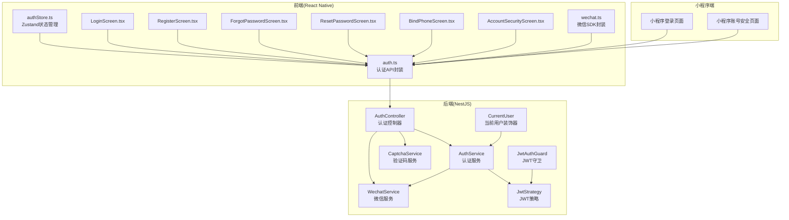
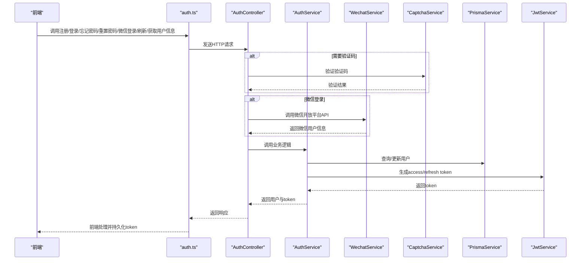
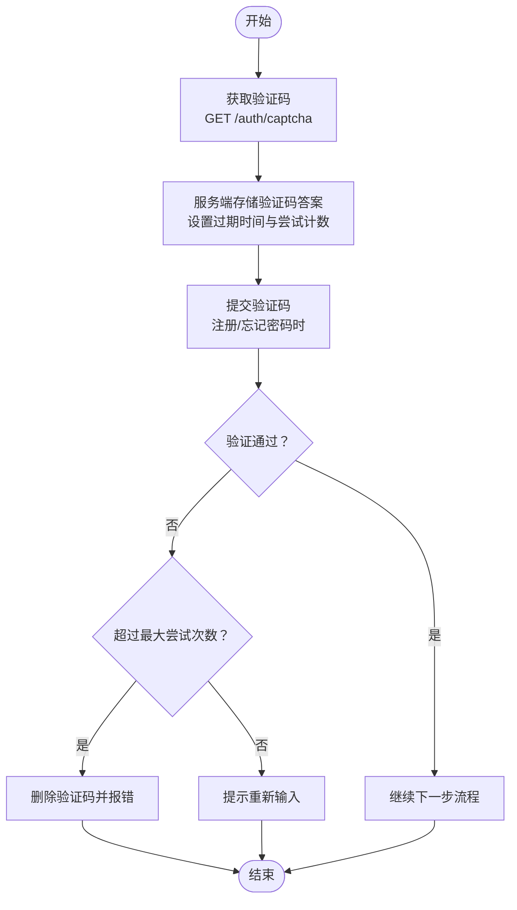
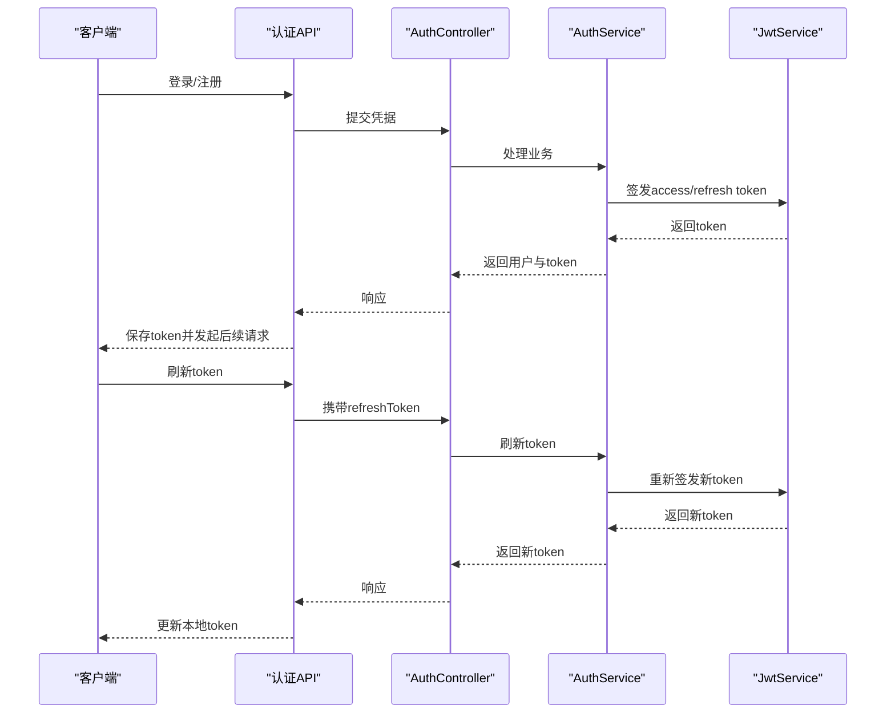
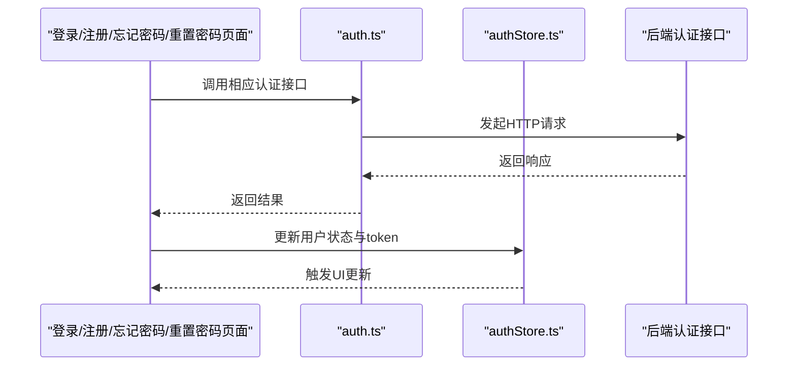
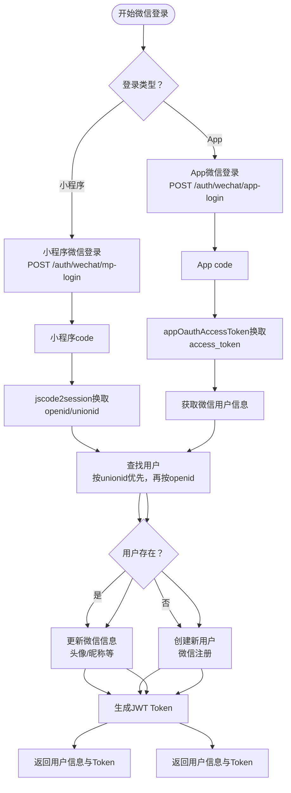
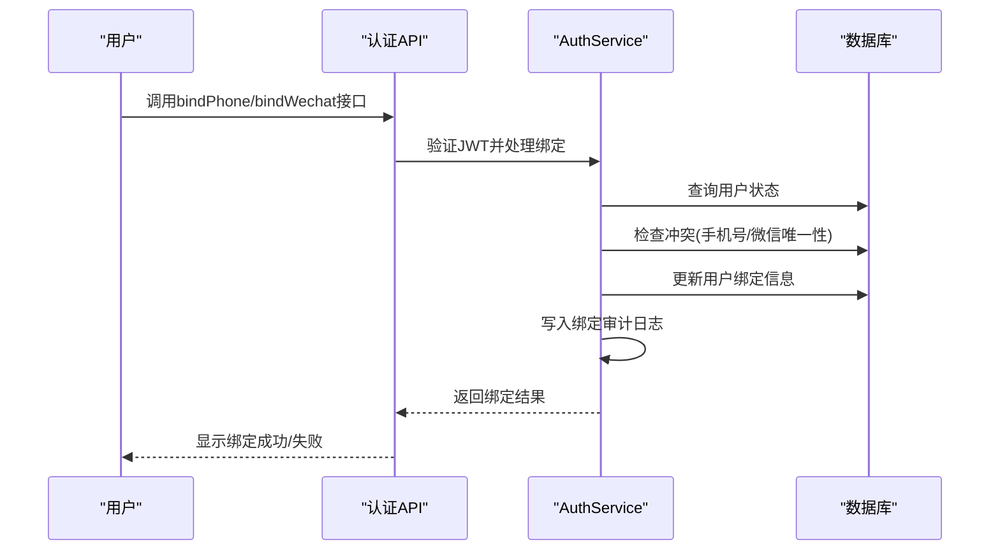
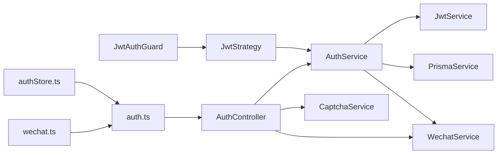

# 认证接口

<cite>
**本文引用的文件**
- [backend/src/modules/auth/auth.controller.ts](file://backend/src/modules/auth/auth.controller.ts)
- [backend/src/modules/auth/auth.service.ts](file://backend/src/modules/auth/auth.service.ts)
- [backend/src/modules/auth/captcha.service.ts](file://backend/src/modules/auth/captcha.service.ts)
- [backend/src/modules/auth/dto/register.dto.ts](file://backend/src/modules/auth/dto/register.dto.ts)
- [backend/src/modules/auth/dto/login.dto.ts](file://backend/src/modules/auth/dto/login.dto.ts)
- [backend/src/modules/auth/dto/reset-password.dto.ts](file://backend/src/modules/auth/dto/reset-password.dto.ts)
- [backend/src/modules/auth/dto/wechat.dto.ts](file://backend/src/modules/auth/dto/wechat.dto.ts)
- [backend/src/modules/auth/strategies/jwt.strategy.ts](file://backend/src/modules/auth/strategies/jwt.strategy.ts)
- [backend/src/common/guards/jwt-auth.guard.ts](file://backend/src/common/guards/jwt-auth.guard.ts)
- [backend/src/common/decorators/current-user.decorator.ts](file://backend/src/common/decorators/current-user.decorator.ts)
- [backend/src/modules/auth/wechat.service.ts](file://backend/src/modules/auth/wechat.service.ts)
- [backend/prisma/migrations/20260529100000_add_wechat_login/migration.sql](file://backend/prisma/migrations/20260529100000_add_wechat_login/migration.sql)
- [FreeDressApp/src/api/auth.ts](file://FreeDressApp/src/api/auth.ts)
- [FreeDressApp/src/store/authStore.ts](file://FreeDressApp/src/store/authStore.ts)
- [FreeDressApp/src/services/wechat.ts](file://FreeDressApp/src/services/wechat.ts)
- [FreeDressApp/src/screens/LoginScreen.tsx](file://FreeDressApp/src/screens/LoginScreen.tsx)
- [FreeDressApp/src/screens/RegisterScreen.tsx](file://FreeDressApp/src/screens/RegisterScreen.tsx)
- [FreeDressApp/src/screens/ForgotPasswordScreen.tsx](file://FreeDressApp/src/screens/ForgotPasswordScreen.tsx)
- [FreeDressApp/src/screens/ResetPasswordScreen.tsx](file://FreeDressApp/src/screens/ResetPasswordScreen.tsx)
- [FreeDressApp/src/screens/BindPhoneScreen.tsx](file://FreeDressApp/src/screens/BindPhoneScreen.tsx)
- [FreeDressApp/src/screens/AccountSecurityScreen.tsx](file://FreeDressApp/src/screens/AccountSecurityScreen.tsx)
- [freeDressWechat/utils/api.js](file://freeDressWechat/utils/api.js)
- [freeDressWechat/pages/login/login.js](file://freeDressWechat/pages/login/login.js)
- [freeDressWechat/pages/accountSecurity/accountSecurity.js](file://freeDressWechat/pages/accountSecurity/accountSecurity.js)
</cite>

## 更新摘要
**所做更改**
- 新增微信登录相关接口文档，包括小程序微信登录、App微信登录
- 新增微信账号绑定与解绑接口文档
- 新增纯微信注册用户的手机号绑定流程
- 更新用户信息序列化结构，包含微信绑定状态字段
- 新增微信登录的完整认证流程说明
- 更新前端集成示例，包含小程序和App端的微信登录实现

## 目录
1. [简介](#简介)
2. [项目结构](#项目结构)
3. [核心组件](#核心组件)
4. [架构总览](#架构总览)
5. [详细组件分析](#详细组件分析)
6. [微信登录与绑定流程](#微信登录与绑定流程)
7. [依赖关系分析](#依赖关系分析)
8. [性能考虑](#性能考虑)
9. [故障排查指南](#故障排查指南)
10. [结论](#结论)
11. [附录](#附录)

## 简介
本文件为畅搭(FreeDress)应用的认证接口技术文档，覆盖用户注册、登录、忘记密码、重置密码、Token刷新与获取用户信息等全部认证相关API。**本次更新重点增加了微信登录功能**，包括小程序微信登录(/auth/wechat/mp-login)、App微信登录(/auth/wechat/app-login)、微信账号绑定与解绑等完整认证生态。文档同时阐述图片验证码获取与验证流程、JWT认证机制（access token与refresh token的生成、验证与刷新策略）、错误处理与常见问题解决方案，并提供前端集成要点与安全最佳实践。

## 项目结构
后端采用NestJS模块化设计，认证相关功能集中在auth模块；前端使用React Native + Zustand进行状态管理与API封装。认证接口主要由后端控制器暴露，前端通过统一的API模块调用。**新增的微信登录功能通过独立的微信服务层与认证服务层协作实现**。

**图表来源**
- [backend/src/modules/auth/auth.controller.ts:16-91](file://backend/src/modules/auth/auth.controller.ts#L16-L91)
- [backend/src/modules/auth/auth.service.ts:24-37](file://backend/src/modules/auth/auth.service.ts#L24-L37)
- [backend/src/modules/auth/wechat.service.ts:30-166](file://backend/src/modules/auth/wechat.service.ts#L30-L166)
- [backend/src/modules/auth/captcha.service.ts:31-51](file://backend/src/modules/auth/captcha.service.ts#L31-L51)
- [backend/src/modules/auth/strategies/jwt.strategy.ts:11-38](file://backend/src/modules/auth/strategies/jwt.strategy.ts#L11-L38)
- [backend/src/common/guards/jwt-auth.guard.ts:9-21](file://backend/src/common/guards/jwt-auth.guard.ts#L9-L21)
- [backend/src/common/decorators/current-user.decorator.ts:7-15](file://backend/src/common/decorators/current-user.decorator.ts#L7-L15)
- [FreeDressApp/src/api/auth.ts:1-101](file://FreeDressApp/src/api/auth.ts#L1-L101)
- [FreeDressApp/src/store/authStore.ts:28-122](file://FreeDressApp/src/store/authStore.ts#L28-L122)
- [FreeDressApp/src/services/wechat.ts:1-39](file://FreeDressApp/src/services/wechat.ts#L1-L39)

**章节来源**
- [backend/src/modules/auth/auth.controller.ts:16-91](file://backend/src/modules/auth/auth.controller.ts#L16-L91)
- [FreeDressApp/src/api/auth.ts:1-101](file://FreeDressApp/src/api/auth.ts#L1-L101)

## 核心组件
- 认证控制器(AuthController)：定义并实现所有认证相关路由，包括新增的微信登录接口，负责接收请求、调用服务层并返回响应。
- 认证服务(AuthService)：实现业务逻辑，包括用户注册、登录、忘记密码、重置密码、Token刷新与生成、用户校验，以及**新增的微信登录与绑定功能**。
- 验证码服务(CaptchaService)：生成SVG图片验证码、存储答案、防刷限流与过期清理。
- **微信服务(WechatService)**：封装微信开放平台API调用，包括小程序jscode2session、App端oauth2/access_token等接口。
- JWT策略与守卫：从请求头解析并验证JWT，拦截未授权访问。
- 前端API封装与状态管理：统一封装认证接口调用，使用Zustand持久化存储Token与用户信息，**新增微信SDK封装与小程序端API调用**。

**章节来源**
- [backend/src/modules/auth/auth.controller.ts:18-91](file://backend/src/modules/auth/auth.controller.ts#L18-L91)
- [backend/src/modules/auth/auth.service.ts:24-279](file://backend/src/modules/auth/auth.service.ts#L24-L279)
- [backend/src/modules/auth/wechat.service.ts:30-166](file://backend/src/modules/auth/wechat.service.ts#L30-L166)
- [backend/src/modules/auth/captcha.service.ts:31-259](file://backend/src/modules/auth/captcha.service.ts#L31-L259)
- [backend/src/modules/auth/strategies/jwt.strategy.ts:11-38](file://backend/src/modules/auth/strategies/jwt.strategy.ts#L11-L38)
- [backend/src/common/guards/jwt-auth.guard.ts:9-21](file://backend/src/common/guards/jwt-auth.guard.ts#L9-L21)
- [FreeDressApp/src/api/auth.ts:1-101](file://FreeDressApp/src/api/auth.ts#L1-L101)
- [FreeDressApp/src/store/authStore.ts:28-122](file://FreeDressApp/src/store/authStore.ts#L28-L122)
- [FreeDressApp/src/services/wechat.ts:1-39](file://FreeDressApp/src/services/wechat.ts#L1-L39)

## 架构总览
认证系统遵循"控制器-服务-策略-守卫"的分层设计，前端通过API模块发起请求，后端完成业务处理与JWT签发，前端使用Zustand持久化Token并在后续请求中携带Authorization头。**新增的微信登录流程通过微信服务层与认证服务层协同工作**。

**图表来源**
- [backend/src/modules/auth/auth.controller.ts:27-90](file://backend/src/modules/auth/auth.controller.ts#L27-L90)
- [backend/src/modules/auth/auth.service.ts:44-135](file://backend/src/modules/auth/auth.service.ts#L44-L135)
- [backend/src/modules/auth/wechat.service.ts:37-118](file://backend/src/modules/auth/wechat.service.ts#L37-L118)
- [backend/src/modules/auth/captcha.service.ts:87-122](file://backend/src/modules/auth/captcha.service.ts#L87-L122)
- [backend/src/modules/auth/strategies/jwt.strategy.ts:28-37](file://backend/src/modules/auth/strategies/jwt.strategy.ts#L28-L37)

## 详细组件分析

### 接口一览与规范
- 基础信息
  - Base URL: 由后端部署决定
  - Content-Type: application/json
  - 认证方式: JWT Bearer Token（部分受保护接口）
  - 响应格式: 统一包装对象，包含 code、message、data 字段

- 图片验证码
  - GET /auth/captcha
  - 请求参数: 无
  - 响应: { captchaId: string; image: string }（SVG字符串）
  - 说明: 返回SVG图片与验证码ID，用于注册/忘记密码时的人机验证

- 用户注册
  - POST /auth/register
  - 请求体: phone, password, captchaId, captchaAnswer, nickname(可选)
  - 响应: { user, accessToken, refreshToken }
  - 说明: 使用手机号、密码与验证码注册，成功后返回用户信息与双Token

- 用户登录
  - POST /auth/login
  - 请求体: phone, password[, wechatCode]
  - 响应: { user, accessToken, refreshToken[, autoBindResult] }
  - 说明: 成功后返回用户信息与双Token，**支持可选的微信Code自动绑定**

- 忘记密码
  - POST /auth/forgot-password
  - 请求体: phone, captchaId, captchaAnswer
  - 响应: { resetToken, message }
  - 说明: 验证手机号与验证码后发放一次性重置令牌

- 重置密码
  - POST /auth/reset-password
  - 请求体: resetToken, newPassword
  - 响应: { message }
  - 说明: 使用重置令牌设置新密码

- 刷新Token
  - POST /auth/refresh
  - 请求头: Authorization: Bearer <refreshToken>
  - 响应: { accessToken, refreshToken }
  - 说明: 使用refreshToken换取新的access/refresh token对

- 获取当前用户信息
  - GET /auth/profile
  - 请求头: Authorization: Bearer <accessToken>
  - 响应: 当前用户对象
  - 说明: 需要有效access token

**章节来源**
- [backend/src/modules/auth/auth.controller.ts:27-90](file://backend/src/modules/auth/auth.controller.ts#L27-L90)
- [backend/src/modules/auth/dto/register.dto.ts:8-37](file://backend/src/modules/auth/dto/register.dto.ts#L8-L37)
- [backend/src/modules/auth/dto/login.dto.ts:7-18](file://backend/src/modules/auth/dto/login.dto.ts#L7-L18)
- [backend/src/modules/auth/dto/reset-password.dto.ts:7-17](file://backend/src/modules/auth/dto/reset-password.dto.ts#L7-L17)

### 图片验证码流程
- 生成与验证
  - 生成: 调用GET /auth/captcha，服务端生成4位验证码并返回captchaId与SVG图片
  - 验证: 在注册/忘记密码时提交captchaId与captchaAnswer，服务端校验并清理过期/超限记录
- 防护措施
  - 验证码2分钟过期
  - 单个验证码最多3次验证机会
  - IP限流：每分钟最多10次请求
  - 去除易混淆字符，提升可读性

**图表来源**
- [backend/src/modules/auth/captcha.service.ts:58-122](file://backend/src/modules/auth/captcha.service.ts#L58-L122)

**章节来源**
- [backend/src/modules/auth/captcha.service.ts:31-259](file://backend/src/modules/auth/captcha.service.ts#L31-L259)

### JWT认证机制
- Token类型与用途
  - Access Token: 用于访问受保护资源，短期有效
  - Refresh Token: 用于刷新Access Token，长期有效但需安全存储
- 生成策略
  - 使用不同密钥与过期时间分别签发access与refresh token
  - access token默认7天，refresh token默认30天
- 验证策略
  - 从Authorization头解析Bearer token
  - 严格校验签名与过期时间
  - 通过payload中的用户标识查询并返回用户信息
- 刷新策略
  - 仅使用refresh token换取新token对
  - 保持用户会话连续性

**图表来源**
- [backend/src/modules/auth/auth.controller.ts:48-79](file://backend/src/modules/auth/auth.controller.ts#L48-L79)
- [backend/src/modules/auth/auth.service.ts:153-171](file://backend/src/modules/auth/auth.service.ts#L153-L171)
- [backend/src/modules/auth/strategies/jwt.strategy.ts:28-37](file://backend/src/modules/auth/strategies/jwt.strategy.ts#L28-L37)

**章节来源**
- [backend/src/modules/auth/auth.service.ts:143-171](file://backend/src/modules/auth/auth.service.ts#L143-L171)
- [backend/src/modules/auth/strategies/jwt.strategy.ts:11-38](file://backend/src/modules/auth/strategies/jwt.strategy.ts#L11-L38)
- [backend/src/common/guards/jwt-auth.guard.ts:9-21](file://backend/src/common/guards/jwt-auth.guard.ts#L9-L21)

### 前端集成与状态管理
- API封装
  - 统一导出getCaptcha、register、login、forgotPassword、resetPassword、refreshToken、getProfile等方法
  - **新增微信登录相关方法：wechatMpLogin、wechatAppLogin、bindPhone、bindWechatApp、unbindWechat**
  - 所有请求均通过统一的axios实例发送
- 状态管理
  - 使用Zustand管理用户信息、access/refresh token与登录状态
  - 支持从本地存储恢复认证状态，实现应用重启后的自动登录
- 屏幕组件
  - 登录/注册/忘记密码/重置密码页面均调用对应API并处理反馈
  - **新增绑定手机号页面与账号安全页面，支持微信账号绑定与解绑**
  - 注册与忘记密码页面内嵌图片验证码获取与展示
- **微信SDK封装**
  - **提供微信SDK可用性检测与授权请求封装**
  - **App端微信登录待SDK集成，当前为占位实现**

**图表来源**
- [FreeDressApp/src/api/auth.ts:12-100](file://FreeDressApp/src/api/auth.ts#L12-L100)
- [FreeDressApp/src/store/authStore.ts:39-78](file://FreeDressApp/src/store/authStore.ts#L39-L78)
- [FreeDressApp/src/screens/LoginScreen.tsx:74-92](file://FreeDressApp/src/screens/LoginScreen.tsx#L74-L92)
- [FreeDressApp/src/screens/RegisterScreen.tsx:100-123](file://FreeDressApp/src/screens/RegisterScreen.tsx#L100-L123)
- [FreeDressApp/src/screens/ForgotPasswordScreen.tsx:95-115](file://FreeDressApp/src/screens/ForgotPasswordScreen.tsx#L95-L115)
- [FreeDressApp/src/screens/ResetPasswordScreen.tsx:73-93](file://FreeDressApp/src/screens/ResetPasswordScreen.tsx#L73-L93)
- [FreeDressApp/src/screens/BindPhoneScreen.tsx:81-118](file://FreeDressApp/src/screens/BindPhoneScreen.tsx#L81-L118)
- [FreeDressApp/src/screens/AccountSecurityScreen.tsx:51-101](file://FreeDressApp/src/screens/AccountSecurityScreen.tsx#L51-L101)

**章节来源**
- [FreeDressApp/src/api/auth.ts:1-101](file://FreeDressApp/src/api/auth.ts#L1-L101)
- [FreeDressApp/src/store/authStore.ts:28-122](file://FreeDressApp/src/store/authStore.ts#L28-L122)
- [FreeDressApp/src/screens/LoginScreen.tsx:74-92](file://FreeDressApp/src/screens/LoginScreen.tsx#L74-L92)
- [FreeDressApp/src/screens/RegisterScreen.tsx:100-123](file://FreeDressApp/src/screens/RegisterScreen.tsx#L100-L123)
- [FreeDressApp/src/screens/ForgotPasswordScreen.tsx:95-115](file://FreeDressApp/src/screens/ForgotPasswordScreen.tsx#L95-L115)
- [FreeDressApp/src/screens/ResetPasswordScreen.tsx:73-93](file://FreeDressApp/src/screens/ResetPasswordScreen.tsx#L73-L93)
- [FreeDressApp/src/screens/BindPhoneScreen.tsx:81-118](file://FreeDressApp/src/screens/BindPhoneScreen.tsx#L81-L118)
- [FreeDressApp/src/screens/AccountSecurityScreen.tsx:51-101](file://FreeDressApp/src/screens/AccountSecurityScreen.tsx#L51-L101)
- [FreeDressApp/src/services/wechat.ts:16-38](file://FreeDressApp/src/services/wechat.ts#L16-L38)

## 微信登录与绑定流程

### 微信登录接口

#### 小程序微信登录
- **POST /auth/wechat/mp-login**
- 请求体: { code: string, nickname?: string, avatarUrl?: string }
- 响应: { user: WechatUser, accessToken: string, refreshToken: string }
- 说明: 使用wx.login返回的code进行微信登录，未注册时自动创建账号

#### App微信登录
- **POST /auth/wechat/app-login**
- 请求体: { code: string }
- 响应: { user: WechatUser, accessToken: string, refreshToken: string }
- 说明: 使用微信OpenSDK授权回调的code进行App端微信登录，未注册时自动创建账号

### 微信账号绑定接口

#### 已登录账号绑定手机号
- **POST /auth/bind/phone**
- 请求头: Authorization: Bearer <JWT>
- 请求体: { phone: string, password: string, captchaId: string, captchaAnswer: string }
- 响应: { user: WechatUser, accessToken: string, refreshToken: string }
- 说明: 为已登录的纯微信账号补充手机号和密码信息

#### 绑定小程序微信
- **POST /auth/bind/wechat-mp**
- 请求头: Authorization: Bearer <JWT>
- 请求体: { code: string }
- 响应: { user: WechatUser, message: string }
- 说明: 为已登录账号绑定当前小程序微信

#### 绑定App微信
- **POST /auth/bind/wechat-app**
- 请求头: Authorization: Bearer <JWT>
- 请求体: { code: string }
- 响应: { user: WechatUser, message: string }
- 说明: 为已登录账号绑定当前App微信

#### 解绑微信
- **POST /auth/unbind/wechat**
- 请求头: Authorization: Bearer <JWT>
- 请求体: { platform: 'APP' | 'MP' }
- 响应: { user: WechatUser, message: string }
- 说明: 解绑指定平台的微信账号，要求已绑手机号+密码

### 用户信息序列化结构
微信登录后的用户信息包含以下扩展字段：
- hasPhone: 是否已绑定手机号
- hasWechatMp: 是否已绑定小程序微信
- hasWechatApp: 是否已绑定App微信
- needBindPhone: 是否需要绑定手机号
- registerSource: 注册来源(PHONE/WECHAT_APP/WECHAT_MP)

### 微信登录流程图

**图表来源**
- [backend/src/modules/auth/auth.controller.ts:65-84](file://backend/src/modules/auth/auth.controller.ts#L65-L84)
- [backend/src/modules/auth/auth.service.ts:397-467](file://backend/src/modules/auth/auth.service.ts#L397-L467)
- [backend/src/modules/auth/wechat.service.ts:37-118](file://backend/src/modules/auth/wechat.service.ts#L37-L118)

### 微信绑定流程

**图表来源**
- [backend/src/modules/auth/auth.controller.ts:89-145](file://backend/src/modules/auth/auth.controller.ts#L89-L145)
- [backend/src/modules/auth/auth.service.ts:491-614](file://backend/src/modules/auth/auth.service.ts#L491-L614)

**章节来源**
- [backend/src/modules/auth/auth.controller.ts:65-145](file://backend/src/modules/auth/auth.controller.ts#L65-L145)
- [backend/src/modules/auth/auth.service.ts:397-658](file://backend/src/modules/auth/auth.service.ts#L397-L658)
- [backend/src/modules/auth/wechat.service.ts:37-143](file://backend/src/modules/auth/wechat.service.ts#L37-L143)
- [backend/src/modules/auth/dto/wechat.dto.ts:7-77](file://backend/src/modules/auth/dto/wechat.dto.ts#L7-L77)

## 依赖关系分析
- 控制器依赖服务与验证码服务，**新增微信服务**，服务依赖Prisma与JWT服务
- 守卫依赖策略，策略依赖AuthService进行用户校验
- 前端API依赖控制器，状态管理依赖API，**新增微信SDK依赖**

**图表来源**
- [backend/src/modules/auth/auth.controller.ts:19-22](file://backend/src/modules/auth/auth.controller.ts#L19-L22)
- [backend/src/modules/auth/auth.service.ts:30-34](file://backend/src/modules/auth/auth.service.ts#L30-L34)
- [backend/src/modules/auth/wechat.service.ts:30-32](file://backend/src/modules/auth/wechat.service.ts#L30-L32)
- [backend/src/modules/auth/strategies/jwt.strategy.ts:12-20](file://backend/src/modules/auth/strategies/jwt.strategy.ts#L12-L20)
- [backend/src/common/guards/jwt-auth.guard.ts:9](file://backend/src/common/guards/jwt-auth.guard.ts#L9)

**章节来源**
- [backend/src/modules/auth/auth.controller.ts:19-22](file://backend/src/modules/auth/auth.controller.ts#L19-L22)
- [backend/src/modules/auth/auth.service.ts:30-34](file://backend/src/modules/auth/auth.service.ts#L30-L34)
- [backend/src/common/guards/jwt-auth.guard.ts:9-21](file://backend/src/common/guards/jwt-auth.guard.ts#L9-L21)

## 性能考虑
- 验证码与重置令牌采用内存存储，建议在生产环境迁移至Redis以支持多实例共享与持久化
- 定期清理过期数据（验证码与重置令牌），避免内存泄漏
- JWT密钥与过期时间配置应集中管理，便于统一调整
- 前端状态持久化使用异步存储，注意I/O开销与并发写入
- **微信登录接口涉及外部API调用，建议添加超时控制与重试机制**
- **微信绑定操作需要数据库事务保证一致性，避免脏数据**

## 故障排查指南
- 常见错误与处理
  - 验证码错误/过期/次数超限：检查captchaId与captchaAnswer是否匹配，确认验证码未过期且尝试次数未达上限
  - 手机号或密码错误：确认手机号格式与密码强度，检查数据库中是否存在该用户
  - 重置令牌无效或已过期：确认resetToken是否正确传递且在10分钟有效期内
  - 未登录访问受保护接口：确认access token是否有效，必要时使用refresh token刷新
  - **微信登录失败：检查微信AppID/Secret配置，确认code是否有效且未过期**
  - **微信绑定冲突：检查该微信是否已被其他账号绑定，解绑后再尝试**
- 前端常见问题
  - 登录后无法获取用户信息：检查Authorization头是否正确携带access token
  - Token未持久化：确认AsyncStorage写入成功，应用重启后是否能正确恢复状态
  - **微信SDK未集成：App端微信登录按钮默认隐藏，需集成SDK后方可使用**
  - **小程序微信登录：需确保wx.login调用成功并正确传递code**

**章节来源**
- [backend/src/modules/auth/captcha.service.ts:87-122](file://backend/src/modules/auth/captcha.service.ts#L87-L122)
- [backend/src/modules/auth/auth.service.ts:102-135](file://backend/src/modules/auth/auth.service.ts#L102-L135)
- [backend/src/modules/auth/auth.service.ts:214-242](file://backend/src/modules/auth/auth.service.ts#L214-L242)
- [backend/src/common/guards/jwt-auth.guard.ts:14-20](file://backend/src/common/guards/jwt-auth.guard.ts#L14-L20)
- [FreeDressApp/src/store/authStore.ts:97-121](file://FreeDressApp/src/store/authStore.ts#L97-L121)
- [backend/src/modules/auth/wechat.service.ts:43-52](file://backend/src/modules/auth/wechat.service.ts#L43-L52)
- [FreeDressApp/src/services/wechat.ts:32-38](file://FreeDressApp/src/services/wechat.ts#L32-L38)

## 结论
本认证体系通过清晰的分层设计与严格的防护机制，实现了从验证码到JWT的全链路认证能力。**新增的微信登录功能进一步丰富了用户登录方式，支持小程序与App双端登录，并提供了完整的账号绑定与解绑流程**。前端通过Zustand实现状态持久化与便捷的API调用，后端通过策略与守卫保障接口安全。建议在生产环境中完善缓存与限流策略，并持续优化Token生命周期管理。

## 附录
- 环境变量与配置要点
  - JWT_SECRET：用于签发与验证access token
  - JWT_REFRESH_SECRET：用于签发与验证refresh token
  - JWT_EXPIRES_IN：access token过期时间（如7d）
  - **WECHAT_MP_APPID/WECHAT_MP_SECRET：小程序微信登录配置**
  - **WECHAT_APP_APPID/WECHAT_APP_SECRET：App微信登录配置**
- 前端集成要点
  - 在每次请求中携带Authorization: Bearer <accessToken>
  - 登录/注册成功后，使用authStore保存并同步更新token
  - 刷新token失败时引导用户重新登录
  - **微信SDK集成后，通过isWechatAvailable检测可用性，再显示相关入口**
- 安全最佳实践
  - 严格区分access与refresh token的用途与存储位置
  - 使用HTTPS传输，避免Token在中间环节泄露
  - 定期轮换密钥，限制Token有效期
  - 对敏感操作增加二次验证（如短信/邮箱）
  - **微信登录涉及第三方API，需做好异常处理与降级方案**
  - **微信绑定操作需防止重复绑定与冲突，做好数据库约束与事务处理**