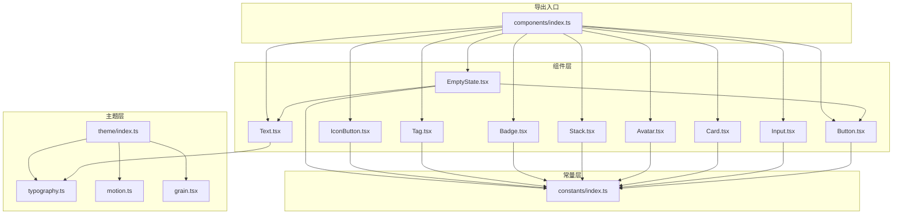
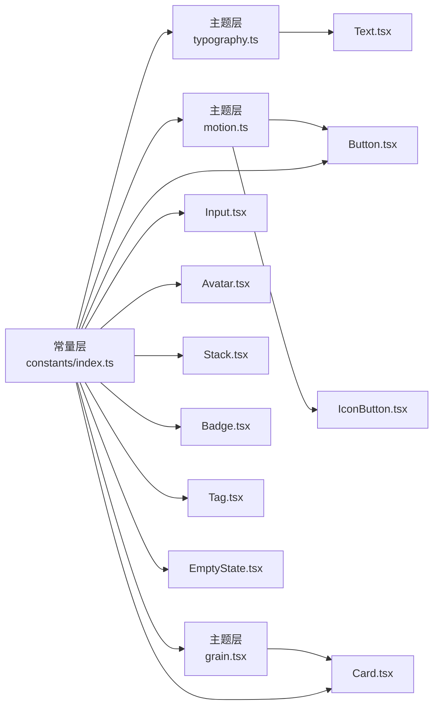
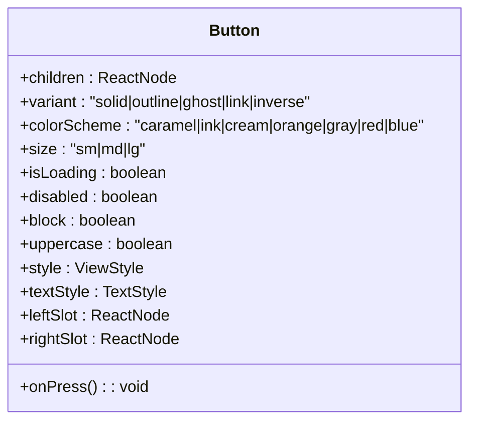
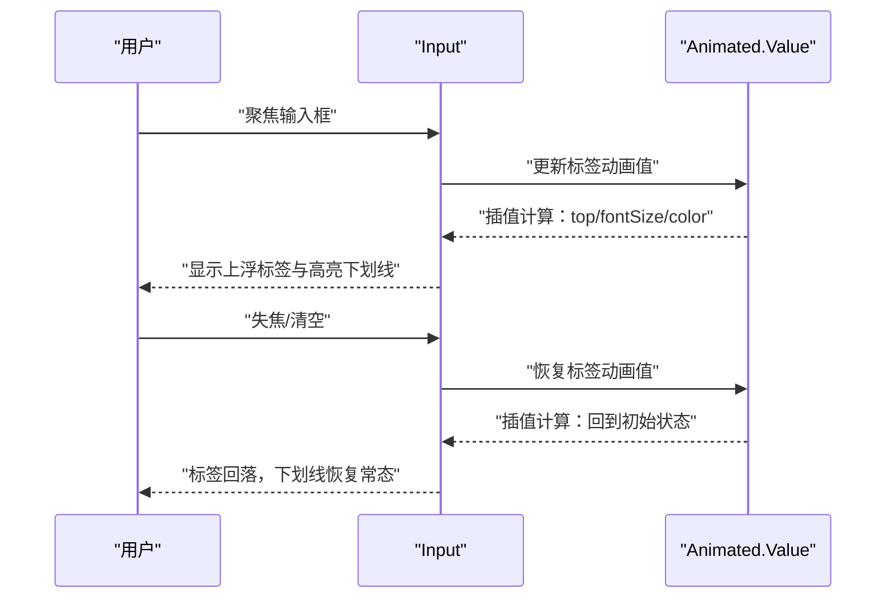
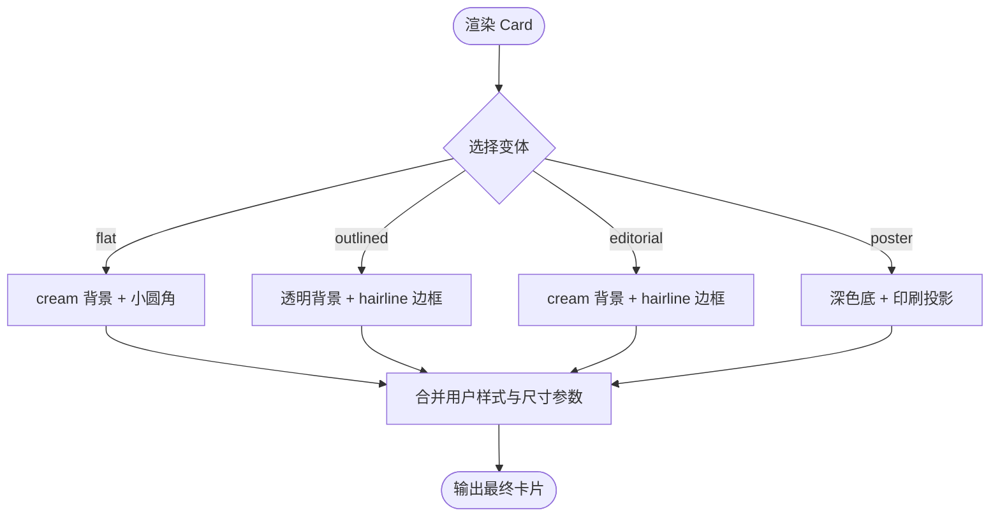
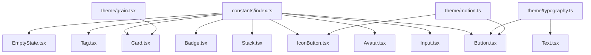

# UI组件库

<cite>
**本文档引用的文件**
- [FreeDressApp/src/components/index.ts](file://FreeDressApp/src/components/index.ts)
- [FreeDressApp/src/theme/index.ts](file://FreeDressApp/src/theme/index.ts)
- [FreeDressApp/src/theme/typography.ts](file://FreeDressApp/src/theme/typography.ts)
- [FreeDressApp/src/theme/motion.ts](file://FreeDressApp/src/theme/motion.ts)
- [FreeDressApp/src/theme/grain.tsx](file://FreeDressApp/src/theme/grain.tsx)
- [FreeDressApp/src/constants/index.ts](file://FreeDressApp/src/constants/index.ts)
- [FreeDressApp/src/components/Button.tsx](file://FreeDressApp/src/components/Button.tsx)
- [FreeDressApp/src/components/Input.tsx](file://FreeDressApp/src/components/Input.tsx)
- [FreeDressApp/src/components/Card.tsx](file://FreeDressApp/src/components/Card.tsx)
- [FreeDressApp/src/components/Avatar.tsx](file://FreeDressApp/src/components/Avatar.tsx)
- [FreeDressApp/src/components/Text.tsx](file://FreeDressApp/src/components/Text.tsx)
- [FreeDressApp/src/components/Stack.tsx](file://FreeDressApp/src/components/Stack.tsx)
- [FreeDressApp/src/components/Badge.tsx](file://FreeDressApp/src/components/Badge.tsx)
- [FreeDressApp/src/components/Tag.tsx](file://FreeDressApp/src/components/Tag.tsx)
- [FreeDressApp/src/components/IconButton.tsx](file://FreeDressApp/src/components/IconButton.tsx)
- [FreeDressApp/src/components/EmptyState.tsx](file://FreeDressApp/src/components/EmptyState.tsx)
- [FreeDressApp/DESIGN.md](file://FreeDressApp/DESIGN.md)
- [FreeDressApp/README.md](file://FreeDressApp/README.md)
</cite>

## 目录
1. [简介](#简介)
2. [项目结构](#项目结构)
3. [核心组件](#核心组件)
4. [架构总览](#架构总览)
5. [组件详解](#组件详解)
6. [依赖关系分析](#依赖关系分析)
7. [性能考量](#性能考量)
8. [故障排查指南](#故障排查指南)
9. [结论](#结论)
10. [附录](#附录)

## 简介
本文件为畅搭(FreeDress)UI组件库的完整技术文档，面向设计师与开发者，系统阐述自定义组件的设计理念、实现细节与使用方法。涵盖Avatar头像、Button按钮、Input输入、Card卡片、Text文本等核心UI元素，以及布局Stack、徽章Badge、标签Tag、图标按钮IconButton、空状态EmptyState等复合组件。文档同时介绍主题系统（颜色、字体、间距、阴影、动效）、响应式与移动端适配策略、可访问性与国际化支持、动画与过渡效果实现指南，并提供组件组合与布局技巧的最佳实践。

## 项目结构
组件库位于应用工程的组件目录，采用按功能模块组织的方式，主题层与常量层提供统一的设计Token与动效配置，便于跨组件复用与一致性控制。

图表来源
- [FreeDressApp/src/components/index.ts:1-32](file://FreeDressApp/src/components/index.ts#L1-L32)
- [FreeDressApp/src/theme/index.ts:1-7](file://FreeDressApp/src/theme/index.ts#L1-L7)
- [FreeDressApp/src/theme/typography.ts:1-115](file://FreeDressApp/src/theme/typography.ts#L1-L115)
- [FreeDressApp/src/theme/motion.ts:1-32](file://FreeDressApp/src/theme/motion.ts#L1-L32)
- [FreeDressApp/src/theme/grain.tsx:1-78](file://FreeDressApp/src/theme/grain.tsx#L1-L78)
- [FreeDressApp/src/constants/index.ts:1-212](file://FreeDressApp/src/constants/index.ts#L1-L212)
- [FreeDressApp/src/components/Button.tsx:1-201](file://FreeDressApp/src/components/Button.tsx#L1-L201)
- [FreeDressApp/src/components/Input.tsx:1-183](file://FreeDressApp/src/components/Input.tsx#L1-L183)
- [FreeDressApp/src/components/Card.tsx:1-124](file://FreeDressApp/src/components/Card.tsx#L1-L124)
- [FreeDressApp/src/components/Avatar.tsx:1-93](file://FreeDressApp/src/components/Avatar.tsx#L1-L93)
- [FreeDressApp/src/components/Text.tsx:1-68](file://FreeDressApp/src/components/Text.tsx#L1-L68)
- [FreeDressApp/src/components/Stack.tsx:1-155](file://FreeDressApp/src/components/Stack.tsx#L1-L155)
- [FreeDressApp/src/components/Badge.tsx:1-124](file://FreeDressApp/src/components/Badge.tsx#L1-L124)
- [FreeDressApp/src/components/Tag.tsx:1-91](file://FreeDressApp/src/components/Tag.tsx#L1-L91)
- [FreeDressApp/src/components/IconButton.tsx:1-126](file://FreeDressApp/src/components/IconButton.tsx#L1-L126)
- [FreeDressApp/src/components/EmptyState.tsx:1-102](file://FreeDressApp/src/components/EmptyState.tsx#L1-L102)

章节来源
- [FreeDressApp/src/components/index.ts:1-32](file://FreeDressApp/src/components/index.ts#L1-L32)
- [FreeDressApp/README.md:86-118](file://FreeDressApp/README.md#L86-L118)

## 核心组件
本节概述核心UI组件的能力边界与典型用法，便于快速检索与集成。

- Button 按钮：支持多种变体与配色方案，内置按下缩放反馈与加载态，支持装饰插槽与块级宽度。
- Input 输入：支持浮层标签、下划线/描边/填充三种外观，聚焦态与错误态色彩联动。
- Card 卡片：提供扁平、描边、编辑器、海报四种风格，兼容旧版尺寸与背景API。
- Avatar 头像：圆形/方形可选，支持占位字符与右下角徽标。
- Text 文本：封装排版预设，统一字体家族、字号、行高与字距。
- Stack 布局：HStack/VStack统一间距网格，支持flex、对齐与内边距快捷属性。
- Badge 徽章：实心/描边/印章风格，适合标签、状态与限定标识。
- Tag 胶囊标签：活跃/非活跃两种状态，支持点击与禁用。
- IconButton 图标按钮：多种变体与形状，内置按下缩放反馈。
- EmptyState 空状态：线稿图标 + 期号 + 标题 + 副标题 + 行动按钮，适合占位与引导。

章节来源
- [FreeDressApp/src/components/Button.tsx:1-201](file://FreeDressApp/src/components/Button.tsx#L1-L201)
- [FreeDressApp/src/components/Input.tsx:1-183](file://FreeDressApp/src/components/Input.tsx#L1-L183)
- [FreeDressApp/src/components/Card.tsx:1-124](file://FreeDressApp/src/components/Card.tsx#L1-L124)
- [FreeDressApp/src/components/Avatar.tsx:1-93](file://FreeDressApp/src/components/Avatar.tsx#L1-L93)
- [FreeDressApp/src/components/Text.tsx:1-68](file://FreeDressApp/src/components/Text.tsx#L1-L68)
- [FreeDressApp/src/components/Stack.tsx:1-155](file://FreeDressApp/src/components/Stack.tsx#L1-L155)
- [FreeDressApp/src/components/Badge.tsx:1-124](file://FreeDressApp/src/components/Badge.tsx#L1-L124)
- [FreeDressApp/src/components/Tag.tsx:1-91](file://FreeDressApp/src/components/Tag.tsx#L1-L91)
- [FreeDressApp/src/components/IconButton.tsx:1-126](file://FreeDressApp/src/components/IconButton.tsx#L1-L126)
- [FreeDressApp/src/components/EmptyState.tsx:1-102](file://FreeDressApp/src/components/EmptyState.tsx#L1-L102)

## 架构总览
组件库遵循“常量层 → 主题层 → 组件层”的分层架构，确保设计Token的一致性与可维护性。组件通过导入常量与主题配置，实现颜色、字体、动效与布局的统一。

图表来源
- [FreeDressApp/src/constants/index.ts:1-212](file://FreeDressApp/src/constants/index.ts#L1-L212)
- [FreeDressApp/src/theme/typography.ts:1-115](file://FreeDressApp/src/theme/typography.ts#L1-L115)
- [FreeDressApp/src/theme/motion.ts:1-32](file://FreeDressApp/src/theme/motion.ts#L1-L32)
- [FreeDressApp/src/theme/grain.tsx:1-78](file://FreeDressApp/src/theme/grain.tsx#L1-L78)
- [FreeDressApp/src/components/Button.tsx:1-201](file://FreeDressApp/src/components/Button.tsx#L1-L201)
- [FreeDressApp/src/components/Input.tsx:1-183](file://FreeDressApp/src/components/Input.tsx#L1-L183)
- [FreeDressApp/src/components/Card.tsx:1-124](file://FreeDressApp/src/components/Card.tsx#L1-L124)
- [FreeDressApp/src/components/Avatar.tsx:1-93](file://FreeDressApp/src/components/Avatar.tsx#L1-L93)
- [FreeDressApp/src/components/Text.tsx:1-68](file://FreeDressApp/src/components/Text.tsx#L1-L68)
- [FreeDressApp/src/components/Stack.tsx:1-155](file://FreeDressApp/src/components/Stack.tsx#L1-L155)
- [FreeDressApp/src/components/Badge.tsx:1-124](file://FreeDressApp/src/components/Badge.tsx#L1-L124)
- [FreeDressApp/src/components/Tag.tsx:1-91](file://FreeDressApp/src/components/Tag.tsx#L1-L91)
- [FreeDressApp/src/components/EmptyState.tsx:1-102](file://FreeDressApp/src/components/EmptyState.tsx#L1-L102)

## 组件详解

### Button 按钮组件
- 设计目标：以“编辑级杂志感”为核心，强调克制留白与按压反馈，突出层次与质感。
- 关键能力
  - 变体：solid、outline、ghost、link、inverse
  - 配色：caramel、ink、cream；兼容旧版 orange/gray/red/blue 映射
  - 尺寸：sm、md、lg；自动匹配内边距与字号
  - 交互：按下缩放0.97，时长与缓动由主题动效配置提供
  - 视觉：link变体带下划线；block支持整行宽度；支持左右装饰插槽
  - 状态：isLoading显示加载指示；disabled禁用态降低不透明度
- Props要点
  - children、onPress、variant、colorScheme、size、isLoading、disabled、block、uppercase、style、textStyle、leftSlot、rightSlot
- 最佳实践
  - 主要操作使用 solid ink/caramel；弱操作使用 ghost/link；危险操作使用 inverse + caramel
  - 长列表按钮建议使用 outline 保持层级清晰
  - 链接类操作优先 link，配合 icon 插槽增强可发现性

图表来源
- [FreeDressApp/src/components/Button.tsx:29-45](file://FreeDressApp/src/components/Button.tsx#L29-L45)

章节来源
- [FreeDressApp/src/components/Button.tsx:1-201](file://FreeDressApp/src/components/Button.tsx#L1-L201)
- [FreeDressApp/src/theme/motion.ts:1-32](file://FreeDressApp/src/theme/motion.ts#L1-L32)
- [FreeDressApp/src/theme/typography.ts:107-115](file://FreeDressApp/src/theme/typography.ts#L107-L115)
- [FreeDressApp/src/constants/index.ts:15-52](file://FreeDressApp/src/constants/index.ts#L15-L52)

### Input 输入组件
- 设计目标：以“杂志风下划线”为首选，强调极简线条与浮动标签，提升信息密度与可读性。
- 关键能力
  - 变体：outline、underline、filled
  - 浮动标签：聚焦或有值时上浮，动画曲线与时长由主题动效配置提供
  - 状态反馈：聚焦态高亮色，错误态警示色
  - 样式：支持容器与输入框自定义样式，自动适配label高度
- Props要点
  - label、variant、borderColor、focusBorderColor、errorMessage、error、errorBorderColor、containerStyle、style
- 最佳实践
  - 优先使用 underline；需要更高辨识度时使用 outline/filled
  - 错误提示与边框颜色联动，确保即时反馈
  - 与 Text 排版组件配合，保持字号与字距一致

图表来源
- [FreeDressApp/src/components/Input.tsx:49-78](file://FreeDressApp/src/components/Input.tsx#L49-L78)

章节来源
- [FreeDressApp/src/components/Input.tsx:1-183](file://FreeDressApp/src/components/Input.tsx#L1-L183)
- [FreeDressApp/src/constants/index.ts:15-52](file://FreeDressApp/src/constants/index.ts#L15-L52)

### Card 卡片组件
- 设计目标：在“编辑级排版”语境下，提供不同层级的容器风格，兼顾信息密度与视觉分隔。
- 关键能力
  - 变体：flat、outlined、editorial、poster
  - 兼容旧版API：borderRadius、padding、margin、bg、overflow
  - 视觉：editorial默认cream背景与hairline边框；poster使用深色底与印刷投影
- Props要点
  - children、variant、style、bg、borderRadius、padding/px/py、margin/mx/my、overflow
- 最佳实践
  - 内容区域优先 editorial；重要区块使用 poster；弱化层级使用 flat/outlined

图表来源
- [FreeDressApp/src/components/Card.tsx:92-121](file://FreeDressApp/src/components/Card.tsx#L92-L121)

章节来源
- [FreeDressApp/src/components/Card.tsx:1-124](file://FreeDressApp/src/components/Card.tsx#L1-L124)
- [FreeDressApp/src/constants/index.ts:117-156](file://FreeDressApp/src/constants/index.ts#L117-L156)

### Avatar 头像组件
- 设计目标：在“邮印质感”下，提供清晰的用户识别与状态标记。
- 关键能力
  - 形状：circle/square
  - 占位：支持URI图片或Fallback字符
  - 徽标：右下角stamp徽标，适合VIP/限定等标识
- Props要点
  - uri、size、fallback、shape、borderColor、bg、style、stamp
- 最佳实践
  - 默认 circle 适配大多数场景；需要强几何感时使用 square
  - stamp徽标建议与 Badge 组合使用，保持视觉权重平衡

章节来源
- [FreeDressApp/src/components/Avatar.tsx:1-93](file://FreeDressApp/src/components/Avatar.tsx#L1-L93)
- [FreeDressApp/src/constants/index.ts:15-52](file://FreeDressApp/src/constants/index.ts#L15-L52)

### Text 文本组件
- 设计目标：统一排版风格，减少散落的字体配置，保证“杂志级排版精度”。
- 关键能力
  - 预设：HeroText、DisplayText、SerifTitle、SectionTitle、QuoteText、BodyText、CaptionText、KickerText、MonoText、MonoLargeText
  - 组合：基于基础样式工厂，支持颜色覆盖与自定义样式合并
- 最佳实践
  - 标题体系使用 Serif/Display；正文使用 Body/Caption；强调使用 Kicker/Mono
  - 避免在同一层级重复设置字体族与字距，优先使用预设

章节来源
- [FreeDressApp/src/components/Text.tsx:1-68](file://FreeDressApp/src/components/Text.tsx#L1-L68)
- [FreeDressApp/src/theme/typography.ts:1-115](file://FreeDressApp/src/theme/typography.ts#L1-L115)

### Stack 布局组件
- 设计目标：以“4px网格”为核心的间距系统，统一HStack/VStack的布局与间距规则。
- 关键能力
  - 间距：space、mb/mt/ml/mr/mx/my、px/py、pt/pb
  - 对齐：alignItems、justifyContent、flexWrap、flex
  - 快捷：bg背景色、内联样式透传
- 最佳实践
  - 使用 SPACING 索引（如 2、4、6）表达间距，避免硬编码像素
  - HStack子项之间通过右侧外边距实现等间距；VStack通过底部外边距实现

章节来源
- [FreeDressApp/src/components/Stack.tsx:1-155](file://FreeDressApp/src/components/Stack.tsx#L1-L155)
- [FreeDressApp/src/constants/index.ts:99-115](file://FreeDressApp/src/constants/index.ts#L99-L115)

### Badge 徽章组件
- 设计目标：在“极简主义”下，提供状态与标签的轻量标识。
- 关键能力
  - 变体：solid、outline、stamp（带大字距与hairline边框）
  - 尺寸：px/py按4px网格缩放；支持full圆角
  - 文本：根据变体调整字族、字距与大小写
- 最佳实践
  - 重要状态使用 solid；弱化信息使用 outline；限定/特殊使用 stamp

章节来源
- [FreeDressApp/src/components/Badge.tsx:1-124](file://FreeDressApp/src/components/Badge.tsx#L1-L124)
- [FreeDressApp/src/constants/index.ts:15-52](file://FreeDressApp/src/constants/index.ts#L15-L52)

### Tag 胶囊标签组件
- 设计目标：在“可交互胶囊”中承载筛选、分类与状态选择。
- 关键能力
  - 状态：active（实心）/ inactive（描边）
  - 尺寸：sm/md；自动匹配内边距与字号
  - 交互：按下反馈与禁用态
- 最佳实践
  - 多选场景使用 inactive + onPress；当前选中使用 active

章节来源
- [FreeDressApp/src/components/Tag.tsx:1-91](file://FreeDressApp/src/components/Tag.tsx#L1-L91)
- [FreeDressApp/src/constants/index.ts:15-52](file://FreeDressApp/src/constants/index.ts#L15-L52)

### IconButton 图标按钮组件
- 设计目标：在“线性图标”体系下，提供紧凑且可感知的交互反馈。
- 关键能力
  - 变体：ghost、outline、solid、inverse、caramel
  - 形状：circle/square；自动映射圆角
  - 交互：按下缩放0.92，时长与缓动由主题动效配置提供
- 最佳实践
  - 作为次要操作或导航入口使用 ghost/outline；强调使用 solid/inverse/caramel

章节来源
- [FreeDressApp/src/components/IconButton.tsx:1-126](file://FreeDressApp/src/components/IconButton.tsx#L1-L126)
- [FreeDressApp/src/theme/motion.ts:1-32](file://FreeDressApp/src/theme/motion.ts#L1-L32)
- [FreeDressApp/src/constants/index.ts:15-52](file://FreeDressApp/src/constants/index.ts#L15-L52)

### EmptyState 空状态组件
- 设计目标：在“杂志风”语境下，以线稿图标、期号与标题传达“尚未拥有”的温和信息，并提供明确的行动引导。
- 关键能力
  - 结构：iconFrame + kicker + 标题 + 副标题 + 行动按钮
  - 组合：内部使用 Button 与 Text 组件，确保风格一致
- 最佳实践
  - 使用 KickerText 与 SerifTitle 保持排版一致性
  - 行动按钮使用 solid ink，右侧可附加 arrow-right 图标

章节来源
- [FreeDressApp/src/components/EmptyState.tsx:1-102](file://FreeDressApp/src/components/EmptyState.tsx#L1-L102)
- [FreeDressApp/src/components/Button.tsx:1-201](file://FreeDressApp/src/components/Button.tsx#L1-L201)
- [FreeDressApp/src/components/Text.tsx:1-68](file://FreeDressApp/src/components/Text.tsx#L1-L68)

## 依赖关系分析
组件与主题/常量之间的依赖关系如下：

图表来源
- [FreeDressApp/src/constants/index.ts:1-212](file://FreeDressApp/src/constants/index.ts#L1-L212)
- [FreeDressApp/src/theme/typography.ts:1-115](file://FreeDressApp/src/theme/typography.ts#L1-L115)
- [FreeDressApp/src/theme/motion.ts:1-32](file://FreeDressApp/src/theme/motion.ts#L1-L32)
- [FreeDressApp/src/theme/grain.tsx:1-78](file://FreeDressApp/src/theme/grain.tsx#L1-L78)
- [FreeDressApp/src/components/Button.tsx:1-201](file://FreeDressApp/src/components/Button.tsx#L1-L201)
- [FreeDressApp/src/components/Input.tsx:1-183](file://FreeDressApp/src/components/Input.tsx#L1-L183)
- [FreeDressApp/src/components/Card.tsx:1-124](file://FreeDressApp/src/components/Card.tsx#L1-L124)
- [FreeDressApp/src/components/Avatar.tsx:1-93](file://FreeDressApp/src/components/Avatar.tsx#L1-L93)
- [FreeDressApp/src/components/Stack.tsx:1-155](file://FreeDressApp/src/components/Stack.tsx#L1-L155)
- [FreeDressApp/src/components/Badge.tsx:1-124](file://FreeDressApp/src/components/Badge.tsx#L1-L124)
- [FreeDressApp/src/components/Tag.tsx:1-91](file://FreeDressApp/src/components/Tag.tsx#L1-L91)
- [FreeDressApp/src/components/IconButton.tsx:1-126](file://FreeDressApp/src/components/IconButton.tsx#L1-L126)
- [FreeDressApp/src/components/EmptyState.tsx:1-102](file://FreeDressApp/src/components/EmptyState.tsx#L1-L102)
- [FreeDressApp/src/components/Text.tsx:1-68](file://FreeDressApp/src/components/Text.tsx#L1-L68)

章节来源
- [FreeDressApp/src/components/index.ts:1-32](file://FreeDressApp/src/components/index.ts#L1-L32)
- [FreeDressApp/src/theme/index.ts:1-7](file://FreeDressApp/src/theme/index.ts#L1-L7)

## 性能考量
- 动画性能
  - 按钮与图标按钮使用 Reanimated 的 withTiming 与共享值，避免布局抖动，提升交互流畅度。
  - 动效时长与缓动曲线集中于主题层，便于全局优化与一致性控制。
- 渲染优化
  - Stack 组件对 children 过滤与数组化，减少无效节点渲染。
  - EmptyState 内部复用 Button 与 Text，避免重复样式计算。
- 资源与体积
  - 主题层的颗粒纹理通过纯 View 叠加实现，避免引入额外依赖，控制包体体积。
- 可访问性
  - 当前设计对比度充足（ink/ecru 对比达 15.4:1），满足 AAA 标准；后续可扩展 font-scale 适配、无障碍标签与语音朗读支持。

[本节为通用指导，不直接分析具体文件]

## 故障排查指南
- 按钮点击无响应
  - 检查 disabled 与 isLoading 状态是否被启用；确认 onPress 是否传入有效函数。
  - 参考路径：[Button.tsx:80-133](file://FreeDressApp/src/components/Button.tsx#L80-L133)
- 输入框标签不浮动
  - 确认 label、value 与焦点状态；检查 Animated.timing 插值是否正确。
  - 参考路径：[Input.tsx:49-78](file://FreeDressApp/src/components/Input.tsx#L49-L78)
- 卡片边框/阴影异常
  - 检查 variant 与主题阴影配置；确认 SHADOWS 与 HAIRLINE 常量取值。
  - 参考路径：[Card.tsx:92-121](file://FreeDressApp/src/components/Card.tsx#L92-L121)，[constants/index.ts:126-156](file://FreeDressApp/src/constants/index.ts#L126-L156)
- 头像显示异常
  - 检查 uri 与 fallback 字符；确认 shape 与圆角映射。
  - 参考路径：[Avatar.tsx:21-71](file://FreeDressApp/src/components/Avatar.tsx#L21-L71)
- 文本排版不一致
  - 确认使用的 Text 预设与主题排版配置；避免混用自定义样式覆盖。
  - 参考路径：[Text.tsx:28-67](file://FreeDressApp/src/components/Text.tsx#L28-L67)，[theme/typography.ts:1-115](file://FreeDressApp/src/theme/typography.ts#L1-L115)
- 布局间距错乱
  - 使用 SPACING 索引替代硬编码像素；检查 space 与 px/py 的优先级。
  - 参考路径：[Stack.tsx:39-61](file://FreeDressApp/src/components/Stack.tsx#L39-L61)

章节来源
- [FreeDressApp/src/components/Button.tsx:80-133](file://FreeDressApp/src/components/Button.tsx#L80-L133)
- [FreeDressApp/src/components/Input.tsx:49-78](file://FreeDressApp/src/components/Input.tsx#L49-L78)
- [FreeDressApp/src/components/Card.tsx:92-121](file://FreeDressApp/src/components/Card.tsx#L92-L121)
- [FreeDressApp/src/components/Avatar.tsx:21-71](file://FreeDressApp/src/components/Avatar.tsx#L21-L71)
- [FreeDressApp/src/components/Text.tsx:28-67](file://FreeDressApp/src/components/Text.tsx#L28-L67)
- [FreeDressApp/src/components/Stack.tsx:39-61](file://FreeDressApp/src/components/Stack.tsx#L39-L61)
- [FreeDressApp/src/constants/index.ts:126-156](file://FreeDressApp/src/constants/index.ts#L126-L156)

## 结论
本UI组件库以“编辑级杂志感”为核心设计语言，通过统一的颜色、字体、间距、阴影与动效体系，为畅搭应用提供一致、精致且可扩展的视觉与交互体验。组件层遵循低耦合、高内聚的原则，结合主题层与常量层的集中配置，既满足当前业务需求，也为未来深色模式、自定义字体与微动效升级预留空间。

[本节为总结性内容，不直接分析具体文件]

## 附录

### 主题系统与设计Token
- 颜色体系（Atelier Palette）
  - 主调 ink 系列（深 → 浅）与背景 ecru/cream/paper
  - 主品牌色 caramel 及其深浅变体；辅助色 sand、mistGray、clay、signal、jade
  - 旧版字段映射至新色值，保证向后兼容
- 字体与字号
  - 字体族：display（衬线）、serif、body（无衬线）、bodyMedium、mono（等宽）
  - 字号网格：xs/sm/base/md/lg/xl/xxl/display/hero
- 间距、圆角与阴影
  - 4px 间距网格；圆角以 0/4 为主；阴影模拟印刷感
- 动效曲线与时长
  - 曲线：editorial、press、in、out；时长：fast/base/slow/scenic
- 颗粒纹理
  - 通过伪随机点阵叠加实现，无额外依赖

章节来源
- [FreeDressApp/DESIGN.md:40-161](file://FreeDressApp/DESIGN.md#L40-L161)
- [FreeDressApp/src/constants/index.ts:15-52](file://FreeDressApp/src/constants/index.ts#L15-L52)
- [FreeDressApp/src/constants/index.ts:58-84](file://FreeDressApp/src/constants/index.ts#L58-L84)
- [FreeDressApp/src/constants/index.ts:86-97](file://FreeDressApp/src/constants/index.ts#L86-L97)
- [FreeDressApp/src/constants/index.ts:99-124](file://FreeDressApp/src/constants/index.ts#L99-L124)
- [FreeDressApp/src/constants/index.ts:126-174](file://FreeDressApp/src/constants/index.ts#L126-L174)
- [FreeDressApp/src/theme/grain.tsx:1-78](file://FreeDressApp/src/theme/grain.tsx#L1-L78)

### 响应式与移动端适配
- 字体缩放与可读性
  - 建议在系统字体缩放设置变化时，结合 Text 预设进行自适应排版
- 触控与交互
  - 按钮与图标按钮的按下反馈与阴影模拟，适配移动端触控习惯
- 屏幕方向
  - Stack 的 flexWrap 与 justifyContent 提供横竖屏切换的布局弹性

章节来源
- [FreeDressApp/src/components/Stack.tsx:63-103](file://FreeDressApp/src/components/Stack.tsx#L63-L103)
- [FreeDressApp/src/components/IconButton.tsx:31-76](file://FreeDressApp/src/components/IconButton.tsx#L31-L76)
- [FreeDressApp/src/theme/motion.ts:1-32](file://FreeDressApp/src/theme/motion.ts#L1-L32)

### 可访问性与国际化
- 可访问性
  - 当前对比度达标；建议后续完善 font-scale 适配、无障碍标签与语音朗读
- 国际化
  - 文本组件支持多语言；图标使用矢量库，避免本地化问题

章节来源
- [FreeDressApp/DESIGN.md:396-403](file://FreeDressApp/DESIGN.md#L396-L403)
- [FreeDressApp/src/components/Text.tsx:28-67](file://FreeDressApp/src/components/Text.tsx#L28-L67)

### 动画与过渡效果实现指南
- 标准过渡：editorialTransition（基于主题时长与曲线）
- 慢速过渡：slowTransition（页面进入、长动作）
- 快速过渡：fastTransition（按下反馈）
- 使用建议
  - 页面进入使用 slowTransition；按钮与图标按下使用 fastTransition
  - 通过 withEditorialTiming 与 withFastTiming 统一动效配置

章节来源
- [FreeDressApp/src/theme/motion.ts:1-32](file://FreeDressApp/src/theme/motion.ts#L1-L32)
- [FreeDressApp/DESIGN.md:138-161](file://FreeDressApp/DESIGN.md#L138-L161)

### 组件组合与布局技巧
- 组合示例
  - EmptyState 内部组合 Button 与 Text，形成统一风格的引导面板
  - Stack 的 space 与 px/py 快捷属性，简化复杂布局
- 布局技巧
  - 使用 HStack/VStack 的对齐与包裹属性，构建灵活的卡片网格
  - Badge 与 Tag 可与 Avatar/IconButton 组合，形成信息丰富的操作区

章节来源
- [FreeDressApp/src/components/EmptyState.tsx:22-62](file://FreeDressApp/src/components/EmptyState.tsx#L22-L62)
- [FreeDressApp/src/components/Stack.tsx:63-145](file://FreeDressApp/src/components/Stack.tsx#L63-L145)
- [FreeDressApp/src/components/Badge.tsx:23-75](file://FreeDressApp/src/components/Badge.tsx#L23-L75)
- [FreeDressApp/src/components/Tag.tsx:32-75](file://FreeDressApp/src/components/Tag.tsx#L32-L75)
- [FreeDressApp/src/components/IconButton.tsx:31-76](file://FreeDressApp/src/components/IconButton.tsx#L31-L76)