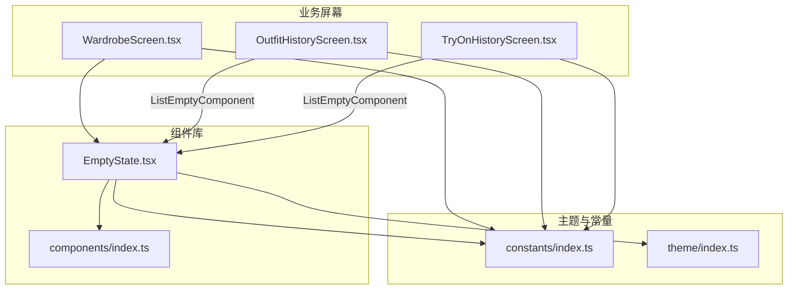
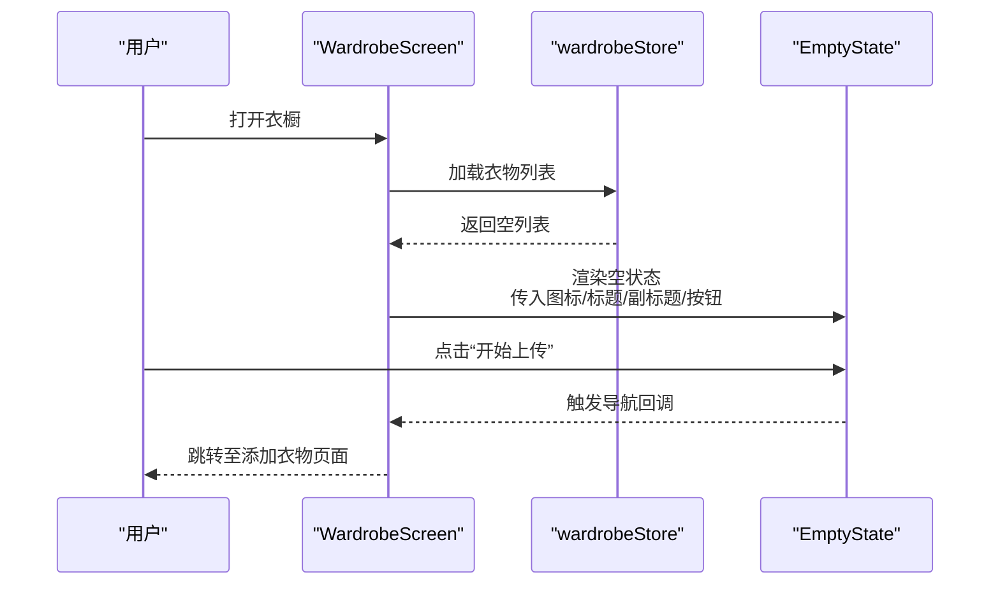
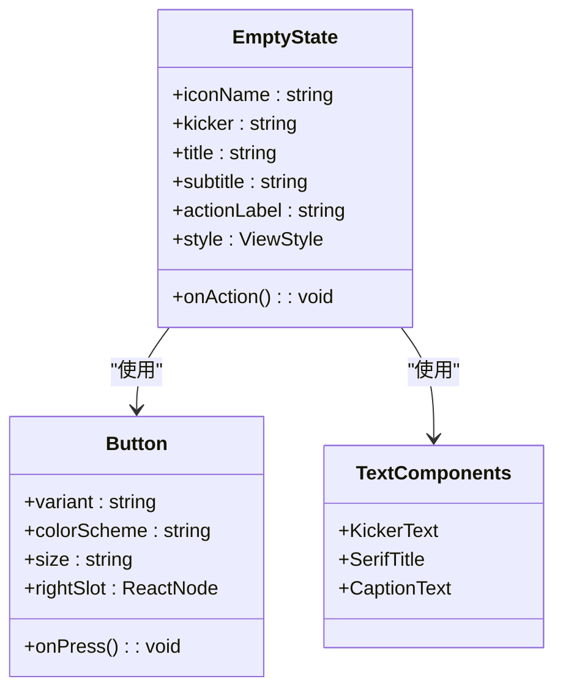
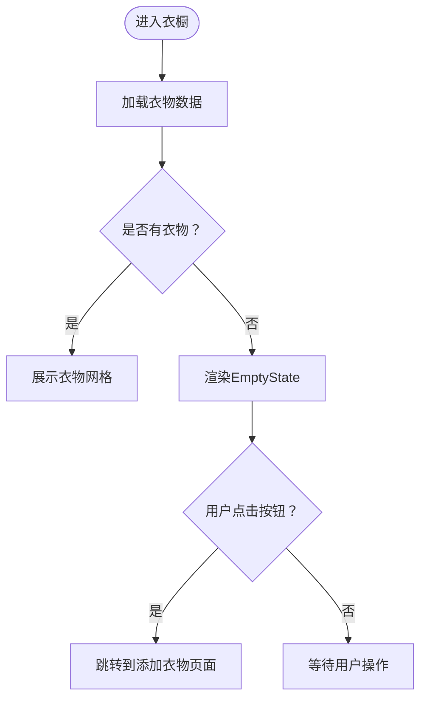
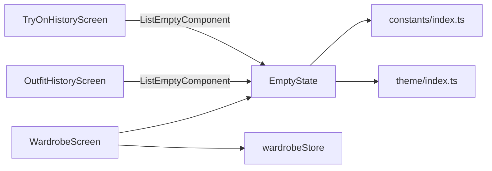

# 专用组件

<cite>
**本文档引用的文件**
- [FreeDressApp/src/components/EmptyState.tsx](file://FreeDressApp/src/components/EmptyState.tsx)
- [FreeDressApp/src/components/index.ts](file://FreeDressApp/src/components/index.ts)
- [FreeDressApp/src/constants/index.ts](file://FreeDressApp/src/constants/index.ts)
- [FreeDressApp/src/screens/WardrobeScreen.tsx](file://FreeDressApp/src/screens/WardrobeScreen.tsx)
- [FreeDressApp/src/screens/OutfitHistoryScreen.tsx](file://FreeDressApp/src/screens/OutfitHistoryScreen.tsx)
- [FreeDressApp/src/screens/TryOnHistoryScreen.tsx](file://FreeDressApp/src/screens/TryOnHistoryScreen.tsx)
- [FreeDressApp/src/store/wardrobeStore.ts](file://FreeDressApp/src/store/wardrobeStore.ts)
- [FreeDressApp/src/types/index.ts](file://FreeDressApp/src/types/index.ts)
- [FreeDressApp/src/theme/index.ts](file://FreeDressApp/src/theme/index.ts)
</cite>

## 目录
1. [简介](#简介)
2. [项目结构](#项目结构)
3. [核心组件](#核心组件)
4. [架构总览](#架构总览)
5. [详细组件分析](#详细组件分析)
6. [依赖关系分析](#依赖关系分析)
7. [性能考量](#性能考量)
8. [故障排查指南](#故障排查指南)
9. [结论](#结论)
10. [附录](#附录)

## 简介
本文件聚焦畅搭(FreeDress)中的EmptyState空状态组件，系统阐述其设计理念、用户体验价值、图标与文案策略、交互引导方式，以及在不同业务场景（衣橱为空、历史记录为空、搜索无结果等）中的应用。同时提供个性化定制方法、可访问性与多语言支持建议、最佳实践与优化策略，帮助开发者通过精心设计的空状态提升产品体验与转化率。

## 项目结构
- EmptyState组件位于组件库目录，作为通用UI部件被各业务屏幕复用。
- 业务场景主要分布在衣橱、搭配历史、试穿历史等屏幕，通过条件渲染决定是否展示空状态。
- 主题与设计令牌集中于constants与theme目录，保证视觉一致性。

图表来源
- [FreeDressApp/src/components/EmptyState.tsx:1-102](file://FreeDressApp/src/components/EmptyState.tsx#L1-L102)
- [FreeDressApp/src/components/index.ts:1-32](file://FreeDressApp/src/components/index.ts#L1-L32)
- [FreeDressApp/src/schemas/OutfitHistoryScreen.tsx:124-135](file://FreeDressApp/src/screens/OutfitHistoryScreen.tsx#L124-L135)
- [FreeDressApp/src/schemas/TryOnHistoryScreen.tsx:109-120](file://FreeDressApp/src/screens/TryOnHistoryScreen.tsx#L109-L120)
- [FreeDressApp/src/constants/index.ts:1-212](file://FreeDressApp/src/constants/index.ts#L1-L212)
- [FreeDressApp/src/theme/index.ts:1-7](file://FreeDressApp/src/theme/index.ts#L1-L7)

章节来源
- [FreeDressApp/src/components/EmptyState.tsx:1-102](file://FreeDressApp/src/components/EmptyState.tsx#L1-L102)
- [FreeDressApp/src/components/index.ts:1-32](file://FreeDressApp/src/components/index.ts#L1-L32)
- [FreeDressApp/src/constants/index.ts:1-212](file://FreeDressApp/src/constants/index.ts#L1-L212)
- [FreeDressApp/src/theme/index.ts:1-7](file://FreeDressApp/src/theme/index.ts#L1-L7)

## 核心组件
- EmptyState组件采用“杂志风”布局：期号装饰线、Kicker文本、主标题、副标题与行动按钮，形成清晰的信息层级与引导路径。
- 支持图标、Kicker文案、主副标题、行动按钮的完全可配置，满足不同场景的表达需求。
- 内部依赖主题色彩与间距体系，确保在不同屏幕与设备上保持一致的视觉节奏。

章节来源
- [FreeDressApp/src/components/EmptyState.tsx:1-102](file://FreeDressApp/src/components/EmptyState.tsx#L1-L102)
- [FreeDressApp/src/constants/index.ts:15-52](file://FreeDressApp/src/constants/index.ts#L15-L52)
- [FreeDressApp/src/constants/index.ts:100-115](file://FreeDressApp/src/constants/index.ts#L100-L115)

## 架构总览
EmptyState在多个业务场景中以两种方式出现：
- 衣橱列表为空时，直接渲染EmptyState并提供“开始上传”按钮跳转到添加衣物页面。
- 历史记录列表为空时，使用FlatList的ListEmptyComponent渲染简洁版空状态提示。

图表来源
- [FreeDressApp/src/screens/WardrobeScreen.tsx:213-221](file://FreeDressApp/src/screens/WardrobeScreen.tsx#L213-L221)
- [FreeDressApp/src/store/wardrobeStore.ts:43-53](file://FreeDressApp/src/store/wardrobeStore.ts#L43-L53)

章节来源
- [FreeDressApp/src/screens/WardrobeScreen.tsx:213-221](file://FreeDressApp/src/screens/WardrobeScreen.tsx#L213-L221)
- [FreeDressApp/src/store/wardrobeStore.ts:43-53](file://FreeDressApp/src/store/wardrobeStore.ts#L43-L53)

## 详细组件分析

### EmptyState组件设计与实现
- 结构组成：图标容器、Kicker装饰线与文本、主标题、可选副标题、可选行动按钮区域。
- 样式规范：基于主题色彩与间距网格，统一视觉与留白；按钮采用实心配色与右侧箭头插槽增强可发现性。
- 可扩展性：通过属性注入图标名、Kicker文案、标题、副标题与按钮行为，便于在多场景复用。

图表来源
- [FreeDressApp/src/components/EmptyState.tsx:12-62](file://FreeDressApp/src/components/EmptyState.tsx#L12-L62)
- [FreeDressApp/src/components/index.ts:6-31](file://FreeDressApp/src/components/index.ts#L6-L31)

章节来源
- [FreeDressApp/src/components/EmptyState.tsx:1-102](file://FreeDressApp/src/components/EmptyState.tsx#L1-L102)

### 应用场景与交互策略

#### 衣橱为空
- 触发条件：筛选后衣物列表为空且非加载中。
- 展示内容：期号装饰线、Kicker提示、主标题引导、副标题说明、带箭头的行动按钮。
- 交互策略：点击按钮直接导航到添加衣物页面，降低认知负担与操作步骤。

图表来源
- [FreeDressApp/src/screens/WardrobeScreen.tsx:213-221](file://FreeDressApp/src/screens/WardrobeScreen.tsx#L213-L221)

章节来源
- [FreeDressApp/src/screens/WardrobeScreen.tsx:213-221](file://FreeDressApp/src/screens/WardrobeScreen.tsx#L213-L221)

#### 历史记录为空（搭配历史）
- 触发条件：FlatList数据为空且非加载中。
- 展示内容：简洁空状态视图，包含图标、主标题与副标题提示。
- 交互策略：无行动按钮，通过屏幕头部返回按钮完成上下文切换。

章节来源
- [FreeDressApp/src/screens/OutfitHistoryScreen.tsx:124-135](file://FreeDressApp/src/screens/OutfitHistoryScreen.tsx#L124-L135)

#### 历史记录为空（试穿记录）
- 触发条件：FlatList数据为空且非加载中。
- 展示内容：简洁空状态视图，包含图标、主标题与副标题提示。
- 交互策略：无行动按钮，通过屏幕头部返回按钮完成上下文切换。

章节来源
- [FreeDressApp/src/screens/TryOnHistoryScreen.tsx:109-120](file://FreeDressApp/src/screens/TryOnHistoryScreen.tsx#L109-L120)

### 个性化定制方法
- 图标替换：通过属性传入任意Feather图标名，适配不同场景语义。
- 文案修改：支持Kicker、主标题、副标题的本地化与业务定制。
- 按钮配置：可选的行动按钮与回调，用于直接引导用户执行关键动作。
- 样式扩展：支持传入自定义容器样式，满足局部布局需求。

章节来源
- [FreeDressApp/src/components/EmptyState.tsx:12-30](file://FreeDressApp/src/components/EmptyState.tsx#L12-L30)

### 与用户引导流程的结合
- 在“衣橱为空”的场景中，EmptyState直接承载“开始上传”的行动按钮，形成从空状态到关键任务的闭环。
- 在“历史记录为空”的场景中，EmptyState作为过渡提示，配合屏幕头部返回按钮，维持上下文连贯性。

章节来源
- [FreeDressApp/src/screens/WardrobeScreen.tsx:213-221](file://FreeDressApp/src/screens/WardrobeScreen.tsx#L213-L221)
- [FreeDressApp/src/screens/OutfitHistoryScreen.tsx:100-109](file://FreeDressApp/src/screens/OutfitHistoryScreen.tsx#L100-L109)
- [FreeDressApp/src/screens/TryOnHistoryScreen.tsx:83-94](file://FreeDressApp/src/screens/TryOnHistoryScreen.tsx#L83-L94)

### 可访问性与多语言支持
- 可访问性：确保图标具备替代文本或通过语义化文案传达含义；按钮具备明确的焦点与触达范围；文本对比度符合无障碍标准。
- 多语言支持：文案通过属性注入，便于在国际化版本中替换为对应语言；图标语义需与文案协同，避免仅依赖视觉隐喻。

章节来源
- [FreeDressApp/src/components/EmptyState.tsx:12-30](file://FreeDressApp/src/components/EmptyState.tsx#L12-L30)

## 依赖关系分析
- EmptyState依赖主题色彩与间距网格，保证跨平台一致性。
- 在WardrobeScreen中，EmptyState与wardrobeStore联动，根据数据状态决定是否渲染。
- 在历史记录屏幕中，EmptyState以ListEmptyComponent形式出现，无需额外状态管理。

图表来源
- [FreeDressApp/src/components/EmptyState.tsx:8-10](file://FreeDressApp/src/components/EmptyState.tsx#L8-L10)
- [FreeDressApp/src/screens/WardrobeScreen.tsx:18-50](file://FreeDressApp/src/screens/WardrobeScreen.tsx#L18-L50)
- [FreeDressApp/src/store/wardrobeStore.ts:1-83](file://FreeDressApp/src/store/wardrobeStore.ts#L1-L83)
- [FreeDressApp/src/schemas/OutfitHistoryScreen.tsx:124-135](file://FreeDressApp/src/schemas/OutfitHistoryScreen.tsx#L124-L135)
- [FreeDressApp/src/schemas/TryOnHistoryScreen.tsx:109-120](file://FreeDressApp/src/schemas/TryOnHistoryScreen.tsx#L109-L120)

章节来源
- [FreeDressApp/src/components/EmptyState.tsx:1-102](file://FreeDressApp/src/components/EmptyState.tsx#L1-L102)
- [FreeDressApp/src/constants/index.ts:1-212](file://FreeDressApp/src/constants/index.ts#L1-L212)
- [FreeDressApp/src/theme/index.ts:1-7](file://FreeDressApp/src/theme/index.ts#L1-L7)
- [FreeDressApp/src/screens/WardrobeScreen.tsx:1-423](file://FreeDressApp/src/screens/WardrobeScreen.tsx#L1-L423)
- [FreeDressApp/src/store/wardrobeStore.ts:1-83](file://FreeDressApp/src/store/wardrobeStore.ts#L1-L83)
- [FreeDressApp/src/schemas/OutfitHistoryScreen.tsx:1-212](file://FreeDressApp/src/schemas/OutfitHistoryScreen.tsx#L1-L212)
- [FreeDressApp/src/schemas/TryOnHistoryScreen.tsx:1-189](file://FreeDressApp/src/schemas/TryOnHistoryScreen.tsx#L1-L189)

## 性能考量
- 列表空状态渲染：在大量数据场景中，优先使用FlatList的ListEmptyComponent以减少不必要的子树渲染。
- 图标与文本：使用矢量图标与轻量文本组件，避免复杂图片资源带来的内存压力。
- 主题与样式：统一使用主题常量与样式对象，减少重复计算与样式抖动。

## 故障排查指南
- 空状态未显示：检查数据加载状态与过滤逻辑，确认空状态渲染分支已触发。
- 图标不显示：确认图标名称正确且图标库已正确引入。
- 文案溢出：控制标题与副标题长度，避免超长文案导致布局异常。
- 按钮无响应：检查onAction回调绑定与导航栈状态。

章节来源
- [FreeDressApp/src/screens/WardrobeScreen.tsx:213-221](file://FreeDressApp/src/screens/WardrobeScreen.tsx#L213-L221)
- [FreeDressApp/src/schemas/OutfitHistoryScreen.tsx:124-135](file://FreeDressApp/src/schemas/OutfitHistoryScreen.tsx#L124-L135)
- [FreeDressApp/src/schemas/TryOnHistoryScreen.tsx:109-120](file://FreeDressApp/src/schemas/TryOnHistoryScreen.tsx#L109-L120)

## 结论
EmptyState通过简洁而富有表现力的“杂志风”布局，在不同业务场景中有效缓解用户的空状态焦虑，提供明确的行动指引。通过主题化设计与高度可配置的属性，它既能快速适配现有业务，也能灵活支撑未来扩展。建议在新增场景时遵循统一的文案与交互范式，持续优化空状态的可发现性与转化效率。

## 附录
- 组件导出入口：确保EmptyState在组件库统一出口中正确导出，便于全局复用。
- 类型与API：衣橱相关类型与API为EmptyState在衣橱场景中的数据驱动提供基础。

章节来源
- [FreeDressApp/src/components/index.ts:13-13](file://FreeDressApp/src/components/index.ts#L13-L13)
- [FreeDressApp/src/types/index.ts:18-33](file://FreeDressApp/src/types/index.ts#L18-L33)
- [FreeDressApp/src/api/clothes.ts:34-53](file://FreeDressApp/src/api/clothes.ts#L34-L53)