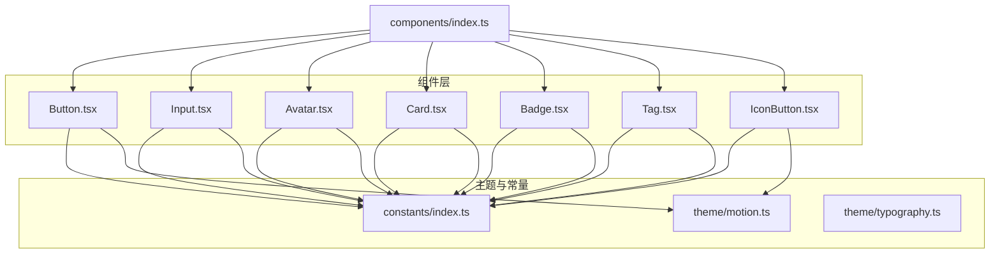
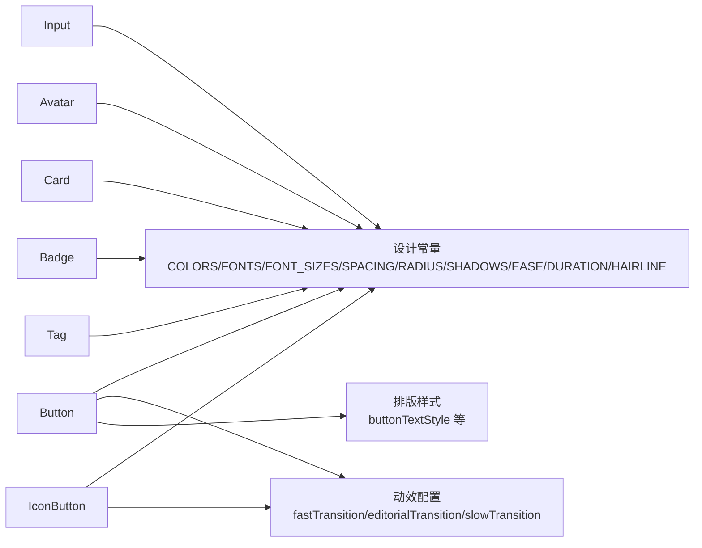
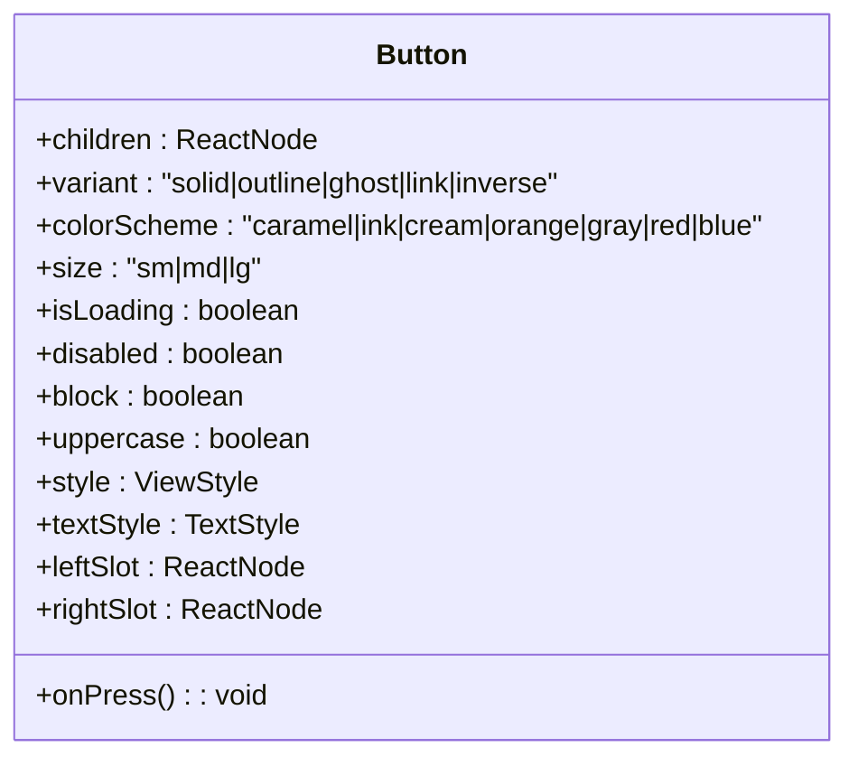
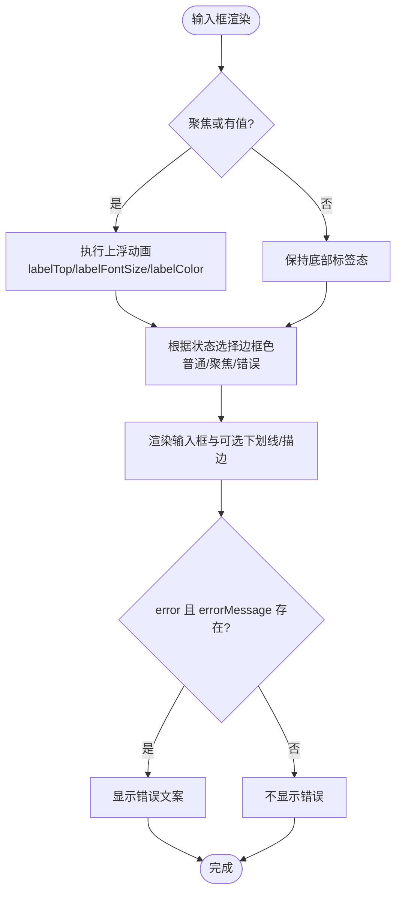
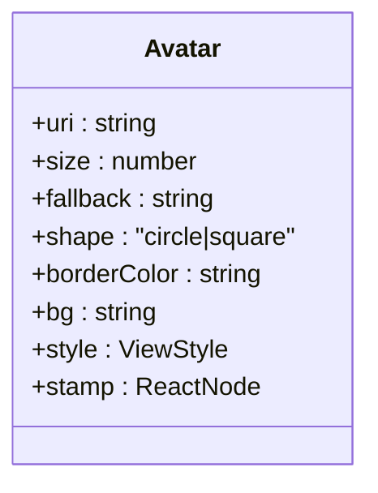
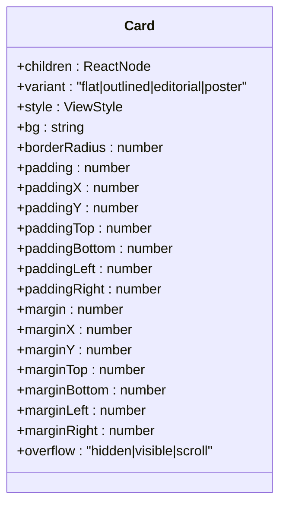
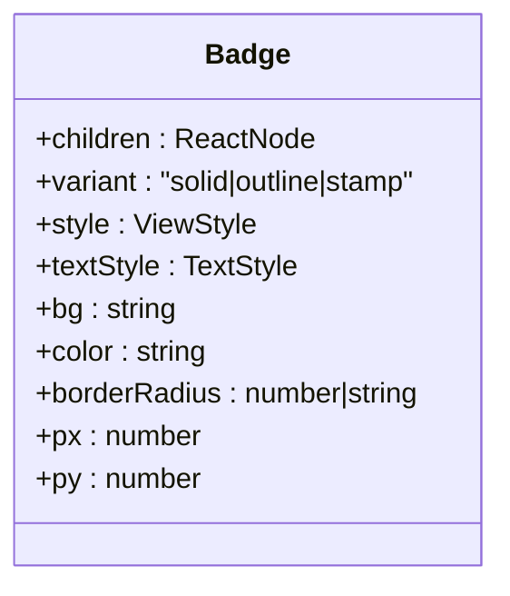
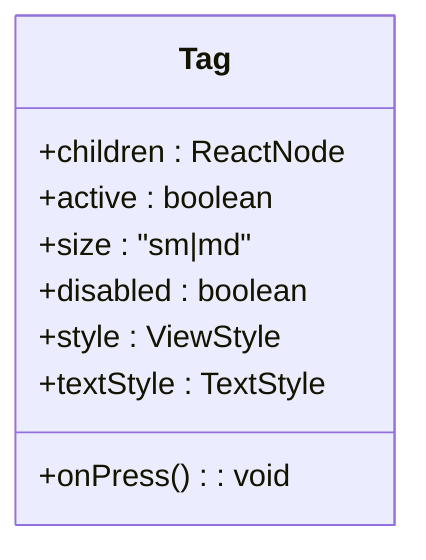
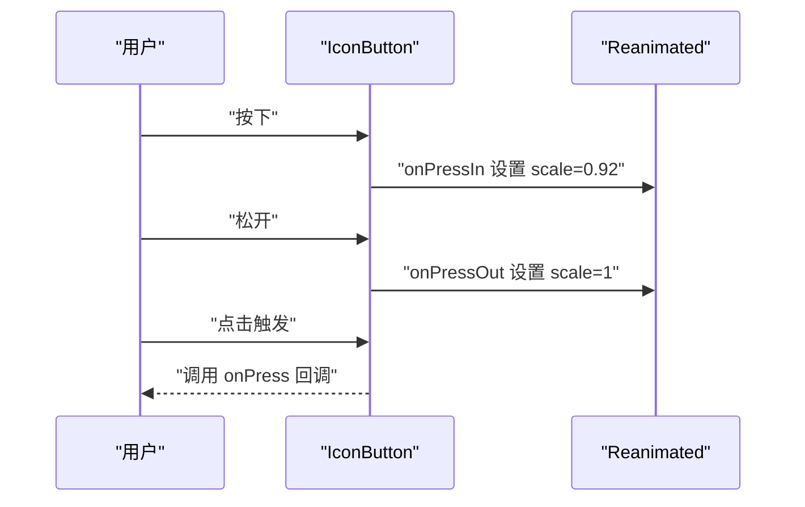
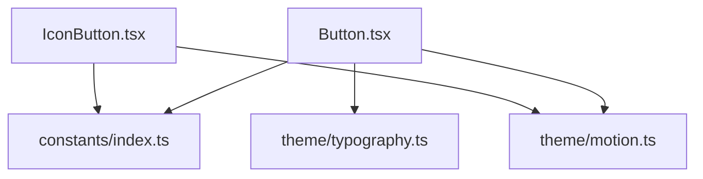

# 基础组件

<cite>
**本文档引用的文件**
- [Button.tsx](file://FreeDressApp/src/components/Button.tsx)
- [Input.tsx](file://FreeDressApp/src/components/Input.tsx)
- [Avatar.tsx](file://FreeDressApp/src/components/Avatar.tsx)
- [Card.tsx](file://FreeDressApp/src/components/Card.tsx)
- [Badge.tsx](file://FreeDressApp/src/components/Badge.tsx)
- [Tag.tsx](file://FreeDressApp/src/components/Tag.tsx)
- [IconButton.tsx](file://FreeDressApp/src/components/IconButton.tsx)
- [index.ts](file://FreeDressApp/src/components/index.ts)
- [index.ts](file://FreeDressApp/src/constants/index.ts)
- [motion.ts](file://FreeDressApp/src/theme/motion.ts)
- [typography.ts](file://FreeDressApp/src/theme/typography.ts)
</cite>

## 目录
1. [简介](#简介)
2. [项目结构](#项目结构)
3. [核心组件](#核心组件)
4. [架构总览](#架构总览)
5. [详细组件分析](#详细组件分析)
6. [依赖关系分析](#依赖关系分析)
7. [性能考量](#性能考量)
8. [故障排查指南](#故障排查指南)
9. [结论](#结论)
10. [附录](#附录)

## 简介
本文件为畅搭(FreeDress)基础UI组件库的权威文档，覆盖以下组件：Button（按钮）、Input（输入框）、Avatar（头像）、Card（卡片）、Badge（徽章）、Tag（标签）、IconButton（图标按钮）。内容包括：
- 组件能力与变体/尺寸/状态说明
- Props 属性、事件回调与样式定制
- 使用示例路径（以源码路径代替具体代码）
- 可访问性与无障碍建议
- 最佳实践与常见问题

## 项目结构
组件位于 FreeDressApp/src/components 目录，通过统一入口导出；设计系统常量与主题由 constants 与 theme 提供。

**图表来源**
- [index.ts:6-18](file://FreeDressApp/src/components/index.ts#L6-L18)
- [index.ts:15-52](file://FreeDressApp/src/constants/index.ts#L15-L52)
- [motion.ts:1-32](file://FreeDressApp/src/theme/motion.ts#L1-L32)
- [typography.ts:108-114](file://FreeDressApp/src/theme/typography.ts#L108-L114)

**章节来源**
- [index.ts:6-18](file://FreeDressApp/src/components/index.ts#L6-L18)

## 核心组件
本节概述各组件的能力边界与通用特性：
- Button：支持五种变体、多种配色方案、三种尺寸、加载/禁用状态、装饰插槽、按压缩放反馈。
- Input：支持 outline/underline/filled 三种外观，浮动标签动画，聚焦/错误态颜色变化，错误信息展示。
- Avatar：圆形/方形头像，支持占位字符与右下角徽标。
- Card：四种变体（flat/outlined/editorial/poster），兼容旧版内边距/外边距/圆角/背景等 API。
- Badge：三种变体（solid/outline/stamp），支持背景/文字色、圆角、内边距定制。
- Tag：胶囊标签，active/inactive 两种状态，支持尺寸与交互。
- IconButton：图标按钮，支持圆形/方形、多变体、按压缩放反馈。

**章节来源**
- [Button.tsx:1-201](file://FreeDressApp/src/components/Button.tsx#L1-L201)
- [Input.tsx:1-183](file://FreeDressApp/src/components/Input.tsx#L1-L183)
- [Avatar.tsx:1-93](file://FreeDressApp/src/components/Avatar.tsx#L1-L93)
- [Card.tsx:1-124](file://FreeDressApp/src/components/Card.tsx#L1-L124)
- [Badge.tsx:1-124](file://FreeDressApp/src/components/Badge.tsx#L1-L124)
- [Tag.tsx:1-91](file://FreeDressApp/src/components/Tag.tsx#L1-L91)
- [IconButton.tsx:1-126](file://FreeDressApp/src/components/IconButton.tsx#L1-L126)

## 架构总览
组件间共享设计令牌（颜色、字号、间距、圆角、阴影、动效），并通过主题模块统一动效参数，Typography 提供按钮文本样式预设。

**图表来源**
- [index.ts:15-174](file://FreeDressApp/src/constants/index.ts#L15-L174)
- [motion.ts:9-24](file://FreeDressApp/src/theme/motion.ts#L9-L24)
- [typography.ts:108-114](file://FreeDressApp/src/theme/typography.ts#L108-L114)

## 详细组件分析

### Button 按钮
- 变体：solid / outline / ghost / link / inverse
- 配色：caramel / ink / cream，以及 orange → caramel、gray → ink、red → caramel、blue → ink 的兼容映射
- 尺寸：sm / md / lg（对应内边距与字号）
- 交互：按压缩放（scale）、加载指示器、禁用态、块级宽度、文本大写
- 插槽：leftSlot / rightSlot 支持装饰元素（如图标/箭头）
- 样式扩展：style、textStyle
- 事件：onPress
- 影响：部分变体在特定配色下应用阴影

**图表来源**
- [Button.tsx:29-45](file://FreeDressApp/src/components/Button.tsx#L29-L45)

**章节来源**
- [Button.tsx:1-201](file://FreeDressApp/src/components/Button.tsx#L1-L201)

### Input 输入框
- 外观：outline / underline / filled
- 浮动标签：聚焦或有值时上浮，动画曲线与字号/颜色联动
- 状态色：普通/聚焦/错误三种状态的边框色切换
- 错误提示：error 与 errorMessage 控制显示
- 容器样式：containerStyle
- 文本输入：继承 TextInputProps，支持 value、placeholder、onFocus/onBlur 等

**图表来源**
- [Input.tsx:49-78](file://FreeDressApp/src/components/Input.tsx#L49-L78)
- [Input.tsx:113-121](file://FreeDressApp/src/components/Input.tsx#L113-L121)

**章节来源**
- [Input.tsx:1-183](file://FreeDressApp/src/components/Input.tsx#L1-L183)

### Avatar 头像
- 形状：circle / square
- 尺寸：size（像素）
- 占位：fallback 字符串，首字母大写；无 uri 时显示
- 边框与背景：borderColor、bg
- 徽标：stamp 放置于右下角绝对定位
- 适配：圆形自动以半径为圆角，方形使用固定圆角

**图表来源**
- [Avatar.tsx:9-19](file://FreeDressApp/src/components/Avatar.tsx#L9-L19)

**章节来源**
- [Avatar.tsx:1-93](file://FreeDressApp/src/components/Avatar.tsx#L1-L93)

### Card 卡片
- 变体：flat / outlined / editorial / poster
- 兼容旧 API：borderRadius、padding/paddingX/paddingY、margin/marginX/marginY、overflow、bg
- 样式：backgroundColor、borderRadius、borderWidth/borderColor、阴影（poster）

**图表来源**
- [Card.tsx:12-33](file://FreeDressApp/src/components/Card.tsx#L12-L33)

**章节来源**
- [Card.tsx:1-124](file://FreeDressApp/src/components/Card.tsx#L1-L124)

### Badge 徽章
- 变体：solid / outline / stamp
- 定制：bg、color、borderRadius（支持 'full'）、px/py 内边距倍数
- 文本：当 children 为字符串/数字时，应用字号、字距、字形与大小写

**图表来源**
- [Badge.tsx:11-21](file://FreeDressApp/src/components/Badge.tsx#L11-L21)

**章节来源**
- [Badge.tsx:1-124](file://FreeDressApp/src/components/Badge.tsx#L1-L124)

### Tag 标签
- 状态：active（实心）/ inactive（描边）
- 尺寸：sm / md
- 交互：onPress、disabled、按压透明度变化
- 样式：内边距、字号、文字色、圆角

**图表来源**
- [Tag.tsx:22-30](file://FreeDressApp/src/components/Tag.tsx#L22-L30)

**章节来源**
- [Tag.tsx:1-91](file://FreeDressApp/src/components/Tag.tsx#L1-L91)

### IconButton 图标按钮
- 形状：circle / square
- 尺寸：buttonSize（整体尺寸）、size（图标尺寸）
- 变体：ghost / outline / solid / inverse / caramel
- 交互：按压缩放（scale）、禁用态、onPress
- 图标：基于 Feather 图标库

**图表来源**
- [IconButton.tsx:49-75](file://FreeDressApp/src/components/IconButton.tsx#L49-L75)
- [motion.ts:21-24](file://FreeDressApp/src/theme/motion.ts#L21-L24)

**章节来源**
- [IconButton.tsx:1-126](file://FreeDressApp/src/components/IconButton.tsx#L1-L126)

## 依赖关系分析
- Button 与 IconButton 依赖动效配置 fastTransition，实现按压反馈
- Typography 提供按钮文本样式预设
- 所有组件共享 constants 中的颜色、字号、间距、圆角、阴影、发丝线等设计令牌

**图表来源**
- [index.ts:15-174](file://FreeDressApp/src/constants/index.ts#L15-L174)
- [motion.ts:9-24](file://FreeDressApp/src/theme/motion.ts#L9-L24)
- [typography.ts:108-114](file://FreeDressApp/src/theme/typography.ts#L108-L114)
- [Button.tsx:15-23](file://FreeDressApp/src/components/Button.tsx#L15-L23)
- [IconButton.tsx:7-14](file://FreeDressApp/src/components/IconButton.tsx#L7-L14)

**章节来源**
- [index.ts:15-174](file://FreeDressApp/src/constants/index.ts#L15-L174)
- [motion.ts:1-32](file://FreeDressApp/src/theme/motion.ts#L1-L32)
- [typography.ts:108-114](file://FreeDressApp/src/theme/typography.ts#L108-L114)

## 性能考量
- Button 与 IconButton 使用 Reanimated 的 useSharedValue/useAnimatedStyle，确保按压缩放在原生线程执行，避免 JS 线程抖动。
- Input 的标签动画使用 Animated.Value 与 timing，注意避免在高频输入场景中重复创建动画实例。
- Avatar 在无 uri 时使用纯文本占位，减少不必要的网络请求与解码成本。
- Card 的阴影与圆角在 Android 上通过 elevation/shadowOpacity 控制，建议在复杂层级中避免过度叠加阴影。

[本节为通用指导，无需列出章节来源]

## 故障排查指南
- 按钮点击无效
  - 检查 disabled 或 isLoading 是否为真，两者会禁用交互
  - 确认 onPress 是否传入
  - 参考路径：[Button.tsx:85-85](file://FreeDressApp/src/components/Button.tsx#L85-L85)、[IconButton.tsx:51-51](file://FreeDressApp/src/components/IconButton.tsx#L51-L51)
- 输入框焦点状态异常
  - 确认 onFocus/onBlur 是否被覆盖导致状态未更新
  - 错误态需同时设置 error 与 errorMessage
  - 参考路径：[Input.tsx:113-121](file://FreeDressApp/src/components/Input.tsx#L113-L121)、[Input.tsx:135-137](file://FreeDressApp/src/components/Input.tsx#L135-L137)
- 头像显示异常
  - 无 uri 时显示 fallback 首字母；检查 fallback 字符串是否为空
  - 圆形头像圆角由半径决定，方形使用固定圆角
  - 参考路径：[Avatar.tsx:48-66](file://FreeDressApp/src/components/Avatar.tsx#L48-L66)
- 卡片样式错乱
  - 优先使用 variant 预设；如需覆盖请明确 bg、borderRadius 等
  - 参考路径：[Card.tsx:56-85](file://FreeDressApp/src/components/Card.tsx#L56-L85)
- 徽章文本不生效
  - 当 children 不是字符串/数字时，不会包裹文本组件；请传入字符串或数字
  - 参考路径：[Badge.tsx:55-72](file://FreeDressApp/src/components/Badge.tsx#L55-L72)
- 标签交互无反馈
  - 确保传入 onPress；disabled 为真时会禁用交互
  - 参考路径：[Tag.tsx:47-48](file://FreeDressApp/src/components/Tag.tsx#L47-L48)

**章节来源**
- [Button.tsx:85-85](file://FreeDressApp/src/components/Button.tsx#L85-L85)
- [IconButton.tsx:51-51](file://FreeDressApp/src/components/IconButton.tsx#L51-L51)
- [Input.tsx:113-121](file://FreeDressApp/src/components/Input.tsx#L113-L121)
- [Input.tsx:135-137](file://FreeDressApp/src/components/Input.tsx#L135-L137)
- [Avatar.tsx:48-66](file://FreeDressApp/src/components/Avatar.tsx#L48-L66)
- [Card.tsx:56-85](file://FreeDressApp/src/components/Card.tsx#L56-L85)
- [Badge.tsx:55-72](file://FreeDressApp/src/components/Badge.tsx#L55-L72)
- [Tag.tsx:47-48](file://FreeDressApp/src/components/Tag.tsx#L47-L48)

## 结论
以上组件遵循统一的设计令牌与动效体系，具备良好的可扩展性与一致性。Button 与 IconButton 提供丰富的交互反馈；Input 提供清晰的视觉状态与无障碍提示；Avatar/Tag/Badge/IconButton 提供多样化的语义化承载；Card 则为内容容器提供多风格变体。建议在业务开发中优先使用这些组件，并通过 style/textStyle 进行局部定制。

[本节为总结性内容，无需列出章节来源]

## 附录

### 组件使用示例（路径参考）
- Button 基础使用与变体/尺寸/颜色组合
  - [Button.tsx:49-63](file://FreeDressApp/src/components/Button.tsx#L49-L63)
- Input 浮动标签与错误态
  - [Input.tsx:33-48](file://FreeDressApp/src/components/Input.tsx#L33-L48)
- Avatar 占位与徽标
  - [Avatar.tsx:21-30](file://FreeDressApp/src/components/Avatar.tsx#L21-L30)
- Card 多变体与内边距
  - [Card.tsx:35-56](file://FreeDressApp/src/components/Card.tsx#L35-L56)
- Badge 数字与文本
  - [Badge.tsx:23-33](file://FreeDressApp/src/components/Badge.tsx#L23-L33)
- Tag 活跃/非活跃状态
  - [Tag.tsx:32-40](file://FreeDressApp/src/components/Tag.tsx#L32-L40)
- IconButton 图标与形状
  - [IconButton.tsx:31-40](file://FreeDressApp/src/components/IconButton.tsx#L31-L40)

### 可访问性与无障碍建议
- 按钮与图标按钮
  - 建议提供可读的文本描述（如通过屏幕阅读器可读的文本），并在图标按钮场景补充可选的文本标签
  - 参考路径：[Button.tsx:107-119](file://FreeDressApp/src/components/Button.tsx#L107-L119)、[IconButton.tsx:73-73](file://FreeDressApp/src/components/IconButton.tsx#L73-L73)
- 输入框
  - 使用 label 提供清晰的语义；错误信息应简洁明确
  - 参考路径：[Input.tsx:82-94](file://FreeDressApp/src/components/Input.tsx#L82-L94)、[Input.tsx:135-137](file://FreeDressApp/src/components/Input.tsx#L135-L137)
- 头像
  - 无 URI 时的 fallback 应具有可识别性；必要时提供替代文本
  - 参考路径：[Avatar.tsx:57-66](file://FreeDressApp/src/components/Avatar.tsx#L57-L66)
- 卡片
  - 内容区域建议使用语义化结构，避免仅依赖视觉样式
  - 参考路径：[Card.tsx:61-89](file://FreeDressApp/src/components/Card.tsx#L61-L89)
- 徽章与标签
  - 状态类徽章与标签应配合上下文语义使用，避免仅依赖颜色传达信息
  - 参考路径：[Badge.tsx:40-74](file://FreeDressApp/src/components/Badge.tsx#L40-L74)、[Tag.tsx:45-74](file://FreeDressApp/src/components/Tag.tsx#L45-L74)

### 最佳实践
- 统一使用 constants 中的颜色与字号，确保跨平台一致性
  - 参考路径：[index.ts:15-97](file://FreeDressApp/src/constants/index.ts#L15-L97)
- 按压反馈使用 Reanimated 动画，避免 JS 线程阻塞
  - 参考路径：[Button.tsx:64-78](file://FreeDressApp/src/components/Button.tsx#L64-L78)、[IconButton.tsx:41-57](file://FreeDressApp/src/components/IconButton.tsx#L41-L57)
- 文本样式优先使用 Typography 预设，保证排版一致
  - 参考路径：[typography.ts:108-114](file://FreeDressApp/src/theme/typography.ts#L108-L114)