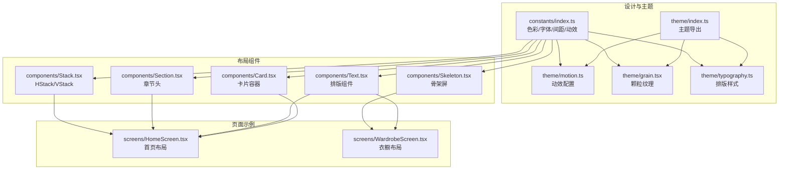
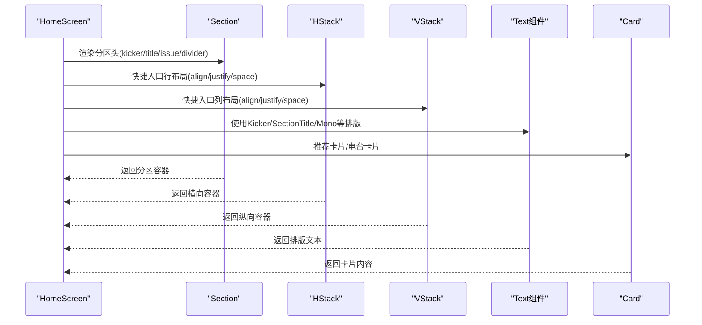
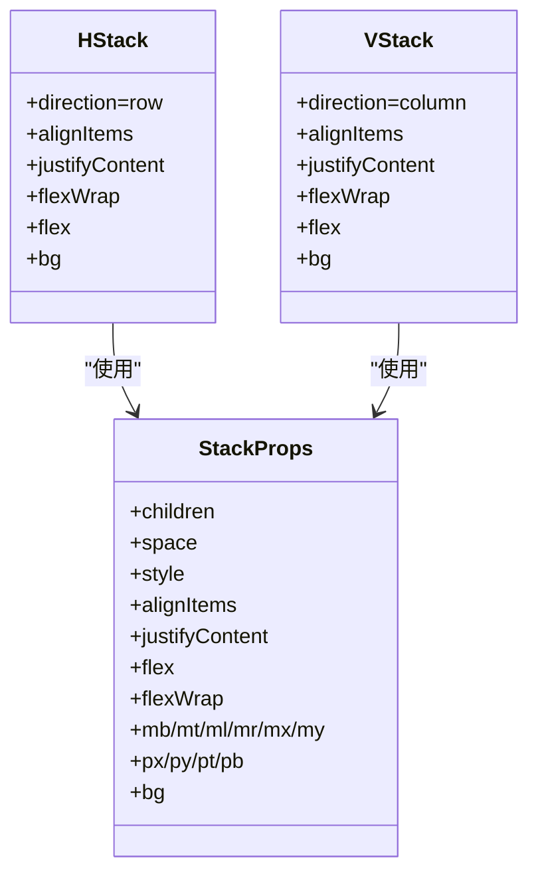
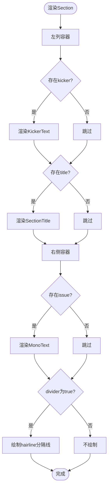
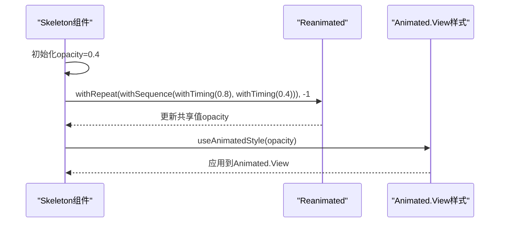
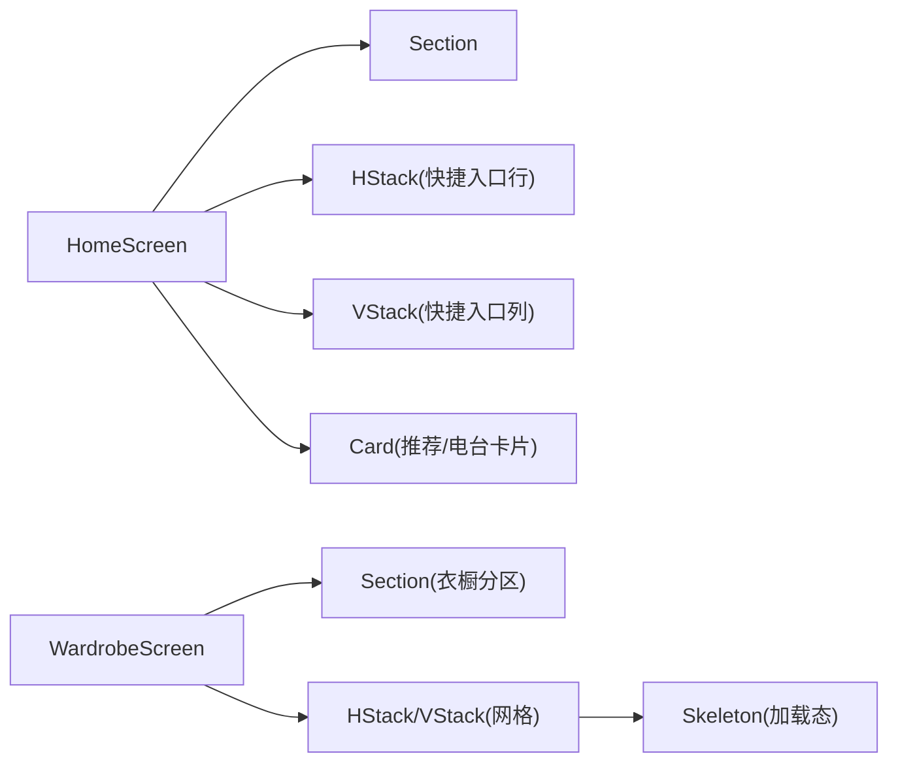
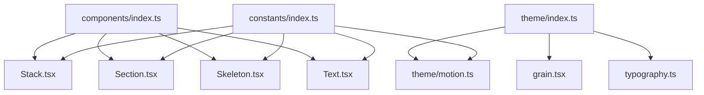

# 布局组件

<cite>
**本文档引用的文件**
- [Stack.tsx](file://FreeDressApp/src/components/Stack.tsx)
- [Section.tsx](file://FreeDressApp/src/components/Section.tsx)
- [Skeleton.tsx](file://FreeDressApp/src/components/Skeleton.tsx)
- [index.ts](file://FreeDressApp/src/components/index.ts)
- [index.ts](file://FreeDressApp/src/constants/index.ts)
- [index.ts](file://FreeDressApp/src/theme/index.ts)
- [motion.ts](file://FreeDressApp/src/theme/motion.ts)
- [grain.tsx](file://FreeDressApp/src/theme/grain.tsx)
- [typography.ts](file://FreeDressApp/src/theme/typography.ts)
- [Text.tsx](file://FreeDressApp/src/components/Text.tsx)
- [HomeScreen.tsx](file://FreeDressApp/src/screens/HomeScreen.tsx)
- [WardrobeScreen.tsx](file://FreeDressApp/src/screens/WardrobeScreen.tsx)
</cite>

## 目录
1. [简介](#简介)
2. [项目结构](#项目结构)
3. [核心组件](#核心组件)
4. [架构总览](#架构总览)
5. [详细组件分析](#详细组件分析)
6. [依赖关系分析](#依赖关系分析)
7. [性能考量](#性能考量)
8. [故障排查指南](#故障排查指南)
9. [结论](#结论)
10. [附录](#附录)

## 简介
本文件面向畅搭(FreeDress)应用的布局组件，系统性梳理HStack与VStack堆叠布局、Section章节组件以及Skeleton骨架屏组件的设计理念、接口能力与最佳实践。文档同时结合Editorial Couture设计语言，给出复杂页面结构中的组合使用方法、嵌套技巧、响应式布局与移动端适配策略，并提供性能优化建议与常见问题排查指引。

## 项目结构
布局组件位于前端工程的组件层，围绕“设计令牌 + 主题样式 + 布局组件”的分层组织：
- 设计令牌与主题：constants 提供色彩、字体、间距、圆角、动效曲线与时长；theme 提供排版样式与动效配置；grain 提供颗粒纹理背景。
- 布局组件：Stack（HStack/VStack）、Section、Skeleton；Text提供排版组件；Card提供卡片容器。
- 页面使用：HomeScreen 与 WardrobeScreen 展示了组件在真实场景中的组合使用。

图表来源
- [index.ts:1-155](file://FreeDressApp/src/components/Stack.tsx#L1-L155)
- [index.ts:1-68](file://FreeDressApp/src/components/Section.tsx#L1-L68)
- [index.ts:1-63](file://FreeDressApp/src/components/Skeleton.tsx#L1-L63)
- [index.ts:1-32](file://FreeDressApp/src/components/index.ts#L1-L32)
- [index.ts:1-212](file://FreeDressApp/src/constants/index.ts#L1-L212)
- [index.ts:1-7](file://FreeDressApp/src/theme/index.ts#L1-L7)
- [motion.ts:1-32](file://FreeDressApp/src/theme/motion.ts#L1-L32)
- [grain.tsx:1-78](file://FreeDressApp/src/theme/grain.tsx#L1-L78)
- [typography.ts:1-115](file://FreeDressApp/src/theme/typography.ts#L1-L115)
- [Text.tsx:1-68](file://FreeDressApp/src/components/Text.tsx#L1-L68)
- [HomeScreen.tsx:1-606](file://FreeDressApp/src/screens/HomeScreen.tsx#L1-L606)
- [WardrobeScreen.tsx:1-423](file://FreeDressApp/src/screens/WardrobeScreen.tsx#L1-L423)

章节来源
- [index.ts:1-32](file://FreeDressApp/src/components/index.ts#L1-L32)
- [index.ts:1-212](file://FreeDressApp/src/constants/index.ts#L1-L212)

## 核心组件
- HStack/VStack：基于React Native的View实现的横向/纵向堆叠容器，支持统一间距解析、对齐方式、包裹换行与背景色。
- Section：杂志风分区头，左侧小字Kicker+中部衬线主标题+右侧等宽期号，可选底部hairline分隔线。
- Skeleton：基于Reanimated的骨架屏，实现柔和shimmer动画，支持宽度、高度、圆角与自定义样式。

章节来源
- [Stack.tsx:63-145](file://FreeDressApp/src/components/Stack.tsx#L63-L145)
- [Section.tsx:22-43](file://FreeDressApp/src/components/Section.tsx#L22-L43)
- [Skeleton.tsx:23-56](file://FreeDressApp/src/components/Skeleton.tsx#L23-L56)

## 架构总览
以下序列图展示了页面如何通过布局组件构建Editorial Couture风格的界面：

图表来源
- [HomeScreen.tsx:208-231](file://FreeDressApp/src/screens/HomeScreen.tsx#L208-L231)
- [Section.tsx:22-43](file://FreeDressApp/src/components/Section.tsx#L22-L43)
- [Stack.tsx:63-145](file://FreeDressApp/src/components/Stack.tsx#L63-L145)
- [Text.tsx:28-67](file://FreeDressApp/src/components/Text.tsx#L28-L67)
- [Card.tsx:35-89](file://FreeDressApp/src/components/Card.tsx#L35-L89)

## 详细组件分析

### HStack 与 VStack 堆叠布局
- 方向控制：HStack固定横向(row)，VStack固定纵向(column)。
- 间距设置：
  - space：统一的子项间距，支持SPACING token或像素值。
  - mb/mt/ml/mr/mx/my/px/py/pt/pb：便捷的边距/内边距属性，自动解析为像素。
  - resolveSpacing统一将token或数字映射为像素值。
- 对齐方式：
  - alignItems：主轴对齐（flex-start/flex-end/center/stretch/baseline）。
  - justifyContent：交叉轴分布（flex-start/flex-end/center/space-between/space-around/space-evenly）。
- 其他特性：flex、flexWrap、bg、style透传给底层View。

图表来源
- [Stack.tsx:11-37](file://FreeDressApp/src/components/Stack.tsx#L11-L37)
- [Stack.tsx:63-145](file://FreeDressApp/src/components/Stack.tsx#L63-L145)

章节来源
- [Stack.tsx:39-61](file://FreeDressApp/src/components/Stack.tsx#L39-L61)
- [Stack.tsx:63-145](file://FreeDressApp/src/components/Stack.tsx#L63-L145)

### Section 章节组件
- 结构：左列(kicker+title)、右侧(issue)、可选divider。
- 样式：使用KickerText、SectionTitle、MonoText等排版组件；divider采用hairline细线。
- 设计语言：Editorial Couture强调的衬线主标题、等宽期号与极小Kicker标签，体现“邮政单色主义·新极简”。

图表来源
- [Section.tsx:22-43](file://FreeDressApp/src/components/Section.tsx#L22-L43)
- [Text.tsx:28-67](file://FreeDressApp/src/components/Text.tsx#L28-L67)
- [index.ts:173-174](file://FreeDressApp/src/constants/index.ts#L173-L174)

章节来源
- [Section.tsx:22-43](file://FreeDressApp/src/components/Section.tsx#L22-L43)
- [Text.tsx:28-67](file://FreeDressApp/src/components/Text.tsx#L28-L67)

### Skeleton 骨架屏组件
- 动画：基于Reanimated的withRepeat+withSequence+withTiming，实现持续shimmer效果。
- 性能：使用useSharedValue与useAnimatedStyle，避免频繁重排；默认使用editorial动效曲线与时长。
- 样式：默认浅灰背景、小圆角，支持width/height/borderRadius/style覆盖。

图表来源
- [Skeleton.tsx:23-56](file://FreeDressApp/src/components/Skeleton.tsx#L23-L56)
- [motion.ts:8-12](file://FreeDressApp/src/theme/motion.ts#L8-L12)
- [index.ts:158-171](file://FreeDressApp/src/constants/index.ts#L158-L171)

章节来源
- [Skeleton.tsx:23-56](file://FreeDressApp/src/components/Skeleton.tsx#L23-L56)
- [motion.ts:1-32](file://FreeDressApp/src/theme/motion.ts#L1-L32)

### 在复杂页面中的组合使用与嵌套技巧
- HomeScreen示例：
  - 使用Section作为分区头，配合HStack/VStack实现不对称快捷入口网格。
  - 推荐区域使用水平滚动列表与HStack/VStack组合，配合间距token实现统一节奏。
  - 使用Card包装内容块，结合hairline边框与editorial风格背景。
- WardrobeScreen示例：
  - 列表加载态使用Skeleton占位，提升感知性能。
  - 使用HStack/VStack组织分类筛选、搜索栏与网格卡片布局。

图表来源
- [HomeScreen.tsx:208-261](file://FreeDressApp/src/screens/HomeScreen.tsx#L208-L261)
- [WardrobeScreen.tsx:201-234](file://FreeDressApp/src/screens/WardrobeScreen.tsx#L201-L234)

章节来源
- [HomeScreen.tsx:1-606](file://FreeDressApp/src/screens/HomeScreen.tsx#L1-L606)
- [WardrobeScreen.tsx:1-423](file://FreeDressApp/src/screens/WardrobeScreen.tsx#L1-L423)

## 依赖关系分析
- 设计令牌与主题：
  - constants提供COLORS、SPACING、RADIUS、EASE、DURATION、HAIRLINE等基础资源。
  - theme提供排版样式与动效配置，motion封装withTiming默认参数。
- 组件依赖：
  - Stack依赖SPACING进行间距解析；Section依赖Text组件与HAIRLINE；Skeleton依赖Reanimated与motion配置。
- 导出入口：
  - components/index.ts统一导出布局与文本组件，便于页面按需引入。

图表来源
- [index.ts:1-212](file://FreeDressApp/src/constants/index.ts#L1-L212)
- [index.ts:1-7](file://FreeDressApp/src/theme/index.ts#L1-L7)
- [motion.ts:1-32](file://FreeDressApp/src/theme/motion.ts#L1-L32)
- [grain.tsx:1-78](file://FreeDressApp/src/theme/grain.tsx#L1-L78)
- [typography.ts:1-115](file://FreeDressApp/src/theme/typography.ts#L1-L115)
- [index.ts:1-32](file://FreeDressApp/src/components/index.ts#L1-L32)

章节来源
- [index.ts:1-32](file://FreeDressApp/src/components/index.ts#L1-L32)
- [index.ts:1-212](file://FreeDressApp/src/constants/index.ts#L1-L212)

## 性能考量
- Skeleton动画：
  - 使用withRepeat与withSequence实现平滑循环，避免每帧重复创建动画对象。
  - 默认editorial曲线与时长，兼顾感知速度与自然度。
- 间距解析：
  - resolveSpacing统一解析SPACING token，减少条件判断开销。
- Reanimated与样式：
  - useSharedValue与useAnimatedStyle仅在必要时更新，避免不必要的重渲染。
- 列表与网格：
  - 使用HStack/VStack的flexWrap与flex属性，结合SPACING实现响应式网格，减少额外容器层级。

章节来源
- [Skeleton.tsx:29-44](file://FreeDressApp/src/components/Skeleton.tsx#L29-L44)
- [Stack.tsx:39-46](file://FreeDressApp/src/components/Stack.tsx#L39-L46)
- [motion.ts:8-12](file://FreeDressApp/src/theme/motion.ts#L8-L12)

## 故障排查指南
- 间距不生效：
  - 检查是否使用SPACING token或像素值；确认resolveSpacing逻辑是否正确解析。
- 对齐异常：
  - 确认alignItems与justifyContent组合是否符合预期；注意HStack/VStack默认主轴方向不同。
- Skeleton闪烁或卡顿：
  - 检查withRepeat参数是否为-1；确认editorial动效曲线与时长配置是否一致。
- Section标题溢出：
  - 检查SectionTitle与KickerText的字体大小与lineHeight；必要时调整容器宽度或使用ellipsizeMode。

章节来源
- [Stack.tsx:39-61](file://FreeDressApp/src/components/Stack.tsx#L39-L61)
- [Section.tsx:45-67](file://FreeDressApp/src/components/Section.tsx#L45-L67)
- [Skeleton.tsx:29-44](file://FreeDressApp/src/components/Skeleton.tsx#L29-L44)

## 结论
HStack/VStack提供统一的间距与对齐控制，Section承载Editorial Couture风格的分区信息，Skeleton以轻量动画提升加载体验。三者结合在HomeScreen与WardrobeScreen中实现了清晰的层次与一致的节奏。遵循SPACING与动效配置，可进一步提升复杂页面的可维护性与性能表现。

## 附录
- 设计语言关键词：Editorial Couture、Postal Monochromatic、Neo-minimalism。
- 关键设计令牌：COLORS、FONTS、FONT_SIZES、SPACING、RADIUS、EASE、DURATION、HAIRLINE。
- 主题样式：heroStyle、displayStyle、serifTitleStyle、sectionTitleStyle、quoteStyle、bodyStyle、captionStyle、kickerStyle、monoStyle、monoLargeStyle。

章节来源
- [index.ts:1-212](file://FreeDressApp/src/constants/index.ts#L1-L212)
- [typography.ts:1-115](file://FreeDressApp/src/theme/typography.ts#L1-L115)
- [index.ts:1-7](file://FreeDressApp/src/theme/index.ts#L1-L7)