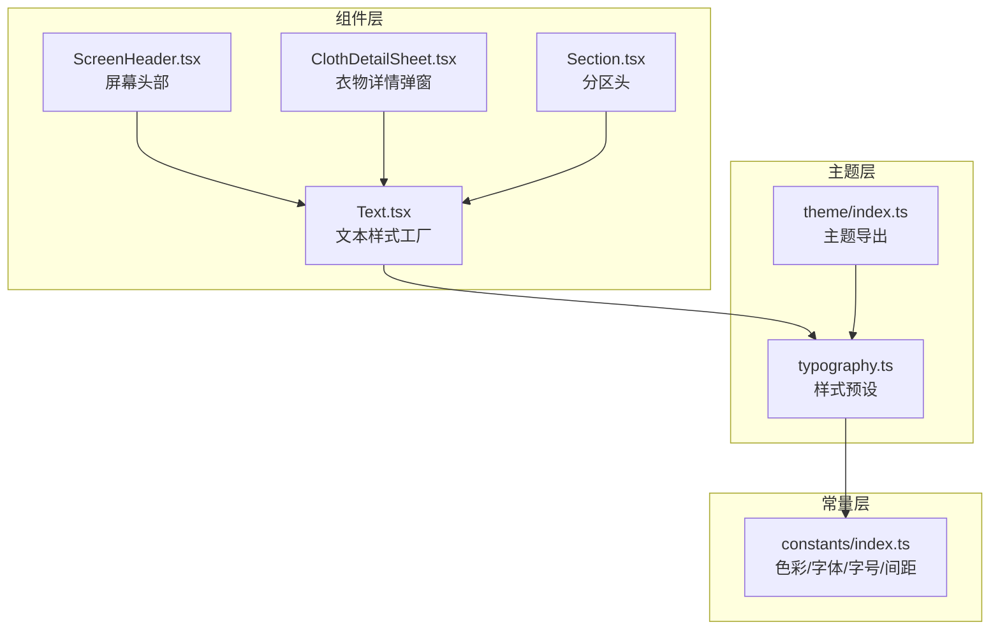
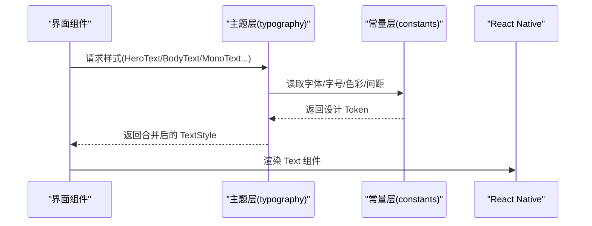
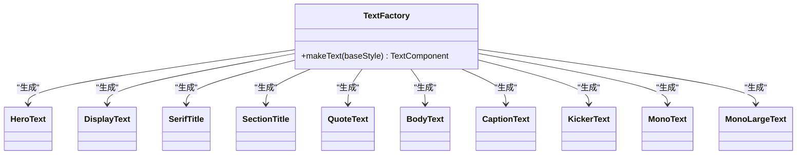
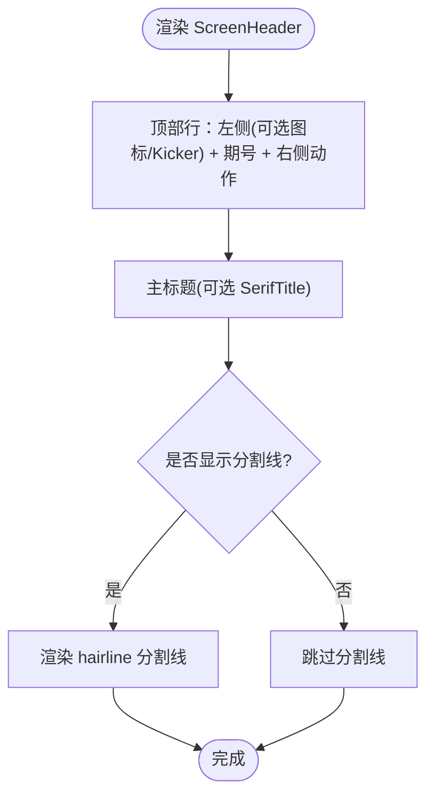
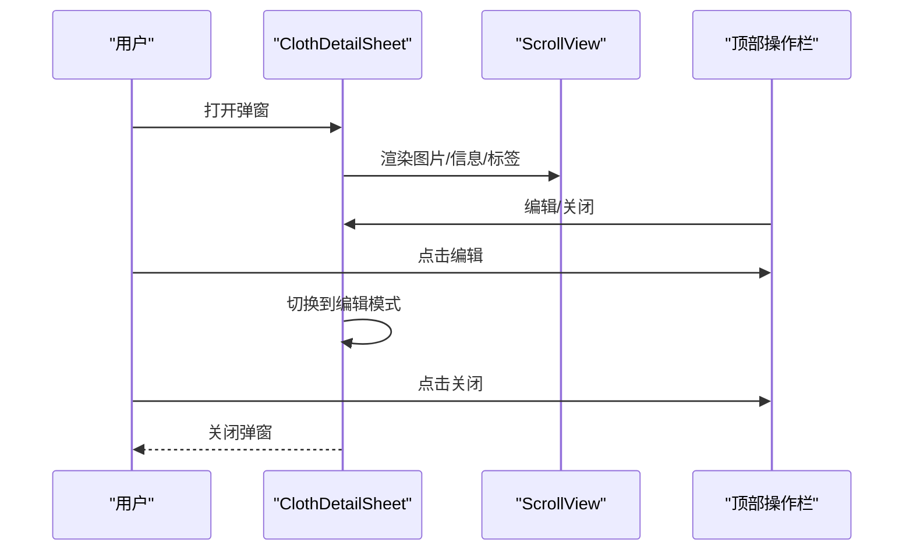
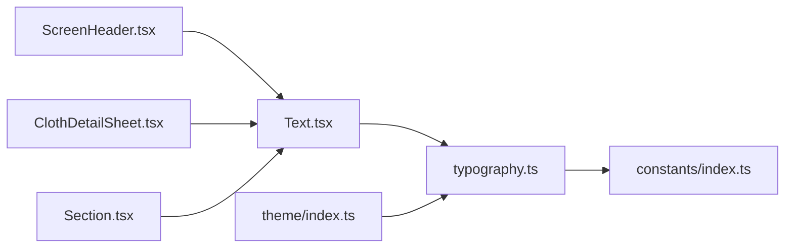

# 文本组件

<cite>
**本文档引用的文件**
- [FreeDressApp/src/components/Text.tsx](file://FreeDressApp/src/components/Text.tsx)
- [FreeDressApp/src/theme/typography.ts](file://FreeDressApp/src/theme/typography.ts)
- [FreeDressApp/src/theme/index.ts](file://FreeDressApp/src/theme/index.ts)
- [FreeDressApp/src/constants/index.ts](file://FreeDressApp/src/constants/index.ts)
- [FreeDressApp/src/components/ScreenHeader.tsx](file://FreeDressApp/src/components/ScreenHeader.tsx)
- [FreeDressApp/src/components/ClothDetailSheet.tsx](file://FreeDressApp/src/components/ClothDetailSheet.tsx)
- [FreeDressApp/src/components/Section.tsx](file://FreeDressApp/src/components/Section.tsx)
- [FreeDressApp/src/schemas/HomeScreen.tsx](file://FreeDressApp/src/schemas/HomeScreen.tsx)
- [FreeDressApp/src/schemas/WardrobeScreen.tsx](file://FreeDressApp/src/schemas/WardrobeScreen.tsx)
- [FreeDressApp/DESIGN.md](file://FreeDressApp/DESIGN.md)
</cite>

## 目录
1. [简介](#简介)
2. [项目结构](#项目结构)
3. [核心组件](#核心组件)
4. [架构总览](#架构总览)
5. [详细组件分析](#详细组件分析)
6. [依赖关系分析](#依赖关系分析)
7. [性能考量](#性能考量)
8. [故障排查指南](#故障排查指南)
9. [结论](#结论)
10. [附录](#附录)

## 简介
本文件为畅搭(FreeDress)文本组件的完整技术文档，覆盖 Text 组件系列的多种文本样式（HeroText、DisplayText、SerifTitle、SectionTitle、QuoteText、BodyText、CaptionText、KickerText、MonoText、MonoLargeText），以及 ScreenHeader 屏幕头部组件、ClothDetailSheet 衣物详情弹窗组件的排版与交互要点。文档同时提供在不同设备与屏幕尺寸下的适配建议、主题定制方法与本地化支持策略，并为设计师与开发者提供可执行的排版指南与使用示例。

## 项目结构
文本组件位于前端应用的组件层与主题层，通过统一的字体与字号 Token 实现跨平台一致性；ScreenHeader 与 ClothDetailSheet 作为复合组件，将文本样式与布局、交互行为整合，形成可复用的页面区块。

图表来源
- [FreeDressApp/src/components/Text.tsx:1-68](file://FreeDressApp/src/components/Text.tsx#L1-L68)
- [FreeDressApp/src/theme/typography.ts:1-115](file://FreeDressApp/src/theme/typography.ts#L1-L115)
- [FreeDressApp/src/theme/index.ts:1-7](file://FreeDressApp/src/theme/index.ts#L1-L7)
- [FreeDressApp/src/constants/index.ts:1-212](file://FreeDressApp/src/constants/index.ts#L1-L212)
- [FreeDressApp/src/components/ScreenHeader.tsx:1-95](file://FreeDressApp/src/components/ScreenHeader.tsx#L1-L95)
- [FreeDressApp/src/components/ClothDetailSheet.tsx:1-353](file://FreeDressApp/src/components/ClothDetailSheet.tsx#L1-L353)
- [FreeDressApp/src/components/Section.tsx:1-68](file://FreeDressApp/src/components/Section.tsx#L1-L68)

章节来源
- [FreeDressApp/src/components/Text.tsx:1-68](file://FreeDressApp/src/components/Text.tsx#L1-L68)
- [FreeDressApp/src/theme/typography.ts:1-115](file://FreeDressApp/src/theme/typography.ts#L1-L115)
- [FreeDressApp/src/theme/index.ts:1-7](file://FreeDressApp/src/theme/index.ts#L1-L7)
- [FreeDressApp/src/constants/index.ts:1-212](file://FreeDressApp/src/constants/index.ts#L1-L212)

## 核心组件
本节系统梳理 Text 组件系列的样式定义、适用场景与视觉层级，并给出在 ScreenHeader 与 ClothDetailSheet 中的实际应用示例。

- HeroText（80px 巨型衬线）
  - 适用场景：启动页、登录页、封面主标题
  - 视觉特征：超大字号、紧凑字距、正文字重
  - 使用示例：首页封面“今日穿什么”主标题
  - 章节来源
    - [FreeDressApp/src/theme/typography.ts:8-16](file://FreeDressApp/src/theme/typography.ts#L8-L16)
    - [FreeDressApp/src/schemas/HomeScreen.tsx:189](file://FreeDressApp/src/schemas/HomeScreen.tsx#L189)

- DisplayText（56px 衬线）
  - 适用场景：封面大标题、章节入口标题
  - 视觉特征：大字号、略宽松行高、轻微字距调整
  - 使用示例：首页封面“Today”副标题
  - 章节来源
    - [FreeDressApp/src/theme/typography.ts:18-26](file://FreeDressApp/src/theme/typography.ts#L18-L26)
    - [FreeDressApp/src/schemas/HomeScreen.tsx:191](file://FreeDressApp/src/schemas/HomeScreen.tsx#L191)

- SerifTitle（40px 衬线主标题）
  - 适用场景：卡片标题、分区标题
  - 视觉特征：主标题体量、适中字距
  - 使用示例：衣物卡片标题、风格电台卡片标题
  - 章节来源
    - [FreeDressApp/src/theme/typography.ts:28-36](file://FreeDressApp/src/theme/typography.ts#L28-L36)
    - [FreeDressApp/src/schemas/WardrobeScreen.tsx:292](file://FreeDressApp/src/schemas/WardrobeScreen.tsx#L292)

- SectionTitle（22px 衬线章节标题）
  - 适用场景：分区标题、功能模块标题
  - 视觉特征：清晰的章节层级
  - 使用示例：Section 组件中的标题
  - 章节来源
    - [FreeDressApp/src/theme/typography.ts:38-46](file://FreeDressApp/src/theme/typography.ts#L38-L46)
    - [FreeDressApp/src/components/Section.tsx:35](file://FreeDressApp/src/components/Section.tsx#L35)

- QuoteText（17px 斜体引文）
  - 适用场景：引用、说明性文案
  - 视觉特征：斜体、弱化颜色、较大行高
  - 使用示例：首页推荐卡片的引文描述
  - 章节来源
    - [FreeDressApp/src/theme/typography.ts:48-56](file://FreeDressApp/src/theme/typography.ts#L48-L56)
    - [FreeDressApp/src/schemas/HomeScreen.tsx:328](file://FreeDressApp/src/schemas/HomeScreen.tsx#L328)

- BodyText（15px 正文）
  - 适用场景：页面主体内容
  - 视觉特征：标准正文行高与颜色
  - 使用示例：首页封面标语
  - 章节来源
    - [FreeDressApp/src/theme/typography.ts:58-65](file://FreeDressApp/src/theme/typography.ts#L58-L65)
    - [FreeDressApp/src/schemas/HomeScreen.tsx:201](file://FreeDressApp/src/schemas/HomeScreen.tsx#L201)

- CaptionText（13px 说明文字）
  - 适用场景：弱化信息、标签说明
  - 视觉特征：较小字号、弱化颜色
  - 使用示例：衣物卡片副标题、季节标签
  - 章节来源
    - [FreeDressApp/src/theme/typography.ts:67-74](file://FreeDressApp/src/theme/typography.ts#L67-L74)
    - [FreeDressApp/src/schemas/WardrobeScreen.tsx:295](file://FreeDressApp/src/schemas/WardrobeScreen.tsx#L295)

- KickerText（11px 强调标签）
  - 适用场景：极小英文标签、分类标记
  - 视觉特征：大字距、全大写、中等字重
  - 使用示例：首页快捷入口 Kicker、分类标签
  - 章节来源
    - [FreeDressApp/src/theme/typography.ts:76-85](file://FreeDressApp/src/theme/typography.ts#L76-L85)
    - [FreeDressApp/src/schemas/HomeScreen.tsx:294](file://FreeDressApp/src/schemas/HomeScreen.tsx#L294)

- MonoText（11px 等宽）
  - 适用场景：期号、编号、价格、技术信息
  - 视觉特征：等宽字体、紧凑字距
  - 使用示例：首页封面期号、卡片编号、FAB 提示
  - 章节来源
    - [FreeDressApp/src/theme/typography.ts:87-95](file://FreeDressApp/src/theme/typography.ts#L87-L95)
    - [FreeDressApp/src/schemas/HomeScreen.tsx:194](file://FreeDressApp/src/schemas/HomeScreen.tsx#L194)

- MonoLargeText（13px 大号等宽）
  - 适用场景：更大字号的等宽信息
  - 视觉特征：等宽、略大字号
  - 使用示例：衣物详情页类别标识
  - 章节来源
    - [FreeDressApp/src/theme/typography.ts:97-105](file://FreeDressApp/src/theme/typography.ts#L97-L105)
    - [FreeDressApp/src/components/ClothDetailSheet.tsx:106](file://FreeDressApp/src/components/ClothDetailSheet.tsx#L106)

## 架构总览
文本组件通过“样式工厂 + 主题 Token”的方式实现跨平台一致的排版体验。样式工厂将基础 TextStyle 与颜色、行高等参数组合，形成可直接使用的语义化组件；ScreenHeader 与 ClothDetailSheet 将文本样式与布局、交互结合，构成页面区块。

图表来源
- [FreeDressApp/src/components/Text.tsx:28-37](file://FreeDressApp/src/components/Text.tsx#L28-L37)
- [FreeDressApp/src/theme/typography.ts:8-115](file://FreeDressApp/src/theme/typography.ts#L8-L115)
- [FreeDressApp/src/constants/index.ts:58-97](file://FreeDressApp/src/constants/index.ts#L58-L97)

章节来源
- [FreeDressApp/src/components/Text.tsx:28-37](file://FreeDressApp/src/components/Text.tsx#L28-L37)
- [FreeDressApp/src/theme/typography.ts:8-115](file://FreeDressApp/src/theme/typography.ts#L8-L115)
- [FreeDressApp/src/constants/index.ts:58-97](file://FreeDressApp/src/constants/index.ts#L58-L97)

## 详细组件分析

### Text 组件系列类图
Text 组件通过一个工厂函数生成多个语义化组件，每个组件对应一个预设的 TextStyle，确保全局排版一致性。

图表来源
- [FreeDressApp/src/components/Text.tsx:28-67](file://FreeDressApp/src/components/Text.tsx#L28-L67)

章节来源
- [FreeDressApp/src/components/Text.tsx:28-67](file://FreeDressApp/src/components/Text.tsx#L28-L67)

### ScreenHeader 屏幕头部组件
ScreenHeader 将“期号(MonoText)”、“主标题(SerifTitle)”、“右侧动作”与“底部分割线”组合，形成统一的页面头部布局。支持紧凑模式与安全区适配。

图表来源
- [FreeDressApp/src/components/ScreenHeader.tsx:29-64](file://FreeDressApp/src/components/ScreenHeader.tsx#L29-L64)

章节来源
- [FreeDressApp/src/components/ScreenHeader.tsx:29-64](file://FreeDressApp/src/components/ScreenHeader.tsx#L29-L64)

### ClothDetailSheet 衣物详情弹窗
ClothDetailSheet 采用“模态 + 滚动 + 顶部操作栏”的结构，将文本样式用于标题、标签、说明与操作提示，配合等宽字体展示编号与类别。

图表来源
- [FreeDressApp/src/components/ClothDetailSheet.tsx:29-244](file://FreeDressApp/src/components/ClothDetailSheet.tsx#L29-L244)

章节来源
- [FreeDressApp/src/components/ClothDetailSheet.tsx:29-244](file://FreeDressApp/src/components/ClothDetailSheet.tsx#L29-L244)

## 依赖关系分析
- Text 组件依赖主题层的样式预设与常量层的字体、字号、色彩 Token。
- ScreenHeader 与 ClothDetailSheet 依赖 Text 组件以保证排版一致性。
- 主题层通过统一导出接口，便于按需引入与扩展。

图表来源
- [FreeDressApp/src/components/Text.tsx:1-68](file://FreeDressApp/src/components/Text.tsx#L1-L68)
- [FreeDressApp/src/theme/typography.ts:1-115](file://FreeDressApp/src/theme/typography.ts#L1-L115)
- [FreeDressApp/src/theme/index.ts:1-7](file://FreeDressApp/src/theme/index.ts#L1-L7)
- [FreeDressApp/src/constants/index.ts:1-212](file://FreeDressApp/src/constants/index.ts#L1-L212)
- [FreeDressApp/src/components/ScreenHeader.tsx:1-95](file://FreeDressApp/src/components/ScreenHeader.tsx#L1-L95)
- [FreeDressApp/src/components/ClothDetailSheet.tsx:1-353](file://FreeDressApp/src/components/ClothDetailSheet.tsx#L1-L353)
- [FreeDressApp/src/components/Section.tsx:1-68](file://FreeDressApp/src/components/Section.tsx#L1-L68)

章节来源
- [FreeDressApp/src/theme/index.ts:1-7](file://FreeDressApp/src/theme/index.ts#L1-L7)

## 性能考量
- 样式合并：Text 工厂通过样式扁平化合并，减少不必要的对象创建与比较。
- 字体加载：使用平台原生字体族，避免额外字体资源带来的首屏压力。
- 滚动性能：ClothDetailSheet 使用 ScrollView 与键盘适配，注意在长列表场景下控制渲染数量与层级。
- 主题切换：通过 Token 切换颜色与字号，避免频繁重绘。

## 故障排查指南
- 字体显示异常
  - 检查平台字体映射是否正确（iOS/Android 不同字体族）。
  - 章节来源
    - [FreeDressApp/src/constants/index.ts:58-84](file://FreeDressApp/src/constants/index.ts#L58-L84)

- 行高或字距不一致
  - 确认使用了正确的语义化组件（如 SerifTitle 与 SectionTitle）。
  - 章节来源
    - [FreeDressApp/src/theme/typography.ts:28-46](file://FreeDressApp/src/theme/typography.ts#L28-L46)

- 期号或编号显示错位
  - 确保使用 MonoText 或 MonoLargeText，并检查容器的对齐与内边距。
  - 章节来源
    - [FreeDressApp/src/theme/typography.ts:87-105](file://FreeDressApp/src/theme/typography.ts#L87-L105)

- 屏幕头部遮挡内容
  - 检查安全区与紧凑模式参数，确保 paddingTop/paddingBottom 合理。
  - 章节来源
    - [FreeDressApp/src/components/ScreenHeader.tsx:39-50](file://FreeDressApp/src/components/ScreenHeader.tsx#L39-L50)

## 结论
Text 组件系列通过“样式工厂 + 主题 Token”的架构，实现了跨平台一致的排版体验；ScreenHeader 与 ClothDetailSheet 将文本样式与布局、交互有机结合，形成可复用的页面区块。遵循本文档的排版规范与适配建议，可在不同设备与屏幕尺寸下保持良好的可读性与视觉层级。

## 附录

### 文本样式与适用场景速查
- HeroText：封面主标题、登录页
- DisplayText：封面大标题、章节入口
- SerifTitle：卡片标题、分区标题
- SectionTitle：分区标题、功能模块标题
- QuoteText：引文、说明性文案
- BodyText：页面主体内容
- CaptionText：弱化信息、标签说明
- KickerText：极小英文标签、分类标记
- MonoText：期号、编号、技术信息
- MonoLargeText：更大字号的等宽信息

章节来源
- [FreeDressApp/DESIGN.md:84-94](file://FreeDressApp/DESIGN.md#L84-L94)

### 设备与屏幕适配建议
- 字号缩放：在 iOS 上可通过系统字体缩放影响文本渲染，建议优先使用相对单位与行高比例。
- 安全区：ScreenHeader 已内置安全区适配，其他页面可参考使用。
- 等宽字体：在 Android 上等宽字符可能受系统字体影响，建议在关键编号场景进行视觉校验。
- 章节来源
  - [FreeDressApp/src/components/ScreenHeader.tsx:39-50](file://FreeDressApp/src/components/ScreenHeader.tsx#L39-L50)
  - [FreeDressApp/src/constants/index.ts:58-84](file://FreeDressApp/src/constants/index.ts#L58-L84)

### 主题定制与本地化支持
- 主题定制
  - 修改常量层的 COLORS/FONTS/FONT_SIZES/SPACING，即可全局生效。
  - 章节来源
    - [FreeDressApp/src/constants/index.ts:15-115](file://FreeDressApp/src/constants/index.ts#L15-L115)

- 本地化支持
  - 文本内容来自 props 或状态，建议通过 i18n 层注入，避免硬编码。
  - 章节来源
    - [FreeDressApp/src/components/ScreenHeader.tsx:30-38](file://FreeDressApp/src/components/ScreenHeader.tsx#L30-L38)
    - [FreeDressApp/src/components/ClothDetailSheet.tsx:29-46](file://FreeDressApp/src/components/ClothDetailSheet.tsx#L29-L46)