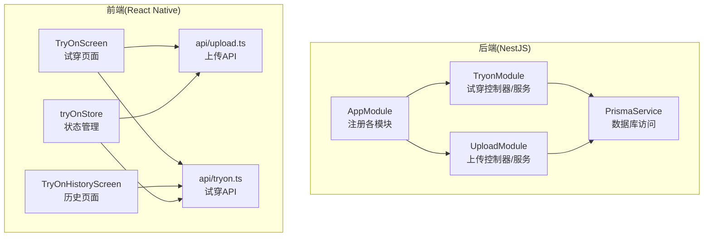
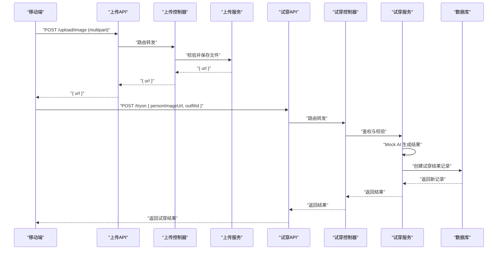
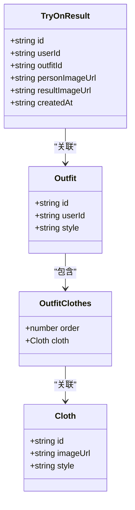
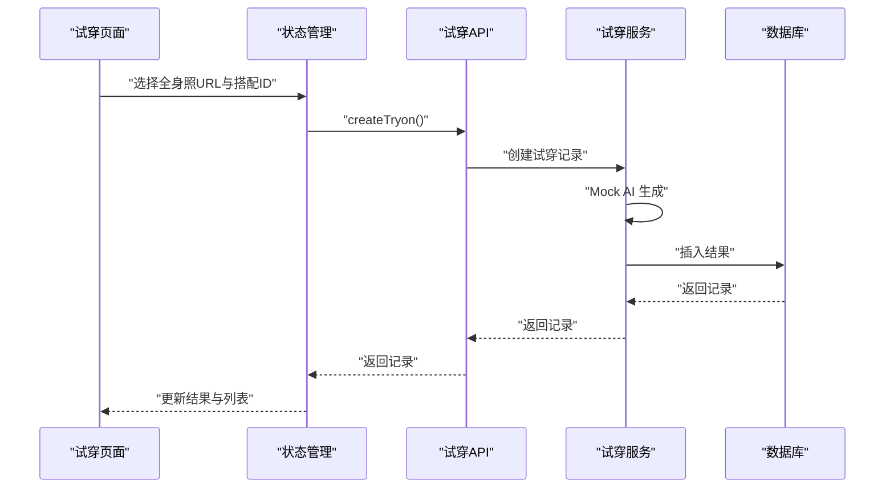
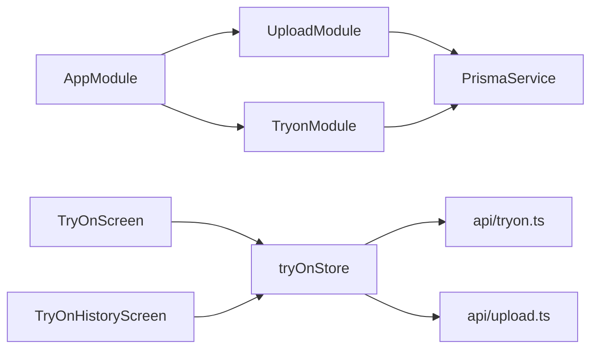

# AI试穿API

<cite>
**本文引用的文件**
- [backend/src/modules/tryon/tryon.controller.ts](file://backend/src/modules/tryon/tryon.controller.ts)
- [backend/src/modules/tryon/tryon.service.ts](file://backend/src/modules/tryon/tryon.service.ts)
- [backend/src/modules/tryon/tryon.module.ts](file://backend/src/modules/tryon/tryon.module.ts)
- [backend/src/modules/tryon/dto/create-tryon.dto.ts](file://backend/src/modules/tryon/dto/create-tryon.dto.ts)
- [backend/src/modules/upload/upload.controller.ts](file://backend/src/modules/upload/upload.controller.ts)
- [backend/src/modules/upload/upload.service.ts](file://backend/src/modules/upload/upload.service.ts)
- [backend/src/app.module.ts](file://backend/src/app.module.ts)
- [FreeDressApp/src/api/tryon.ts](file://FreeDressApp/src/api/tryon.ts)
- [FreeDressApp/src/store/tryOnStore.ts](file://FreeDressApp/src/store/tryOnStore.ts)
- [FreeDressApp/src/api/upload.ts](file://FreeDressApp/src/api/upload.ts)
- [FreeDressApp/src/screents/TryOnScreen.tsx](file://FreeDressApp/src/screens/TryOnScreen.tsx)
- [FreeDressApp/src/screens/TryOnHistoryScreen.tsx](file://FreeDressApp/src/screens/TryOnHistoryScreen.tsx)
- [FreeDressApp/src/types/index.ts](file://FreeDressApp/src/types/index.ts)
</cite>

## 目录
1. [简介](#简介)
2. [项目结构](#项目结构)
3. [核心组件](#核心组件)
4. [架构总览](#架构总览)
5. [详细组件分析](#详细组件分析)
6. [依赖关系分析](#依赖关系分析)
7. [性能考虑](#性能考虑)
8. [故障排查指南](#故障排查指南)
9. [结论](#结论)
10. [附录](#附录)

## 简介
本文件为畅搭(FreeDress)应用的AI试穿API技术文档，覆盖以下能力与流程：
- 全身照上传：移动端通过multipart表单上传图片，后端校验格式与大小并返回可访问URL
- 试穿请求提交：用户选择搭配后提交试穿请求，后端进行权限校验与Mock AI生成，保存结果并返回
- 试穿结果查询：支持分页查询全部试穿记录，并可按ID查询单条记录
- 历史记录管理：前端提供试穿历史列表页，展示试穿结果缩略图、搭配信息与时间

文档同时解释图像上传处理流程、AI算法集成点位、试穿结果数据结构与展示逻辑、历史记录管理与查询机制，并提供使用示例与调试方法。

## 项目结构
后端采用NestJS模块化架构，AI试穿相关模块位于backend/src/modules/tryon，上传模块位于backend/src/modules/upload；前端位于FreeDressApp，包含API封装、状态管理与页面组件。

图表来源
- [backend/src/app.module.ts:13-31](file://backend/src/app.module.ts#L13-L31)
- [backend/src/modules/tryon/tryon.module.ts:5-10](file://backend/src/modules/tryon/tryon.module.ts#L5-L10)
- [backend/src/modules/upload/upload.controller.ts:28-50](file://backend/src/modules/upload/upload.controller.ts#L28-L50)

章节来源
- [backend/src/app.module.ts:13-31](file://backend/src/app.module.ts#L13-L31)
- [backend/src/modules/tryon/tryon.module.ts:5-10](file://backend/src/modules/tryon/tryon.module.ts#L5-L10)
- [backend/src/modules/upload/upload.controller.ts:28-50](file://backend/src/modules/upload/upload.controller.ts#L28-L50)

## 核心组件
- 上传模块
  - 控制器：接收multipart/form-data，调用上传服务
  - 服务：校验MIME与大小，写入本地uploads目录，返回URL
- 试穿模块
  - 控制器：JWT鉴权，提供提交试穿、查询列表、查询单条接口
  - 服务：校验搭配归属，Mock AI生成结果，持久化试穿结果
- 前端API与状态
  - 上传API：构造FormData并POST到后端
  - 试穿API：提交试穿请求、获取历史列表、按ID获取详情
  - 状态管理：维护试穿结果列表、当前结果、加载状态

章节来源
- [backend/src/modules/upload/upload.controller.ts:33-49](file://backend/src/modules/upload/upload.controller.ts#L33-L49)
- [backend/src/modules/upload/upload.service.ts:25-47](file://backend/src/modules/upload/upload.service.ts#L25-L47)
- [backend/src/modules/tryon/tryon.controller.ts:17-39](file://backend/src/modules/tryon/tryon.controller.ts#L17-L39)
- [backend/src/modules/tryon/tryon.service.ts:9-33](file://backend/src/modules/tryon/tryon.service.ts#L9-L33)
- [FreeDressApp/src/api/upload.ts:4-20](file://FreeDressApp/src/api/upload.ts#L4-L20)
- [FreeDressApp/src/api/tryon.ts:17-27](file://FreeDressApp/src/api/tryon.ts#L17-L27)
- [FreeDressApp/src/store/tryOnStore.ts:24-58](file://FreeDressApp/src/store/tryOnStore.ts#L24-L58)

## 架构总览
下图展示从移动端发起试穿到后端处理与存储的关键交互：

图表来源
- [backend/src/modules/upload/upload.controller.ts:33-49](file://backend/src/modules/upload/upload.controller.ts#L33-L49)
- [backend/src/modules/upload/upload.service.ts:25-47](file://backend/src/modules/upload/upload.service.ts#L25-L47)
- [backend/src/modules/tryon/tryon.controller.ts:17-24](file://backend/src/modules/tryon/tryon.controller.ts#L17-L24)
- [backend/src/modules/tryon/tryon.service.ts:9-33](file://backend/src/modules/tryon/tryon.service.ts#L9-L33)

## 详细组件分析

### 上传模块
- 接口规范
  - 方法：POST
  - 路径：/upload/image
  - 认证：JWT
  - 内容类型：multipart/form-data
  - 参数：file（二进制）
- 业务逻辑
  - 校验文件是否存在
  - 校验MIME类型（JPG/PNG/WebP/GIF）
  - 校验文件大小（≤10MB）
  - 生成UUID文件名并写入uploads目录
  - 返回相对路径URL供前端访问
- 错误处理
  - 缺少文件：抛出400
  - 类型不支持：抛出400
  - 超过大小限制：抛出400
- 性能与安全
  - 本地磁盘存储，建议在生产环境替换为对象存储（如OSS/COS/MinIO）
  - 可增加压缩、水印等处理

章节来源
- [backend/src/modules/upload/upload.controller.ts:33-49](file://backend/src/modules/upload/upload.controller.ts#L33-L49)
- [backend/src/modules/upload/upload.service.ts:25-47](file://backend/src/modules/upload/upload.service.ts#L25-L47)
- [backend/src/app.module.ts:19-22](file://backend/src/app.module.ts#L19-L22)

### 试穿模块
- 接口规范
  - 提交试穿：POST /tryon
  - 查询列表：GET /tryon
  - 查询单条：GET /tryon/:id
  - 认证：JWT
- 请求体
  - personImageUrl: 人物全身照URL（来自上传接口返回）
  - outfitId: 搭配ID（需属于当前用户）
- 业务逻辑
  - 校验搭配是否存在且归属当前用户
  - Mock AI生成：模拟耗时后返回人物原图作为占位
  - 创建试穿结果记录，包含用户ID、搭配ID、人物图、结果图URL
  - 列表查询：按用户过滤并包含搭配详情（含衣物顺序）
  - 单条查询：校验归属并返回包含搭配详情的结果
- 数据模型
  - 试穿结果字段：id、userId、outfitId、personImageUrl、resultImageUrl、createdAt
  - 搭配详情：style、outfitClothes（含cloth与order）

图表来源
- [FreeDressApp/src/types/index.ts:48-56](file://FreeDressApp/src/types/index.ts#L48-L56)
- [backend/src/modules/tryon/tryon.service.ts:35-75](file://backend/src/modules/tryon/tryon.service.ts#L35-L75)

章节来源
- [backend/src/modules/tryon/tryon.controller.ts:17-39](file://backend/src/modules/tryon/tryon.controller.ts#L17-L39)
- [backend/src/modules/tryon/tryon.service.ts:9-33](file://backend/src/modules/tryon/tryon.service.ts#L9-L33)
- [backend/src/modules/tryon/tryon.service.ts:35-75](file://backend/src/modules/tryon/tryon.service.ts#L35-L75)
- [backend/src/modules/tryon/dto/create-tryon.dto.ts:4-14](file://backend/src/modules/tryon/dto/create-tryon.dto.ts#L4-L14)
- [FreeDressApp/src/types/index.ts:48-56](file://FreeDressApp/src/types/index.ts#L48-L56)

### 前端集成与展示
- 上传流程
  - 移动端选择或拍摄全身照
  - 构造FormData并调用上传API
  - 成功后获得可访问URL
- 试穿流程
  - 选择搭配（outfitId）
  - 调用试穿API提交请求
  - Mock生成完成后更新状态与UI
- 历史记录
  - 获取试穿列表，渲染缩略图与搭配信息
  - 支持下拉刷新

图表来源
- [FreeDressApp/src/screens/TryOnScreen.tsx:60-97](file://FreeDressApp/src/screens/TryOnScreen.tsx#L60-L97)
- [FreeDressApp/src/store/tryOnStore.ts:42-54](file://FreeDressApp/src/store/tryOnStore.ts#L42-L54)
- [FreeDressApp/src/api/tryon.ts:17-19](file://FreeDressApp/src/api/tryon.ts#L17-L19)
- [backend/src/modules/tryon/tryon.service.ts:9-33](file://backend/src/modules/tryon/tryon.service.ts#L9-L33)

章节来源
- [FreeDressApp/src/api/upload.ts:4-20](file://FreeDressApp/src/api/upload.ts#L4-L20)
- [FreeDressApp/src/screens/TryOnScreen.tsx:60-97](file://FreeDressApp/src/screens/TryOnScreen.tsx#L60-L97)
- [FreeDressApp/src/store/tryOnStore.ts:30-54](file://FreeDressApp/src/store/tryOnStore.ts#L30-L54)
- [FreeDressApp/src/api/tryon.ts:17-27](file://FreeDressApp/src/api/tryon.ts#L17-L27)
- [FreeDressApp/src/screens/TryOnHistoryScreen.tsx:41-60](file://FreeDressApp/src/screens/TryOnHistoryScreen.tsx#L41-L60)

## 依赖关系分析
- 后端模块耦合
  - AppModule统一注册UploadModule与TryonModule
  - 两者均依赖PrismaService进行数据库操作
  - UploadController与UploadService解耦，职责清晰
  - TryonController与TryonService解耦，鉴权由JwtAuthGuard统一处理
- 前端依赖
  - TryOnScreen依赖OutfitStore与TryOnStore
  - TryOnStore依赖api/tryon与api/upload
  - 类型定义集中在types/index.ts，避免重复

图表来源
- [backend/src/app.module.ts:13-31](file://backend/src/app.module.ts#L13-L31)
- [backend/src/modules/tryon/tryon.module.ts:5-10](file://backend/src/modules/tryon/tryon.module.ts#L5-L10)
- [backend/src/modules/upload/upload.module.ts:1-11](file://backend/src/modules/upload/upload.module.ts#L1-L11)

章节来源
- [backend/src/app.module.ts:13-31](file://backend/src/app.module.ts#L13-L31)
- [FreeDressApp/src/store/tryOnStore.ts:1-59](file://FreeDressApp/src/store/tryOnStore.ts#L1-L59)

## 性能考虑
- 图像上传
  - 建议在前端对图片进行压缩与裁剪，降低带宽与存储成本
  - 后端可引入限速与并发控制，防止资源滥用
- AI生成
  - 当前为Mock实现，建议替换为异步任务队列（如Celery/Redis Queue）与长轮询/WebSocket通知
  - 对于高并发场景，建议引入CDN缓存与多实例扩展
- 数据库
  - 试穿结果与搭配详情查询已包含include与排序，建议在outfitId与userId上建立索引
- 前端
  - 使用FlatList/虚拟列表渲染历史列表，减少重绘
  - 对图片使用懒加载与尺寸适配

## 故障排查指南
- 上传失败
  - 确认文件类型是否为JPG/PNG/WebP/GIF
  - 确认文件大小未超过10MB
  - 检查uploads目录权限与磁盘空间
- 试穿请求报错
  - 确认outfitId存在且归属当前用户
  - 检查JWT是否有效
- 结果为空
  - 确认已成功上传全身照并获得URL
  - 检查网络与后端日志
- 前端异常
  - 查看控制台错误与Alert提示
  - 确认状态管理store初始化与API调用链路

章节来源
- [backend/src/modules/upload/upload.service.ts:30-38](file://backend/src/modules/upload/upload.service.ts#L30-L38)
- [backend/src/modules/tryon/tryon.service.ts:13-18](file://backend/src/modules/tryon/tryon.service.ts#L13-L18)
- [FreeDressApp/src/screens/TryOnScreen.tsx:76-82](file://FreeDressApp/src/screens/TryOnScreen.tsx#L76-L82)

## 结论
本方案以模块化方式实现了AI试穿的端到端流程：移动端上传全身照、后端鉴权与Mock AI生成、结果持久化与历史查询。当前AI生成为占位实现，后续可无缝替换为真实AI服务（如Kolors、IDM-VTON等）。建议在生产环境中完善对象存储、异步任务与CDN缓存，以提升性能与稳定性。

## 附录

### API参考

- 上传图片
  - 方法：POST
  - 路径：/upload/image
  - 认证：Bearer JWT
  - 请求头：Content-Type: multipart/form-data
  - 请求体：
    - file: 二进制文件（JPG/PNG/WebP/GIF，≤10MB）
  - 响应：
    - { url: "/uploads/{uuid}.{ext}" }

- 提交试穿
  - 方法：POST
  - 路径：/tryon
  - 认证：Bearer JWT
  - 请求体：
    - personImageUrl: string（全身照URL）
    - outfitId: string（搭配ID）
  - 响应：
    - 包含试穿结果与搭配详情的对象

- 查询试穿列表
  - 方法：GET
  - 路径：/tryon
  - 认证：Bearer JWT
  - 响应：
    - 试穿结果数组，每项包含搭配详情

- 查询单条试穿记录
  - 方法：GET
  - 路径：/tryon/:id
  - 认证：Bearer JWT
  - 响应：
    - 试穿结果对象（含搭配详情）

章节来源
- [backend/src/modules/upload/upload.controller.ts:33-49](file://backend/src/modules/upload/upload.controller.ts#L33-L49)
- [backend/src/modules/tryon/tryon.controller.ts:17-39](file://backend/src/modules/tryon/tryon.controller.ts#L17-L39)
- [backend/src/modules/tryon/dto/create-tryon.dto.ts:4-14](file://backend/src/modules/tryon/dto/create-tryon.dto.ts#L4-L14)

### 使用示例与调试步骤
- 上传全身照
  - 在移动端选择照片，调用上传API，得到url
- 提交试穿
  - 选择搭配，调用试穿API提交请求，观察UI反馈
- 查看历史
  - 打开历史页面，下拉刷新查看结果
- 调试要点
  - 检查JWT是否正确携带
  - 确认outfitId归属与存在性
  - 观察Mock生成耗时与UI状态变化

章节来源
- [FreeDressApp/src/screens/TryOnScreen.tsx:60-97](file://FreeDressApp/src/screens/TryOnScreen.tsx#L60-L97)
- [FreeDressApp/src/screens/TryOnHistoryScreen.tsx:41-60](file://FreeDressApp/src/screens/TryOnHistoryScreen.tsx#L41-L60)
- [FreeDressApp/src/store/tryOnStore.ts:30-54](file://FreeDressApp/src/store/tryOnStore.ts#L30-L54)