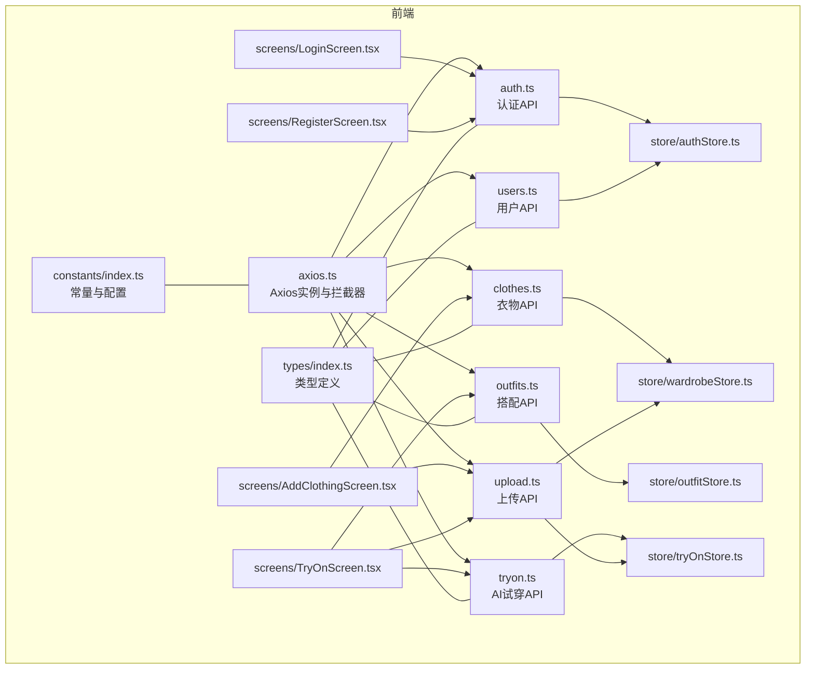
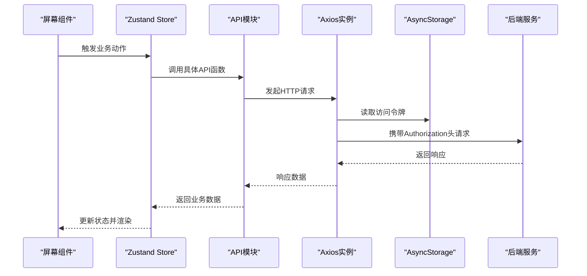
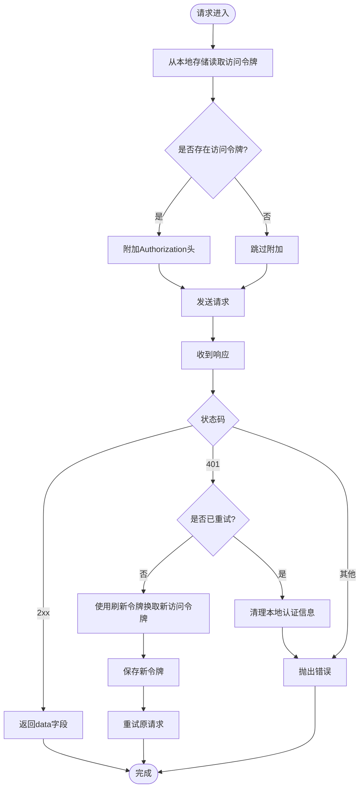
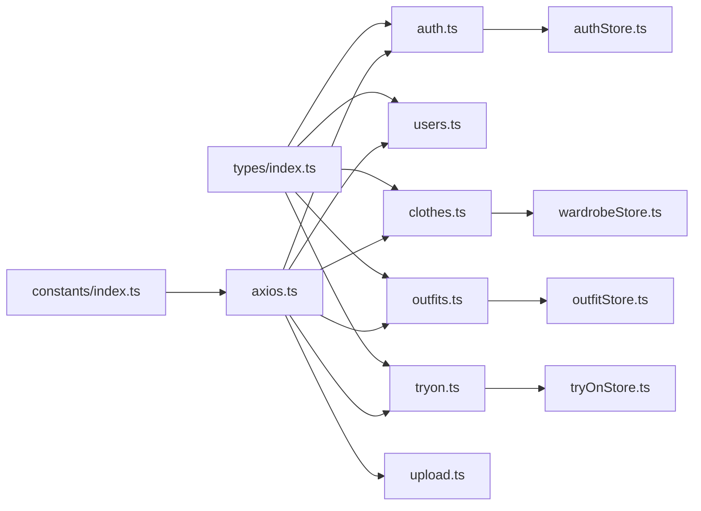
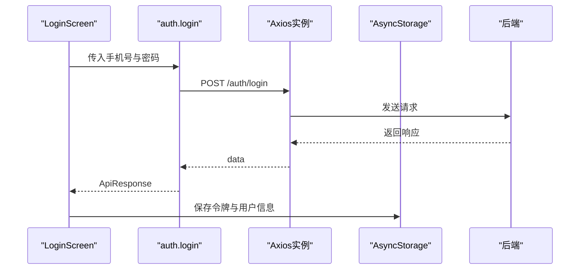
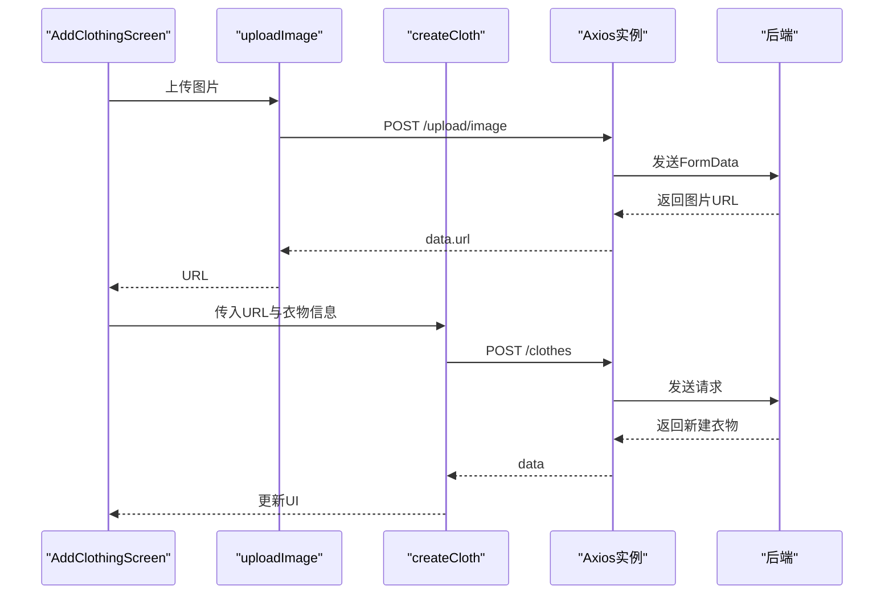

# API集成

<cite>
**本文档引用的文件**
- [FreeDressApp/src/api/axios.ts](file://FreeDressApp/src/api/axios.ts)
- [FreeDressApp/src/api/auth.ts](file://FreeDressApp/src/api/auth.ts)
- [FreeDressApp/src/api/users.ts](file://FreeDressApp/src/api/users.ts)
- [FreeDressApp/src/api/clothes.ts](file://FreeDressApp/src/api/clothes.ts)
- [FreeDressApp/src/api/outfits.ts](file://FreeDressApp/src/api/outfits.ts)
- [FreeDressApp/src/api/tryon.ts](file://FreeDressApp/src/api/tryon.ts)
- [FreeDressApp/src/api/upload.ts](file://FreeDressApp/src/api/upload.ts)
- [FreeDressApp/src/constants/index.ts](file://FreeDressApp/src/constants/index.ts)
- [FreeDressApp/src/types/index.ts](file://FreeDressApp/src/types/index.ts)
- [FreeDressApp/src/store/authStore.ts](file://FreeDressApp/src/store/authStore.ts)
- [FreeDressApp/src/store/wardrobeStore.ts](file://FreeDressApp/src/store/wardrobeStore.ts)
- [FreeDressApp/src/store/outfitStore.ts](file://FreeDressApp/src/store/outfitStore.ts)
- [FreeDressApp/src/store/tryOnStore.ts](file://FreeDressApp/src/store/tryOnStore.ts)
- [FreeDressApp/src/screens/LoginScreen.tsx](file://FreeDressApp/src/screens/LoginScreen.tsx)
- [FreeDressApp/src/screens/RegisterScreen.tsx](file://FreeDressApp/src/screens/RegisterScreen.tsx)
- [FreeDressApp/src/screens/AddClothingScreen.tsx](file://FreeDressApp/src/screens/AddClothingScreen.tsx)
- [FreeDressApp/src/screens/TryOnScreen.tsx](file://FreeDressApp/src/screens/TryOnScreen.tsx)
</cite>

## 目录
1. [简介](#简介)
2. [项目结构](#项目结构)
3. [核心组件](#核心组件)
4. [架构总览](#架构总览)
5. [详细组件分析](#详细组件分析)
6. [依赖关系分析](#依赖关系分析)
7. [性能考量](#性能考量)
8. [故障排查指南](#故障排查指南)
9. [结论](#结论)
10. [附录](#附录)

## 简介
本文件为畅搭(FreeDress)应用的API集成文档，聚焦于前端Axios客户端的配置与使用、各API模块的功能与实现、最佳实践（参数校验、响应处理、缓存策略）、错误处理与重试机制、安全与超时配置、并发请求管理，以及完整的使用示例与调试技巧。读者无需深入源码即可理解如何正确、安全地调用后端接口。

## 项目结构
- API层位于 FreeDressApp/src/api，统一通过 axios.ts 创建的实例进行HTTP请求，并集中处理认证令牌注入与响应拦截、自动刷新与错误处理。
- 类型系统与常量定义分别位于 FreeDressApp/src/types 与 FreeDressApp/src/constants，确保请求/响应结构与环境配置的一致性。
- 状态管理采用Zustand Store（authStore、wardrobeStore、outfitStore、tryOnStore），封装业务API调用并维护UI所需的状态。
- 屏幕组件（Screens）作为API调用的使用者，负责参数收集、调用API、展示结果与错误提示。

图表来源
- [FreeDressApp/src/api/axios.ts:1-108](file://FreeDressApp/src/api/axios.ts#L1-L108)
- [FreeDressApp/src/api/auth.ts:1-101](file://FreeDressApp/src/api/auth.ts#L1-L101)
- [FreeDressApp/src/api/users.ts:1-32](file://FreeDressApp/src/api/users.ts#L1-L32)
- [FreeDressApp/src/api/clothes.ts:1-54](file://FreeDressApp/src/api/clothes.ts#L1-L54)
- [FreeDressApp/src/api/outfits.ts:1-40](file://FreeDressApp/src/api/outfits.ts#L1-L40)
- [FreeDressApp/src/api/tryon.ts:1-28](file://FreeDressApp/src/api/tryon.ts#L1-L28)
- [FreeDressApp/src/api/upload.ts:1-21](file://FreeDressApp/src/api/upload.ts#L1-L21)
- [FreeDressApp/src/types/index.ts:1-98](file://FreeDressApp/src/types/index.ts#L1-L98)
- [FreeDressApp/src/constants/index.ts:1-212](file://FreeDressApp/src/constants/index.ts#L1-L212)
- [FreeDressApp/src/store/authStore.ts:1-123](file://FreeDressApp/src/store/authStore.ts#L1-L123)
- [FreeDressApp/src/store/wardrobeStore.ts:1-83](file://FreeDressApp/src/store/wardrobeStore.ts#L1-L83)
- [FreeDressApp/src/store/outfitStore.ts:1-90](file://FreeDressApp/src/store/outfitStore.ts#L1-L90)
- [FreeDressApp/src/store/tryOnStore.ts:1-59](file://FreeDressApp/src/store/tryOnStore.ts#L1-L59)
- [FreeDressApp/src/screens/LoginScreen.tsx:1-324](file://FreeDressApp/src/screens/LoginScreen.tsx#L1-L324)
- [FreeDressApp/src/screens/RegisterScreen.tsx:1-359](file://FreeDressApp/src/screens/RegisterScreen.tsx#L1-L359)
- [FreeDressApp/src/screens/AddClothingScreen.tsx:1-253](file://FreeDressApp/src/screens/AddClothingScreen.tsx#L1-L253)
- [FreeDressApp/src/screens/TryOnScreen.tsx:1-522](file://FreeDressApp/src/screens/TryOnScreen.tsx#L1-L522)

章节来源
- [FreeDressApp/src/api/axios.ts:1-108](file://FreeDressApp/src/api/axios.ts#L1-L108)
- [FreeDressApp/src/constants/index.ts:8-212](file://FreeDressApp/src/constants/index.ts#L8-L212)

## 核心组件
- Axios实例与拦截器
  - 基础URL、超时、默认Content-Type由常量统一配置。
  - 请求拦截器：从本地存储读取访问令牌并注入到Authorization头。
  - 响应拦截器：统一提取响应数据；对401未授权进行令牌刷新重试；其他错误统一包装为可读消息并抛出。
- API模块
  - 认证API：验证码、注册、登录、忘记/重置密码、刷新令牌、获取当前用户资料。
  - 用户API：获取用户资料、更新资料、获取用户统计。
  - 衣物API：创建、查询、详情、更新、删除、分类统计。
  - 搭配API：创建、查询、详情、删除、收藏切换、收藏列表。
  - AI试穿API：发起试穿、查询历史、详情。
  - 上传API：图片上传（multipart/form-data）。
- 类型与常量
  - ApiResponse统一响应结构；用户、衣物、搭配、试穿等实体类型。
  - API_BASE_URL、STORAGE_KEYS、分页配置等常量。
- 状态管理
  - authStore：登录态、令牌持久化、用户信息更新、从本地恢复。
  - wardrobeStore：衣物列表、分类统计、增删改查。
  - outfitStore：搭配列表、收藏、增删改查、当前搭配。
  - tryOnStore：试穿历史、生成、当前结果。

章节来源
- [FreeDressApp/src/api/axios.ts:12-108](file://FreeDressApp/src/api/axios.ts#L12-L108)
- [FreeDressApp/src/api/auth.ts:1-101](file://FreeDressApp/src/api/auth.ts#L1-L101)
- [FreeDressApp/src/api/users.ts:1-32](file://FreeDressApp/src/api/users.ts#L1-L32)
- [FreeDressApp/src/api/clothes.ts:1-54](file://FreeDressApp/src/api/clothes.ts#L1-L54)
- [FreeDressApp/src/api/outfits.ts:1-40](file://FreeDressApp/src/api/outfits.ts#L1-L40)
- [FreeDressApp/src/api/tryon.ts:1-28](file://FreeDressApp/src/api/tryon.ts#L1-L28)
- [FreeDressApp/src/api/upload.ts:1-21](file://FreeDressApp/src/api/upload.ts#L1-L21)
- [FreeDressApp/src/types/index.ts:58-71](file://FreeDressApp/src/types/index.ts#L58-L71)
- [FreeDressApp/src/store/authStore.ts:28-123](file://FreeDressApp/src/store/authStore.ts#L28-L123)
- [FreeDressApp/src/store/wardrobeStore.ts:35-83](file://FreeDressApp/src/store/wardrobeStore.ts#L35-L83)
- [FreeDressApp/src/store/outfitStore.ts:32-90](file://FreeDressApp/src/store/outfitStore.ts#L32-L90)
- [FreeDressApp/src/store/tryOnStore.ts:24-59](file://FreeDressApp/src/store/tryOnStore.ts#L24-L59)

## 架构总览
下图展示了从屏幕组件到API模块、再到Axios拦截器与后端的整体调用链路。

图表来源
- [FreeDressApp/src/screens/LoginScreen.tsx:74-92](file://FreeDressApp/src/screens/LoginScreen.tsx#L74-L92)
- [FreeDressApp/src/store/authStore.ts:39-57](file://FreeDressApp/src/store/authStore.ts#L39-L57)
- [FreeDressApp/src/api/auth.ts:45-53](file://FreeDressApp/src/api/auth.ts#L45-L53)
- [FreeDressApp/src/api/axios.ts:24-38](file://FreeDressApp/src/api/axios.ts#L24-L38)
- [FreeDressApp/src/constants/index.ts:201-205](file://FreeDressApp/src/constants/index.ts#L201-L205)

## 详细组件分析

### Axios客户端与拦截器
- 配置要点
  - 基础URL来自常量，便于开发与生产切换。
  - 默认Content-Type为application/json，上传场景需手动设置multipart/form-data。
  - 超时时间10秒，避免长时间阻塞UI。
- 请求拦截器
  - 自动从本地存储读取访问令牌并附加到Authorization头。
- 响应拦截器
  - 成功：直接返回data字段，简化调用侧处理。
  - 401未授权：尝试使用刷新令牌换取新访问令牌，重试原请求；刷新失败则清理本地认证信息并输出错误日志。
  - 其他错误：从响应体提取message或兜底为“网络请求失败”，统一抛出Error供调用方捕获。

图表来源
- [FreeDressApp/src/api/axios.ts:24-105](file://FreeDressApp/src/api/axios.ts#L24-L105)
- [FreeDressApp/src/constants/index.ts:201-205](file://FreeDressApp/src/constants/index.ts#L201-L205)

章节来源
- [FreeDressApp/src/api/axios.ts:12-108](file://FreeDressApp/src/api/axios.ts#L12-L108)
- [FreeDressApp/src/constants/index.ts:8-18](file://FreeDressApp/src/constants/index.ts#L8-L18)

### 认证API（auth）
- 功能清单
  - 获取图片验证码：返回captchaId与SVG图片数据。
  - 用户注册：手机号、密码、验证码ID与答案、可选昵称。
  - 用户登录：手机号与密码。
  - 忘记密码：验证手机号并返回重置令牌。
  - 重置密码：使用重置令牌与新密码重置。
  - 刷新令牌：服务端发放新访问/刷新令牌。
  - 获取当前用户信息：返回用户资料。
- 最佳实践
  - 参数校验：手机号格式、密码长度、验证码必填。
  - 错误处理：根据响应code与message提示用户；失败时刷新验证码。
  - 安全：敏感操作（登录/注册/重置）避免在日志中打印明文参数。
- 使用示例路径
  - 登录：[FreeDressApp/src/screens/LoginScreen.tsx:74-92](file://FreeDressApp/src/screens/LoginScreen.tsx#L74-L92)
  - 注册：[FreeDressApp/src/screens/RegisterScreen.tsx:100-123](file://FreeDressApp/src/screens/RegisterScreen.tsx#L100-L123)

章节来源
- [FreeDressApp/src/api/auth.ts:1-101](file://FreeDressApp/src/api/auth.ts#L1-L101)
- [FreeDressApp/src/screens/LoginScreen.tsx:74-92](file://FreeDressApp/src/screens/LoginScreen.tsx#L74-L92)
- [FreeDressApp/src/screens/RegisterScreen.tsx:81-123](file://FreeDressApp/src/screens/RegisterScreen.tsx#L81-L123)

### 用户API（users）
- 功能清单
  - 获取用户资料：包含衣物/搭配/收藏数量统计。
  - 更新用户资料：昵称、头像URL。
  - 获取用户统计：衣物数、搭配数、收藏数、试穿数。
- 最佳实践
  - 响应数据解构后直接用于界面渲染。
  - 更新资料后同步更新本地存储与状态。

章节来源
- [FreeDressApp/src/api/users.ts:1-32](file://FreeDressApp/src/api/users.ts#L1-L32)

### 衣物API（clothes）
- 功能清单
  - 创建衣物：图片URL、分类、颜色、风格、季节、标签。
  - 查询衣物：支持按分类筛选。
  - 获取衣物详情：按ID查询。
  - 更新衣物：部分字段更新。
  - 删除衣物：按ID删除。
  - 分类统计：各分类数量。
- 最佳实践
  - 上传图片后再创建衣物，确保URL有效。
  - 分类筛选时传入category参数，避免全量拉取。

章节来源
- [FreeDressApp/src/api/clothes.ts:1-54](file://FreeDressApp/src/api/clothes.ts#L1-L54)
- [FreeDressApp/src/screens/AddClothingScreen.tsx:61-87](file://FreeDressApp/src/screens/AddClothingScreen.tsx#L61-L87)

### 搭配API（outfits）
- 功能清单
  - 创建搭配：衣物ID数组、风格、场合、AI描述。
  - 查询搭配：获取全部搭配列表。
  - 获取搭配详情：按ID查询。
  - 删除搭配：按ID删除。
  - 收藏切换：对搭配进行收藏/取消收藏。
  - 收藏列表：获取收藏的搭配。
- 最佳实践
  - 创建后立即加入内存列表并更新当前搭配。
  - 收藏切换后同步更新当前搭配的收藏状态。

章节来源
- [FreeDressApp/src/api/outfits.ts:1-40](file://FreeDressApp/src/api/outfits.ts#L1-L40)
- [FreeDressApp/src/store/outfitStore.ts:59-86](file://FreeDressApp/src/store/outfitStore.ts#L59-L86)

### AI试穿API（tryon）
- 功能清单
  - 发起试穿：人物照片URL与搭配ID。
  - 查询试穿历史：获取历史结果列表。
  - 获取试穿详情：按ID查询。
- 最佳实践
  - 上传照片后再发起试穿，避免空URL导致失败。
  - 生成过程中保持禁用状态，完成后更新当前结果。

章节来源
- [FreeDressApp/src/api/tryon.ts:1-28](file://FreeDressApp/src/api/tryon.ts#L1-L28)
- [FreeDressApp/src/store/tryOnStore.ts:42-55](file://FreeDressApp/src/store/tryOnStore.ts#L42-L55)
- [FreeDressApp/src/screens/TryOnScreen.tsx:85-97](file://FreeDressApp/src/screens/TryOnScreen.tsx#L85-L97)

### 上传API（upload）
- 功能清单
  - 图片上传：构造FormData，自动推断文件类型，提交至后端。
- 最佳实践
  - 上传前进行格式与大小校验（可在调用前增加）。
  - 上传成功后仅保留返回的URL，避免本地路径泄露。

章节来源
- [FreeDressApp/src/api/upload.ts:1-21](file://FreeDressApp/src/api/upload.ts#L1-L21)
- [FreeDressApp/src/screens/AddClothingScreen.tsx:67-68](file://FreeDressApp/src/screens/AddClothingScreen.tsx#L67-L68)
- [FreeDressApp/src/screens/TryOnScreen.tsx:74-75](file://FreeDressApp/src/screens/TryOnScreen.tsx#L74-L75)

## 依赖关系分析
- 模块耦合
  - API模块仅依赖Axios实例与类型定义，低耦合高内聚。
  - Store层聚合API调用，减少屏幕组件对网络细节的关注。
- 外部依赖
  - AsyncStorage用于令牌与用户信息持久化。
  - react-native-image-picker用于图片选择与上传。
- 潜在风险
  - 401重试可能造成重复请求，需确保请求幂等或在调用侧做去重。
  - 上传接口未内置进度回调，如需进度展示可扩展。

图表来源
- [FreeDressApp/src/api/axios.ts:1-108](file://FreeDressApp/src/api/axios.ts#L1-L108)
- [FreeDressApp/src/api/auth.ts:1-101](file://FreeDressApp/src/api/auth.ts#L1-L101)
- [FreeDressApp/src/api/users.ts:1-32](file://FreeDressApp/src/api/users.ts#L1-L32)
- [FreeDressApp/src/api/clothes.ts:1-54](file://FreeDressApp/src/api/clothes.ts#L1-L54)
- [FreeDressApp/src/api/outfits.ts:1-40](file://FreeDressApp/src/api/outfits.ts#L1-L40)
- [FreeDressApp/src/api/tryon.ts:1-28](file://FreeDressApp/src/api/tryon.ts#L1-L28)
- [FreeDressApp/src/api/upload.ts:1-21](file://FreeDressApp/src/api/upload.ts#L1-L21)
- [FreeDressApp/src/store/authStore.ts:1-123](file://FreeDressApp/src/store/authStore.ts#L1-L123)
- [FreeDressApp/src/store/wardrobeStore.ts:1-83](file://FreeDressApp/src/store/wardrobeStore.ts#L1-L83)
- [FreeDressApp/src/store/outfitStore.ts:1-90](file://FreeDressApp/src/store/outfitStore.ts#L1-L90)
- [FreeDressApp/src/store/tryOnStore.ts:1-59](file://FreeDressApp/src/store/tryOnStore.ts#L1-L59)
- [FreeDressApp/src/constants/index.ts:1-212](file://FreeDressApp/src/constants/index.ts#L1-L212)
- [FreeDressApp/src/types/index.ts:1-98](file://FreeDressApp/src/types/index.ts#L1-L98)

章节来源
- [FreeDressApp/src/api/axios.ts:1-108](file://FreeDressApp/src/api/axios.ts#L1-L108)
- [FreeDressApp/src/constants/index.ts:201-205](file://FreeDressApp/src/constants/index.ts#L201-L205)

## 性能考量
- 请求超时与并发
  - 当前超时10秒，可根据网络状况调整；对批量请求建议分批或合并。
  - 并发控制：避免同时发起大量上传请求，可引入队列或节流。
- 缓存策略
  - 对只读列表（如衣物、搭配、试穿历史）可采用内存缓存；对频繁读取的用户统计可加本地缓存并设置TTL。
- 传输优化
  - 上传图片前压缩尺寸与质量；后端返回缩略图URL以降低首屏压力。
- UI体验
  - 加载状态与骨架屏结合，提升感知性能；错误提示明确且可一键重试。

## 故障排查指南
- 常见问题
  - 401未授权：检查令牌是否过期或被刷新；确认刷新流程是否成功。
  - 网络错误：检查基础URL与代理设置；确认设备网络可用。
  - 上传失败：检查文件类型与大小限制；确认后端上传接口可达。
- 调试技巧
  - 在请求拦截器中打印请求URL与关键头部，定位鉴权问题。
  - 在响应拦截器中打印错误状态与message，快速定位后端异常。
  - 使用浏览器/抓包工具查看真实请求与响应，核对参数与返回结构。
- 错误处理与重试
  - 401自动刷新重试一次；若仍失败，清理本地认证并引导重新登录。
  - 其他错误统一抛出Error，调用侧通过Alert或Toast提示用户。

章节来源
- [FreeDressApp/src/api/axios.ts:44-105](file://FreeDressApp/src/api/axios.ts#L44-L105)
- [FreeDressApp/src/store/authStore.ts:62-78](file://FreeDressApp/src/store/authStore.ts#L62-L78)

## 结论
通过统一的Axios实例与拦截器，配合清晰的API模块划分与Zustand状态管理，畅搭应用实现了稳定、可维护的API集成方案。遵循本文的最佳实践与安全建议，可进一步提升用户体验与系统可靠性。

## 附录

### API调用最佳实践清单
- 参数校验
  - 登录/注册：手机号格式、密码长度、验证码必填。
  - 添加衣物：图片必选、分类必选、标签可选。
- 响应处理
  - 统一解析ApiResponse结构，区分code与message。
  - 成功后更新本地状态与缓存，失败后提示并允许重试。
- 缓存策略
  - 列表类数据采用内存缓存；用户统计可加TTL。
- 安全与超时
  - 令牌自动注入与刷新；超时10秒；敏感信息不落日志。
- 并发管理
  - 控制同时上传数量；对重复请求进行去重。

### 关键流程时序图

#### 登录流程

图表来源
- [FreeDressApp/src/screens/LoginScreen.tsx:74-92](file://FreeDressApp/src/screens/LoginScreen.tsx#L74-L92)
- [FreeDressApp/src/api/auth.ts:45-53](file://FreeDressApp/src/api/auth.ts#L45-L53)
- [FreeDressApp/src/store/authStore.ts:39-57](file://FreeDressApp/src/store/authStore.ts#L39-L57)

#### 添加衣物流程

图表来源
- [FreeDressApp/src/screens/AddClothingScreen.tsx:61-87](file://FreeDressApp/src/screens/AddClothingScreen.tsx#L61-L87)
- [FreeDressApp/src/api/upload.ts:4-20](file://FreeDressApp/src/api/upload.ts#L4-L20)
- [FreeDressApp/src/api/clothes.ts:30-32](file://FreeDressApp/src/api/clothes.ts#L30-L32)