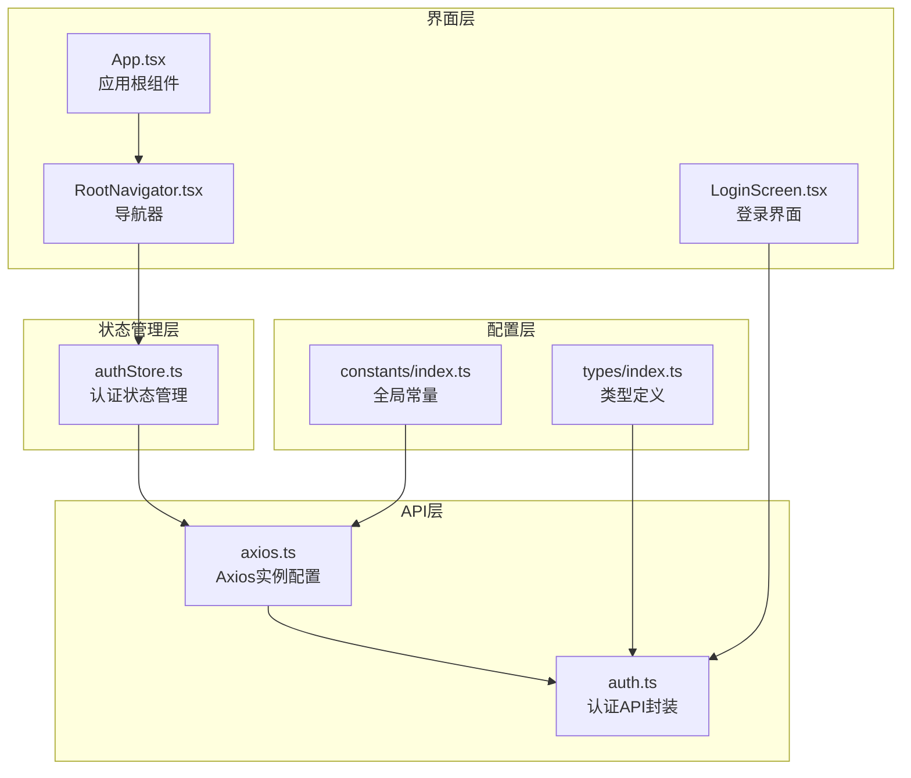
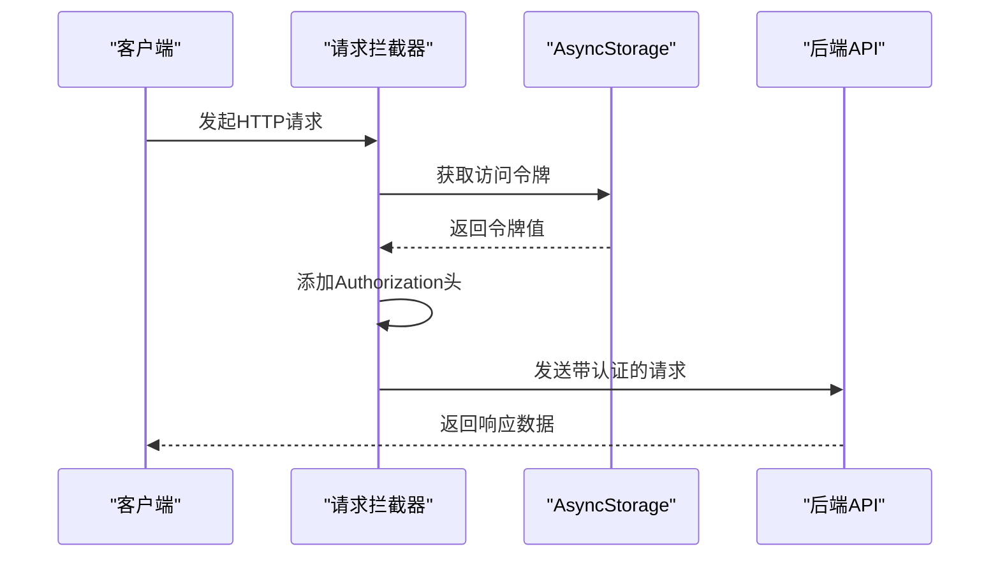
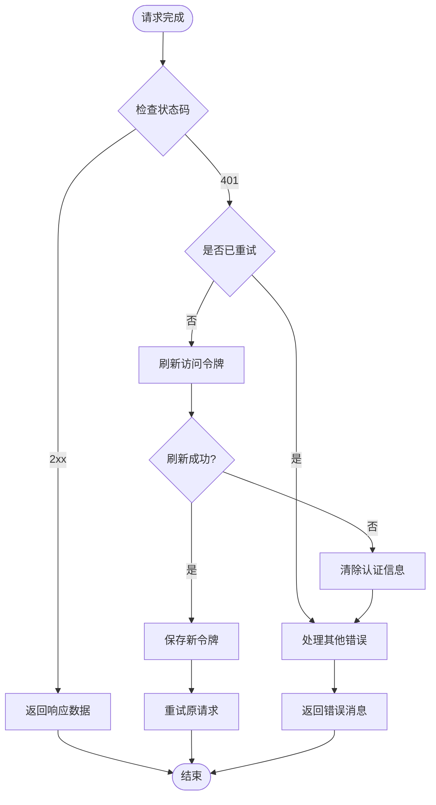
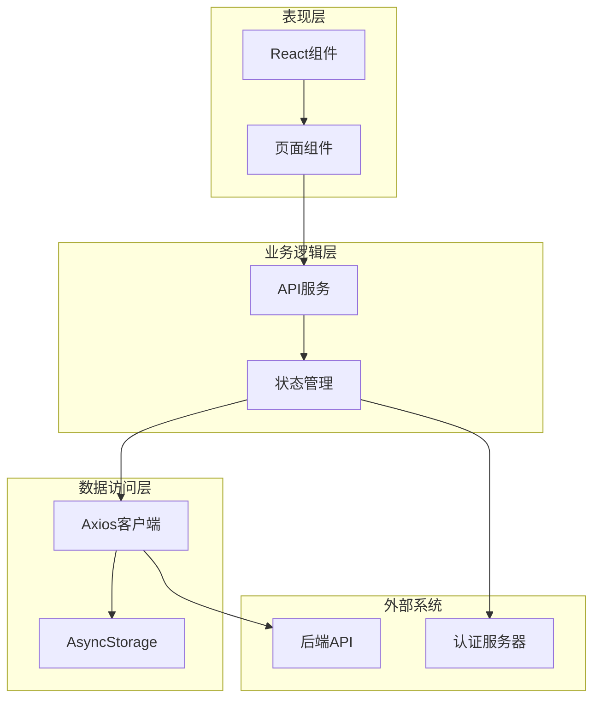
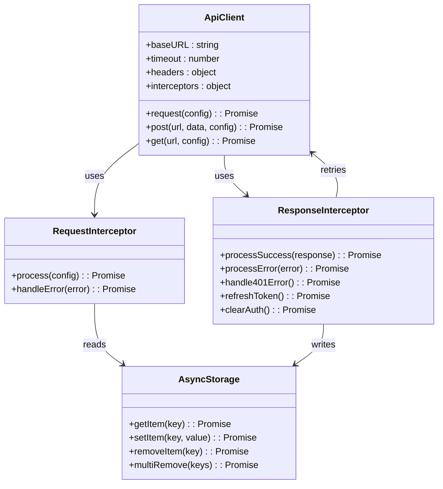
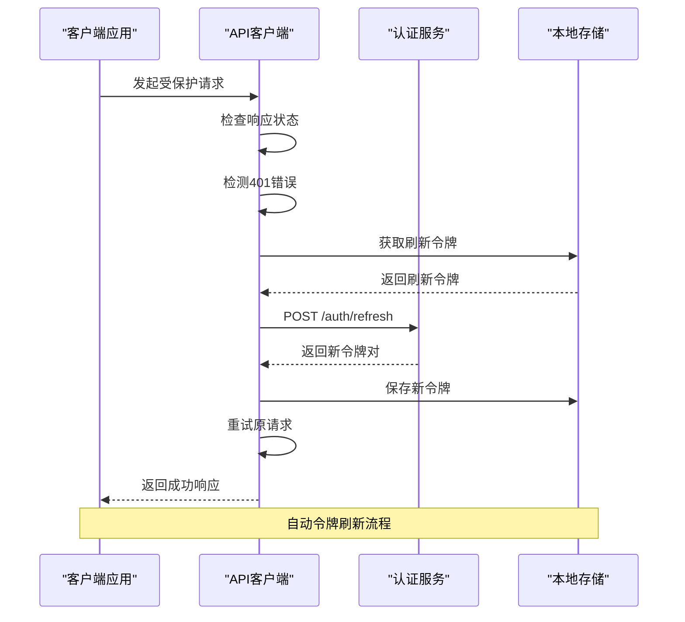
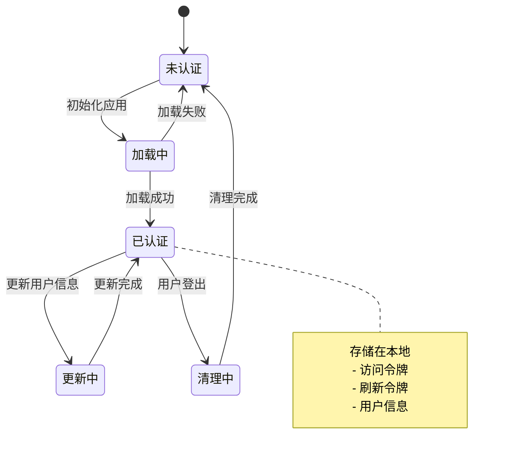
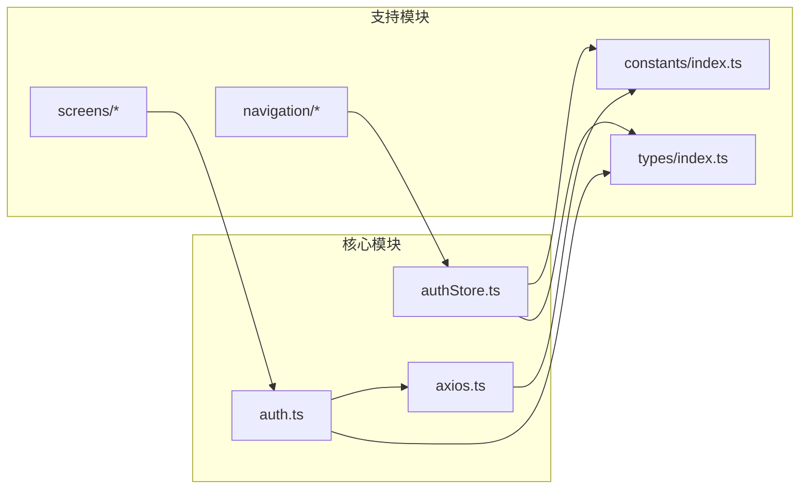

# Axios客户端配置

<cite>
**本文档引用的文件**
- [axios.ts](file://FreeDressApp/src/api/axios.ts)
- [auth.ts](file://FreeDressApp/src/api/auth.ts)
- [authStore.ts](file://FreeDressApp/src/store/authStore.ts)
- [index.ts（常量）](file://FreeDressApp/src/constants/index.ts)
- [index.ts（类型）](file://FreeDressApp/src/types/index.ts)
- [LoginScreen.tsx](file://FreeDressApp/src/screens/LoginScreen.tsx)
- [RootNavigator.tsx](file://FreeDressApp/src/navigation/RootNavigator.tsx)
- [App.tsx](file://FreeDressApp/src/App.tsx)
- [package.json](file://FreeDressApp/package.json)
</cite>

## 目录
1. [简介](#简介)
2. [项目结构](#项目结构)
3. [核心组件](#核心组件)
4. [架构概览](#架构概览)
5. [详细组件分析](#详细组件分析)
6. [依赖关系分析](#依赖关系分析)
7. [性能考量](#性能考量)
8. [故障排除指南](#故障排除指南)
9. [结论](#结论)

## 简介

本文档详细介绍畅搭(FreeDress)应用中的Axios客户端配置，涵盖从基础实例创建到完整的认证流程实现。该应用采用现代化的移动端架构，结合React Native、TypeScript和Zustand状态管理，实现了可靠的HTTP通信层。

## 项目结构

畅搭应用采用模块化的文件组织方式，API相关的核心文件位于`src/api`目录下：

**图表来源**
- [axios.ts:1-108](file://FreeDressApp/src/api/axios.ts#L1-L108)
- [auth.ts:1-101](file://FreeDressApp/src/api/auth.ts#L1-L101)
- [authStore.ts:1-123](file://FreeDressApp/src/store/authStore.ts#L1-L123)

**章节来源**
- [axios.ts:1-108](file://FreeDressApp/src/api/axios.ts#L1-L108)
- [auth.ts:1-101](file://FreeDressApp/src/api/auth.ts#L1-L101)
- [authStore.ts:1-123](file://FreeDressApp/src/store/authStore.ts#L1-L123)

## 核心组件

### Axios实例配置

应用创建了一个专门的Axios实例，具有以下配置特点：

- **基础URL设置**: 使用环境变量`API_BASE_URL`指向后端服务地址
- **超时配置**: 设置10秒超时时间，平衡响应速度和网络稳定性
- **请求头设置**: 默认JSON内容类型，确保前后端数据格式一致

### 请求拦截器实现

请求拦截器负责自动添加认证令牌，实现无感知的用户认证：

**图表来源**
- [axios.ts:24-38](file://FreeDressApp/src/api/axios.ts#L24-L38)

### 响应拦截器机制

响应拦截器实现了完整的错误处理和自动重试机制：

**图表来源**
- [axios.ts:44-105](file://FreeDressApp/src/api/axios.ts#L44-L105)

**章节来源**
- [axios.ts:12-18](file://FreeDressApp/src/api/axios.ts#L12-L18)
- [axios.ts:24-38](file://FreeDressApp/src/api/axios.ts#L24-L38)
- [axios.ts:44-105](file://FreeDressApp/src/api/axios.ts#L44-L105)

## 架构概览

应用的整体架构采用分层设计，确保关注点分离和代码可维护性：

**图表来源**
- [axios.ts:1-108](file://FreeDressApp/src/api/axios.ts#L1-L108)
- [authStore.ts:1-123](file://FreeDressApp/src/store/authStore.ts#L1-L123)
- [auth.ts:1-101](file://FreeDressApp/src/api/auth.ts#L1-L101)

## 详细组件分析

### Axios客户端类图

**图表来源**
- [axios.ts:12-18](file://FreeDressApp/src/api/axios.ts#L12-L18)
- [axios.ts:24-38](file://FreeDressApp/src/api/axios.ts#L24-L38)
- [axios.ts:44-105](file://FreeDressApp/src/api/axios.ts#L44-L105)

### Token刷新序列图

**图表来源**
- [axios.ts:54-98](file://FreeDressApp/src/api/axios.ts#L54-L98)

### 认证状态管理

应用使用Zustand实现轻量级状态管理，负责用户认证信息的持久化：

**图表来源**
- [authStore.ts:28-122](file://FreeDressApp/src/store/authStore.ts#L28-L122)

**章节来源**
- [axios.ts:54-98](file://FreeDressApp/src/api/axios.ts#L54-L98)
- [authStore.ts:28-122](file://FreeDressApp/src/store/authStore.ts#L28-L122)

## 依赖关系分析

### 外部依赖

应用的关键依赖包括：

- **axios**: HTTP客户端库，提供Promise风格的API调用
- **@react-native-async-storage/async-storage**: React Native的异步存储解决方案
- **zustand**: 轻量级状态管理库，替代Redux等重型解决方案

### 内部模块依赖

**图表来源**
- [package.json:12-31](file://FreeDressApp/package.json#L12-L31)
- [axios.ts:1-8](file://FreeDressApp/src/api/axios.ts#L1-L8)

**章节来源**
- [package.json:12-31](file://FreeDressApp/package.json#L12-L31)
- [axios.ts:1-8](file://FreeDressApp/src/api/axios.ts#L1-L8)

## 性能考量

### 网络优化策略

1. **超时配置**: 合理的10秒超时时间平衡了用户体验和资源占用
2. **请求去重**: 建议在实际应用中实现请求去重机制，避免重复请求
3. **缓存策略**: 对于静态数据，建议实现适当的缓存机制

### 内存管理

1. **状态清理**: 登出时彻底清理AsyncStorage中的认证信息
2. **监听器清理**: 确保组件卸载时清理相关的网络请求监听器

## 故障排除指南

### 常见问题及解决方案

#### 401未授权错误处理

当遇到401错误时，系统会自动执行以下流程：

1. **检测重试标记**: 避免无限循环重试
2. **刷新令牌**: 从本地存储获取刷新令牌
3. **重新认证**: 调用后端刷新接口获取新令牌对
4. **持久化更新**: 保存新令牌到本地存储
5. **重试请求**: 使用新令牌重新发送原始请求

#### AsyncStroage使用注意事项

1. **异步操作**: 所有存储操作都是异步的，需要使用await关键字
2. **错误处理**: 网络异常或存储损坏时要有相应的错误处理机制
3. **数据验证**: 读取存储数据时要进行格式验证

#### 开发调试技巧

1. **网络监控**: 使用浏览器开发者工具或专用网络调试工具
2. **日志记录**: 在关键节点添加详细的日志输出
3. **状态检查**: 定期检查AsyncStorage中的数据完整性

**章节来源**
- [axios.ts:49-104](file://FreeDressApp/src/api/axios.ts#L49-L104)
- [authStore.ts:117-121](file://FreeDressApp/src/store/authStore.ts#L117-L121)

## 结论

畅搭应用的Axios客户端配置展现了现代移动应用开发的最佳实践：

1. **模块化设计**: 清晰的职责分离和模块边界
2. **自动化处理**: 通过拦截器实现认证令牌的自动管理和刷新
3. **错误处理**: 完善的错误处理机制和用户友好的反馈
4. **状态管理**: 轻量级但功能完备的状态管理方案

这套配置为应用提供了可靠的数据通信基础，支持未来的功能扩展和性能优化需求。通过遵循本文档的指导原则，开发者可以安全地扩展和维护这个HTTP客户端配置。