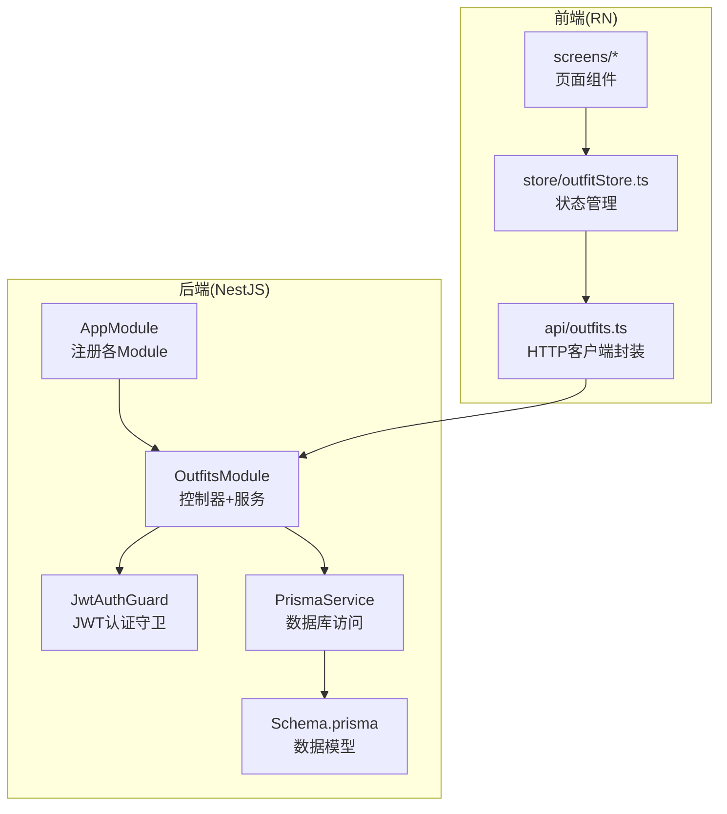
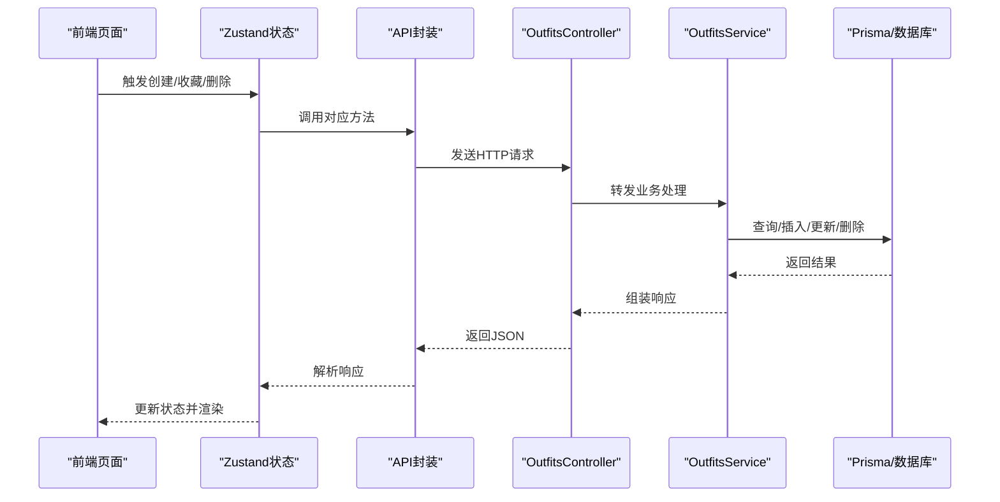
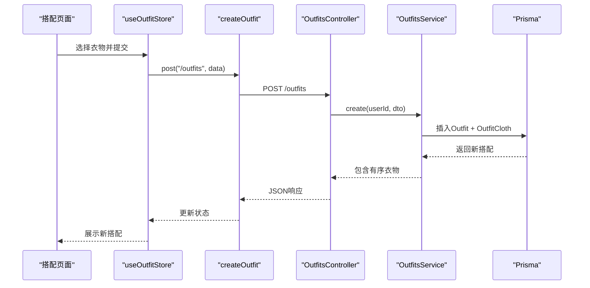
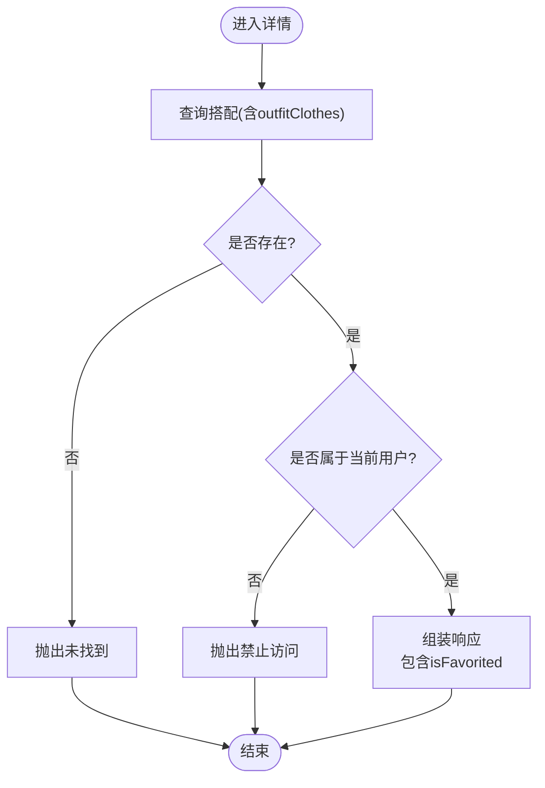
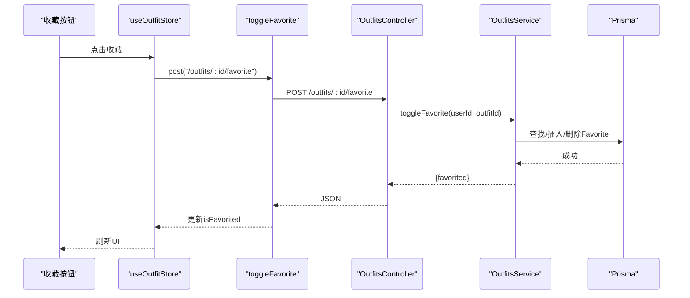
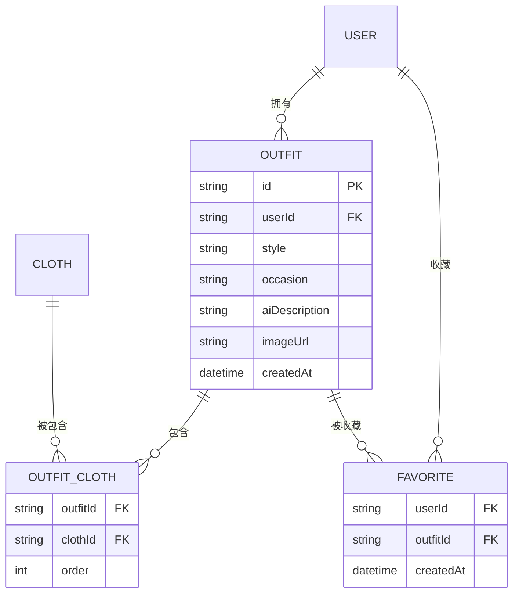
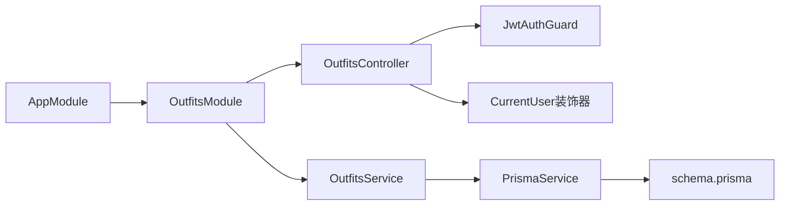

# 搭配API

<cite>
**本文引用的文件**
- [backend/src/modules/outfits/outfits.controller.ts](file://backend/src/modules/outfits/outfits.controller.ts)
- [backend/src/modules/outfits/outfits.service.ts](file://backend/src/modules/outfits/outfits.service.ts)
- [backend/src/modules/outfits/dto/create-outfit.dto.ts](file://backend/src/modules/outfits/dto/create-outfit.dto.ts)
- [backend/src/modules/outfits/outfits.module.ts](file://backend/src/modules/outfits/outfits.module.ts)
- [backend/src/common/guards/jwt-auth.guard.ts](file://backend/src/common/guards/jwt-auth.guard.ts)
- [backend/src/common/decorators/current-user.decorator.ts](file://backend/src/common/decorators/current-user.decorator.ts)
- [backend/src/app.module.ts](file://backend/src/app.module.ts)
- [backend/prisma/schema.prisma](file://backend/prisma/schema.prisma)
- [backend/prisma/migrations/20260507090458_init/migration.sql](file://backend/prisma/migrations/20260507090458_init/migration.sql)
- [FreeDressApp/src/api/outfits.ts](file://FreeDressApp/src/api/outfits.ts)
- [FreeDressApp/src/store/outfitStore.ts](file://FreeDressApp/src/store/outfitStore.ts)
- [FreeDressApp/src/types/index.ts](file://FreeDressApp/src/types/index.ts)
- [FreeDressApp/src/screes/OutfitScreen.tsx](file://FreeDressApp/src/screens/OutfitScreen.tsx)
- [FreeDressApp/src/screens/OutfitHistoryScreen.tsx](file://FreeDressApp/src/screens/OutfitHistoryScreen.tsx)
- [FreeDressApp/src/screens/FavoritesScreen.tsx](file://FreeDressApp/src/screens/FavoritesScreen.tsx)
- [FreeDressApp/src/navigation/MainTabNavigator.tsx](file://FreeDressApp/src/navigation/MainTabNavigator.tsx)
</cite>

## 目录
1. [简介](#简介)
2. [项目结构](#项目结构)
3. [核心组件](#核心组件)
4. [架构总览](#架构总览)
5. [详细组件分析](#详细组件分析)
6. [依赖分析](#依赖分析)
7. [性能考虑](#性能考虑)
8. [故障排查指南](#故障排查指南)
9. [结论](#结论)
10. [附录](#附录)

## 简介
本文件为畅搭(FreeDress)应用的“搭配”相关API与前端集成的完整技术文档。重点覆盖以下能力：
- 搭配的创建、查询、详情、删除
- 收藏与取消收藏
- 搭配历史列表
- 搭配组合逻辑与风格标签管理
- 保存、分享与删除机制
- 历史查询与管理
- 使用示例与最佳实践
- 算法实现思路与性能优化建议

## 项目结构
后端采用NestJS + Prisma，前端采用React Native + Zustand，微信小程序端亦有配套实现。搭配模块位于后端的Outfits子系统，前端通过API封装与状态管理完成UI交互。

图示来源
- [backend/src/app.module.ts:13-31](file://backend/src/app.module.ts#L13-L31)
- [backend/src/modules/outfits/outfits.module.ts:5-10](file://backend/src/modules/outfits/outfits.module.ts#L5-L10)
- [backend/src/common/guards/jwt-auth.guard.ts:8-21](file://backend/src/common/guards/jwt-auth.guard.ts#L8-L21)
- [backend/prisma/schema.prisma:14-131](file://backend/prisma/schema.prisma#L14-L131)
- [FreeDressApp/src/api/outfits.ts:17-39](file://FreeDressApp/src/api/outfits.ts#L17-L39)
- [FreeDressApp/src/store/outfitStore.ts:32-89](file://FreeDressApp/src/store/outfitStore.ts#L32-L89)

章节来源
- [backend/src/app.module.ts:13-31](file://backend/src/app.module.ts#L13-L31)
- [backend/src/modules/outfits/outfits.module.ts:5-10](file://backend/src/modules/outfits/outfits.module.ts#L5-L10)
- [backend/prisma/schema.prisma:14-131](file://backend/prisma/schema.prisma#L14-L131)
- [FreeDressApp/src/api/outfits.ts:17-39](file://FreeDressApp/src/api/outfits.ts#L17-L39)
- [FreeDressApp/src/store/outfitStore.ts:32-89](file://FreeDressApp/src/store/outfitStore.ts#L32-L89)

## 核心组件
- 后端控制器：提供REST接口，受JWT保护，负责鉴权与路由转发。
- 后端服务：封装业务逻辑，执行数据库读写与权限校验。
- DTO：约束创建搭配的输入参数。
- 前端API封装：统一调用后端接口，返回标准化响应。
- 前端状态管理：集中管理搭配列表、收藏列表、当前搭配等状态。
- 数据模型：定义Outfit、Cloth、OutfitCloth、Favorite等实体及关系。

章节来源
- [backend/src/modules/outfits/outfits.controller.ts:14-64](file://backend/src/modules/outfits/outfits.controller.ts#L14-L64)
- [backend/src/modules/outfits/outfits.service.ts:6-122](file://backend/src/modules/outfits/outfits.service.ts#L6-L122)
- [backend/src/modules/outfits/dto/create-outfit.dto.ts:4-30](file://backend/src/modules/outfits/dto/create-outfit.dto.ts#L4-L30)
- [FreeDressApp/src/api/outfits.ts:17-39](file://FreeDressApp/src/api/outfits.ts#L17-L39)
- [FreeDressApp/src/store/outfitStore.ts:32-89](file://FreeDressApp/src/store/outfitStore.ts#L32-L89)
- [backend/prisma/schema.prisma:70-114](file://backend/prisma/schema.prisma#L70-L114)

## 架构总览
后端通过OutfitsModule暴露REST接口，使用JwtAuthGuard进行认证拦截，并通过CurrentUser装饰器注入用户上下文。OutfitsService基于Prisma执行数据库操作，确保搭配与衣物的多对多关系以及收藏状态的正确性。前端通过API封装与Zustand状态管理完成UI渲染与交互。

图示来源
- [FreeDressApp/src/store/outfitStore.ts:38-86](file://FreeDressApp/src/store/outfitStore.ts#L38-L86)
- [FreeDressApp/src/api/outfits.ts:17-39](file://FreeDressApp/src/api/outfits.ts#L17-L39)
- [backend/src/modules/outfits/outfits.controller.ts:17-63](file://backend/src/modules/outfits/outfits.controller.ts#L17-L63)
- [backend/src/modules/outfits/outfits.service.ts:9-121](file://backend/src/modules/outfits/outfits.service.ts#L9-L121)

## 详细组件分析

### 接口定义与鉴权
- 所有搭配相关接口均受JWT保护，需携带Bearer Token。
- 控制器方法：
  - POST /outfits：创建搭配
  - GET /outfits：获取当前用户的所有搭配
  - GET /outfits/favorites：获取收藏列表
  - GET /outfits/:id：获取搭配详情
  - DELETE /outfits/:id：删除搭配
  - POST /outfits/:id/favorite：收藏/取消收藏

章节来源
- [backend/src/modules/outfits/outfits.controller.ts:17-63](file://backend/src/modules/outfits/outfits.controller.ts#L17-L63)
- [backend/src/common/guards/jwt-auth.guard.ts:8-21](file://backend/src/common/guards/jwt-auth.guard.ts#L8-L21)
- [backend/src/common/decorators/current-user.decorator.ts:7-15](file://backend/src/common/decorators/current-user.decorator.ts#L7-L15)

### 创建搭配
- 请求体：clothIds（必填，至少1个）、style（可选）、occasion（可选）、aiDescription（可选）、imageUrl（可选）
- 服务端逻辑：
  - 为每个clothId按顺序创建OutfitCloth记录
  - 返回包含outfitClothes按order升序排列的结果
- 前端调用：通过createOutfit封装发起POST请求

图示来源
- [FreeDressApp/src/screens/OutfitScreen.tsx:67-84](file://FreeDressApp/src/screens/OutfitScreen.tsx#L67-L84)
- [FreeDressApp/src/store/outfitStore.ts:59-64](file://FreeDressApp/src/store/outfitStore.ts#L59-L64)
- [FreeDressApp/src/api/outfits.ts:17-19](file://FreeDressApp/src/api/outfits.ts#L17-L19)
- [backend/src/modules/outfits/outfits.controller.ts:17-24](file://backend/src/modules/outfits/outfits.controller.ts#L17-L24)
- [backend/src/modules/outfits/outfits.service.ts:9-33](file://backend/src/modules/outfits/outfits.service.ts#L9-L33)

章节来源
- [backend/src/modules/outfits/dto/create-outfit.dto.ts:4-30](file://backend/src/modules/outfits/dto/create-outfit.dto.ts#L4-L30)
- [backend/src/modules/outfits/outfits.service.ts:9-33](file://backend/src/modules/outfits/outfits.service.ts#L9-L33)
- [FreeDressApp/src/api/outfits.ts:10-15](file://FreeDressApp/src/api/outfits.ts#L10-L15)
- [FreeDressApp/src/store/outfitStore.ts:59-64](file://FreeDressApp/src/store/outfitStore.ts#L59-L64)

### 获取搭配列表与详情
- 列表：按创建时间倒序返回，包含每个搭配的收藏数统计与有序衣物
- 详情：校验搭配归属，仅返回当前用户可见的搭配；同时返回isFavorited标记

图示来源
- [backend/src/modules/outfits/outfits.service.ts:49-73](file://backend/src/modules/outfits/outfits.service.ts#L49-L73)
- [backend/src/modules/outfits/outfits.controller.ts:38-45](file://backend/src/modules/outfits/outfits.controller.ts#L38-L45)

章节来源
- [backend/src/modules/outfits/outfits.service.ts:35-47](file://backend/src/modules/outfits/outfits.service.ts#L35-L47)
- [backend/src/modules/outfits/outfits.service.ts:49-73](file://backend/src/modules/outfits/outfits.service.ts#L49-L73)
- [backend/src/modules/outfits/outfits.controller.ts:26-30](file://backend/src/modules/outfits/outfits.controller.ts#L26-L30)
- [backend/src/modules/outfits/outfits.controller.ts:38-45](file://backend/src/modules/outfits/outfits.controller.ts#L38-L45)

### 收藏与取消收藏
- 通过POST /outfits/:id/favorite切换收藏状态
- 若存在则删除，否则新增；返回当前收藏状态

图示来源
- [FreeDressApp/src/store/outfitStore.ts:74-86](file://FreeDressApp/src/store/outfitStore.ts#L74-L86)
- [FreeDressApp/src/api/outfits.ts:33-35](file://FreeDressApp/src/api/outfits.ts#L33-L35)
- [backend/src/modules/outfits/outfits.controller.ts:56-63](file://backend/src/modules/outfits/outfits.controller.ts#L56-L63)
- [backend/src/modules/outfits/outfits.service.ts:81-102](file://backend/src/modules/outfits/outfits.service.ts#L81-L102)

章节来源
- [backend/src/modules/outfits/outfits.service.ts:81-102](file://backend/src/modules/outfits/outfits.service.ts#L81-L102)
- [FreeDressApp/src/store/outfitStore.ts:74-86](file://FreeDressApp/src/store/outfitStore.ts#L74-L86)

### 删除搭配
- 校验搭配归属后删除；返回成功消息

章节来源
- [backend/src/modules/outfits/outfits.service.ts:75-79](file://backend/src/modules/outfits/outfits.service.ts#L75-L79)
- [backend/src/modules/outfits/outfits.controller.ts:47-54](file://backend/src/modules/outfits/outfits.controller.ts#L47-L54)
- [FreeDressApp/src/store/outfitStore.ts:66-72](file://FreeDressApp/src/store/outfitStore.ts#L66-L72)

### 获取收藏列表
- 通过GET /outfits/favorites返回当前用户的收藏搭配，按创建时间倒序

章节来源
- [backend/src/modules/outfits/outfits.service.ts:104-121](file://backend/src/modules/outfits/outfits.service.ts#L104-L121)
- [backend/src/modules/outfits/outfits.controller.ts:32-36](file://backend/src/modules/outfits/outfits.controller.ts#L32-L36)
- [FreeDressApp/src/api/outfits.ts:37-39](file://FreeDressApp/src/api/outfits.ts#L37-L39)
- [FreeDressApp/src/screens/FavoritesScreen.tsx:40-59](file://FreeDressApp/src/screens/FavoritesScreen.tsx#L40-L59)

### 搭配历史查询
- 通过GET /outfits返回当前用户的所有搭配，按创建时间倒序
- 历史页面支持下拉刷新与空态展示

章节来源
- [backend/src/modules/outfits/outfits.controller.ts:26-30](file://backend/src/modules/outfits/outfits.controller.ts#L26-L30)
- [backend/src/modules/outfits/outfits.service.ts:35-47](file://backend/src/modules/outfits/outfits.service.ts#L35-L47)
- [FreeDressApp/src/api/outfits.ts:21-23](file://FreeDressApp/src/api/outfits.ts#L21-L23)
- [FreeDressApp/src/screens/OutfitHistoryScreen.tsx:38-57](file://FreeDressApp/src/screens/OutfitHistoryScreen.tsx#L38-L57)

### 数据模型与组合逻辑
- Outfit：搭配主表，包含style、occasion、aiDescription、imageUrl等元信息
- OutfitCloth：多对多中间表，维护搭配内衣物顺序(order)
- Favorite：用户对搭配的收藏关系
- 组合逻辑：
  - 创建时按clothIds顺序写入OutfitCloth
  - 查询时按order升序返回衣物
  - 收藏通过Favorite表实现，详情接口返回isFavorited

图示来源
- [backend/prisma/schema.prisma:70-114](file://backend/prisma/schema.prisma#L70-L114)
- [backend/prisma/migrations/20260507090458_init/migration.sql:104-120](file://backend/prisma/migrations/20260507090458_init/migration.sql#L104-L120)

章节来源
- [backend/prisma/schema.prisma:70-114](file://backend/prisma/schema.prisma#L70-L114)
- [backend/prisma/migrations/20260507090458_init/migration.sql:104-120](file://backend/prisma/migrations/20260507090458_init/migration.sql#L104-L120)

### 前端集成与状态管理
- API封装：统一导出createOutfit、getOutfits、getOutfit、deleteOutfit、toggleFavorite、getFavorites
- 状态管理：useOutfitStore集中管理outfits、favorites、currentOutfit、isLoading，并在操作后同步UI
- 页面组件：
  - 搭配页面：选择衣物、设置风格意图、生成搭配、收藏、试穿跳转
  - 历史页面：展示搭配缩略图、风格、场合、日期
  - 收藏页面：展示收藏列表，支持取消收藏

章节来源
- [FreeDressApp/src/api/outfits.ts:17-39](file://FreeDressApp/src/api/outfits.ts#L17-L39)
- [FreeDressApp/src/store/outfitStore.ts:32-89](file://FreeDressApp/src/store/outfitStore.ts#L32-L89)
- [FreeDressApp/src/screens/OutfitScreen.tsx:37-93](file://FreeDressApp/src/screens/OutfitScreen.tsx#L37-L93)
- [FreeDressApp/src/screens/OutfitHistoryScreen.tsx:32-96](file://FreeDressApp/src/screens/OutfitHistoryScreen.tsx#L32-L96)
- [FreeDressApp/src/screens/FavoritesScreen.tsx:34-108](file://FreeDressApp/src/screens/FavoritesScreen.tsx#L34-L108)

## 依赖分析
- 模块依赖：AppModule导入OutfitsModule；OutfitsController依赖JwtAuthGuard与CurrentUser装饰器；OutfitsService依赖PrismaService
- 数据依赖：Outfit依赖User与Cloth；OutfitCloth连接Outfit与Cloth；Favorite连接User与Outfit
- 前端依赖：API封装与Zustand状态管理解耦UI与网络层

图示来源
- [backend/src/app.module.ts:13-31](file://backend/src/app.module.ts#L13-L31)
- [backend/src/modules/outfits/outfits.module.ts:5-10](file://backend/src/modules/outfits/outfits.module.ts#L5-L10)
- [backend/src/common/guards/jwt-auth.guard.ts:8-21](file://backend/src/common/guards/jwt-auth.guard.ts#L8-L21)
- [backend/src/common/decorators/current-user.decorator.ts:7-15](file://backend/src/common/decorators/current-user.decorator.ts#L7-L15)
- [backend/prisma/schema.prisma:14-131](file://backend/prisma/schema.prisma#L14-L131)

章节来源
- [backend/src/app.module.ts:13-31](file://backend/src/app.module.ts#L13-L31)
- [backend/src/modules/outfits/outfits.module.ts:5-10](file://backend/src/modules/outfits/outfits.module.ts#L5-L10)
- [backend/prisma/schema.prisma:14-131](file://backend/prisma/schema.prisma#L14-L131)

## 性能考虑
- 数据查询优化
  - 列表查询按用户索引过滤，避免全表扫描
  - 详情查询包含outfitClothes并按order排序，建议在数据库层面建立复合索引以优化排序
- 写入优化
  - 创建搭配时批量写入OutfitCloth，减少事务次数
- 前端缓存与去抖
  - 使用Zustand集中缓存搭配列表与收藏列表，避免重复请求
  - 对频繁收藏/取消收藏操作进行防抖或乐观更新
- 分页与懒加载
  - 历史列表建议增加分页参数(limit/offset或游标)，避免一次性加载过多数据
- 网络层
  - 统一错误处理与重试策略，提升弱网环境下的体验

## 故障排查指南
- 401 未授权
  - 检查请求头Authorization是否携带Bearer Token
  - 确认Token有效且未过期
- 403 禁止访问
  - 确认请求的搭配属于当前用户
- 404 搭配不存在
  - 检查搭配ID是否正确
- 收藏状态不一致
  - 前端乐观更新后若后端失败，需回滚状态或刷新列表
- 列表为空
  - 确认当前用户是否有搭配或收藏记录

章节来源
- [backend/src/common/guards/jwt-auth.guard.ts:14-20](file://backend/src/common/guards/jwt-auth.guard.ts#L14-L20)
- [backend/src/modules/outfits/outfits.service.ts:61-66](file://backend/src/modules/outfits/outfits.service.ts#L61-L66)
- [FreeDressApp/src/store/outfitStore.ts:74-86](file://FreeDressApp/src/store/outfitStore.ts#L74-L86)

## 结论
本API体系围绕“搭配”这一核心实体，结合Outfit、Cloth、OutfitCloth、Favorite等模型，实现了完整的创建、查询、收藏与历史管理能力。后端通过JWT与权限校验保障安全，前端通过Zustand实现高效的状态同步。建议后续引入分页、索引优化与更完善的错误恢复机制，进一步提升性能与稳定性。

## 附录

### API一览（摘要）
- 创建搭配
  - 方法：POST
  - 路径：/outfits
  - 请求体：clothIds（必填）、style（可选）、occasion（可选）、aiDescription（可选）、imageUrl（可选）]
- 获取搭配列表
  - 方法：GET
  - 路径：/outfits
- 获取搭配详情
  - 方法：GET
  - 路径：/outfits/:id
- 删除搭配
  - 方法：DELETE
  - 路径：/outfits/:id
- 收藏/取消收藏
  - 方法：POST
  - 路径：/outfits/:id/favorite
- 获取收藏列表
  - 方法：GET
  - 路径：/outfits/favorites

章节来源
- [backend/src/modules/outfits/outfits.controller.ts:17-63](file://backend/src/modules/outfits/outfits.controller.ts#L17-L63)
- [backend/src/modules/outfits/dto/create-outfit.dto.ts:4-30](file://backend/src/modules/outfits/dto/create-outfit.dto.ts#L4-L30)

### 使用示例与最佳实践
- 创建搭配
  - 步骤：选择衣物 → 设置风格 → 提交请求 → 乐观更新UI → 失败回滚
  - 注意：至少选择1件衣物；顺序即搭配中的先后
- 收藏管理
  - 步骤：点击收藏 → 服务器切换状态 → 更新本地isFavorited
  - 注意：收藏列表按时间倒序展示
- 历史查看
  - 步骤：进入历史页面 → 下拉刷新 → 查看缩略图与元信息
  - 注意：图片数量与场合信息可辅助检索

章节来源
- [FreeDressApp/src/screens/OutfitScreen.tsx:67-84](file://FreeDressApp/src/screens/OutfitScreen.tsx#L67-L84)
- [FreeDressApp/src/store/outfitStore.ts:59-64](file://FreeDressApp/src/store/outfitStore.ts#L59-L64)
- [FreeDressApp/src/screens/FavoritesScreen.tsx:40-59](file://FreeDressApp/src/screens/FavoritesScreen.tsx#L40-L59)
- [FreeDressApp/src/screens/OutfitHistoryScreen.tsx:38-57](file://FreeDressApp/src/screens/OutfitHistoryScreen.tsx#L38-L57)

### 算法实现思路与优化建议
- 组合逻辑
  - 以clothIds为输入，按顺序写入OutfitCloth，保证搭配的视觉连贯性
- 标签管理
  - style/occasion由用户输入，便于后续筛选与推荐
- 性能优化
  - 数据库索引：为userId、outfitId/clothId建立索引
  - 查询优化：列表与详情分别按需包含outfitClothes与统计信息
  - 前端缓存：Zustand集中管理，避免重复请求
  - 分页：历史列表引入分页参数，降低单次负载

章节来源
- [backend/src/modules/outfits/outfits.service.ts:9-33](file://backend/src/modules/outfits/outfits.service.ts#L9-L33)
- [backend/prisma/schema.prisma:70-114](file://backend/prisma/schema.prisma#L70-L114)
- [FreeDressApp/src/store/outfitStore.ts:32-89](file://FreeDressApp/src/store/outfitStore.ts#L32-L89)