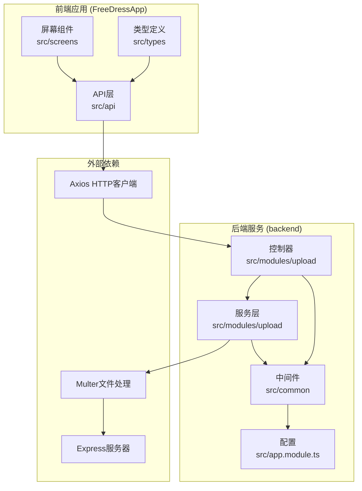
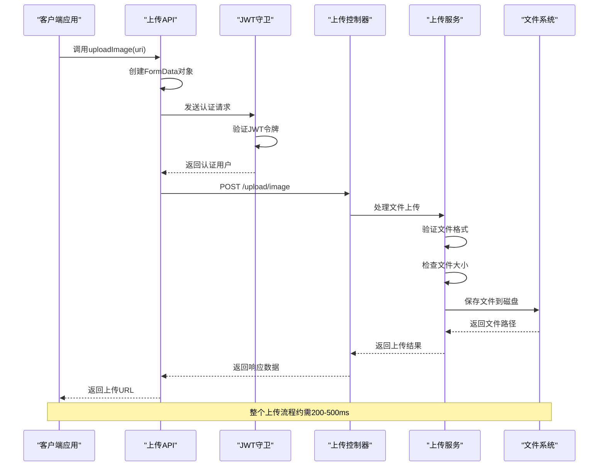
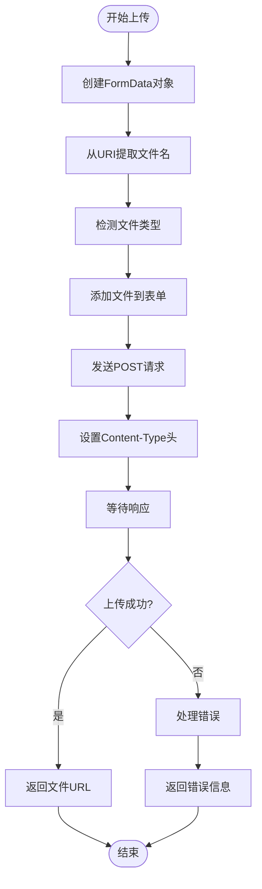
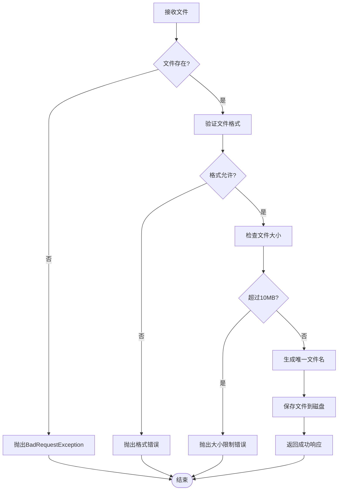
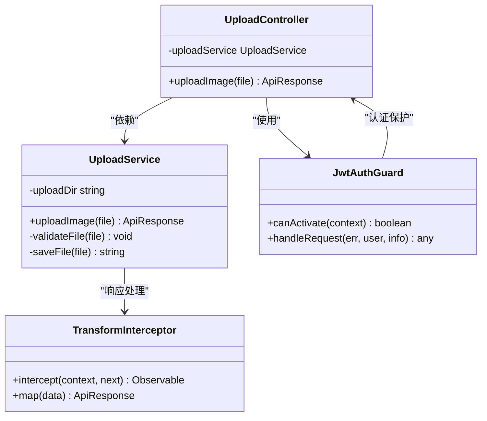
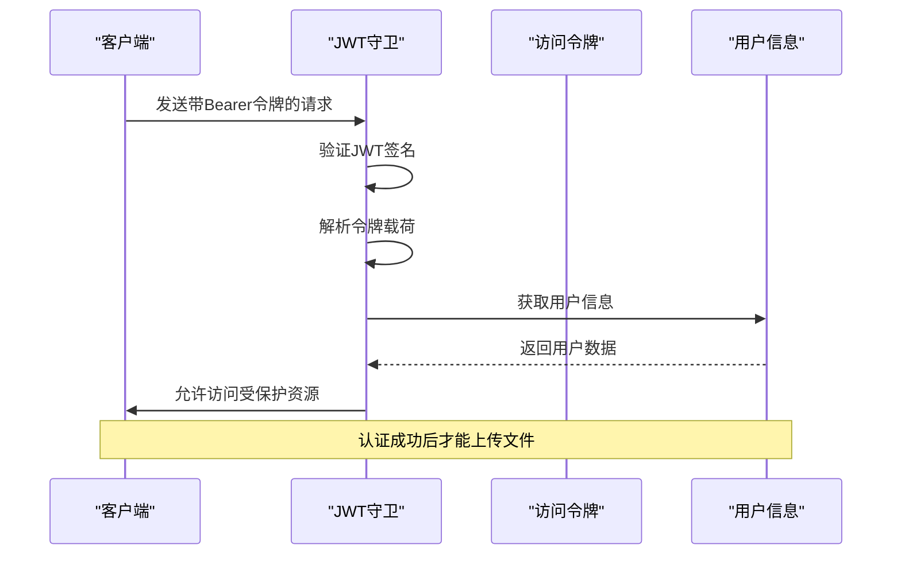
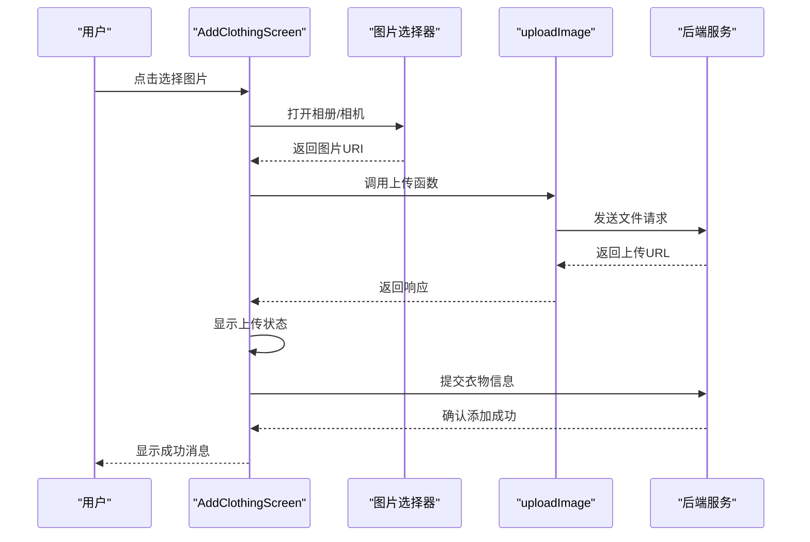
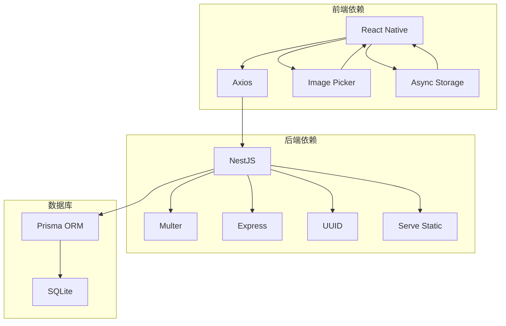

# 文件上传API

<cite>
**本文引用的文件**
- [upload.ts](file://FreeDressApp/src/api/upload.ts)
- [axios.ts](file://FreeDressApp/src/api/axios.ts)
- [index.ts](file://FreeDressApp/src/types/index.ts)
- [upload.controller.ts](file://backend/src/modules/upload/upload.controller.ts)
- [upload.service.ts](file://backend/src/modules/upload/upload.service.ts)
- [upload.module.ts](file://backend/src/modules/upload/upload.module.ts)
- [app.module.ts](file://backend/src/app.module.ts)
- [jwt-auth.guard.ts](file://backend/src/common/guards/jwt-auth.guard.ts)
- [transform.interceptor.ts](file://backend/src/common/interceptors/transform.interceptor.ts)
- [main.ts](file://backend/src/main.ts)
- [AddClothingScreen.tsx](file://FreeDressApp/src/screens/AddClothingScreen.tsx)
- [EditProfileScreen.tsx](file://FreeDressApp/src/screens/EditProfileScreen.tsx)
- [TryOnScreen.tsx](file://FreeDressApp/src/screens/TryOnScreen.tsx)
- [package.json](file://FreeDressApp/package.json)
- [package.json](file://backend/package.json)
</cite>

## 目录
1. [简介](#简介)
2. [项目结构](#项目结构)
3. [核心组件](#核心组件)
4. [架构概览](#架构概览)
5. [详细组件分析](#详细组件分析)
6. [依赖关系分析](#依赖关系分析)
7. [性能考虑](#性能考虑)
8. [故障排除指南](#故障排除指南)
9. [结论](#结论)
10. [附录](#附录)

## 简介

畅搭(FreeDress)应用的文件上传API为用户提供了一个完整的图片上传解决方案。该系统支持单张图片上传、文件格式验证、大小限制检查以及统一的错误处理机制。系统采用前后端分离架构，前端使用React Native开发，后端基于NestJS构建RESTful API。

本API文档详细介绍了文件上传的完整流程，包括客户端实现、服务端处理逻辑、安全验证机制以及最佳实践建议。特别关注了图片上传的格式验证、大小限制和压缩处理策略，以及如何在移动应用中实现流畅的用户体验。

## 项目结构

文件上传功能分布在三个主要部分：



**图表来源**
- [upload.ts:1-21](file://FreeDressApp/src/api/upload.ts#L1-L21)
- [upload.controller.ts:1-51](file://backend/src/modules/upload/upload.controller.ts#L1-L51)
- [upload.service.ts:1-49](file://backend/src/modules/upload/upload.service.ts#L1-L49)

**章节来源**
- [upload.ts:1-21](file://FreeDressApp/src/api/upload.ts#L1-L21)
- [upload.controller.ts:1-51](file://backend/src/modules/upload/upload.controller.ts#L1-L51)
- [upload.service.ts:1-49](file://backend/src/modules/upload/upload.service.ts#L1-L49)
- [app.module.ts:1-33](file://backend/src/app.module.ts#L1-L33)

## 核心组件

### 前端上传API

前端提供了简洁的上传接口，封装了FormData的创建和HTTP请求的发送过程。

**章节来源**
- [upload.ts:4-20](file://FreeDressApp/src/api/upload.ts#L4-L20)
- [axios.ts](file://FreeDressApp/src/api/axios.ts)

### 后端上传服务

后端实现了完整的文件处理流程，包括格式验证、大小检查、文件保存和URL生成。

**章节来源**
- [upload.controller.ts:33-49](file://backend/src/modules/upload/upload.controller.ts#L33-L49)
- [upload.service.ts:25-47](file://backend/src/modules/upload/upload.service.ts#L25-L47)

### 安全认证

系统集成了JWT认证机制，确保只有经过身份验证的用户才能进行文件上传操作。

**章节来源**
- [jwt-auth.guard.ts:1-22](file://backend/src/common/guards/jwt-auth.guard.ts#L1-L22)
- [upload.controller.ts:34-35](file://backend/src/modules/upload/upload.controller.ts#L34-L35)

## 架构概览

文件上传系统的整体架构采用分层设计，确保了代码的可维护性和扩展性：



**图表来源**
- [upload.ts:4-19](file://FreeDressApp/src/api/upload.ts#L4-L19)
- [upload.controller.ts:33-49](file://backend/src/modules/upload/upload.controller.ts#L33-L49)
- [upload.service.ts:25-47](file://backend/src/modules/upload/upload.service.ts#L25-L47)

## 详细组件分析

### 前端上传实现

前端的上传功能通过专门的API模块实现，提供了简单易用的接口：

#### 上传函数实现



**图表来源**
- [upload.ts:4-19](file://FreeDressApp/src/api/upload.ts#L4-L19)

#### 类型定义

前端使用统一的响应格式来确保API调用的一致性：

**章节来源**
- [upload.ts:1-21](file://FreeDressApp/src/api/upload.ts#L1-L21)
- [index.ts:58-64](file://FreeDressApp/src/types/index.ts#L58-L64)

### 后端处理逻辑

后端实现了完整的文件处理管道，确保上传的安全性和可靠性：

#### 文件验证流程



**图表来源**
- [upload.service.ts:25-47](file://backend/src/modules/upload/upload.service.ts#L25-L47)

#### 服务层架构



**图表来源**
- [upload.controller.ts:30-31](file://backend/src/modules/upload/upload.controller.ts#L30-L31)
- [upload.service.ts:15-16](file://backend/src/modules/upload/upload.service.ts#L15-L16)
- [jwt-auth.guard.ts:8-21](file://backend/src/common/guards/jwt-auth.guard.ts#L8-L21)

**章节来源**
- [upload.controller.ts:1-51](file://backend/src/modules/upload/upload.controller.ts#L1-L51)
- [upload.service.ts:1-49](file://backend/src/modules/upload/upload.service.ts#L1-L49)

### 安全和认证机制

系统采用了多层次的安全防护措施：

#### JWT认证流程



**图表来源**
- [jwt-auth.guard.ts:9-20](file://backend/src/common/guards/jwt-auth.guard.ts#L9-L20)

#### 统一响应格式

后端使用拦截器确保所有API响应具有一致的格式：

**章节来源**
- [transform.interceptor.ts:19-31](file://backend/src/common/interceptors/transform.interceptor.ts#L19-L31)
- [main.ts:24-25](file://backend/src/main.ts#L24-L25)

### 实际使用示例

#### 在衣物添加页面中的使用



**图表来源**
- [AddClothingScreen.tsx:47-86](file://FreeDressApp/src/screens/AddClothingScreen.tsx#L47-L86)

**章节来源**
- [AddClothingScreen.tsx:47-86](file://FreeDressApp/src/screens/AddClothingScreen.tsx#L47-L86)
- [EditProfileScreen.tsx](file://FreeDressApp/src/screens/EditProfileScreen.tsx#L58)
- [TryOnScreen.tsx](file://FreeDressApp/src/screens/TryOnScreen.tsx#L73)

## 依赖关系分析

文件上传功能涉及多个模块间的复杂交互：



**图表来源**
- [package.json:12-31](file://FreeDressApp/package.json#L12-L31)
- [package.json:26-44](file://backend/package.json#L26-L44)

**章节来源**
- [package.json:1-57](file://FreeDressApp/package.json#L1-L57)
- [package.json:1-91](file://backend/package.json#L1-L91)

## 性能考虑

### 上传性能优化

1. **文件大小控制**: 系统限制最大文件大小为10MB，防止大文件占用过多带宽和存储空间。

2. **格式验证**: 仅允许JPG、PNG、WebP、GIF格式，确保兼容性和处理效率。

3. **异步处理**: 使用异步文件写入避免阻塞主线程。

4. **缓存策略**: 上传后的文件通过静态文件服务提供，减少服务器负载。

### 用户体验优化

1. **进度指示**: 在UI中显示上传状态，提供即时反馈。

2. **错误处理**: 提供清晰的错误消息，帮助用户理解问题所在。

3. **预览功能**: 允许用户在上传前查看选择的图片。

4. **重试机制**: 在网络不稳定时提供重试选项。

## 故障排除指南

### 常见问题及解决方案

#### 1. 上传失败

**症状**: 上传过程中出现错误提示

**可能原因**:
- 文件格式不被支持
- 文件大小超过限制
- 网络连接不稳定
- 服务器认证失败

**解决方法**:
- 检查文件格式是否为JPG/PNG/WebP/GIF
- 确保文件大小不超过10MB
- 检查网络连接状态
- 验证JWT令牌有效性

#### 2. 图片无法显示

**症状**: 上传成功但图片无法正常显示

**可能原因**:
- 文件路径配置错误
- 静态文件服务未正确配置
- 浏览器缓存问题

**解决方法**:
- 检查uploads目录权限
- 验证ServeStatic配置
- 清除浏览器缓存或强制刷新

#### 3. 认证失败

**症状**: 401未授权错误

**可能原因**:
- JWT令牌过期
- 令牌格式不正确
- 用户未登录

**解决方法**:
- 重新登录获取新令牌
- 检查令牌格式和有效期
- 确保在请求头中正确传递令牌

**章节来源**
- [upload.service.ts:30-38](file://backend/src/modules/upload/upload.service.ts#L30-L38)
- [jwt-auth.guard.ts:14-20](file://backend/src/common/guards/jwt-auth.guard.ts#L14-L20)

## 结论

畅搭应用的文件上传API设计合理，实现了以下关键特性：

1. **安全性**: 通过JWT认证确保只有授权用户可以上传文件
2. **可靠性**: 完整的文件验证和错误处理机制
3. **易用性**: 简洁的API接口和良好的用户体验
4. **可扩展性**: 模块化设计便于功能扩展和维护

系统目前支持单张图片上传，未来可以在此基础上扩展多文件上传、断点续传、压缩处理等高级功能。建议在保持现有安全机制的基础上，逐步增强上传功能以满足更复杂的业务需求。

## 附录

### API规范

#### 端点定义
- **端点**: `POST /api/upload/image`
- **认证**: 需要Bearer Token
- **内容类型**: `multipart/form-data`
- **请求体**: `file` (二进制文件)

#### 请求示例
```javascript
// 前端调用示例
const response = await uploadImage('file://path/to/image.jpg');
const imageUrl = response.data.url;
```

#### 响应格式
```json
{
  "code": 200,
  "message": "success",
  "data": {
    "url": "/uploads/unique-filename.ext"
  },
  "timestamp": "2024-01-01T00:00:00.000Z"
}
```

### 最佳实践

1. **文件预处理**: 在客户端进行基本的文件格式和大小检查
2. **错误处理**: 实现完善的错误捕获和用户友好的错误提示
3. **进度跟踪**: 提供上传进度显示，改善用户体验
4. **安全考虑**: 始终进行服务端验证，不要信任客户端数据
5. **性能优化**: 合理设置文件大小限制和格式要求