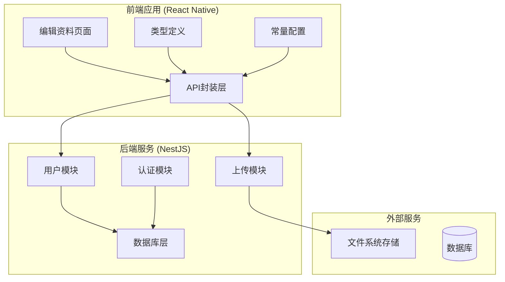
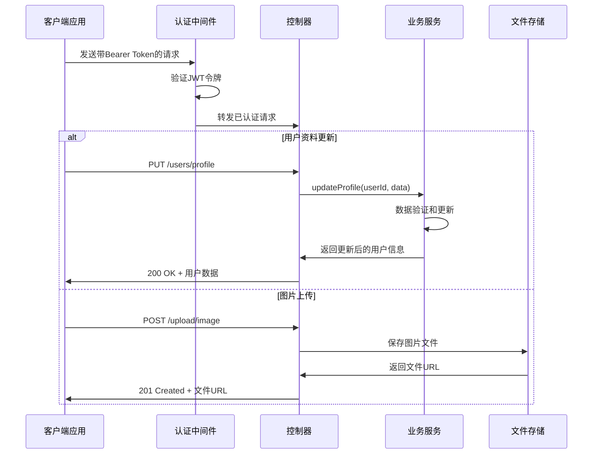
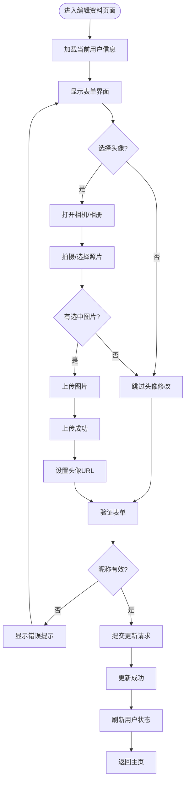
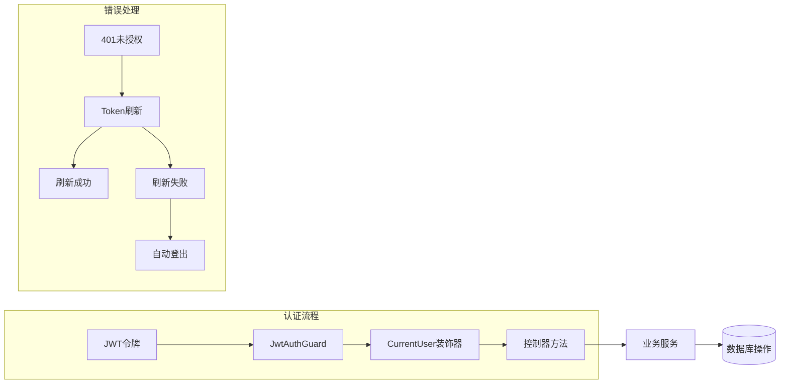
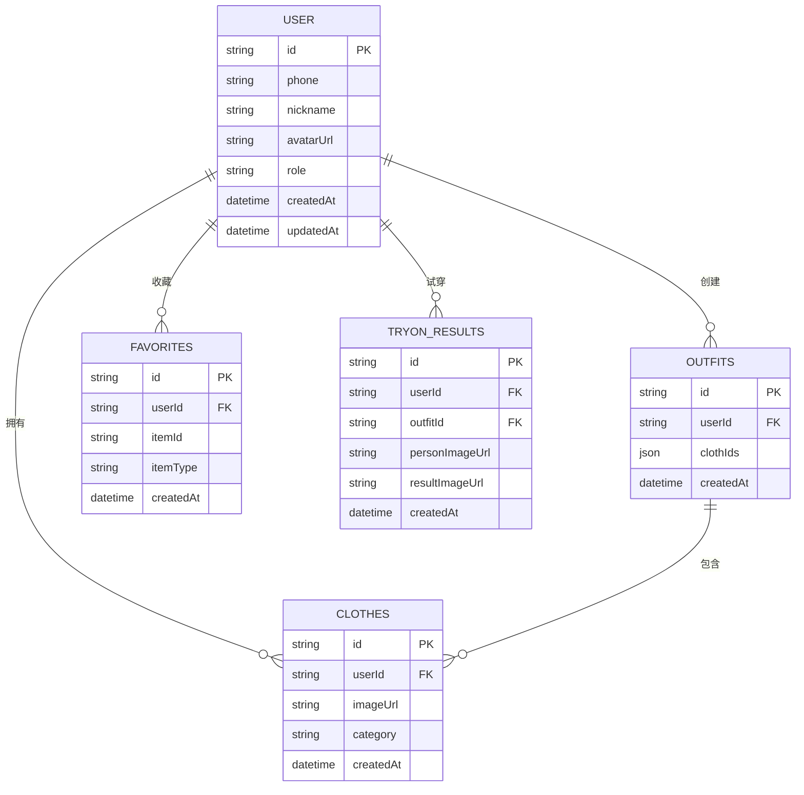

# 用户API

<cite>
**本文档引用的文件**
- [backend/src/modules/users/users.controller.ts](file://backend/src/modules/users/users.controller.ts)
- [backend/src/modules/users/users.service.ts](file://backend/src/modules/users/users.service.ts)
- [backend/src/modules/users/dto/update-profile.dto.ts](file://backend/src/modules/users/dto/update-profile.dto.ts)
- [backend/src/modules/upload/upload.controller.ts](file://backend/src/modules/upload/upload.controller.ts)
- [backend/src/modules/upload/upload.service.ts](file://backend/src/modules/upload/upload.service.ts)
- [backend/src/common/guards/jwt-auth.guard.ts](file://backend/src/common/guards/jwt-auth.guard.ts)
- [backend/src/common/decorators/current-user.decorator.ts](file://backend/src/common/decorators/current-user.decorator.ts)
- [backend/src/app.module.ts](file://backend/src/app.module.ts)
- [FreeDressApp/src/api/users.ts](file://FreeDressApp/src/api/users.ts)
- [FreeDressApp/src/api/upload.ts](file://FreeDressApp/src/api/upload.ts)
- [FreeDressApp/src/api/axios.ts](file://FreeDressApp/src/api/axios.ts)
- [FreeDressApp/src/screens/EditProfileScreen.tsx](file://FreeDressApp/src/screens/EditProfileScreen.tsx)
- [FreeDressApp/src/types/index.ts](file://FreeDressApp/src/types/index.ts)
- [FreeDressApp/src/constants/index.ts](file://FreeDressApp/src/constants/index.ts)
</cite>

## 目录
1. [简介](#简介)
2. [项目结构](#项目结构)
3. [核心组件](#核心组件)
4. [架构概览](#架构概览)
5. [详细组件分析](#详细组件分析)
6. [依赖关系分析](#依赖关系分析)
7. [性能考虑](#性能考虑)
8. [故障排除指南](#故障排除指南)
9. [结论](#结论)
10. [附录](#附录)

## 简介
本文件为畅搭(FreeDress)应用的用户API详细文档，专注于用户信息管理相关接口。内容涵盖用户资料更新、头像上传和个人信息修改等功能，详细说明每个API的请求参数、响应格式、数据验证规则以及错误处理机制。同时解释用户数据的同步机制和状态管理中的用户信息维护，并提供完整的使用示例和最佳实践建议。

## 项目结构
畅搭应用采用前后端分离架构，用户API主要分布在以下模块：



**图表来源**
- [backend/src/app.module.ts:13-31](file://backend/src/app.module.ts#L13-L31)
- [backend/src/modules/users/users.controller.ts:12-16](file://backend/src/modules/users/users.controller.ts#L12-L16)
- [backend/src/modules/upload/upload.controller.ts:28-31](file://backend/src/modules/upload/upload.controller.ts#L28-L31)

**章节来源**
- [backend/src/app.module.ts:1-33](file://backend/src/app.module.ts#L1-L33)
- [FreeDressApp/src/constants/index.ts:8-212](file://FreeDressApp/src/constants/index.ts#L8-L212)

## 核心组件
用户API系统由三个核心组件构成：

### 1. 用户控制器 (UsersController)
负责处理用户信息相关的HTTP请求，包括用户资料查询和更新功能。

### 2. 上传控制器 (UploadController)  
负责处理图片上传功能，支持多种图片格式和大小限制。

### 3. 用户服务 (UsersService)
实现用户业务逻辑，包括用户信息查询、更新和统计数据计算。

**章节来源**
- [backend/src/modules/users/users.controller.ts:1-49](file://backend/src/modules/users/users.controller.ts#L1-L49)
- [backend/src/modules/upload/upload.controller.ts:1-51](file://backend/src/modules/upload/upload.controller.ts#L1-L51)
- [backend/src/modules/users/users.service.ts:1-102](file://backend/src/modules/users/users.service.ts#L1-L102)

## 架构概览
用户API采用RESTful架构设计，结合JWT认证和文件上传功能：



**图表来源**
- [backend/src/common/guards/jwt-auth.guard.ts:8-21](file://backend/src/common/guards/jwt-auth.guard.ts#L8-L21)
- [backend/src/modules/users/users.controller.ts:22-38](file://backend/src/modules/users/users.controller.ts#L22-L38)
- [backend/src/modules/upload/upload.controller.ts:33-49](file://backend/src/modules/upload/upload.controller.ts#L33-L49)

## 详细组件分析

### 用户资料管理API

#### 获取用户信息接口
**接口定义**
- 方法: GET
- 路径: `/api/users/profile`
- 认证: 需要Bearer Token

**请求参数**
- 无查询参数
- 认证信息通过Authorization头部传递

**响应格式**
```typescript
{
  code: number,
  message: string,
  data: {
    id: string,
    phone: string,
    nickname: string,
    avatarUrl?: string,
    role: 'USER' | 'VIP',
    createdAt: string,
    updatedAt: string,
    _count: {
      clothes: number,
      outfits: number,
      favorites: number
    }
  },
  timestamp: string
}
```

**数据验证规则**
- 所有字段均为必填
- 用户ID为UUID格式
- 角色枚举值为'USER'或'VIP'
- 创建和更新时间遵循ISO 8601格式

**章节来源**
- [backend/src/modules/users/users.controller.ts:22-26](file://backend/src/modules/users/users.controller.ts#L22-L26)
- [backend/src/modules/users/users.service.ts:18-44](file://backend/src/modules/users/users.service.ts#L18-L44)
- [FreeDressApp/src/api/users.ts:19-21](file://FreeDressApp/src/api/users.ts#L19-L21)

#### 更新用户资料接口
**接口定义**
- 方法: PUT
- 路径: `/api/users/profile`
- 认证: 需要Bearer Token

**请求参数**
```typescript
{
  nickname?: string,
  avatarUrl?: string
}
```

**请求验证规则**
- nickname参数
  - 类型: string
  - 长度: 1-20个字符
  - 必填: 否
- avatarUrl参数
  - 类型: string
  - 格式: 有效的URL地址
  - 必填: 否

**响应格式**
与获取用户信息接口相同，但返回更新后的数据。

**章节来源**
- [backend/src/modules/users/users.controller.ts:31-38](file://backend/src/modules/users/users.controller.ts#L31-L38)
- [backend/src/modules/users/users.service.ts:52-68](file://backend/src/modules/users/users.service.ts#L52-L68)
- [backend/src/modules/users/dto/update-profile.dto.ts:7-18](file://backend/src/modules/users/dto/update-profile.dto.ts#L7-L18)
- [FreeDressApp/src/api/users.ts:23-27](file://FreeDressApp/src/api/users.ts#L23-L27)

#### 获取用户统计接口
**接口定义**
- 方法: GET
- 路径: `/api/users/stats`
- 认证: 需要Bearer Token

**请求参数**
- 无查询参数

**响应格式**
```typescript
{
  clothesCount: number,
  outfitsCount: number,
  favoritesCount: number,
  tryOnCount: number
}
```

**章节来源**
- [backend/src/modules/users/users.controller.ts:43-47](file://backend/src/modules/users/users.controller.ts#L43-L47)
- [backend/src/modules/users/users.service.ts:75-100](file://backend/src/modules/users/users.service.ts#L75-L100)

### 图片上传API

#### 图片上传接口
**接口定义**
- 方法: POST
- 路径: `/api/upload/image`
- 认证: 需要Bearer Token
- 内容类型: multipart/form-data

**请求参数**
- 文件字段: `file` (二进制文件流)

**文件验证规则**
- 支持格式: JPG, PNG, WebP, GIF
- 最大文件大小: 10MB
- 文件名处理: 自动生成唯一文件名

**响应格式**
```typescript
{
  code: number,
  message: string,
  data: {
    url: string
  },
  timestamp: string
}
```

**文件存储机制**
- 存储位置: 服务器根目录下的`uploads`文件夹
- 访问路径: 通过`/uploads`路由公开访问
- 文件命名: 使用UUID确保唯一性

**章节来源**
- [backend/src/modules/upload/upload.controller.ts:33-49](file://backend/src/modules/upload/upload.controller.ts#L33-L49)
- [backend/src/modules/upload/upload.service.ts:25-47](file://backend/src/modules/upload/upload.service.ts#L25-L47)
- [FreeDressApp/src/api/upload.ts:4-20](file://FreeDressApp/src/api/upload.ts#L4-L20)

### 前端集成组件

#### 编辑资料页面流程


**图表来源**
- [FreeDressApp/src/screens/EditProfileScreen.tsx:49-77](file://FreeDressApp/src/screens/EditProfileScreen.tsx#L49-L77)
- [FreeDressApp/src/api/upload.ts:4-20](file://FreeDressApp/src/api/upload.ts#L4-L20)

**章节来源**
- [FreeDressApp/src/screens/EditProfileScreen.tsx:1-186](file://FreeDressApp/src/screens/EditProfileScreen.tsx#L1-L186)

## 依赖关系分析

### 认证和授权机制


**图表来源**
- [backend/src/common/guards/jwt-auth.guard.ts:8-21](file://backend/src/common/guards/jwt-auth.guard.ts#L8-L21)
- [backend/src/common/decorators/current-user.decorator.ts:7-15](file://backend/src/common/decorators/current-user.decorator.ts#L7-L15)
- [FreeDressApp/src/api/axios.ts:54-98](file://FreeDressApp/src/api/axios.ts#L54-L98)

### 数据流图


**图表来源**
- [backend/src/modules/users/users.service.ts:18-44](file://backend/src/modules/users/users.service.ts#L18-L44)
- [backend/src/modules/users/users.service.ts:75-100](file://backend/src/modules/users/users.service.ts#L75-L100)

**章节来源**
- [backend/src/common/guards/jwt-auth.guard.ts:1-22](file://backend/src/common/guards/jwt-auth.guard.ts#L1-L22)
- [backend/src/common/decorators/current-user.decorator.ts:1-16](file://backend/src/common/decorators/current-user.decorator.ts#L1-L16)

## 性能考虑

### 文件上传优化
- **并发控制**: 建议限制同时进行的上传任务数量
- **进度反馈**: 实现上传进度监控，提升用户体验
- **断点续传**: 对于大文件可考虑实现断点续传功能
- **缓存策略**: 已启用静态文件服务，可进一步优化CDN配置

### 数据库查询优化
- **字段选择**: 使用select精确指定需要的字段，避免不必要的数据传输
- **索引优化**: 确保用户ID、手机号等常用查询字段有适当索引
- **连接池**: 合理配置Prisma连接池大小

### 前端性能优化
- **状态缓存**: 在Redux/Zustand中缓存用户数据，减少重复请求
- **懒加载**: 对于统计信息可采用懒加载方式
- **防抖处理**: 输入验证可加入防抖机制

## 故障排除指南

### 常见错误及解决方案

#### 认证相关错误
- **401 未授权**: 检查Token是否过期，尝试自动刷新或重新登录
- **403 禁止访问**: 确认用户权限和JWT令牌有效性
- **Token刷新失败**: 清除本地存储的Token并引导用户重新登录

#### 文件上传错误
- **格式不支持**: 确认图片格式为JPG/PNG/WebP/GIF之一
- **文件过大**: 文件大小不应超过10MB
- **上传失败**: 检查服务器磁盘空间和权限设置

#### 数据验证错误
- **昵称长度不符**: 昵称长度必须在1-20个字符之间
- **URL格式错误**: 确保头像URL为有效的HTTP/HTTPS地址
- **用户不存在**: 检查用户ID的有效性和数据库连接

**章节来源**
- [FreeDressApp/src/api/axios.ts:54-104](file://FreeDressApp/src/api/axios.ts#L54-L104)
- [backend/src/modules/upload/upload.service.ts:25-47](file://backend/src/modules/upload/upload.service.ts#L25-L47)
- [backend/src/modules/users/dto/update-profile.dto.ts:7-18](file://backend/src/modules/users/dto/update-profile.dto.ts#L7-L18)

## 结论
畅搭应用的用户API系统采用清晰的分层架构设计，实现了完整的用户信息管理和文件上传功能。系统具备完善的认证授权机制、数据验证规则和错误处理流程。通过前后端分离的设计模式，用户API既保证了安全性，又提供了良好的扩展性。建议在生产环境中进一步完善文件上传的并发控制、缓存策略和监控告警机制。

## 附录

### API使用示例

#### 基本使用流程
```javascript
// 1. 获取用户信息
const userProfile = await getUserProfile();

// 2. 上传头像（可选）
let avatarUrl = user.avatarUrl;
if (selectedImage) {
  const uploadResult = await uploadImage(selectedImage);
  avatarUrl = uploadResult.data.url;
}

// 3. 更新用户资料
const updateResult = await updateUserProfile({
  nickname: trimmedNickname,
  avatarUrl
});

// 4. 更新本地状态
updateUser(updateResult.data);
```

#### 错误处理最佳实践
```javascript
try {
  const result = await updateUserProfile(userData);
  // 处理成功响应
} catch (error) {
  // 显示用户友好的错误消息
  Alert.alert('操作失败', error.message);
  // 记录错误日志用于调试
  console.error('用户资料更新失败:', error);
}
```

### 数据模型定义
用户相关的核心数据模型包括：

**用户信息模型**
- id: 用户唯一标识符
- phone: 用户手机号码
- nickname: 用户昵称
- avatarUrl: 头像图片URL
- role: 用户角色类型
- createdAt: 创建时间
- updatedAt: 更新时间

**统计信息模型**
- clothesCount: 衣物数量
- outfitsCount: 搭配数量
- favoritesCount: 收藏数量
- tryOnCount: 试穿次数

**章节来源**
- [FreeDressApp/src/types/index.ts:8-16](file://FreeDressApp/src/types/index.ts#L8-L16)
- [FreeDressApp/src/types/index.ts:11-16](file://FreeDressApp/src/types/index.ts#L11-L16)
- [FreeDressApp/src/types/index.ts:58-64](file://FreeDressApp/src/types/index.ts#L58-L64)