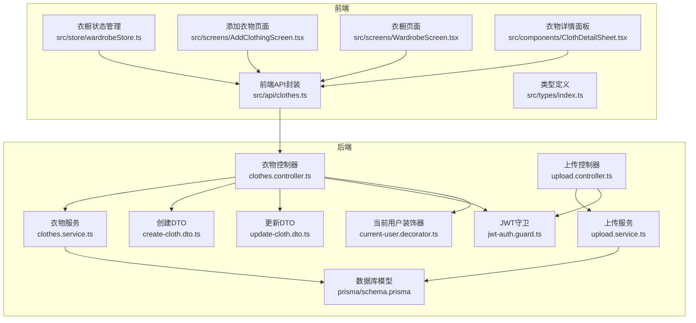
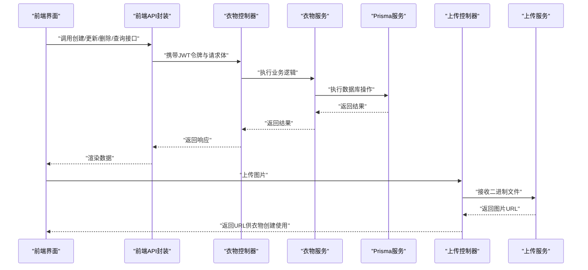
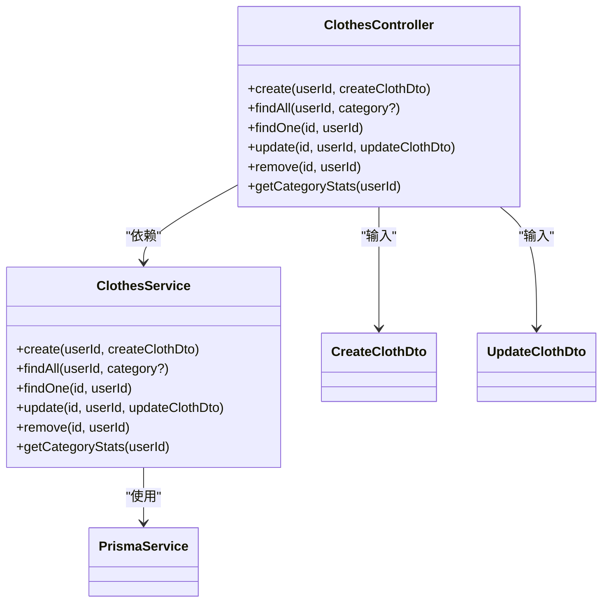
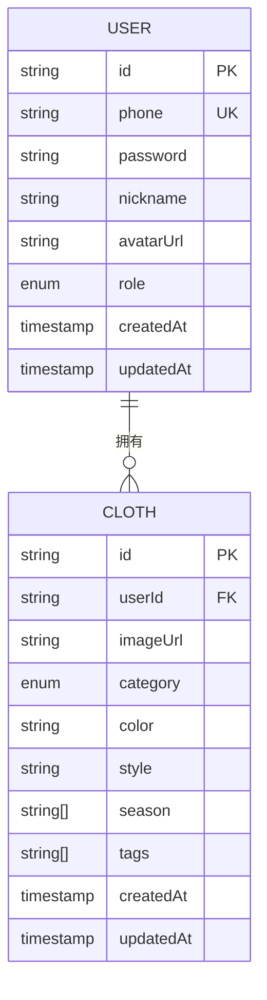
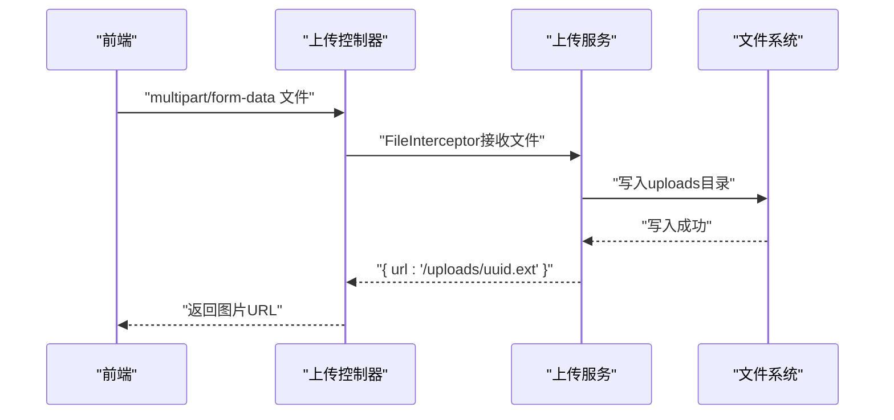
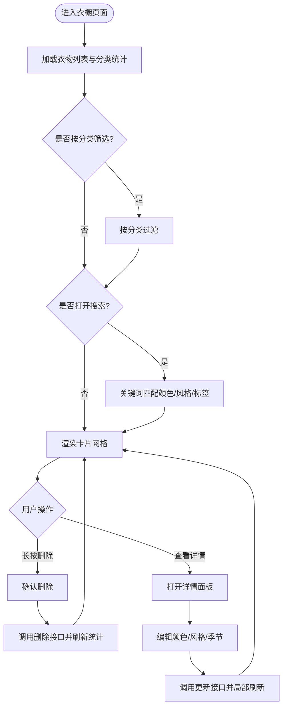
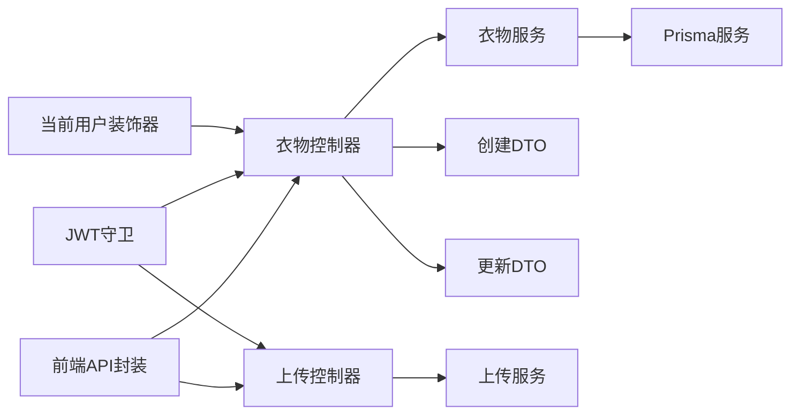

# 衣物API

<cite>
**本文引用的文件**
- [backend/src/modules/clothes/clothes.controller.ts](file://backend/src/modules/clothes/clothes.controller.ts)
- [backend/src/modules/clothes/clothes.service.ts](file://backend/src/modules/clothes/clothes.service.ts)
- [backend/src/modules/clothes/dto/create-cloth.dto.ts](file://backend/src/modules/clothes/dto/create-cloth.dto.ts)
- [backend/src/modules/clothes/dto/update-cloth.dto.ts](file://backend/src/modules/clothes/dto/update-cloth.dto.ts)
- [backend/src/modules/upload/upload.controller.ts](file://backend/src/modules/upload/upload.controller.ts)
- [backend/src/modules/upload/upload.service.ts](file://backend/src/modules/upload/upload.service.ts)
- [backend/prisma/schema.prisma](file://backend/prisma/schema.prisma)
- [backend/src/common/guards/jwt-auth.guard.ts](file://backend/src/common/guards/jwt-auth.guard.ts)
- [backend/src/common/decorators/current-user.decorator.ts](file://backend/src/common/decorators/current-user.decorator.ts)
- [FreeDressApp/src/api/clothes.ts](file://FreeDressApp/src/api/clothes.ts)
- [FreeDressApp/src/types/index.ts](file://FreeDressApp/src/types/index.ts)
- [FreeDressApp/src/store/wardrobeStore.ts](file://FreeDressApp/src/store/wardrobeStore.ts)
- [FreeDressApp/src/screes/AddClothingScreen.tsx](file://FreeDressApp/src/screens/AddClothingScreen.tsx)
- [FreeDressApp/src/screes/WardrobeScreen.tsx](file://FreeDressApp/src/screens/WardrobeScreen.tsx)
- [FreeDressApp/src/components/ClothDetailSheet.tsx](file://FreeDressApp/src/components/ClothDetailSheet.tsx)
</cite>

## 目录
1. [简介](#简介)
2. [项目结构](#项目结构)
3. [核心组件](#核心组件)
4. [架构总览](#架构总览)
5. [详细组件分析](#详细组件分析)
6. [依赖分析](#依赖分析)
7. [性能考虑](#性能考虑)
8. [故障排查指南](#故障排查指南)
9. [结论](#结论)
10. [附录](#附录)

## 简介
本文件为畅搭(FreeDress)应用的衣物API文档，覆盖衣物管理的完整CRUD流程与图片上传处理，包括：
- 衣物添加：支持图片上传、分类、颜色、风格、适用季节、标签等属性
- 衣物编辑：按需更新部分字段
- 衣物删除：软/硬删除策略与权限校验
- 衣物查询：列表、详情、按分类筛选、关键词搜索与多条件过滤
- 分类统计：按衣物分类统计数量
- 数据验证与错误处理：DTO校验、鉴权守卫、权限拦截与统一异常处理

## 项目结构
后端采用NestJS模块化架构，衣物相关能力集中在clothes模块；图片上传独立为upload模块；前端通过Axios封装HTTP客户端调用后端接口，并使用Zustand状态管理维护衣橱数据。

**图表来源**
- [backend/src/modules/clothes/clothes.controller.ts:24-101](file://backend/src/modules/clothes/clothes.controller.ts#L24-L101)
- [backend/src/modules/clothes/clothes.service.ts:11-147](file://backend/src/modules/clothes/clothes.service.ts#L11-L147)
- [backend/src/modules/upload/upload.controller.ts:28-49](file://backend/src/modules/upload/upload.controller.ts#L28-L49)
- [backend/src/modules/upload/upload.service.ts:15-48](file://backend/src/modules/upload/upload.service.ts#L15-L48)
- [backend/prisma/schema.prisma:39-68](file://backend/prisma/schema.prisma#L39-L68)
- [backend/src/common/guards/jwt-auth.guard.ts:8-21](file://backend/src/common/guards/jwt-auth.guard.ts#L8-L21)
- [backend/src/common/decorators/current-user.decorator.ts:7-15](file://backend/src/common/decorators/current-user.decorator.ts#L7-L15)
- [FreeDressApp/src/api/clothes.ts:1-54](file://FreeDressApp/src/api/clothes.ts#L1-L54)
- [FreeDressApp/src/types/index.ts:18-33](file://FreeDressApp/src/types/index.ts#L18-L33)
- [FreeDressApp/src/store/wardrobeStore.ts:21-82](file://FreeDressApp/src/store/wardrobeStore.ts#L21-L82)

**章节来源**
- [backend/src/modules/clothes/clothes.controller.ts:24-101](file://backend/src/modules/clothes/clothes.controller.ts#L24-L101)
- [backend/src/modules/clothes/clothes.service.ts:11-147](file://backend/src/modules/clothes/clothes.service.ts#L11-L147)
- [backend/src/modules/upload/upload.controller.ts:28-49](file://backend/src/modules/upload/upload.controller.ts#L28-L49)
- [backend/src/modules/upload/upload.service.ts:15-48](file://backend/src/modules/upload/upload.service.ts#L15-L48)
- [backend/prisma/schema.prisma:39-68](file://backend/prisma/schema.prisma#L39-L68)
- [FreeDressApp/src/api/clothes.ts:1-54](file://FreeDressApp/src/api/clothes.ts#L1-L54)
- [FreeDressApp/src/types/index.ts:18-33](file://FreeDressApp/src/types/index.ts#L18-L33)
- [FreeDressApp/src/store/wardrobeStore.ts:21-82](file://FreeDressApp/src/store/wardrobeStore.ts#L21-L82)

## 核心组件
- 衣物控制器：暴露REST接口，负责鉴权、参数解析与调用服务层
- 衣物服务：实现业务逻辑，包括权限校验、数据查询与聚合统计
- DTO：定义创建与更新请求的数据结构与校验规则
- 上传控制器与服务：处理图片二进制上传、格式与大小限制、落盘与URL返回
- 前端API封装：统一HTTP调用、参数拼装与响应解包
- 类型系统：前后端一致的衣物与分类类型定义
- 状态管理：Zustand集中管理衣橱列表、分类统计与加载状态

**章节来源**
- [backend/src/modules/clothes/clothes.controller.ts:24-101](file://backend/src/modules/clothes/clothes.controller.ts#L24-L101)
- [backend/src/modules/clothes/clothes.service.ts:11-147](file://backend/src/modules/clothes/clothes.service.ts#L11-L147)
- [backend/src/modules/clothes/dto/create-cloth.dto.ts:8-42](file://backend/src/modules/clothes/dto/create-cloth.dto.ts#L8-L42)
- [backend/src/modules/clothes/dto/update-cloth.dto.ts:8-9](file://backend/src/modules/clothes/dto/update-cloth.dto.ts#L8-L9)
- [backend/src/modules/upload/upload.controller.ts:28-49](file://backend/src/modules/upload/upload.controller.ts#L28-L49)
- [backend/src/modules/upload/upload.service.ts:15-48](file://backend/src/modules/upload/upload.service.ts#L15-L48)
- [FreeDressApp/src/api/clothes.ts:1-54](file://FreeDressApp/src/api/clothes.ts#L1-L54)
- [FreeDressApp/src/types/index.ts:18-33](file://FreeDressApp/src/types/index.ts#L18-L33)
- [FreeDressApp/src/store/wardrobeStore.ts:21-82](file://FreeDressApp/src/store/wardrobeStore.ts#L21-L82)

## 架构总览
后端采用“控制器-服务-数据访问”的分层设计，前端通过Axios客户端发起请求，后端通过JWT守卫进行鉴权，使用Prisma ORM访问PostgreSQL数据库。

**图表来源**
- [backend/src/modules/clothes/clothes.controller.ts:34-91](file://backend/src/modules/clothes/clothes.controller.ts#L34-L91)
- [backend/src/modules/clothes/clothes.service.ts:21-116](file://backend/src/modules/clothes/clothes.service.ts#L21-L116)
- [backend/src/modules/upload/upload.controller.ts:33-49](file://backend/src/modules/upload/upload.controller.ts#L33-L49)
- [backend/src/modules/upload/upload.service.ts:25-47](file://backend/src/modules/upload/upload.service.ts#L25-L47)
- [FreeDressApp/src/api/clothes.ts:30-53](file://FreeDressApp/src/api/clothes.ts#L30-L53)

## 详细组件分析

### 衣物控制器与服务
- 接口职责清晰：创建、列表、详情、更新、删除、分类统计
- 权限控制：基于JWT守卫与当前用户装饰器，确保用户只能操作自己的衣物
- 查询增强：支持按分类筛选；详情查询时包含搭配关联信息
- 统计聚合：按分类统计数量，便于前端展示仪表盘

**图表来源**
- [backend/src/modules/clothes/clothes.controller.ts:24-101](file://backend/src/modules/clothes/clothes.controller.ts#L24-L101)
- [backend/src/modules/clothes/clothes.service.ts:11-147](file://backend/src/modules/clothes/clothes.service.ts#L11-L147)
- [backend/src/modules/clothes/dto/create-cloth.dto.ts:8-42](file://backend/src/modules/clothes/dto/create-cloth.dto.ts#L8-L42)
- [backend/src/modules/clothes/dto/update-cloth.dto.ts:8-9](file://backend/src/modules/clothes/dto/update-cloth.dto.ts#L8-L9)

**章节来源**
- [backend/src/modules/clothes/clothes.controller.ts:24-101](file://backend/src/modules/clothes/clothes.controller.ts#L24-L101)
- [backend/src/modules/clothes/clothes.service.ts:11-147](file://backend/src/modules/clothes/clothes.service.ts#L11-L147)

### DTO与数据模型
- CreateClothDto：定义创建衣物的必填与可选字段，含分类枚举校验
- UpdateClothDto：继承创建DTO，使所有字段变为可选
- Prisma模型：定义Cloth实体、分类枚举、索引与外键关系

**图表来源**
- [backend/prisma/schema.prisma:14-59](file://backend/prisma/schema.prisma#L14-L59)
- [backend/src/modules/clothes/dto/create-cloth.dto.ts:8-42](file://backend/src/modules/clothes/dto/create-cloth.dto.ts#L8-L42)
- [backend/src/modules/clothes/dto/update-cloth.dto.ts:8-9](file://backend/src/modules/clothes/dto/update-cloth.dto.ts#L8-L9)

**章节来源**
- [backend/src/modules/clothes/dto/create-cloth.dto.ts:8-42](file://backend/src/modules/clothes/dto/create-cloth.dto.ts#L8-L42)
- [backend/src/modules/clothes/dto/update-cloth.dto.ts:8-9](file://backend/src/modules/clothes/dto/update-cloth.dto.ts#L8-L9)
- [backend/prisma/schema.prisma:39-68](file://backend/prisma/schema.prisma#L39-L68)

### 图片上传处理
- 接口：POST /upload/image，支持JPG/PNG/WebP/GIF，最大10MB
- 服务：生成UUID文件名，写入本地uploads目录，返回相对URL
- 前端：在添加衣物前先上传图片，再将返回的URL提交给衣物创建接口

**图表来源**
- [backend/src/modules/upload/upload.controller.ts:33-49](file://backend/src/modules/upload/upload.controller.ts#L33-L49)
- [backend/src/modules/upload/upload.service.ts:25-47](file://backend/src/modules/upload/upload.service.ts#L25-L47)

**章节来源**
- [backend/src/modules/upload/upload.controller.ts:28-49](file://backend/src/modules/upload/upload.controller.ts#L28-L49)
- [backend/src/modules/upload/upload.service.ts:15-48](file://backend/src/modules/upload/upload.service.ts#L15-L48)

### 前端集成与状态管理
- API封装：提供创建、查询、更新、删除、分类统计等方法
- 类型定义：统一的Cloth与ClothCategory类型
- 状态管理：Zustand集中管理衣物列表、分类统计、加载状态与活跃分类
- UI组件：添加衣物页面负责图片选择与上传，衣橱页面支持分类筛选与关键词搜索，详情面板支持编辑与删除

**图表来源**
- [FreeDressApp/src/store/wardrobeStore.ts:43-81](file://FreeDressApp/src/store/wardrobeStore.ts#L43-L81)
- [FreeDressApp/src/screens/WardrobeScreen.tsx:61-76](file://FreeDressApp/src/screens/WardrobeScreen.tsx#L61-L76)
- [FreeDressApp/src/components/ClothDetailSheet.tsx:54-68](file://FreeDressApp/src/components/ClothDetailSheet.tsx#L54-L68)

**章节来源**
- [FreeDressApp/src/api/clothes.ts:1-54](file://FreeDressApp/src/api/clothes.ts#L1-L54)
- [FreeDressApp/src/types/index.ts:18-33](file://FreeDressApp/src/types/index.ts#L18-L33)
- [FreeDressApp/src/store/wardrobeStore.ts:21-82](file://FreeDressApp/src/store/wardrobeStore.ts#L21-L82)
- [FreeDressApp/src/screens/WardrobeScreen.tsx:61-76](file://FreeDressApp/src/screens/WardrobeScreen.tsx#L61-L76)
- [FreeDressApp/src/components/ClothDetailSheet.tsx:29-86](file://FreeDressApp/src/components/ClothDetailSheet.tsx#L29-L86)

## 依赖分析
- 控制器依赖服务与DTO，服务依赖Prisma进行数据访问
- 上传控制器依赖上传服务，受JWT守卫保护
- 前端API封装依赖Axios客户端，类型定义前后端共享
- 状态管理依赖Zustand，UI组件依赖状态与API封装

**图表来源**
- [backend/src/modules/clothes/clothes.controller.ts:24-101](file://backend/src/modules/clothes/clothes.controller.ts#L24-L101)
- [backend/src/modules/clothes/clothes.service.ts:11-147](file://backend/src/modules/clothes/clothes.service.ts#L11-L147)
- [backend/src/modules/upload/upload.controller.ts:28-49](file://backend/src/modules/upload/upload.controller.ts#L28-L49)
- [backend/src/common/guards/jwt-auth.guard.ts:8-21](file://backend/src/common/guards/jwt-auth.guard.ts#L8-L21)
- [backend/src/common/decorators/current-user.decorator.ts:7-15](file://backend/src/common/decorators/current-user.decorator.ts#L7-L15)
- [FreeDressApp/src/api/clothes.ts:1-54](file://FreeDressApp/src/api/clothes.ts#L1-L54)

**章节来源**
- [backend/src/modules/clothes/clothes.controller.ts:24-101](file://backend/src/modules/clothes/clothes.controller.ts#L24-L101)
- [backend/src/modules/upload/upload.controller.ts:28-49](file://backend/src/modules/upload/upload.controller.ts#L28-L49)
- [backend/src/common/guards/jwt-auth.guard.ts:8-21](file://backend/src/common/guards/jwt-auth.guard.ts#L8-L21)
- [backend/src/common/decorators/current-user.decorator.ts:7-15](file://backend/src/common/decorators/current-user.decorator.ts#L7-L15)
- [FreeDressApp/src/api/clothes.ts:1-54](file://FreeDressApp/src/api/clothes.ts#L1-L54)

## 性能考虑
- 数据库索引：Cloth模型对userId与category建立索引，提升查询与分组统计效率
- 查询排序：默认按创建时间倒序，利于前端首屏展示最新衣物
- 分页建议：当前实现未分页，建议在衣物量增长后引入分页参数(limit/offset或游标)
- 缓存策略：分类统计可短期缓存，结合Zustand状态减少重复请求
- 图片优化：上传服务限制大小与格式，建议前端压缩图片尺寸后再上传
- 并发控制：批量操作时避免频繁触发刷新，采用批处理或延迟合并

**章节来源**
- [backend/prisma/schema.prisma:56-58](file://backend/prisma/schema.prisma#L56-L58)
- [backend/src/modules/clothes/clothes.service.ts:38-51](file://backend/src/modules/clothes/clothes.service.ts#L38-L51)
- [backend/src/modules/upload/upload.service.ts:30-38](file://backend/src/modules/upload/upload.service.ts#L30-L38)

## 故障排查指南
- 未登录或令牌失效：JWT守卫会抛出未授权异常，前端需引导重新登录
- 无权访问：服务层在详情查询时校验衣物归属，若非本人衣物将拒绝访问
- 参数校验失败：DTO使用class-validator进行字段与枚举校验，错误信息需在前端友好提示
- 上传失败：检查文件类型与大小限制，确认上传目录存在且可写
- 空数据与网络异常：前端状态管理中已捕获异常并记录日志，建议增加Toast或Alert反馈

**章节来源**
- [backend/src/common/guards/jwt-auth.guard.ts:14-20](file://backend/src/common/guards/jwt-auth.guard.ts#L14-L20)
- [backend/src/modules/clothes/clothes.service.ts:75-78](file://backend/src/modules/clothes/clothes.service.ts#L75-L78)
- [backend/src/modules/clothes/dto/create-cloth.dto.ts:10-11](file://backend/src/modules/clothes/dto/create-cloth.dto.ts#L10-L11)
- [backend/src/modules/upload/upload.service.ts:26-38](file://backend/src/modules/upload/upload.service.ts#L26-L38)
- [FreeDressApp/src/store/wardrobeStore.ts:48-51](file://FreeDressApp/src/store/wardrobeStore.ts#L48-L51)

## 结论
衣物API围绕“鉴权+DTO校验+服务层业务+Prisma数据访问”构建，具备完善的CRUD能力与图片上传支持。前端通过状态管理与UI组件实现流畅的用户体验，建议后续引入分页、缓存与图片压缩等优化措施，持续提升性能与稳定性。

## 附录

### API一览与最佳实践
- 创建衣物
  - 方法与路径：POST /clothes
  - 请求头：Authorization: Bearer <token>
  - 请求体字段：imageUrl、category、color、style、season、tags
  - 最佳实践：先上传图片获取URL，再提交衣物创建
- 获取衣物列表
  - 方法与路径：GET /clothes
  - 查询参数：category（可选）
  - 返回：衣物数组（按创建时间倒序）
- 获取衣物详情
  - 方法与路径：GET /clothes/:id
  - 返回：衣物详情（包含搭配关联）
  - 权限：仅本人可查看
- 更新衣物
  - 方法与路径：PUT /clothes/:id
  - 请求体：部分字段（如color、style、season）
  - 权限：仅本人可更新
- 删除衣物
  - 方法与路径：DELETE /clothes/:id
  - 权限：仅本人可删除
- 分类统计
  - 方法与路径：GET /clothes/stats/categories
  - 返回：各分类数量统计对象

**章节来源**
- [backend/src/modules/clothes/clothes.controller.ts:34-100](file://backend/src/modules/clothes/clothes.controller.ts#L34-L100)
- [backend/src/modules/clothes/clothes.service.ts:21-146](file://backend/src/modules/clothes/clothes.service.ts#L21-L146)
- [FreeDressApp/src/api/clothes.ts:30-53](file://FreeDressApp/src/api/clothes.ts#L30-L53)

### 数据验证与错误处理清单
- DTO校验
  - 必填字段：imageUrl、category
  - 枚举校验：category必须为TOP/BOTTOM/COAT/ACCESSORY/SHOE之一
  - 数组字段：season、tags需为数组或省略
- 服务层异常
  - 未找到：抛出404
  - 无权限：抛出403
  - 上传异常：抛出400（格式/大小限制）
- 前端处理
  - 捕获异常并提示用户
  - 局部刷新列表与统计

**章节来源**
- [backend/src/modules/clothes/dto/create-cloth.dto.ts:10-21](file://backend/src/modules/clothes/dto/create-cloth.dto.ts#L10-L21)
- [backend/src/modules/clothes/clothes.service.ts:71-78](file://backend/src/modules/clothes/clothes.service.ts#L71-L78)
- [backend/src/modules/upload/upload.service.ts:30-38](file://backend/src/modules/upload/upload.service.ts#L30-L38)
- [FreeDressApp/src/store/wardrobeStore.ts:48-51](file://FreeDressApp/src/store/wardrobeStore.ts#L48-L51)