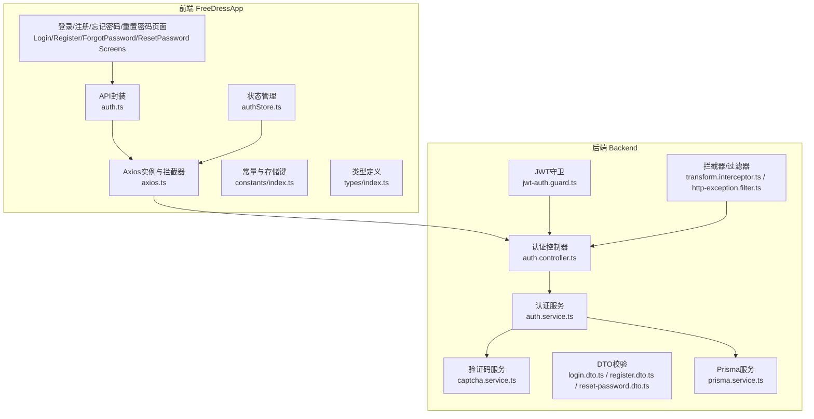
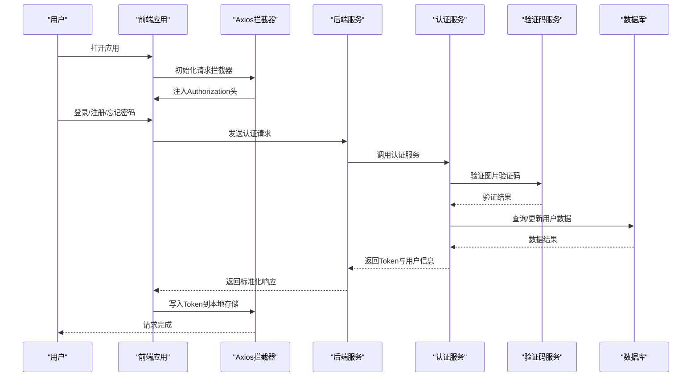
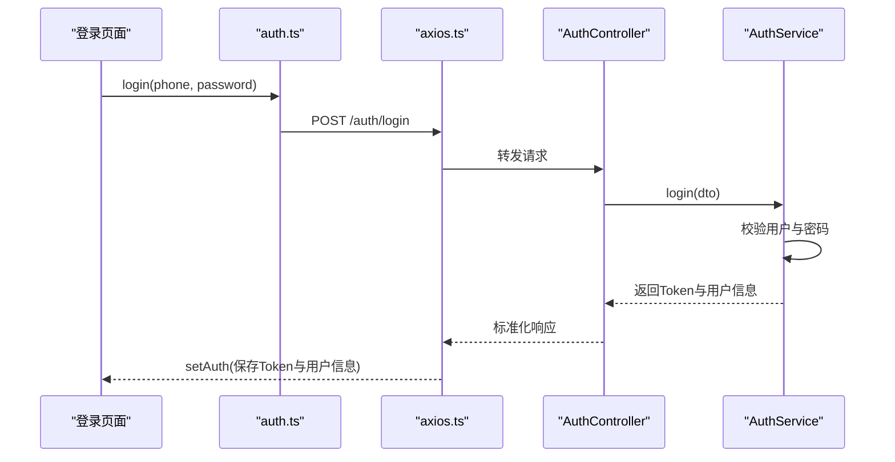
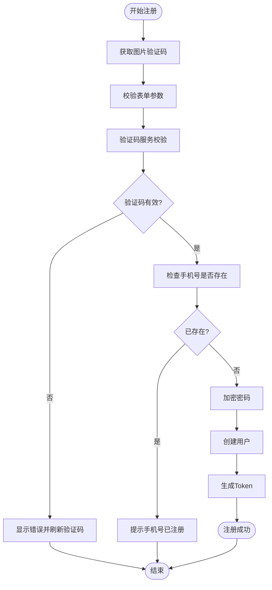
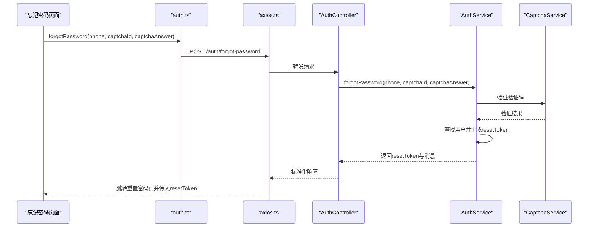
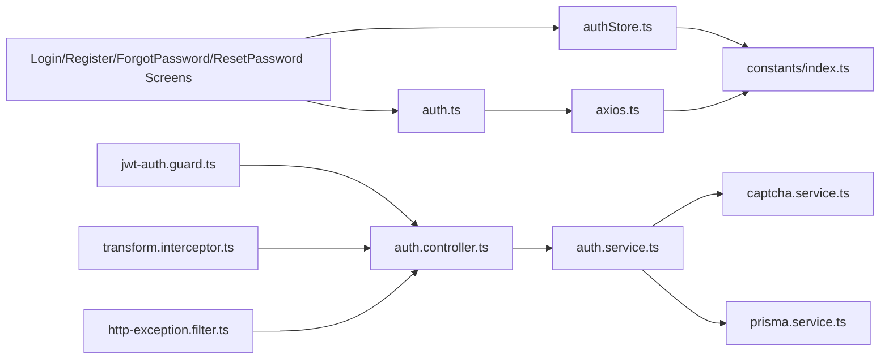

# 认证API

<cite>
**本文档引用的文件**
- [FreeDressApp/src/api/auth.ts](file://FreeDressApp/src/api/auth.ts)
- [FreeDressApp/src/api/axios.ts](file://FreeDressApp/src/api/axios.ts)
- [FreeDressApp/src/store/authStore.ts](file://FreeDressApp/src/store/authStore.ts)
- [FreeDressApp/src/constants/index.ts](file://FreeDressApp/src/constants/index.ts)
- [FreeDressApp/src/types/index.ts](file://FreeDressApp/src/types/index.ts)
- [FreeDressApp/src/schemas/auth.schemas.ts](file://FreeDressApp/src/schemas/auth.schemas.ts)
- [FreeDressApp/src/schemas/axios.schemas.ts](file://FreeDressApp/src/schemas/axios.schemas.ts)
- [FreeDressApp/src/schemas/authStore.schemas.ts](file://FreeDressApp/src/schemas/authStore.schemas.ts)
- [FreeDressApp/src/schemas/constants.schemas.ts](file://FreeDressApp/src/schemas/constants.schemas.ts)
- [FreeDressApp/src/schemas/types.schemas.ts](file://FreeDressApp/src/schemas/types.schemas.ts)
- [backend/src/modules/auth/auth.controller.ts](file://backend/src/modules/auth/auth.controller.ts)
- [backend/src/modules/auth/auth.service.ts](file://backend/src/modules/auth/auth.service.ts)
- [backend/src/modules/auth/captcha.service.ts](file://backend/src/modules/auth/captcha.service.ts)
- [backend/src/modules/auth/dto/login.dto.ts](file://backend/src/modules/auth/dto/login.dto.ts)
- [backend/src/modules/auth/dto/register.dto.ts](file://backend/src/modules/auth/dto/register.dto.ts)
- [backend/src/modules/auth/dto/reset-password.dto.ts](file://backend/src/modules/auth/dto/reset-password.dto.ts)
- [backend/src/common/guards/jwt-auth.guard.ts](file://backend/src/common/guards/jwt-auth.guard.ts)
- [backend/src/common/interceptors/transform.interceptor.ts](file://backend/src/common/interceptors/transform.interceptor.ts)
- [backend/src/common/decorators/current-user.decorator.ts](file://backend/src/common/decorators/current-user.decorator.ts)
- [backend/src/common/filters/http-exception.filter.ts](file://backend/src/common/filters/http-exception.filter.ts)
- [backend/src/prisma/prisma.service.ts](file://backend/src/prisma/prisma.service.ts)
- [backend/src/prisma/schema.prisma](file://backend/src/prisma/schema.prisma)
- [backend/src/app.module.ts](file://backend/src/app.module.ts)
- [backend/src/main.ts](file://backend/src/main.ts)
- [FreeDressApp/src/screens/LoginScreen.tsx](file://FreeDressApp/src/screens/LoginScreen.tsx)
- [FreeDressApp/src/screens/RegisterScreen.tsx](file://FreeDressApp/src/screens/RegisterScreen.tsx)
- [FreeDressApp/src/screens/ForgotPasswordScreen.tsx](file://FreeDressApp/src/screens/ForgotPasswordScreen.tsx)
- [FreeDressApp/src/screens/ResetPasswordScreen.tsx](file://FreeDressApp/src/screens/ResetPasswordScreen.tsx)
</cite>

## 目录
1. [简介](#简介)
2. [项目结构](#项目结构)
3. [核心组件](#核心组件)
4. [架构总览](#架构总览)
5. [详细组件分析](#详细组件分析)
6. [依赖关系分析](#依赖关系分析)
7. [性能考量](#性能考量)
8. [故障排除指南](#故障排除指南)
9. [结论](#结论)
10. [附录](#附录)

## 简介
本文件为畅搭(FreeDress)应用的认证API技术文档，覆盖移动端前端与后端服务的认证流程与接口规范。内容包括：
- 登录、注册、忘记密码与Token刷新的完整API说明
- 请求参数、响应格式与错误处理策略
- 手机号验证码的获取与验证机制
- 前端状态管理与Token持久化方案
- 安全考虑与最佳实践

## 项目结构
认证相关代码分布在前后端两个主要部分：
- 前端（React Native）：API封装、Axios拦截器、状态管理、屏幕组件
- 后端（NestJS）：认证控制器、服务层、验证码服务、DTO校验、JWT守卫与拦截器

图表来源
- [FreeDressApp/src/api/auth.ts:1-101](file://FreeDressApp/src/api/auth.ts#L1-L101)
- [FreeDressApp/src/api/axios.ts:1-108](file://FreeDressApp/src/api/axios.ts#L1-L108)
- [FreeDressApp/src/store/authStore.ts:1-123](file://FreeDressApp/src/store/authStore.ts#L1-L123)
- [backend/src/modules/auth/auth.controller.ts:1-92](file://backend/src/modules/auth/auth.controller.ts#L1-L92)
- [backend/src/modules/auth/auth.service.ts:1-279](file://backend/src/modules/auth/auth.service.ts#L1-L279)
- [backend/src/modules/auth/captcha.service.ts:1-259](file://backend/src/modules/auth/captcha.service.ts#L1-L259)

章节来源
- [FreeDressApp/src/api/auth.ts:1-101](file://FreeDressApp/src/api/auth.ts#L1-L101)
- [backend/src/modules/auth/auth.controller.ts:1-92](file://backend/src/modules/auth/auth.controller.ts#L1-L92)

## 核心组件
- 前端API封装：提供getCaptcha、register、login、forgotPassword、resetPassword、refreshToken、getProfile等方法，统一返回标准化响应结构
- Axios拦截器：自动注入Authorization头；处理401未授权并尝试刷新Token；统一错误消息
- 状态管理：使用Zustand管理用户信息、Token与认证状态，并持久化到AsyncStorage
- 后端控制器：暴露认证相关路由，负责接收请求、调用服务层与返回响应
- 认证服务：实现注册、登录、Token刷新、忘记密码与重置密码的业务逻辑
- 验证码服务：生成SVG验证码、防刷与过期控制
- DTO校验：对请求参数进行强类型校验
- JWT守卫与拦截器：保护受控路由，统一响应包装

章节来源
- [FreeDressApp/src/api/auth.ts:1-101](file://FreeDressApp/src/api/auth.ts#L1-L101)
- [FreeDressApp/src/api/axios.ts:1-108](file://FreeDressApp/src/api/axios.ts#L1-L108)
- [FreeDressApp/src/store/authStore.ts:1-123](file://FreeDressApp/src/store/authStore.ts#L1-L123)
- [backend/src/modules/auth/auth.controller.ts:1-92](file://backend/src/modules/auth/auth.controller.ts#L1-L92)
- [backend/src/modules/auth/auth.service.ts:1-279](file://backend/src/modules/auth/auth.service.ts#L1-L279)
- [backend/src/modules/auth/captcha.service.ts:1-259](file://backend/src/modules/auth/captcha.service.ts#L1-L259)

## 架构总览
认证流程采用前后端分离架构，前端通过Axios与后端交互，后端基于NestJS提供REST接口，使用JWT进行无状态认证。

图表来源
- [FreeDressApp/src/api/axios.ts:24-105](file://FreeDressApp/src/api/axios.ts#L24-L105)
- [backend/src/modules/auth/auth.controller.ts:24-90](file://backend/src/modules/auth/auth.controller.ts#L24-L90)
- [backend/src/modules/auth/auth.service.ts:44-135](file://backend/src/modules/auth/auth.service.ts#L44-L135)
- [backend/src/modules/auth/captcha.service.ts:87-122](file://backend/src/modules/auth/captcha.service.ts#L87-L122)

## 详细组件分析

### API封装与响应模型
- 统一响应结构：包含code、message、data、timestamp
- 登录响应：包含user、accessToken、refreshToken
- 前端类型定义：User、LoginResponse、ApiResponse等

章节来源
- [FreeDressApp/src/types/index.ts:58-71](file://FreeDressApp/src/types/index.ts#L58-L71)
- [FreeDressApp/src/api/auth.ts:12-100](file://FreeDressApp/src/api/auth.ts#L12-L100)

### 登录接口
- 接口路径：POST /auth/login
- 请求参数：phone、password
- 响应：user、accessToken、refreshToken
- 错误处理：手机号或密码错误时返回未授权异常

图表来源
- [FreeDressApp/src/api/auth.ts:45-53](file://FreeDressApp/src/api/auth.ts#L45-L53)
- [FreeDressApp/src/api/axios.ts:24-48](file://FreeDressApp/src/api/axios.ts#L24-L48)
- [backend/src/modules/auth/auth.controller.ts:46-50](file://backend/src/modules/auth/auth.controller.ts#L46-L50)
- [backend/src/modules/auth/auth.service.ts:102-135](file://backend/src/modules/auth/auth.service.ts#L102-L135)

章节来源
- [FreeDressApp/src/screens/LoginScreen.tsx:74-92](file://FreeDressApp/src/screens/LoginScreen.tsx#L74-L92)
- [backend/src/modules/auth/auth.controller.ts:46-50](file://backend/src/modules/auth/auth.controller.ts#L46-L50)
- [backend/src/modules/auth/dto/login.dto.ts:7-19](file://backend/src/modules/auth/dto/login.dto.ts#L7-L19)

### 注册接口（含图片验证码）
- 接口路径：POST /auth/register
- 请求参数：phone、password、captchaId、captchaAnswer、nickname（可选）
- 响应：user、accessToken、refreshToken
- 验证码规则：4位字符、2分钟有效期、最多3次尝试、IP限流每分钟最多10次

图表来源
- [FreeDressApp/src/api/auth.ts:24-38](file://FreeDressApp/src/api/auth.ts#L24-L38)
- [backend/src/modules/auth/auth.controller.ts:37-41](file://backend/src/modules/auth/auth.controller.ts#L37-L41)
- [backend/src/modules/auth/auth.service.ts:44-95](file://backend/src/modules/auth/auth.service.ts#L44-L95)
- [backend/src/modules/auth/captcha.service.ts:87-122](file://backend/src/modules/auth/captcha.service.ts#L87-L122)

章节来源
- [FreeDressApp/src/screens/RegisterScreen.tsx:100-123](file://FreeDressApp/src/screens/RegisterScreen.tsx#L100-L123)
- [backend/src/modules/auth/dto/register.dto.ts:8-37](file://backend/src/modules/auth/dto/register.dto.ts#L8-L37)

### 忘记密码（获取重置令牌）
- 接口路径：POST /auth/forgot-password
- 请求参数：phone、captchaId、captchaAnswer
- 响应：resetToken、message
- 业务逻辑：验证验证码与手机号，生成UUID重置令牌并存入内存（10分钟有效期）

图表来源
- [FreeDressApp/src/api/auth.ts:61-71](file://FreeDressApp/src/api/auth.ts#L61-L71)
- [backend/src/modules/auth/auth.controller.ts:55-59](file://backend/src/modules/auth/auth.controller.ts#L55-L59)
- [backend/src/modules/auth/auth.service.ts:180-207](file://backend/src/modules/auth/auth.service.ts#L180-L207)
- [backend/src/modules/auth/captcha.service.ts:87-122](file://backend/src/modules/auth/captcha.service.ts#L87-L122)

章节来源
- [FreeDressApp/src/screens/ForgotPasswordScreen.tsx:95-115](file://FreeDressApp/src/screens/ForgotPasswordScreen.tsx#L95-L115)
- [backend/src/modules/auth/auth.service.ts:180-207](file://backend/src/modules/auth/auth.service.ts#L180-L207)

### 重置密码
- 接口路径：POST /auth/reset-password
- 请求参数：resetToken、newPassword
- 响应：message
- 业务逻辑：校验resetToken有效性与过期时间，加密新密码并更新用户数据

章节来源
- [FreeDressApp/src/api/auth.ts:78-86](file://FreeDressApp/src/api/auth.ts#L78-L86)
- [backend/src/modules/auth/auth.controller.ts:64-68](file://backend/src/modules/auth/auth.controller.ts#L64-L68)
- [backend/src/modules/auth/auth.service.ts:214-242](file://backend/src/modules/auth/auth.service.ts#L214-L242)
- [backend/src/modules/auth/dto/reset-password.dto.ts:7-18](file://backend/src/modules/auth/dto/reset-password.dto.ts#L7-L18)
- [FreeDressApp/src/screens/ResetPasswordScreen.tsx:73-93](file://FreeDressApp/src/screens/ResetPasswordScreen.tsx#L73-L93)

### 刷新Token
- 接口路径：POST /auth/refresh
- 请求参数：无（从JWT中解析用户标识）
- 响应：accessToken、refreshToken
- 业务逻辑：使用当前用户信息重新签发新的Token对

章节来源
- [FreeDressApp/src/api/auth.ts:91-93](file://FreeDressApp/src/api/auth.ts#L91-L93)
- [backend/src/modules/auth/auth.controller.ts:73-79](file://backend/src/modules/auth/auth.controller.ts#L73-L79)
- [backend/src/modules/auth/auth.service.ts:143-145](file://backend/src/modules/auth/auth.service.ts#L143-L145)

### 获取当前用户信息
- 接口路径：GET /auth/profile
- 请求参数：无（需要携带JWT）
- 响应：当前用户信息
- 业务逻辑：通过JWT守卫获取用户并返回

章节来源
- [FreeDressApp/src/api/auth.ts:98-100](file://FreeDressApp/src/api/auth.ts#L98-L100)
- [backend/src/modules/auth/auth.controller.ts:84-90](file://backend/src/modules/auth/auth.controller.ts#L84-L90)

## 依赖关系分析
- 前端依赖
  - axios.ts依赖constants中的API_BASE_URL与STORAGE_KEYS
  - authStore.ts依赖AsyncStorage与STORAGE_KEYS
  - 页面组件依赖API封装与状态管理
- 后端依赖
  - auth.controller.ts依赖auth.service与captcha.service
  - auth.service依赖prisma.service与jwtService
  - captcha.service依赖内存Map与定时清理

图表来源
- [FreeDressApp/src/api/auth.ts:1-101](file://FreeDressApp/src/api/auth.ts#L1-L101)
- [FreeDressApp/src/api/axios.ts:1-108](file://FreeDressApp/src/api/axios.ts#L1-L108)
- [FreeDressApp/src/store/authStore.ts:1-123](file://FreeDressApp/src/store/authStore.ts#L1-L123)
- [FreeDressApp/src/constants/index.ts:200-205](file://FreeDressApp/src/constants/index.ts#L200-L205)
- [backend/src/modules/auth/auth.controller.ts:1-92](file://backend/src/modules/auth/auth.controller.ts#L1-L92)
- [backend/src/modules/auth/auth.service.ts:1-279](file://backend/src/modules/auth/auth.service.ts#L1-L279)
- [backend/src/modules/auth/captcha.service.ts:1-259](file://backend/src/modules/auth/captcha.service.ts#L1-L259)

章节来源
- [backend/src/app.module.ts:1-200](file://backend/src/app.module.ts#L1-L200)
- [backend/src/main.ts:1-50](file://backend/src/main.ts#L1-L50)

## 性能考量
- Token刷新策略：Axios拦截器在401时自动尝试刷新，减少重复请求与手动处理
- 验证码缓存：验证码与限流信息使用内存存储，定期清理过期项，降低数据库压力
- 响应标准化：统一的响应结构便于前端快速处理与展示
- 建议
  - 生产环境将验证码与重置令牌迁移到Redis
  - 对频繁请求增加限流策略（如Redis + 限流中间件）
  - 前端对Token刷新失败进行兜底处理（登出并提示重新登录）

## 故障排除指南
- 常见错误与处理
  - 验证码错误/过期：前端提示重新获取验证码；后端验证码服务限制尝试次数与过期时间
  - 手机号或密码错误：后端返回未授权异常，前端提示并保留表单
  - 重置令牌无效或过期：后端清理过期令牌并返回错误，前端引导重新发起忘记密码流程
  - 401未授权：Axios拦截器自动尝试刷新Token，失败则清除本地存储并提示重新登录
- 日志与调试
  - 前端：在拦截器中输出原始请求与响应，定位网络问题
  - 后端：启用Swagger查看接口文档与示例，结合日志排查业务异常

章节来源
- [backend/src/modules/auth/captcha.service.ts:87-122](file://backend/src/modules/auth/captcha.service.ts#L87-L122)
- [backend/src/modules/auth/auth.service.ts:110-119](file://backend/src/modules/auth/auth.service.ts#L110-L119)
- [backend/src/modules/auth/auth.service.ts:218-226](file://backend/src/modules/auth/auth.service.ts#L218-L226)
- [FreeDressApp/src/api/axios.ts:54-98](file://FreeDressApp/src/api/axios.ts#L54-L98)

## 结论
本认证体系通过前后端协作实现了完整的用户认证闭环：前端负责表单校验与状态管理，后端提供强类型校验与安全的Token管理。验证码机制与限流策略提升了安全性，Axios拦截器与状态管理保证了用户体验。建议在生产环境中引入Redis与更严格的限流策略，持续优化安全与性能。

## 附录

### API定义与参数说明
- 获取图片验证码
  - 方法：GET /auth/captcha
  - 响应：captchaId、image（SVG字符串）
- 用户注册
  - 方法：POST /auth/register
  - 参数：phone、password、captchaId、captchaAnswer、nickname（可选）
  - 响应：user、accessToken、refreshToken
- 用户登录
  - 方法：POST /auth/login
  - 参数：phone、password
  - 响应：user、accessToken、refreshToken
- 忘记密码
  - 方法：POST /auth/forgot-password
  - 参数：phone、captchaId、captchaAnswer
  - 响应：resetToken、message
- 重置密码
  - 方法：POST /auth/reset-password
  - 参数：resetToken、newPassword
  - 响应：message
- 刷新Token
  - 方法：POST /auth/refresh
  - 响应：accessToken、refreshToken
- 获取当前用户信息
  - 方法：GET /auth/profile
  - 响应：当前用户信息

章节来源
- [backend/src/modules/auth/auth.controller.ts:27-90](file://backend/src/modules/auth/auth.controller.ts#L27-L90)
- [backend/src/modules/auth/dto/login.dto.ts:7-19](file://backend/src/modules/auth/dto/login.dto.ts#L7-L19)
- [backend/src/modules/auth/dto/register.dto.ts:8-37](file://backend/src/modules/auth/dto/register.dto.ts#L8-L37)
- [backend/src/modules/auth/dto/reset-password.dto.ts:7-18](file://backend/src/modules/auth/dto/reset-password.dto.ts#L7-L18)

### 前端状态管理与Token存储
- 状态字段：user、accessToken、refreshToken、isAuthenticated、isLoading
- 存储键：ACCESS_TOKEN、REFRESH_TOKEN、USER_INFO
- 持久化：AsyncStorage多键写入与读取
- 加载策略：应用启动时从本地恢复认证状态

章节来源
- [FreeDressApp/src/store/authStore.ts:9-22](file://FreeDressApp/src/store/authStore.ts#L9-L22)
- [FreeDressApp/src/store/authStore.ts:39-121](file://FreeDressApp/src/store/authStore.ts#L39-L121)
- [FreeDressApp/src/constants/index.ts:200-205](file://FreeDressApp/src/constants/index.ts#L200-L205)

### 安全考虑与最佳实践
- 密码安全：使用bcrypt进行哈希存储，最小长度6位
- Token安全：JWT使用独立的访问与刷新密钥，刷新令牌长期有效但可轮换
- 验证码安全：2分钟有效期、最多3次尝试、IP限流每分钟10次
- 网络安全：HTTPS传输、Axios拦截器统一处理401并自动刷新
- 前端安全：敏感信息仅保存在本地存储，避免明文泄露

章节来源
- [backend/src/modules/auth/auth.service.ts:63-66](file://backend/src/modules/auth/auth.service.ts#L63-L66)
- [backend/src/modules/auth/captcha.service.ts:36-43](file://backend/src/modules/auth/captcha.service.ts#L36-L43)
- [FreeDressApp/src/api/axios.ts:54-98](file://FreeDressApp/src/api/axios.ts#L54-L98)