# React Native 移动应用

<cite>
**本文档引用的文件**
- [README.md](file://FreeDressApp/README.md)
- [package.json](file://FreeDressApp/package.json)
- [App.tsx](file://FreeDressApp/src/App.tsx)
- [RootNavigator.tsx](file://FreeDressApp/src/navigation/RootNavigator.tsx)
- [MainTabNavigator.tsx](file://FreeDressApp/src/navigation/MainTabNavigator.tsx)
- [authStore.ts](file://FreeDressApp/src/store/authStore.ts)
- [axios.ts](file://FreeDressApp/src/api/axios.ts)
- [HomeScreen.tsx](file://FreeDressApp/src/screens/HomeScreen.tsx)
- [WardrobeScreen.tsx](file://FreeDressApp/src/screens/WardrobeScreen.tsx)
- [Button.tsx](file://FreeDressApp/src/components/Button.tsx)
- [index.ts](file://FreeDressApp/src/constants/index.ts)
- [index.ts](file://FreeDressApp/src/types/index.ts)
- [auth.ts](file://FreeDressApp/src/api/auth.ts)
- [README.md](file://backend/README.md)
- [package.json](file://backend/package.json)
- [auth.service.ts](file://backend/src/modules/auth/auth.service.ts)
- [app.json](file://freeDressWechat/app.json)
</cite>

## 目录
1. [简介](#简介)
2. [项目结构](#项目结构)
3. [核心组件](#核心组件)
4. [架构概览](#架构概览)
5. [详细组件分析](#详细组件分析)
6. [依赖关系分析](#依赖关系分析)
7. [性能考虑](#性能考虑)
8. [故障排除指南](#故障排除指南)
9. [结论](#结论)

## 简介

畅搭（FreeDress）是一个基于 React Native 的智能衣物搭配平台移动应用。该应用旨在帮助用户管理衣橱、获取智能搭配建议，并通过AI试穿功能预览穿搭效果。

### 主要功能特性

- **首页展示**：欢迎界面、快捷入口、今日推荐搭配、热门搭配浏览
- **衣橱管理**：衣物上传与分类、按类型筛选、衣物标签管理
- **智能搭配**：AI智能生成搭配方案、根据季节场合推荐搭配、搭配收藏功能
- **AI试穿**：上传人物照片、AI合成试穿效果、试穿历史记录
- **个人中心**：用户信息管理、统计数据展示、收藏管理

### 技术栈

**前端技术栈**：
- React Native 0.85.3
- TypeScript 5.8.3
- Zustand 5.0.13（状态管理）
- React Navigation 7.x（导航）
- React Native Vector Icons 10.3.0（图标）
- React Native Image Picker 8.2.1（图片选择）
- React Native Reanimated 4.3.1（动画）
- Shopify Flash List 2.3.1（高性能列表）

**后端技术栈**：
- NestJS 10.3.0
- TypeScript 5.3.3
- PostgreSQL 16+
- Prisma 5.7.0
- JWT认证
- Swagger API文档

## 项目结构

应用采用模块化的项目结构，分为前端React Native应用、后端NestJS服务和微信小程序三个主要部分：

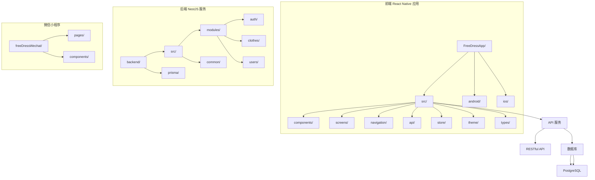

**图表来源**
- [README.md:86-118](file://FreeDressApp/README.md#L86-L118)
- [README.md:119-154](file://backend/README.md#L119-L154)

**章节来源**
- [README.md:86-118](file://FreeDressApp/README.md#L86-L118)
- [README.md:119-154](file://backend/README.md#L119-L154)

## 核心组件

### 应用根组件

应用的根组件负责初始化全局Provider和导航配置：

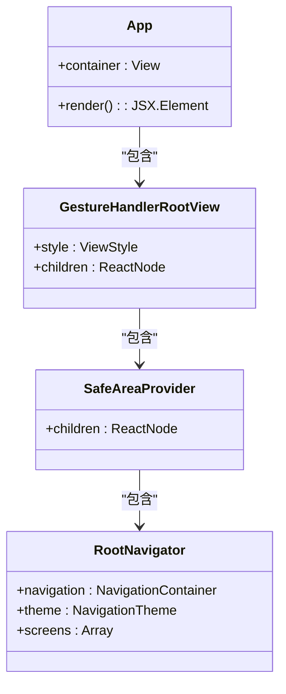

**图表来源**
- [App.tsx:11-19](file://FreeDressApp/src/App.tsx#L11-L19)

### 认证状态管理

应用使用Zustand实现全局状态管理，特别是用户认证状态：

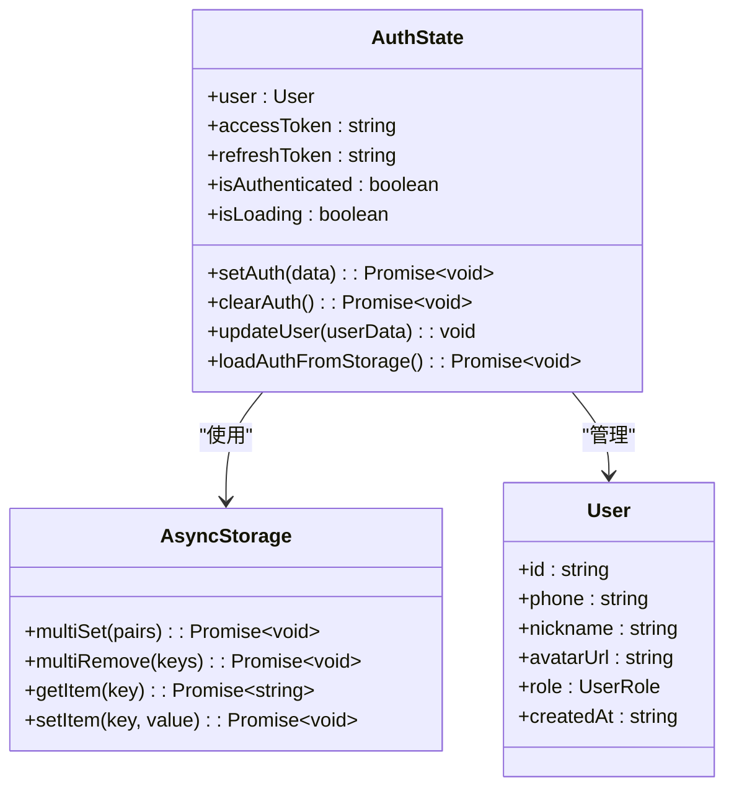

**图表来源**
- [authStore.ts:9-22](file://FreeDressApp/src/store/authStore.ts#L9-L22)

**章节来源**
- [App.tsx:1-28](file://FreeDressApp/src/App.tsx#L1-L28)
- [authStore.ts:1-123](file://FreeDressApp/src/store/authStore.ts#L1-L123)

## 架构概览

应用采用客户端-服务器架构，前端使用React Native构建跨平台移动应用，后端使用NestJS提供RESTful API服务。

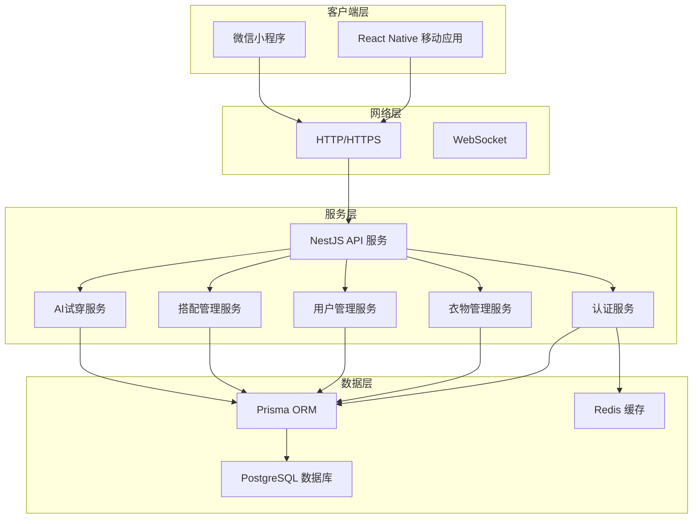

**图表来源**
- [README.md:43-54](file://backend/README.md#L43-L54)
- [authStore.ts:1-123](file://FreeDressApp/src/store/authStore.ts#L1-L123)

### API通信流程

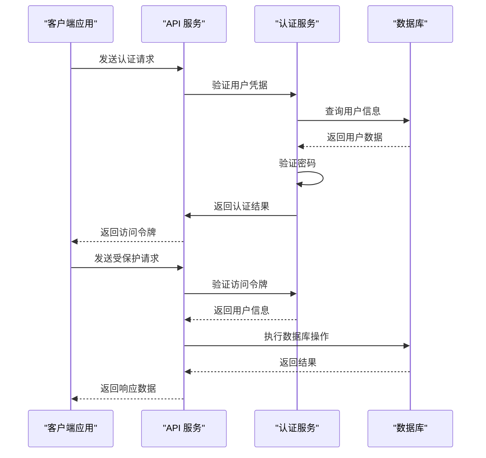

**图表来源**
- [axios.ts:24-38](file://FreeDressApp/src/api/axios.ts#L24-L38)
- [auth.service.ts:102-135](file://backend/src/modules/auth/auth.service.ts#L102-L135)

**章节来源**
- [README.md:227-246](file://backend/README.md#L227-L246)
- [axios.ts:1-108](file://FreeDressApp/src/api/axios.ts#L1-L108)

## 详细组件分析

### 导航系统

应用使用React Navigation实现多层级导航结构，包括根导航器和主标签导航器：

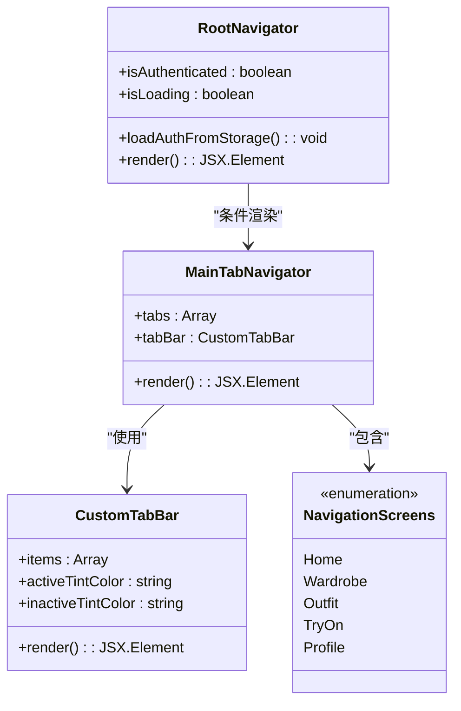

**图表来源**
- [RootNavigator.tsx:41-84](file://FreeDressApp/src/navigation/RootNavigator.tsx#L41-L84)
- [MainTabNavigator.tsx:22-34](file://FreeDressApp/src/navigation/MainTabNavigator.tsx#L22-L34)

### 首页组件

首页采用杂志风格设计，包含多个功能区域：

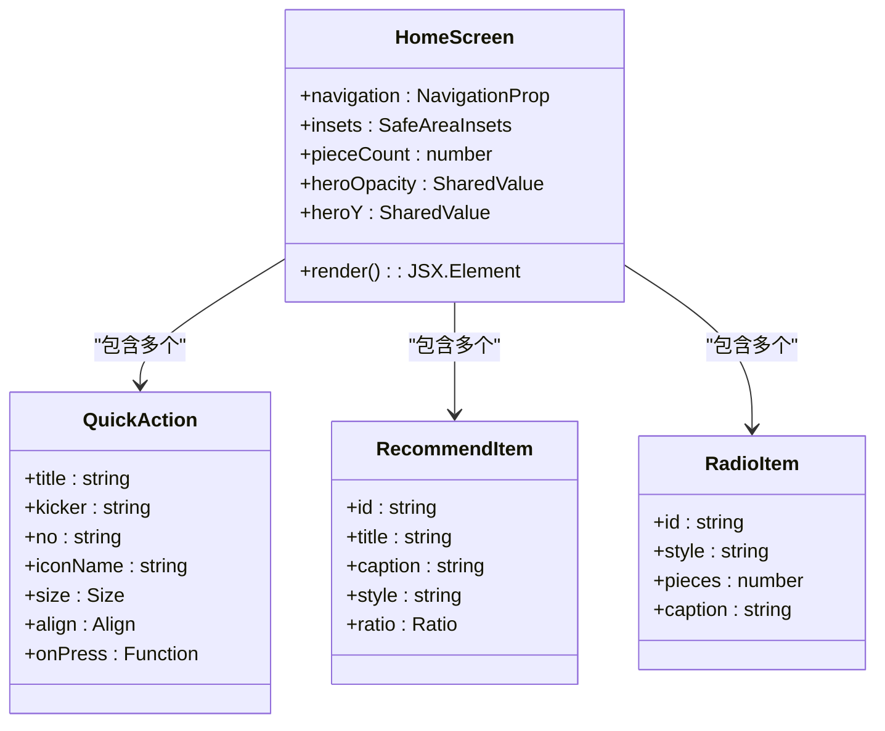

**图表来源**
- [HomeScreen.tsx:100-264](file://FreeDressApp/src/screens/HomeScreen.tsx#L100-L264)

### 衣橱管理组件

衣橱屏幕实现了完整的衣物管理功能：

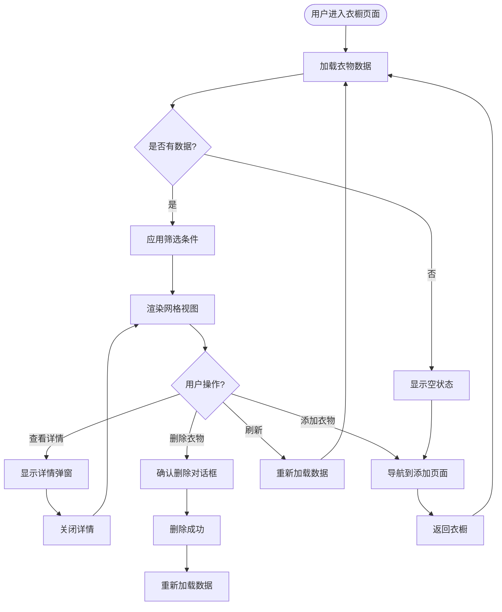

**图表来源**
- [WardrobeScreen.tsx:40-258](file://FreeDressApp/src/screens/WardrobeScreen.tsx#L40-L258)

**章节来源**
- [HomeScreen.tsx:1-606](file://FreeDressApp/src/screens/HomeScreen.tsx#L1-L606)
- [WardrobeScreen.tsx:1-423](file://FreeDressApp/src/screens/WardrobeScreen.tsx#L1-L423)

### 自定义组件系统

应用实现了丰富的自定义UI组件：

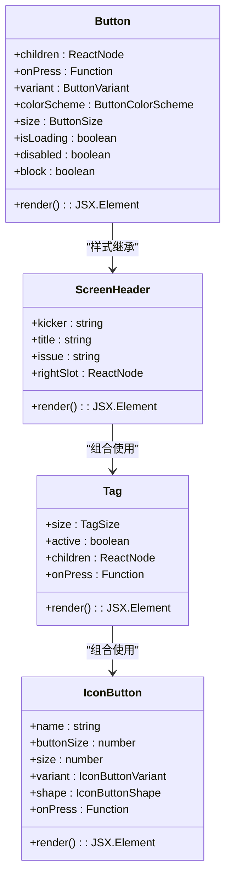

**图表来源**
- [Button.tsx:49-133](file://FreeDressApp/src/components/Button.tsx#L49-L133)

**章节来源**
- [Button.tsx:1-201](file://FreeDressApp/src/components/Button.tsx#L1-L201)

## 依赖关系分析

### 前端依赖关系

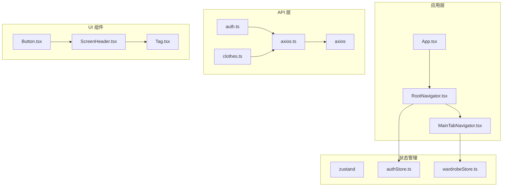

**图表来源**
- [package.json:12-31](file://FreeDressApp/package.json#L12-L31)
- [authStore.ts:1-123](file://FreeDressApp/src/store/authStore.ts#L1-L123)

### 后端依赖关系

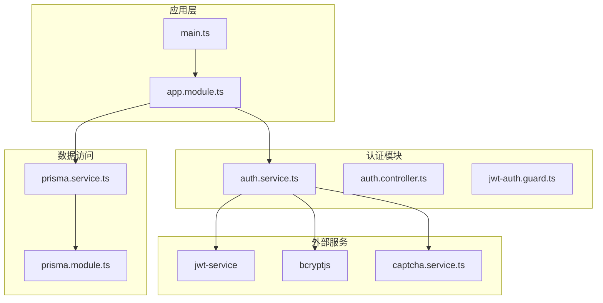

**图表来源**
- [package.json:26-45](file://backend/package.json#L26-L45)
- [auth.service.ts:24-37](file://backend/src/modules/auth/auth.service.ts#L24-L37)

**章节来源**
- [package.json:1-57](file://FreeDressApp/package.json#L1-L57)
- [package.json:1-91](file://backend/package.json#L1-L91)

## 性能考虑

### 前端性能优化

1. **动画性能**：使用React Native Reanimated实现高性能动画
2. **列表性能**：使用Shopify Flash List优化大型列表渲染
3. **状态管理**：使用Zustand替代Redux，减少不必要的重渲染
4. **图片处理**：使用React Native Fast Image优化图片加载

### 后端性能优化

1. **数据库优化**：使用Prisma ORM提供高效的数据库查询
2. **缓存策略**：使用Redis缓存频繁访问的数据
3. **API优化**：使用分页和懒加载减少数据传输
4. **并发处理**：使用异步处理和队列系统

## 故障排除指南

### 常见问题及解决方案

1. **认证失败**
   - 检查网络连接和API地址配置
   - 验证JWT令牌的有效性和过期时间
   - 确认用户凭据的正确性

2. **图片上传问题**
   - 检查图片格式和大小限制
   - 验证存储权限配置
   - 确认CDN服务的可用性

3. **导航问题**
   - 检查路由配置和参数传递
   - 验证导航器的嵌套结构
   - 确认屏幕组件的导入路径

4. **数据同步问题**
   - 检查本地存储的状态同步
   - 验证API响应的数据格式
   - 确认错误处理和重试机制

**章节来源**
- [axios.ts:44-105](file://FreeDressApp/src/api/axios.ts#L44-L105)
- [authStore.ts:97-121](file://FreeDressApp/src/store/authStore.ts#L97-L121)

## 结论

畅搭（FreeDress）移动应用是一个功能完整、架构清晰的智能衣物搭配平台。应用采用了现代化的技术栈和最佳实践，提供了优秀的用户体验和良好的可维护性。

### 主要优势

1. **技术架构先进**：采用React Native + NestJS的现代全栈架构
2. **用户体验优秀**：杂志风格的设计和流畅的交互体验
3. **功能完整**：涵盖了衣物管理、智能搭配、AI试穿等核心功能
4. **代码质量高**：模块化设计、TypeScript强类型支持、完善的测试覆盖

### 发展建议

1. **增强AI功能**：可以集成更先进的图像识别和推荐算法
2. **扩展平台支持**：考虑支持更多的平台和设备
3. **性能优化**：持续优化应用的启动速度和运行效率
4. **功能扩展**：添加社交分享、虚拟购物等功能

该应用为智能穿戴领域提供了一个优秀的参考实现，具有良好的扩展性和维护性。