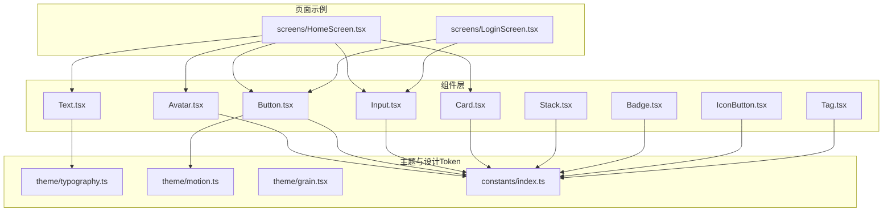
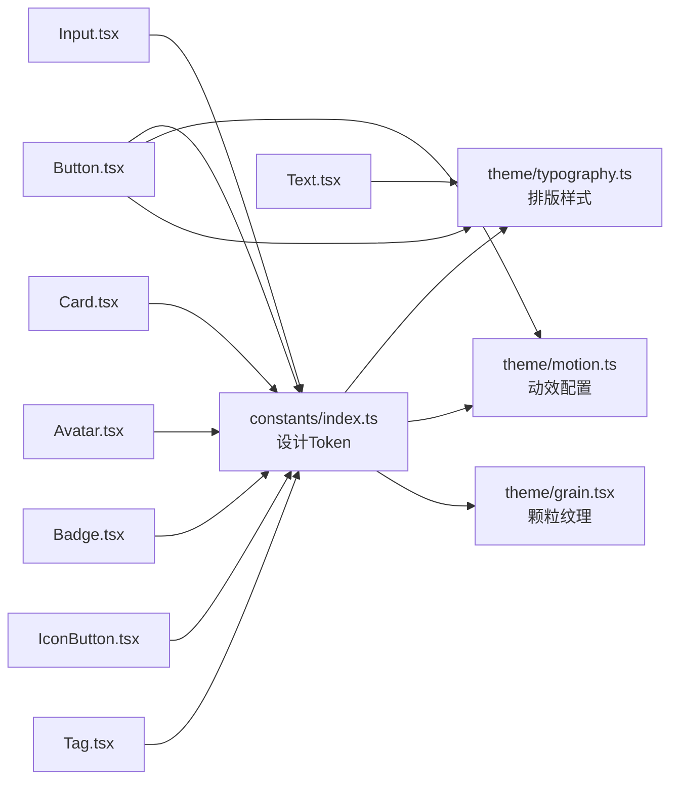
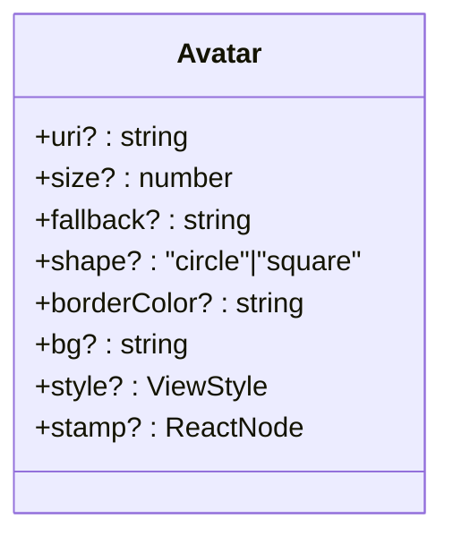
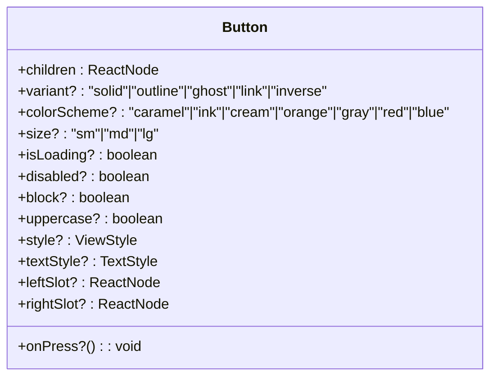
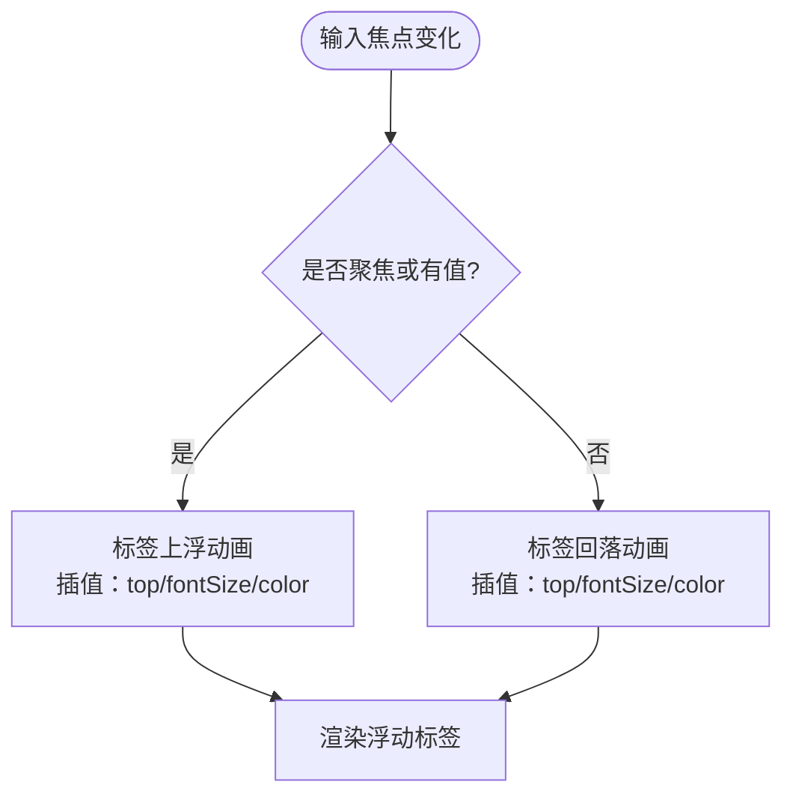
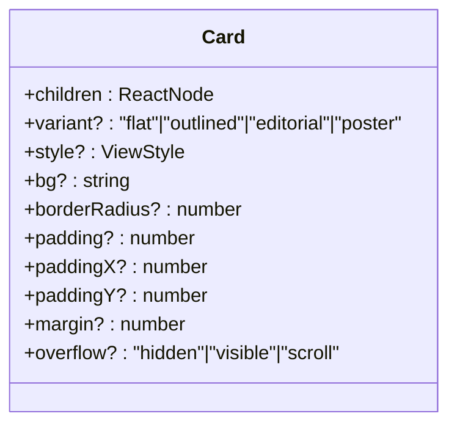
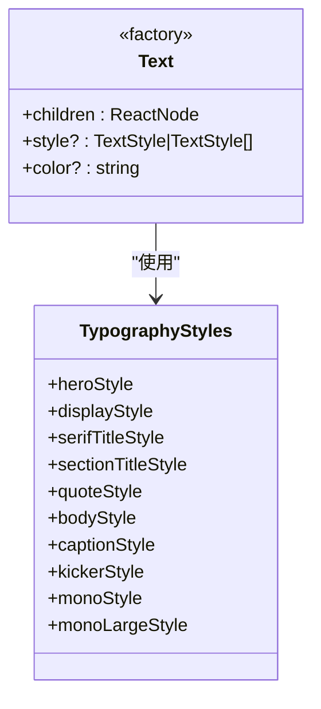
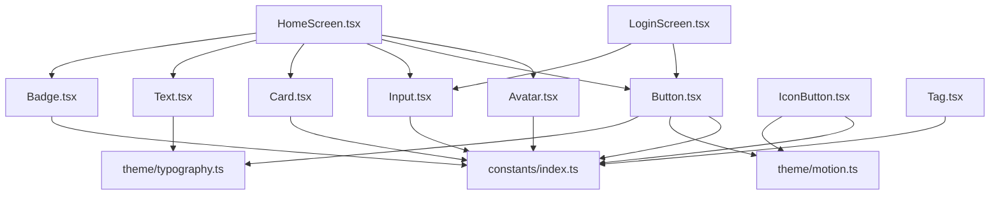

# UI组件库

<cite>
**本文档引用的文件**
- [FreeDressApp/src/components/index.ts](file://FreeDressApp/src/components/index.ts)
- [FreeDressApp/src/components/Avatar.tsx](file://FreeDressApp/src/components/Avatar.tsx)
- [FreeDressApp/src/components/Button.tsx](file://FreeDressApp/src/components/Button.tsx)
- [FreeDressApp/src/components/Input.tsx](file://FreeDressApp/src/components/Input.tsx)
- [FreeDressApp/src/components/Card.tsx](file://FreeDressApp/src/components/Card.tsx)
- [FreeDressApp/src/components/Text.tsx](file://FreeDressApp/src/components/Text.tsx)
- [FreeDressApp/src/components/Stack.tsx](file://FreeDressApp/src/components/Stack.tsx)
- [FreeDressApp/src/components/Badge.tsx](file://FreeDressApp/src/components/Badge.tsx)
- [FreeDressApp/src/components/IconButton.tsx](file://FreeDressApp/src/components/IconButton.tsx)
- [FreeDressApp/src/components/Tag.tsx](file://FreeDressApp/src/components/Tag.tsx)
- [FreeDressApp/src/constants/index.ts](file://FreeDressApp/src/constants/index.ts)
- [FreeDressApp/src/theme/typography.ts](file://FreeDressApp/src/theme/typography.ts)
- [FreeDressApp/src/theme/motion.ts](file://FreeDressApp/src/theme/motion.ts)
- [FreeDressApp/src/theme/grain.tsx](file://FreeDressApp/src/theme/grain.tsx)
- [FreeDressApp/src/screens/HomeScreen.tsx](file://FreeDressApp/src/screens/HomeScreen.tsx)
- [FreeDressApp/src/screens/LoginScreen.tsx](file://FreeDressApp/src/screens/LoginScreen.tsx)
</cite>

## 目录
1. [简介](#简介)
2. [项目结构](#项目结构)
3. [核心组件](#核心组件)
4. [架构总览](#架构总览)
5. [详细组件分析](#详细组件分析)
6. [依赖关系分析](#依赖关系分析)
7. [性能考量](#性能考量)
8. [故障排查指南](#故障排查指南)
9. [结论](#结论)
10. [附录](#附录)

## 简介
本文件为畅搭(FreeDress)应用的UI组件库文档，聚焦于自定义组件的设计理念与实现方法，覆盖以下核心组件：Avatar头像、Button按钮、Input输入、Card卡片、Text文本，并补充Badge徽标、IconButton图标按钮、Tag胶囊标签、Stack布局等常用组件。文档从Props接口设计、样式系统与主题适配、组件复用最佳实践（组合、条件渲染、事件处理）、无障碍与响应式、跨平台兼容性、样式定制与动画交互等方面进行系统阐述，并结合实际页面使用场景给出示例与常见问题解决方案。

## 项目结构
组件库位于应用前端源码目录，采用按功能模块组织的方式，核心组件集中在components目录，主题与设计Token集中在theme与constants目录，页面示例在screens目录中展示组件的实际使用。

图表来源
- [FreeDressApp/src/components/index.ts:1-32](file://FreeDressApp/src/components/index.ts#L1-L32)
- [FreeDressApp/src/components/Avatar.tsx:1-93](file://FreeDressApp/src/components/Avatar.tsx#L1-L93)
- [FreeDressApp/src/components/Button.tsx:1-201](file://FreeDressApp/src/components/Button.tsx#L1-L201)
- [FreeDressApp/src/components/Input.tsx:1-183](file://FreeDressApp/src/components/Input.tsx#L1-L183)
- [FreeDressApp/src/components/Card.tsx:1-124](file://FreeDressApp/src/components/Card.tsx#L1-L124)
- [FreeDressApp/src/components/Text.tsx:1-68](file://FreeDressApp/src/components/Text.tsx#L1-L68)
- [FreeDressApp/src/components/Stack.tsx:1-155](file://FreeDressApp/src/components/Stack.tsx#L1-L155)
- [FreeDressApp/src/components/Badge.tsx:1-124](file://FreeDressApp/src/components/Badge.tsx#L1-L124)
- [FreeDressApp/src/components/IconButton.tsx:1-126](file://FreeDressApp/src/components/IconButton.tsx#L1-L126)
- [FreeDressApp/src/components/Tag.tsx:1-91](file://FreeDressApp/src/components/Tag.tsx#L1-L91)
- [FreeDressApp/src/theme/typography.ts:1-115](file://FreeDressApp/src/theme/typography.ts#L1-L115)
- [FreeDressApp/src/theme/motion.ts:1-32](file://FreeDressApp/src/theme/motion.ts#L1-L32)
- [FreeDressApp/src/theme/grain.tsx:1-78](file://FreeDressApp/src/theme/grain.tsx#L1-L78)
- [FreeDressApp/src/constants/index.ts:1-212](file://FreeDressApp/src/constants/index.ts#L1-L212)
- [FreeDressApp/src/screens/HomeScreen.tsx:1-606](file://FreeDressApp/src/screens/HomeScreen.tsx#L1-L606)
- [FreeDressApp/src/screens/LoginScreen.tsx:1-324](file://FreeDressApp/src/screens/LoginScreen.tsx#L1-L324)

章节来源
- [FreeDressApp/src/components/index.ts:1-32](file://FreeDressApp/src/components/index.ts#L1-L32)
- [FreeDressApp/src/constants/index.ts:1-212](file://FreeDressApp/src/constants/index.ts#L1-L212)

## 核心组件
本节概述五大核心组件的设计目标与能力边界：
- Avatar：圆形/方形头像，支持占位字符与右下角徽标挂载
- Button：五种变体、多色彩方案、尺寸、加载/禁用状态、左右装饰槽
- Input：三种外观（描边/下划线/填充）、浮动标签、聚焦态与错误态
- Card：四种变体（flat/outlined/editorial/poster），兼容旧版内边距/外边距/圆角/背景API
- Text：排版组件工厂，提供多种预设风格（Hero/Display/SerifTitle/SectionTitle/QuoteText/BodyText/CaptionText/KickerText/Mono/MonoLarge）

章节来源
- [FreeDressApp/src/components/Avatar.tsx:1-93](file://FreeDressApp/src/components/Avatar.tsx#L1-L93)
- [FreeDressApp/src/components/Button.tsx:1-201](file://FreeDressApp/src/components/Button.tsx#L1-L201)
- [FreeDressApp/src/components/Input.tsx:1-183](file://FreeDressApp/src/components/Input.tsx#L1-L183)
- [FreeDressApp/src/components/Card.tsx:1-124](file://FreeDressApp/src/components/Card.tsx#L1-L124)
- [FreeDressApp/src/components/Text.tsx:1-68](file://FreeDressApp/src/components/Text.tsx#L1-L68)

## 架构总览
组件库围绕“设计Token + 主题样式 + 动画动效”的三层架构构建：
- 设计Token（constants）：颜色、字体、字号、间距、圆角、阴影、动效曲线与时长、平台差异常量
- 主题样式（theme）：排版样式预设、全局动效配置、颗粒纹理背景
- 组件实现：各组件通过统一的常量与主题进行样式与行为约束，保证视觉一致性与交互节奏统一

图表来源
- [FreeDressApp/src/constants/index.ts:1-212](file://FreeDressApp/src/constants/index.ts#L1-L212)
- [FreeDressApp/src/theme/typography.ts:1-115](file://FreeDressApp/src/theme/typography.ts#L1-L115)
- [FreeDressApp/src/theme/motion.ts:1-32](file://FreeDressApp/src/theme/motion.ts#L1-L32)
- [FreeDressApp/src/theme/grain.tsx:1-78](file://FreeDressApp/src/theme/grain.tsx#L1-L78)
- [FreeDressApp/src/components/Button.tsx:1-201](file://FreeDressApp/src/components/Button.tsx#L1-L201)
- [FreeDressApp/src/components/Input.tsx:1-183](file://FreeDressApp/src/components/Input.tsx#L1-L183)
- [FreeDressApp/src/components/Card.tsx:1-124](file://FreeDressApp/src/components/Card.tsx#L1-L124)
- [FreeDressApp/src/components/Avatar.tsx:1-93](file://FreeDressApp/src/components/Avatar.tsx#L1-L93)
- [FreeDressApp/src/components/Text.tsx:1-68](file://FreeDressApp/src/components/Text.tsx#L1-L68)
- [FreeDressApp/src/components/Badge.tsx:1-124](file://FreeDressApp/src/components/Badge.tsx#L1-L124)
- [FreeDressApp/src/components/IconButton.tsx:1-126](file://FreeDressApp/src/components/IconButton.tsx#L1-L126)
- [FreeDressApp/src/components/Tag.tsx:1-91](file://FreeDressApp/src/components/Tag.tsx#L1-L91)

## 详细组件分析

### Avatar 头像组件
- 设计理念：以“可识别性”为核心，优先使用头像图片；当无图片时提供首字母占位字符，支持形状切换与边框/背景定制，右下角可挂载徽标
- Props要点
  - uri/fallback：图片源与占位字符
  - size/shape：尺寸与圆形/方形
  - borderColor/bg：边框与背景色
  - stamp：右下角徽标节点
  - style：额外样式扩展
- 样式与主题
  - 使用颜色、圆角、发丝线等设计Token
  - 文本占位符采用衬线字体与特定字号
- 无障碍与响应式
  - 建议在可访问场景提供替代文本描述
  - 响应式尺寸通过size参数控制
- 定制建议
  - 通过stamp传入Badge/Tag等子组件实现“新消息”“徽章”等场景
  - 通过style覆盖定位与z-index以满足复杂布局

图表来源
- [FreeDressApp/src/components/Avatar.tsx:9-30](file://FreeDressApp/src/components/Avatar.tsx#L9-L30)

章节来源
- [FreeDressApp/src/components/Avatar.tsx:1-93](file://FreeDressApp/src/components/Avatar.tsx#L1-L93)
- [FreeDressApp/src/constants/index.ts:15-52](file://FreeDressApp/src/constants/index.ts#L15-L52)

### Button 按钮组件
- 设计理念：统一的交互反馈与视觉层级，支持多种变体与色彩方案，内置按压缩放动画
- Props要点
  - children：按钮内容（文本或任意节点）
  - variant/colorScheme/size：变体/色彩/尺寸
  - isLoading/disabled/block：加载/禁用/块级
  - uppercase：是否大写
  - leftSlot/rightSlot：左右装饰槽
  - style/textStyle：样式扩展
- 样式与主题
  - 色彩映射：兼容旧scheme并扩展新色彩（如orange映射caramel、gray映射ink等）
  - 尺寸映射：sm/md/lg对应内边距与字号
  - 阴影：solid+ink组合使用印刷投影
  - 动画：使用Reanimated实现按压缩放与快速过渡
- 无障碍与响应式
  - Pressable天然支持触摸反馈
  - 建议在禁用/加载态明确语义提示
- 定制建议
  - 通过leftSlot/rightSlot插入图标或指示器
  - 通过style/textStyle覆盖局部样式

图表来源
- [FreeDressApp/src/components/Button.tsx:29-45](file://FreeDressApp/src/components/Button.tsx#L29-L45)

章节来源
- [FreeDressApp/src/components/Button.tsx:1-201](file://FreeDressApp/src/components/Button.tsx#L1-L201)
- [FreeDressApp/src/theme/motion.ts:1-32](file://FreeDressApp/src/theme/motion.ts#L1-L32)
- [FreeDressApp/src/theme/typography.ts:108-114](file://FreeDressApp/src/theme/typography.ts#L108-L114)
- [FreeDressApp/src/constants/index.ts:15-52](file://FreeDressApp/src/constants/index.ts#L15-L52)

### Input 输入组件
- 设计理念：强调“可读性”与“可理解性”，下划线为首选，支持浮动标签与错误态
- Props要点
  - label/variant：标签与外观（outline/underline/filled）
  - borderColor/focusBorderColor/error/errorMessage/errorBorderColor：边框与错误态
  - containerStyle/style：容器与输入框样式
  - value/onFocus/onBlur/placeholder：受控属性与回调
- 样式与主题
  - 下划线聚焦态动态变化，错误态高亮
  - 浮动标签使用动画插值实现位置、字号与颜色过渡
  - 内边距根据是否有标签自动调整
- 无障碍与响应式
  - 建议配合屏幕阅读器提供aria-label
  - 响应式placeholder在聚焦时隐藏以节省空间
- 定制建议
  - 通过containerStyle为表单组提供统一布局
  - 通过style覆盖字体与颜色

图表来源
- [FreeDressApp/src/components/Input.tsx:49-78](file://FreeDressApp/src/components/Input.tsx#L49-L78)

章节来源
- [FreeDressApp/src/components/Input.tsx:1-183](file://FreeDressApp/src/components/Input.tsx#L1-L183)
- [FreeDressApp/src/constants/index.ts:15-52](file://FreeDressApp/src/constants/index.ts#L15-L52)

### Card 卡片组件
- 设计理念：在不同视觉层级下提供一致的容器体验，支持多种变体与兼容旧版API
- Props要点
  - children/variant/style：内容与变体（flat/outlined/editorial/poster）
  - bg/borderRadius/padding/margin/overflow：背景、圆角、内/外边距、溢出
  - 兼容旧版：borderRadius/padding/margin/bg/overflow
- 样式与主题
  - editorial/editorial+hairline边框，poster使用印刷投影
  - flat/outlined提供简洁与强调两种风格
- 无障碍与响应式
  - 建议在复杂卡片中提供语义分组
  - 响应式通过padding/margin与flex属性组合实现
- 定制建议
  - 通过style覆盖背景与阴影
  - 通过padding/margin快速适配栅格布局

图表来源
- [FreeDressApp/src/components/Card.tsx:12-33](file://FreeDressApp/src/components/Card.tsx#L12-L33)

章节来源
- [FreeDressApp/src/components/Card.tsx:1-124](file://FreeDressApp/src/components/Card.tsx#L1-L124)
- [FreeDressApp/src/constants/index.ts:118-156](file://FreeDressApp/src/constants/index.ts#L118-L156)

### Text 文本组件
- 设计理念：通过“排版组件工厂”统一字体家族、字号、行高、字距与字重，避免散落的样式设置
- Props要点
  - children/style/color：内容、样式与颜色
- 预设风格
  - Hero/Display/SerifTitle/SectionTitle/QuoteText/BodyText/CaptionText/KickerText/Mono/MonoLarge
- 样式与主题
  - 基于theme/typography.ts中的样式预设
  - 支持color属性快速覆盖颜色
- 无障碍与响应式
  - 建议在标题层级使用合适的语义标签
  - 响应式通过字号与行高实现
- 定制建议
  - 通过style合并覆盖局部样式
  - 通过color快速切换主题色

图表来源
- [FreeDressApp/src/components/Text.tsx:21-36](file://FreeDressApp/src/components/Text.tsx#L21-L36)
- [FreeDressApp/src/theme/typography.ts:8-115](file://FreeDressApp/src/theme/typography.ts#L8-L115)

章节来源
- [FreeDressApp/src/components/Text.tsx:1-68](file://FreeDressApp/src/components/Text.tsx#L1-L68)
- [FreeDressApp/src/theme/typography.ts:1-115](file://FreeDressApp/src/theme/typography.ts#L1-L115)

### 其他常用组件（补充）
- Stack布局：HStack/VStack，统一间距网格（SPACING=4px步进），支持flex、对齐与包裹
- Badge徽标：solid/outline/stamp三种风格，支持背景/文字色与圆角
- IconButton图标按钮：支持多种变体与形状，内置按压缩放
- Tag胶囊标签：active/inactive双态，支持尺寸与点击

章节来源
- [FreeDressApp/src/components/Stack.tsx:1-155](file://FreeDressApp/src/components/Stack.tsx#L1-L155)
- [FreeDressApp/src/components/Badge.tsx:1-124](file://FreeDressApp/src/components/Badge.tsx#L1-L124)
- [FreeDressApp/src/components/IconButton.tsx:1-126](file://FreeDressApp/src/components/IconButton.tsx#L1-L126)
- [FreeDressApp/src/components/Tag.tsx:1-91](file://FreeDressApp/src/components/Tag.tsx#L1-L91)
- [FreeDressApp/src/constants/index.ts:100-124](file://FreeDressApp/src/constants/index.ts#L100-L124)

## 依赖关系分析
组件间依赖与主题/设计Token的关系如下：

图表来源
- [FreeDressApp/src/components/Button.tsx:1-201](file://FreeDressApp/src/components/Button.tsx#L1-L201)
- [FreeDressApp/src/components/Input.tsx:1-183](file://FreeDressApp/src/components/Input.tsx#L1-L183)
- [FreeDressApp/src/components/Card.tsx:1-124](file://FreeDressApp/src/components/Card.tsx#L1-L124)
- [FreeDressApp/src/components/Avatar.tsx:1-93](file://FreeDressApp/src/components/Avatar.tsx#L1-L93)
- [FreeDressApp/src/components/Text.tsx:1-68](file://FreeDressApp/src/components/Text.tsx#L1-L68)
- [FreeDressApp/src/components/Badge.tsx:1-124](file://FreeDressApp/src/components/Badge.tsx#L1-L124)
- [FreeDressApp/src/components/IconButton.tsx:1-126](file://FreeDressApp/src/components/IconButton.tsx#L1-L126)
- [FreeDressApp/src/components/Tag.tsx:1-91](file://FreeDressApp/src/components/Tag.tsx#L1-L91)
- [FreeDressApp/src/theme/typography.ts:1-115](file://FreeDressApp/src/theme/typography.ts#L1-L115)
- [FreeDressApp/src/theme/motion.ts:1-32](file://FreeDressApp/src/theme/motion.ts#L1-L32)
- [FreeDressApp/src/constants/index.ts:1-212](file://FreeDressApp/src/constants/index.ts#L1-L212)
- [FreeDressApp/src/screens/HomeScreen.tsx:1-606](file://FreeDressApp/src/screens/HomeScreen.tsx#L1-L606)
- [FreeDressApp/src/screens/LoginScreen.tsx:1-324](file://FreeDressApp/src/screens/LoginScreen.tsx#L1-L324)

章节来源
- [FreeDressApp/src/components/index.ts:1-32](file://FreeDressApp/src/components/index.ts#L1-L32)
- [FreeDressApp/src/constants/index.ts:1-212](file://FreeDressApp/src/constants/index.ts#L1-L212)

## 性能考量
- 动画与交互
  - Button/IconButton使用Reanimated实现按压缩放，withTiming默认采用快速过渡配置，减少主线程压力
  - Input的标签动画使用非原生驱动插值，避免过度触发原生动画
- 样式与主题
  - 所有组件样式集中于StyleSheet.create，降低运行时样式计算成本
  - 通过constants与theme统一管理颜色与字体，减少重复声明
- 渲染优化
  - Card/Stack等容器组件尽量使用View层级，避免深层嵌套
  - 页面中大量列表使用FlatList/ScrollView，合理设置keyExtractor与ItemSeparatorComponent

章节来源
- [FreeDressApp/src/theme/motion.ts:1-32](file://FreeDressApp/src/theme/motion.ts#L1-L32)
- [FreeDressApp/src/components/Button.tsx:64-78](file://FreeDressApp/src/components/Button.tsx#L64-L78)
- [FreeDressApp/src/components/IconButton.tsx:41-57](file://FreeDressApp/src/components/IconButton.tsx#L41-L57)
- [FreeDressApp/src/components/Input.tsx:52-58](file://FreeDressApp/src/components/Input.tsx#L52-L58)

## 故障排查指南
- 按钮点击无反馈
  - 检查disabled或isLoading状态是否被意外置位
  - 确认onPress回调未被覆盖或为空
- 输入框标签不浮动
  - 确认value或onFocus/onBlur回调未被覆盖导致状态未更新
  - 检查useEffect中动画插值是否正确
- 卡片边框/阴影异常
  - 检查variant与bg是否冲突
  - 确认overflow与圆角设置是否影响视觉
- 文本样式错乱
  - 检查style与color是否覆盖了主题样式
  - 确认字体族在目标平台可用
- 图标按钮按压动画无效
  - 确认Reanimated版本与AnimatedPressable已正确创建
  - 检查fastTransition配置是否生效

章节来源
- [FreeDressApp/src/components/Button.tsx:80-132](file://FreeDressApp/src/components/Button.tsx#L80-L132)
- [FreeDressApp/src/components/Input.tsx:113-121](file://FreeDressApp/src/components/Input.tsx#L113-L121)
- [FreeDressApp/src/components/Card.tsx:56-90](file://FreeDressApp/src/components/Card.tsx#L56-L90)
- [FreeDressApp/src/components/Text.tsx:28-36](file://FreeDressApp/src/components/Text.tsx#L28-L36)
- [FreeDressApp/src/components/IconButton.tsx:48-75](file://FreeDressApp/src/components/IconButton.tsx#L48-L75)

## 结论
本UI组件库以“设计Token + 主题样式 + 动画动效”为核心，围绕可识别性、可理解性与可访问性展开，通过统一的Props接口与样式体系，实现跨页面一致的视觉与交互体验。建议在业务开发中遵循“组合优先、条件渲染清晰、事件处理明确”的原则，并充分利用主题与设计Token进行样式定制与动画交互。

## 附录

### 组件Props与主题适配速查
- Button
  - 变体：solid/outline/ghost/link/inverse
  - 色彩：caramel/ink/cream/orange(gray/red/blue)
  - 尺寸：sm/md/lg
  - 动效：fastTransition
- Input
  - 外观：outline/underline/filled
  - 状态：聚焦/错误
- Card
  - 变体：flat/outlined/editorial/poster
- Text
  - 风格：Hero/Display/SerifTitle/SectionTitle/QuoteText/BodyText/CaptionText/KickerText/Mono/MonoLarge
- Avatar/IconButton/Tag/Badge
  - 形状/尺寸/色彩/边框/圆角/间距均可通过Props与主题常量控制

章节来源
- [FreeDressApp/src/components/Button.tsx:25-45](file://FreeDressApp/src/components/Button.tsx#L25-L45)
- [FreeDressApp/src/components/Input.tsx:21-31](file://FreeDressApp/src/components/Input.tsx#L21-L31)
- [FreeDressApp/src/components/Card.tsx:10-33](file://FreeDressApp/src/components/Card.tsx#L10-L33)
- [FreeDressApp/src/components/Text.tsx:21-25](file://FreeDressApp/src/components/Text.tsx#L21-L25)
- [FreeDressApp/src/components/Avatar.tsx:9-19](file://FreeDressApp/src/components/Avatar.tsx#L9-L19)
- [FreeDressApp/src/components/IconButton.tsx:16-27](file://FreeDressApp/src/components/IconButton.tsx#L16-L27)
- [FreeDressApp/src/components/Tag.tsx:22-30](file://FreeDressApp/src/components/Tag.tsx#L22-L30)
- [FreeDressApp/src/components/Badge.tsx:11-21](file://FreeDressApp/src/components/Badge.tsx#L11-L21)

### 使用示例与最佳实践
- 登录页示例
  - 使用Button与Input完成登录流程，Button采用ink+solid+large，Input采用underline浮动标签
- 首页示例
  - 使用Text系列组件构建标题与副标题，结合Stack与Card实现卡片化信息流

章节来源
- [FreeDressApp/src/screens/LoginScreen.tsx:137-170](file://FreeDressApp/src/screens/LoginScreen.tsx#L137-L170)
- [FreeDressApp/src/screens/HomeScreen.tsx:188-204](file://FreeDressApp/src/screens/HomeScreen.tsx#L188-L204)