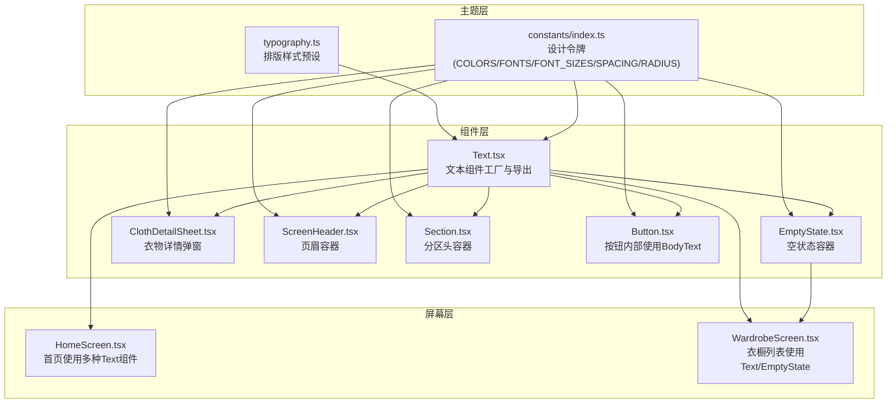
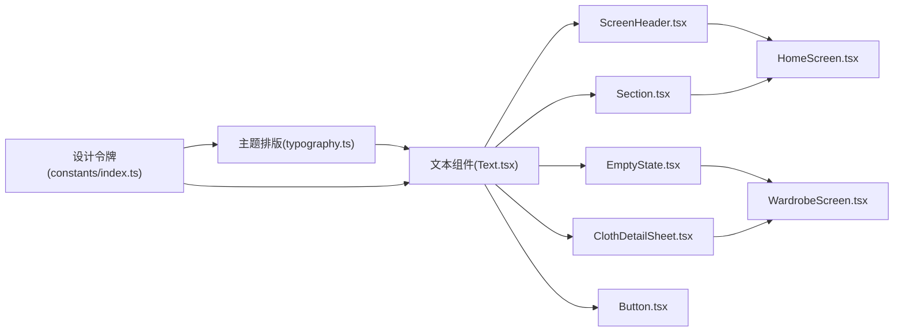
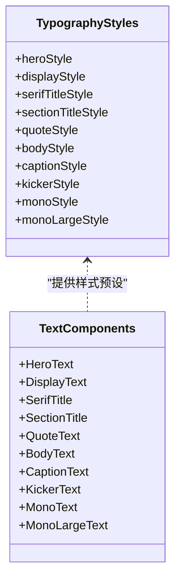
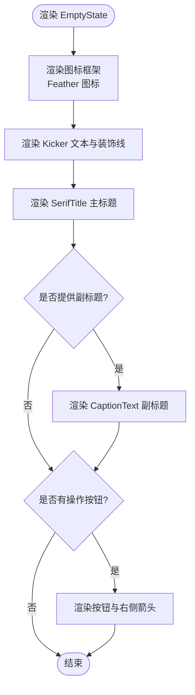
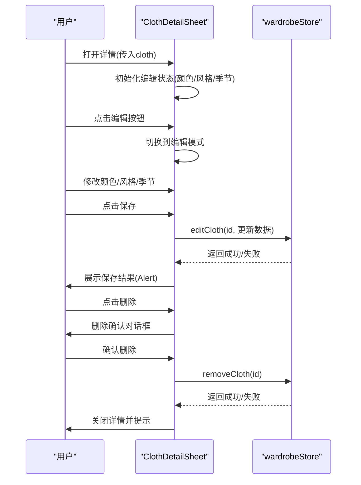
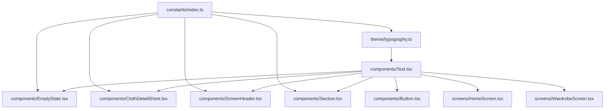

# 内容组件

<cite>
**本文档引用的文件**
- [FreeDressApp/src/components/Text.tsx](file://FreeDressApp/src/components/Text.tsx)
- [FreeDressApp/src/theme/typography.ts](file://FreeDressApp/src/theme/typography.ts)
- [FreeDressApp/src/components/EmptyState.tsx](file://FreeDressApp/src/components/EmptyState.tsx)
- [FreeDressApp/src/components/ClothDetailSheet.tsx](file://FreeDressApp/src/components/ClothDetailSheet.tsx)
- [FreeDressApp/src/components/ScreenHeader.tsx](file://FreeDressApp/src/components/ScreenHeader.tsx)
- [FreeDressApp/src/components/Section.tsx](file://FreeDressApp/src/components/Section.tsx)
- [FreeDressApp/src/components/Button.tsx](file://FreeDressApp/src/components/Button.tsx)
- [FreeDressApp/src/constants/index.ts](file://FreeDressApp/src/constants/index.ts)
- [FreeDressApp/src/types/index.ts](file://FreeDressApp/src/types/index.ts)
- [FreeDressApp/src/components/index.ts](file://FreeDressApp/src/components/index.ts)
- [FreeDressApp/src/screens/HomeScreen.tsx](file://FreeDressApp/src/screens/HomeScreen.tsx)
- [FreeDressApp/src/screens/WardrobeScreen.tsx](file://FreeDressApp/src/screens/WardrobeScreen.tsx)
</cite>

## 目录
1. [简介](#简介)
2. [项目结构](#项目结构)
3. [核心组件](#核心组件)
4. [架构总览](#架构总览)
5. [组件详解](#组件详解)
6. [依赖关系分析](#依赖关系分析)
7. [性能考量](#性能考量)
8. [故障排查指南](#故障排查指南)
9. [结论](#结论)
10. [附录](#附录)

## 简介
本文件聚焦畅搭(FreeDress)应用中的内容相关UI组件，系统梳理Text文本组件系列的字体层次与排版体系，阐释HeroText、DisplayText、SerifTitle、SectionTitle、QuoteText、BodyText、CaptionText、KickerText、MonoText等的语义化使用与视觉层级；详细介绍EmptyState空状态组件的图标设计、文案配置与操作引导；深入解析ClothDetailSheet衣物详情组件的信息展示、交互控制与数据绑定。同时覆盖国际化支持、无障碍访问与SEO优化建议，并提供样式定制、主题适配与品牌化方案。

## 项目结构
内容组件位于应用前端工程的组件层与主题层，围绕排版系统与设计令牌构建，形成“主题样式预设 + 语义化文本组件 + 业务场景容器”的清晰分层。

图表来源
- [FreeDressApp/src/theme/typography.ts:1-115](file://FreeDressApp/src/theme/typography.ts#L1-L115)
- [FreeDressApp/src/constants/index.ts:15-84](file://FreeDressApp/src/constants/index.ts#L15-L84)
- [FreeDressApp/src/components/Text.tsx:1-68](file://FreeDressApp/src/components/Text.tsx#L1-L68)
- [FreeDressApp/src/components/EmptyState.tsx:1-102](file://FreeDressApp/src/components/EmptyState.tsx#L1-L102)
- [FreeDressApp/src/components/ClothDetailSheet.tsx:1-353](file://FreeDressApp/src/components/ClothDetailSheet.tsx#L1-L353)
- [FreeDressApp/src/components/ScreenHeader.tsx:1-95](file://FreeDressApp/src/components/ScreenHeader.tsx#L1-L95)
- [FreeDressApp/src/components/Section.tsx:1-68](file://FreeDressApp/src/components/Section.tsx#L1-L68)
- [FreeDressApp/src/components/Button.tsx:100-133](file://FreeDressApp/src/components/Button.tsx#L100-L133)
- [FreeDressApp/src/screens/HomeScreen.tsx:1-200](file://FreeDressApp/src/screens/HomeScreen.tsx#L1-L200)
- [FreeDressApp/src/screens/WardrobeScreen.tsx:1-200](file://FreeDressApp/src/screens/WardrobeScreen.tsx#L1-L200)

章节来源
- [FreeDressApp/src/components/index.ts:1-32](file://FreeDressApp/src/components/index.ts#L1-L32)

## 核心组件
- 文本组件系列：基于统一的排版样式预设，通过工厂函数生成语义化文本组件，确保字体家族、字号、行高、字距、字重与色彩的一致性。
- 空状态组件：提供图标、Kicker、主标题、副标题与行动按钮的完整组合，遵循杂志风格的布局与留白。
- 衣物详情组件：以模态抽屉形式承载图片、标识、信息项与编辑表单，支持增删改查与交互反馈。

章节来源
- [FreeDressApp/src/components/Text.tsx:1-68](file://FreeDressApp/src/components/Text.tsx#L1-L68)
- [FreeDressApp/src/theme/typography.ts:1-115](file://FreeDressApp/src/theme/typography.ts#L1-L115)
- [FreeDressApp/src/components/EmptyState.tsx:1-102](file://FreeDressApp/src/components/EmptyState.tsx#L1-L102)
- [FreeDressApp/src/components/ClothDetailSheet.tsx:1-353](file://FreeDressApp/src/components/ClothDetailSheet.tsx#L1-L353)

## 架构总览
文本组件通过主题层的排版样式预设实现统一的视觉语言，业务组件（如页眉、分区头、空状态、衣物详情）按需组合使用，形成一致的品牌表达与可维护的代码结构。

图表来源
- [FreeDressApp/src/theme/typography.ts:1-115](file://FreeDressApp/src/theme/typography.ts#L1-L115)
- [FreeDressApp/src/constants/index.ts:15-84](file://FreeDressApp/src/constants/index.ts#L15-L84)
- [FreeDressApp/src/components/Text.tsx:1-68](file://FreeDressApp/src/components/Text.tsx#L1-L68)
- [FreeDressApp/src/components/ScreenHeader.tsx:1-95](file://FreeDressApp/src/components/ScreenHeader.tsx#L1-L95)
- [FreeDressApp/src/components/Section.tsx:1-68](file://FreeDressApp/src/components/Section.tsx#L1-L68)
- [FreeDressApp/src/components/EmptyState.tsx:1-102](file://FreeDressApp/src/components/EmptyState.tsx#L1-L102)
- [FreeDressApp/src/components/ClothDetailSheet.tsx:1-353](file://FreeDressApp/src/components/ClothDetailSheet.tsx#L1-L353)
- [FreeDressApp/src/components/Button.tsx:100-133](file://FreeDressApp/src/components/Button.tsx#L100-L133)
- [FreeDressApp/src/screens/HomeScreen.tsx:1-200](file://FreeDressApp/src/screens/HomeScreen.tsx#L1-L200)
- [FreeDressApp/src/screens/WardrobeScreen.tsx:1-200](file://FreeDressApp/src/screens/WardrobeScreen.tsx#L1-L200)

## 组件详解

### 文本组件系列与排版系统
- 设计理念：以“排版样式预设”为核心，将字体族、字号、行高、字距、字重与色彩封装为可复用的TextStyle，避免在各处散落的样式设置。
- 组件工厂：通过工厂函数makeText接收基础样式，返回带默认样式的文本组件，支持传入额外style与color进行局部覆盖。
- 字体层次与视觉层级：
  - HeroText：巨型衬线标题，用于启动页/登录页等强视觉冲击场景。
  - DisplayText：大标题，强调性主标题。
  - SerifTitle：衬线主标题，用于页面主标题或卡片标题。
  - SectionTitle：章节标题，用于分区或段落标题。
  - QuoteText：斜体引文，用于引用或强调语句。
  - BodyText：正文，用于主要内容与说明。
  - CaptionText：弱化正文，用于注释、标签或次要信息。
  - KickerText：极小英文标签，用于分类、期号或小字说明。
  - MonoText/MonoLargeText：等宽文本，用于编号、价格、期号等需要对齐的场景。

图表来源
- [FreeDressApp/src/theme/typography.ts:1-115](file://FreeDressApp/src/theme/typography.ts#L1-L115)
- [FreeDressApp/src/components/Text.tsx:21-68](file://FreeDressApp/src/components/Text.tsx#L21-L68)

章节来源
- [FreeDressApp/src/theme/typography.ts:8-115](file://FreeDressApp/src/theme/typography.ts#L8-L115)
- [FreeDressApp/src/components/Text.tsx:21-68](file://FreeDressApp/src/components/Text.tsx#L21-L68)
- [FreeDressApp/src/constants/index.ts:58-97](file://FreeDressApp/src/constants/index.ts#L58-L97)

#### 使用示例与场景
- 页眉与分区头：ScreenHeader与Section分别使用KickerText、SerifTitle、MonoText组合，形成统一的头部信息与分区标识。
- 首页封面：HomeScreen中使用HeroText、SerifTitle、MonoText、KickerText、CaptionText等构建“期刊封面”式布局。
- 按钮内部：Button内部使用BodyText作为按钮文本，结合buttonTextStyle实现统一的按钮排版风格。

章节来源
- [FreeDressApp/src/components/ScreenHeader.tsx:29-63](file://FreeDressApp/src/components/ScreenHeader.tsx#L29-L63)
- [FreeDressApp/src/components/Section.tsx:22-42](file://FreeDressApp/src/components/Section.tsx#L22-L42)
- [FreeDressApp/src/screens/HomeScreen.tsx:182-196](file://FreeDressApp/src/screens/HomeScreen.tsx#L182-L196)
- [FreeDressApp/src/components/Button.tsx:107-119](file://FreeDressApp/src/components/Button.tsx#L107-L119)

### EmptyState 空状态组件
- 结构组成：图标框架、Kicker装饰线与文本、主标题、副标题、可选的操作按钮。
- 视觉设计：采用杂志风格的线稿图标、细线分隔与紧凑留白，强调信息密度与阅读节奏。
- 交互与文案：支持自定义图标名称、Kicker文案、主标题、副标题与操作标签及回调；副标题支持条件渲染。

图表来源
- [FreeDressApp/src/components/EmptyState.tsx:22-62](file://FreeDressApp/src/components/EmptyState.tsx#L22-L62)

章节来源
- [FreeDressApp/src/components/EmptyState.tsx:12-62](file://FreeDressApp/src/components/EmptyState.tsx#L12-L62)
- [FreeDressApp/src/constants/index.ts:15-52](file://FreeDressApp/src/constants/index.ts#L15-L52)

### ClothDetailSheet 衣物详情组件
- 数据模型：Cloth接口包含id、userId、imageUrl、category、color、style、season、tags等字段，支持衣物信息的展示与编辑。
- 交互流程：
  - 初始化：根据传入的Cloth对象填充颜色、风格、季节等编辑状态。
  - 编辑模式：切换至编辑态后，展示输入框与标签选择器，支持保存与取消。
  - 删除确认：提供删除确认对话框，防止误操作。
  - 保存流程：调用store方法更新衣物信息，处理异常并提示用户。
- 视觉与布局：顶部操作栏（分类、编辑/关闭）、图片区域（占位与标识戳）、详情/编辑区域、分割线与删除按钮。

图表来源
- [FreeDressApp/src/components/ClothDetailSheet.tsx:29-86](file://FreeDressApp/src/components/ClothDetailSheet.tsx#L29-L86)
- [FreeDressApp/src/store/wardrobeStore.ts:1-200](file://FreeDressApp/src/store/wardrobeStore.ts#L1-L200)

章节来源
- [FreeDressApp/src/components/ClothDetailSheet.tsx:23-244](file://FreeDressApp/src/components/ClothDetailSheet.tsx#L23-L244)
- [FreeDressApp/src/types/index.ts:21-33](file://FreeDressApp/src/types/index.ts#L21-L33)
- [FreeDressApp/src/constants/index.ts:191-198](file://FreeDressApp/src/constants/index.ts#L191-L198)

## 依赖关系分析
- 主题依赖：所有文本组件依赖主题层的排版样式与设计令牌；EmptyState与ClothDetailSheet还依赖常量层的颜色、间距、半径等。
- 组件耦合：Text组件通过工厂函数解耦具体样式与使用方；业务组件仅依赖语义化组件，降低样式变更带来的影响。
- 外部依赖：图标使用Feather；平台字体通过常量映射到系统字体；模态抽屉依赖React Native的Modal与KeyboardAvoidingView。

图表来源
- [FreeDressApp/src/constants/index.ts:15-84](file://FreeDressApp/src/constants/index.ts#L15-L84)
- [FreeDressApp/src/theme/typography.ts:1-115](file://FreeDressApp/src/theme/typography.ts#L1-L115)
- [FreeDressApp/src/components/Text.tsx:1-68](file://FreeDressApp/src/components/Text.tsx#L1-L68)
- [FreeDressApp/src/components/EmptyState.tsx:1-102](file://FreeDressApp/src/components/EmptyState.tsx#L1-L102)
- [FreeDressApp/src/components/ClothDetailSheet.tsx:1-353](file://FreeDressApp/src/components/ClothDetailSheet.tsx#L1-L353)
- [FreeDressApp/src/components/ScreenHeader.tsx:1-95](file://FreeDressApp/src/components/ScreenHeader.tsx#L1-L95)
- [FreeDressApp/src/components/Section.tsx:1-68](file://FreeDressApp/src/components/Section.tsx#L1-L68)
- [FreeDressApp/src/components/Button.tsx:100-133](file://FreeDressApp/src/components/Button.tsx#L100-L133)
- [FreeDressApp/src/screens/HomeScreen.tsx:1-200](file://FreeDressApp/src/screens/HomeScreen.tsx#L1-L200)
- [FreeDressApp/src/screens/WardrobeScreen.tsx:1-200](file://FreeDressApp/src/screens/WardrobeScreen.tsx#L1-L200)

章节来源
- [FreeDressApp/src/components/index.ts:18-31](file://FreeDressApp/src/components/index.ts#L18-L31)

## 性能考量
- 样式合并：Text组件通过样式扁平化合并基础样式与传入样式，减少不必要的嵌套与重复计算。
- 模态抽屉：ClothDetailSheet使用键盘适配与滑动动画，避免阻塞主线程；滚动区域限制最大高度，提升渲染效率。
- 字体加载：平台字体映射到系统字体，避免自定义字体导致的首屏阻塞；如需自定义字体，建议预加载与缓存策略。
- 列表渲染：WardrobeScreen中对过滤与刷新逻辑进行memo化，减少无效渲染。

## 故障排查指南
- 文本样式未生效
  - 检查是否正确导入主题样式与设计令牌。
  - 确认传入的style是否覆盖了基础样式。
- 图标不显示
  - 确认Feather图标名称正确且存在。
  - 检查图标尺寸与颜色是否与主题一致。
- 模态抽屉无法关闭
  - 确认onRequestClose回调已正确传递给Modal。
  - 检查键盘适配行为与平台差异。
- 编辑保存失败
  - 查看store方法的错误提示与网络状态。
  - 确认必填字段与数据类型符合接口要求。

章节来源
- [FreeDressApp/src/components/ClothDetailSheet.tsx:88-94](file://FreeDressApp/src/components/ClothDetailSheet.tsx#L88-L94)
- [FreeDressApp/src/components/EmptyState.tsx:33-35](file://FreeDressApp/src/components/EmptyState.tsx#L33-L35)

## 结论
内容组件通过统一的排版样式与设计令牌，实现了跨页面一致的视觉表达与可维护的代码结构。Text组件系列提供了清晰的语义化与视觉层级，EmptyState与ClothDetailSheet则在业务场景中提供了完整的空状态与详情交互体验。配合合理的国际化、无障碍与SEO策略，可进一步提升产品的可用性与可访问性。

## 附录

### 国际化支持
- 文案与数字：将所有用户可见文案集中管理，使用本地化资源文件；日期、数字格式化采用系统Locale。
- 文字方向：当前组件未涉及RTL场景，若未来扩展需考虑文本对齐与图标镜像。
- 动态字体：可结合平台字体映射策略，按语言环境选择合适的字体族。

### 无障碍访问
- 文本对比度：确保文本与背景的对比度满足WCAG标准，优先使用主题提供的中性色。
- 字号与行高：保持合理的行高与字号，避免过密或过疏影响阅读。
- 语义化标签：在可交互元素周围使用语义化文本，提供清晰的上下文描述。

### SEO优化
- 页面标题：首页与重要页面设置明确的标题与描述，便于搜索引擎索引。
- 结构化数据：在服务端或静态页面中添加必要的结构化元数据。
- 内容可读性：使用语义化文本组件，避免过度装饰影响爬虫抓取。

### 样式定制、主题适配与品牌化
- 主题扩展：在constants中新增或调整COLORS、FONTS、FONT_SIZES、SPACING等设计令牌，即可全局生效。
- 品牌色系：通过调整主色与辅助色，适配不同品牌阶段；保持弱化色与强调色的层级关系。
- 字体策略：保留平台原生字体的同时，预留自定义字体接入点，确保品牌一致性与性能平衡。