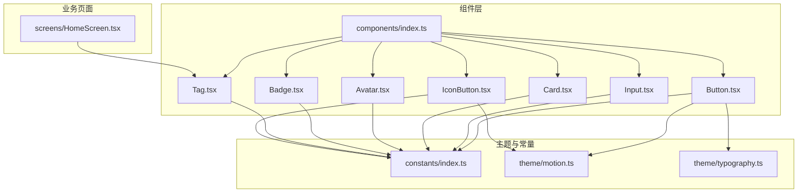
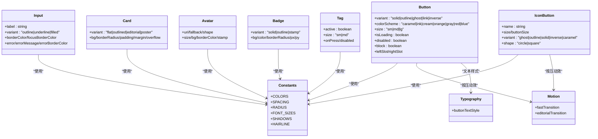
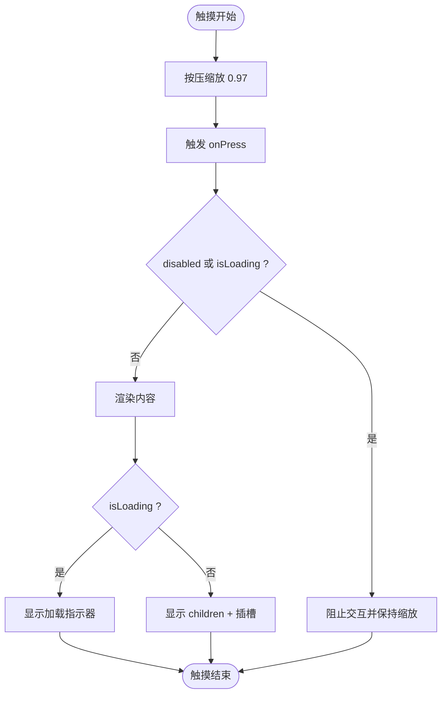
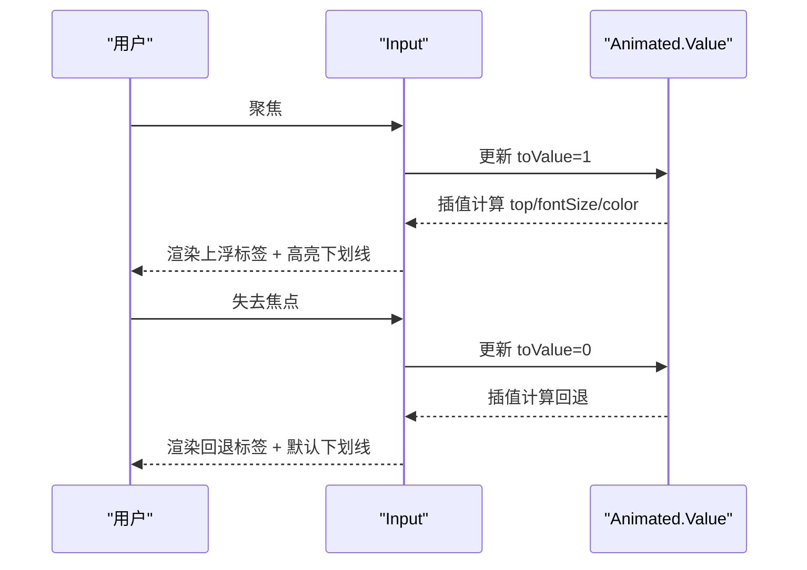
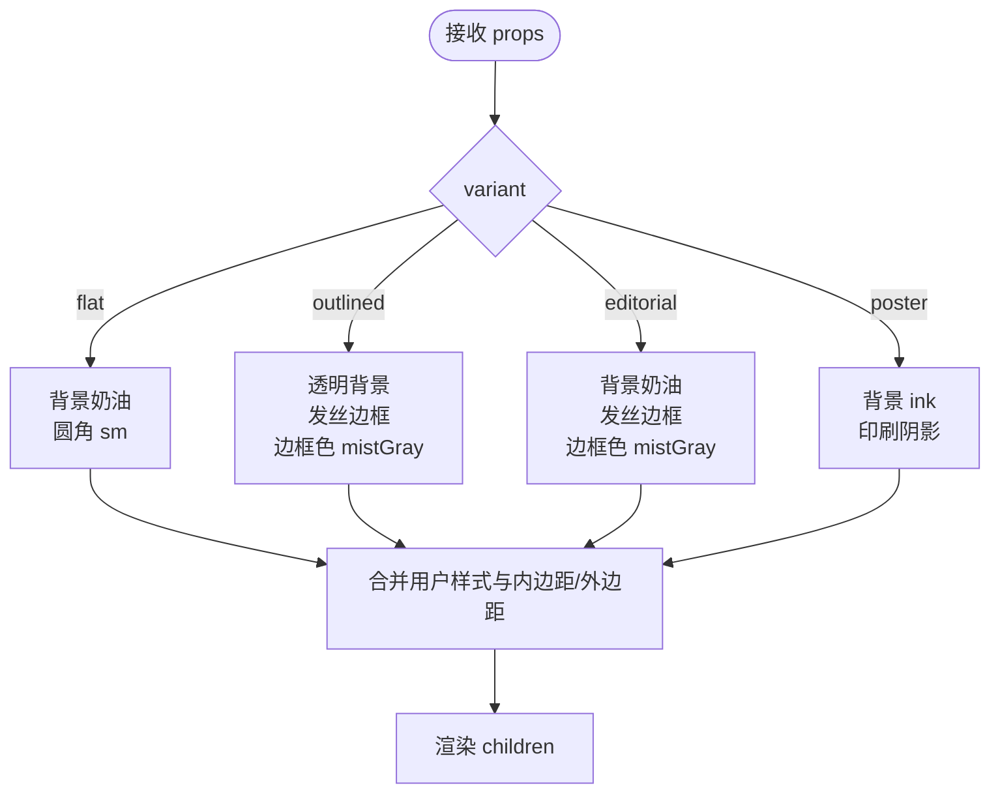
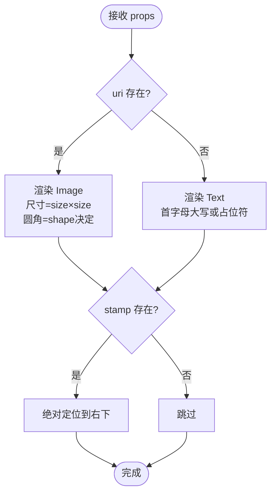
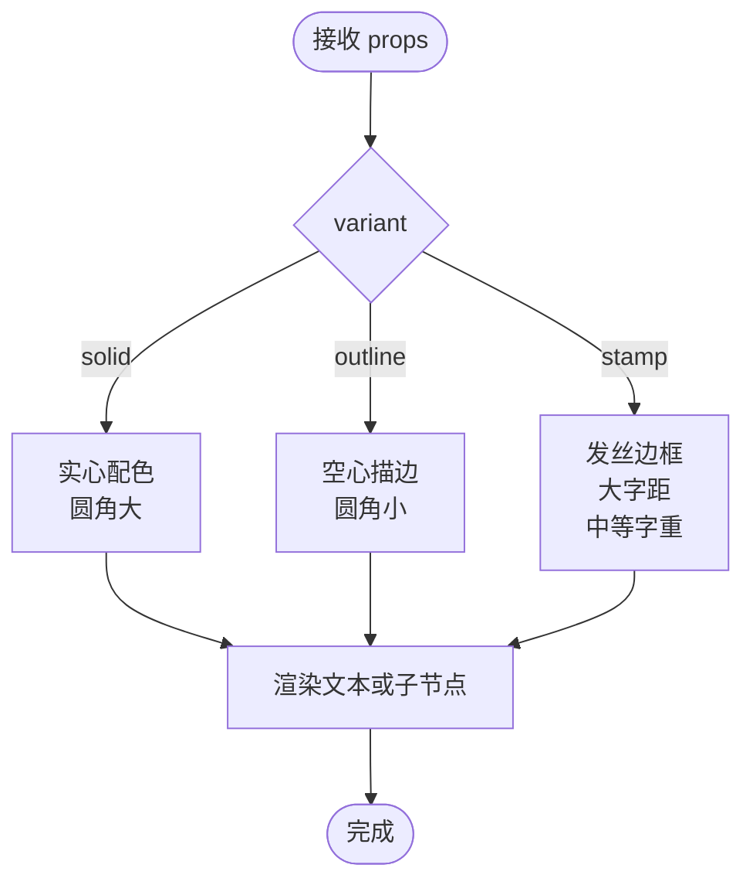
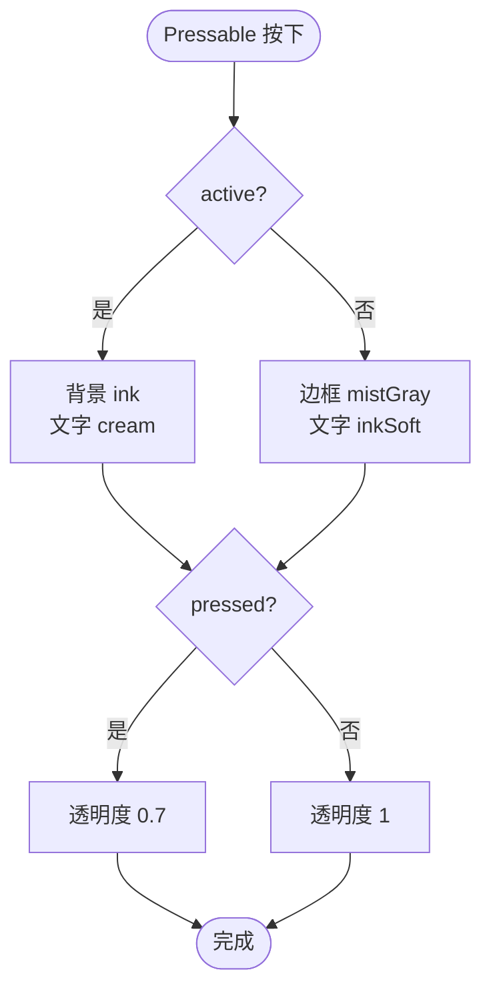
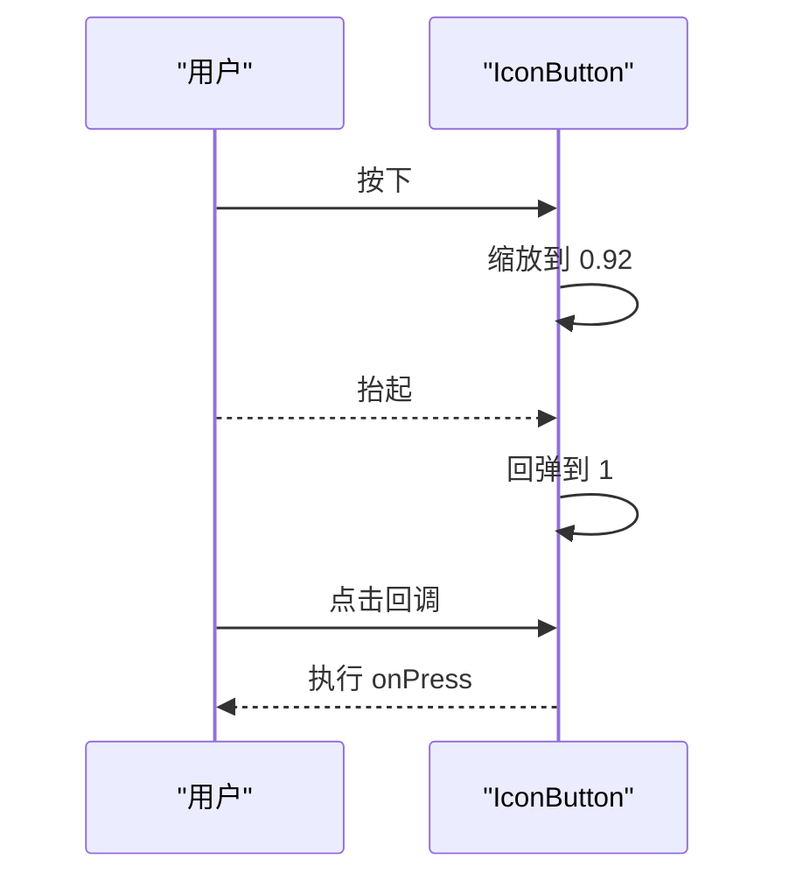
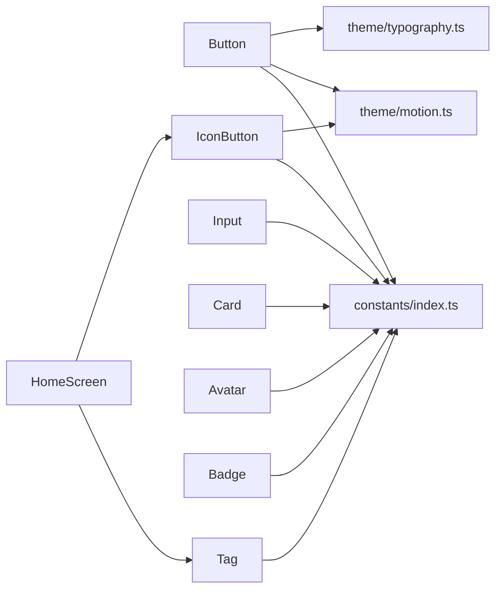

# 基础组件

<cite>
**本文档引用的文件**
- [Button.tsx](file://FreeDressApp/src/components/Button.tsx)
- [Input.tsx](file://FreeDressApp/src/components/Input.tsx)
- [Card.tsx](file://FreeDressApp/src/components/Card.tsx)
- [Avatar.tsx](file://FreeDressApp/src/components/Avatar.tsx)
- [Badge.tsx](file://FreeDressApp/src/components/Badge.tsx)
- [Tag.tsx](file://FreeDressApp/src/components/Tag.tsx)
- [IconButton.tsx](file://FreeDressApp/src/components/IconButton.tsx)
- [index.ts](file://FreeDressApp/src/components/index.ts)
- [index.ts](file://FreeDressApp/src/constants/index.ts)
- [motion.ts](file://FreeDressApp/src/theme/motion.ts)
- [typography.ts](file://FreeDressApp/src/theme/typography.ts)
- [HomeScreen.tsx](file://FreeDressApp/src/screens/HomeScreen.tsx)
</cite>

## 目录
1. [简介](#简介)
2. [项目结构](#项目结构)
3. [核心组件](#核心组件)
4. [架构总览](#架构总览)
5. [详细组件分析](#详细组件分析)
6. [依赖分析](#依赖分析)
7. [性能考量](#性能考量)
8. [故障排查指南](#故障排查指南)
9. [结论](#结论)
10. [附录](#附录)

## 简介
本文件面向畅搭(FreeDress)应用的基础UI组件，系统性梳理并说明以下组件的设计与实现要点：
- Button 按钮：变体设计、尺寸规格、交互状态与动效反馈
- Input 输入：验证机制、错误提示与浮动标签
- Card 卡片：内容布局、边框与阴影、背景与圆角
- Avatar 头像：图片加载、占位符与尺寸适配
- Badge 徽章：标签显示、颜色方案与定位
- Tag 标签：动态标签、删除功能与样式定制
- IconButton 图标按钮：尺寸比例、颜色主题与无障碍支持

同时提供 Props 接口定义、使用示例路径、最佳实践以及组件间组合与样式继承关系。

## 项目结构
基础组件集中于 src/components 目录，并通过统一出口导出；设计令牌与主题位于 constants 与 theme 目录；实际业务页面（如首页）展示了组件的组合使用方式。

图表来源
- [index.ts:6-18](file://FreeDressApp/src/components/index.ts#L6-L18)
- [index.ts:15-174](file://FreeDressApp/src/constants/index.ts#L15-L174)
- [motion.ts:1-32](file://FreeDressApp/src/theme/motion.ts#L1-L32)
- [typography.ts:108-114](file://FreeDressApp/src/theme/typography.ts#L108-L114)
- [HomeScreen.tsx:31-33](file://FreeDressApp/src/screens/HomeScreen.tsx#L31-L33)

章节来源
- [index.ts:6-18](file://FreeDressApp/src/components/index.ts#L6-L18)
- [index.ts:15-174](file://FreeDressApp/src/constants/index.ts#L15-L174)

## 核心组件
本节概览各组件的关键能力与设计取舍，便于快速查阅与对比。

- Button：提供 solid/outline/ghost/link/inverse 五种变体，支持 caramel/ink/cream/orange(gray/red/blue) 多色彩方案，内置按压缩放动效、加载态与禁用态，支持左右装饰槽与块级宽度。
- Input：支持 outline/underline/filled 三种外观，浮动标签动画，聚焦时下划线颜色可配置，错误态具备错误文本提示。
- Card：提供 flat/outlined/editorial/poster 四种变体，兼容旧版圆角/内边距/外边距/背景/溢出等 API，统一阴影与边框策略。
- Avatar：圆形/方形头像，支持占位字符与边框，右下角可叠加徽标。
- Badge：solid/outline/stamp 三种变体，支持自定义背景/文字颜色、圆角与内边距，特殊字距与大小写处理。
- Tag：胶囊标签，active/inactive 两种状态，支持尺寸与按压反馈。
- IconButton：圆形/方形图标按钮，多变体配色，按压缩放动效，禁用态与尺寸控制。

章节来源
- [Button.tsx:1-201](file://FreeDressApp/src/components/Button.tsx#L1-L201)
- [Input.tsx:1-183](file://FreeDressApp/src/components/Input.tsx#L1-L183)
- [Card.tsx:1-124](file://FreeDressApp/src/components/Card.tsx#L1-L124)
- [Avatar.tsx:1-93](file://FreeDressApp/src/components/Avatar.tsx#L1-L93)
- [Badge.tsx:1-124](file://FreeDressApp/src/components/Badge.tsx#L1-L124)
- [Tag.tsx:1-91](file://FreeDressApp/src/components/Tag.tsx#L1-L91)
- [IconButton.tsx:1-126](file://FreeDressApp/src/components/IconButton.tsx#L1-L126)

## 架构总览
组件与主题/常量的关系如下：

图表来源
- [Button.tsx:20-23](file://FreeDressApp/src/components/Button.tsx#L20-L23)
- [Input.tsx:18-19](file://FreeDressApp/src/components/Input.tsx#L18-L19)
- [Card.tsx](file://FreeDressApp/src/components/Card.tsx#L8)
- [Avatar.tsx](file://FreeDressApp/src/components/Avatar.tsx#L7)
- [Badge.tsx](file://FreeDressApp/src/components/Badge.tsx#L7)
- [Tag.tsx:13-20](file://FreeDressApp/src/components/Tag.tsx#L13-L20)
- [IconButton.tsx:13-14](file://FreeDressApp/src/components/IconButton.tsx#L13-L14)
- [index.ts:15-174](file://FreeDressApp/src/constants/index.ts#L15-L174)
- [motion.ts:21-24](file://FreeDressApp/src/theme/motion.ts#L21-L24)
- [typography.ts:108-114](file://FreeDressApp/src/theme/typography.ts#L108-L114)

## 详细组件分析

### Button 按钮
- 变体与配色
  - 变体：solid、outline、ghost、link、inverse
  - 配色：caramel、ink、cream、orange（映射至 caramel）、gray（映射至 ink）、red（映射至 caramel）、blue（映射至 ink）
  - 链接变体带下划线
- 尺寸
  - sm：较小内边距与字号
  - md：默认内边距与字号
  - lg：较大内边距与字号
- 交互状态
  - 按压缩放（0.97），禁用态半透明
  - 加载态显示小型指示器，禁用态不可交互
- 插槽
  - leftSlot/rightSlot 支持装饰元素（如箭头）
- 样式继承
  - 文本样式来自 buttonTextStyle，包含字距与大写转换
  - 部分变体结合阴影（如 ink-solid 使用海报阴影）

图表来源
- [Button.tsx:73-78](file://FreeDressApp/src/components/Button.tsx#L73-L78)
- [Button.tsx:102-122](file://FreeDressApp/src/components/Button.tsx#L102-L122)

章节来源
- [Button.tsx:25-45](file://FreeDressApp/src/components/Button.tsx#L25-L45)
- [Button.tsx:135-167](file://FreeDressApp/src/components/Button.tsx#L135-L167)
- [Button.tsx:169-178](file://FreeDressApp/src/components/Button.tsx#L169-L178)
- [Button.tsx:180-200](file://FreeDressApp/src/components/Button.tsx#L180-L200)
- [typography.ts:108-114](file://FreeDressApp/src/theme/typography.ts#L108-L114)
- [index.ts:126-156](file://FreeDressApp/src/constants/index.ts#L126-L156)

使用示例与最佳实践
- 示例路径：[Button 使用示例:31-33](file://FreeDressApp/src/screens/HomeScreen.tsx#L31-L33)
- 最佳实践
  - 重要操作优先使用 solid/ink 或 solid/caramel
  - 链接类操作使用 link 变体并配合下划线
  - 长列表中的按钮建议使用 md 尺寸，避免过度拥挤
  - 合理使用 leftSlot/rightSlot 提升信息密度

### Input 输入
- 变体
  - outline：带边框与圆角
  - underline：杂志风单根细线，聚焦时颜色可配置
  - filled：填充背景
- 浮动标签
  - 聚焦或有值时上浮，使用插值计算位置、字号与颜色
- 错误态
  - error=true 时使用 errorBorderColor，显示 errorMessage 文本
- 样式继承
  - 文本颜色统一为 ink，占位符弱化

图表来源
- [Input.tsx:49-59](file://FreeDressApp/src/components/Input.tsx#L49-L59)
- [Input.tsx:67-78](file://FreeDressApp/src/components/Input.tsx#L67-L78)
- [Input.tsx:113-121](file://FreeDressApp/src/components/Input.tsx#L113-L121)

章节来源
- [Input.tsx:21-31](file://FreeDressApp/src/components/Input.tsx#L21-L31)
- [Input.tsx:61-78](file://FreeDressApp/src/components/Input.tsx#L61-L78)
- [Input.tsx:142-182](file://FreeDressApp/src/components/Input.tsx#L142-L182)

使用示例与最佳实践
- 示例路径：[Input 使用示例:31-33](file://FreeDressApp/src/screens/HomeScreen.tsx#L31-L33)
- 最佳实践
  - 重要表单项建议使用 underline 或 outline，确保足够的视觉反馈
  - 错误态必须同时设置 error 与 errorMessage，保证可访问性
  - 浮动标签适用于需要明确语义的场景，避免过度使用导致信息冗余

### Card 卡片
- 变体
  - flat：奶油背景 + 小圆角
  - outlined：透明背景 + 发丝边框 + 发丝边框色
  - editorial：奶油背景 + 发丝边框 + 发丝边框色（默认）
  - poster：暖黑背景 + 印刷阴影
- 样式继承
  - 支持 bg、borderRadius、padding、margin、overflow 等属性透传
  - 旧版 API 兼容：borderRadius/padding/margin/bg/overflow

图表来源
- [Card.tsx:92-121](file://FreeDressApp/src/components/Card.tsx#L92-L121)

章节来源
- [Card.tsx:10-33](file://FreeDressApp/src/components/Card.tsx#L10-L33)
- [Card.tsx:56-90](file://FreeDressApp/src/components/Card.tsx#L56-L90)
- [Card.tsx:92-121](file://FreeDressApp/src/components/Card.tsx#L92-L121)

使用示例与最佳实践
- 示例路径：[Card 使用示例:31-33](file://FreeDressApp/src/screens/HomeScreen.tsx#L31-L33)
- 最佳实践
  - 内容区域建议使用 editorial 或 poster 变体以突出层次
  - 列表卡片建议使用 outlined 以降低视觉重量
  - poster 变体适合强信息区块，注意阴影对性能的影响

### Avatar 头像
- 形状
  - circle：半径为 size/2
  - square：使用小圆角
- 图片加载
  - uri 存在时渲染 Image，否则显示 fallback 字符
- 徽标
  - stamp 支持右下角叠加徽章
- 样式继承
  - 占位符使用 serif 字体与弱化颜色

图表来源
- [Avatar.tsx:48-68](file://FreeDressApp/src/components/Avatar.tsx#L48-L68)

章节来源
- [Avatar.tsx:9-19](file://FreeDressApp/src/components/Avatar.tsx#L9-L19)
- [Avatar.tsx:31-71](file://FreeDressApp/src/components/Avatar.tsx#L31-L71)
- [Avatar.tsx:73-93](file://FreeDressApp/src/components/Avatar.tsx#L73-L93)

使用示例与最佳实践
- 示例路径：[Avatar 使用示例:31-33](file://FreeDressApp/src/screens/HomeScreen.tsx#L31-L33)
- 最佳实践
  - 头像尺寸建议在 40–80 之间，兼顾信息密度与可读性
  - 徽标仅在必要时启用，避免干扰主体

### Badge 徽章
- 变体
  - solid：实心配色，圆角较大
  - outline：空心描边，适合弱提示
  - stamp：带发丝边框与大字距，强调视觉权重
- 样式继承
  - 支持 bg/color/borderRadius/px/py 自定义
  - stamp 变体采用中等字重与大字距

图表来源
- [Badge.tsx:77-111](file://FreeDressApp/src/components/Badge.tsx#L77-L111)

章节来源
- [Badge.tsx:11-21](file://FreeDressApp/src/components/Badge.tsx#L11-L21)
- [Badge.tsx:34-75](file://FreeDressApp/src/components/Badge.tsx#L34-L75)
- [Badge.tsx:77-111](file://FreeDressApp/src/components/Badge.tsx#L77-L111)
- [Badge.tsx:113-124](file://FreeDressApp/src/components/Badge.tsx#L113-L124)

使用示例与最佳实践
- 示例路径：[Badge 使用示例:31-33](file://FreeDressApp/src/screens/HomeScreen.tsx#L31-L33)
- 最佳实践
  - 重要通知使用 solid 或 stamp，次要提示使用 outline
  - stamp 适合短文本或数字，避免过长内容

### Tag 标签
- 状态
  - active：实心 ink，强调选中
  - inactive：仅发丝边框，弱化状态
- 交互
  - 支持 onPress 与 disabled
  - 按压反馈通过 pressed 状态调整透明度
- 尺寸
  - sm：紧凑内边距与较小字号
  - md：默认内边距与字号

图表来源
- [Tag.tsx:49-59](file://FreeDressApp/src/components/Tag.tsx#L49-L59)

章节来源
- [Tag.tsx:22-30](file://FreeDressApp/src/components/Tag.tsx#L22-L30)
- [Tag.tsx:40-75](file://FreeDressApp/src/components/Tag.tsx#L40-L75)
- [Tag.tsx:77-91](file://FreeDressApp/src/components/Tag.tsx#L77-L91)

使用示例与最佳实践
- 示例路径：[Tag 使用示例](file://FreeDressApp/src/screens/HomeScreen.tsx#L344)
- 最佳实践
  - 作为筛选条件时建议使用 active 状态突出当前选择
  - 多个 Tag 并列时注意间距与换行策略

### IconButton 图标按钮
- 变体
  - ghost：透明背景
  - outline：发丝边框
  - solid：实心 ink
  - inverse：实心 cream
  - caramel：实心 caramel
- 尺寸
  - buttonSize 控制整体尺寸，size 控制图标尺寸
- 交互
  - 按压缩放 0.92，禁用态半透明
- 样式继承
  - 圆形：borderRadius=full；方形：borderRadius=sm

图表来源
- [IconButton.tsx:52-57](file://FreeDressApp/src/components/IconButton.tsx#L52-L57)

章节来源
- [IconButton.tsx:16-27](file://FreeDressApp/src/components/IconButton.tsx#L16-L27)
- [IconButton.tsx:31-76](file://FreeDressApp/src/components/IconButton.tsx#L31-L76)
- [IconButton.tsx:78-117](file://FreeDressApp/src/components/IconButton.tsx#L78-L117)
- [IconButton.tsx:119-126](file://FreeDressApp/src/components/IconButton.tsx#L119-L126)
- [motion.ts:21-24](file://FreeDressApp/src/theme/motion.ts#L21-L24)

使用示例与最佳实践
- 示例路径：[IconButton 使用示例:289-298](file://FreeDressApp/src/screens/HomeScreen.tsx#L289-L298)
- 最佳实践
  - 重要操作优先使用 solid 或 inverse，弱操作使用 ghost
  - 图标尺寸与按钮尺寸需协调，避免视觉拥挤

## 依赖分析
- 组件到常量
  - COLORS、SPACING、RADIUS、FONT_SIZES、SHADOWS、HAIRLINE
- 组件到主题
  - Button、IconButton 使用 fastTransition 进行动效
  - Button 使用 buttonTextStyle 统一按钮文本排版
- 组件到其他组件
  - HomeScreen 中 Tag 与 IconButton 在卡片中组合使用

图表来源
- [Button.tsx:20-23](file://FreeDressApp/src/components/Button.tsx#L20-L23)
- [IconButton.tsx:13-14](file://FreeDressApp/src/components/IconButton.tsx#L13-L14)
- [Input.tsx:18-19](file://FreeDressApp/src/components/Input.tsx#L18-L19)
- [Card.tsx](file://FreeDressApp/src/components/Card.tsx#L8)
- [Avatar.tsx](file://FreeDressApp/src/components/Avatar.tsx#L7)
- [Badge.tsx](file://FreeDressApp/src/components/Badge.tsx#L7)
- [Tag.tsx:13-20](file://FreeDressApp/src/components/Tag.tsx#L13-L20)
- [index.ts:15-174](file://FreeDressApp/src/constants/index.ts#L15-L174)
- [motion.ts:21-24](file://FreeDressApp/src/theme/motion.ts#L21-L24)
- [typography.ts:108-114](file://FreeDressApp/src/theme/typography.ts#L108-L114)
- [HomeScreen.tsx:31-33](file://FreeDressApp/src/screens/HomeScreen.tsx#L31-L33)

章节来源
- [index.ts:6-18](file://FreeDressApp/src/components/index.ts#L6-L18)
- [index.ts:15-174](file://FreeDressApp/src/constants/index.ts#L15-L174)
- [motion.ts:1-32](file://FreeDressApp/src/theme/motion.ts#L1-L32)
- [typography.ts:108-114](file://FreeDressApp/src/theme/typography.ts#L108-L114)
- [HomeScreen.tsx:31-33](file://FreeDressApp/src/screens/HomeScreen.tsx#L31-L33)

## 性能考量
- 动画与动效
  - Button 与 IconButton 使用轻量级缩放动效，时长与缓动由主题统一管理，避免过度复杂动画影响滚动性能
- 图片与渲染
  - Avatar 在无 uri 时仅渲染单个 Text 节点，减少不必要的 Image 组件开销
- 样式计算
  - Input 的浮动标签使用插值计算，建议避免在高频滚动列表中频繁切换错误态
- 阴影与层级
  - Card 的 poster 变体带有阴影，建议在大量卡片场景中谨慎使用，避免过度绘制

## 故障排查指南
- Button
  - 现象：按压无反馈
    - 检查 disabled 与 isLoading 状态是否被意外置位
    - 确认 fastTransition 是否正确引入
  - 现象：链接变体无下划线
    - 检查 variant 是否为 link
- Input
  - 现象：浮动标签不出现
    - 检查是否设置了 label，且初始值为空时仍应触发上浮
  - 现象：错误态颜色异常
    - 检查 error 与 errorBorderColor 是否同时设置
- Card
  - 现象：阴影不生效
    - 检查 variant 是否为 poster，且平台支持阴影
- Avatar
  - 现象：占位符未显示
    - 检查 fallback 是否存在，或 uri 是否为空
- Badge
  - 现象：stamp 字体与字距异常
    - 检查 variant 是否为 stamp
- Tag
  - 现象：点击无响应
    - 检查 disabled 与 onPress 是否同时满足
- IconButton
  - 现象：图标颜色与背景不匹配
    - 检查 variant 对应的颜色配置

章节来源
- [Button.tsx:73-78](file://FreeDressApp/src/components/Button.tsx#L73-L78)
- [Button.tsx:123-131](file://FreeDressApp/src/components/Button.tsx#L123-L131)
- [Input.tsx:113-121](file://FreeDressApp/src/components/Input.tsx#L113-L121)
- [Input.tsx:135-137](file://FreeDressApp/src/components/Input.tsx#L135-L137)
- [Card.tsx:106-111](file://FreeDressApp/src/components/Card.tsx#L106-L111)
- [Avatar.tsx:57-66](file://FreeDressApp/src/components/Avatar.tsx#L57-L66)
- [Badge.tsx:89-98](file://FreeDressApp/src/components/Badge.tsx#L89-L98)
- [Tag.tsx:47-48](file://FreeDressApp/src/components/Tag.tsx#L47-L48)
- [IconButton.tsx:78-117](file://FreeDressApp/src/components/IconButton.tsx#L78-L117)

## 结论
本组件库围绕“编辑级排版”与“邮政单色”的设计语言，提供了高内聚、低耦合的基础 UI 组件。通过统一的主题与常量体系，组件在视觉与交互上保持一致；通过合理的 Props 设计与动效策略，在可用性与性能之间取得平衡。建议在业务开发中遵循本文档的最佳实践，结合 HomeScreen 的组合示例，构建一致、高效且可维护的界面。

## 附录
- 组件导出入口：components/index.ts
- 设计令牌与主题：constants/index.ts、theme/motion.ts、theme/typography.ts
- 页面示例：screens/HomeScreen.tsx 展示了 Tag 与 IconButton 的组合使用

章节来源
- [index.ts:6-18](file://FreeDressApp/src/components/index.ts#L6-L18)
- [index.ts:15-174](file://FreeDressApp/src/constants/index.ts#L15-L174)
- [motion.ts:1-32](file://FreeDressApp/src/theme/motion.ts#L1-L32)
- [typography.ts:108-114](file://FreeDressApp/src/theme/typography.ts#L108-L114)
- [HomeScreen.tsx](file://FreeDressApp/src/screens/HomeScreen.tsx#L344)