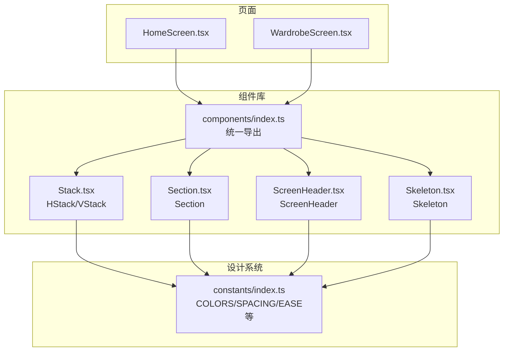
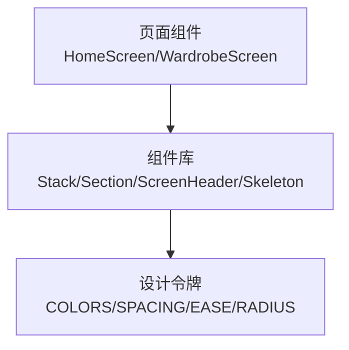
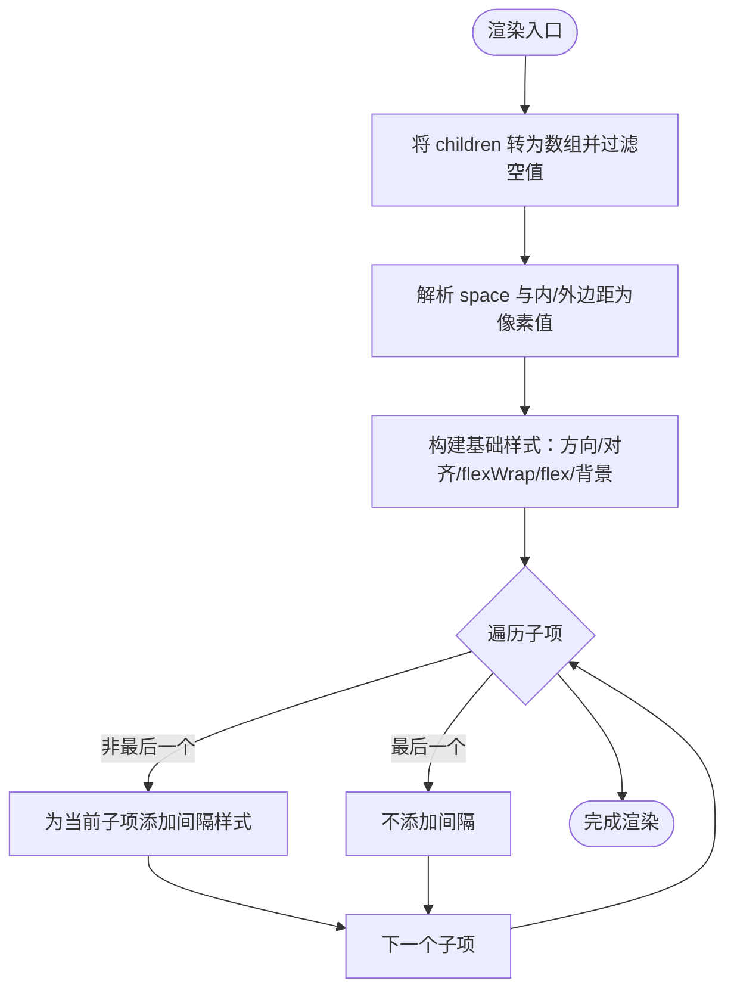
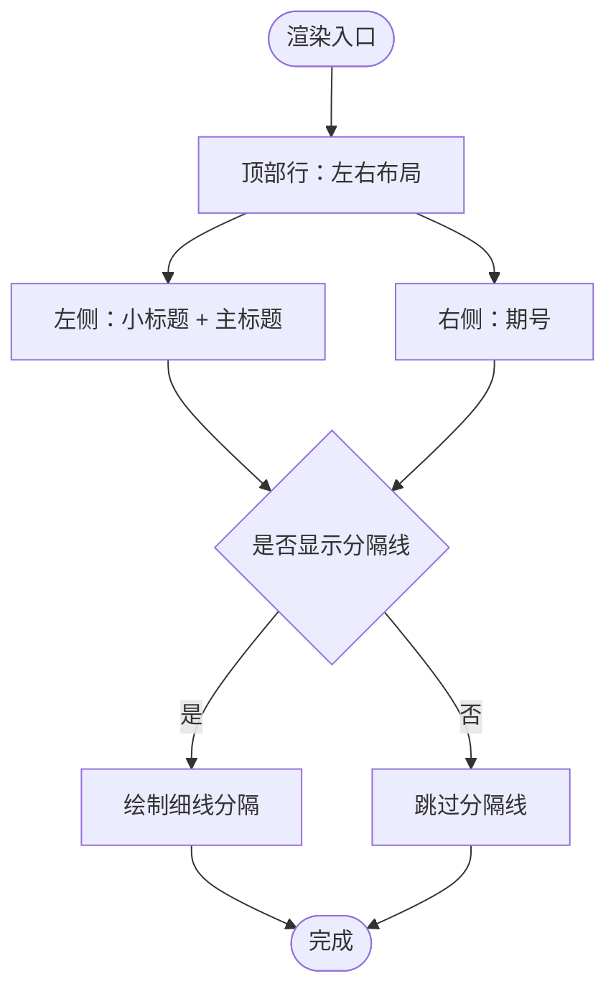
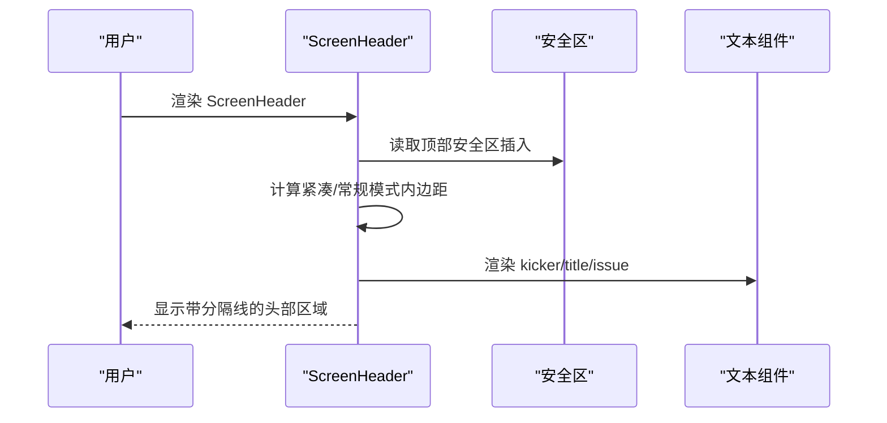
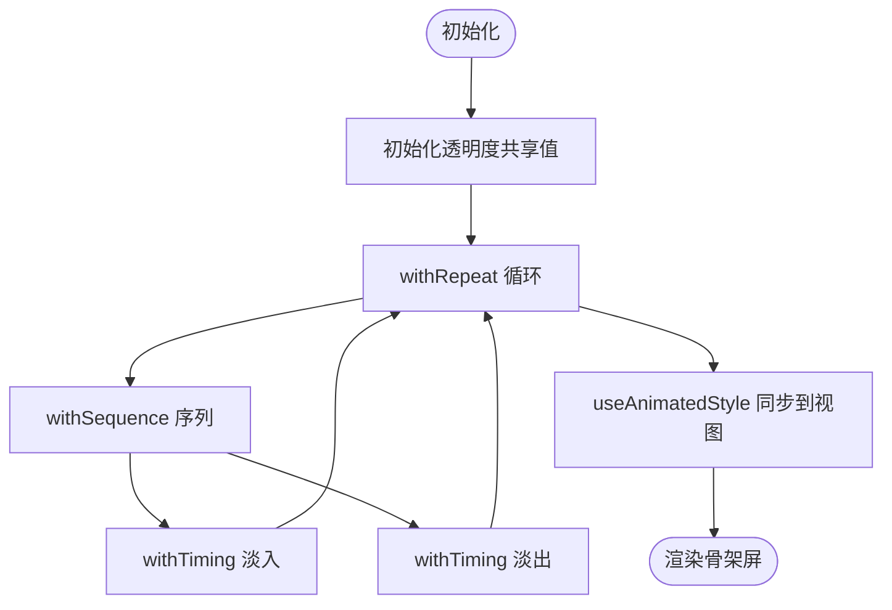
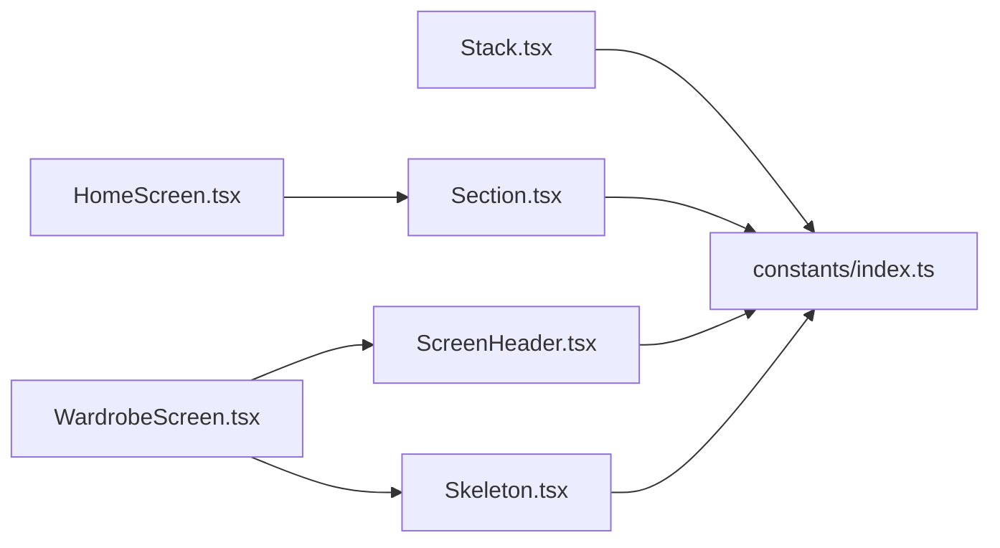

# 布局组件

<cite>
**本文档引用的文件**
- [Stack.tsx](file://FreeDressApp/src/components/Stack.tsx)
- [Section.tsx](file://FreeDressApp/src/components/Section.tsx)
- [ScreenHeader.tsx](file://FreeDressApp/src/components/ScreenHeader.tsx)
- [Skeleton.tsx](file://FreeDressApp/src/components/Skeleton.tsx)
- [index.ts（组件导出）](file://FreeDressApp/src/components/index.ts)
- [index.ts（常量）](file://FreeDressApp/src/constants/index.ts)
- [HomeScreen.tsx](file://FreeDressApp/src/screens/HomeScreen.tsx)
- [WardrobeScreen.tsx](file://FreeDressApp/src/screens/WardrobeScreen.tsx)
</cite>

## 目录
1. [简介](#简介)
2. [项目结构](#项目结构)
3. [核心组件](#核心组件)
4. [架构总览](#架构总览)
5. [详细组件分析](#详细组件分析)
6. [依赖关系分析](#依赖关系分析)
7. [性能考量](#性能考量)
8. [故障排查指南](#故障排查指南)
9. [结论](#结论)
10. [附录](#附录)

## 简介
本文件聚焦畅搭(FreeDress)应用中的布局相关UI组件，系统性梳理以下组件的设计理念、实现细节与最佳实践：
- HStack/VStack 堆叠布局：方向控制、间距体系、对齐方式与响应式适配
- Section 区域组件：内容分组、标题显示与分隔线
- ScreenHeader 屏幕头部：导航元素、标题样式与背景设计
- Skeleton 骨架屏：加载动画、形状定制与性能优化

同时给出组件在不同屏幕尺寸下的适配方案、嵌套使用建议、动画与过渡效果以及用户体验优化策略。

## 项目结构
布局组件位于前端工程的组件库模块中，并通过统一出口导出，供各页面按需引入使用。常量与设计令牌集中管理，确保组件在全局范围内保持一致的间距、色彩与动效风格。

**图表来源**
- [index.ts（组件导出）:1-32](file://FreeDressApp/src/components/index.ts#L1-L32)
- [Stack.tsx:1-155](file://FreeDressApp/src/components/Stack.tsx#L1-L155)
- [Section.tsx:1-68](file://FreeDressApp/src/components/Section.tsx#L1-L68)
- [ScreenHeader.tsx:1-95](file://FreeDressApp/src/components/ScreenHeader.tsx#L1-L95)
- [Skeleton.tsx:1-63](file://FreeDressApp/src/components/Skeleton.tsx#L1-L63)
- [index.ts（常量）:1-212](file://FreeDressApp/src/constants/index.ts#L1-L212)

**章节来源**
- [index.ts（组件导出）:1-32](file://FreeDressApp/src/components/index.ts#L1-L32)
- [index.ts（常量）:1-212](file://FreeDressApp/src/constants/index.ts#L1-L212)

## 核心组件
- HStack/VStack：基于React Native的View容器，提供横向/纵向堆叠布局能力，内置统一的间距解析与对齐控制，支持flex、flexWrap、背景色等通用属性。
- Section：用于内容分区的标题组件，支持左侧小标题+中部主标题+右侧期号的三段式布局与可选分隔线。
- ScreenHeader：页面头部容器，支持左右插槽、期号展示与可选分隔线，内置安全区适配与紧凑模式。
- Skeleton：基于Reanimated的骨架屏组件，提供柔和闪烁动画与可定制的宽高、圆角。

**章节来源**
- [Stack.tsx:1-155](file://FreeDressApp/src/components/Stack.tsx#L1-L155)
- [Section.tsx:1-68](file://FreeDressApp/src/components/Section.tsx#L1-L68)
- [ScreenHeader.tsx:1-95](file://FreeDressApp/src/components/ScreenHeader.tsx#L1-L95)
- [Skeleton.tsx:1-63](file://FreeDressApp/src/components/Skeleton.tsx#L1-L63)

## 架构总览
组件间通过统一的常量与设计令牌进行解耦，页面通过组件库统一出口导入，形成清晰的“页面-组件-设计系统”三层架构。

**图表来源**
- [HomeScreen.tsx:1-606](file://FreeDressApp/src/screens/HomeScreen.tsx#L1-L606)
- [WardrobeScreen.tsx:1-423](file://FreeDressApp/src/screens/WardrobeScreen.tsx#L1-L423)
- [index.ts（常量）:1-212](file://FreeDressApp/src/constants/index.ts#L1-L212)

## 详细组件分析

### HStack/VStack 堆叠布局
- 方向控制：HStack使用横向布局，VStack使用纵向布局，均通过样式对象统一注入。
- 间距设置：支持space与多方向内/外边距快捷属性（mb/mt/ml/mr/mx/my/px/py等），内部统一解析为像素值，保证与4px网格对齐。
- 对齐方式：支持alignItems与justifyContent的完整集合，满足多样化的对齐需求。
- 背景与弹性：支持bg（背景色）、flex、flexWrap等，便于在复杂布局中灵活组合。
- 渲染逻辑：将子节点转为数组并过滤空值，按索引在非末尾子项后添加间隔，避免重复计算与多余节点。

**图表来源**
- [Stack.tsx:63-145](file://FreeDressApp/src/components/Stack.tsx#L63-L145)

**章节来源**
- [Stack.tsx:1-155](file://FreeDressApp/src/components/Stack.tsx#L1-L155)
- [index.ts（常量）:99-115](file://FreeDressApp/src/constants/index.ts#L99-L115)

### Section 区域组件
- 内容分组：采用左右两列布局，左侧容纳小标题与主标题，右侧展示期号；底部可选分隔线。
- 标题显示：通过专用文本组件承载不同语义的标题层级，保证排版一致性。
- 折叠功能：组件本身不包含折叠状态，但可通过外部条件渲染或配合上层容器实现折叠/展开。

**图表来源**
- [Section.tsx:22-43](file://FreeDressApp/src/components/Section.tsx#L22-L43)

**章节来源**
- [Section.tsx:1-68](file://FreeDressApp/src/components/Section.tsx#L1-L68)

### ScreenHeader 屏幕头部
- 导航元素：支持leftSlot与rightSlot插槽，便于放置返回、菜单、操作按钮等。
- 标题样式：主标题采用专用标题组件，期号采用等宽文本，整体呈现杂志风格。
- 背景设计：容器具备内边距与背景色，底部可选分隔线。
- 安全区适配：自动读取安全区插入，紧凑模式下减少顶部/底部留白，提升信息密度。

**图表来源**
- [ScreenHeader.tsx:29-64](file://FreeDressApp/src/components/ScreenHeader.tsx#L29-L64)

**章节来源**
- [ScreenHeader.tsx:1-95](file://FreeDressApp/src/components/ScreenHeader.tsx#L1-L95)

### Skeleton 骨架屏
- 加载动画：使用共享值驱动的循环序列动画，实现柔和闪烁效果，时长与缓动由设计令牌统一管理。
- 形状定制：支持width、height与borderRadius，满足卡片、列表项等不同占位形态。
- 性能优化：基于Reanimated的硬件加速动画，避免主线程阻塞；默认使用较浅的背景色与较小圆角，降低视觉噪点。

**图表来源**
- [Skeleton.tsx:23-56](file://FreeDressApp/src/components/Skeleton.tsx#L23-L56)

**章节来源**
- [Skeleton.tsx:1-63](file://FreeDressApp/src/components/Skeleton.tsx#L1-L63)
- [index.ts（常量）:159-171](file://FreeDressApp/src/constants/index.ts#L159-L171)

## 依赖关系分析
- 组件依赖设计令牌：HStack/VStack依赖SPACING网格；Section/ScreenHeader依赖COLORS、SPACING、HAIRLINE；Skeleton依赖COLORS、RADIUS、EASE。
- 页面集成：HomeScreen与WardrobeScreen分别展示了Section与ScreenHeader的典型用法，WardrobeScreen还演示了Skeleton在加载态的使用。

**图表来源**
- [Stack.tsx:1-155](file://FreeDressApp/src/components/Stack.tsx#L1-L155)
- [Section.tsx:1-68](file://FreeDressApp/src/components/Section.tsx#L1-L68)
- [ScreenHeader.tsx:1-95](file://FreeDressApp/src/components/ScreenHeader.tsx#L1-L95)
- [Skeleton.tsx:1-63](file://FreeDressApp/src/components/Skeleton.tsx#L1-L63)
- [index.ts（常量）:1-212](file://FreeDressApp/src/constants/index.ts#L1-L212)
- [HomeScreen.tsx:1-606](file://FreeDressApp/src/screens/HomeScreen.tsx#L1-L606)
- [WardrobeScreen.tsx:1-423](file://FreeDressApp/src/screens/WardrobeScreen.tsx#L1-L423)

**章节来源**
- [index.ts（组件导出）:1-32](file://FreeDressApp/src/components/index.ts#L1-L32)
- [index.ts（常量）:1-212](file://FreeDressApp/src/constants/index.ts#L1-L212)

## 性能考量
- HStack/VStack
  - 使用统一的间距解析函数，避免重复计算；仅在非末尾子项添加间隔，减少样式合并次数。
  - 建议：在大量子项场景下，优先使用可复用的子组件并控制不必要的重渲染。
- Section
  - 无复杂动画，性能开销极低；建议在滚动列表中稳定复用。
- ScreenHeader
  - 依赖安全区计算，注意在深层嵌套容器中避免重复测量；紧凑模式可减少内边距以提升信息密度。
- Skeleton
  - 使用Reanimated硬件加速，适合在长列表或瀑布流中作为占位；建议根据内容密度调整高度与圆角，避免过度占用视觉空间。

[本节为通用性能建议，无需特定文件引用]

## 故障排查指南
- HStack/VStack 间距异常
  - 检查传入的space与内/外边距快捷属性是否使用了正确的SPACING键；确认resolveSpacing函数的返回值符合预期。
- Section 分隔线显示问题
  - 确认divider开关状态；检查容器padding与子项margin是否覆盖了分隔线区域。
- ScreenHeader 安全区留白异常
  - 确认useSafeAreaInsets返回值；检查父容器是否设置了额外的顶部内边距导致叠加。
- Skeleton 动画不生效
  - 确认Reanimated版本与useSharedValue/useAnimatedStyle正确使用；检查withRepeat/withSequence参数与EASE配置。

**章节来源**
- [Stack.tsx:39-61](file://FreeDressApp/src/components/Stack.tsx#L39-L61)
- [Section.tsx:62-66](file://FreeDressApp/src/components/Section.tsx#L62-L66)
- [ScreenHeader.tsx:39-50](file://FreeDressApp/src/components/ScreenHeader.tsx#L39-L50)
- [Skeleton.tsx:31-44](file://FreeDressApp/src/components/Skeleton.tsx#L31-L44)

## 结论
HStack/VStack提供了简洁高效的堆叠布局能力，结合统一的SPACING网格与对齐控制，能够快速搭建复杂的页面结构。Section与ScreenHeader分别承担内容分区与页面头部的职责，配合设计令牌实现了风格一致的视觉体验。Skeleton通过Reanimated实现流畅的加载动画，显著改善了用户的感知性能。建议在实际开发中遵循间距网格、安全区适配与动画一致性原则，以获得更佳的可用性与性能表现。

[本节为总结性内容，无需特定文件引用]

## 附录

### 响应式设计与嵌套使用建议
- 响应式适配
  - 利用HStack/VStack的flex与flexWrap属性，在窄屏设备上切换为纵向堆叠或换行布局；在宽屏设备上使用横向堆叠提升信息密度。
  - 结合页面容器的padding与gap，确保在不同屏幕宽度下保持一致的视觉节奏。
- 嵌套使用
  - 在复杂卡片中，先用VStack组织垂直信息流，再在需要横向排列的子项中使用HStack；避免过深嵌套导致样式冲突。
- 最佳实践
  - 优先使用SPACING网格进行间距控制，减少硬编码像素值；在需要强调的区域使用紧凑模式（如ScreenHeader的compact）。
  - 在长列表中使用Skeleton占位，结合合理的高度与圆角，平衡加载反馈与视觉负担。

[本节为通用指导，无需特定文件引用]

### 动画与过渡效果
- HStack/VStack：组件本身无动画，建议在上层容器或子项中使用Reanimated实现入场/退出动画。
- ScreenHeader：可在外层容器使用withTiming实现平滑的显隐过渡，结合EASE.editorial获得柔和的印刷风格动效。
- Skeleton：使用循环序列淡入淡出，时长与缓动由EASE.editorial统一管理，避免动画过于突兀。

**章节来源**
- [index.ts（常量）:159-171](file://FreeDressApp/src/constants/index.ts#L159-L171)

### 组件在页面中的实际应用
- HomeScreen：使用Section组织多个内容区块，展示“今日推荐”“风格电台”等模块。
- WardrobeScreen：使用ScreenHeader承载页面标题与期号，使用Skeleton在加载态渲染卡片占位。

**章节来源**
- [HomeScreen.tsx:209-261](file://FreeDressApp/src/screens/HomeScreen.tsx#L209-L261)
- [WardrobeScreen.tsx:113-129](file://FreeDressApp/src/screens/WardrobeScreen.tsx#L113-L129)
- [WardrobeScreen.tsx:201-213](file://FreeDressApp/src/screens/WardrobeScreen.tsx#L201-L213)