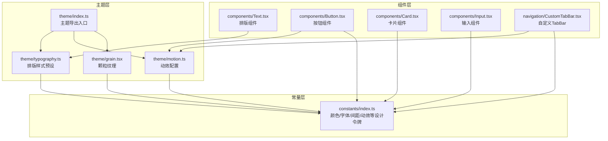
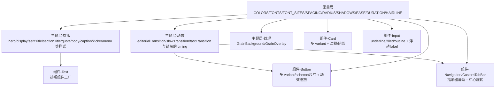
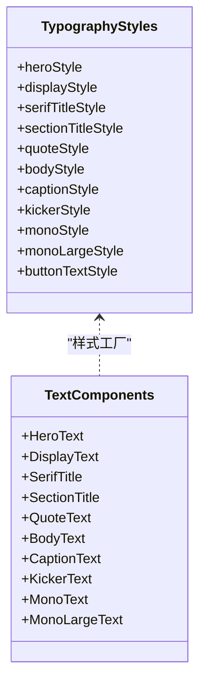
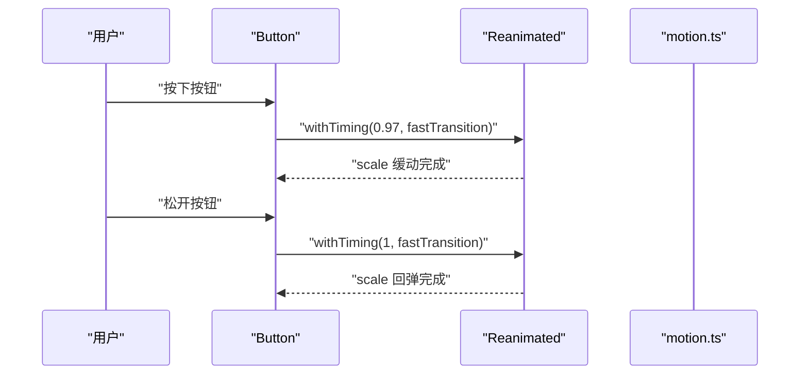
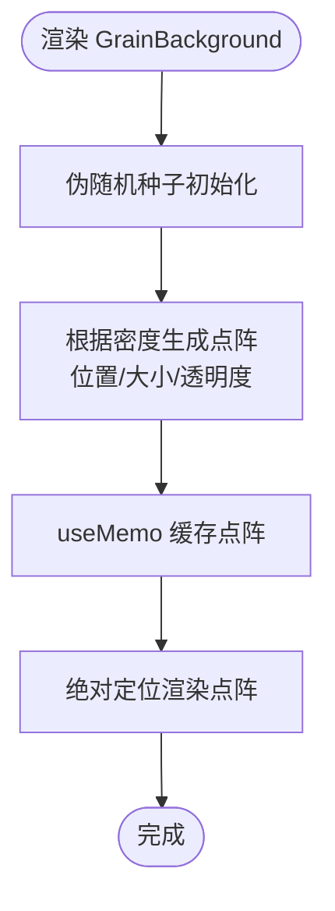
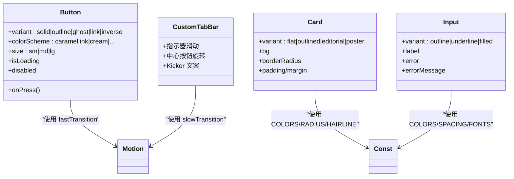
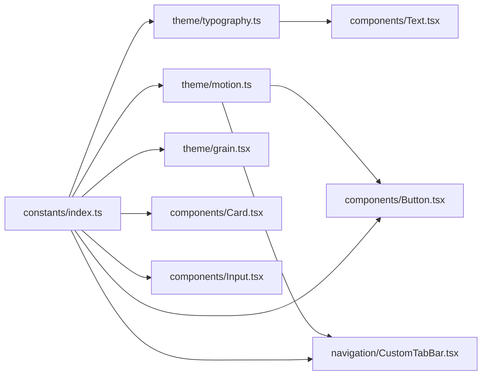

# 主题系统

<cite>
**本文档引用的文件**
- [FreeDressApp/src/theme/index.ts](file://FreeDressApp/src/theme/index.ts)
- [FreeDressApp/src/theme/typography.ts](file://FreeDressApp/src/theme/typography.ts)
- [FreeDressApp/src/theme/motion.ts](file://FreeDressApp/src/theme/motion.ts)
- [FreeDressApp/src/theme/grain.tsx](file://FreeDressApp/src/theme/grain.tsx)
- [FreeDressApp/src/constants/index.ts](file://FreeDressApp/src/constants/index.ts)
- [FreeDressApp/src/components/Text.tsx](file://FreeDressApp/src/components/Text.tsx)
- [FreeDressApp/src/components/Button.tsx](file://FreeDressApp/src/components/Button.tsx)
- [FreeDressApp/src/components/Card.tsx](file://FreeDressApp/src/components/Card.tsx)
- [FreeDressApp/src/components/Input.tsx](file://FreeDressApp/src/components/Input.tsx)
- [FreeDressApp/src/navigation/CustomTabBar.tsx](file://FreeDressApp/src/navigation/CustomTabBar.tsx)
- [FreeDressApp/DESIGN.md](file://FreeDressApp/DESIGN.md)
- [FreeDressApp/package.json](file://FreeDressApp/package.json)
</cite>

## 目录
1. [简介](#简介)
2. [项目结构](#项目结构)
3. [核心组件](#核心组件)
4. [架构总览](#架构总览)
5. [详细组件分析](#详细组件分析)
6. [依赖关系分析](#依赖关系分析)
7. [性能考量](#性能考量)
8. [故障排查指南](#故障排查指南)
9. [结论](#结论)
10. [附录](#附录)

## 简介
本主题系统围绕 Editorial Couture 设计语言构建，采用 Postal Monochromatic（邮政单色）与 Neo-minimalism（新极简主义）理念，以暖灰棕单色调为主，辅以烧赭点睛色，强调层次而非色彩拼接。系统通过统一的常量与主题层抽象，将颜色、字体、间距、圆角、阴影、动效与纹理进行解耦，形成可复用、可扩展的设计令牌体系。

## 项目结构
主题系统位于应用前端的 `src/theme` 目录，配合 `src/constants` 提供全局设计令牌，组件层通过导入主题模块实现一致的视觉与交互体验。

**图表来源**
- [FreeDressApp/src/theme/index.ts:1-7](file://FreeDressApp/src/theme/index.ts#L1-L7)
- [FreeDressApp/src/theme/typography.ts:1-115](file://FreeDressApp/src/theme/typography.ts#L1-L115)
- [FreeDressApp/src/theme/motion.ts:1-32](file://FreeDressApp/src/theme/motion.ts#L1-L32)
- [FreeDressApp/src/theme/grain.tsx:1-78](file://FreeDressApp/src/theme/grain.tsx#L1-L78)
- [FreeDressApp/src/constants/index.ts:1-212](file://FreeDressApp/src/constants/index.ts#L1-L212)
- [FreeDressApp/src/components/Text.tsx:1-68](file://FreeDressApp/src/components/Text.tsx#L1-L68)
- [FreeDressApp/src/components/Button.tsx:1-201](file://FreeDressApp/src/components/Button.tsx#L1-L201)
- [FreeDressApp/src/components/Card.tsx:1-124](file://FreeDressApp/src/components/Card.tsx#L1-L124)
- [FreeDressApp/src/components/Input.tsx:1-183](file://FreeDressApp/src/components/Input.tsx#L1-L183)
- [FreeDressApp/src/navigation/CustomTabBar.tsx:1-250](file://FreeDressApp/src/navigation/CustomTabBar.tsx#L1-L250)

**章节来源**
- [FreeDressApp/src/theme/index.ts:1-7](file://FreeDressApp/src/theme/index.ts#L1-L7)
- [FreeDressApp/src/constants/index.ts:1-212](file://FreeDressApp/src/constants/index.ts#L1-L212)

## 核心组件
- 颜色体系：以暖灰棕为主（ink/inkSoft/inkMuted/ecru/cream/paper），辅以烧赭（caramel/caramelDeep/caramelTint）与辅助色（sand/mistGray/clay/signal/jade），并提供兼容旧字段映射，保证向后兼容。
- 字体系统：Display（衬线）、Serif（章节标题）、Body（正文/按钮）、BodyMedium（强调/Kicker）、Mono（等宽）。字号采用“杂志感大字 + 紧凑正文”的尺度，行高与字距按语义与平台特性调整。
- 间距与圆角：4px 间距网格，圆角主用 0/4，避免过度圆润，契合新极简主义。
- 阴影：提供 press/card/poster 三种印刷感阴影，强调层次与触控反馈。
- 动效：统一的缓动曲线与时间配置，涵盖页面进入、列表错落、按钮按下、图标反馈、TabBar 指示器滑动等场景。
- 纹理：GrainBackground/GrainOverlay 使用伪随机生成的点阵叠加，模拟印刷颗粒，无额外依赖。

**章节来源**
- [FreeDressApp/src/constants/index.ts:15-52](file://FreeDressApp/src/constants/index.ts#L15-L52)
- [FreeDressApp/src/constants/index.ts:58-84](file://FreeDressApp/src/constants/index.ts#L58-L84)
- [FreeDressApp/src/constants/index.ts:87-97](file://FreeDressApp/src/constants/index.ts#L87-L97)
- [FreeDressApp/src/constants/index.ts:99-124](file://FreeDressApp/src/constants/index.ts#L99-L124)
- [FreeDressApp/src/constants/index.ts:126-156](file://FreeDressApp/src/constants/index.ts#L126-L156)
- [FreeDressApp/src/constants/index.ts:158-171](file://FreeDressApp/src/constants/index.ts#L158-L171)
- [FreeDressApp/src/theme/grain.tsx:1-78](file://FreeDressApp/src/theme/grain.tsx#L1-L78)

## 架构总览
主题系统通过“常量层 + 主题层 + 组件层”的三层解耦，实现设计令牌的集中管理与跨组件复用：

**图表来源**
- [FreeDressApp/src/constants/index.ts:15-174](file://FreeDressApp/src/constants/index.ts#L15-L174)
- [FreeDressApp/src/theme/typography.ts:1-115](file://FreeDressApp/src/theme/typography.ts#L1-L115)
- [FreeDressApp/src/theme/motion.ts:1-32](file://FreeDressApp/src/theme/motion.ts#L1-L32)
- [FreeDressApp/src/theme/grain.tsx:1-78](file://FreeDressApp/src/theme/grain.tsx#L1-L78)
- [FreeDressApp/src/components/Text.tsx:1-68](file://FreeDressApp/src/components/Text.tsx#L1-L68)
- [FreeDressApp/src/components/Button.tsx:1-201](file://FreeDressApp/src/components/Button.tsx#L1-L201)
- [FreeDressApp/src/components/Card.tsx:1-124](file://FreeDressApp/src/components/Card.tsx#L1-L124)
- [FreeDressApp/src/components/Input.tsx:1-183](file://FreeDressApp/src/components/Input.tsx#L1-L183)
- [FreeDressApp/src/navigation/CustomTabBar.tsx:1-250](file://FreeDressApp/src/navigation/CustomTabBar.tsx#L1-L250)

## 详细组件分析

### 排版系统（Typography）
- 设计目标：通过明确的语义化样式（Hero/Display/SerifTitle/SectionTitle/Quote/Body/Caption/Kicker/Mono）统一排版，减少散落的字体属性设置。
- 实现要点：
  - 以常量层的 FONTS、FONT_SIZES、COLORS 为数据源，组合出各语义样式。
  - 组件层 Text.tsx 通过“样式工厂”创建具体组件，支持 color 与 style 的合并覆盖。
- 使用建议：
  - 页面标题优先使用 SerifTitle/SectionTitle，正文使用 BodyText，弱化信息使用 CaptionText。
  - Kicker 用于极小英文标签，Mono 用于期号、编号、价格等强调数字信息。

**图表来源**
- [FreeDressApp/src/theme/typography.ts:1-115](file://FreeDressApp/src/theme/typography.ts#L1-L115)
- [FreeDressApp/src/components/Text.tsx:1-68](file://FreeDressApp/src/components/Text.tsx#L1-L68)

**章节来源**
- [FreeDressApp/src/theme/typography.ts:1-115](file://FreeDressApp/src/theme/typography.ts#L1-L115)
- [FreeDressApp/src/components/Text.tsx:1-68](file://FreeDressApp/src/components/Text.tsx#L1-L68)
- [FreeDressApp/DESIGN.md:64-104](file://FreeDressApp/DESIGN.md#L64-L104)

### 动效系统（Motion）
- 设计目标：统一的动效曲线与时长，营造编辑级的流畅与克制感。
- 实现要点：
  - 基于 Reanimated 的 withTiming，提供 editorialTransition/slowTransition/fastTransition 三档配置。
  - 封装 withEditorialTiming/withFastTiming，便于在组件中直接使用。
  - 组件层 Button 与 CustomTabBar 分别在按下反馈与指示器滑动中应用不同档位的动效。
- 使用建议：
  - 页面进入与转场使用 slowTransition；按钮按下使用 fastTransition；TabBar 指示器滑动使用 slow + editorial 曲线。

**图表来源**
- [FreeDressApp/src/theme/motion.ts:1-32](file://FreeDressApp/src/theme/motion.ts#L1-L32)
- [FreeDressApp/src/components/Button.tsx:73-78](file://FreeDressApp/src/components/Button.tsx#L73-L78)

**章节来源**
- [FreeDressApp/src/theme/motion.ts:1-32](file://FreeDressApp/src/theme/motion.ts#L1-L32)
- [FreeDressApp/src/components/Button.tsx:1-201](file://FreeDressApp/src/components/Button.tsx#L1-L201)
- [FreeDressApp/src/navigation/CustomTabBar.tsx:49-66](file://FreeDressApp/src/navigation/CustomTabBar.tsx#L49-L66)
- [FreeDressApp/DESIGN.md:138-161](file://FreeDressApp/DESIGN.md#L138-L161)

### 纹理系统（Grain）
- 设计目标：通过半透明点阵叠加模拟印刷颗粒，增强质感与品牌识别。
- 实现要点：
  - GrainBackground：绝对定位铺满父容器，使用伪随机生成的点阵，支持密度、不透明度与颜色配置。
  - GrainOverlay：更浓密的颗粒蒙版，适用于深色块背景。
  - 使用 useMemo 锁定点阵位置，避免重复计算。
- 使用建议：
  - 在深色背景（如 TabBar/卡片深色底）使用 GrainOverlay 提升层次。
  - 控制密度与不透明度，避免喧宾夺主。

**图表来源**
- [FreeDressApp/src/theme/grain.tsx:1-78](file://FreeDressApp/src/theme/grain.tsx#L1-L78)

**章节来源**
- [FreeDressApp/src/theme/grain.tsx:1-78](file://FreeDressApp/src/theme/grain.tsx#L1-L78)

### 组件集成示例
- Button：多 variant/scheme/尺寸，结合动效缩放与阴影，实现克制而有反馈的交互。
- Card：多种变体（flat/outlined/editorial/poster），统一边框与阴影策略。
- Input：underline 为首选，浮动 label 与错误态联动，体现杂志感细节。
- CustomTabBar：指示器滑动、中心按钮旋转、Kicker 文案，整体呈现编辑级细节。

**图表来源**
- [FreeDressApp/src/components/Button.tsx:1-201](file://FreeDressApp/src/components/Button.tsx#L1-L201)
- [FreeDressApp/src/components/Card.tsx:1-124](file://FreeDressApp/src/components/Card.tsx#L1-L124)
- [FreeDressApp/src/components/Input.tsx:1-183](file://FreeDressApp/src/components/Input.tsx#L1-L183)
- [FreeDressApp/src/navigation/CustomTabBar.tsx:1-250](file://FreeDressApp/src/navigation/CustomTabBar.tsx#L1-L250)

**章节来源**
- [FreeDressApp/src/components/Button.tsx:1-201](file://FreeDressApp/src/components/Button.tsx#L1-L201)
- [FreeDressApp/src/components/Card.tsx:1-124](file://FreeDressApp/src/components/Card.tsx#L1-L124)
- [FreeDressApp/src/components/Input.tsx:1-183](file://FreeDressApp/src/components/Input.tsx#L1-L183)
- [FreeDressApp/src/navigation/CustomTabBar.tsx:1-250](file://FreeDressApp/src/navigation/CustomTabBar.tsx#L1-L250)

## 依赖关系分析
- 主题层依赖常量层提供的设计令牌，确保颜色、字体、动效等的一致性。
- 组件层通过导入主题模块实现行为与样式的解耦，降低耦合度，提升可维护性。
- Navigation 层与主题层协作，统一动效与配色，保持整体风格一致。

**图表来源**
- [FreeDressApp/src/constants/index.ts:1-212](file://FreeDressApp/src/constants/index.ts#L1-L212)
- [FreeDressApp/src/theme/typography.ts:1-115](file://FreeDressApp/src/theme/typography.ts#L1-L115)
- [FreeDressApp/src/theme/motion.ts:1-32](file://FreeDressApp/src/theme/motion.ts#L1-L32)
- [FreeDressApp/src/theme/grain.tsx:1-78](file://FreeDressApp/src/theme/grain.tsx#L1-L78)
- [FreeDressApp/src/components/Text.tsx:1-68](file://FreeDressApp/src/components/Text.tsx#L1-L68)
- [FreeDressApp/src/components/Button.tsx:1-201](file://FreeDressApp/src/components/Button.tsx#L1-L201)
- [FreeDressApp/src/components/Card.tsx:1-124](file://FreeDressApp/src/components/Card.tsx#L1-L124)
- [FreeDressApp/src/components/Input.tsx:1-183](file://FreeDressApp/src/components/Input.tsx#L1-L183)
- [FreeDressApp/src/navigation/CustomTabBar.tsx:1-250](file://FreeDressApp/src/navigation/CustomTabBar.tsx#L1-L250)

**章节来源**
- [FreeDressApp/src/constants/index.ts:1-212](file://FreeDressApp/src/constants/index.ts#L1-L212)
- [FreeDressApp/package.json:12-31](file://FreeDressApp/package.json#L12-L31)

## 性能考量
- 动效性能：统一使用 Reanimated 的 withTiming，避免布局抖动；fastTransition 用于高频交互（如按钮按下），slowTransition 用于页面级转场，平衡流畅度与资源消耗。
- 渲染优化：GrainBackground 使用 useMemo 缓存点阵，避免每次渲染重新计算；Button 的 scale 动画在原生驱动上执行，减少 JS 线程压力。
- 字体与平台：FONTS 通过 Platform.select 选择系统字体，减少自定义字体引入带来的体积与加载成本。
- 阴影与投影：SHADOWS 采用轻量阴影配置，避免过度阴影导致的绘制开销。

[本节为通用性能指导，不直接分析特定文件，故无章节来源]

## 故障排查指南
- 动效不生效或卡顿
  - 检查是否正确导入与使用 withTiming 封装函数（editorialTransition/fastTransition）。
  - 确认 Reanimated 版本与配置符合预期。
- 颜色显示异常
  - 确认 COLORS 中对应 token 是否存在且值正确；检查是否存在旧字段映射。
- 字体显示问题
  - 检查 FONTS 的 Platform 选择是否正确；如需自定义字体，参考 DESIGN.md 中的接入步骤。
- 纹理颗粒不出现
  - 确认父容器设置了 overflow: 'hidden' 与定位；检查 GrainBackground 的 density/opacity/color 参数。
- 按钮按下无反馈
  - 检查 Button 的 onPressIn/Out 事件绑定与 fastTransition 的使用；确认禁用/加载状态未覆盖动画。

**章节来源**
- [FreeDressApp/src/theme/motion.ts:1-32](file://FreeDressApp/src/theme/motion.ts#L1-L32)
- [FreeDressApp/src/theme/grain.tsx:1-78](file://FreeDressApp/src/theme/grain.tsx#L1-L78)
- [FreeDressApp/src/constants/index.ts:15-84](file://FreeDressApp/src/constants/index.ts#L15-L84)
- [FreeDressApp/DESIGN.md:96-104](file://FreeDressApp/DESIGN.md#L96-L104)

## 结论
该主题系统以 Editorial Couture 为核心设计语言，通过常量层与主题层的清晰分离，实现了颜色、字体、动效与纹理的统一管理。组件层通过导入主题模块，快速构建一致且富有编辑级质感的界面。系统在保证视觉一致性的同时，兼顾性能与可维护性，并为后续扩展（如深色模式、自定义字体、可访问性）预留了路径。

[本节为总结性内容，不直接分析特定文件，故无章节来源]

## 附录

### 设计令牌一览（节选）
- 颜色（COLORS）：ink/inkSoft/inkMuted、ecru/cream/paper、caramel/caramelDeep/caramelTint、sand/mistGray/clay/signal/jade
- 字体（FONTS）：display/serif/body/bodyMedium/mono
- 字号（FONT_SIZES）：xs/sm/base/md/lg/xl/xxl/display/hero
- 间距（SPACING）：4px 网格
- 圆角（RADIUS）：none/sm/md/lg/full
- 阴影（SHADOWS）：press/card/poster
- 动效（EASE/DURATION）：editorial/press/in/out、fast/base/slow/scenic
- 纹理（Grain）：density/opacity/color

**章节来源**
- [FreeDressApp/src/constants/index.ts:15-174](file://FreeDressApp/src/constants/index.ts#L15-L174)
- [FreeDressApp/src/theme/grain.tsx:1-78](file://FreeDressApp/src/theme/grain.tsx#L1-L78)

### 深色模式与响应式设计建议
- 深色模式（Atelier Noir）：基于现有 token 切换 ink 与 ecru 的反转，保持层次与对比度。
- 响应式设计：当前移动端以 4px 间距网格与固定字号为主；可在 Web/小程序端通过媒体查询或 CSS 变量扩展断点与布局。

**章节来源**
- [FreeDressApp/DESIGN.md:396-403](file://FreeDressApp/DESIGN.md#L396-L403)