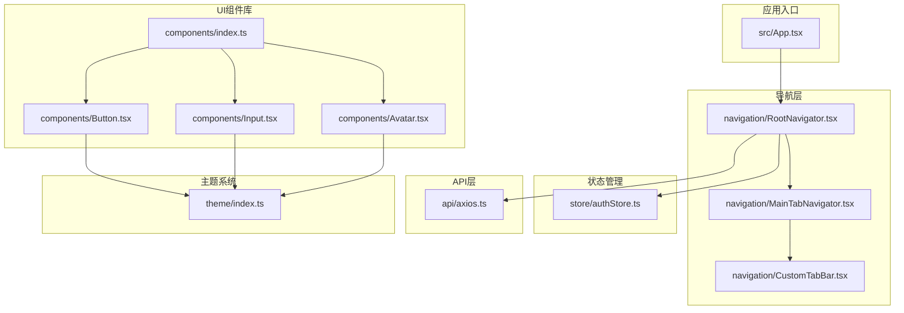
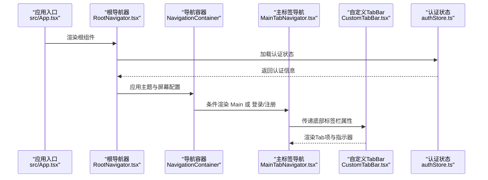
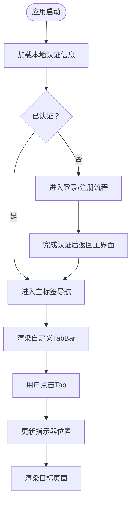
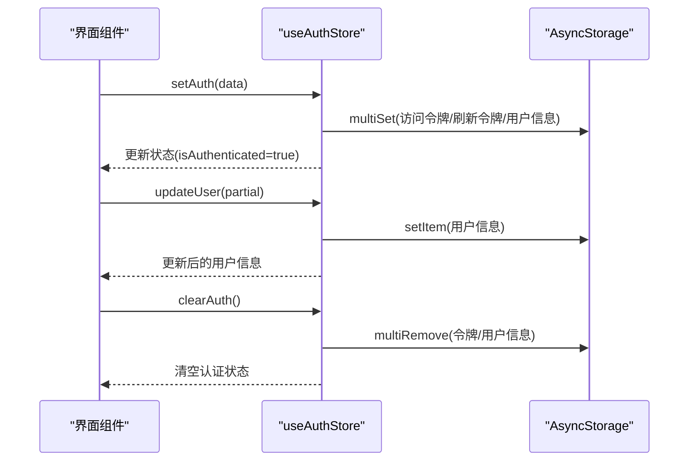
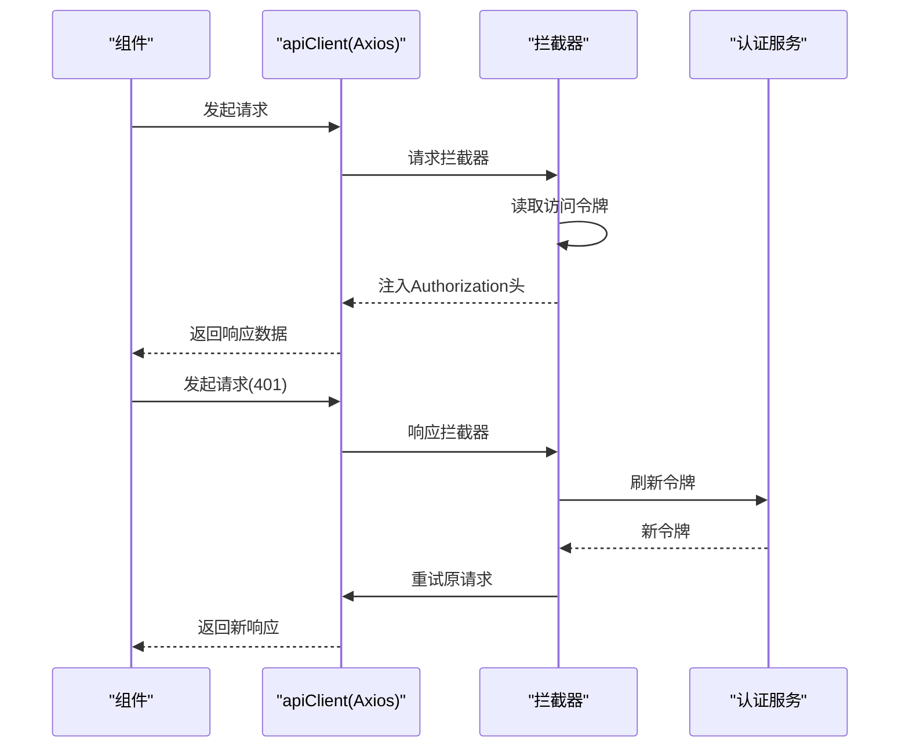
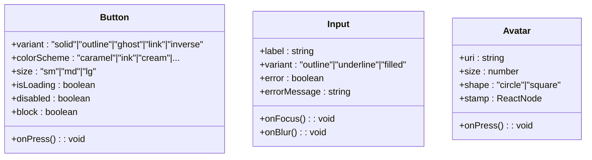
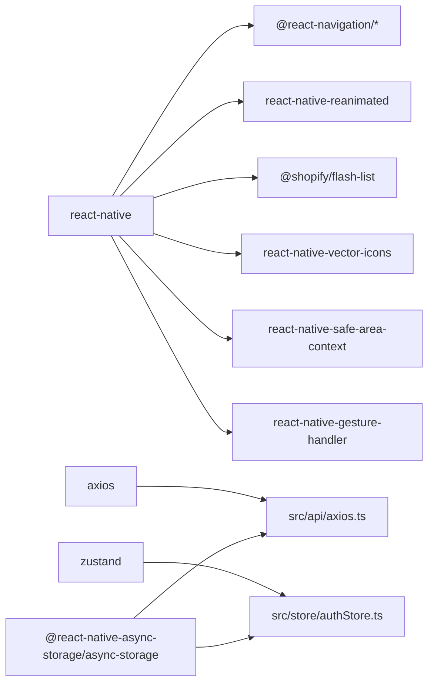

# 前端开发指南

<cite>
**本文档引用的文件**
- [package.json](file://FreeDressApp/package.json)
- [README.md](file://FreeDressApp/README.md)
- [App.tsx](file://FreeDressApp/src/App.tsx)
- [index.ts](file://FreeDressApp/src/components/index.ts)
- [RootNavigator.tsx](file://FreeDressApp/src/navigation/RootNavigator.tsx)
- [MainTabNavigator.tsx](file://FreeDressApp/src/navigation/MainTabNavigator.tsx)
- [CustomTabBar.tsx](file://FreeDressApp/src/navigation/CustomTabBar.tsx)
- [authStore.ts](file://FreeDressApp/src/store/authStore.ts)
- [axios.ts](file://FreeDressApp/src/api/axios.ts)
- [Button.tsx](file://FreeDressApp/src/components/Button.tsx)
- [Input.tsx](file://FreeDressApp/src/components/Input.tsx)
- [Avatar.tsx](file://FreeDressApp/src/components/Avatar.tsx)
- [index.ts](file://FreeDressApp/src/theme/index.ts)
</cite>

## 目录
1. [简介](#简介)
2. [项目结构](#项目结构)
3. [核心组件](#核心组件)
4. [架构总览](#架构总览)
5. [详细组件分析](#详细组件分析)
6. [依赖关系分析](#依赖关系分析)
7. [性能考虑](#性能考虑)
8. [故障排除指南](#故障排除指南)
9. [结论](#结论)
10. [附录](#附录)

## 简介
本指南面向畅搭(FreeDress)前端开发者，系统性介绍基于React Native的应用架构与开发模式。内容涵盖组件化设计原则、导航体系、状态管理策略、自定义UI组件库、API集成最佳实践、主题系统、动画与响应式设计，以及完整的开发工作流程与性能优化建议。

## 项目结构
应用采用按功能域分层的组织方式，核心目录如下：
- src/api：封装HTTP客户端与拦截器，统一错误处理与Token刷新
- src/components：自定义UI组件库，提供Button、Input、Avatar等基础组件
- src/navigation：导航配置，包含根导航器、主标签导航与自定义TabBar
- src/screens：页面级组件，承载业务场景
- src/store：状态管理，使用Zustand实现认证状态持久化
- src/theme：主题系统，统一字体、动画与纹理风格
- src/types/constants：类型定义与常量配置

**图表来源**
- [src/App.tsx:1-28](file://FreeDressApp/src/App.tsx#L1-L28)
- [src/navigation/RootNavigator.tsx:1-95](file://FreeDressApp/src/navigation/RootNavigator.tsx#L1-L95)
- [src/navigation/MainTabNavigator.tsx:1-38](file://FreeDressApp/src/navigation/MainTabNavigator.tsx#L1-L38)
- [src/navigation/CustomTabBar.tsx:1-250](file://FreeDressApp/src/navigation/CustomTabBar.tsx#L1-L250)
- [src/store/authStore.ts:1-123](file://FreeDressApp/src/store/authStore.ts#L1-L123)
- [src/api/axios.ts:1-108](file://FreeDressApp/src/api/axios.ts#L1-L108)
- [src/components/Button.tsx:1-201](file://FreeDressApp/src/components/Button.tsx#L1-L201)
- [src/components/Input.tsx:1-183](file://FreeDressApp/src/components/Input.tsx#L1-L183)
- [src/components/Avatar.tsx:1-93](file://FreeDressApp/src/components/Avatar.tsx#L1-L93)
- [src/components/index.ts:1-32](file://FreeDressApp/src/components/index.ts#L1-L32)
- [src/theme/index.ts:1-7](file://FreeDressApp/src/theme/index.ts#L1-L7)

**章节来源**
- [README.md:86-118](file://FreeDressApp/README.md#L86-L118)
- [package.json:12-31](file://FreeDressApp/package.json#L12-L31)

## 核心组件
本节聚焦于自定义UI组件库的设计理念与实现要点，包括Button、Input、Avatar等基础组件的使用与定制方法。

- Button组件
  - 设计理念：提供多种变体(solid/outline/ghost/link/inverse)、颜色方案(caramel/ink/cream及别名橙色/灰色/红色/蓝色)与尺寸(sm/md/lg)，内置按压缩放动画与加载态
  - 关键特性：支持左/右侧装饰元素、块级宽度、文本大写转换、禁用态与阴影
  - 动画实现：使用Reanimated共享值与timing动画，实现按压反馈
  - 样式来源：依赖主题常量与排版样式

- Input组件
  - 设计理念：提供outline/underline/filled三种外观，强调“杂志风”单像素下划线；支持浮动标签与错误态提示
  - 关键特性：聚焦态颜色变化、错误态高亮、占位符动态显示、自定义边框与背景
  - 动画实现：使用Animated实现浮动标签的插值动画

- Avatar组件
  - 设计理念：圆形或方形头像，支持徽标(stamp)叠加，回退显示首字母
  - 关键特性：边框、背景色、尺寸控制与徽标定位

**章节来源**
- [src/components/Button.tsx:1-201](file://FreeDressApp/src/components/Button.tsx#L1-L201)
- [src/components/Input.tsx:1-183](file://FreeDressApp/src/components/Input.tsx#L1-L183)
- [src/components/Avatar.tsx:1-93](file://FreeDressApp/src/components/Avatar.tsx#L1-L93)
- [src/components/index.ts:1-32](file://FreeDressApp/src/components/index.ts#L1-L32)

## 架构总览
应用采用“根导航器 + 主标签导航 + 自定义TabBar”的导航架构，结合Zustand进行认证状态管理，Axios统一处理请求与响应拦截。

**图表来源**
- [src/App.tsx:1-28](file://FreeDressApp/src/App.tsx#L1-L28)
- [src/navigation/RootNavigator.tsx:1-95](file://FreeDressApp/src/navigation/RootNavigator.tsx#L1-L95)
- [src/navigation/MainTabNavigator.tsx:1-38](file://FreeDressApp/src/navigation/MainTabNavigator.tsx#L1-L38)
- [src/navigation/CustomTabBar.tsx:1-250](file://FreeDressApp/src/navigation/CustomTabBar.tsx#L1-L250)
- [src/store/authStore.ts:1-123](file://FreeDressApp/src/store/authStore.ts#L1-L123)

## 详细组件分析

### 导航系统
- 根导航器(RootNavigator)
  - 职责：根据认证状态切换主界面(MainTabNavigator)与登录/注册流程；应用编辑器主题；设置全局样式
  - 流程：启动时异步加载本地认证信息，避免白屏；根据是否已认证决定路由栈
  - 主题：基于编辑器色彩体系(ecru/ink/caramel/signal)，覆盖默认主题颜色

- 主标签导航(MainTabNavigator)
  - 职责：定义底部标签页顺序与页面映射，关闭默认头部，由各页面自行渲染标题
  - 页面布局：Home / Wardrobe(含堆栈) / TryOn(中心放大) / Outfit / Profile

- 自定义TabBar(CustomTabBar)
  - 职责：实现深色底、顶部发丝线、焦糖色滑动指示器；中心Tab放大与旋转反馈
  - 动画：指示器位置与Tab缩放使用Reanimated，平滑过渡

**图表来源**
- [src/navigation/RootNavigator.tsx:41-84](file://FreeDressApp/src/navigation/RootNavigator.tsx#L41-L84)
- [src/navigation/MainTabNavigator.tsx:18-34](file://FreeDressApp/src/navigation/MainTabNavigator.tsx#L18-L34)
- [src/navigation/CustomTabBar.tsx:44-116](file://FreeDressApp/src/navigation/CustomTabBar.tsx#L44-L116)

**章节来源**
- [src/navigation/RootNavigator.tsx:1-95](file://FreeDressApp/src/navigation/RootNavigator.tsx#L1-L95)
- [src/navigation/MainTabNavigator.tsx:1-38](file://FreeDressApp/src/navigation/MainTabNavigator.tsx#L1-L38)
- [src/navigation/CustomTabBar.tsx:1-250](file://FreeDressApp/src/navigation/CustomTabBar.tsx#L1-L250)

### 状态管理（Zustand）
- Store设计模式
  - 认证状态接口：包含用户信息、访问令牌、刷新令牌、认证状态与加载状态
  - 核心方法：设置认证信息(setAuth)、清除认证信息(clearAuth)、更新用户信息(updateUser)、从本地存储加载(loadAuthFromStorage)
  - 持久化：使用AsyncStorage多键写入/删除，确保跨会话可用

- 数据流
  - 初始化：启动时调用loadAuthFromStorage，若存在令牌则自动登录
  - 写入：登录成功后setAuth同时写入本地存储
  - 更新：updateUser仅在用户存在时合并更新并同步存储
  - 清理：clearAuth清理状态与本地存储

**图表来源**
- [src/store/authStore.ts:28-122](file://FreeDressApp/src/store/authStore.ts#L28-L122)

**章节来源**
- [src/store/authStore.ts:1-123](file://FreeDressApp/src/store/authStore.ts#L1-L123)

### API集成（Axios）
- Axios实例配置
  - 基础URL、超时时间、Content-Type
  - 请求拦截器：从本地存储读取访问令牌并注入Authorization头
  - 响应拦截器：统一提取响应数据；处理401未授权：尝试刷新令牌；刷新失败则清理本地认证信息并输出错误日志

- 错误处理与重试
  - 401错误时，使用刷新令牌向后端发起刷新请求
  - 成功刷新后，更新本地令牌并重试原请求
  - 刷新失败则清理本地存储，避免后续请求继续携带无效令牌

**图表来源**
- [src/api/axios.ts:12-105](file://FreeDressApp/src/api/axios.ts#L12-L105)

**章节来源**
- [src/api/axios.ts:1-108](file://FreeDressApp/src/api/axios.ts#L1-L108)

### 自定义UI组件库
- Button
  - 变体与配色：solid/outline/ghost/link/inverse；caramel/ink/cream及别名橙色/灰色/红色/蓝色
  - 动画：按压缩放、阴影、加载态
  - 接口：支持左右装饰元素、块级宽度、禁用态、文本样式扩展

- Input
  - 外观：outline/underline/filled；underline为杂志风首选
  - 动画：浮动标签插值动画；聚焦态与错误态颜色变化
  - 可访问性：占位符动态显示、错误提示文本

- Avatar
  - 形状：圆形/方形；支持边框与背景
  - 回退：无头像时显示首字母徽标
  - 扩展：右下角stamp徽标叠加

**图表来源**
- [src/components/Button.tsx:29-45](file://FreeDressApp/src/components/Button.tsx#L29-L45)
- [src/components/Input.tsx:21-31](file://FreeDressApp/src/components/Input.tsx#L21-L31)
- [src/components/Avatar.tsx:9-19](file://FreeDressApp/src/components/Avatar.tsx#L9-L19)

**章节来源**
- [src/components/Button.tsx:1-201](file://FreeDressApp/src/components/Button.tsx#L1-L201)
- [src/components/Input.tsx:1-183](file://FreeDressApp/src/components/Input.tsx#L1-L183)
- [src/components/Avatar.tsx:1-93](file://FreeDressApp/src/components/Avatar.tsx#L1-L93)
- [src/components/index.ts:1-32](file://FreeDressApp/src/components/index.ts#L1-L32)

### 主题系统与动画
- 主题统一出口：通过theme/index.ts导出排版、纹理与动画配置
- 字体与排版：统一的字体族、字号与字重规范
- 动画：使用Reanimated与插值实现流畅的交互反馈
- 纹理：通过grain模块提供细腻的视觉质感

**章节来源**
- [src/theme/index.ts:1-7](file://FreeDressApp/src/theme/index.ts#L1-L7)

## 依赖关系分析
- 核心依赖
  - 导航：@react-navigation/native、@react-navigation/bottom-tabs、@react-navigation/native-stack
  - 状态管理：zustand
  - HTTP：axios
  - 动画：react-native-reanimated
  - 列表：@shopify/flash-list
  - 图标：react-native-vector-icons
  - 存储：@react-native-async-storage/async-storage
  - 安全区域：react-native-safe-area-context
  - 手势：react-native-gesture-handler

**图表来源**
- [package.json:12-30](file://FreeDressApp/package.json#L12-L30)
- [src/api/axios.ts:1-108](file://FreeDressApp/src/api/axios.ts#L1-L108)
- [src/store/authStore.ts:1-123](file://FreeDressApp/src/store/authStore.ts#L1-L123)

**章节来源**
- [package.json:12-31](file://FreeDressApp/package.json#L12-L31)

## 性能考虑
- 列表渲染
  - 使用Flash List替代FlatList，提升大数据集滚动性能
- 动画性能
  - 使用Reanimated共享值与原生驱动，减少JS线程压力
- 网络请求
  - 合理设置超时与重试策略；对401错误进行令牌刷新，避免频繁弹窗
- 状态管理
  - Zustand轻量且无需中间件，减少不必要的订阅与重渲染
- 主题与样式
  - 统一使用主题常量，避免重复计算与样式抖动

## 故障排除指南
- Token刷新失败
  - 现象：401错误后仍无法访问受保护资源
  - 排查：确认刷新接口可用、刷新令牌有效、本地存储键值正确
  - 处理：拦截器中清理本地认证信息并引导重新登录

- 导航主题不生效
  - 现象：导航栏颜色与预期不符
  - 排查：确认NavigationContainer应用了编辑器主题；检查颜色常量是否正确导入

- 自定义TabBar动画异常
  - 现象：指示器位置不准确或缩放不平滑
  - 排查：确认useAnimatedStyle与sharedValue初始化；检查onLayout回调中的宽度计算

- Button/Avatar样式错乱
  - 现象：颜色、尺寸或布局不符合设计稿
  - 排查：核对主题常量与样式合并逻辑；检查传入的style与textStyle覆盖

**章节来源**
- [src/api/axios.ts:44-105](file://FreeDressApp/src/api/axios.ts#L44-L105)
- [src/navigation/RootNavigator.tsx:25-36](file://FreeDressApp/src/navigation/RootNavigator.tsx#L25-L36)
- [src/navigation/CustomTabBar.tsx:49-60](file://FreeDressApp/src/navigation/CustomTabBar.tsx#L49-L60)
- [src/components/Button.tsx:86-100](file://FreeDressApp/src/components/Button.tsx#L86-L100)
- [src/components/Avatar.tsx:34-46](file://FreeDressApp/src/components/Avatar.tsx#L34-L46)

## 结论
本指南系统梳理了畅搭(FreeDress)前端的架构与实现要点，围绕组件化、导航、状态管理与API集成给出可操作的实践建议。通过统一的主题系统与动画策略，配合Zustand与Axios的最佳实践，能够快速构建高质量的移动端体验。

## 附录
- 开发命令
  - 启动Metro：npm start
  - 运行Android：npm run android
  - 运行iOS：npm run ios
  - 代码检查：npm run lint
  - 运行测试：npm test

- 环境要求
  - Node.js >= 22.11.0
  - JDK 17（Android）
  - Xcode >= 15（iOS）
  - Android Studio（Android）

**章节来源**
- [README.md:58-84](file://FreeDressApp/README.md#L58-L84)
- [README.md:51-56](file://FreeDressApp/README.md#L51-L56)