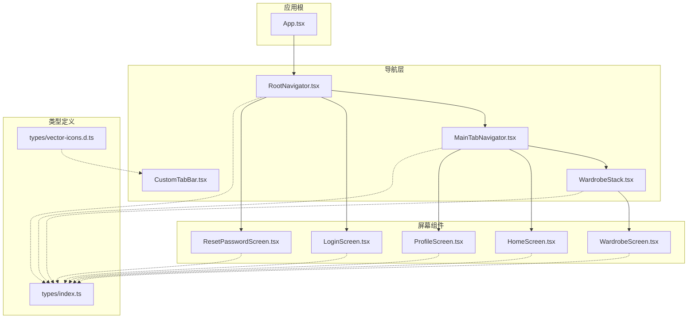
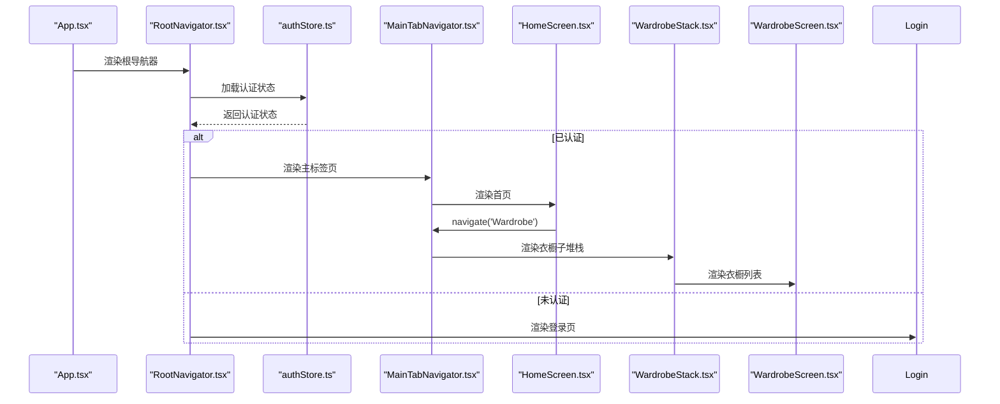
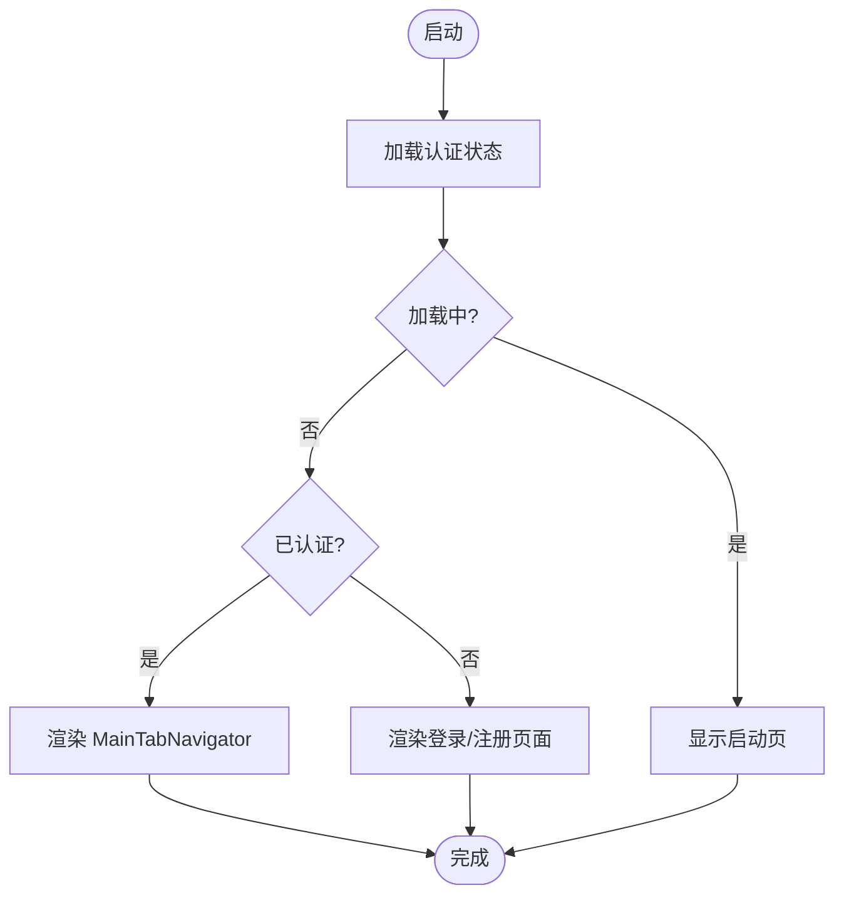
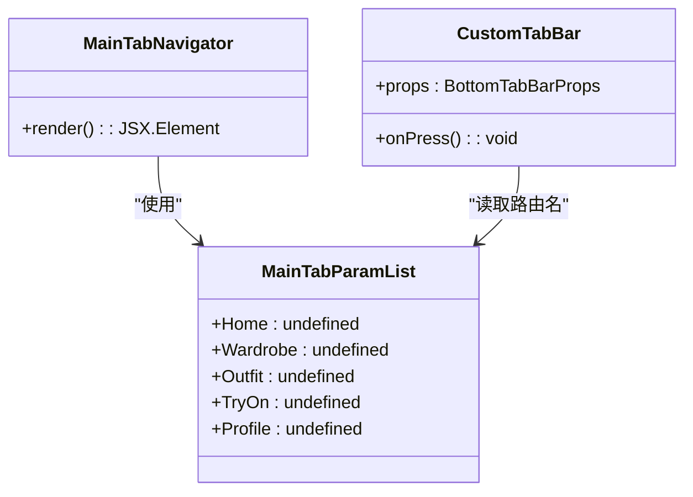
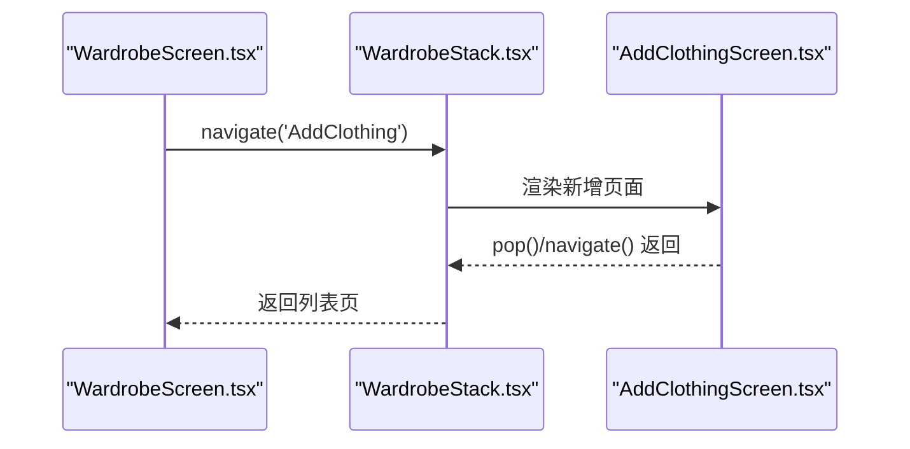
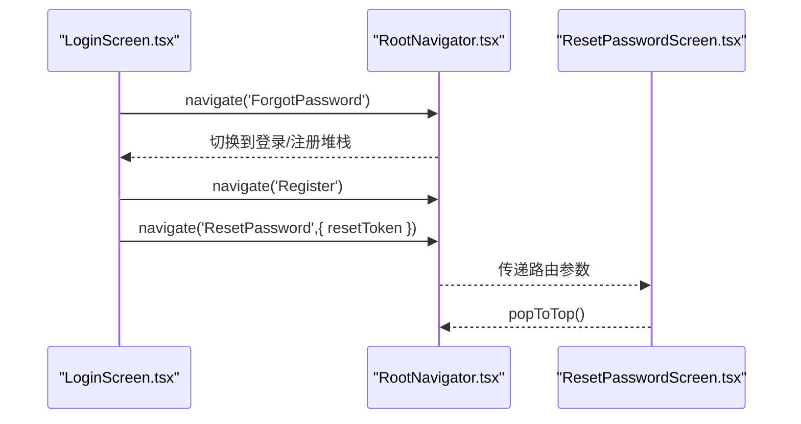
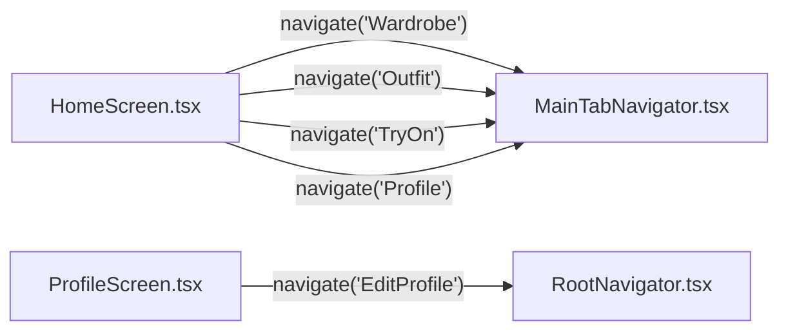
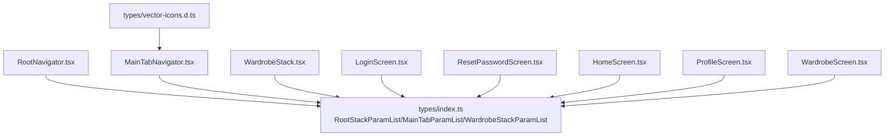

# 导航类型定义

<cite>
**本文引用的文件**   
- [RootNavigator.tsx](file://FreeDressApp/src/navigation/RootNavigator.tsx)
- [MainTabNavigator.tsx](file://FreeDressApp/src/navigation/MainTabNavigator.tsx)
- [WardrobeStack.tsx](file://FreeDressApp/src/navigation/WardrobeStack.tsx)
- [CustomTabBar.tsx](file://FreeDressApp/src/navigation/CustomTabBar.tsx)
- [index.ts](file://FreeDressApp/src/types/index.ts)
- [vector-icons.d.ts](file://FreeDressApp/src/types/vector-icons.d.ts)
- [LoginScreen.tsx](file://FreeDressApp/src/screens/LoginScreen.tsx)
- [ResetPasswordScreen.tsx](file://FreeDressApp/src/screens/ResetPasswordScreen.tsx)
- [HomeScreen.tsx](file://FreeDressApp/src/screens/HomeScreen.tsx)
- [ProfileScreen.tsx](file://FreeDressApp/src/screens/ProfileScreen.tsx)
- [WardrobeScreen.tsx](file://FreeDressApp/src/screens/WardrobeScreen.tsx)
- [App.tsx](file://FreeDressApp/src/App.tsx)
- [authStore.ts](file://FreeDressApp/src/store/authStore.ts)
</cite>

## 目录
1. [简介](#简介)
2. [项目结构](#项目结构)
3. [核心组件](#核心组件)
4. [架构总览](#架构总览)
5. [详细组件分析](#详细组件分析)
6. [依赖分析](#依赖分析)
7. [性能考虑](#性能考虑)
8. [故障排查指南](#故障排查指南)
9. [结论](#结论)
10. [附录](#附录)

## 简介
本文件系统化梳理畅搭(FreeDress)应用的导航类型体系，重点围绕 RootStackParamList、MainTabParamList、WardrobeStackParamList 等导航参数类型展开，解释 TypeScript 在导航中的类型安全保证，涵盖路由参数类型检查、屏幕属性定义与导航函数类型推导；阐明导航类型与实际页面组件的绑定关系及最佳实践；并提供类型扩展、新增页面类型定义与类型兼容性的实现指南，以及常见类型错误的排查与解决方案。

## 项目结构
导航相关代码主要分布在以下位置：
- 类型定义：src/types/index.ts
- 导航器：src/navigation/*.tsx
- 屏幕组件：src/screens/*.tsx
- 应用根组件：src/App.tsx
- 认证状态：src/store/authStore.ts

图表来源
- [App.tsx:11-19](file://FreeDressApp/src/App.tsx#L11-L19)
- [RootNavigator.tsx:54-84](file://FreeDressApp/src/navigation/RootNavigator.tsx#L54-L84)
- [MainTabNavigator.tsx:22-35](file://FreeDressApp/src/navigation/MainTabNavigator.tsx#L22-L35)
- [WardrobeStack.tsx:9-20](file://FreeDressApp/src/navigation/WardrobeStack.tsx#L9-L20)
- [CustomTabBar.tsx:44-117](file://FreeDressApp/src/navigation/CustomTabBar.tsx#L44-L117)
- [index.ts:73-97](file://FreeDressApp/src/types/index.ts#L73-L97)

章节来源
- [App.tsx:11-19](file://FreeDressApp/src/App.tsx#L11-L19)
- [RootNavigator.tsx:54-84](file://FreeDressApp/src/navigation/RootNavigator.tsx#L54-L84)
- [MainTabNavigator.tsx:22-35](file://FreeDressApp/src/navigation/MainTabNavigator.tsx#L22-L35)
- [WardrobeStack.tsx:9-20](file://FreeDressApp/src/navigation/WardrobeStack.tsx#L9-L20)
- [index.ts:73-97](file://FreeDressApp/src/types/index.ts#L73-L97)

## 核心组件
本节聚焦导航类型定义与使用方式，解释类型如何确保导航的安全性与可维护性。

- RootStackParamList
  - 定义于类型文件，用于顶层原生堆栈导航器的路由名称与参数约束。
  - 关键点：Login、Register、ForgotPassword 无参数；ResetPassword 需要 resetToken 参数；其余屏幕无参数。
  - 使用场景：根导航器根据认证状态在“登录/注册”和“主内容”之间切换，并通过该类型约束各 Screen 的参数。

- MainTabParamList
  - 定义于类型文件，用于底部标签页导航器的路由名称约束。
  - 关键点：Home、Wardrobe、Outfit、TryOn、Profile 均无参数，确保 Tab 内跳转时类型安全。

- WardrobeStackParamList
  - 定义于类型文件，用于衣橱子堆栈导航器的路由名称约束。
  - 关键点：WardrobeList、AddClothing 均无参数，保证衣橱模块内部跳转类型安全。

- 类型与屏幕绑定
  - 各屏幕通过 useNavigation<NativeStackNavigationProp<...,'ScreenName'>>() 获取强类型导航对象，确保 navigate、goBack 等调用的参数与返回值类型正确。
  - 例如 LoginScreen 使用 RootStackParamList<'Login'>，ResetPasswordScreen 使用 RootStackParamList<'ResetPassword'> 并结合 RouteProp 提取路由参数。

- 类型安全收益
  - 编译期校验：拼写错误或不存在的路由名会在编译阶段报错。
  - 参数校验：仅允许符合定义的参数传入，避免运行时错误。
  - 智能提示：IDE 对导航函数提供准确的参数与返回类型提示。

章节来源
- [index.ts:73-97](file://FreeDressApp/src/types/index.ts#L73-L97)
- [RootNavigator.tsx:23](file://FreeDressApp/src/navigation/RootNavigator.tsx#L23)
- [MainTabNavigator.tsx:16](file://FreeDressApp/src/navigation/MainTabNavigator.tsx#L16)
- [WardrobeStack.tsx:7](file://FreeDressApp/src/navigation/WardrobeStack.tsx#L7)
- [LoginScreen.tsx:42](file://FreeDressApp/src/screens/LoginScreen.tsx#L42)
- [ResetPasswordScreen.tsx:39-40](file://FreeDressApp/src/screens/ResetPasswordScreen.tsx#L39-L40)

## 架构总览
应用采用分层导航架构：根导航器负责登录态切换，主标签页承载核心业务模块，子堆栈进一步细分功能区域。类型定义贯穿导航器与屏幕组件，形成端到端的类型安全保障。

图表来源
- [App.tsx:11-19](file://FreeDressApp/src/App.tsx#L11-L19)
- [RootNavigator.tsx:41-84](file://FreeDressApp/src/navigation/RootNavigator.tsx#L41-L84)
- [authStore.ts:97-121](file://FreeDressApp/src/store/authStore.ts#L97-L121)
- [MainTabNavigator.tsx:22-35](file://FreeDressApp/src/navigation/MainTabNavigator.tsx#L22-L35)
- [HomeScreen.tsx:100-160](file://FreeDressApp/src/screens/HomeScreen.tsx#L100-L160)
- [WardrobeStack.tsx:9-20](file://FreeDressApp/src/navigation/WardrobeStack.tsx#L9-L20)
- [WardrobeScreen.tsx:40-120](file://FreeDressApp/src/screens/WardrobeScreen.tsx#L40-L120)

## 详细组件分析

### 根导航器与类型绑定
- 根导航器使用 createNativeStackNavigator<RootStackParamList>() 创建堆栈，并通过 Stack.Screen 的 name 与组件建立绑定。
- 根据认证状态动态渲染“主内容”或“登录/注册”页面，类型系统确保 Screen 名称与参数均符合 RootStackParamList 的定义。
- 通过 useAuthStore 控制加载态与登录态，保障导航切换的时机正确。

图表来源
- [RootNavigator.tsx:41-84](file://FreeDressApp/src/navigation/RootNavigator.tsx#L41-L84)
- [authStore.ts:97-121](file://FreeDressApp/src/store/authStore.ts#L97-L121)

章节来源
- [RootNavigator.tsx:41-84](file://FreeDressApp/src/navigation/RootNavigator.tsx#L41-L84)
- [authStore.ts:97-121](file://FreeDressApp/src/store/authStore.ts#L97-L121)

### 主标签页导航器与 Tab 参数
- 主标签页使用 createBottomTabNavigator<MainTabParamList>()，Tab.Screen 的 name 与组件绑定，类型系统确保 Tab 内跳转的路由名称合法且无参数。
- 自定义 TabBar 通过 BottomTabBarProps 接收状态与导航事件，内部使用 navigation.navigate(route.name as never) 触发跳转，类型由 MainTabParamList 保证。

图表来源
- [MainTabNavigator.tsx:16](file://FreeDressApp/src/navigation/MainTabNavigator.tsx#L16)
- [MainTabNavigator.tsx:22-35](file://FreeDressApp/src/navigation/MainTabNavigator.tsx#L22-L35)
- [CustomTabBar.tsx:44-117](file://FreeDressApp/src/navigation/CustomTabBar.tsx#L44-L117)
- [index.ts:91-97](file://FreeDressApp/src/types/index.ts#L91-L97)

章节来源
- [MainTabNavigator.tsx:16](file://FreeDressApp/src/navigation/MainTabNavigator.tsx#L16)
- [CustomTabBar.tsx:44-117](file://FreeDressApp/src/navigation/CustomTabBar.tsx#L44-L117)
- [index.ts:91-97](file://FreeDressApp/src/types/index.ts#L91-L97)

### 衣橱子堆栈与参数
- 衣橱子堆栈使用 createNativeStackNavigator<WardrobeStackParamList>()，Screen 名称与组件绑定，类型系统确保内部跳转合法。
- 衣橱列表页通过 navigation.navigate('AddClothing') 跳转至新增页面，类型由 WardrobeStackParamList 保证。

图表来源
- [WardrobeStack.tsx:9-20](file://FreeDressApp/src/navigation/WardrobeStack.tsx#L9-L20)
- [WardrobeScreen.tsx:220](file://FreeDressApp/src/screens/WardrobeScreen.tsx#L220)

章节来源
- [WardrobeStack.tsx:9-20](file://FreeDressApp/src/navigation/WardrobeStack.tsx#L9-L20)
- [WardrobeScreen.tsx:220](file://FreeDressApp/src/screens/WardrobeScreen.tsx#L220)

### 登录与重置密码的类型安全
- 登录页通过 useNavigation<NativeStackNavigationProp<RootStackParamList,'Login'>>() 获取导航对象，确保跳转至 Register、ForgotPassword 等路由时类型正确。
- 重置密码页通过 useNavigation<NativeStackNavigationProp<RootStackParamList,'ResetPassword'>>() 与 useRoute<RouteProp<RootStackParamList,'ResetPassword'>>() 获取导航与路由参数，类型系统保证 resetToken 的存在与类型正确。

图表来源
- [LoginScreen.tsx:94](file://FreeDressApp/src/screens/LoginScreen.tsx#L94)
- [RootNavigator.tsx:74-81](file://FreeDressApp/src/navigation/RootNavigator.tsx#L74-L81)
- [ResetPasswordScreen.tsx:42-93](file://FreeDressApp/src/screens/ResetPasswordScreen.tsx#L42-L93)
- [index.ts:79](file://FreeDressApp/src/types/index.ts#L79)

章节来源
- [LoginScreen.tsx:94](file://FreeDressApp/src/screens/LoginScreen.tsx#L94)
- [ResetPasswordScreen.tsx:42-93](file://FreeDressApp/src/screens/ResetPasswordScreen.tsx#L42-L93)
- [index.ts:79](file://FreeDressApp/src/types/index.ts#L79)

### Tab 内部跳转与类型约束
- 首页通过 navigation.navigate('Wardrobe'|'Outfit'|'TryOn'|'Profile') 进行跳转，类型由 MainTabParamList 保证。
- 个人页通过 navigation.navigate('EditProfile') 进行模态跳转，类型由 RootStackParamList 保证。

图表来源
- [HomeScreen.tsx:131-159](file://FreeDressApp/src/screens/HomeScreen.tsx#L131-L159)
- [ProfileScreen.tsx:112](file://FreeDressApp/src/screens/ProfileScreen.tsx#L112)
- [MainTabNavigator.tsx:28-32](file://FreeDressApp/src/navigation/MainTabNavigator.tsx#L28-L32)
- [RootNavigator.tsx:64-72](file://FreeDressApp/src/navigation/RootNavigator.tsx#L64-L72)

章节来源
- [HomeScreen.tsx:131-159](file://FreeDressApp/src/screens/HomeScreen.tsx#L131-L159)
- [ProfileScreen.tsx:112](file://FreeDressApp/src/screens/ProfileScreen.tsx#L112)
- [MainTabNavigator.tsx:28-32](file://FreeDressApp/src/navigation/MainTabNavigator.tsx#L28-L32)
- [RootNavigator.tsx:64-72](file://FreeDressApp/src/navigation/RootNavigator.tsx#L64-L72)

## 依赖分析
- 导航器与类型
  - RootNavigator 使用 RootStackParamList 约束顶层路由。
  - MainTabNavigator 使用 MainTabParamList 约束标签页路由。
  - WardrobeStack 使用 WardrobeStackParamList 约束衣橱子堆栈路由。
- 屏幕组件与类型
  - 各屏幕通过 NativeStackNavigationProp<RouteList,'ScreenName'> 获取类型化的导航对象。
  - ResetPasswordScreen 结合 RouteProp 提取路由参数，确保类型安全。
- 外部依赖
  - react-native-vector-icons 的类型声明通过 vector-icons.d.ts 提供，CustomTabBar 使用 Feather 图标组件。

图表来源
- [index.ts:73-97](file://FreeDressApp/src/types/index.ts#L73-L97)
- [RootNavigator.tsx:23](file://FreeDressApp/src/navigation/RootNavigator.tsx#L23)
- [MainTabNavigator.tsx:16](file://FreeDressApp/src/navigation/MainTabNavigator.tsx#L16)
- [WardrobeStack.tsx:7](file://FreeDressApp/src/navigation/WardrobeStack.tsx#L7)
- [LoginScreen.tsx:42](file://FreeDressApp/src/screens/LoginScreen.tsx#L42)
- [ResetPasswordScreen.tsx:39-40](file://FreeDressApp/src/screens/ResetPasswordScreen.tsx#L39-L40)
- [HomeScreen.tsx:40](file://FreeDressApp/src/screens/HomeScreen.tsx#L40)
- [ProfileScreen.tsx:53](file://FreeDressApp/src/screens/ProfileScreen.tsx#L53)
- [WardrobeScreen.tsx:41](file://FreeDressApp/src/screens/WardrobeScreen.tsx#L41)
- [vector-icons.d.ts:5-14](file://FreeDressApp/src/types/vector-icons.d.ts#L5-L14)

章节来源
- [index.ts:73-97](file://FreeDressApp/src/types/index.ts#L73-L97)
- [vector-icons.d.ts:5-14](file://FreeDressApp/src/types/vector-icons.d.ts#L5-L14)

## 性能考虑
- 类型定义集中管理，减少重复与歧义，降低编译与运行时开销。
- 使用 createNativeStackNavigator<ParamList>() 与 createBottomTabNavigator<ParamList>() 显式传入类型，避免隐式 any 导致的类型回退。
- 合理拆分导航层级（根导航器、标签页、子堆栈），避免深层嵌套带来的渲染压力。
- 在自定义 TabBar 中使用动画库进行高性能交互，同时保持类型安全。

## 故障排查指南
- 路由名拼写错误
  - 症状：navigate('Home') 无法识别或编译报错。
  - 排查：确认路由名存在于对应 ParamList（如 MainTabParamList）。
  - 解决：修正拼写或添加缺失的路由项。

- 丢失必需参数
  - 症状：navigate('ResetPassword', { resetToken }) 编译报错。
  - 排查：确认 RootStackParamList<'ResetPassword'> 的参数定义包含 resetToken。
  - 解决：按定义传参或调整类型定义。

- 误用 any 导航类型
  - 症状：navigation.navigate('Wardrobe') 无类型提示或潜在错误。
  - 排查：检查是否使用了 NativeStackNavigationProp<ParamList,'ScreenName'>。
  - 解决：显式传入类型，避免 any。

- 自定义图标类型缺失
  - 症状：使用 Feather 图标时报类型错误。
  - 排查：确认 vector-icons.d.ts 是否存在并正确声明。
  - 解决：补充类型声明或确保第三方包版本兼容。

章节来源
- [index.ts:73-97](file://FreeDressApp/src/types/index.ts#L73-L97)
- [vector-icons.d.ts:5-14](file://FreeDressApp/src/types/vector-icons.d.ts#L5-L14)

## 结论
通过将 RootStackParamList、MainTabParamList、WardrobeStackParamList 等类型定义贯穿导航器与屏幕组件，畅搭应用实现了端到端的类型安全导航体系。这不仅提升了开发效率与可维护性，也显著降低了运行时错误的风险。遵循本文的最佳实践，可在不牺牲灵活性的前提下持续扩展导航类型与页面。

## 附录

### 类型定义最佳实践
- 将所有路由名称与参数统一定义在 types/index.ts 中，避免分散定义导致的不一致。
- 为每个导航器创建独立的 ParamList 类型，便于职责分离与复用。
- 屏幕组件中显式使用 NativeStackNavigationProp<ParamList,'ScreenName'> 与 RouteProp<ParamList,'ScreenName'>，确保类型推导准确。
- 对于需要参数的路由，明确参数类型与必填性；对于无参数路由，使用 undefined。

### 新增页面类型定义步骤
- 在对应导航器的 ParamList 中添加新的路由项与参数定义。
- 在 RootNavigator 或相应导航器中注册新的 Stack.Screen 或 Tab.Screen。
- 在目标屏幕组件中引入类型并使用 useNavigation/useRoute 获取类型化的导航对象。
- 如需自定义图标，补充 vector-icons.d.ts 的类型声明。

### 类型兼容性处理
- 当需要扩展现有路由参数时，优先采用可选字段或联合类型，避免破坏既有调用方。
- 若需重构路由结构，先在分支中验证类型变更，再逐步合并到主干。
- 对于跨导航器的共享参数，建议抽取为公共类型，减少重复与不一致。