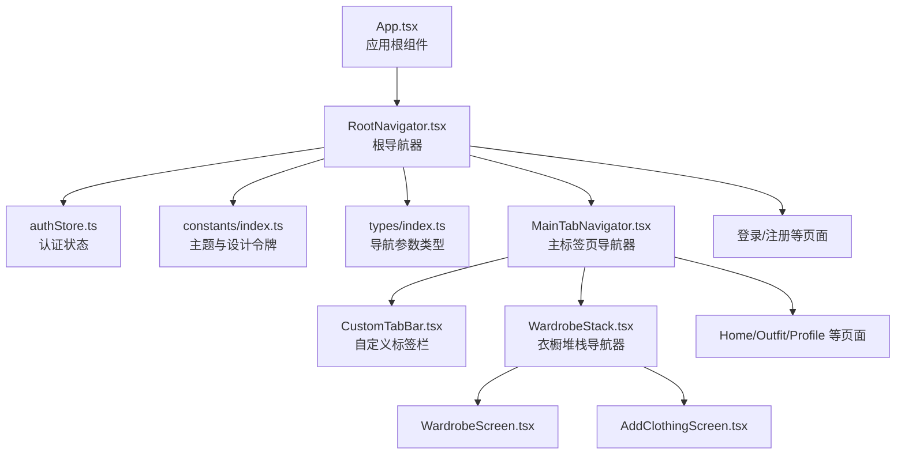
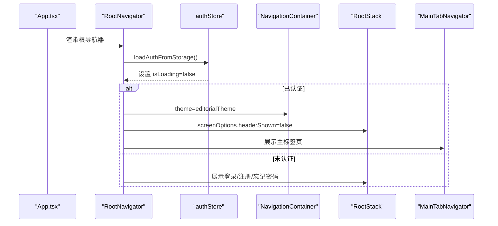
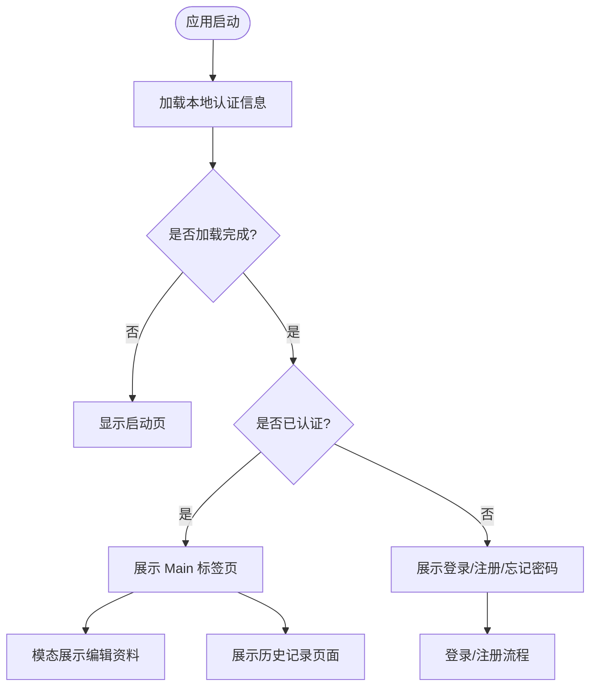
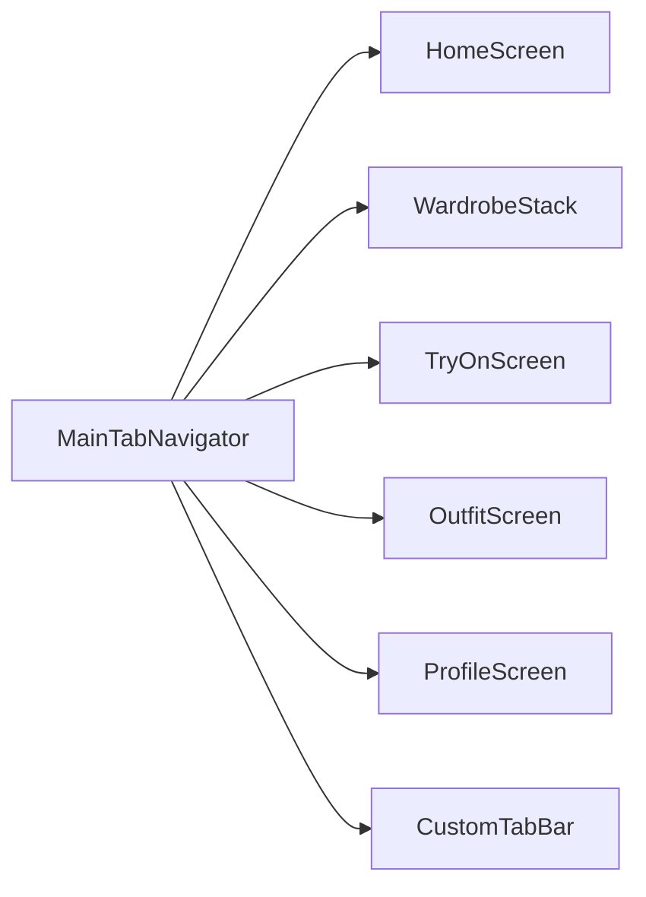
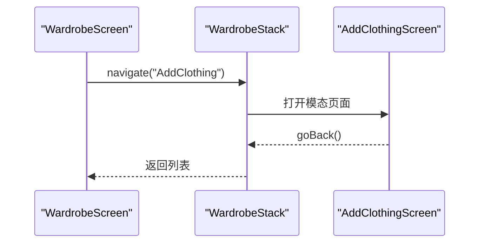
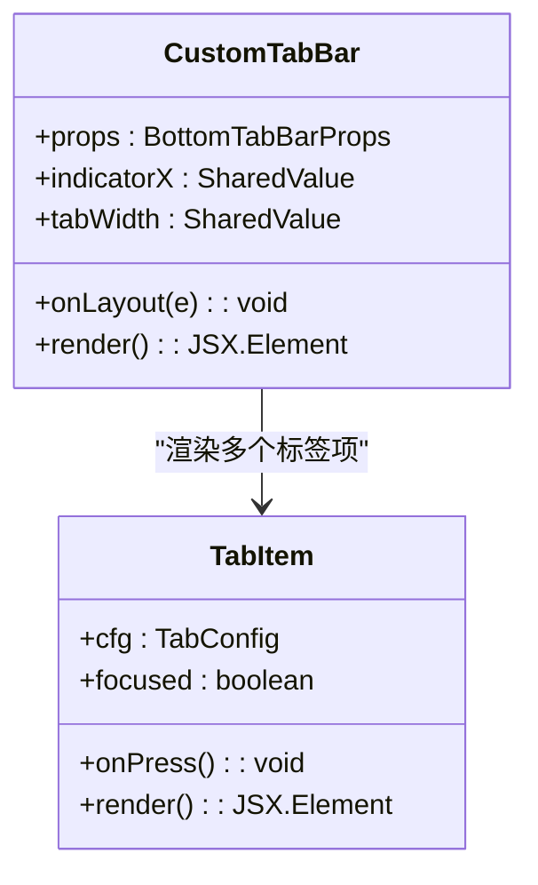
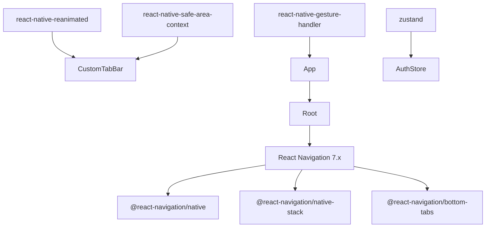

# 导航系统

<cite>
**本文档引用的文件**
- [App.tsx](file://FreeDressApp/src/App.tsx)
- [RootNavigator.tsx](file://FreeDressApp/src/navigation/RootNavigator.tsx)
- [MainTabNavigator.tsx](file://FreeDressApp/src/navigation/MainTabNavigator.tsx)
- [WardrobeStack.tsx](file://FreeDressApp/src/navigation/WardrobeStack.tsx)
- [CustomTabBar.tsx](file://FreeDressApp/src/navigation/CustomTabBar.tsx)
- [index.ts](file://FreeDressApp/src/types/index.ts)
- [index.ts](file://FreeDressApp/src/constants/index.ts)
- [authStore.ts](file://FreeDressApp/src/store/authStore.ts)
- [HomeScreen.tsx](file://FreeDressApp/src/screens/HomeScreen.tsx)
- [WardrobeScreen.tsx](file://FreeDressApp/src/screens/WardrobeScreen.tsx)
- [package.json](file://FreeDressApp/package.json)
</cite>

## 目录
1. [简介](#简介)
2. [项目结构](#项目结构)
3. [核心组件](#核心组件)
4. [架构总览](#架构总览)
5. [详细组件分析](#详细组件分析)
6. [依赖关系分析](#依赖关系分析)
7. [性能考虑](#性能考虑)
8. [故障排除指南](#故障排除指南)
9. [结论](#结论)

## 简介
本文件系统性阐述畅搭(FreeDress)应用基于 React Navigation 7.x 的导航体系，涵盖根导航器 RootNavigator 的设计模式、主标签页导航器 MainTabNavigator 的实现、堆栈导航器 WardrobeStack 的功能与跳转机制、自定义标签栏组件 CustomTabBar 的设计原理，并提供导航参数传递、页面生命周期管理、导航状态管理的最佳实践，以及导航动画、手势处理与深度链接的配置思路。

## 项目结构
导航相关代码集中在 FreeDressApp/src/navigation 目录，配合类型定义、主题常量与状态管理共同构成完整的导航生态。应用入口通过 App.tsx 提供手势与安全区域上下文，RootNavigator 作为顶层容器协调登录态与页面切换。

图表来源
- [App.tsx:11-19](file://FreeDressApp/src/App.tsx#L11-L19)
- [RootNavigator.tsx:41-84](file://FreeDressApp/src/navigation/RootNavigator.tsx#L41-L84)
- [MainTabNavigator.tsx:22-35](file://FreeDressApp/src/navigation/MainTabNavigator.tsx#L22-L35)
- [WardrobeStack.tsx:9-20](file://FreeDressApp/src/navigation/WardrobeStack.tsx#L9-L20)
- [CustomTabBar.tsx:44-117](file://FreeDressApp/src/navigation/CustomTabBar.tsx#L44-L117)

章节来源
- [App.tsx:1-28](file://FreeDressApp/src/App.tsx#L1-L28)
- [RootNavigator.tsx:1-95](file://FreeDressApp/src/navigation/RootNavigator.tsx#L1-L95)
- [MainTabNavigator.tsx:1-38](file://FreeDressApp/src/navigation/MainTabNavigator.tsx#L1-L38)
- [WardrobeStack.tsx:1-21](file://FreeDressApp/src/navigation/WardrobeStack.tsx#L1-L21)
- [CustomTabBar.tsx:1-250](file://FreeDressApp/src/navigation/CustomTabBar.tsx#L1-L250)
- [index.ts:73-98](file://FreeDressApp/src/types/index.ts#L73-L98)
- [index.ts:15-52](file://FreeDressApp/src/constants/index.ts#L15-L52)
- [authStore.ts:28-122](file://FreeDressApp/src/store/authStore.ts#L28-L122)

## 核心组件
- 根导航器 RootNavigator：负责根据认证状态在“主界面”与“登录/注册/重置密码”之间切换；统一设置 NavigationContainer 主题与全局样式；支持模态展示编辑资料等页面。
- 主标签页导航器 MainTabNavigator：承载底部标签页，使用自定义标签栏组件，关闭默认头部以复用各页面自带的 ScreenHeader。
- 堆栈导航器 WardrobeStack：在“衣橱列表”与“添加衣物”之间提供模态跳转，提升交互效率。
- 自定义标签栏 CustomTabBar：实现深色背景、顶部发丝线、滑动指示器、中心放大视觉锚点等设计细节，结合 Reanimated 实现流畅动画。

章节来源
- [RootNavigator.tsx:41-84](file://FreeDressApp/src/navigation/RootNavigator.tsx#L41-L84)
- [MainTabNavigator.tsx:22-35](file://FreeDressApp/src/navigation/MainTabNavigator.tsx#L22-L35)
- [WardrobeStack.tsx:9-20](file://FreeDressApp/src/navigation/WardrobeStack.tsx#L9-L20)
- [CustomTabBar.tsx:44-117](file://FreeDressApp/src/navigation/CustomTabBar.tsx#L44-L117)

## 架构总览
整体导航架构采用“根容器 + 条件根堆栈 + 主标签页 + 自定义标签栏”的分层设计。登录态由 Zustand 状态管理驱动，RootNavigator 在启动时异步加载本地认证信息，决定初始路由。

图表来源
- [App.tsx:11-19](file://FreeDressApp/src/App.tsx#L11-L19)
- [RootNavigator.tsx:42-51](file://FreeDressApp/src/navigation/RootNavigator.tsx#L42-L51)
- [authStore.ts:97-121](file://FreeDressApp/src/store/authStore.ts#L97-L121)
- [RootNavigator.tsx:54-84](file://FreeDressApp/src/navigation/RootNavigator.tsx#L54-L84)

## 详细组件分析

### 根导航器 RootNavigator 设计模式
- 主题与外观：基于 Editorial 语义配色方案，覆盖 primary/background/card/text/border/notification 等颜色；全局内容区背景色与状态栏样式统一。
- 条件路由：在应用启动时读取本地认证信息，处于加载状态时显示启动页，加载完成后依据 isAuthenticated 决定展示主标签页或登录注册流程。
- 页面跳转策略：主标签页外的页面如“编辑资料”采用模态展示，增强用户体验；历史记录页面以普通堆栈展示。

图表来源
- [RootNavigator.tsx:42-51](file://FreeDressApp/src/navigation/RootNavigator.tsx#L42-L51)
- [RootNavigator.tsx:62-81](file://FreeDressApp/src/navigation/RootNavigator.tsx#L62-L81)
- [authStore.ts:97-121](file://FreeDressApp/src/store/authStore.ts#L97-L121)

章节来源
- [RootNavigator.tsx:25-36](file://FreeDressApp/src/navigation/RootNavigator.tsx#L25-L36)
- [RootNavigator.tsx:49-51](file://FreeDressApp/src/navigation/RootNavigator.tsx#L49-L51)
- [RootNavigator.tsx:62-81](file://FreeDressApp/src/navigation/RootNavigator.tsx#L62-L81)

### 主标签页导航器 MainTabNavigator 实现
- 标签页顺序：Home / Wardrobe / TryOn(中心) / Outfit / Profile，其中 TryOn 作为视觉锚点，居中且具备特殊交互。
- 自定义标签栏：通过 tabBar 属性注入 CustomTabBar，实现统一的视觉与交互体验；关闭默认头部，各页面自行渲染 ScreenHeader。
- 页面映射：Home 与 Profile 为普通页面；Wardrobe 映射到 WardrobeStack；Outfit 与 TryOn 为独立页面。

图表来源
- [MainTabNavigator.tsx:22-35](file://FreeDressApp/src/navigation/MainTabNavigator.tsx#L22-L35)

章节来源
- [MainTabNavigator.tsx:18-35](file://FreeDressApp/src/navigation/MainTabNavigator.tsx#L18-L35)

### 堆栈导航器 WardrobeStack 功能与跳转机制
- 结构：WardrobeList 为主页面，AddClothing 为模态新增页面；均关闭默认头部，使用页面内自定义头部。
- 跳转方式：在 WardrobeScreen 中触发 navigate('AddClothing') 进入模态；返回时使用 goBack() 返回列表。
- 参数传递：当前实现为无参数跳转，若需扩展可利用类型系统与导航参数类型进行约束。

图表来源
- [WardrobeStack.tsx:11-18](file://FreeDressApp/src/navigation/WardrobeStack.tsx#L11-L18)
- [WardrobeScreen.tsx:219](file://FreeDressApp/src/screens/WardrobeScreen.tsx#L219)

章节来源
- [WardrobeStack.tsx:9-20](file://FreeDressApp/src/navigation/WardrobeStack.tsx#L9-L20)
- [WardrobeScreen.tsx:219](file://FreeDressApp/src/screens/WardrobeScreen.tsx#L219)

### 自定义标签栏组件 CustomTabBar 设计原理
- 视觉设计：深色背景 + 顶部发丝线 + 滑动指示器；中心 Tab(TryOn) 放大并旋转，形成视觉锚点。
- 动画实现：使用 useSharedValue/useAnimatedStyle 与 withTiming 实现指示器与图标缩放的平滑过渡；布局变化时动态计算 tab 宽度并更新指示器位置。
- 交互逻辑：监听 tabPress 事件，若非当前标签且未被默认阻止，则执行导航；中心 Tab 点击时额外触发旋转动画。
- 配置项：通过 TAB_CONFIG 统一管理每个标签的图标、文案与是否为中心锚点。

图表来源
- [CustomTabBar.tsx:44-117](file://FreeDressApp/src/navigation/CustomTabBar.tsx#L44-L117)
- [CustomTabBar.tsx:125-197](file://FreeDressApp/src/navigation/CustomTabBar.tsx#L125-L197)

章节来源
- [CustomTabBar.tsx:33-39](file://FreeDressApp/src/navigation/CustomTabBar.tsx#L33-L39)
- [CustomTabBar.tsx:49-60](file://FreeDressApp/src/navigation/CustomTabBar.tsx#L49-L60)
- [CustomTabBar.tsx:90-100](file://FreeDressApp/src/navigation/CustomTabBar.tsx#L90-L100)
- [CustomTabBar.tsx:143-151](file://FreeDressApp/src/navigation/CustomTabBar.tsx#L143-L151)

### 导航参数传递与页面生命周期管理
- 类型安全：通过 RootStackParamList、MainTabParamList、WardrobeStackParamList 约束各层级的路由参数，确保 navigate/replace 的类型正确性。
- 页面跳转：HomeScreen 中多处使用 navigation.navigate('Wardrobe'|'Outfit'|'TryOn'|'Profile') 实现跨标签页跳转；WardrobeScreen 通过 navigate('AddClothing') 进入模态。
- 生命周期：页面首次渲染与数据加载在 useEffect 中处理；模态页面返回后通常无需重复拉取数据，但可在必要时通过状态同步或重新请求保证一致性。

章节来源
- [index.ts:73-98](file://FreeDressApp/src/types/index.ts#L73-L98)
- [HomeScreen.tsx:131](file://FreeDressApp/src/screens/HomeScreen.tsx#L131)
- [HomeScreen.tsx:139](file://FreeDressApp/src/screens/HomeScreen.tsx#L139)
- [HomeScreen.tsx:148](file://FreeDressApp/src/screens/HomeScreen.tsx#L148)
- [HomeScreen.tsx:157](file://FreeDressApp/src/screens/HomeScreen.tsx#L157)
- [WardrobeScreen.tsx:219](file://FreeDressApp/src/screens/WardrobeScreen.tsx#L219)

### 导航状态管理最佳实践
- 启动阶段：在 RootNavigator 中调用 loadAuthFromStorage()，确保在渲染任何页面前完成认证状态初始化。
- 登录成功：通过 authStore.setAuth() 写入用户信息与令牌，并持久化到本地存储；随后自动进入主标签页。
- 登出清理：通过 authStore.clearAuth() 清空状态与本地存储，回到登录流程。
- 状态订阅：RootNavigator 订阅 isAuthenticated 与 isLoading，据此切换路由与显示内容。

章节来源
- [RootNavigator.tsx:42-47](file://FreeDressApp/src/navigation/RootNavigator.tsx#L42-L47)
- [authStore.ts:39-57](file://FreeDressApp/src/store/authStore.ts#L39-L57)
- [authStore.ts:62-78](file://FreeDressApp/src/store/authStore.ts#L62-L78)
- [authStore.ts:97-121](file://FreeDressApp/src/store/authStore.ts#L97-L121)

### 导航动画、手势与深度链接配置
- 动画与主题：根导航器使用自定义主题覆盖颜色；部分页面采用 slide_from_bottom 模态动画，提升层级感。
- 手势处理：应用入口已集成 react-native-gesture-handler 与 react-native-safe-area-context，为手势与安全区域提供基础支持。
- 深度链接：当前仓库未见深度链接配置文件，建议在后续版本中引入 @react-navigation/elements 或自定义 linking 配置以支持外部链接唤起特定页面。

章节来源
- [RootNavigator.tsx:56-61](file://FreeDressApp/src/navigation/RootNavigator.tsx#L56-L61)
- [RootNavigator.tsx:68](file://FreeDressApp/src/navigation/RootNavigator.tsx#L68)
- [package.json:22-26](file://FreeDressApp/package.json#L22-L26)

## 依赖关系分析
导航系统依赖以下核心库与模块：
- @react-navigation/native：提供 NavigationContainer 与基础导航能力
- @react-navigation/native-stack：提供原生堆栈导航
- @react-navigation/bottom-tabs：提供底部标签页导航
- react-native-reanimated：提供高性能动画支持
- react-native-safe-area-context：提供安全区域适配
- react-native-gesture-handler：提供手势支持
- zustand：提供轻量级状态管理（认证状态）

图表来源
- [package.json:12-30](file://FreeDressApp/package.json#L12-L30)
- [App.tsx:3-5](file://FreeDressApp/src/App.tsx#L3-L5)
- [authStore.ts:1-4](file://FreeDressApp/src/store/authStore.ts#L1-L4)

章节来源
- [package.json:12-30](file://FreeDressApp/package.json#L12-L30)
- [App.tsx:3-5](file://FreeDressApp/src/App.tsx#L3-L5)

## 性能考虑
- 动画性能：CustomTabBar 使用 useSharedValue 与 useAnimatedStyle，配合 withTiming 实现平滑过渡，建议避免在高频布局事件中创建新动画值。
- 页面懒加载：主标签页页面按需渲染，减少初始渲染压力；模态页面仅在需要时打开。
- 状态最小化：认证状态通过本地存储持久化，避免每次启动都进行网络验证；RootNavigator 在加载完成后才渲染具体页面，缩短白屏时间。
- 图标与资源：使用矢量图标，避免不必要的图片资源，降低包体积与内存占用。

## 故障排除指南
- 启动白屏问题：检查 RootNavigator 是否正确设置 isLoading 与启动页样式；确认 loadAuthFromStorage() 是否在应用启动早期执行。
- 标签栏指示器错位：检查 CustomTabBar 的 onLayout 与 tabWidth 计算逻辑；确保在设备旋转或布局变化时重新计算宽度。
- 模态页面无法返回：确认 WardrobeStack 的 screenOptions.headerShown=false 与页面内的返回按钮/手势配置一致；确保 navigate/goBack 的调用路径正确。
- 类型错误：当使用 navigation.navigate 时，确保传入的路由名称与类型定义一致；对于需要参数的页面，使用对应的 ParamList 类型进行约束。

章节来源
- [RootNavigator.tsx:49-51](file://FreeDressApp/src/navigation/RootNavigator.tsx#L49-L51)
- [CustomTabBar.tsx:56-60](file://FreeDressApp/src/navigation/CustomTabBar.tsx#L56-L60)
- [WardrobeStack.tsx:11-18](file://FreeDressApp/src/navigation/WardrobeStack.tsx#L11-L18)
- [index.ts:73-98](file://FreeDressApp/src/types/index.ts#L73-L98)

## 结论
畅搭应用的导航系统以 React Navigation 7.x 为基础，采用“根容器 + 条件根堆栈 + 主标签页 + 自定义标签栏”的清晰分层架构。通过类型安全的参数系统、统一的主题与动画、以及基于 Zustand 的认证状态管理，实现了良好的用户体验与可维护性。未来可在深度链接、手势细节优化与页面缓存策略方面进一步完善。