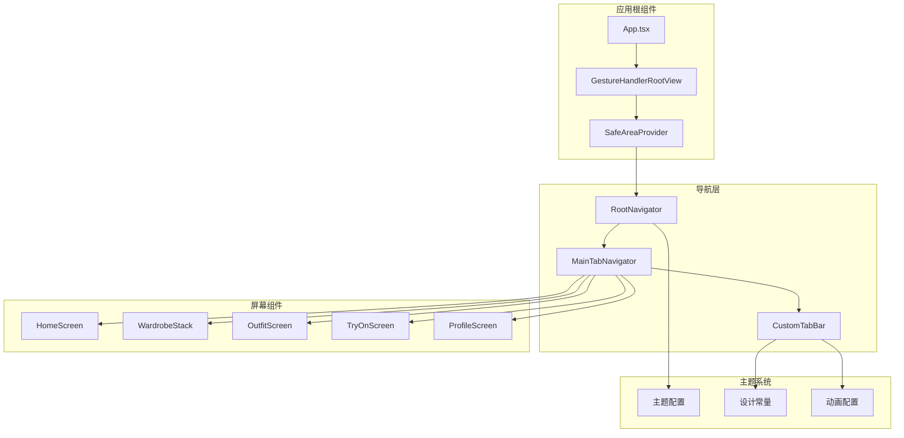
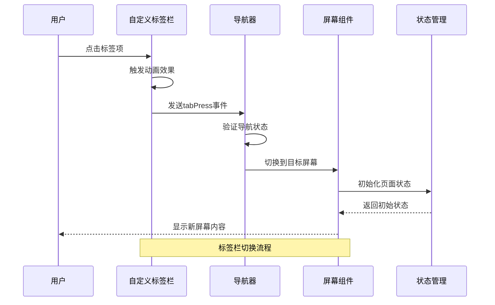
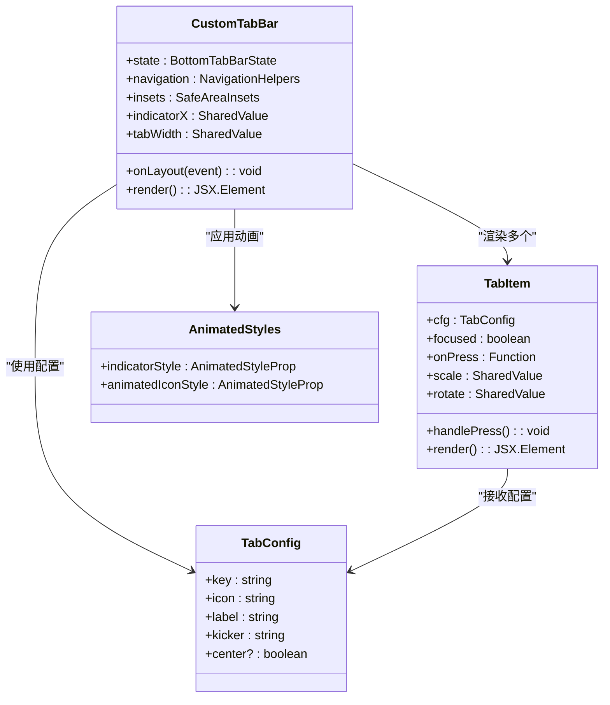
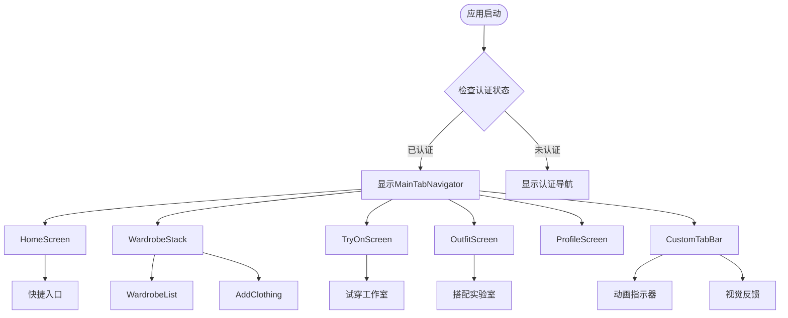
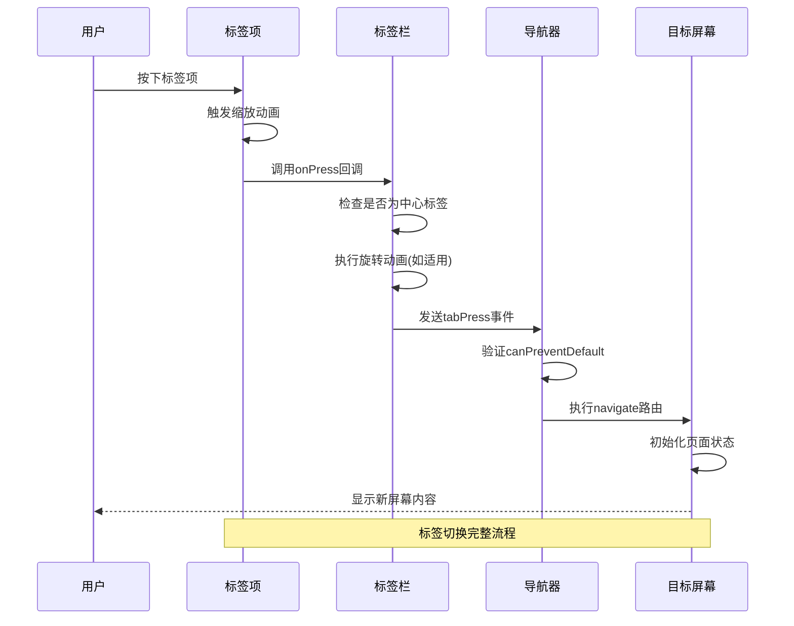
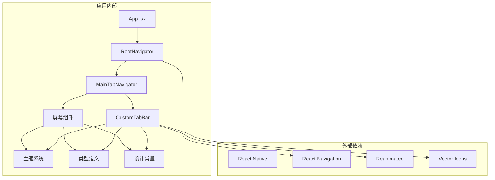

# 标签栏导航器

<cite>
**本文档引用的文件**
- [MainTabNavigator.tsx](file://FreeDressApp/src/navigation/MainTabNavigator.tsx)
- [CustomTabBar.tsx](file://FreeDressApp/src/navigation/CustomTabBar.tsx)
- [RootNavigator.tsx](file://FreeDressApp/src/navigation/RootNavigator.tsx)
- [WardrobeStack.tsx](file://FreeDressApp/src/navigation/WardrobeStack.tsx)
- [index.ts](file://FreeDressApp/src/types/index.ts)
- [index.ts](file://FreeDressApp/src/constants/index.ts)
- [HomeScreen.tsx](file://FreeDressApp/src/screens/HomeScreen.tsx)
- [ProfileScreen.tsx](file://FreeDressApp/src/screens/ProfileScreen.tsx)
- [OutfitScreen.tsx](file://FreeDressApp/src/screens/OutfitScreen.tsx)
- [TryOnScreen.tsx](file://FreeDressApp/src/screens/TryOnScreen.tsx)
- [App.tsx](file://FreeDressApp/src/App.tsx)
- [ScreenHeader.tsx](file://FreeDressApp/src/components/ScreenHeader.tsx)
- [motion.ts](file://FreeDressApp/src/theme/motion.ts)
- [grain.tsx](file://FreeDressApp/src/theme/grain.tsx)
</cite>

## 目录
1. [简介](#简介)
2. [项目结构](#项目结构)
3. [核心组件](#核心组件)
4. [架构概览](#架构概览)
5. [详细组件分析](#详细组件分析)
6. [依赖关系分析](#依赖关系分析)
7. [性能考虑](#性能考虑)
8. [故障排除指南](#故障排除指南)
9. [结论](#结论)

## 简介

畅搭(FreeDress)应用的标签栏导航器是整个应用导航系统的核心组件，负责管理底部标签栏导航和页面路由。该系统采用现代化的React Navigation架构，结合自定义动画效果和精心设计的主题系统，为用户提供流畅的移动端导航体验。

系统的主要特点包括：
- 自定义底部标签栏组件，支持动画指示器和视觉反馈
- 响应式布局，适配不同屏幕尺寸和安全区域
- 深色主题设计，符合杂志风格的品牌形象
- 无缝的页面切换和状态保持机制
- 完整的无障碍访问支持

## 项目结构

标签栏导航器位于应用的导航层，与屏幕组件和主题系统紧密集成：

**图表来源**
- [App.tsx:11-19](file://FreeDressApp/src/App.tsx#L11-L19)
- [RootNavigator.tsx:41-84](file://FreeDressApp/src/navigation/RootNavigator.tsx#L41-L84)
- [MainTabNavigator.tsx:22-35](file://FreeDressApp/src/navigation/MainTabNavigator.tsx#L22-L35)

**章节来源**
- [App.tsx:1-28](file://FreeDressApp/src/App.tsx#L1-L28)
- [RootNavigator.tsx:1-95](file://FreeDressApp/src/navigation/RootNavigator.tsx#L1-L95)
- [MainTabNavigator.tsx:1-38](file://FreeDressApp/src/navigation/MainTabNavigator.tsx#L1-L38)

## 核心组件

### MainTabNavigator - 主标签栏导航器

MainTabNavigator是应用的主导航容器，负责配置底部标签栏和管理各个页面路由。该组件采用函数式编程模式，通过createBottomTabNavigator创建底部导航器实例。

**主要配置特性：**
- 自定义标签栏组件集成
- 关闭默认头部导航，每个页面使用独立的ScreenHeader
- 固定的标签页顺序：首页 → 衣橱 → AI试穿(中心) → 搭配 → 我的

**路由配置：**
- HomeScreen: 应用主页，展示推荐内容和快捷入口
- WardrobeStack: 衣橱功能栈，包含衣橱列表和添加衣物
- OutfitScreen: 搭配实验室，AI生成个性化搭配
- TryOnScreen: AI试穿工作室，虚拟试穿效果
- ProfileScreen: 用户个人资料和设置

**章节来源**
- [MainTabNavigator.tsx:18-35](file://FreeDressApp/src/navigation/MainTabNavigator.tsx#L18-L35)
- [MainTabNavigator.tsx:22-35](file://FreeDressApp/src/navigation/MainTabNavigator.tsx#L22-L35)

### CustomTabBar - 自定义标签栏组件

CustomTabBar是标签栏导航器的核心UI组件，实现了完全自定义的底部标签栏界面。该组件使用React Native Reanimated实现流畅的动画效果。

**设计特色：**
- 深色背景(#1F1B16)配奶油色装饰线
- 烧赭色(#A86B3D)滑动指示器
- 中心放大视觉锚点(AI试穿)
- 响应式布局，适配安全区域

**动画系统：**
- 指示器滑动动画，使用withTiming实现平滑过渡
- 标签项缩放反馈，突出当前选中项
- 自定义缓动曲线，符合编辑级设计语言
- 响应式布局计算，动态适应屏幕尺寸

**章节来源**
- [CustomTabBar.tsx:44-117](file://FreeDressApp/src/navigation/CustomTabBar.tsx#L44-L117)
- [CustomTabBar.tsx:125-197](file://FreeDressApp/src/navigation/CustomTabBar.tsx#L125-L197)

## 架构概览

标签栏导航器采用分层架构设计，各组件职责明确，耦合度低：

**图表来源**
- [CustomTabBar.tsx:90-100](file://FreeDressApp/src/navigation/CustomTabBar.tsx#L90-L100)
- [MainTabNavigator.tsx:22-35](file://FreeDressApp/src/navigation/MainTabNavigator.tsx#L22-L35)

**章节来源**
- [CustomTabBar.tsx:44-117](file://FreeDressApp/src/navigation/CustomTabBar.tsx#L44-L117)
- [RootNavigator.tsx:25-36](file://FreeDressApp/src/navigation/RootNavigator.tsx#L25-L36)

## 详细组件分析

### 自定义标签栏组件架构

CustomTabBar组件采用了模块化的架构设计，包含多个子组件和复杂的动画系统：

**图表来源**
- [CustomTabBar.tsx:44-117](file://FreeDressApp/src/navigation/CustomTabBar.tsx#L44-L117)
- [CustomTabBar.tsx:125-197](file://FreeDressApp/src/navigation/CustomTabBar.tsx#L125-L197)

#### 标签配置系统

标签栏使用集中式的配置管理系统，定义了每个标签页的外观和行为：

| 标签键 | 图标 | 标签文本 | 小标题 | 特殊属性 |
|--------|------|----------|--------|----------|
| Home | home | 首页 | HOME | - |
| Wardrobe | inbox | 衣橱 | CLOSET | - |
| TryOn | user-check | 试穿 | TRY-ON | center |
| Outfit | layers | 搭配 | STYLE | - |
| Profile | user | 我的 | YOU | - |

**章节来源**
- [CustomTabBar.tsx:33-39](file://FreeDressApp/src/navigation/CustomTabBar.tsx#L33-L39)

#### 动画系统设计

标签栏的动画系统基于React Native Reanimated，实现了多层次的视觉反馈：

**指示器动画：**
- 使用useSharedValue跟踪当前位置
- withTiming实现平滑滑动效果
- 自定义缓动曲线(Ease.editorial)提升品质感

**标签项动画：**
- 缩放反馈：当前选中项轻微放大(1.02倍)
- 旋转动画：中心标签项支持180度旋转
- 响应式布局：动态计算标签宽度

**章节来源**
- [CustomTabBar.tsx:49-66](file://FreeDressApp/src/navigation/CustomTabBar.tsx#L49-L66)
- [CustomTabBar.tsx:129-151](file://FreeDressApp/src/navigation/CustomTabBar.tsx#L129-L151)

### 页面路由管理

MainTabNavigator负责管理所有标签页的路由配置，采用声明式的方式定义页面关系：

**图表来源**
- [MainTabNavigator.tsx:22-35](file://FreeDressApp/src/navigation/MainTabNavigator.tsx#L22-L35)
- [WardrobeStack.tsx:9-20](file://FreeDressApp/src/navigation/WardrobeStack.tsx#L9-L20)

**章节来源**
- [MainTabNavigator.tsx:16-35](file://FreeDressApp/src/navigation/MainTabNavigator.tsx#L16-L35)
- [WardrobeStack.tsx:1-21](file://FreeDressApp/src/navigation/WardrobeStack.tsx#L1-L21)

### 标签页切换逻辑

标签栏的切换逻辑实现了完整的用户交互流程：

**图表来源**
- [CustomTabBar.tsx:90-100](file://FreeDressApp/src/navigation/CustomTabBar.tsx#L90-L100)
- [CustomTabBar.tsx:143-151](file://FreeDressApp/src/navigation/CustomTabBar.tsx#L143-L151)

**章节来源**
- [CustomTabBar.tsx:89-100](file://FreeDressApp/src/navigation/CustomTabBar.tsx#L89-L100)

### 页面懒加载和状态保持

应用实现了智能的页面加载策略，平衡性能和用户体验：

**懒加载机制：**
- 标签页切换时才初始化目标屏幕
- 使用React Navigation的内置懒加载功能
- 减少初始内存占用和启动时间

**状态保持策略：**
- 使用NavigationContainer管理全局状态
- 屏幕组件内部维护自己的局部状态
- 通过状态管理库(如Zustand)处理复杂业务状态

**章节来源**
- [RootNavigator.tsx:49-51](file://FreeDressApp/src/navigation/RootNavigator.tsx#L49-L51)
- [HomeScreen.tsx:100-116](file://FreeDressApp/src/screens/HomeScreen.tsx#L100-L116)

## 依赖关系分析

标签栏导航器的依赖关系体现了清晰的分层架构：

**图表来源**
- [App.tsx:1-28](file://FreeDressApp/src/App.tsx#L1-L28)
- [RootNavigator.tsx:1-95](file://FreeDressApp/src/navigation/RootNavigator.tsx#L1-L95)
- [CustomTabBar.tsx:1-250](file://FreeDressApp/src/navigation/CustomTabBar.tsx#L1-L250)

**章节来源**
- [index.ts:74-98](file://FreeDressApp/src/types/index.ts#L74-L98)
- [index.ts:15-52](file://FreeDressApp/src/constants/index.ts#L15-L52)

### 主题配置系统

应用采用了统一的主题配置系统，确保视觉一致性：

**色彩系统：**
- 主色调：深灰(#1F1B16)、米色(#EBE4D6)、烧赭(#A86B3D)
- 辅助色彩：金棕(#BFA478)、雾灰(#C9C0B0)、焦糖(#D9B492)
- 品牌色彩：主色(#A86B3D)、强调色(#7A4A28)、浅化色(#D9B492)

**设计令牌：**
- 间距网格：4px基础单位
- 字体系统：衬线、无衬线、等宽字体
- 圆角半径：0、4、8、16、全圆
- 阴影系统：卡片、海报、按压效果

**章节来源**
- [index.ts:15-52](file://FreeDressApp/src/constants/index.ts#L15-L52)
- [index.ts:86-174](file://FreeDressApp/src/constants/index.ts#L86-L174)

### 图标资源管理

应用使用react-native-vector-icons库管理图标资源：

**图标配置：**
- Feather图标集：简洁线条图标
- 响应式图标大小：20px标准尺寸
- 主题化图标颜色：根据状态动态变化

**图标使用模式：**
- 标签栏图标：固定大小和颜色
- 屏幕内图标：根据上下文调整
- 交互图标：支持按压反馈

**章节来源**
- [CustomTabBar.tsx:21](file://FreeDressApp/src/navigation/CustomTabBar.tsx#L21)
- [HomeScreen.tsx:18](file://FreeDressApp/src/screens/HomeScreen.tsx#L18)

## 性能考虑

标签栏导航器在设计时充分考虑了性能优化：

**动画性能：**
- 使用Reanimated实现硬件加速动画
- 避免布局抖动，使用transform属性
- 合理的动画时长和缓动曲线

**内存管理：**
- 懒加载减少初始内存占用
- 合理的组件卸载策略
- 避免内存泄漏的事件监听器清理

**渲染优化：**
- 使用memo化避免不必要的重渲染
- 合理的布局计算时机
- 图标和样式的预计算

## 故障排除指南

### 常见问题及解决方案

**标签栏不显示或显示异常：**
- 检查SafeAreaProvider配置
- 验证标签栏高度和安全区域设置
- 确认动画值的正确初始化

**动画效果卡顿：**
- 检查Reanimated配置和版本兼容性
- 避免在动画期间进行昂贵的计算
- 确保使用useAnimatedStyle而不是直接修改样式对象

**路由跳转问题：**
- 验证路由名称与Screen组件name属性匹配
- 检查NavigationContainer的配置
- 确认tabPress事件的正确处理

**章节来源**
- [CustomTabBar.tsx:49-60](file://FreeDressApp/src/navigation/CustomTabBar.tsx#L49-L60)
- [RootNavigator.tsx:42-47](file://FreeDressApp/src/navigation/RootNavigator.tsx#L42-L47)

## 结论

畅搭(FreeDress)应用的标签栏导航器展现了现代React Native应用的最佳实践。通过精心设计的自定义标签栏组件、完善的动画系统和统一的主题配置，为用户提供了优质的移动端导航体验。

**主要成就：**
- 实现了完全自定义的标签栏界面，符合品牌设计语言
- 建立了流畅的动画反馈系统，提升用户体验
- 采用了模块化的架构设计，便于维护和扩展
- 实现了响应式布局，适配各种设备和屏幕尺寸

**技术亮点：**
- 基于Reanimated的高性能动画实现
- 集成的类型安全设计系统
- 完善的状态管理和懒加载策略
- 无障碍访问和跨平台兼容性

该导航系统为后续的功能扩展奠定了坚实的基础，可以轻松地添加新的标签页和功能模块，同时保持一致的用户体验和性能表现。