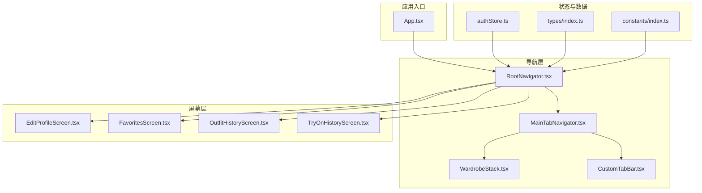
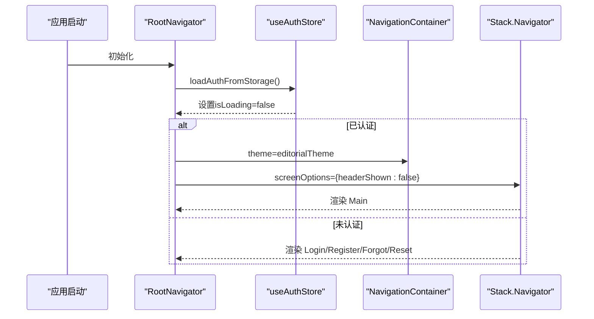
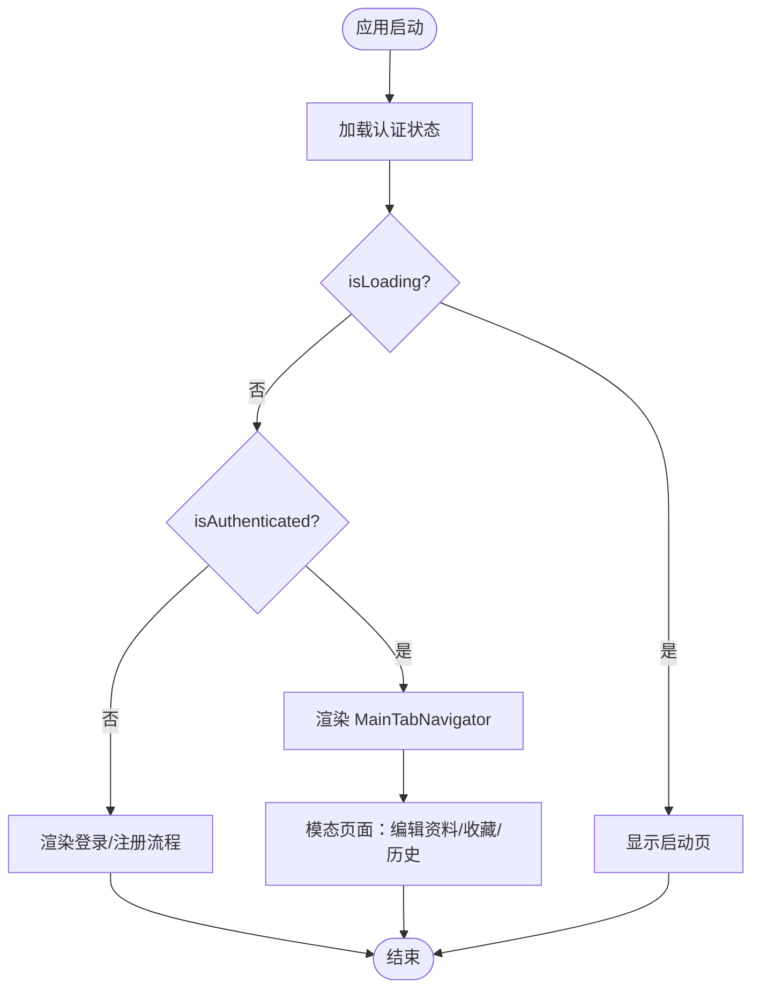
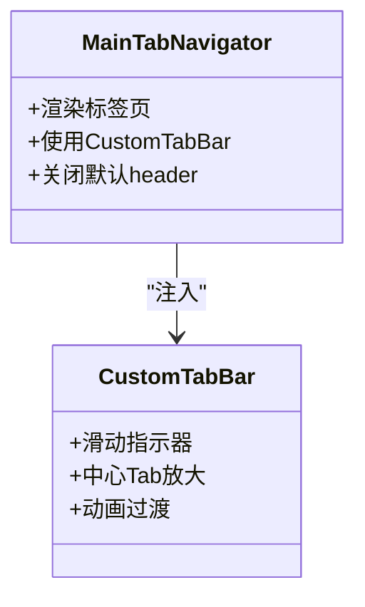
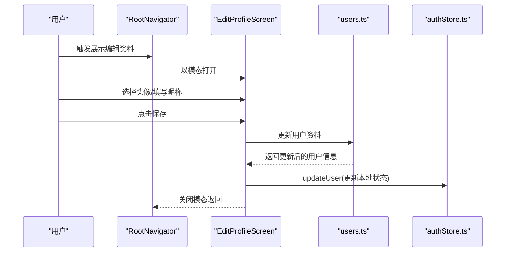
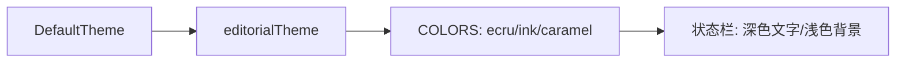
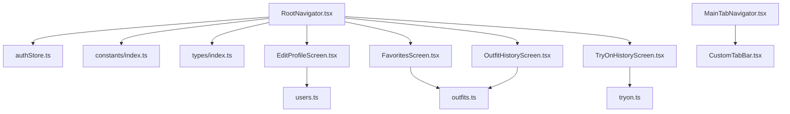

# 根导航器

<cite>
**本文档引用的文件**
- [RootNavigator.tsx](file://FreeDressApp/src/navigation/RootNavigator.tsx)
- [MainTabNavigator.tsx](file://FreeDressApp/src/navigation/MainTabNavigator.tsx)
- [WardrobeStack.tsx](file://FreeDressApp/src/navigation/WardrobeStack.tsx)
- [CustomTabBar.tsx](file://FreeDressApp/src/navigation/CustomTabBar.tsx)
- [authStore.ts](file://FreeDressApp/src/store/authStore.ts)
- [EditProfileScreen.tsx](file://FreeDressApp/src/screens/EditProfileScreen.tsx)
- [FavoritesScreen.tsx](file://FreeDressApp/src/screens/FavoritesScreen.tsx)
- [OutfitHistoryScreen.tsx](file://FreeDressApp/src/screens/OutfitHistoryScreen.tsx)
- [TryOnHistoryScreen.tsx](file://FreeDressApp/src/screens/TryOnHistoryScreen.tsx)
- [index.ts](file://FreeDressApp/src/constants/index.ts)
- [index.ts](file://FreeDressApp/src/types/index.ts)
- [ScreenHeader.tsx](file://FreeDressApp/src/components/ScreenHeader.tsx)
- [index.ts](file://FreeDressApp/src/theme/index.ts)
- [App.tsx](file://FreeDressApp/App.tsx)
- [users.ts](file://FreeDressApp/src/api/users.ts)
- [outfits.ts](file://FreeDressApp/src/api/outfits.ts)
- [tryon.ts](file://FreeDressApp/src/api/tryon.ts)
</cite>

## 目录
1. [简介](#简介)
2. [项目结构](#项目结构)
3. [核心组件](#核心组件)
4. [架构总览](#架构总览)
5. [详细组件分析](#详细组件分析)
6. [依赖关系分析](#依赖关系分析)
7. [性能考虑](#性能考虑)
8. [故障排除指南](#故障排除指南)
9. [结论](#结论)

## 简介
本文件系统性解析畅搭(FreeDress)应用的根导航器设计与实现，重点覆盖以下方面：
- 基于用户认证状态的动态路由切换机制
- 编辑个人资料、收藏夹、搭配历史、AI试穿历史等模态页面的配置与交互
- 导航主题配置、颜色方案定制与状态栏设置
- 导航容器配置、屏幕选项设置与条件渲染逻辑
- 加载状态处理、认证状态检查与页面跳转的最佳实践

## 项目结构
根导航器位于应用前端导航体系的最外层，负责根据用户登录状态决定展示路径，并统一应用导航主题与状态栏样式。

**图表来源**
- [RootNavigator.tsx:1-95](file://FreeDressApp/src/navigation/RootNavigator.tsx#L1-L95)
- [MainTabNavigator.tsx:1-38](file://FreeDressApp/src/navigation/MainTabNavigator.tsx#L1-L38)
- [WardrobeStack.tsx:1-21](file://FreeDressApp/src/navigation/WardrobeStack.tsx#L1-L21)
- [CustomTabBar.tsx:1-250](file://FreeDressApp/src/navigation/CustomTabBar.tsx#L1-L250)
- [authStore.ts:1-123](file://FreeDressApp/src/store/authStore.ts#L1-L123)
- [index.ts:74-98](file://FreeDressApp/src/types/index.ts#L74-L98)
- [index.ts:15-52](file://FreeDressApp/src/constants/index.ts#L15-L52)

**章节来源**
- [RootNavigator.tsx:1-95](file://FreeDressApp/src/navigation/RootNavigator.tsx#L1-L95)
- [App.tsx:15-46](file://FreeDressApp/App.tsx#L15-L46)

## 核心组件
- 根导航器：根据认证状态动态选择主导航或登录注册流程；统一配置导航主题与状态栏；为模态页面提供容器。
- 主标签导航器：承载底部标签页，使用自定义TabBar，关闭默认header以复用各页面自带的页眉组件。
- 衣橱栈：在衣橱列表之上提供添加衣物的模态页面。
- 认证状态管理：Zustand Store负责用户信息、令牌与认证状态的持久化与加载。

关键实现要点：
- 根导航器通过useAuthStore的状态判断是否进入主流程或登录流程。
- 导航主题采用基于DefaultTheme的颜色映射，确保UI一致性。
- 状态栏采用浅色文字与背景色，提升可读性。
- 屏幕选项统一隐藏header并设置内容背景色，减少重复配置。

**章节来源**
- [RootNavigator.tsx:41-85](file://FreeDressApp/src/navigation/RootNavigator.tsx#L41-L85)
- [MainTabNavigator.tsx:18-35](file://FreeDressApp/src/navigation/MainTabNavigator.tsx#L18-L35)
- [WardrobeStack.tsx:9-20](file://FreeDressApp/src/navigation/WardrobeStack.tsx#L9-L20)
- [authStore.ts:28-122](file://FreeDressApp/src/store/authStore.ts#L28-L122)

## 架构总览
根导航器采用“容器 + 条件渲染”的策略，结合Zustand状态管理与React Navigation的Stack/Tab组合，形成清晰的导航分层。

**图表来源**
- [RootNavigator.tsx:42-84](file://FreeDressApp/src/navigation/RootNavigator.tsx#L42-L84)
- [authStore.ts:97-121](file://FreeDressApp/src/store/authStore.ts#L97-L121)

## 详细组件分析

### 根导航器（RootNavigator）
- 动态路由切换：依据isAuthenticated决定渲染主流程或登录注册流程。
- 主题与状态栏：使用自定义editorialTheme，状态栏设置为浅色文字与背景色。
- 屏幕容器：统一设置screenOptions，隐藏header并设置内容背景色。
- 模态页面：编辑个人资料、收藏夹、搭配历史、AI试穿历史均以模态呈现，增强用户体验。

**图表来源**
- [RootNavigator.tsx:49-84](file://FreeDressApp/src/navigation/RootNavigator.tsx#L49-L84)
- [authStore.ts:97-121](file://FreeDressApp/src/store/authStore.ts#L97-L121)

**章节来源**
- [RootNavigator.tsx:25-36](file://FreeDressApp/src/navigation/RootNavigator.tsx#L25-L36)
- [RootNavigator.tsx:56-84](file://FreeDressApp/src/navigation/RootNavigator.tsx#L56-L84)

### 主标签导航器（MainTabNavigator）
- 标签页顺序：Home / Wardrobe / TryOn(中心) / Outfit / Profile，突出AI试穿入口。
- 自定义TabBar：集成动画指示器与中心放大效果，提升交互体验。
- 屏幕选项：关闭默认header，由各页面自带的ScreenHeader提供一致的页眉。

**图表来源**
- [MainTabNavigator.tsx:22-35](file://FreeDressApp/src/navigation/MainTabNavigator.tsx#L22-L35)
- [CustomTabBar.tsx:44-117](file://FreeDressApp/src/navigation/CustomTabBar.tsx#L44-L117)

**章节来源**
- [MainTabNavigator.tsx:18-35](file://FreeDressApp/src/navigation/MainTabNavigator.tsx#L18-L35)
- [CustomTabBar.tsx:33-39](file://FreeDressApp/src/navigation/CustomTabBar.tsx#L33-L39)

### 衣橱栈（WardrobeStack）
- 结构：衣橱列表 + 添加衣物（模态）。
- 屏幕选项：隐藏header，模态使用底部滑入动画。

**章节来源**
- [WardrobeStack.tsx:9-20](file://FreeDressApp/src/navigation/WardrobeStack.tsx#L9-L20)

### 模态页面配置与交互

#### 编辑个人资料（EditProfileScreen）
- 模态配置：在根导航器中以模态方式呈现，使用底部滑入动画。
- 功能要点：头像选择（相机/相册）、昵称编辑、保存并更新本地状态。
- 与认证状态联动：保存成功后通过useAuthStore更新用户信息。

**图表来源**
- [RootNavigator.tsx:65-72](file://FreeDressApp/src/navigation/RootNavigator.tsx#L65-L72)
- [EditProfileScreen.tsx:27-77](file://FreeDressApp/src/screens/EditProfileScreen.tsx#L27-L77)
- [users.ts:23-27](file://FreeDressApp/src/api/users.ts#L23-L27)
- [authStore.ts:83-92](file://FreeDressApp/src/store/authStore.ts#L83-L92)

**章节来源**
- [EditProfileScreen.tsx:27-77](file://FreeDressApp/src/screens/EditProfileScreen.tsx#L27-L77)
- [users.ts:23-27](file://FreeDressApp/src/api/users.ts#L23-L27)
- [authStore.ts:83-92](file://FreeDressApp/src/store/authStore.ts#L83-L92)

#### 收藏夹（FavoritesScreen）
- 模态配置：根导航器中直接渲染，非模态。
- 功能要点：拉取收藏列表、支持下拉刷新、移除收藏项。
- 页面样式：统一背景色与页眉组件，保持设计一致性。

**章节来源**
- [FavoritesScreen.tsx:34-68](file://FreeDressApp/src/screens/FavoritesScreen.tsx#L34-L68)
- [RootNavigator.tsx:70](file://FreeDressApp/src/navigation/RootNavigator.tsx#L70)

#### 搭配历史（OutfitHistoryScreen）
- 模态配置：根导航器中直接渲染，非模态。
- 功能要点：获取历史记录、格式化日期、空状态提示。
- 页面样式：统一背景色与页眉组件，保持设计一致性。

**章节来源**
- [OutfitHistoryScreen.tsx:32-62](file://FreeDressApp/src/screens/OutfitHistoryScreen.tsx#L32-L62)
- [RootNavigator.tsx:71](file://FreeDressApp/src/navigation/RootNavigator.tsx#L71)

#### AI试穿历史（TryOnHistoryScreen）
- 模态配置：根导航器中直接渲染，非模态。
- 功能要点：获取试穿结果、格式化日期、空状态提示。
- 页面样式：统一背景色与页眉组件，保持设计一致性。

**章节来源**
- [TryOnHistoryScreen.tsx:35-65](file://FreeDressApp/src/screens/TryOnHistoryScreen.tsx#L35-L65)
- [RootNavigator.tsx:72](file://FreeDressApp/src/navigation/RootNavigator.tsx#L72)

### 导航主题配置与颜色方案
- 主题来源：基于DefaultTheme扩展，覆盖primary、background、card、text、border、notification等颜色。
- 颜色方案：采用暖灰棕主调与烧赭点睛色，营造杂志感与极简风格。
- 状态栏：浅色文字与背景色，确保在不同背景下具备良好对比度。

**图表来源**
- [RootNavigator.tsx:25-36](file://FreeDressApp/src/navigation/RootNavigator.tsx#L25-L36)
- [index.ts:15-52](file://FreeDressApp/src/constants/index.ts#L15-L52)
- [App.tsx:20](file://FreeDressApp/App.tsx#L20)

**章节来源**
- [RootNavigator.tsx:25-36](file://FreeDressApp/src/navigation/RootNavigator.tsx#L25-L36)
- [index.ts:15-52](file://FreeDressApp/src/constants/index.ts#L15-L52)
- [App.tsx:20](file://FreeDressApp/App.tsx#L20)

### 类型与导航参数
- RootStackParamList：定义根导航器中的所有屏幕名称与参数类型，包括模态页面。
- MainTabParamList：定义主标签导航器中的标签页参数。
- WardrobeStackParamList：定义衣橱栈中的屏幕参数。

**章节来源**
- [index.ts:74-98](file://FreeDressApp/src/types/index.ts#L74-L98)

## 依赖关系分析
- 根导航器依赖认证状态管理与全局常量，控制路由与主题。
- 主标签导航器依赖自定义TabBar，提供一致的交互体验。
- 模态页面依赖根导航器的screenOptions与presentation配置。
- 页面样式统一依赖ScreenHeader组件与COLORS常量。

**图表来源**
- [RootNavigator.tsx:10-22](file://FreeDressApp/src/navigation/RootNavigator.tsx#L10-L22)
- [authStore.ts:1-5](file://FreeDressApp/src/store/authStore.ts#L1-L5)
- [index.ts:74-98](file://FreeDressApp/src/types/index.ts#L74-L98)
- [EditProfileScreen.tsx:23-25](file://FreeDressApp/src/screens/EditProfileScreen.tsx#L23-L25)
- [FavoritesScreen.tsx:24](file://FreeDressApp/src/screens/FavoritesScreen.tsx#L24)
- [OutfitHistoryScreen.tsx:22](file://FreeDressApp/src/screens/OutfitHistoryScreen.tsx#L22)
- [TryOnHistoryScreen.tsx:22](file://FreeDressApp/src/screens/TryOnHistoryScreen.tsx#L22)

**章节来源**
- [RootNavigator.tsx:10-22](file://FreeDressApp/src/navigation/RootNavigator.tsx#L10-L22)
- [authStore.ts:1-5](file://FreeDressApp/src/store/authStore.ts#L1-L5)
- [index.ts:74-98](file://FreeDressApp/src/types/index.ts#L74-L98)

## 性能考虑
- 状态加载优化：首次启动时异步加载认证状态，避免阻塞主线程。
- 模态渲染：仅在需要时渲染模态页面，减少不必要的布局计算。
- 图片与列表：收藏、搭配历史、试穿历史页面使用FlatList与图片懒加载，降低内存占用。
- 主题与样式：统一颜色与字体配置，减少重复计算与样式冲突。

## 故障排除指南
- 认证状态异常：检查useAuthStore的loadAuthFromStorage是否正确读取本地存储，确认令牌有效性。
- 模态页面不显示：确认根导航器中对应screen的presentation与animation配置正确。
- 状态栏样式问题：检查App.tsx与RootNavigator.tsx中的状态栏配置是否一致。
- 页面空白：确认screenOptions中headerShown与contentStyle设置是否符合预期。

**章节来源**
- [authStore.ts:97-121](file://FreeDressApp/src/store/authStore.ts#L97-L121)
- [RootNavigator.tsx:56-60](file://FreeDressApp/src/navigation/RootNavigator.tsx#L56-L60)
- [App.tsx:20](file://FreeDressApp/App.tsx#L20)

## 结论
根导航器通过清晰的条件渲染与统一的主题配置，实现了从登录到主功能的顺畅流转。结合自定义TabBar与模态页面，既保证了导航的一致性，又提升了用户体验。建议在后续迭代中持续关注状态加载性能与页面交互反馈，进一步优化加载状态与错误处理流程。