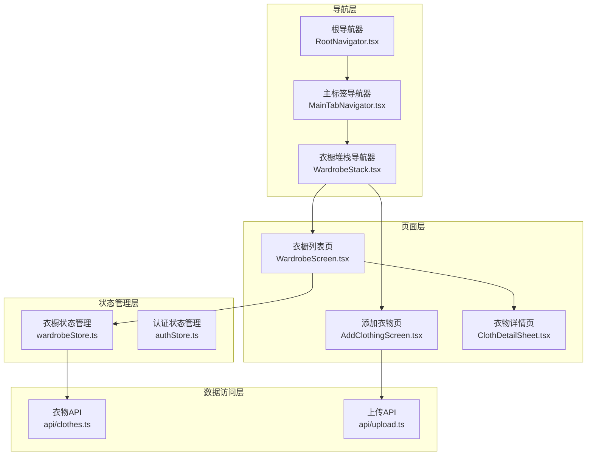
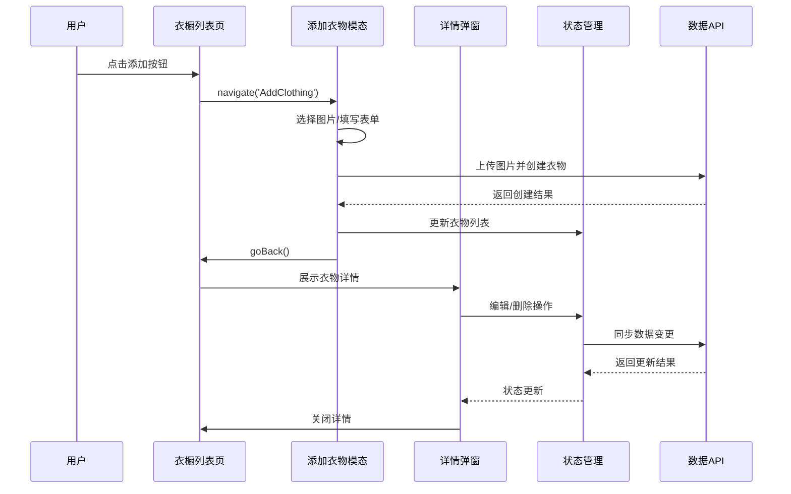
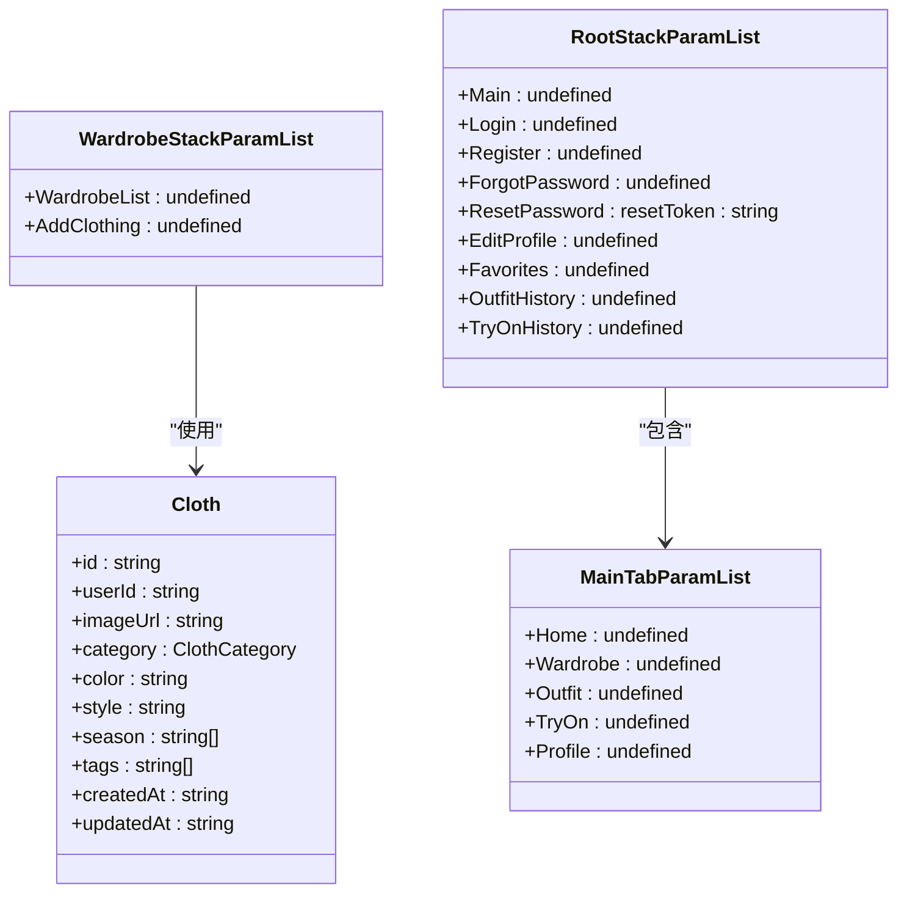
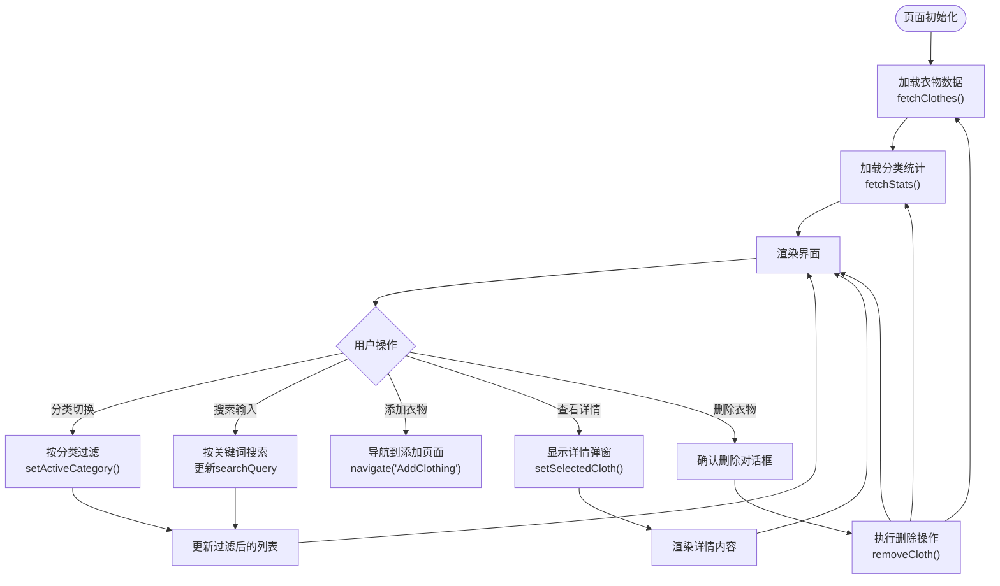
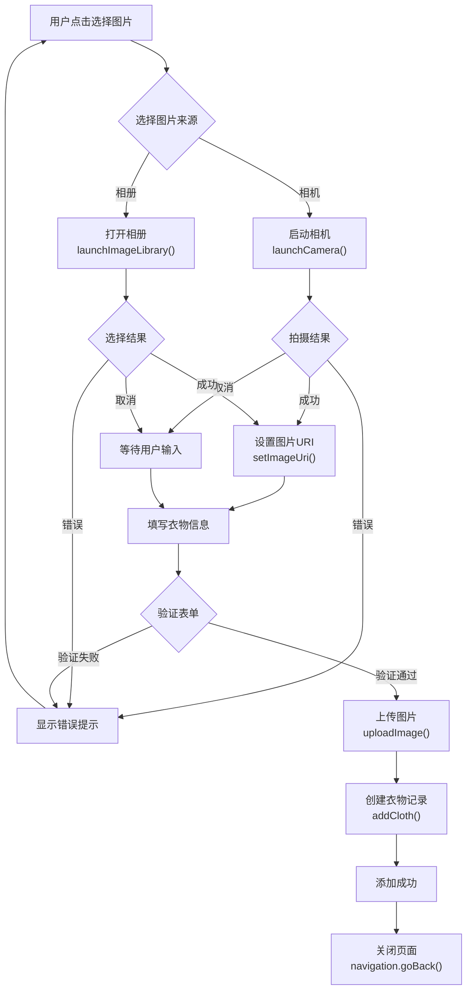
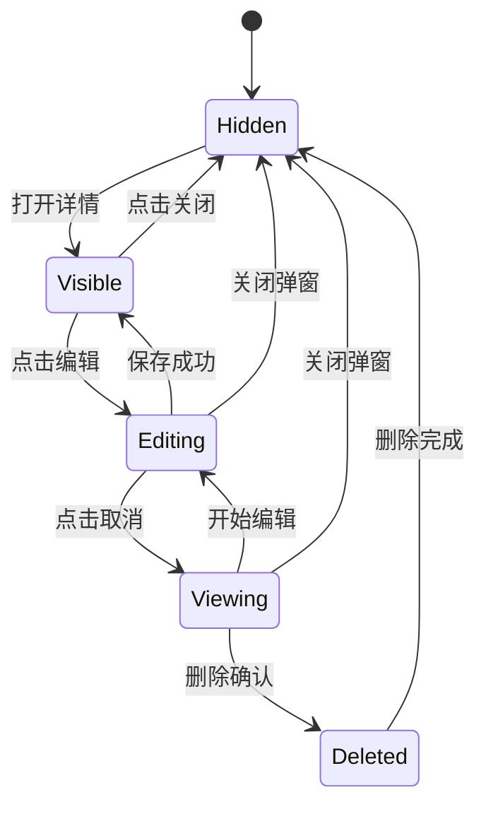
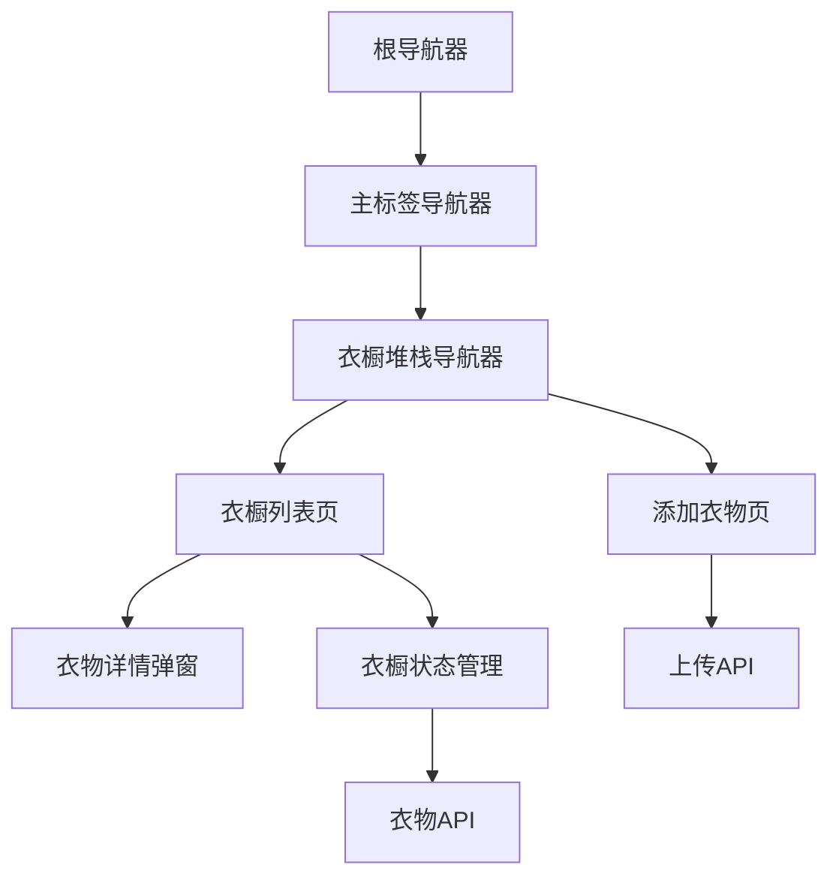
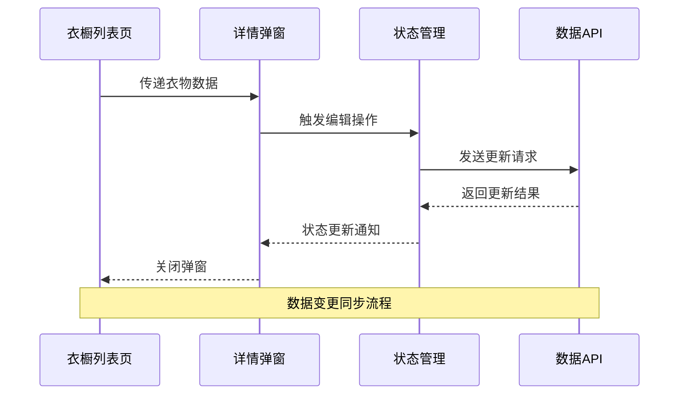

# 衣橱堆栈导航器

<cite>
**本文档引用的文件**
- [WardrobeStack.tsx](file://FreeDressApp/src/navigation/WardrobeStack.tsx)
- [WardrobeScreen.tsx](file://FreeDressApp/src/screens/WardrobeScreen.tsx)
- [AddClothingScreen.tsx](file://FreeDressApp/src/screens/AddClothingScreen.tsx)
- [MainTabNavigator.tsx](file://FreeDressApp/src/navigation/MainTabNavigator.tsx)
- [RootNavigator.tsx](file://FreeDressApp/src/navigation/RootNavigator.tsx)
- [wardrobeStore.ts](file://FreeDressApp/src/store/wardrobeStore.ts)
- [ClothDetailSheet.tsx](file://FreeDressApp/src/components/ClothDetailSheet.tsx)
- [types/index.ts](file://FreeDressApp/src/types/index.ts)
- [constants/index.ts](file://FreeDressApp/src/constants/index.ts)
- [api/clothes.ts](file://FreeDressApp/src/api/clothes.ts)
</cite>

## 目录
1. [简介](#简介)
2. [项目结构](#项目结构)
3. [核心组件](#核心组件)
4. [架构概览](#架构概览)
5. [详细组件分析](#详细组件分析)
6. [依赖关系分析](#依赖关系分析)
7. [性能考虑](#性能考虑)
8. [故障排除指南](#故障排除指南)
9. [结论](#结论)

## 简介

本文档深入解析畅搭(FreeDress)应用中的衣橱堆栈导航器(WardrobeStack)，这是一个基于React Navigation的原生堆栈导航实现。该导航器负责管理衣橱相关的页面流转，包括衣橱列表页、添加衣物页和衣物详情页之间的导航流程。

WardrobeStack采用模态展示方式呈现添加衣物页面，通过滑动从底部出现的动画效果，为用户提供沉浸式的添加体验。整个导航系统遵循"衣橱"作为主要功能模块的设计理念，与其他功能模块如搭配、试穿等形成清晰的功能分区。

## 项目结构

FreeDress应用采用按功能模块组织的文件结构，导航相关代码集中在`src/navigation`目录下，页面组件位于`src/screens`目录，状态管理使用Zustand存储库。

**图表来源**
- [RootNavigator.tsx:1-95](file://FreeDressApp/src/navigation/RootNavigator.tsx#L1-L95)
- [MainTabNavigator.tsx:1-38](file://FreeDressApp/src/navigation/MainTabNavigator.tsx#L1-L38)
- [WardrobeStack.tsx:1-21](file://FreeDressApp/src/navigation/WardrobeStack.tsx#L1-L21)

**章节来源**
- [RootNavigator.tsx:1-95](file://FreeDressApp/src/navigation/RootNavigator.tsx#L1-L95)
- [MainTabNavigator.tsx:1-38](file://FreeDressApp/src/navigation/MainTabNavigator.tsx#L1-L38)
- [WardrobeStack.tsx:1-21](file://FreeDressApp/src/navigation/WardrobeStack.tsx#L1-L21)

## 核心组件

### WardrobeStack导航器

WardrobeStack是衣橱功能的核心导航容器，负责管理三个主要页面：
- **WardrobeList**: 衣橱列表展示页面
- **AddClothing**: 添加衣物的模态页面
- **ClothDetailSheet**: 衣物详情的底部弹窗

该导航器使用`createNativeStackNavigator`创建，配置了无头部显示的统一外观，并为添加衣物页面设置了模态展示和底部滑入动画。

### 衣橱状态管理

衣橱状态管理使用Zustand实现，提供以下核心功能：
- 衣物列表获取和缓存
- 分类统计信息管理
- 衣物增删改查操作
- 加载状态管理
- 活跃分类状态维护

### 页面组件架构

每个页面都遵循相似的架构模式：
- 使用`useNavigation`钩子进行页面导航
- 通过`useWardrobeStore`访问全局状态
- 实现完整的错误处理和用户反馈
- 支持下拉刷新和搜索功能

**章节来源**
- [WardrobeStack.tsx:1-21](file://FreeDressApp/src/navigation/WardrobeStack.tsx#L1-L21)
- [wardrobeStore.ts:1-83](file://FreeDressApp/src/store/wardrobeStore.ts#L1-L83)

## 架构概览

WardrobeStack采用分层架构设计，确保各层职责清晰分离：

**图表来源**
- [WardrobeScreen.tsx:220-256](file://FreeDressApp/src/screens/WardrobeScreen.tsx#L220-L256)
- [AddClothingScreen.tsx:79-87](file://FreeDressApp/src/screens/AddClothingScreen.tsx#L79-L87)
- [wardrobeStore.ts:64-81](file://FreeDressApp/src/store/wardrobeStore.ts#L64-L81)

### 导航参数类型系统

应用使用TypeScript定义严格的导航参数类型，确保类型安全：

**图表来源**
- [types/index.ts:86-97](file://FreeDressApp/src/types/index.ts#L86-L97)
- [types/index.ts:22-33](file://FreeDressApp/src/types/index.ts#L22-L33)

**章节来源**
- [types/index.ts:73-97](file://FreeDressApp/src/types/index.ts#L73-L97)

## 详细组件分析

### 衣橱列表页 (WardrobeScreen)

WardrobeScreen是衣橱功能的主要入口，实现了完整的衣物管理界面：

#### 核心功能特性

1. **分类筛选系统**: 支持全部、上衣、下装、外套、配饰、鞋子六种分类
2. **实时搜索功能**: 支持按颜色、风格、标签进行多维度搜索
3. **下拉刷新**: 实现数据的实时更新
4. **长按删除**: 提供便捷的衣物删除操作
5. **详情弹窗**: 通过底部弹窗展示详细的衣物信息

#### 状态管理集成

**图表来源**
- [WardrobeScreen.tsx:56-90](file://FreeDressApp/src/screens/WardrobeScreen.tsx#L56-L90)
- [WardrobeScreen.tsx:109-107](file://FreeDressApp/src/screens/WardrobeScreen.tsx#L109-L107)

#### 性能优化策略

- **虚拟化列表**: 使用`FlatList`或滚动视图实现高效的列表渲染
- **记忆化计算**: 使用`useMemo`优化过滤逻辑的计算
- **条件渲染**: 根据加载状态显示骨架屏或空状态
- **防抖搜索**: 搜索输入采用防抖机制减少不必要的重新渲染

**章节来源**
- [WardrobeScreen.tsx:1-423](file://FreeDressApp/src/screens/WardrobeScreen.tsx#L1-L423)

### 添加衣物页 (AddClothingScreen)

AddClothingScreen提供了完整的衣物添加流程，支持多种图片来源和丰富的属性配置：

#### 图片处理系统

**图表来源**
- [AddClothingScreen.tsx:47-59](file://FreeDressApp/src/screens/AddClothingScreen.tsx#L47-L59)
- [AddClothingScreen.tsx:61-87](file://FreeDressApp/src/screens/AddClothingScreen.tsx#L61-L87)

#### 表单验证和错误处理

- **必填项验证**: 确保图片和分类信息完整
- **异步上传**: 支持网络异常情况下的重试机制
- **进度反馈**: 显示上传进度和操作状态
- **错误恢复**: 提供友好的错误提示和重试选项

**章节来源**
- [AddClothingScreen.tsx:1-253](file://FreeDressApp/src/screens/AddClothingScreen.tsx#L1-L253)

### 衣物详情弹窗 (ClothDetailSheet)

ClothDetailSheet采用底部弹窗的形式展示衣物详情，提供了完整的编辑和管理功能：

#### 交互模式设计

**图表来源**
- [ClothDetailSheet.tsx:29-44](file://FreeDressApp/src/components/ClothDetailSheet.tsx#L29-L44)

#### 编辑功能实现

- **即时编辑**: 支持在详情页直接修改衣物属性
- **批量操作**: 提供季节选择和标签管理
- **数据同步**: 编辑完成后自动更新状态管理器
- **撤销机制**: 编辑失败时保持原有数据不变

**章节来源**
- [ClothDetailSheet.tsx:1-353](file://FreeDressApp/src/components/ClothDetailSheet.tsx#L1-L353)

## 依赖关系分析

### 导航层级关系

**图表来源**
- [RootNavigator.tsx:13-22](file://FreeDressApp/src/navigation/RootNavigator.tsx#L13-L22)
- [MainTabNavigator.tsx:10-14](file://FreeDressApp/src/navigation/MainTabNavigator.tsx#L10-L14)

### 状态管理依赖

WardrobeStore作为核心状态管理器，依赖于多个外部服务：

- **API层**: 通过`api/clothes.ts`进行数据持久化
- **图像处理**: 通过`api/upload.ts`处理图片上传
- **本地存储**: 使用AsyncStorage进行数据持久化
- **全局主题**: 依赖`constants/index.ts`中的设计令牌

### 组件间通信机制

**图表来源**
- [wardrobeStore.ts:70-75](file://FreeDressApp/src/store/wardrobeStore.ts#L70-L75)
- [ClothDetailSheet.tsx:54-68](file://FreeDressApp/src/components/ClothDetailSheet.tsx#L54-L68)

**章节来源**
- [wardrobeStore.ts:1-83](file://FreeDressApp/src/store/wardrobeStore.ts#L1-L83)
- [api/clothes.ts:1-54](file://FreeDressApp/src/api/clothes.ts#L1-L54)

## 性能考虑

### 导航性能优化

1. **懒加载策略**: 页面组件按需加载，减少初始包大小
2. **内存管理**: 使用`useCallback`和`useMemo`优化函数和计算的重用
3. **动画性能**: 采用原生驱动的动画，确保流畅的用户体验
4. **状态缓存**: 使用Zustand的高效状态更新机制

### 数据加载优化

- **分页加载**: 支持大量数据的分页展示
- **缓存策略**: 本地缓存常用数据，减少网络请求
- **并发处理**: 合理安排API请求的并发执行
- **错误边界**: 实现完善的错误处理和重试机制

### 用户体验优化

- **加载指示**: 在数据加载期间提供明确的反馈
- **空状态处理**: 为不同场景提供合适的空状态展示
- **手势支持**: 支持滑动返回等原生手势操作
- **无障碍访问**: 确保所有用户都能正常使用应用

## 故障排除指南

### 常见问题及解决方案

#### 导航问题
- **问题**: 页面无法正确返回
  - **原因**: 导航栈状态异常
  - **解决**: 检查`navigation.goBack()`调用时机和参数

- **问题**: 模态页面显示异常
  - **原因**: 导航配置错误或动画冲突
  - **解决**: 验证`presentation: 'modal'`配置

#### 数据同步问题
- **问题**: 新添加的衣物未显示
  - **原因**: 状态更新未触发或API调用失败
  - **解决**: 检查`addCloth`操作的状态更新逻辑

- **问题**: 删除操作后数据未更新
  - **原因**: 删除请求成功但状态更新失败
  - **解决**: 确保`removeCloth`操作的错误处理

#### 性能问题
- **问题**: 页面切换卡顿
  - **原因**: 过多的重新渲染或大型组件树
  - **解决**: 使用`React.memo`和`useMemo`优化

**章节来源**
- [WardrobeScreen.tsx:92-107](file://FreeDressApp/src/screens/WardrobeScreen.tsx#L92-L107)
- [AddClothingScreen.tsx:82-86](file://FreeDressApp/src/screens/AddClothingScreen.tsx#L82-L86)

## 结论

WardrobeStack导航器展现了现代React Native应用的最佳实践，通过清晰的架构设计和完善的组件体系，为用户提供了流畅的衣橱管理体验。

### 设计优势

1. **模块化设计**: 清晰的职责分离使得代码易于维护和扩展
2. **类型安全**: 完整的TypeScript类型定义确保开发时的类型安全
3. **状态管理**: 基于Zustand的状态管理提供了高效的全局状态控制
4. **用户体验**: 注重细节的交互设计和性能优化

### 技术亮点

- **导航架构**: 合理的导航层级和页面管理
- **数据流**: 单向数据流和状态同步机制
- **错误处理**: 完善的错误捕获和用户反馈
- **性能优化**: 多层次的性能优化策略

### 未来改进方向

1. **离线支持**: 增强离线数据同步能力
2. **个性化推荐**: 集成AI算法提供智能搭配建议
3. **社交功能**: 添加分享和协作功能
4. **多平台适配**: 优化iOS和Android平台的差异化体验

通过持续的技术迭代和用户体验优化，WardrobeStack导航器将继续为用户提供卓越的衣橱管理服务。