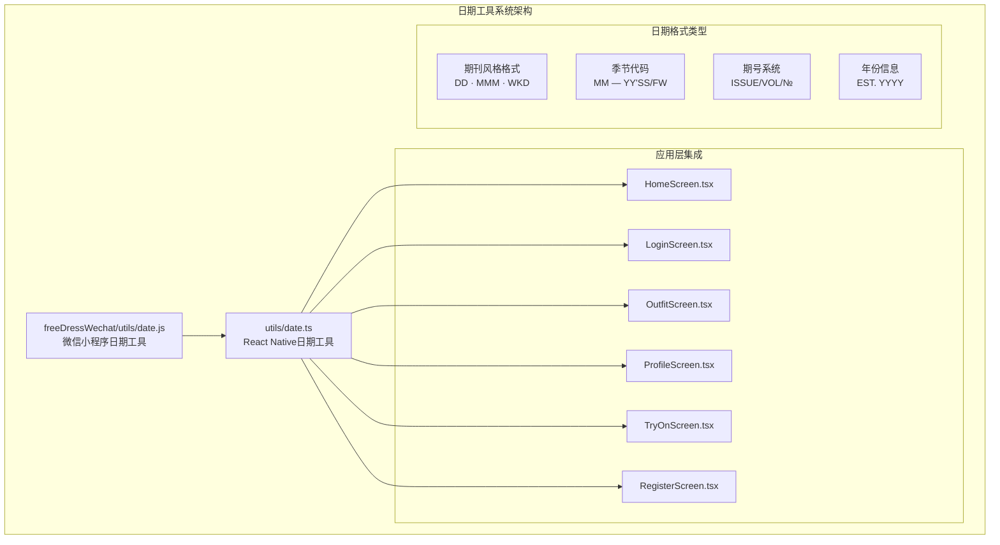
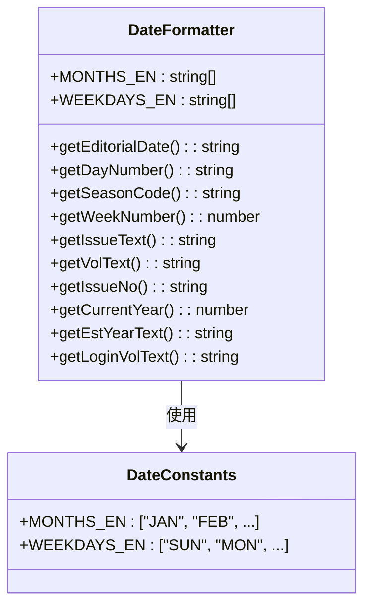
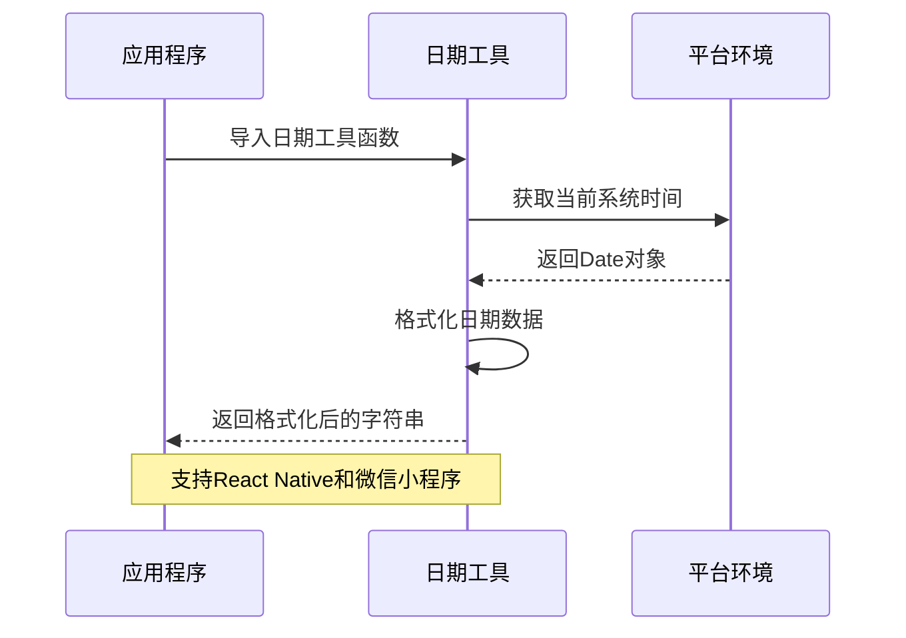
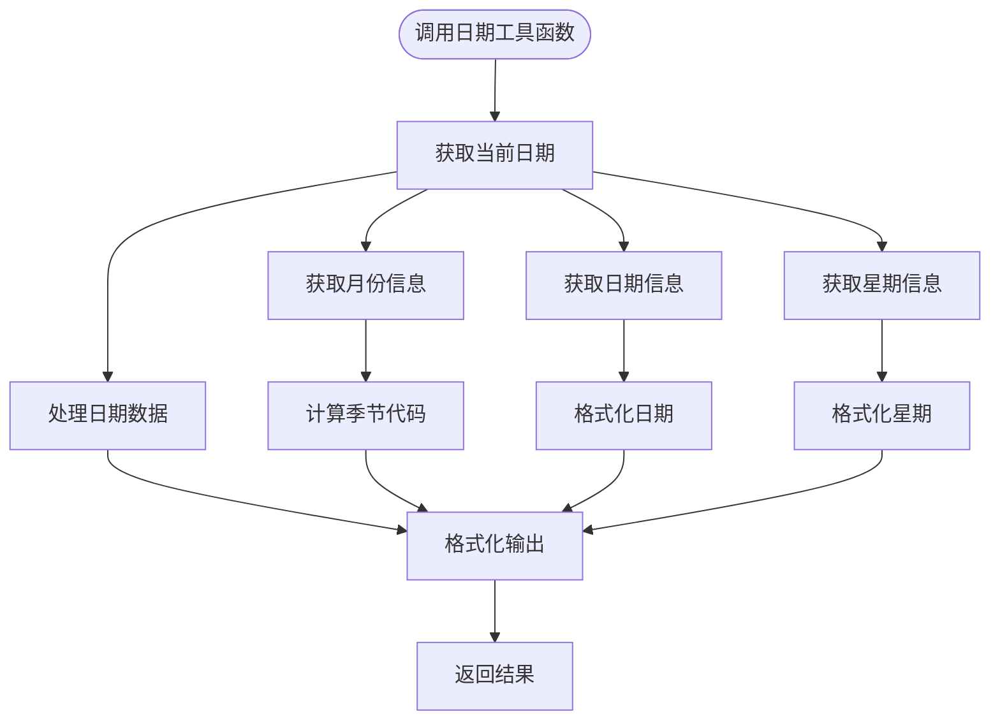
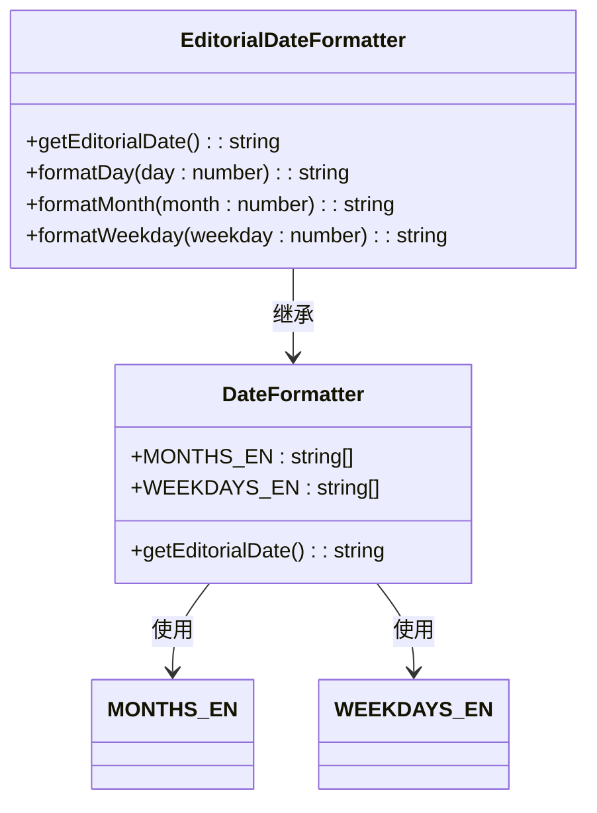
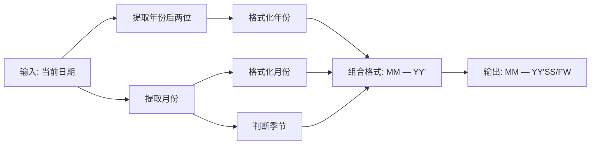
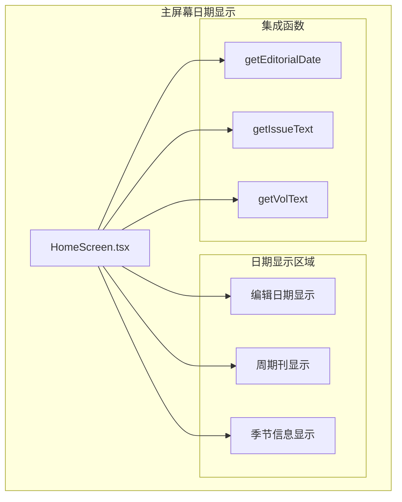
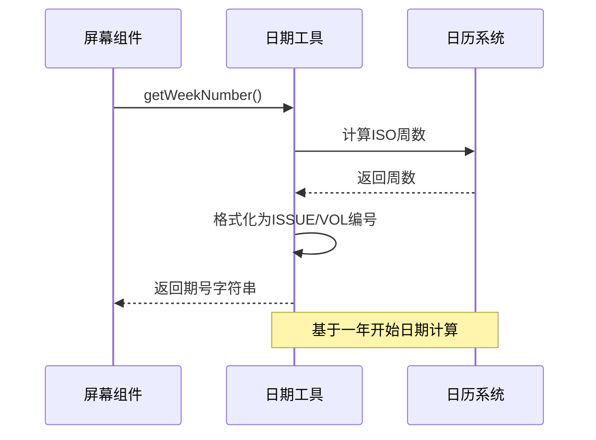
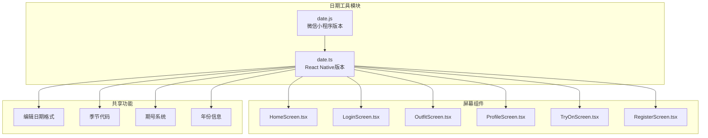

# 日期工具系统

<cite>
**本文档引用的文件**
- [date.ts](file://FreeDressApp/src/utils/date.ts)
- [date.js](file://freeDressWechat/utils/date.js)
- [HomeScreen.tsx](file://FreeDressApp/src/screens/HomeScreen.tsx)
- [LoginScreen.tsx](file://FreeDressApp/src/screens/LoginScreen.tsx)
- [OutfitScreen.tsx](file://FreeDressApp/src/screens/OutfitScreen.tsx)
- [ProfileScreen.tsx](file://FreeDressApp/src/screens/ProfileScreen.tsx)
- [TryOnScreen.tsx](file://FreeDressApp/src/screens/TryOnScreen.tsx)
- [RegisterScreen.tsx](file://FreeDressApp/src/screens/RegisterScreen.tsx)
</cite>

## 目录
1. [简介](#简介)
2. [项目结构](#项目结构)
3. [核心组件](#核心组件)
4. [架构概览](#架构概览)
5. [详细组件分析](#详细组件分析)
6. [依赖关系分析](#依赖关系分析)
7. [性能考虑](#性能考虑)
8. [故障排除指南](#故障排除指南)
9. [结论](#结论)

## 简介

日期工具系统是FreeDress项目中一个专门负责日期格式化和期刊风格显示的核心模块。该系统提供了统一的日期处理功能，确保应用程序在不同界面中能够一致地展示日期信息，特别是针对编辑类时装杂志风格的日期格式。

该系统主要服务于移动端应用（React Native）和微信小程序两个平台，通过共享的日期处理逻辑实现跨平台的一致性体验。系统设计遵循了单一职责原则，所有日期相关的格式化逻辑都集中在统一的工具函数中，便于维护和扩展。

## 项目结构

FreeDress项目的日期工具系统采用分层架构设计，主要包含以下结构：

**图表来源**
- [date.ts:1-110](file://FreeDressApp/src/utils/date.ts#L1-L110)
- [date.js:1-98](file://freeDressWechat/utils/date.js#L1-L98)

**章节来源**
- [date.ts:1-110](file://FreeDressApp/src/utils/date.ts#L1-L110)
- [date.js:1-98](file://freeDressWechat/utils/date.js#L1-L98)

## 核心组件

### 主要日期工具函数

日期工具系统提供了以下核心功能函数：

#### 1. 期刊风格日期格式化
- `getEditorialDate()`: 返回"DD · MMM · WKD"格式的日期字符串
- 示例：`26 · MAY · MON`

#### 2. 季节代码生成
- `getSeasonCode()`: 生成"MM — YY'SS/FW"格式的季节代码
- 示例：`05 — 26'SS` 或 `05 — 26'FW`

#### 3. 期号系统
- `getWeekNumber()`: 获取当前周数作为期号基础
- `getIssueText()`: 返回"ISSUE 22"格式
- `getVolText()`: 返回"VOL.22"格式  
- `getIssueNo()`: 返回"№ 22"格式

#### 4. 年份和登录页面支持
- `getCurrentYear()`: 获取当前年份
- `getEstYearText()`: 返回"EST. YYYY"格式
- `getLoginVolText()`: 登录页面使用的完整期号格式

**章节来源**
- [date.ts:15-109](file://FreeDressApp/src/utils/date.ts#L15-L109)

### 数据结构设计

系统使用常量数组来存储国际化月份和星期名称：

**图表来源**
- [date.ts:8-9](file://FreeDressApp/src/utils/date.ts#L8-L9)

**章节来源**
- [date.ts:8-9](file://FreeDressApp/src/utils/date.ts#L8-L9)

## 架构概览

### 跨平台架构设计

**图表来源**
- [date.ts:15-21](file://FreeDressApp/src/utils/date.ts#L15-L21)
- [date.js:12-18](file://freeDressWechat/utils/date.js#L12-L18)

### 集成模式

系统采用函数式编程模式，所有功能都是纯函数，不依赖外部状态：

**图表来源**
- [date.ts:35-42](file://FreeDressApp/src/utils/date.ts#L35-L42)
- [date.ts:26-29](file://FreeDressApp/src/utils/date.ts#L26-L29)

**章节来源**
- [date.ts:1-110](file://FreeDressApp/src/utils/date.ts#L1-L110)

## 详细组件分析

### 日期格式化组件

#### 期刊风格日期格式化器

**图表来源**
- [date.ts:15-21](file://FreeDressApp/src/utils/date.ts#L15-L21)
- [date.ts:8-9](file://FreeDressApp/src/utils/date.ts#L8-L9)

#### 季节代码生成器

**图表来源**
- [date.ts:35-42](file://FreeDressApp/src/utils/date.ts#L35-L42)

**章节来源**
- [date.ts:35-42](file://FreeDressApp/src/utils/date.ts#L35-L42)

### 屏幕集成组件

#### 主屏幕集成

主屏幕集成了多种日期显示功能：

**图表来源**
- [HomeScreen.tsx:109-111](file://FreeDressApp/src/screens/HomeScreen.tsx#L109-L111)

#### 登录屏幕集成

登录屏幕使用了完整的期刊格式：

**章节来源**
- [HomeScreen.tsx:109-111](file://FreeDressApp/src/screens/HomeScreen.tsx#L109-L111)
- [LoginScreen.tsx:40-42](file://FreeDressApp/src/screens/LoginScreen.tsx#L40-L42)
- [RegisterScreen.tsx:41-41](file://FreeDressApp/src/screens/RegisterScreen.tsx#L41-L41)

### 期号系统组件

#### 期号生成流程

**图表来源**
- [date.ts:48-53](file://FreeDressApp/src/utils/date.ts#L48-L53)

**章节来源**
- [date.ts:48-74](file://FreeDressApp/src/utils/date.ts#L48-L74)

## 依赖关系分析

### 模块依赖图

**图表来源**
- [date.ts:87-97](file://FreeDressApp/src/utils/date.ts#L87-L97)
- [date.js:87-97](file://freeDressWechat/utils/date.js#L87-L97)

### 使用频率统计

根据代码分析，日期工具在以下屏幕中被使用：

| 屏幕名称 | 使用函数 | 使用次数 |
|---------|---------|---------|
| HomeScreen | getEditorialDate | 1次 |
| OutfitScreen | getVolText, getIssueNo | 2次 |
| ProfileScreen | getVolText, getEstYearText | 2次 |
| TryOnScreen | getVolText, getIssueNo | 2次 |
| LoginScreen | getLoginVolText, getIssueNo | 2次 |
| RegisterScreen | getLoginVolText | 1次 |

**章节来源**
- [OutfitScreen.tsx:50-50](file://FreeDressApp/src/screens/OutfitScreen.tsx#L50-L50)
- [ProfileScreen.tsx:64-64](file://FreeDressApp/src/screens/ProfileScreen.tsx#L64-L64)
- [TryOnScreen.tsx:59-59](file://FreeDressApp/src/screens/TryOnScreen.tsx#L59-L59)

## 性能考虑

### 时间复杂度分析

所有日期工具函数的时间复杂度均为O(1)，因为它们只进行简单的日期提取和字符串格式化操作：

- **getEditorialDate()**: O(1) - 获取单个日期组件并格式化
- **getSeasonCode()**: O(1) - 基本数学运算和字符串拼接
- **getWeekNumber()**: O(1) - 固定的日期计算公式
- **其他格式化函数**: O(1) - 简单的字符串操作

### 内存使用优化

系统采用了以下内存优化策略：

1. **常量复用**: 月份和星期名称数组在模块级别定义，避免重复创建
2. **字符串缓存**: 使用`padStart()`方法进行零填充，减少字符串操作开销
3. **无状态设计**: 所有函数都是纯函数，不维护内部状态

### 跨平台兼容性

系统通过以下方式确保跨平台兼容性：

- **统一API**: React Native和微信小程序版本提供相同的函数签名
- **平台无关**: 使用标准JavaScript Date对象，不依赖特定平台特性
- **类型安全**: TypeScript版本提供完整的类型定义

## 故障排除指南

### 常见问题及解决方案

#### 1. 日期格式错误

**问题**: 日期格式不符合预期
**原因**: 本地化设置或时区配置问题
**解决方案**: 
- 检查系统时区设置
- 确认`MONTHS_EN`和`WEEKDAYS_EN`数组内容
- 验证`padStart()`方法的参数

#### 2. 季节代码计算错误

**问题**: 季节代码显示不正确
**原因**: 月份计算逻辑错误
**解决方案**:
- 检查`getSeasonCode()`函数中的月份判断逻辑
- 确认季节划分规则（3-8月为SS，9-2月为FW）

#### 3. 期号计算偏差

**问题**: 期号与预期不符
**原因**: ISO周数计算差异
**解决方案**:
- 验证`getWeekNumber()`函数的起始日期计算
- 检查闰年对周数计算的影响

#### 4. 跨平台同步问题

**问题**: React Native和微信小程序显示不同的日期
**原因**: 不同平台的Date对象行为差异
**解决方案**:
- 统一使用UTC时间进行计算
- 在跨平台版本中保持函数签名一致

**章节来源**
- [date.ts:35-53](file://FreeDressApp/src/utils/date.ts#L35-L53)
- [date.js:33-49](file://freeDressWechat/utils/date.js#L33-L49)

## 结论

FreeDress项目的日期工具系统是一个设计精良、功能完善的日期处理模块。系统通过统一的API设计实现了跨平台兼容性，通过清晰的功能分离确保了代码的可维护性。

### 主要优势

1. **跨平台一致性**: React Native和微信小程序版本保持完全一致的API
2. **功能完整性**: 提供了完整的期刊风格日期格式化功能
3. **易于使用**: 简洁的函数接口，便于在各种屏幕中集成
4. **性能高效**: 所有操作都是O(1)时间复杂度，无状态设计

### 技术亮点

- **纯函数设计**: 所有函数都是无副作用的纯函数
- **常量优化**: 关键的月份和星期名称以常量形式存储
- **格式化统一**: 采用标准化的期刊风格格式
- **国际化支持**: 通过英文缩写支持多语言环境

该系统为FreeDress项目提供了可靠的日期处理能力，确保了应用程序在不同界面中能够一致地展示日期信息，提升了用户体验的连贯性和专业性。