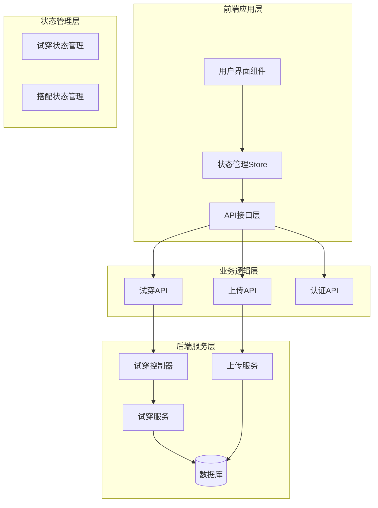
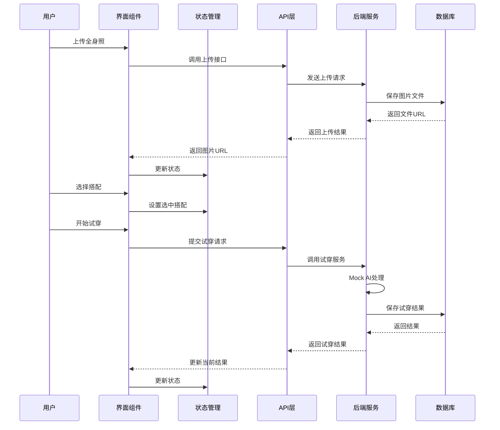
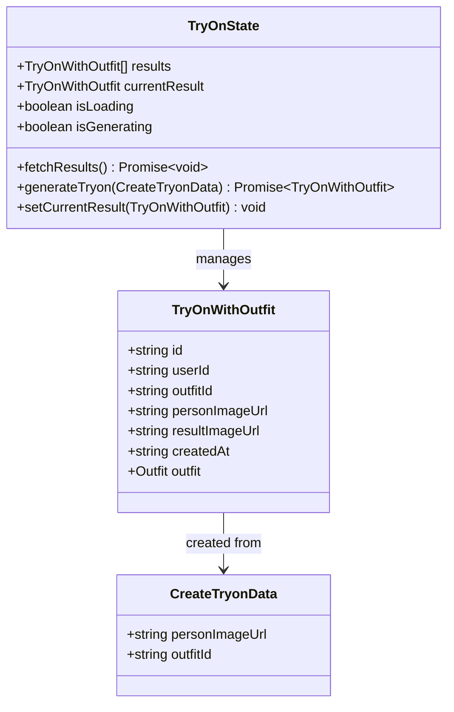
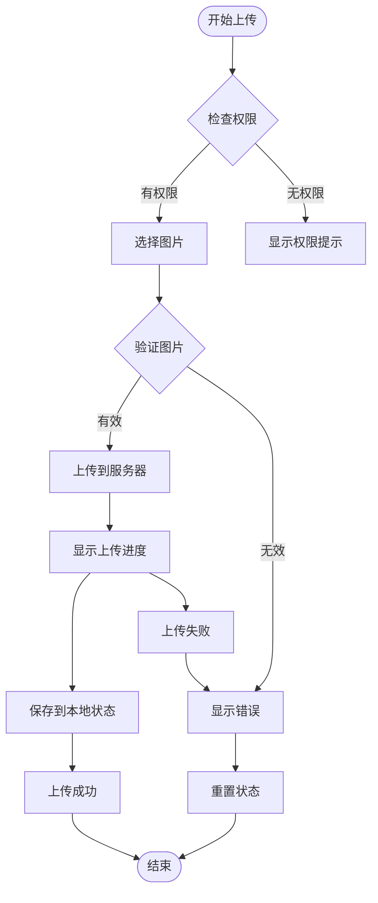
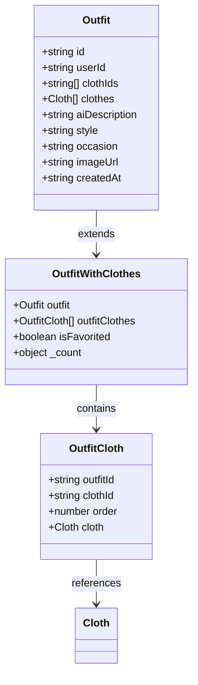
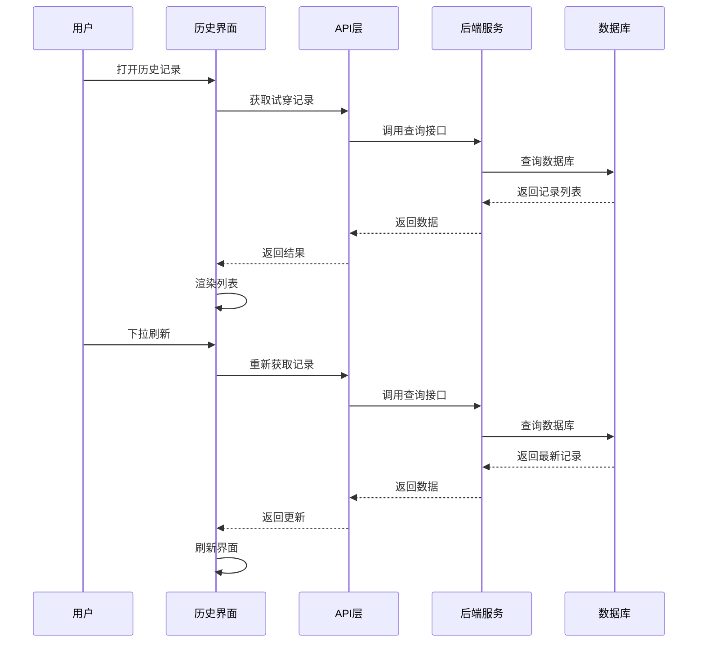
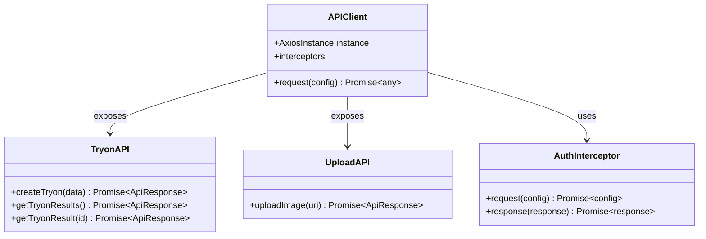
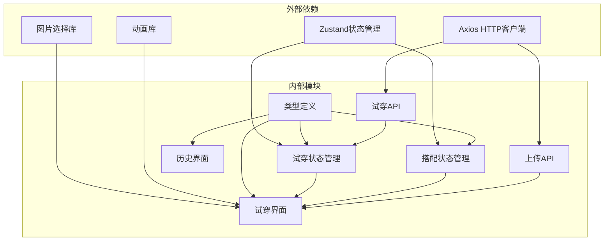

# AI试穿状态管理

<cite>
**本文档引用的文件**
- [tryOnStore.ts](file://FreeDressApp/src/store/tryOnStore.ts)
- [TryOnScreen.tsx](file://FreeDressApp/src/screens/TryOnScreen.tsx)
- [TryOnHistoryScreen.tsx](file://FreeDressApp/src/screens/TryOnHistoryScreen.tsx)
- [tryon.ts](file://FreeDressApp/src/api/tryon.ts)
- [upload.ts](file://FreeDressApp/src/api/upload.ts)
- [axios.ts](file://FreeDressApp/src/api/axios.ts)
- [index.ts](file://FreeDressApp/src/types/index.ts)
- [outfitStore.ts](file://FreeDressApp/src/store/outfitStore.ts)
- [MainTabNavigator.tsx](file://FreeDressApp/src/navigation/MainTabNavigator.tsx)
- [tryon.controller.ts](file://backend/src/modules/tryon/tryon.controller.ts)
- [tryon.service.ts](file://backend/src/modules/tryon/tryon.service.ts)
- [upload.service.ts](file://backend/src/modules/upload/upload.service.ts)
- [schema.prisma](file://backend/prisma/schema.prisma)
- [index.ts](file://FreeDressApp/src/constants/index.ts)
</cite>

## 目录
1. [简介](#简介)
2. [项目结构](#项目结构)
3. [核心组件](#核心组件)
4. [架构概览](#架构概览)
5. [详细组件分析](#详细组件分析)
6. [依赖关系分析](#依赖关系分析)
7. [性能考虑](#性能考虑)
8. [故障排除指南](#故障排除指南)
9. [结论](#结论)

## 简介

畅搭(FreeDress)应用的AI试穿状态管理模块是一个完整的虚拟试穿解决方案，实现了从图片上传、搭配选择到结果生成和历史记录管理的全流程。该模块基于Zustand状态管理库构建，采用React Native开发，集成了Mock AI服务来模拟试穿效果生成过程。

本模块的核心目标是为用户提供流畅的AI虚拟试穿体验，通过直观的三步操作流程：上传全身照、选择搭配、生成效果，让用户能够快速体验虚拟换装的乐趣。系统还提供了完善的历史记录管理功能，支持用户查看和回顾之前的试穿结果。

## 项目结构

AI试穿状态管理模块遵循清晰的分层架构设计，主要由以下几部分组成：

**图表来源**
- [tryOnStore.ts:1-59](file://FreeDressApp/src/store/tryOnStore.ts#L1-L59)
- [outfitStore.ts:1-90](file://FreeDressApp/src/store/outfitStore.ts#L1-L90)
- [tryon.ts:1-28](file://FreeDressApp/src/api/tryon.ts#L1-L28)
- [upload.ts:1-21](file://FreeDressApp/src/api/upload.ts#L1-L21)

**章节来源**
- [tryOnStore.ts:1-59](file://FreeDressApp/src/store/tryOnStore.ts#L1-L59)
- [outfitStore.ts:1-90](file://FreeDressApp/src/store/outfitStore.ts#L1-L90)
- [TryOnScreen.tsx:1-522](file://FreeDressApp/src/screens/TryOnScreen.tsx#L1-L522)

## 核心组件

AI试穿状态管理模块的核心组件包括状态管理Store、API接口层、用户界面组件和后端服务层。每个组件都有明确的职责分工和清晰的接口定义。

### 状态管理架构

系统采用Zustand轻量级状态管理库，实现了集中式的状态管理。主要状态包括试穿结果列表、当前选中的结果、加载状态等。

### API接口设计

API层提供了标准化的数据访问接口，包括试穿结果的创建、查询和删除操作，以及图片上传功能。所有API调用都经过统一的认证和错误处理机制。

### 用户界面组件

用户界面采用响应式设计，支持移动端和平板设备。界面组件包括上传区域、搭配选择列表、结果展示区域和历史记录管理等。

**章节来源**
- [tryOnStore.ts:13-22](file://FreeDressApp/src/store/tryOnStore.ts#L13-L22)
- [tryon.ts:12-15](file://FreeDressApp/src/api/tryon.ts#L12-L15)
- [upload.ts:4-19](file://FreeDressApp/src/api/upload.ts#L4-L19)

## 架构概览

AI试穿系统的整体架构采用了前后端分离的设计模式，前端使用React Native开发，后端使用NestJS框架构建RESTful API。

**图表来源**
- [TryOnScreen.tsx:60-97](file://FreeDressApp/src/screens/TryOnScreen.tsx#L60-L97)
- [tryOnStore.ts:42-55](file://FreeDressApp/src/store/tryOnStore.ts#L42-L55)
- [tryon.service.ts:9-33](file://backend/src/modules/tryon/tryon.service.ts#L9-L33)

**章节来源**
- [TryOnScreen.tsx:43-97](file://FreeDressApp/src/screens/TryOnScreen.tsx#L43-L97)
- [tryOnStore.ts:24-58](file://FreeDressApp/src/store/tryOnStore.ts#L24-L58)

## 详细组件分析

### 试穿状态管理器

试穿状态管理器是整个AI试穿模块的核心，负责管理试穿相关的所有状态和业务逻辑。

**图表来源**
- [tryOnStore.ts:5-11](file://FreeDressApp/src/store/tryOnStore.ts#L5-L11)
- [tryOnStore.ts:13-22](file://FreeDressApp/src/store/tryOnStore.ts#L13-L22)
- [tryon.ts:12-15](file://FreeDressApp/src/api/tryon.ts#L12-L15)

#### 状态管理流程

试穿状态管理器实现了完整的CRUD操作，包括试穿结果的获取、创建、更新和删除。状态管理器还提供了加载状态的管理，确保用户界面能够正确反映后台操作的状态。

#### Mock AI集成

系统集成了Mock AI服务来模拟试穿效果的生成过程。虽然当前使用的是占位符实现，但代码结构已经为后续集成真实的AI服务做好了准备。

**章节来源**
- [tryOnStore.ts:24-58](file://FreeDressApp/src/store/tryOnStore.ts#L24-L58)
- [tryon.service.ts:77-87](file://backend/src/modules/tryon/tryon.service.ts#L77-L87)

### 上传界面组件

上传界面组件提供了直观的图片上传功能，支持从相册选择和相机拍摄两种方式。

**图表来源**
- [TryOnScreen.tsx:60-83](file://FreeDressApp/src/screens/TryOnScreen.tsx#L60-L83)
- [upload.ts:4-19](file://FreeDressApp/src/api/upload.ts#L4-L19)

#### 图片处理优化

上传界面实现了多种图片处理优化策略，包括图片质量控制、格式验证和大小限制。这些优化确保了上传过程的稳定性和用户体验。

#### 用户体验优化

界面提供了丰富的用户反馈机制，包括上传进度指示、错误提示和成功确认。动画效果增强了用户的交互体验。

**章节来源**
- [TryOnScreen.tsx:60-97](file://FreeDressApp/src/screens/TryOnScreen.tsx#L60-L97)
- [upload.ts:4-19](file://FreeDressApp/src/api/upload.ts#L4-L19)

### 搭配选择组件

搭配选择组件允许用户从已有的搭配中选择合适的服装组合进行试穿。

**图表来源**
- [outfitStore.ts:12-16](file://FreeDressApp/src/store/outfitStore.ts#L12-L16)
- [outfitStore.ts:32-30](file://FreeDressApp/src/store/outfitStore.ts#L32-L30)

#### 搭配展示逻辑

搭配选择界面实现了智能的搭配展示逻辑，包括第一件衣物的预览显示、搭配数量统计和风格标签展示。用户可以通过水平滚动浏览可用的搭配。

#### 交互设计

界面采用了卡片式设计，选中的搭配会显示特殊的边框样式。用户可以轻松地在多个搭配之间切换。

**章节来源**
- [TryOnScreen.tsx:204-255](file://FreeDressApp/src/screens/TryOnScreen.tsx#L204-L255)
- [outfitStore.ts:32-48](file://FreeDressApp/src/store/outfitStore.ts#L32-L48)

### 结果展示组件

结果展示组件负责显示AI试穿生成的最终效果，并提供历史记录管理功能。

**图表来源**
- [TryOnHistoryScreen.tsx:41-60](file://FreeDressApp/src/screens/TryOnHistoryScreen.tsx#L41-L60)
- [tryon.ts:21-27](file://FreeDressApp/src/api/tryon.ts#L21-L27)

#### 历史记录管理

历史记录界面提供了完整的CRUD操作，用户可以查看所有的试穿记录，包括生成时间、搭配信息和试穿效果。支持下拉刷新功能，确保用户能够获取最新的记录。

#### 性能优化

界面采用了FlatList组件来优化大量数据的渲染性能，同时实现了空状态的友好提示。

**章节来源**
- [TryOnHistoryScreen.tsx:35-123](file://FreeDressApp/src/screens/TryOnHistoryScreen.tsx#L35-L123)

### API集成架构

API层提供了统一的接口访问机制，封装了所有网络请求的细节。

**图表来源**
- [axios.ts:12-18](file://FreeDressApp/src/api/axios.ts#L12-L18)
- [tryon.ts:17-27](file://FreeDressApp/src/api/tryon.ts#L17-L27)
- [upload.ts:4-19](file://FreeDressApp/src/api/upload.ts#L4-L19)

#### 认证机制

API客户端实现了完整的认证机制，包括访问令牌的自动添加、刷新令牌的处理和错误状态的统一处理。

#### 错误处理

系统实现了多层次的错误处理机制，包括网络错误、服务器错误和业务逻辑错误的分类处理。

**章节来源**
- [axios.ts:24-105](file://FreeDressApp/src/api/axios.ts#L24-L105)
- [tryon.ts:17-27](file://FreeDressApp/src/api/tryon.ts#L17-L27)

## 依赖关系分析

AI试穿状态管理模块的依赖关系清晰明确，各组件之间的耦合度较低，便于维护和扩展。

**图表来源**
- [tryOnStore.ts:1](file://FreeDressApp/src/store/tryOnStore.ts#L1)
- [TryOnScreen.tsx:18](file://FreeDressApp/src/screens/TryOnScreen.tsx#L18)
- [axios.ts:5](file://FreeDressApp/src/api/axios.ts#L5)

### 组件耦合度分析

系统采用了松耦合的设计原则，各个组件之间的依赖关系通过接口和回调函数实现，减少了直接的依赖关系。

### 扩展性考虑

模块设计充分考虑了未来的扩展需求，包括Mock AI服务的替换、新的UI组件的添加和API接口的扩展。

**章节来源**
- [index.ts:1-98](file://FreeDressApp/src/types/index.ts#L1-L98)
- [MainTabNavigator.tsx:10-35](file://FreeDressApp/src/navigation/MainTabNavigator.tsx#L10-L35)

## 性能考虑

AI试穿状态管理模块在设计时充分考虑了性能优化，采用了多种策略来提升用户体验。

### 网络请求优化

系统实现了请求缓存机制，避免重复的网络请求。同时，使用了合理的超时设置和重试机制，确保在网络不稳定的情况下也能提供良好的用户体验。

### 内存管理

状态管理器采用了高效的数据结构来存储试穿结果，避免了不必要的内存占用。同时，实现了垃圾回收机制，及时释放不再使用的资源。

### 图片处理优化

上传组件实现了图片压缩和格式转换功能，减少了网络传输的数据量。同时，提供了图片预览功能，让用户能够在上传前检查图片质量。

### 用户体验优化

系统提供了丰富的加载状态指示，包括进度条、骨架屏和占位符，确保用户能够清楚地了解当前的操作状态。

## 故障排除指南

AI试穿状态管理模块实现了完善的错误处理机制，能够有效应对各种异常情况。

### 常见问题及解决方案

**图片上传失败**
- 检查网络连接状态
- 验证图片格式和大小限制
- 确认服务器存储空间充足

**试穿结果获取失败**
- 检查用户认证状态
- 验证API接口的可用性
- 查看服务器日志获取详细错误信息

**状态同步问题**
- 确认状态管理器的正确初始化
- 检查异步操作的执行顺序
- 验证数据序列化的正确性

### 调试工具和技巧

系统提供了详细的日志记录功能，开发者可以通过日志快速定位问题。同时，使用了React DevTools和Redux DevTools来监控状态变化。

**章节来源**
- [axios.ts:49-104](file://FreeDressApp/src/api/axios.ts#L49-L104)
- [TryOnScreen.tsx:76-96](file://FreeDressApp/src/screens/TryOnScreen.tsx#L76-L96)

## 结论

畅搭(FreeDress)应用的AI试穿状态管理模块是一个设计精良、实现完整的虚拟试穿解决方案。模块采用了现代化的技术栈和最佳实践，为用户提供了流畅的AI试穿体验。

### 主要优势

1. **清晰的架构设计**：模块结构清晰，职责分离明确，便于维护和扩展
2. **优秀的用户体验**：界面设计直观，操作流程简洁，反馈机制完善
3. **强大的状态管理**：采用Zustand实现高效的全局状态管理
4. **完善的错误处理**：实现了多层次的错误处理和恢复机制
5. **良好的性能表现**：采用了多种性能优化策略，确保流畅的用户体验

### 技术亮点

1. **Mock AI集成**：为后续集成真实AI服务做好了充分准备
2. **响应式设计**：支持多种设备和屏幕尺寸
3. **动画效果**：使用Reanimated库提供了丰富的动画效果
4. **类型安全**：完整的TypeScript类型定义确保代码质量
5. **测试友好**：模块化设计便于单元测试和集成测试

### 未来发展方向

1. **真实AI服务集成**：替换Mock AI服务为真实的AI试穿算法
2. **离线功能增强**：实现更多的离线缓存策略
3. **性能进一步优化**：继续优化图片处理和网络请求性能
4. **功能扩展**：添加更多的试穿效果和个性化选项
5. **跨平台支持**：扩展到Web和其他移动平台

该模块为畅搭应用的AI试穿功能奠定了坚实的基础，为用户提供了创新的虚拟购物体验。