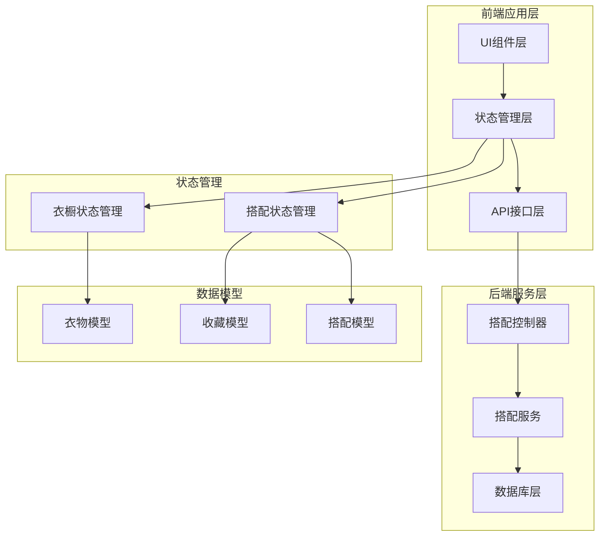
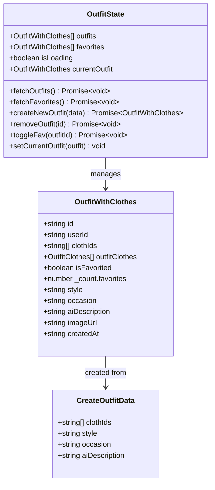
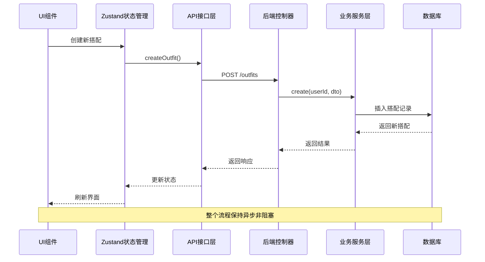
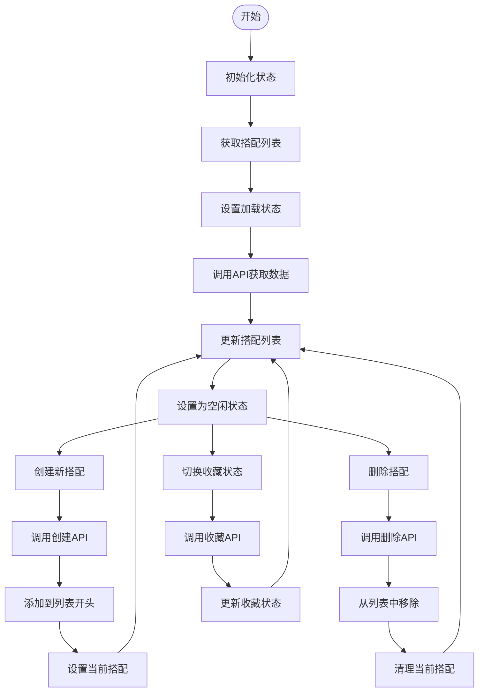
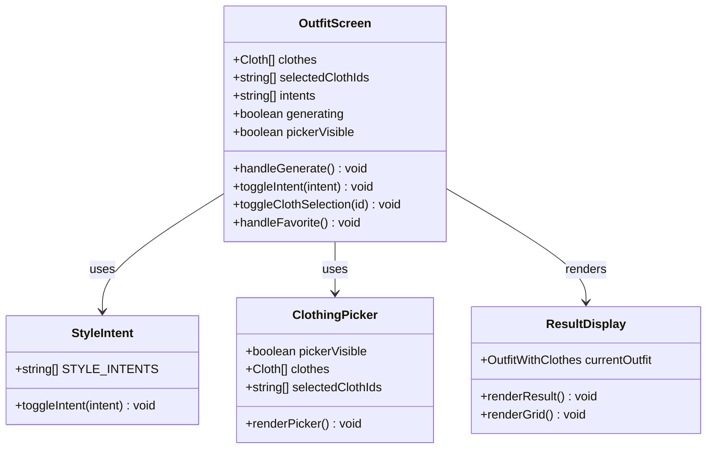
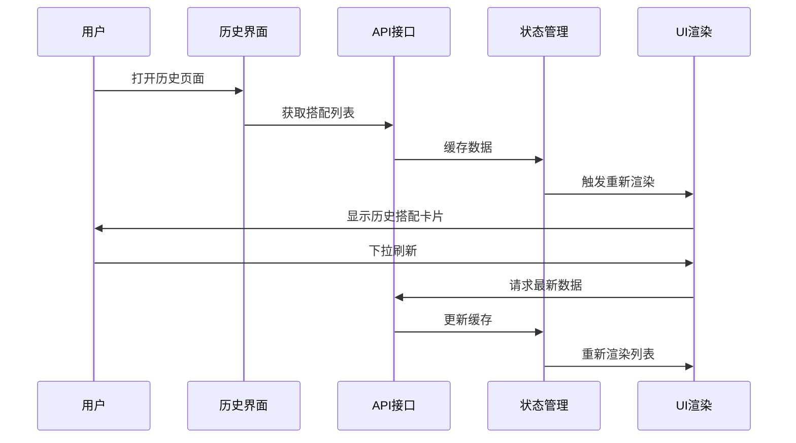
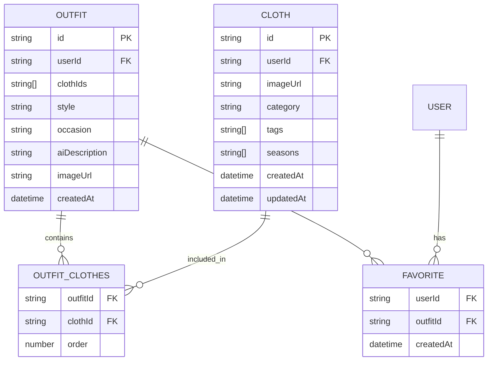
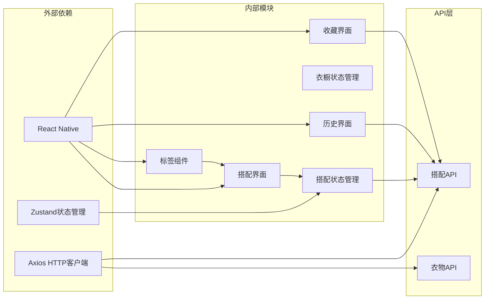
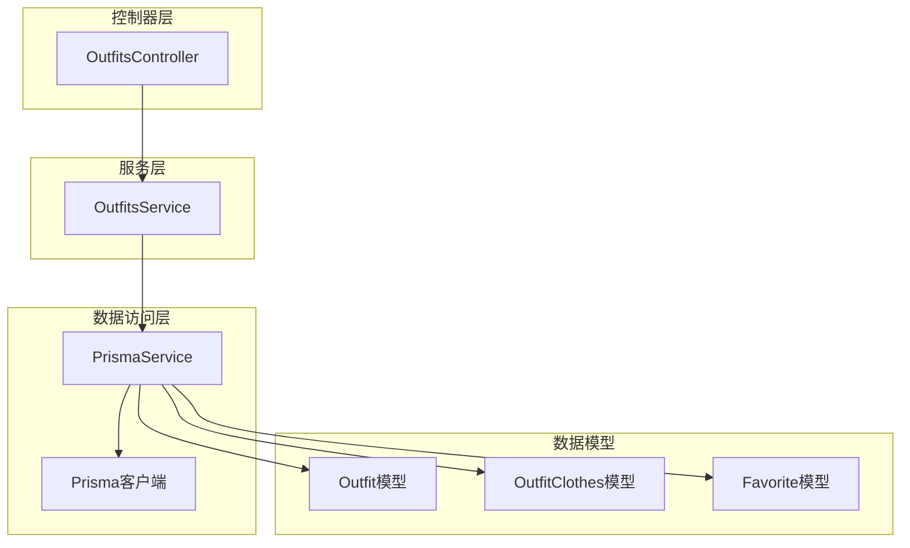

# 搭配状态管理

<cite>
**本文档引用的文件**
- [outfitStore.ts](file://FreeDressApp/src/store/outfitStore.ts)
- [outfits.ts](file://FreeDressApp/src/api/outfits.ts)
- [OutfitScreen.tsx](file://FreeDressApp/src/screens/OutfitScreen.tsx)
- [OutfitHistoryScreen.tsx](file://FreeDressApp/src/screens/OutfitHistoryScreen.tsx)
- [FavoritesScreen.tsx](file://FreeDressApp/src/screens/FavoritesScreen.tsx)
- [index.ts](file://FreeDressApp/src/types/index.ts)
- [wardrobeStore.ts](file://FreeDressApp/src/store/wardrobeStore.ts)
- [Tag.tsx](file://FreeDressApp/src/components/Tag.tsx)
- [MainTabNavigator.tsx](file://FreeDressApp/src/navigation/MainTabNavigator.tsx)
- [outfits.service.ts](file://backend/src/modules/outfits/outfits.service.ts)
- [outfits.controller.ts](file://backend/src/modules/outfits/outfits.controller.ts)
</cite>

## 目录
1. [简介](#简介)
2. [项目结构](#项目结构)
3. [核心组件](#核心组件)
4. [架构概览](#架构概览)
5. [详细组件分析](#详细组件分析)
6. [依赖关系分析](#依赖关系分析)
7. [性能考虑](#性能考虑)
8. [故障排除指南](#故障排除指南)
9. [结论](#结论)

## 简介

畅搭(FreeDress)应用的搭配状态管理模块是整个应用的核心功能之一，负责管理用户的服装搭配体验。该模块实现了完整的搭配生命周期管理，包括搭配创建、编辑、删除、收藏等功能，并提供了丰富的UI集成能力。

本模块采用现代React Native开发模式，结合Zustand状态管理库和NestJS后端服务，构建了一个高性能、可扩展的搭配管理系统。系统支持多种风格标签、AI生成的搭配建议、用户收藏功能以及完整的搭配历史记录管理。

## 项目结构

搭配状态管理模块在项目中的组织结构如下：

**图表来源**
- [outfitStore.ts:1-90](file://FreeDressApp/src/store/outfitStore.ts#L1-L90)
- [wardrobeStore.ts:1-83](file://FreeDressApp/src/store/wardrobeStore.ts#L1-L83)
- [outfits.ts:1-40](file://FreeDressApp/src/api/outfits.ts#L1-L40)

**章节来源**
- [outfitStore.ts:1-90](file://FreeDressApp/src/store/outfitStore.ts#L1-L90)
- [index.ts:1-98](file://FreeDressApp/src/types/index.ts#L1-L98)

## 核心组件

### 状态管理架构

搭配状态管理模块基于Zustand库构建，采用了函数式状态管理模式，提供了简洁高效的API来管理复杂的搭配状态。

**图表来源**
- [outfitStore.ts:12-30](file://FreeDressApp/src/store/outfitStore.ts#L12-L30)
- [outfits.ts:4-15](file://FreeDressApp/src/api/outfits.ts#L4-L15)

### 数据模型设计

系统采用清晰的数据模型设计，确保了数据的一致性和完整性：

**搭配模型 (Outfit)**
- 基础属性：ID、用户ID、创建时间
- 关联属性：衣物ID数组、AI描述、风格标签、场合标签
- 扩展属性：图片URL、衣物详情、收藏状态

**搭配衣物关联模型 (OutfitClothes)**
- 维护衣物在搭配中的顺序
- 提供衣物详细信息
- 支持排序和过滤操作

**收藏模型 (Favorite)**
- 建立用户与搭配的多对多关系
- 支持快速检索用户收藏
- 维护收藏时间戳

**章节来源**
- [index.ts:35-46](file://FreeDressApp/src/types/index.ts#L35-L46)
- [index.ts:21-33](file://FreeDressApp/src/types/index.ts#L21-L33)

## 架构概览

搭配状态管理模块采用分层架构设计，确保了各层之间的职责分离和松耦合：

**图表来源**
- [OutfitScreen.tsx:67-84](file://FreeDressApp/src/screens/OutfitScreen.tsx#L67-L84)
- [outfitStore.ts:59-64](file://FreeDressApp/src/store/outfitStore.ts#L59-L64)
- [outfits.ts:17-19](file://FreeDressApp/src/api/outfits.ts#L17-L19)

### 状态同步策略

系统实现了多种状态同步机制，确保UI与数据的实时一致性：

1. **本地状态缓存**：使用Zustand在内存中缓存搭配数据
2. **实时状态更新**：通过API响应直接更新本地状态
3. **双向状态绑定**：收藏状态在UI和服务器之间保持同步
4. **错误状态处理**：统一的错误处理和状态回滚机制

**章节来源**
- [outfitStore.ts:74-86](file://FreeDressApp/src/store/outfitStore.ts#L74-L86)
- [outfits.ts:33-35](file://FreeDressApp/src/api/outfits.ts#L33-L35)

## 详细组件分析

### 搭配状态管理器 (OutfitStore)

OutfitStore是搭配状态管理的核心组件，负责协调所有搭配相关的状态操作：

**图表来源**
- [outfitStore.ts:32-89](file://FreeDressApp/src/store/outfitStore.ts#L32-L89)

#### 核心功能实现

**搭配创建流程**
- 验证用户选择的衣物数量
- 调用API创建新的搭配记录
- 将新搭配添加到列表顶部
- 设置为当前显示的搭配

**收藏管理机制**
- 支持收藏和取消收藏操作
- 实时更新UI反馈
- 维护收藏状态的准确性

**状态一致性保证**
- 所有状态更新都在单个事务中完成
- 错误发生时自动回滚
- 并发操作的互斥保护

**章节来源**
- [outfitStore.ts:59-86](file://FreeDressApp/src/store/outfitStore.ts#L59-L86)

### UI集成组件

#### 搭配实验室界面 (OutfitScreen)

OutfitScreen提供了完整的搭配创作体验，集成了多种交互元素：

**图表来源**
- [OutfitScreen.tsx:37-361](file://FreeDressApp/src/screens/OutfitScreen.tsx#L37-L361)

##### 风格标签系统

系统提供了丰富的风格标签选项，支持用户自定义搭配风格：

| 风格标签 | 描述 | 使用场景 |
|---------|------|----------|
| 极简 | 简洁优雅的搭配风格 | 商务会议、正式场合 |
| 商务 | 正式专业的着装风格 | 办公室、面试 |
| 街头 | 休闲潮流的搭配风格 | 日常出行、朋友聚会 |
| 复古 | 怀旧经典的搭配风格 | 周末休闲、主题派对 |
| 度假 | 轻松惬意的搭配风格 | 旅行、海边度假 |
| 甜美 | 温柔可爱的搭配风格 | 女性日常、约会 |
| 中性 | 中性的搭配风格 | 男女通用、简约风格 |
| 运动 | 活力动感的搭配风格 | 健身、户外活动 |
| 优雅 | 优雅精致的搭配风格 | 晚宴、重要社交场合 |

**章节来源**
- [OutfitScreen.tsx:33-57](file://FreeDressApp/src/screens/OutfitScreen.tsx#L33-L57)

#### 搭配历史界面 (OutfitHistoryScreen)

OutfitHistoryScreen提供了搭配历史的完整展示功能：

**图表来源**
- [OutfitHistoryScreen.tsx:32-57](file://FreeDressApp/src/screens/OutfitHistoryScreen.tsx#L32-L57)

#### 收藏夹界面 (FavoritesScreen)

FavoritesScreen专门用于展示用户的收藏搭配：

**收藏管理特性**
- 实时显示收藏数量
- 支持一键取消收藏
- 按收藏时间倒序排列
- 图片缩略图快速预览

**章节来源**
- [FavoritesScreen.tsx:34-108](file://FreeDressApp/src/screens/FavoritesScreen.tsx#L34-L108)

### 数据流管理

#### 搭配数据结构

系统采用扁平化和规范化相结合的数据结构设计：

**图表来源**
- [index.ts:35-46](file://FreeDressApp/src/types/index.ts#L35-L46)
- [index.ts:21-33](file://FreeDressApp/src/types/index.ts#L21-L33)

#### 状态同步机制

系统实现了多层次的状态同步策略：

1. **即时同步**：收藏状态变更立即反映在UI上
2. **批量更新**：多个状态变更合并为一次更新
3. **错误恢复**：网络异常时的状态回滚
4. **缓存策略**：智能缓存减少重复请求

**章节来源**
- [outfitStore.ts:74-86](file://FreeDressApp/src/store/outfitStore.ts#L74-L86)

## 依赖关系分析

### 前端依赖关系

**图表来源**
- [outfitStore.ts:1-10](file://FreeDressApp/src/store/outfitStore.ts#L1-L10)
- [OutfitScreen.tsx:27-31](file://FreeDressApp/src/screens/OutfitScreen.tsx#L27-L31)

### 后端依赖关系

后端服务层采用了标准的NestJS架构模式：

**图表来源**
- [outfits.controller.ts:14-64](file://backend/src/modules/outfits/outfits.controller.ts#L14-L64)
- [outfits.service.ts:6-33](file://backend/src/modules/outfits/outfits.service.ts#L6-33)

**章节来源**
- [outfits.controller.ts:1-65](file://backend/src/modules/outfits/outfits.controller.ts#L1-L65)
- [outfits.service.ts:1-123](file://backend/src/modules/outfits/outfits.service.ts#L1-L123)

## 性能考虑

### 状态管理优化

系统在状态管理方面采用了多项优化策略：

**内存优化**
- 使用扁平化数据结构减少嵌套层级
- 智能缓存策略避免重复数据存储
- 及时清理不再使用的状态数据

**网络优化**
- 批量API请求减少网络往返
- 智能缓存失效机制
- 离线状态降级处理

**渲染优化**
- 组件级别的状态隔离
- 条件渲染减少不必要的重绘
- 虚拟化列表提升大数据集性能

### 数据一致性保证

系统实现了多层数据一致性保障机制：

**原子性操作**
- 所有状态更新都是原子性的
- 失败时自动回滚到之前状态
- 并发操作的互斥保护

**数据完整性**
- 前端数据验证
- 后端数据校验
- 数据库约束检查

**章节来源**
- [outfitStore.ts:38-48](file://FreeDressApp/src/store/outfitStore.ts#L38-L48)
- [outfits.service.ts:75-79](file://backend/src/modules/outfits/outfits.service.ts#L75-L79)

## 故障排除指南

### 常见问题及解决方案

**搭配创建失败**
- 检查网络连接状态
- 验证用户登录状态
- 确认选择的衣物有效性

**收藏状态不同步**
- 检查收藏API调用是否成功
- 验证用户权限
- 查看网络请求响应

**历史记录不显示**
- 确认数据缓存是否正常
- 检查API响应格式
- 验证数据转换逻辑

### 调试技巧

**状态监控**
- 使用浏览器开发者工具监控状态变化
- 检查API响应时间和错误码
- 监控网络请求的完整生命周期

**性能分析**
- 分析组件渲染性能
- 监控内存使用情况
- 识别潜在的内存泄漏

**章节来源**
- [outfitStore.ts:43-45](file://FreeDressApp/src/store/outfitStore.ts#L43-L45)
- [OutfitHistoryScreen.tsx:42-44](file://FreeDressApp/src/screens/OutfitHistoryScreen.tsx#L42-L44)

## 结论

畅搭(FreeDress)应用的搭配状态管理模块展现了现代移动应用开发的最佳实践。通过精心设计的状态管理架构、清晰的数据模型和完善的UI集成，系统为用户提供了流畅、直观的搭配创作体验。

模块的主要优势包括：

1. **架构清晰**：分层设计确保了代码的可维护性和可扩展性
2. **性能优秀**：优化的状态管理和缓存策略提升了用户体验
3. **功能完整**：覆盖了搭配生命周期的所有关键环节
4. **用户体验良好**：直观的界面设计和及时的反馈机制

未来可以进一步优化的方向包括：
- 添加离线数据同步功能
- 实现更智能的搭配推荐算法
- 增强数据备份和恢复机制
- 优化大列表的渲染性能