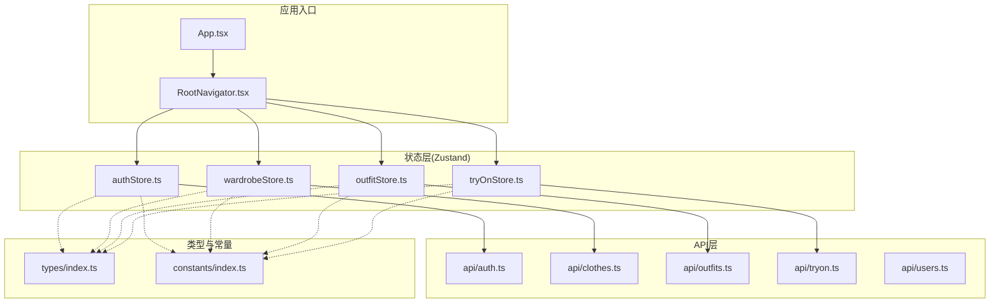
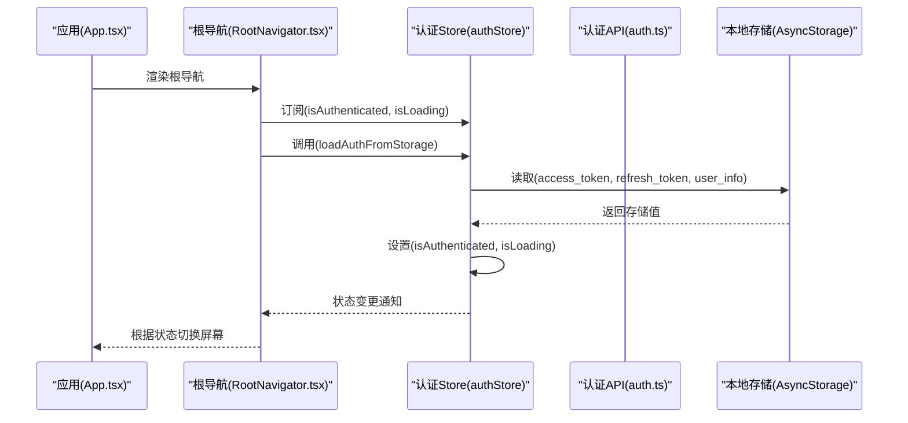
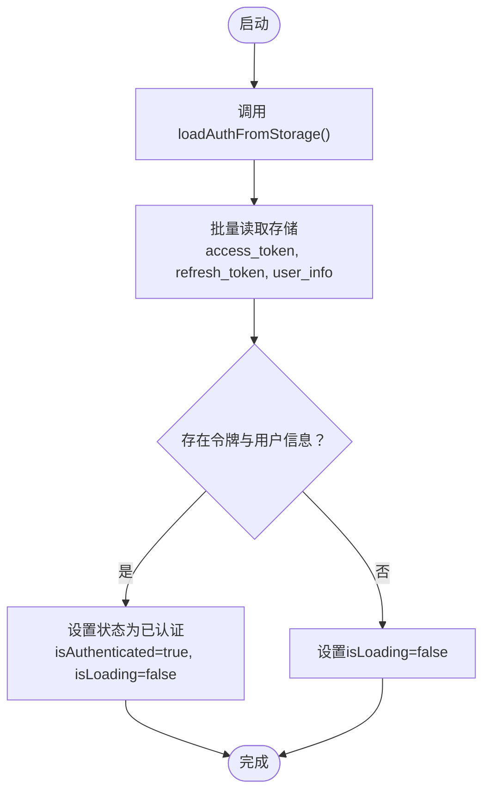
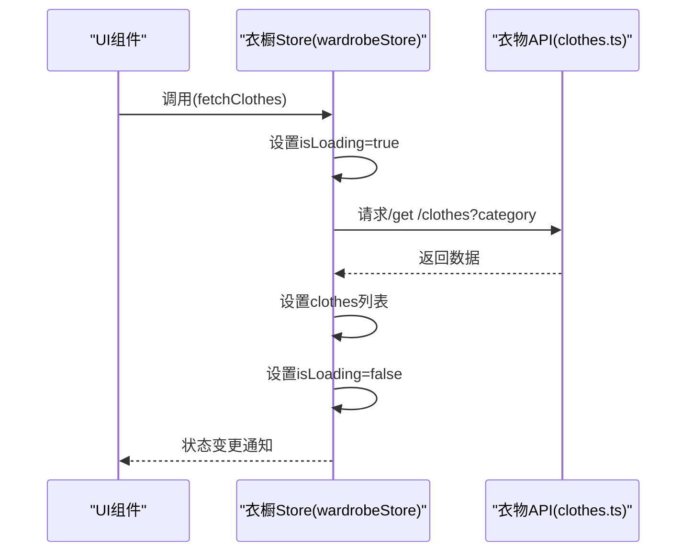
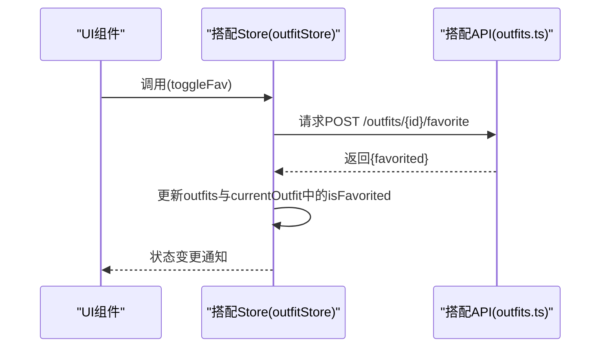
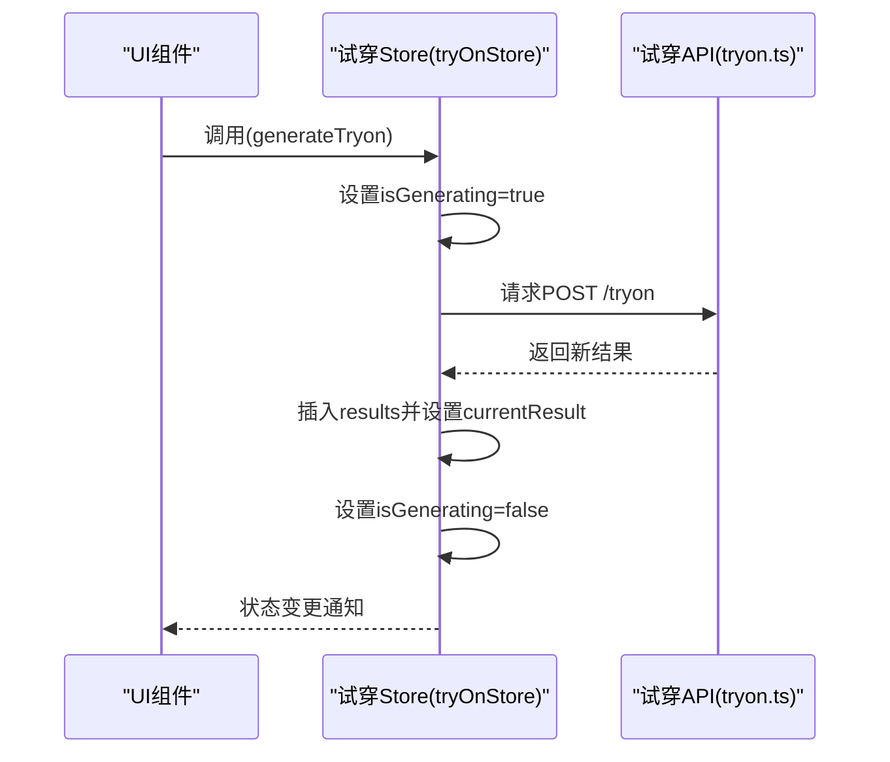
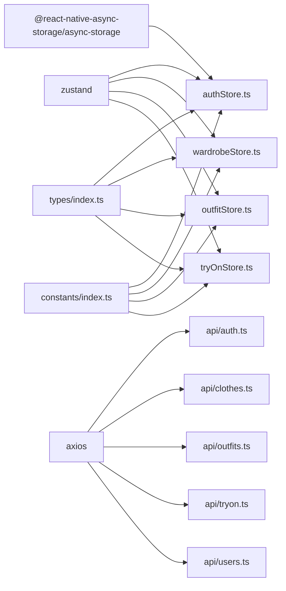

# 状态管理

<cite>
**本文引用的文件**
- [authStore.ts](file://FreeDressApp/src/store/authStore.ts)
- [wardrobeStore.ts](file://FreeDressApp/src/store/wardrobeStore.ts)
- [outfitStore.ts](file://FreeDressApp/src/store/outfitStore.ts)
- [tryOnStore.ts](file://FreeDressApp/src/store/tryOnStore.ts)
- [index.ts（类型定义）](file://FreeDressApp/src/types/index.ts)
- [index.ts（常量与设计）](file://FreeDressApp/src/constants/index.ts)
- [auth.ts](file://FreeDressApp/src/api/auth.ts)
- [clothes.ts](file://FreeDressApp/src/api/clothes.ts)
- [outfits.ts](file://FreeDressApp/src/api/outfits.ts)
- [tryon.ts](file://FreeDressApp/src/api/tryon.ts)
- [users.ts](file://FreeDressApp/src/api/users.ts)
- [RootNavigator.tsx](file://FreeDressApp/src/navigation/RootNavigator.tsx)
- [App.tsx](file://FreeDressApp/src/App.tsx)
- [package.json](file://FreeDressApp/package.json)
</cite>

## 目录
1. [简介](#简介)
2. [项目结构](#项目结构)
3. [核心组件](#核心组件)
4. [架构总览](#架构总览)
5. [详细组件分析](#详细组件分析)
6. [依赖分析](#依赖分析)
7. [性能考虑](#性能考虑)
8. [故障排查指南](#故障排查指南)
9. [结论](#结论)
10. [附录](#附录)

## 简介
本文件系统性梳理畅搭(FreeDress)应用的状态管理方案，基于Zustand实现四大核心Store：认证状态管理(authStore)、衣橱状态管理(wardrobeStore)、搭配状态管理(outfitStore)、AI试穿状态管理(tryOnStore)。文档涵盖状态定义、动作函数、订阅与UI绑定、异步操作处理、状态持久化与同步机制，并给出最佳实践与调试建议。

## 项目结构
- Store层位于 src/store，采用Zustand create函数定义独立模块，职责清晰、边界明确。
- 类型与常量位于 src/types 与 src/constants，统一约束数据结构与运行时配置。
- API层位于 src/api，封装后端接口，Store通过API层进行数据读写。
- 导航层 src/navigation 通过订阅Store状态控制页面路由切换与启动引导。

图表来源
- [App.tsx:1-28](file://FreeDressApp/src/App.tsx#L1-L28)
- [RootNavigator.tsx:1-95](file://FreeDressApp/src/navigation/RootNavigator.tsx#L1-L95)
- [authStore.ts:1-123](file://FreeDressApp/src/store/authStore.ts#L1-L123)
- [wardrobeStore.ts:1-83](file://FreeDressApp/src/store/wardrobeStore.ts#L1-L83)
- [outfitStore.ts:1-90](file://FreeDressApp/src/store/outfitStore.ts#L1-L90)
- [tryOnStore.ts:1-59](file://FreeDressApp/src/store/tryOnStore.ts#L1-L59)
- [auth.ts:1-101](file://FreeDressApp/src/api/auth.ts#L1-L101)
- [clothes.ts:1-54](file://FreeDressApp/src/api/clothes.ts#L1-L54)
- [outfits.ts:1-40](file://FreeDressApp/src/api/outfits.ts#L1-L40)
- [tryon.ts:1-28](file://FreeDressApp/src/api/tryon.ts#L1-L28)
- [users.ts:1-32](file://FreeDressApp/src/api/users.ts#L1-L32)
- [index.ts（类型定义）:1-98](file://FreeDressApp/src/types/index.ts#L1-L98)
- [index.ts（常量与设计）:1-212](file://FreeDressApp/src/constants/index.ts#L1-L212)

章节来源
- [App.tsx:1-28](file://FreeDressApp/src/App.tsx#L1-L28)
- [RootNavigator.tsx:1-95](file://FreeDressApp/src/navigation/RootNavigator.tsx#L1-L95)

## 核心组件
- 认证状态管理(authStore)
  - 管理用户、访问令牌、刷新令牌、认证状态与加载状态
  - 提供设置认证、清除认证、更新用户信息、从本地存储加载等动作
  - 使用AsyncStorage进行持久化
- 衣橱状态管理(wardrobeStore)
  - 管理衣物列表、分类统计、活动分类、加载状态
  - 提供获取衣物、获取统计、新增、编辑、删除衣物的动作
- 搭配状态管理(outfitStore)
  - 管理搭配列表、收藏列表、当前搭配、加载状态
  - 提供获取搭配、获取收藏、创建搭配、删除搭配、切换收藏的动作
- AI试穿状态管理(tryOnStore)
  - 管理试穿结果列表、当前结果、加载状态、生成中状态
  - 提供获取结果、生成试穿、设置当前结果的动作

章节来源
- [authStore.ts:1-123](file://FreeDressApp/src/store/authStore.ts#L1-L123)
- [wardrobeStore.ts:1-83](file://FreeDressApp/src/store/wardrobeStore.ts#L1-L83)
- [outfitStore.ts:1-90](file://FreeDressApp/src/store/outfitStore.ts#L1-L90)
- [tryOnStore.ts:1-59](file://FreeDressApp/src/store/tryOnStore.ts#L1-L59)

## 架构总览
Zustand Store作为单一事实来源，通过API层与后端交互；UI通过订阅Store状态进行渲染与交互。导航层在应用启动时加载认证状态，决定显示登录或主内容。

图表来源
- [App.tsx:1-28](file://FreeDressApp/src/App.tsx#L1-L28)
- [RootNavigator.tsx:1-95](file://FreeDressApp/src/navigation/RootNavigator.tsx#L1-L95)
- [authStore.ts:1-123](file://FreeDressApp/src/store/authStore.ts#L1-L123)
- [auth.ts:1-101](file://FreeDressApp/src/api/auth.ts#L1-L101)

## 详细组件分析

### 认证状态管理(authStore)
- 状态定义
  - user: 当前用户信息或空
  - accessToken/refreshToken: 令牌
  - isAuthenticated: 是否已认证
  - isLoading: 启动时加载状态
- 动作函数
  - setAuth(data): 写入状态并持久化
  - clearAuth(): 清空状态并清理存储
  - updateUser(data): 合并更新用户信息并同步存储
  - loadAuthFromStorage(): 批量读取存储并恢复状态
- 订阅与UI绑定
  - RootNavigator在启动时调用loadAuthFromStorage，并订阅isAuthenticated以决定路由
- 异步与错误处理
  - 批量读写使用multiGet/multiSet/multiRemove
  - 异常时设置isLoading=false，避免界面卡死
- 状态持久化
  - 使用AsyncStorage键值对存储令牌与用户信息

图表来源
- [authStore.ts:97-121](file://FreeDressApp/src/store/authStore.ts#L97-L121)

章节来源
- [authStore.ts:1-123](file://FreeDressApp/src/store/authStore.ts#L1-L123)
- [RootNavigator.tsx:42-47](file://FreeDressApp/src/navigation/RootNavigator.tsx#L42-L47)
- [index.ts（常量与设计）:200-205](file://FreeDressApp/src/constants/index.ts#L200-L205)

### 衣橱状态管理(wardrobeStore)
- 状态定义
  - clothes: 衣物列表
  - categoryStats: 分类统计
  - isLoading: 加载状态
  - activeCategory: 当前筛选分类
- 动作函数
  - setActiveCategory(category): 切换分类
  - fetchClothes(category?): 拉取衣物列表，设置loading
  - fetchStats(): 拉取分类统计
  - addCloth(data): 新增后插入列表并刷新统计
  - editCloth(id, data): 局部更新
  - removeCloth(id): 删除后过滤列表并刷新统计
- 异步与错误处理
  - 捕获异常并打印日志，finally关闭loading
- 数据一致性
  - 新增/删除后立即更新本地列表，保证UI即时反馈

图表来源
- [wardrobeStore.ts:43-53](file://FreeDressApp/src/store/wardrobeStore.ts#L43-L53)
- [clothes.ts:34-37](file://FreeDressApp/src/api/clothes.ts#L34-L37)

章节来源
- [wardrobeStore.ts:1-83](file://FreeDressApp/src/store/wardrobeStore.ts#L1-L83)
- [clothes.ts:1-54](file://FreeDressApp/src/api/clothes.ts#L1-L54)

### 搭配状态管理(outfitStore)
- 状态定义
  - outfits: 搭配列表
  - favorites: 收藏列表
  - currentOutfit: 当前选中搭配
  - isLoading: 加载状态
- 动作函数
  - fetchOutfits(): 拉取搭配列表
  - fetchFavorites(): 拉取收藏列表
  - createNewOutfit(data): 创建后插入列表并设置currentOutfit
  - removeOutfit(id): 删除并清理currentOutfit
  - toggleFav(outfitId): 调用后端切换收藏状态并同步UI
  - setCurrentOutfit(outfit): 设置当前搭配
- 异步与错误处理
  - 捕获异常并打印日志，finally关闭loading
- 状态同步
  - 同步更新outfits与currentOutfit，确保选中态一致

图表来源
- [outfitStore.ts:74-86](file://FreeDressApp/src/store/outfitStore.ts#L74-L86)
- [outfits.ts:33-35](file://FreeDressApp/src/api/outfits.ts#L33-L35)

章节来源
- [outfitStore.ts:1-90](file://FreeDressApp/src/store/outfitStore.ts#L1-L90)
- [outfits.ts:1-40](file://FreeDressApp/src/api/outfits.ts#L1-L40)

### AI试穿状态管理(tryOnStore)
- 状态定义
  - results: 试穿结果列表
  - currentResult: 当前选中结果
  - isLoading/isGenerating: 加载与生成状态
- 动作函数
  - fetchResults(): 拉取历史结果
  - generateTryon(data): 调用后端生成新结果，插入列表并设置currentResult
  - setCurrentResult(result): 设置当前结果
- 异步与错误处理
  - 生成流程中设置isGenerating=true，finally恢复为false
- 状态同步
  - 生成成功后立即更新results与currentResult

图表来源
- [tryOnStore.ts:42-55](file://FreeDressApp/src/store/tryOnStore.ts#L42-L55)
- [tryon.ts:17-19](file://FreeDressApp/src/api/tryon.ts#L17-L19)

章节来源
- [tryOnStore.ts:1-59](file://FreeDressApp/src/store/tryOnStore.ts#L1-L59)
- [tryon.ts:1-28](file://FreeDressApp/src/api/tryon.ts#L1-L28)

## 依赖分析
- 外部依赖
  - zustand: 状态管理库
  - @react-native-async-storage/async-storage: 本地持久化
  - axios: HTTP客户端
- 内部依赖
  - Store依赖API层进行数据读写
  - Store依赖类型定义与常量进行数据约束与配置
  - 导航层依赖authStore进行路由决策

图表来源
- [package.json:12-30](file://FreeDressApp/package.json#L12-L30)
- [authStore.ts:1-2](file://FreeDressApp/src/store/authStore.ts#L1-L2)
- [wardrobeStore.ts:1-1](file://FreeDressApp/src/store/wardrobeStore.ts#L1-L1)
- [outfitStore.ts:1-1](file://FreeDressApp/src/store/outfitStore.ts#L1-L1)
- [tryOnStore.ts:1-1](file://FreeDressApp/src/store/tryOnStore.ts#L1-L1)
- [auth.ts:1-1](file://FreeDressApp/src/api/auth.ts#L1-L1)
- [clothes.ts:1-1](file://FreeDressApp/src/api/clothes.ts#L1-L1)
- [outfits.ts:1-1](file://FreeDressApp/src/api/outfits.ts#L1-L1)
- [tryon.ts:1-1](file://FreeDressApp/src/api/tryon.ts#L1-L1)
- [users.ts:1-1](file://FreeDressApp/src/api/users.ts#L1-L1)
- [index.ts（类型定义）:1-1](file://FreeDressApp/src/types/index.ts#L1-L1)
- [index.ts（常量与设计）:1-1](file://FreeDressApp/src/constants/index.ts#L1-L1)

章节来源
- [package.json:12-30](file://FreeDressApp/package.json#L12-L30)

## 性能考虑
- 状态粒度
  - 将不同业务域拆分为独立Store，降低无关状态变更带来的重渲染
- 异步操作
  - 在发起请求前设置loading状态，finally阶段统一关闭，避免UI卡顿
- 本地持久化
  - 使用multiSet/multiGet减少I/O次数；仅在必要时更新存储
- 列表更新
  - 新增/删除采用不可变更新策略，避免深层拷贝成本
- 订阅范围
  - UI仅订阅所需字段，避免过度渲染

## 故障排查指南
- 认证状态无法恢复
  - 检查本地存储键是否正确，确认STORAGE_KEYS与实际存储一致
  - 观察loadAuthFromStorage异常分支，确保错误不会导致isLoading恒为true
- 衣物列表不刷新
  - 确认addCloth/removeCloth后是否调用了fetchStats
  - 检查API返回数据结构与Store期望是否一致
- 搭配收藏状态不同步
  - 确认toggleFav后outfits与currentOutfit的isFavorited字段被正确更新
- 试穿生成无响应
  - 检查generateTryon流程中isGenerating状态是否最终被复位
- 导航未按预期切换
  - 确认RootNavigator在启动时调用loadAuthFromStorage且订阅了isAuthenticated

章节来源
- [authStore.ts:97-121](file://FreeDressApp/src/store/authStore.ts#L97-L121)
- [wardrobeStore.ts:64-81](file://FreeDressApp/src/store/wardrobeStore.ts#L64-L81)
- [outfitStore.ts:74-86](file://FreeDressApp/src/store/outfitStore.ts#L74-L86)
- [tryOnStore.ts:42-55](file://FreeDressApp/src/store/tryOnStore.ts#L42-L55)
- [RootNavigator.tsx:42-47](file://FreeDressApp/src/navigation/RootNavigator.tsx#L42-L47)

## 结论
本项目采用Zustand实现轻量、直观的状态管理，结合API层与本地存储，形成“状态-动作-持久化”的闭环。四大Store职责清晰，配合类型与常量约束，提升了代码可维护性与扩展性。建议在后续迭代中进一步引入调试工具与单元测试，持续优化性能与稳定性。

## 附录
- 状态与UI绑定方法
  - 在组件中通过useXxxStore订阅所需状态字段
  - 在组件挂载或依赖变化时调用对应Store动作函数
- 状态更新触发机制
  - 动作函数内部通过set更新状态
  - 异步动作完成后根据结果更新状态并触发UI重渲染
- 最佳实践清单
  - 保持状态最小化与高内聚
  - 对异步操作统一加loading
  - 本地存储与远端状态保持幂等更新
  - 使用类型约束避免运行时错误