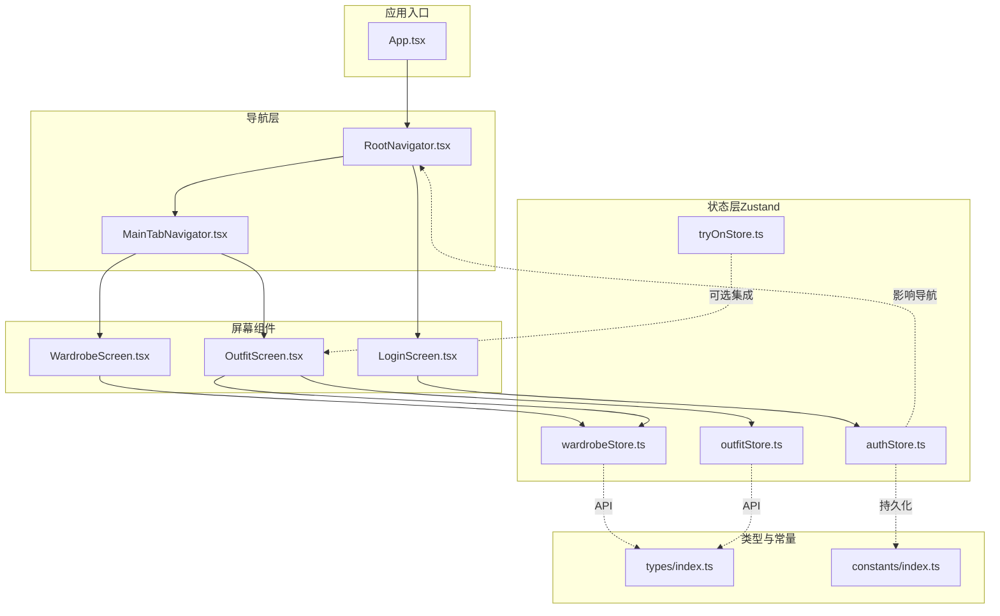
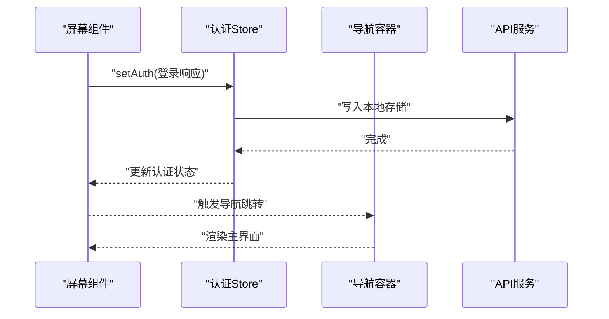
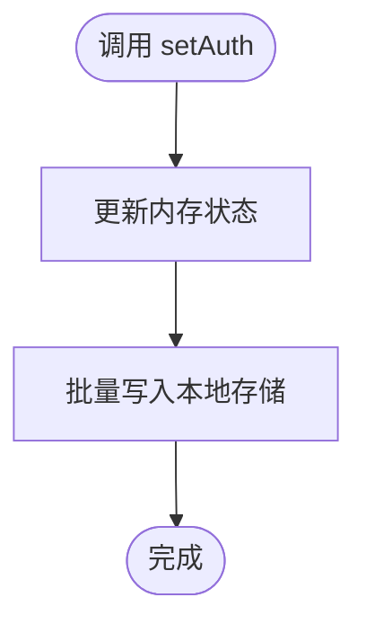
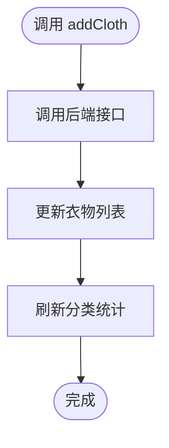
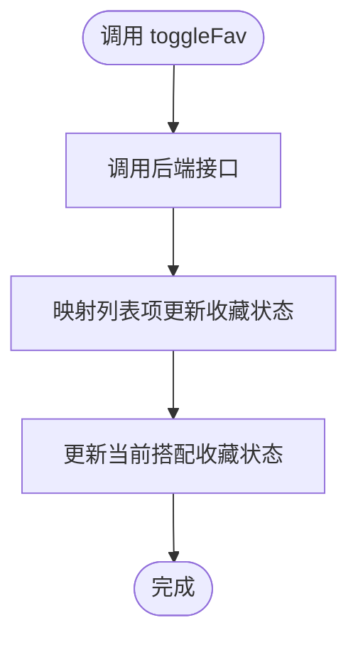
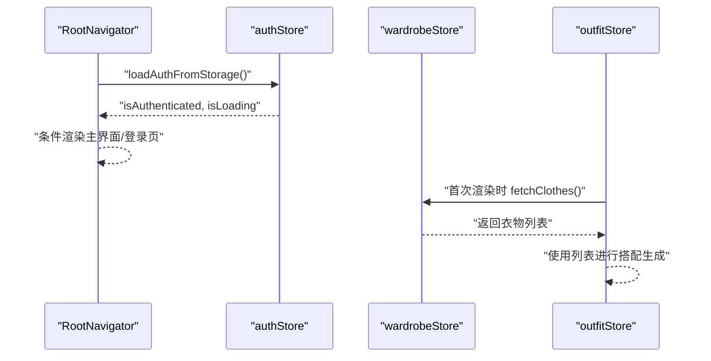
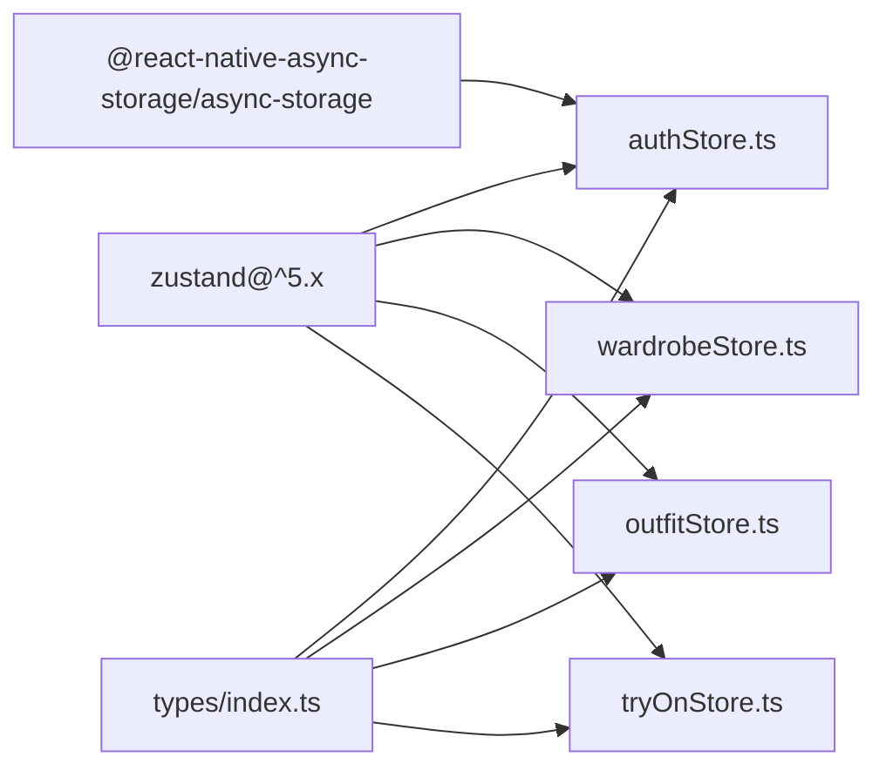

# 状态管理模式与最佳实践

<cite>
**本文档引用的文件**
- [authStore.ts](file://FreeDressApp/src/store/authStore.ts)
- [outfitStore.ts](file://FreeDressApp/src/store/outfitStore.ts)
- [wardrobeStore.ts](file://FreeDressApp/src/store/wardrobeStore.ts)
- [tryOnStore.ts](file://FreeDressApp/src/store/tryOnStore.ts)
- [index.ts（类型定义）](file://FreeDressApp/src/types/index.ts)
- [index.ts（常量与设计 Token）](file://FreeDressApp/src/constants/index.ts)
- [RootNavigator.tsx](file://FreeDressApp/src/navigation/RootNavigator.tsx)
- [MainTabNavigator.tsx](file://FreeDressApp/src/navigation/MainTabNavigator.tsx)
- [LoginScreen.tsx](file://FreeDressApp/src/screens/LoginScreen.tsx)
- [WardrobeScreen.tsx](file://FreeDressApp/src/screens/WardrobeScreen.tsx)
- [OutfitScreen.tsx](file://FreeDressApp/src/screens/OutfitScreen.tsx)
- [App.tsx](file://FreeDressApp/src/App.tsx)
- [package.json](file://FreeDressApp/package.json)
</cite>

## 目录
1. [引言](#引言)
2. [项目结构](#项目结构)
3. [核心组件](#核心组件)
4. [架构总览](#架构总览)
5. [详细组件分析](#详细组件分析)
6. [依赖分析](#依赖分析)
7. [性能考虑](#性能考虑)
8. [故障排查指南](#故障排查指南)
9. [结论](#结论)
10. [附录](#附录)

## 引言
本文件面向畅搭（FreeDress）应用，系统梳理基于 Zustand 的状态管理模式与最佳实践。内容涵盖 Store 创建、状态订阅与动作函数设计；多 Store 协调机制、状态共享策略与数据流管理；状态持久化、异步处理与错误边界；性能优化（状态分割、选择器优化、内存管理）；以及调试工具、开发体验与团队协作规范。

## 项目结构
FreeDressApp 采用按功能域划分的 Store 架构，每个业务域拥有独立的 Zustand Store，通过 React 组件订阅状态并触发动作。导航层负责根据认证状态切换界面栈，屏幕组件在生命周期内拉取或更新 Store 数据。

图表来源
- [App.tsx:11-19](file://FreeDressApp/src/App.tsx#L11-L19)
- [RootNavigator.tsx:41-84](file://FreeDressApp/src/navigation/RootNavigator.tsx#L41-L84)
- [MainTabNavigator.tsx:22-34](file://FreeDressApp/src/navigation/MainTabNavigator.tsx#L22-L34)
- [LoginScreen.tsx:44-92](file://FreeDressApp/src/screens/LoginScreen.tsx#L44-L92)
- [WardrobeScreen.tsx:40-107](file://FreeDressApp/src/screens/WardrobeScreen.tsx#L40-L107)
- [OutfitScreen.tsx:37-93](file://FreeDressApp/src/screens/OutfitScreen.tsx#L37-L93)
- [authStore.ts:28-122](file://FreeDressApp/src/store/authStore.ts#L28-L122)
- [wardrobeStore.ts:35-82](file://FreeDressApp/src/store/wardrobeStore.ts#L35-L82)
- [outfitStore.ts:32-89](file://FreeDressApp/src/store/outfitStore.ts#L32-L89)
- [tryOnStore.ts:24-58](file://FreeDressApp/src/store/tryOnStore.ts#L24-L58)
- [index.ts（类型定义）:1-98](file://FreeDressApp/src/types/index.ts#L1-L98)
- [index.ts（常量与设计 Token）:200-212](file://FreeDressApp/src/constants/index.ts#L200-L212)

章节来源
- [App.tsx:11-19](file://FreeDressApp/src/App.tsx#L11-L19)
- [RootNavigator.tsx:41-84](file://FreeDressApp/src/navigation/RootNavigator.tsx#L41-L84)
- [MainTabNavigator.tsx:22-34](file://FreeDressApp/src/navigation/MainTabNavigator.tsx#L22-L34)

## 核心组件
- 认证 Store（authStore）：管理用户、令牌与认证状态，支持设置、清除、从本地存储恢复、更新用户信息等。
- 衣物 Store（wardrobeStore）：管理衣橱列表、分类统计、活动分类与 CRUD 操作，支持加载状态与统计刷新。
- 搭配 Store（outfitStore）：管理搭配列表、收藏、当前搭配与增删改查操作，支持加载状态与收藏切换。
- 试穿 Store（tryOnStore）：管理试穿结果列表与生成流程，支持加载状态与生成状态标记。

章节来源
- [authStore.ts:28-122](file://FreeDressApp/src/store/authStore.ts#L28-L122)
- [wardrobeStore.ts:35-82](file://FreeDressApp/src/store/wardrobeStore.ts#L35-L82)
- [outfitStore.ts:32-89](file://FreeDressApp/src/store/outfitStore.ts#L32-L89)
- [tryOnStore.ts:24-58](file://FreeDressApp/src/store/tryOnStore.ts#L24-L58)

## 架构总览
Zustand 在本项目中承担“单一事实源”的职责，Store 之间通过动作函数相互协作，但尽量保持最小耦合。导航层依据认证状态决定显示内容；屏幕组件通过订阅 Store 状态驱动 UI 更新；API 层封装网络请求，Store 动作负责数据同步与状态变更。

图表来源
- [LoginScreen.tsx:74-92](file://FreeDressApp/src/screens/LoginScreen.tsx#L74-L92)
- [authStore.ts:39-57](file://FreeDressApp/src/store/authStore.ts#L39-L57)
- [RootNavigator.tsx:42-51](file://FreeDressApp/src/navigation/RootNavigator.tsx#L42-L51)

## 详细组件分析

### 认证状态管理（authStore）
- Store 创建与状态
  - 初始状态包含用户信息、访问令牌、刷新令牌、认证状态与加载状态。
  - 动作函数：设置认证信息、清除认证信息、更新用户信息、从本地存储加载认证信息。
- 状态持久化
  - 使用本地存储保存令牌与用户信息，加载时批量读取并恢复状态。
- 错误边界
  - 加载失败时设置加载完成标志，避免无限等待。
- 最佳实践
  - 动作内部统一处理本地存储写入/清理，保证状态与持久化一致。
  - 提供从存储恢复能力，减少重复登录成本。

图表来源
- [authStore.ts:39-57](file://FreeDressApp/src/store/authStore.ts#L39-L57)

章节来源
- [authStore.ts:28-122](file://FreeDressApp/src/store/authStore.ts#L28-L122)
- [index.ts（常量与设计 Token）:200-205](file://FreeDressApp/src/constants/index.ts#L200-L205)

### 衣物状态管理（wardrobeStore）
- Store 创建与状态
  - 管理衣物列表、分类统计、加载状态与活动分类。
  - 动作函数：设置活动分类、拉取衣物列表、拉取分类统计、新增/编辑/删除衣物。
- 数据流
  - 新增/删除后主动刷新统计，确保 UI 与统计数据一致。
- 最佳实践
  - 所有异步动作包裹加载状态，避免 UI 闪烁。
  - 删除动作成功后再更新本地状态，保证一致性。

图表来源
- [wardrobeStore.ts:64-68](file://FreeDressApp/src/store/wardrobeStore.ts#L64-L68)

章节来源
- [wardrobeStore.ts:35-82](file://FreeDressApp/src/store/wardrobeStore.ts#L35-L82)

### 搭配状态管理（outfitStore）
- Store 创建与状态
  - 管理搭配列表、收藏列表、当前搭配与加载状态。
  - 动作函数：拉取搭配列表、拉取收藏、创建新搭配、删除搭配、切换收藏、设置当前搭配。
- 数据流
  - 收藏切换时同时更新当前搭配与列表项，保持 UI 一致性。
- 最佳实践
  - 所有异步动作统一设置加载状态，finally 中复位，避免状态悬挂。
  - 删除搭配后同步清理当前搭配引用，防止无效渲染。

图表来源
- [outfitStore.ts:74-86](file://FreeDressApp/src/store/outfitStore.ts#L74-L86)

章节来源
- [outfitStore.ts:32-89](file://FreeDressApp/src/store/outfitStore.ts#L32-L89)

### 试穿状态管理（tryOnStore）
- Store 创建与状态
  - 管理试穿结果列表、当前结果、加载状态与生成状态。
  - 动作函数：拉取结果、生成试穿、设置当前结果。
- 最佳实践
  - 生成流程中显式标记生成状态，finally 中复位，保证 UI 正确反馈。

章节来源
- [tryOnStore.ts:24-58](file://FreeDressApp/src/store/tryOnStore.ts#L24-L58)

### 多 Store 协调与数据流
- 认证与导航
  - 导航容器订阅认证状态与加载状态，加载完成后决定显示登录或主界面。
- 搭配与衣橱
  - 搭配页面在首次渲染时拉取衣橱数据，避免跨 Store 同步复杂度。
- 状态共享策略
  - 优先通过 Store 内部动作维护状态一致性，必要时在动作中调用其他 Store 的动作以降低耦合。

图表来源
- [RootNavigator.tsx:42-51](file://FreeDressApp/src/navigation/RootNavigator.tsx#L42-L51)
- [authStore.ts:97-121](file://FreeDressApp/src/store/authStore.ts#L97-L121)
- [OutfitScreen.tsx:47-51](file://FreeDressApp/src/screens/OutfitScreen.tsx#L47-L51)
- [wardrobeStore.ts:43-53](file://FreeDressApp/src/store/wardrobeStore.ts#L43-L53)

章节来源
- [RootNavigator.tsx:41-84](file://FreeDressApp/src/navigation/RootNavigator.tsx#L41-L84)
- [OutfitScreen.tsx:37-51](file://FreeDressApp/src/screens/OutfitScreen.tsx#L37-L51)

## 依赖分析
- Zustand 版本：项目使用较新版本的 Zustand，具备更好的类型推断与更简洁的语法。
- 本地存储：使用 @react-native-async-storage/async-storage 实现认证信息持久化。
- 类型系统：通过统一的类型定义文件约束 Store 与 API 的数据结构。

图表来源
- [package.json](file://FreeDressApp/package.json#L30)
- [authStore.ts:1-4](file://FreeDressApp/src/store/authStore.ts#L1-L4)
- [wardrobeStore.ts:1-11](file://FreeDressApp/src/store/wardrobeStore.ts#L1-L11)
- [outfitStore.ts:1-10](file://FreeDressApp/src/store/outfitStore.ts#L1-L10)
- [tryOnStore.ts:1-3](file://FreeDressApp/src/store/tryOnStore.ts#L1-L3)
- [index.ts（类型定义）:1-98](file://FreeDressApp/src/types/index.ts#L1-L98)

章节来源
- [package.json:12-30](file://FreeDressApp/package.json#L12-L30)

## 性能考虑
- 状态分割
  - 将认证、衣橱、搭配、试穿拆分为独立 Store，避免无关状态变更导致的重渲染。
- 选择器优化
  - 屏幕组件仅订阅所需字段，减少不必要的订阅范围；如 WardrobeScreen 仅订阅衣物列表与加载状态。
- 内存管理
  - 删除操作后及时清理当前搭配引用，避免悬挂引用造成内存泄漏。
- 异步与加载
  - 所有异步动作统一设置加载状态并在 finally 中复位，避免状态悬挂与 UI 卡顿。
- 本地存储
  - 认证信息批量读写，减少 IO 次数；加载失败时快速降级，避免阻塞启动流程。

章节来源
- [WardrobeScreen.tsx:40-50](file://FreeDressApp/src/screens/WardrobeScreen.tsx#L40-L50)
- [outfitStore.ts:66-72](file://FreeDressApp/src/store/outfitStore.ts#L66-L72)
- [authStore.ts:97-121](file://FreeDressApp/src/store/authStore.ts#L97-L121)

## 故障排查指南
- 认证状态未生效
  - 检查本地存储是否写入成功；确认加载逻辑在启动时执行。
- 衣物列表为空
  - 确认首次渲染时已触发拉取；检查网络请求与错误日志。
- 搭配收藏状态不同步
  - 检查收藏切换动作是否同时更新当前搭配与列表项。
- 试穿生成无响应
  - 确认生成状态标记与 finally 复位逻辑；检查网络请求与后端接口。

章节来源
- [authStore.ts:97-121](file://FreeDressApp/src/store/authStore.ts#L97-L121)
- [wardrobeStore.ts:43-53](file://FreeDressApp/src/store/wardrobeStore.ts#L43-L53)
- [outfitStore.ts:74-86](file://FreeDressApp/src/store/outfitStore.ts#L74-L86)
- [tryOnStore.ts:42-55](file://FreeDressApp/src/store/tryOnStore.ts#L42-L55)

## 结论
本项目通过清晰的 Store 分割、严格的动作设计与统一的错误处理，构建了稳定且可扩展的状态管理体系。结合本地存储与导航层的协同，实现了良好的用户体验与开发效率。建议在后续迭代中持续完善调试工具链与团队规范，进一步提升可维护性与一致性。

## 附录
- 团队协作规范（建议）
  - Store 命名与导出：统一使用 useXxxStore 命名与默认导出，便于识别与自动补全。
  - 动作命名：动作为祈使句，明确语义；异步动作以 async 结尾。
  - 类型约束：所有 Store 状态与动作参数均通过类型定义约束，避免运行时错误。
  - 错误处理：统一在动作中捕获异常并记录日志，避免异常冒泡至 UI。
  - 持久化策略：敏感信息与用户信息需加密存储；非关键状态可缓存以提升启动速度。
  - 调试工具：引入 Zustand Devtools 与 React Devtools，定期审查订阅与渲染次数。
  - 文档与测试：为关键 Store 编写单元测试与使用示例，保障变更安全。