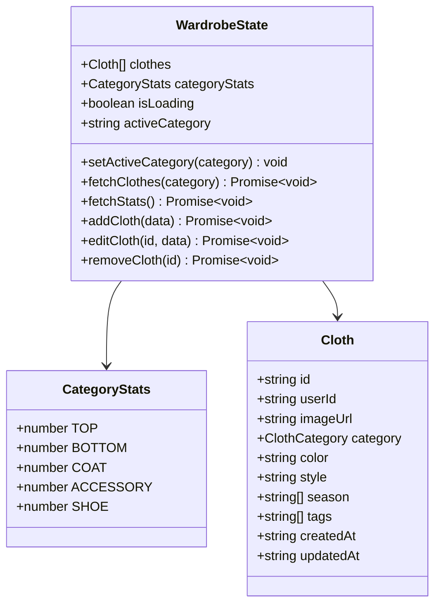
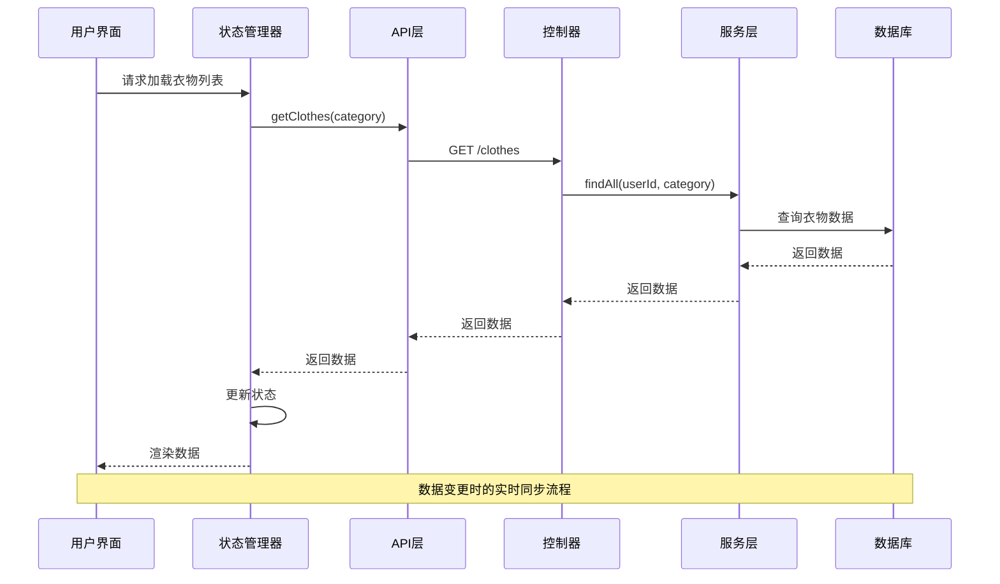
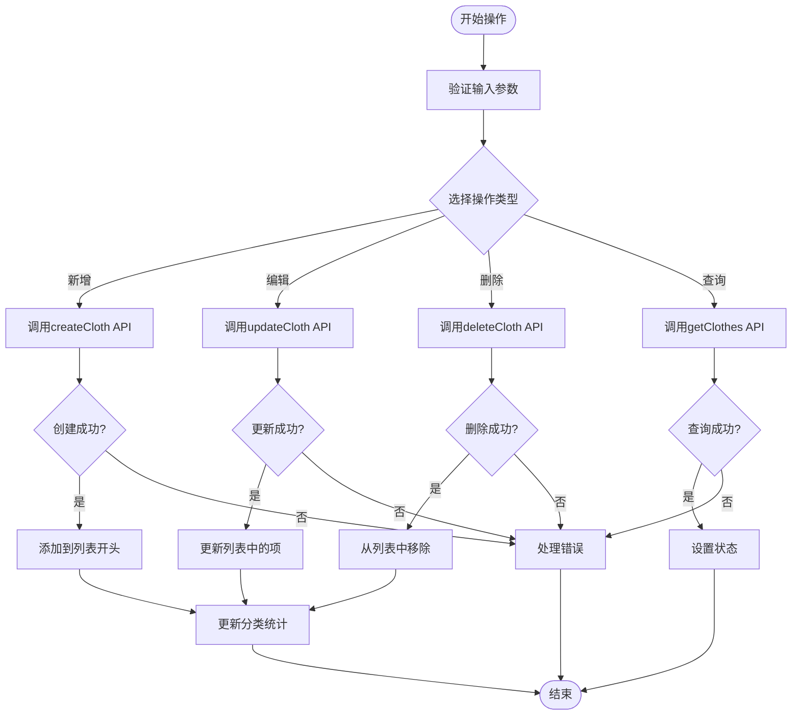
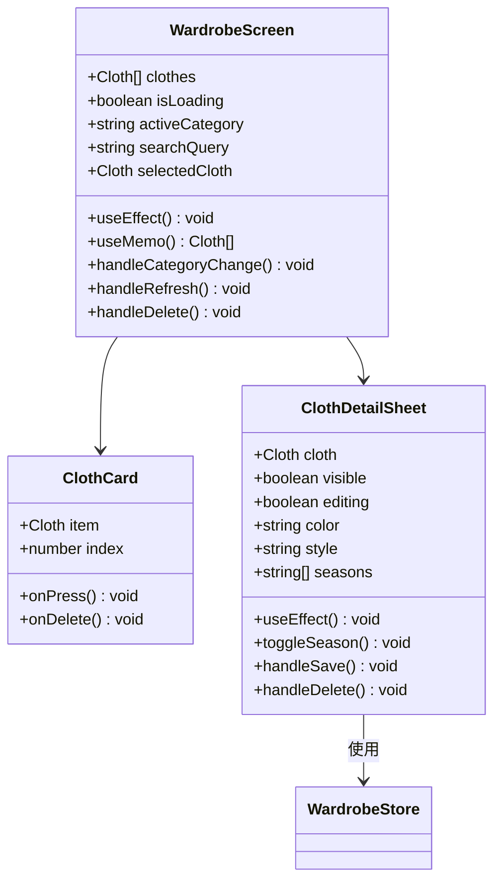
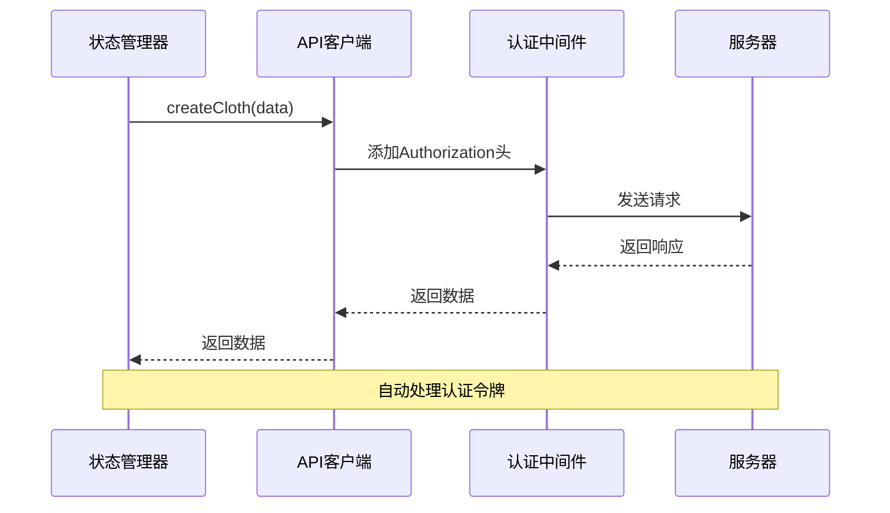
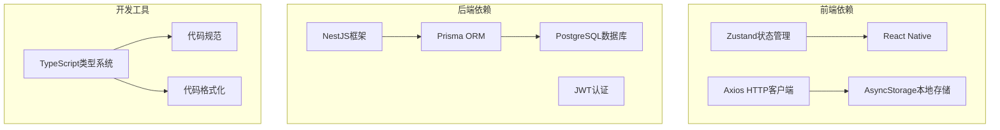
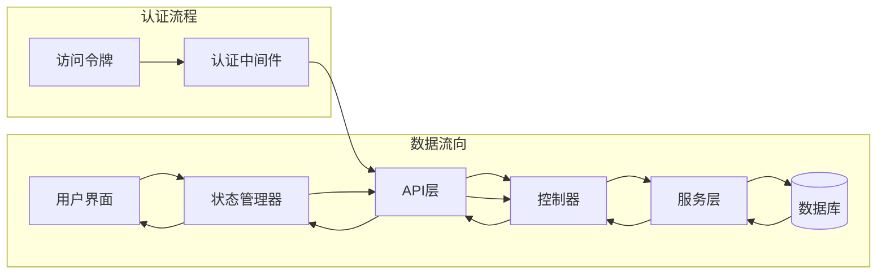
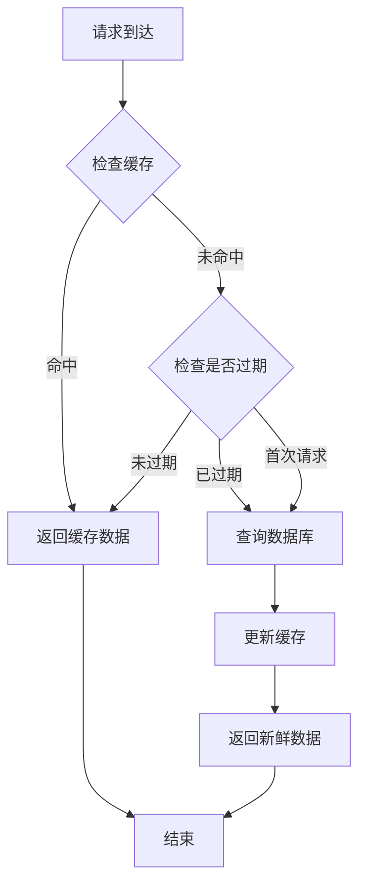

# 衣橱状态管理

<cite>
**本文档引用的文件**
- [wardrobeStore.ts](file://FreeDressApp/src/store/wardrobeStore.ts)
- [WardrobeScreen.tsx](file://FreeDressApp/src/screens/WardrobeScreen.tsx)
- [clothes.ts](file://FreeDressApp/src/api/clothes.ts)
- [axios.ts](file://FreeDressApp/src/api/axios.ts)
- [index.ts](file://FreeDressApp/src/types/index.ts)
- [ClothDetailSheet.tsx](file://FreeDressApp/src/components/ClothDetailSheet.tsx)
- [WardrobeStack.tsx](file://FreeDressApp/src/navigation/WardrobeStack.tsx)
- [index.ts](file://FreeDressApp/src/constants/index.ts)
- [clothes.service.ts](file://backend/src/modules/clothes/clothes.service.ts)
- [clothes.controller.ts](file://backend/src/modules/clothes/clothes.controller.ts)
- [create-cloth.dto.ts](file://backend/src/modules/clothes/dto/create-cloth.dto.ts)
- [update-cloth.dto.ts](file://backend/src/modules/clothes/dto/update-cloth.dto.ts)
- [schema.prisma](file://backend/prisma/schema.prisma)
</cite>

## 目录
1. [简介](#简介)
2. [项目结构](#项目结构)
3. [核心组件](#核心组件)
4. [架构概览](#架构概览)
5. [详细组件分析](#详细组件分析)
6. [依赖关系分析](#依赖关系分析)
7. [性能考虑](#性能考虑)
8. [故障排除指南](#故障排除指南)
9. [结论](#结论)

## 简介

衣橱状态管理模块是畅搭(FreeDress)应用的核心功能之一，负责管理用户的衣物数据。该模块实现了完整的CRUD操作、分类管理、搜索过滤、数据验证和实时同步等功能。通过Zustand状态管理库，实现了高效的状态共享和组件绑定，为用户提供流畅的衣物管理体验。

## 项目结构

衣橱状态管理模块采用分层架构设计，主要包含以下层次：

```mermaid
graph TB
subgraph "前端层"
UI[用户界面层<br/>WardrobeScreen.tsx]
Detail[详情面板<br/>ClothDetailSheet.tsx]
Store[状态管理层<br/>wardrobeStore.ts]
API[API接口层<br/>clothes.ts]
Types[类型定义<br/>types/index.ts]
end
subgraph "后端层"
Controller[控制器<br/>clothes.controller.ts]
Service[服务层<br/>clothes.service.ts]
DTO[数据传输对象<br/>create-cloth.dto.ts / update-cloth.dto.ts]
DB[(数据库)<br/>Prisma Schema]
end
UI --> Store
Detail --> Store
Store --> API
API --> Controller
Controller --> Service
Service --> DB
Service --> DTO
```

**图表来源**
- [wardrobeStore.ts:1-83](file://FreeDressApp/src/store/wardrobeStore.ts#L1-L83)
- [WardrobeScreen.tsx:1-423](file://FreeDressApp/src/screens/WardrobeScreen.tsx#L1-L423)
- [clothes.ts:1-54](file://FreeDressApp/src/api/clothes.ts#L1-L54)

**章节来源**
- [wardrobeStore.ts:1-83](file://FreeDressApp/src/store/wardrobeStore.ts#L1-L83)
- [WardrobeScreen.tsx:1-423](file://FreeDressApp/src/screens/WardrobeScreen.tsx#L1-L423)
- [clothes.ts:1-54](file://FreeDressApp/src/api/clothes.ts#L1-L54)

## 核心组件

### 状态管理器 (wardrobeStore)

状态管理器使用Zustand库实现，提供了完整的衣橱数据管理功能：



**图表来源**
- [wardrobeStore.ts:21-33](file://FreeDressApp/src/store/wardrobeStore.ts#L21-L33)
- [index.ts:22-33](file://FreeDressApp/src/types/index.ts#L22-L33)

### 数据模型定义

系统采用强类型设计，确保数据的一致性和安全性：

| 属性 | 类型 | 描述 | 必填 |
|------|------|------|------|
| id | string | 唯一标识符 | 是 |
| userId | string | 用户ID | 是 |
| imageUrl | string | 图片URL | 是 |
| category | ClothCategory | 衣物分类 | 是 |
| color | string | 颜色 | 否 |
| style | string | 风格 | 否 |
| season | string[] | 适用季节数组 | 否 |
| tags | string[] | 标签数组 | 否 |
| createdAt | string | 创建时间 | 是 |
| updatedAt | string | 更新时间 | 是 |

**章节来源**
- [index.ts:18-33](file://FreeDressApp/src/types/index.ts#L18-L33)
- [schema.prisma:40-59](file://backend/prisma/schema.prisma#L40-L59)

## 架构概览

衣橱状态管理采用客户端-服务器分离架构，实现了数据的实时同步和状态管理：



**图表来源**
- [wardrobeStore.ts:43-53](file://FreeDressApp/src/store/wardrobeStore.ts#L43-L53)
- [clothes.ts:34-37](file://FreeDressApp/src/api/clothes.ts#L34-L37)
- [clothes.controller.ts:49-54](file://backend/src/modules/clothes/clothes.controller.ts#L49-L54)

## 详细组件分析

### 衣物状态管理器

#### 核心状态属性

状态管理器维护了以下关键状态：

| 状态属性 | 类型 | 描述 | 默认值 |
|----------|------|------|--------|
| clothes | Cloth[] | 衣物列表 | [] |
| categoryStats | CategoryStats | 分类统计 | {TOP:0,BOTTOM:0,COAT:0,ACCESSORY:0,SHOE:0} |
| isLoading | boolean | 加载状态 | false |
| activeCategory | string | 当前激活分类 | 'ALL' |

#### CRUD操作实现

每个CRUD操作都经过精心设计，确保数据一致性和用户体验：



**图表来源**
- [wardrobeStore.ts:64-81](file://FreeDressApp/src/store/wardrobeStore.ts#L64-L81)

**章节来源**
- [wardrobeStore.ts:35-82](file://FreeDressApp/src/store/wardrobeStore.ts#L35-L82)

### UI组件集成

#### 衣物列表屏幕

WardrobeScreen实现了完整的UI交互功能：



**图表来源**
- [WardrobeScreen.tsx:40-259](file://FreeDressApp/src/screens/WardrobeScreen.tsx#L40-L259)
- [ClothDetailSheet.tsx:29-244](file://FreeDressApp/src/components/ClothDetailSheet.tsx#L29-L244)

#### 搜索和过滤功能

实现了智能的搜索和分类过滤机制：

| 过滤条件 | 实现方式 | 性能特点 |
|----------|----------|----------|
| 分类筛选 | 前端过滤，使用filter()方法 | O(n) 时间复杂度 |
| 搜索关键词 | 多字段匹配，支持颜色、风格、标签 | O(n*m) 时间复杂度 |
| 实时更新 | 使用useMemo进行计算缓存 | 避免重复计算 |
| 输入防抖 | 使用React hooks优化 | 减少不必要的重渲染 |

**章节来源**
- [WardrobeScreen.tsx:61-76](file://FreeDressApp/src/screens/WardrobeScreen.tsx#L61-L76)

### API接口设计

#### 前端API层



**图表来源**
- [axios.ts:24-38](file://FreeDressApp/src/api/axios.ts#L24-L38)
- [clothes.ts:30-32](file://FreeDressApp/src/api/clothes.ts#L30-L32)

#### 后端服务层

后端采用NestJS框架，实现了完整的业务逻辑：

| 接口 | 方法 | 参数 | 功能 |
|------|------|------|------|
| /clothes | POST | CreateClothDto | 创建新衣物 |
| /clothes | GET | category(可选) | 获取衣物列表 |
| /clothes/:id | GET | id | 获取衣物详情 |
| /clothes/:id | PUT | id, UpdateClothDto | 更新衣物信息 |
| /clothes/:id | DELETE | id | 删除衣物 |
| /clothes/stats/categories | GET | 无 | 获取分类统计 |

**章节来源**
- [clothes.controller.ts:34-100](file://backend/src/modules/clothes/clothes.controller.ts#L34-L100)
- [clothes.service.ts:21-146](file://backend/src/modules/clothes/clothes.service.ts#L21-L146)

## 依赖关系分析

### 技术栈依赖



### 数据流依赖



**图表来源**
- [axios.ts:24-38](file://FreeDressApp/src/api/axios.ts#L24-L38)
- [wardrobeStore.ts:43-53](file://FreeDressApp/src/store/wardrobeStore.ts#L43-L53)

**章节来源**
- [axios.ts:12-18](file://FreeDressApp/src/api/axios.ts#L12-L18)
- [schema.prisma:4-11](file://backend/prisma/schema.prisma#L4-L11)

## 性能考虑

### 前端性能优化

1. **状态管理优化**
   - 使用Zustand减少不必要的重渲染
   - 实现局部状态更新，避免全局状态抖动
   - 使用immer优化不可变更新

2. **UI渲染优化**
   - 使用FlatList替代ScrollView进行大数据集渲染
   - 实现虚拟化列表，只渲染可见项
   - 使用React.memo缓存组件

3. **网络请求优化**
   - 实现请求去重，避免重复请求相同数据
   - 使用缓存策略减少网络请求
   - 实现请求超时和重试机制

### 后端性能优化

1. **数据库优化**
   - 为常用查询字段建立索引
   - 使用分页查询处理大量数据
   - 实现查询缓存减少数据库负载

2. **API优化**
   - 实现请求限流防止滥用
   - 使用连接池管理数据库连接
   - 实现异步处理提高响应速度

### 缓存策略



## 故障排除指南

### 常见问题及解决方案

#### 认证相关问题

| 问题症状 | 可能原因 | 解决方案 |
|----------|----------|----------|
| 401未授权错误 | 访问令牌过期 | 实现自动刷新机制 |
| 登录后仍显示未登录 | 本地存储损坏 | 清除本地存储并重新登录 |
| 刷新令牌失效 | 服务器端配置问题 | 检查服务器JWT配置 |

#### 数据同步问题

| 问题症状 | 可能原因 | 解决方案 |
|----------|----------|----------|
| 数据不同步 | 网络延迟 | 实现乐观更新和回滚机制 |
| 分类统计不准确 | 并发更新 | 使用数据库事务保证一致性 |
| 搜索结果不完整 | 前端过滤逻辑错误 | 检查搜索算法实现 |

#### 性能问题

| 问题症状 | 可能原因 | 解决方案 |
|----------|----------|----------|
| 页面加载缓慢 | 数据量过大 | 实现分页和懒加载 |
| 列表滚动卡顿 | 渲染优化不足 | 使用FlatList和虚拟化 |
| 搜索响应慢 | 算法效率低 | 优化搜索算法和索引 |

**章节来源**
- [axios.ts:44-105](file://FreeDressApp/src/api/axios.ts#L44-L105)
- [wardrobeStore.ts:48-61](file://FreeDressApp/src/store/wardrobeStore.ts#L48-L61)

### 错误处理最佳实践

1. **统一错误处理**
   - 实现全局错误边界捕获异常
   - 提供友好的错误提示信息
   - 记录错误日志便于调试

2. **用户反馈机制**
   - 实现加载状态指示器
   - 提供操作确认对话框
   - 显示网络连接状态

3. **数据验证**
   - 前端输入验证
   - 后端数据完整性检查
   - 实现数据格式化和清理

## 结论

衣橱状态管理模块通过精心设计的架构和实现，为用户提供了完整的衣物管理体验。模块采用了现代化的技术栈，包括Zustand状态管理、NestJS后端框架、Prisma ORM等，确保了系统的可扩展性和可维护性。

### 主要优势

1. **架构清晰**：分层设计使得代码结构清晰，职责分离明确
2. **性能优秀**：实现了多种优化策略，包括缓存、虚拟化和去重
3. **用户体验良好**：提供了丰富的交互功能和友好的界面设计
4. **数据安全**：实现了完善的认证授权和数据验证机制

### 改进建议

1. **增加离线支持**：实现更完善的离线数据同步机制
2. **增强搜索功能**：支持更复杂的搜索条件和排序选项
3. **扩展分类体系**：支持动态分类管理和自定义标签
4. **优化移动端体验**：针对不同设备优化界面布局和交互

该模块为畅搭应用奠定了坚实的数据管理基础，为后续功能扩展提供了良好的技术支撑。