# 认证状态管理

<cite>
**本文档引用的文件**
- [authStore.ts](file://FreeDressApp/src/store/authStore.ts)
- [auth.ts](file://FreeDressApp/src/api/auth.ts)
- [axios.ts](file://FreeDressApp/src/api/axios.ts)
- [index.ts](file://FreeDressApp/src/types/index.ts)
- [index.ts](file://FreeDressApp/src/constants/index.ts)
- [LoginScreen.tsx](file://FreeDressApp/src/screens/LoginScreen.tsx)
- [RegisterScreen.tsx](file://FreeDressApp/src/screens/RegisterScreen.tsx)
- [ForgotPasswordScreen.tsx](file://FreeDressApp/src/screens/ForgotPasswordScreen.tsx)
- [ProfileScreen.tsx](file://FreeDressApp/src/screens/ProfileScreen.tsx)
- [RootNavigator.tsx](file://FreeDressApp/src/navigation/RootNavigator.tsx)
- [MainTabNavigator.tsx](file://FreeDressApp/src/navigation/MainTabNavigator.tsx)
- [App.tsx](file://FreeDressApp/src/App.tsx)
- [package.json](file://FreeDressApp/package.json)
</cite>

## 目录
1. [简介](#简介)
2. [项目结构](#项目结构)
3. [核心组件](#核心组件)
4. [架构概览](#架构概览)
5. [详细组件分析](#详细组件分析)
6. [依赖关系分析](#依赖关系分析)
7. [性能考虑](#性能考虑)
8. [故障排除指南](#故障排除指南)
9. [结论](#结论)

## 简介

畅搭(FreeDress)应用的认证状态管理模块是整个应用的核心基础设施之一。该模块基于Zustand状态管理库构建，提供了完整的用户认证生命周期管理，包括JWT token管理、用户信息存储、状态持久化和异步操作处理。

本模块的主要目标是：
- 提供统一的认证状态管理
- 实现JWT token的自动刷新机制
- 支持用户会话的持久化存储
- 为UI组件提供简洁的认证状态访问接口
- 实现自动登录和状态恢复功能

## 项目结构

认证状态管理模块在项目中的组织结构如下：

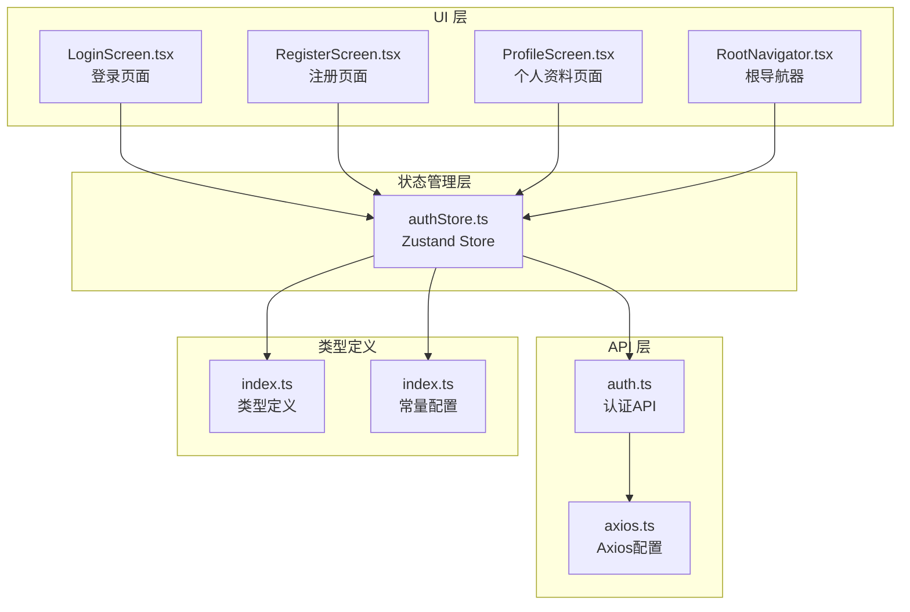

**图表来源**
- [authStore.ts:1-123](file://FreeDressApp/src/store/authStore.ts#L1-L123)
- [auth.ts:1-101](file://FreeDressApp/src/api/auth.ts#L1-L101)
- [axios.ts:1-108](file://FreeDressApp/src/api/axios.ts#L1-L108)

**章节来源**
- [authStore.ts:1-123](file://FreeDressApp/src/store/authStore.ts#L1-L123)
- [auth.ts:1-101](file://FreeDressApp/src/api/auth.ts#L1-L101)
- [axios.ts:1-108](file://FreeDressApp/src/api/axios.ts#L1-L108)

## 核心组件

### 认证状态接口定义

认证状态管理模块的核心是一个TypeScript接口，定义了完整的认证状态结构：

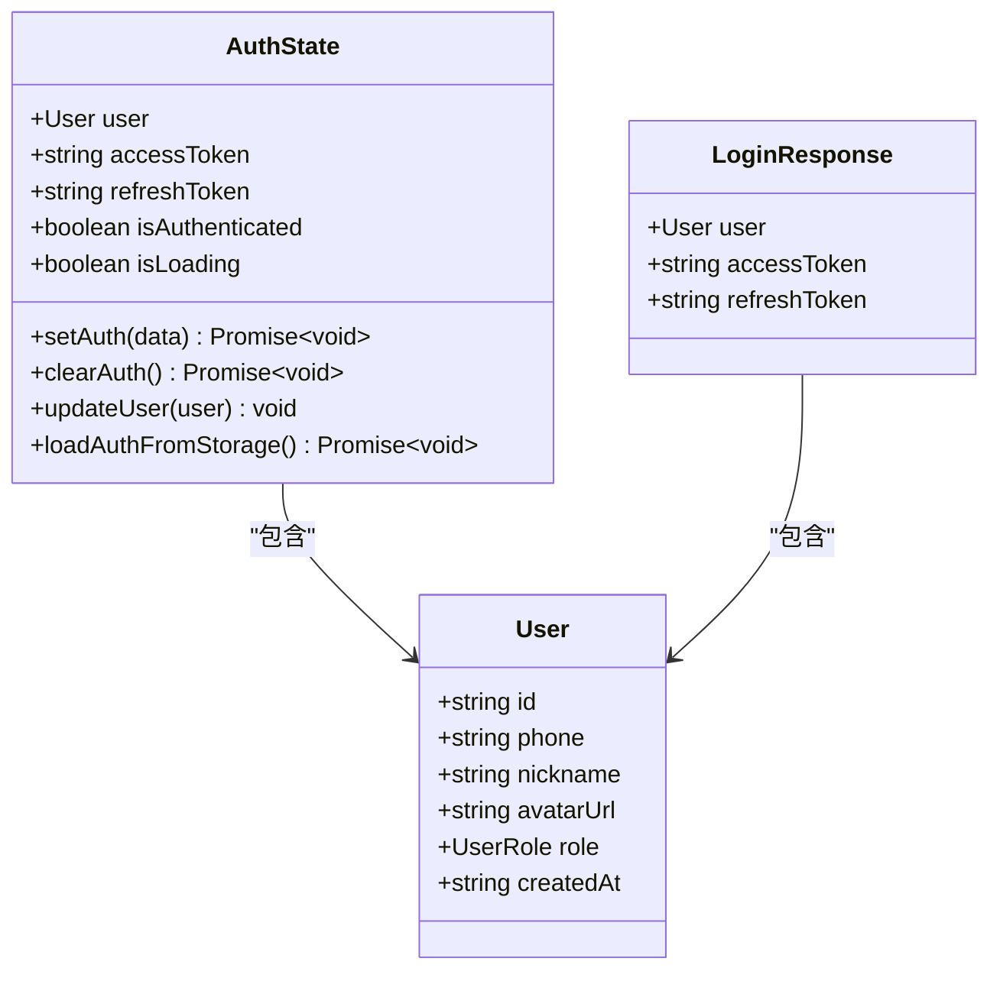

**图表来源**
- [authStore.ts:9-22](file://FreeDressApp/src/store/authStore.ts#L9-L22)
- [index.ts:8-16](file://FreeDressApp/src/types/index.ts#L8-L16)
- [index.ts:67-71](file://FreeDressApp/src/types/index.ts#L67-L71)

### 状态管理器初始化

使用Zustand创建状态管理器，提供响应式状态更新和副作用处理：

**章节来源**
- [authStore.ts:28-123](file://FreeDressApp/src/store/authStore.ts#L28-L123)

## 架构概览

认证状态管理采用分层架构设计，确保关注点分离和代码的可维护性：

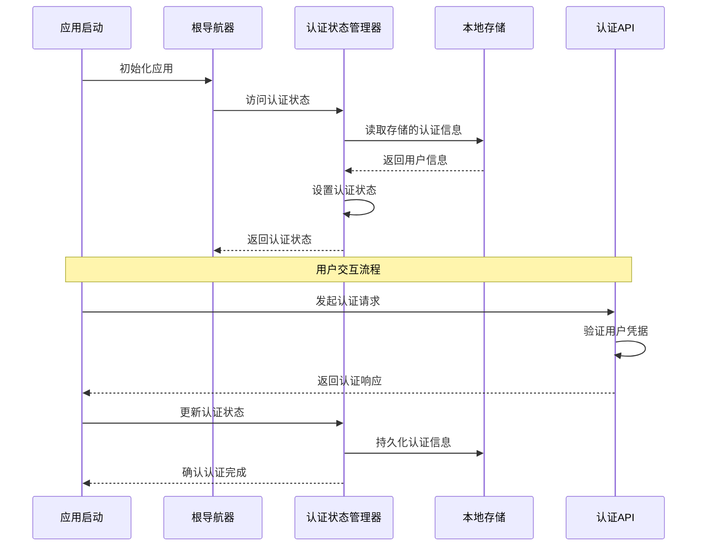

**图表来源**
- [RootNavigator.tsx:42-47](file://FreeDressApp/src/navigation/RootNavigator.tsx#L42-L47)
- [authStore.ts:39-57](file://FreeDressApp/src/store/authStore.ts#L39-L57)
- [axios.ts:24-38](file://FreeDressApp/src/api/axios.ts#L24-L38)

## 详细组件分析

### 认证状态管理器 (authStore.ts)

#### 核心方法详解

##### setAuth 方法
负责设置用户的认证信息，包括用户数据、访问令牌和刷新令牌：

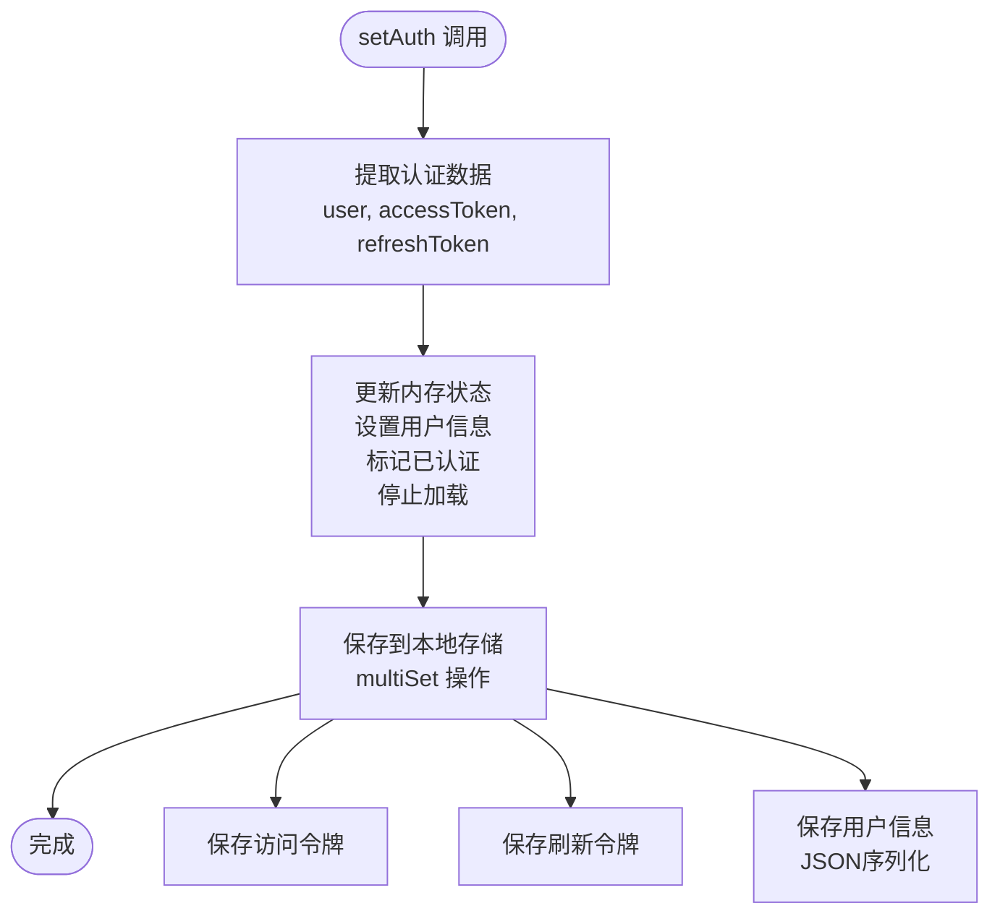

**图表来源**
- [authStore.ts:39-57](file://FreeDressApp/src/store/authStore.ts#L39-L57)

##### clearAuth 方法
实现用户登出功能，清理所有认证相关信息：

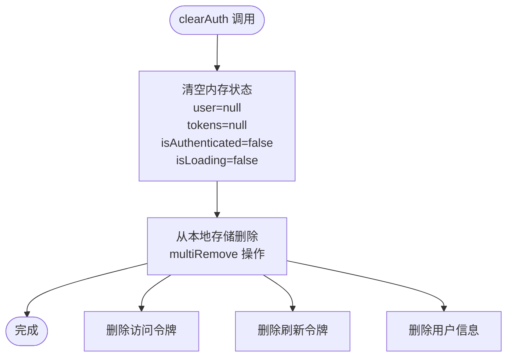

**图表来源**
- [authStore.ts:62-78](file://FreeDressApp/src/store/authStore.ts#L62-L78)

##### updateUser 方法
动态更新用户信息，支持部分字段更新：

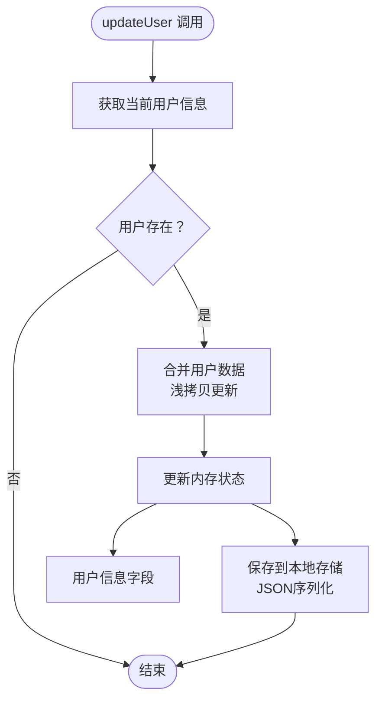

**图表来源**
- [authStore.ts:83-92](file://FreeDressApp/src/store/authStore.ts#L83-L92)

##### loadAuthFromStorage 方法
实现应用启动时的自动登录功能：

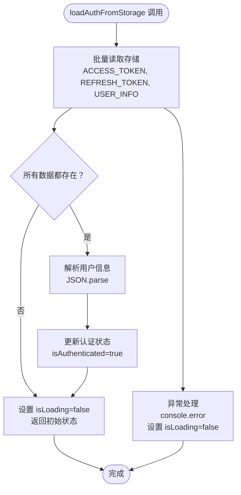

**图表来源**
- [authStore.ts:97-121](file://FreeDressApp/src/store/authStore.ts#L97-L121)

**章节来源**
- [authStore.ts:39-121](file://FreeDressApp/src/store/authStore.ts#L39-L121)

### API 层集成 (auth.ts)

#### 认证API接口

认证API层提供了完整的用户认证相关操作：

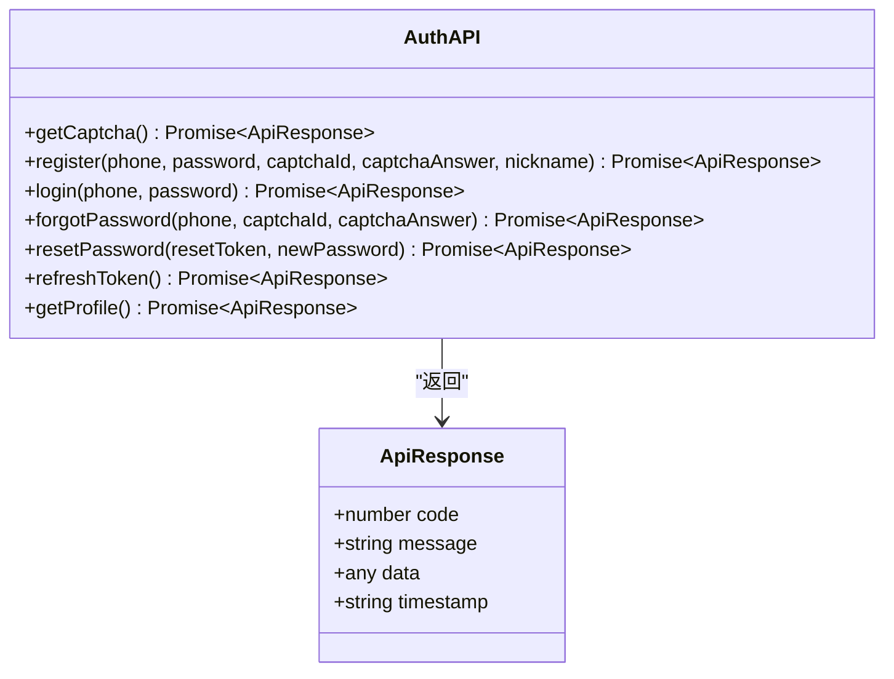

**图表来源**
- [auth.ts:12-101](file://FreeDressApp/src/api/auth.ts#L12-L101)

**章节来源**
- [auth.ts:12-101](file://FreeDressApp/src/api/auth.ts#L12-L101)

### 请求拦截器 (axios.ts)

#### 自动令牌管理

Axios拦截器实现了智能的令牌管理和自动刷新机制：

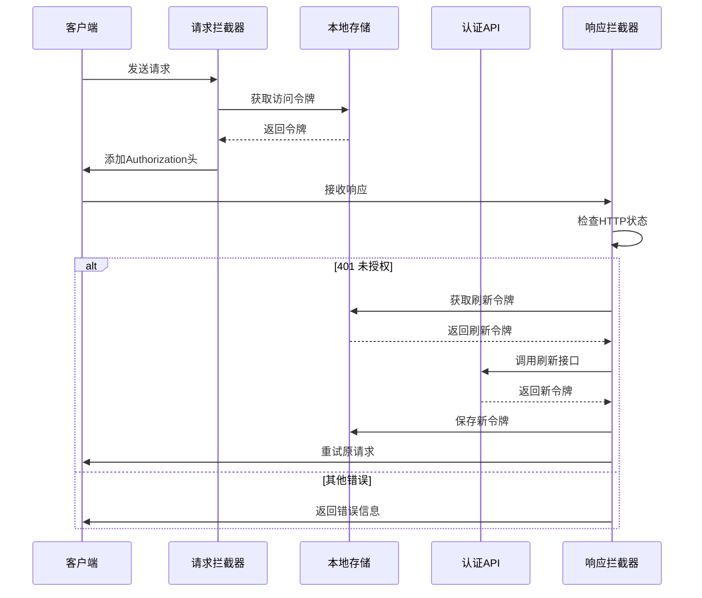

**图表来源**
- [axios.ts:24-38](file://FreeDressApp/src/api/axios.ts#L24-L38)
- [axios.ts:44-105](file://FreeDressApp/src/api/axios.ts#L44-L105)

**章节来源**
- [axios.ts:24-105](file://FreeDressApp/src/api/axios.ts#L24-L105)

### UI 集成

#### 登录页面集成

登录页面通过useAuthStore Hook实现认证状态管理：

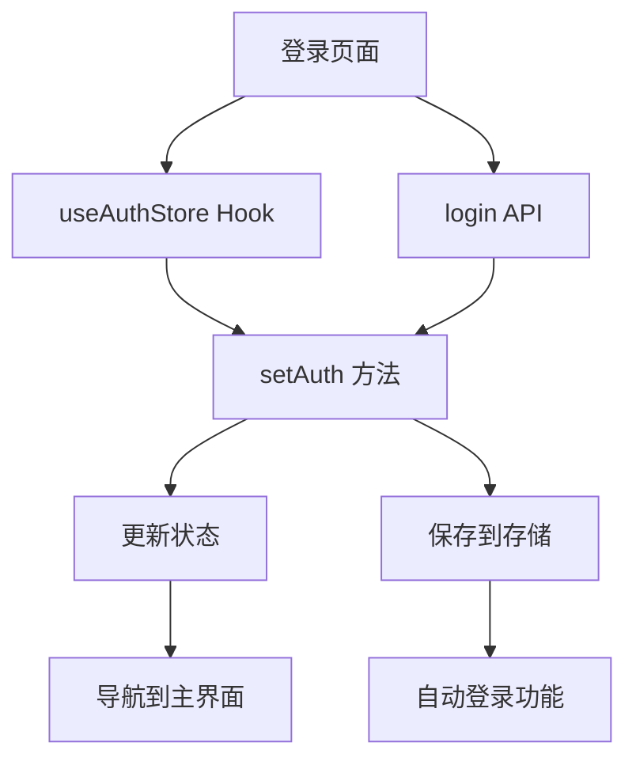

**图表来源**
- [LoginScreen.tsx:47-92](file://FreeDressApp/src/screens/LoginScreen.tsx#L47-L92)
- [authStore.ts:39-57](file://FreeDressApp/src/store/authStore.ts#L39-L57)

**章节来源**
- [LoginScreen.tsx:47-92](file://FreeDressApp/src/screens/LoginScreen.tsx#L47-L92)

#### 根导航器集成

根导航器根据认证状态动态切换界面：

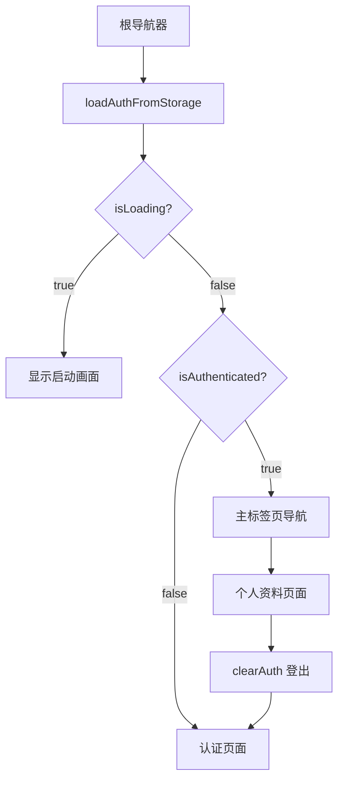

**图表来源**
- [RootNavigator.tsx:42-84](file://FreeDressApp/src/navigation/RootNavigator.tsx#L42-L84)

**章节来源**
- [RootNavigator.tsx:42-84](file://FreeDressApp/src/navigation/RootNavigator.tsx#L42-L84)

## 依赖关系分析

### 核心依赖

认证状态管理模块的关键依赖关系：

```mermaid
graph TB
subgraph "外部依赖"
Zustand[zustand ^5.0.13]
AsyncStorage[@react-native-async-storage/async-storage ^1.24.0]
Axios[axios ^1.16.0]
end
subgraph "内部模块"
AuthStore[authStore.ts]
AuthAPI[auth.ts]
AxiosConfig[axios.ts]
Types[index.ts]
Constants[index.ts]
end
AuthStore --> Zustand
AuthStore --> AsyncStorage
AuthStore --> Types
AuthStore --> Constants
AuthAPI --> Axios
AuthAPI --> Types
AxiosConfig --> Axios
AxiosConfig --> AsyncStorage
AxiosConfig --> Constants
AuthStore --> AuthAPI
AuthAPI --> AxiosConfig
```

**图表来源**
- [package.json:12-31](file://FreeDressApp/package.json#L12-L31)
- [authStore.ts:1-4](file://FreeDressApp/src/store/authStore.ts#L1-L4)

### 数据流图

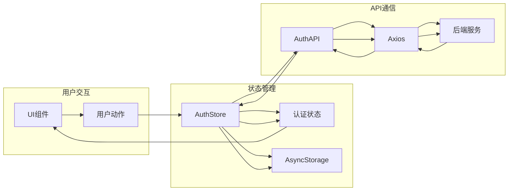

**图表来源**
- [authStore.ts:28-123](file://FreeDressApp/src/store/authStore.ts#L28-L123)
- [auth.ts:1-101](file://FreeDressApp/src/api/auth.ts#L1-L101)
- [axios.ts:1-108](file://FreeDressApp/src/api/axios.ts#L1-L108)

**章节来源**
- [package.json:12-31](file://FreeDressApp/package.json#L12-L31)

## 性能考虑

### 状态更新优化

1. **批量状态更新**: 使用Zustand的批量更新能力，减少不必要的渲染
2. **条件更新**: 仅在用户信息存在时执行更新操作
3. **异步操作**: 所有I/O操作都是异步的，避免阻塞主线程

### 存储策略优化

1. **批量存储操作**: 使用multiSet和multiRemove减少存储操作次数
2. **增量更新**: updateUser方法只更新变化的字段
3. **JSON序列化**: 用户信息采用JSON格式存储，便于跨平台兼容

### 内存管理

1. **状态清理**: clearAuth方法确保完全清理认证状态
2. **引用管理**: 避免循环引用和内存泄漏
3. **异步清理**: 异步存储清理操作不影响用户体验

## 故障排除指南

### 常见问题及解决方案

#### 登录状态异常

**症状**: 用户已登录但UI显示未登录状态

**排查步骤**:
1. 检查loadAuthFromStorage方法是否正常执行
2. 验证AsyncStorage中的数据完整性
3. 确认setAuth方法的调用时机

**解决方案**:
- 重新调用loadAuthFromStorage方法
- 清理AsyncStorage中的过期数据
- 检查网络连接和API可用性

#### Token刷新失败

**症状**: 401错误频繁出现

**排查步骤**:
1. 检查refreshToken API的可用性
2. 验证刷新令牌的有效性
3. 确认响应拦截器的错误处理逻辑

**解决方案**:
- 实施重试机制
- 提供手动刷新选项
- 清理认证状态并重新登录

#### 状态不同步

**症状**: UI状态与实际认证状态不一致

**排查步骤**:
1. 检查状态更新的异步处理
2. 验证组件的依赖关系
3. 确认状态订阅的正确性

**解决方案**:
- 使用正确的Hook组合
- 实施状态同步机制
- 添加状态校验逻辑

**章节来源**
- [authStore.ts:97-121](file://FreeDressApp/src/store/authStore.ts#L97-L121)
- [axios.ts:44-105](file://FreeDressApp/src/api/axios.ts#L44-L105)

## 结论

畅搭应用的认证状态管理模块展现了现代React Native应用的最佳实践：

### 设计优势

1. **模块化设计**: 清晰的关注点分离，便于维护和扩展
2. **异步处理**: 完善的异步操作处理，提升用户体验
3. **状态持久化**: 智能的本地存储策略，支持自动登录
4. **错误处理**: 全面的错误处理机制，增强系统稳定性

### 技术亮点

1. **Zustand集成**: 轻量级状态管理，相比Redux更简单易用
2. **Axios拦截器**: 智能的令牌管理和自动刷新机制
3. **类型安全**: 完整的TypeScript类型定义，提升开发体验
4. **响应式UI**: 基于状态变化的自动UI更新

### 改进建议

1. **缓存策略**: 可以考虑实现更精细的缓存控制
2. **并发处理**: 增加对并发认证请求的处理能力
3. **监控机制**: 添加状态变更的日志和监控功能
4. **测试覆盖**: 扩展单元测试和集成测试的覆盖率

该认证状态管理模块为畅搭应用提供了坚实的基础，确保了用户认证体验的一致性和可靠性。