# 个人中心页面

<cite>
**本文档引用的文件**
- [ProfileScreen.tsx](file://FreeDressApp/src/screens/ProfileScreen.tsx)
- [EditProfileScreen.tsx](file://FreeDressApp/src/screens/EditProfileScreen.tsx)
- [FavoritesScreen.tsx](file://FreeDressApp/src/screens/FavoritesScreen.tsx)
- [authStore.ts](file://FreeDressApp/src/store/authStore.ts)
- [users.ts](file://FreeDressApp/src/api/users.ts)
- [outfits.ts](file://FreeDressApp/src/api/outfits.ts)
- [ScreenHeader.tsx](file://FreeDressApp/src/components/ScreenHeader.tsx)
- [EmptyState.tsx](file://FreeDressApp/src/components/EmptyState.tsx)
- [MainTabNavigator.tsx](file://FreeDressApp/src/navigation/MainTabNavigator.tsx)
- [WardrobeStack.tsx](file://FreeDressApp/src/navigation/WardrobeStack.tsx)
- [OutfitHistoryScreen.tsx](file://FreeDressApp/src/screens/OutfitHistoryScreen.tsx)
- [TryOnHistoryScreen.tsx](file://FreeDressApp/src/screens/TryOnHistoryScreen.tsx)
- [index.ts](file://FreeDressApp/src/types/index.ts)
- [index.ts](file://FreeDressApp/src/constants/index.ts)
</cite>

## 目录
1. [简介](#简介)
2. [项目结构](#项目结构)
3. [核心组件](#核心组件)
4. [架构概览](#架构概览)
5. [详细组件分析](#详细组件分析)
6. [依赖关系分析](#依赖关系分析)
7. [性能考虑](#性能考虑)
8. [故障排除指南](#故障排除指南)
9. [结论](#结论)

## 简介

畅搭(FreeDress)应用的个人中心页面组是用户账户管理的核心模块，包含三个主要页面：ProfileScreen个人资料页、EditProfileScreen编辑资料页和FavoritesScreen收藏夹页。该模块实现了完整的用户资料管理功能，包括个人信息展示、编辑权限控制和数据更新机制；提供了收藏夹功能，支持收藏物品展示、分类管理和批量操作；集成了用户统计功能，涵盖衣橱统计、搭配历史和使用数据分析。

## 项目结构

个人中心页面组位于FreeDressApp/src/screens目录下，采用React Native + TypeScript技术栈构建，遵循模块化设计理念：

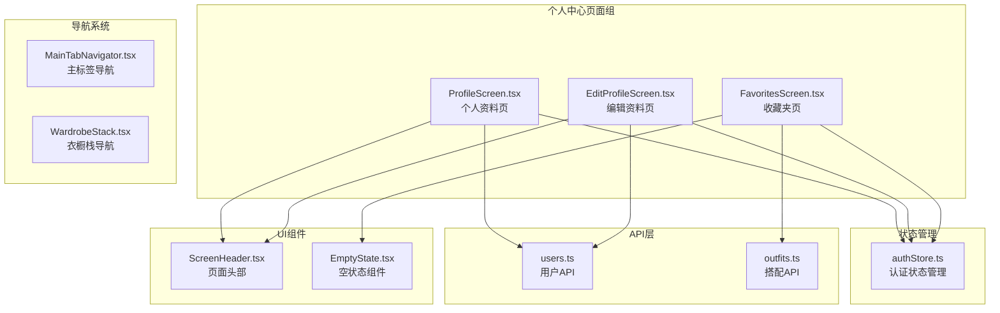

**图表来源**
- [ProfileScreen.tsx:1-409](file://FreeDressApp/src/screens/ProfileScreen.tsx#L1-L409)
- [EditProfileScreen.tsx:1-186](file://FreeDressApp/src/screens/EditProfileScreen.tsx#L1-L186)
- [FavoritesScreen.tsx:1-230](file://FreeDressApp/src/screens/FavoritesScreen.tsx#L1-L230)

**章节来源**
- [ProfileScreen.tsx:1-409](file://FreeDressApp/src/screens/ProfileScreen.tsx#L1-L409)
- [EditProfileScreen.tsx:1-186](file://FreeDressApp/src/screens/EditProfileScreen.tsx#L1-L186)
- [FavoritesScreen.tsx:1-230](file://FreeDressApp/src/screens/FavoritesScreen.tsx#L1-L230)

## 核心组件

### 用户认证状态管理

个人中心页面组的核心是基于Zustand的状态管理系统，提供用户认证信息的持久化存储和实时更新：

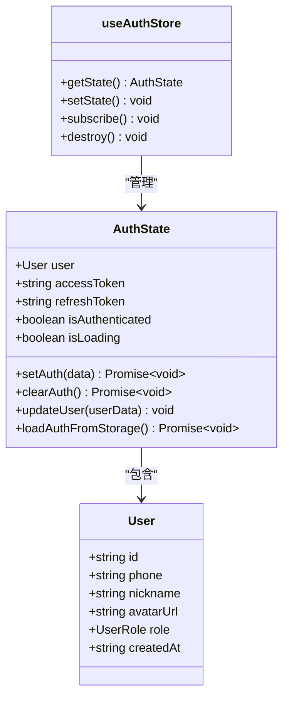

**图表来源**
- [authStore.ts:28-122](file://FreeDressApp/src/store/authStore.ts#L28-L122)
- [index.ts:8-16](file://FreeDressApp/src/types/index.ts#L8-L16)

### 页面导航架构

主标签导航器将个人中心页面集成到应用的整体导航结构中：

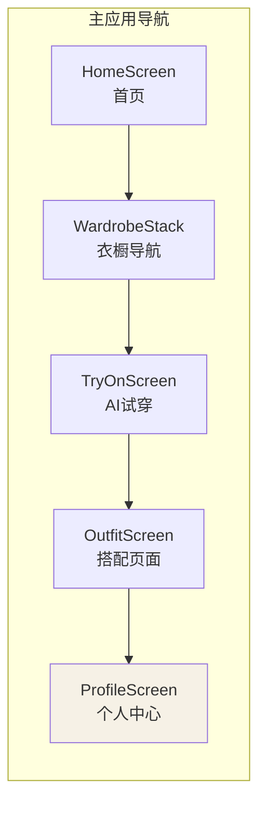

**图表来源**
- [MainTabNavigator.tsx:22-35](file://FreeDressApp/src/navigation/MainTabNavigator.tsx#L22-L35)

**章节来源**
- [authStore.ts:1-123](file://FreeDressApp/src/store/authStore.ts#L1-L123)
- [MainTabNavigator.tsx:1-38](file://FreeDressApp/src/navigation/MainTabNavigator.tsx#L1-L38)

## 架构概览

个人中心页面组采用分层架构设计，各层职责明确，耦合度低：

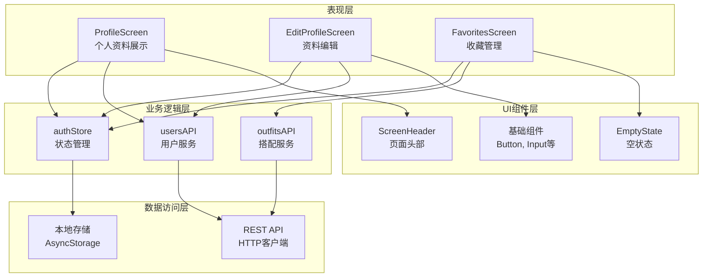

**图表来源**
- [ProfileScreen.tsx:26-27](file://FreeDressApp/src/screens/ProfileScreen.tsx#L26-L27)
- [EditProfileScreen.tsx:24-25](file://FreeDressApp/src/screens/EditProfileScreen.tsx#L24-L25)
- [FavoritesScreen.tsx:24](file://FreeDressApp/src/screens/FavoritesScreen.tsx#L24)

## 详细组件分析

### ProfileScreen个人资料页

ProfileScreen是个人中心的核心页面，提供用户信息展示、统计数据和快捷菜单功能：

#### 数据结构设计

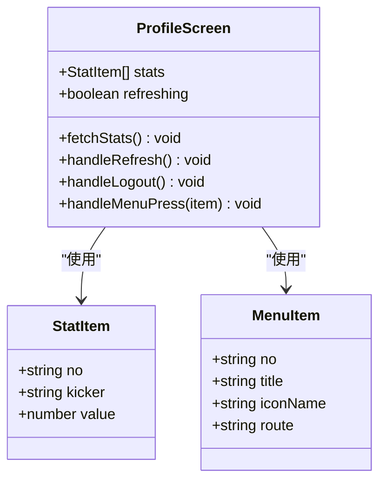

**图表来源**
- [ProfileScreen.tsx:30-50](file://FreeDressApp/src/screens/ProfileScreen.tsx#L30-L50)

#### 用户卡片组件

用户卡片采用杂志风格设计，展示用户基本信息和VIP标识：

```mermaid
graph LR
subgraph "用户卡片"
UC[用户卡片容器]
UT[顶部行<br/>EST. 2026 + VOL. 24]
UB[用户主体<br/>头像 + 昵称 + 手机号]
UD[分割线]
UTS[标语行<br/>引号 + 个性化语录]
end
UC --> UT
UC --> UB
UC --> UD
UC --> UTS
style UC fill:#1F1B16
style UB fill:#F6F1E6
```

**图表来源**
- [ProfileScreen.tsx:131-170](file://FreeDressApp/src/screens/ProfileScreen.tsx#L131-L170)

#### 统计面板设计

统计面板展示用户的衣橱使用情况，包括衣物数量、搭配次数、收藏数量和试穿次数：

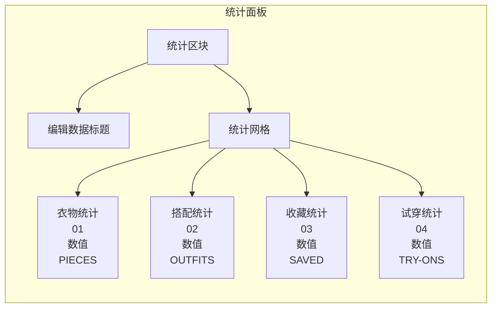

**图表来源**
- [ProfileScreen.tsx:172-190](file://FreeDressApp/src/screens/ProfileScreen.tsx#L172-L190)

**章节来源**
- [ProfileScreen.tsx:52-239](file://FreeDressApp/src/screens/ProfileScreen.tsx#L52-L239)

### EditProfileScreen编辑资料页

EditProfileScreen提供用户资料编辑功能，支持头像上传和基本信息修改：

#### 编辑流程序列图

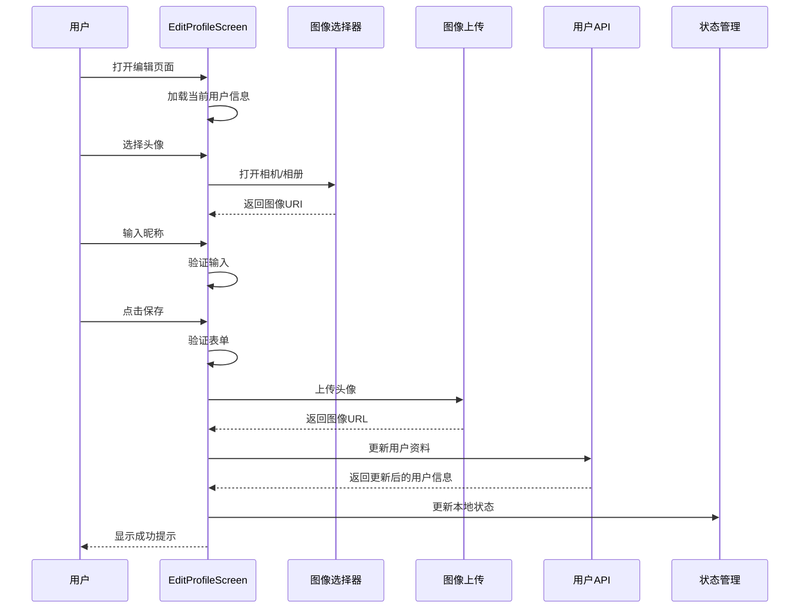

**图表来源**
- [EditProfileScreen.tsx:27-77](file://FreeDressApp/src/screens/EditProfileScreen.tsx#L27-L77)

#### 头像处理机制

编辑页面支持从相机或相册选择头像，并进行压缩处理：

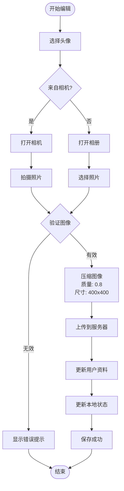

**图表来源**
- [EditProfileScreen.tsx:35-47](file://FreeDressApp/src/screens/EditProfileScreen.tsx#L35-L47)

**章节来源**
- [EditProfileScreen.tsx:27-161](file://FreeDressApp/src/screens/EditProfileScreen.tsx#L27-L161)

### FavoritesScreen收藏夹页

FavoritesScreen展示用户的收藏搭配，提供收藏管理功能：

#### 收藏数据流

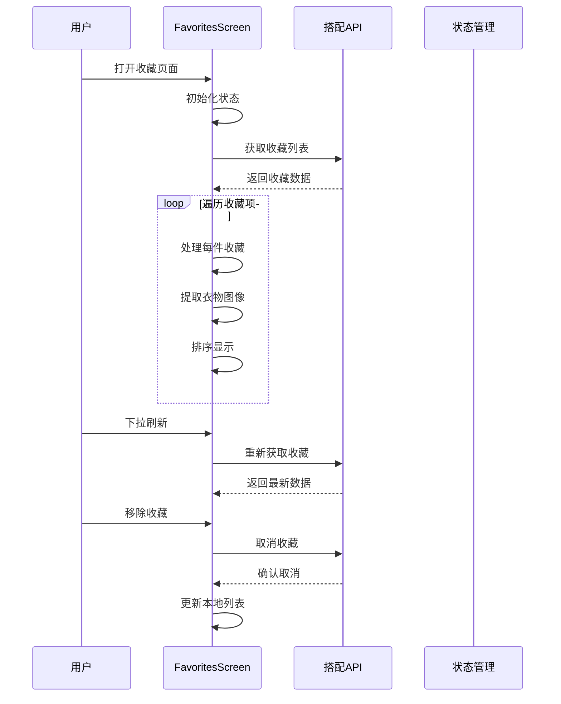

**图表来源**
- [FavoritesScreen.tsx:34-68](file://FreeDressApp/src/screens/FavoritesScreen.tsx#L34-L68)

#### 收藏列表渲染

收藏页面使用FlatList实现高性能列表渲染：

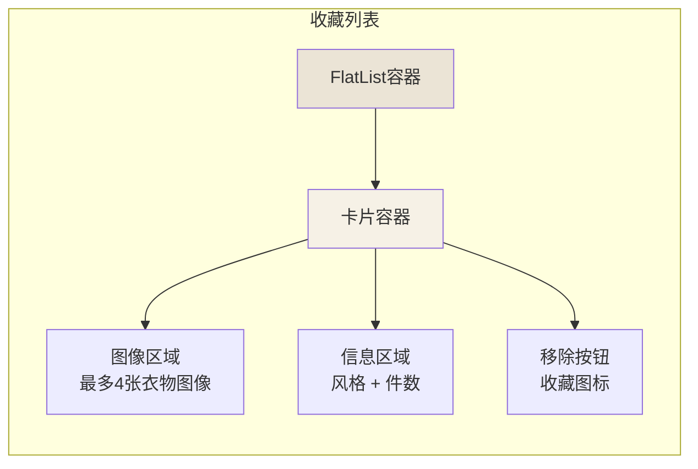

**图表来源**
- [FavoritesScreen.tsx:70-108](file://FreeDressApp/src/screens/FavoritesScreen.tsx#L70-L108)

**章节来源**
- [FavoritesScreen.tsx:34-149](file://FreeDressApp/src/screens/FavoritesScreen.tsx#L34-L149)

### 用户统计功能

个人中心集成了完整的用户使用统计功能：

#### 统计数据结构

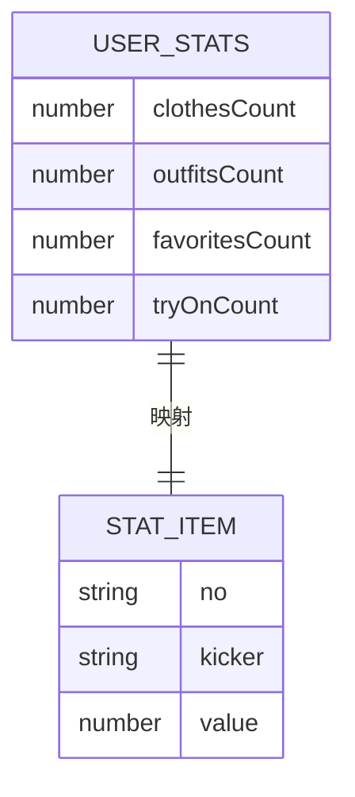

**图表来源**
- [users.ts:12-17](file://FreeDressApp/src/api/users.ts#L12-L17)
- [ProfileScreen.tsx:55-60](file://FreeDressApp/src/screens/ProfileScreen.tsx#L55-L60)

#### 统计更新流程

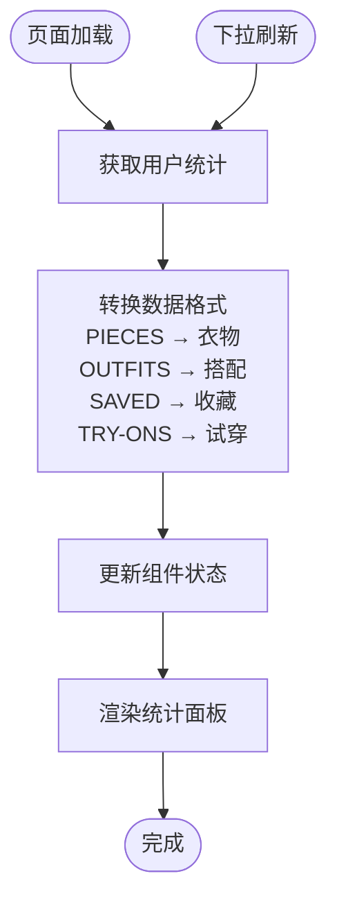

**图表来源**
- [ProfileScreen.tsx:63-86](file://FreeDressApp/src/screens/ProfileScreen.tsx#L63-L86)

**章节来源**
- [users.ts:29-31](file://FreeDressApp/src/api/users.ts#L29-L31)
- [ProfileScreen.tsx:63-86](file://FreeDressApp/src/screens/ProfileScreen.tsx#L63-L86)

## 依赖关系分析

个人中心页面组的依赖关系清晰，遵循单一职责原则：

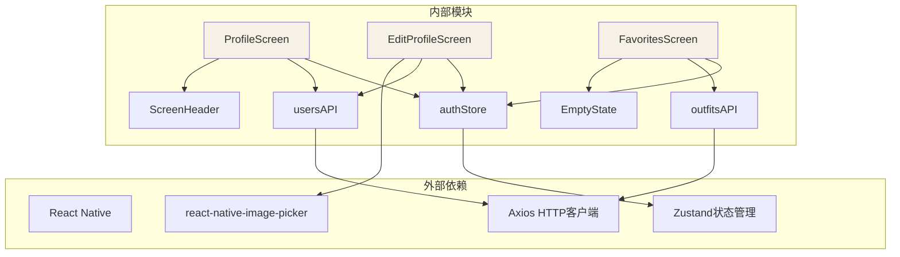

**图表来源**
- [ProfileScreen.tsx:26-27](file://FreeDressApp/src/screens/ProfileScreen.tsx#L26-L27)
- [EditProfileScreen.tsx:24-25](file://FreeDressApp/src/screens/EditProfileScreen.tsx#L24-L25)
- [FavoritesScreen.tsx:24](file://FreeDressApp/src/screens/FavoritesScreen.tsx#L24)

**章节来源**
- [ProfileScreen.tsx:1-409](file://FreeDressApp/src/screens/ProfileScreen.tsx#L1-L409)
- [EditProfileScreen.tsx:1-186](file://FreeDressApp/src/screens/EditProfileScreen.tsx#L1-L186)
- [FavoritesScreen.tsx:1-230](file://FreeDressApp/src/screens/FavoritesScreen.tsx#L1-L230)

## 性能考虑

### 懒加载策略

个人中心页面组采用了多种性能优化策略：

#### 图像懒加载

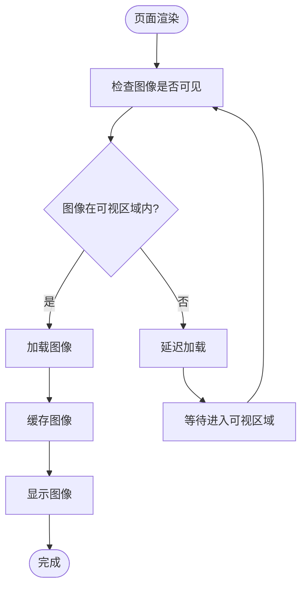

#### 列表虚拟化

收藏页面使用FlatList实现虚拟化渲染，仅渲染可见项：

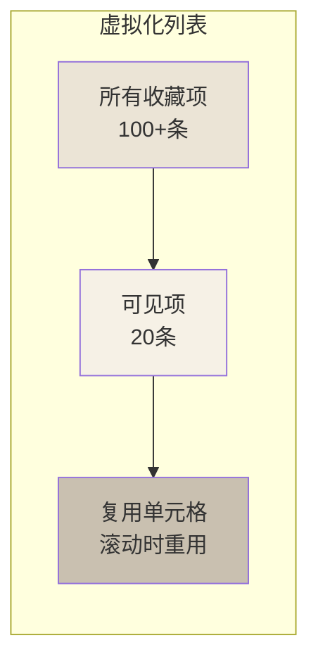

### 状态缓存机制

用户认证信息通过AsyncStorage实现本地持久化：

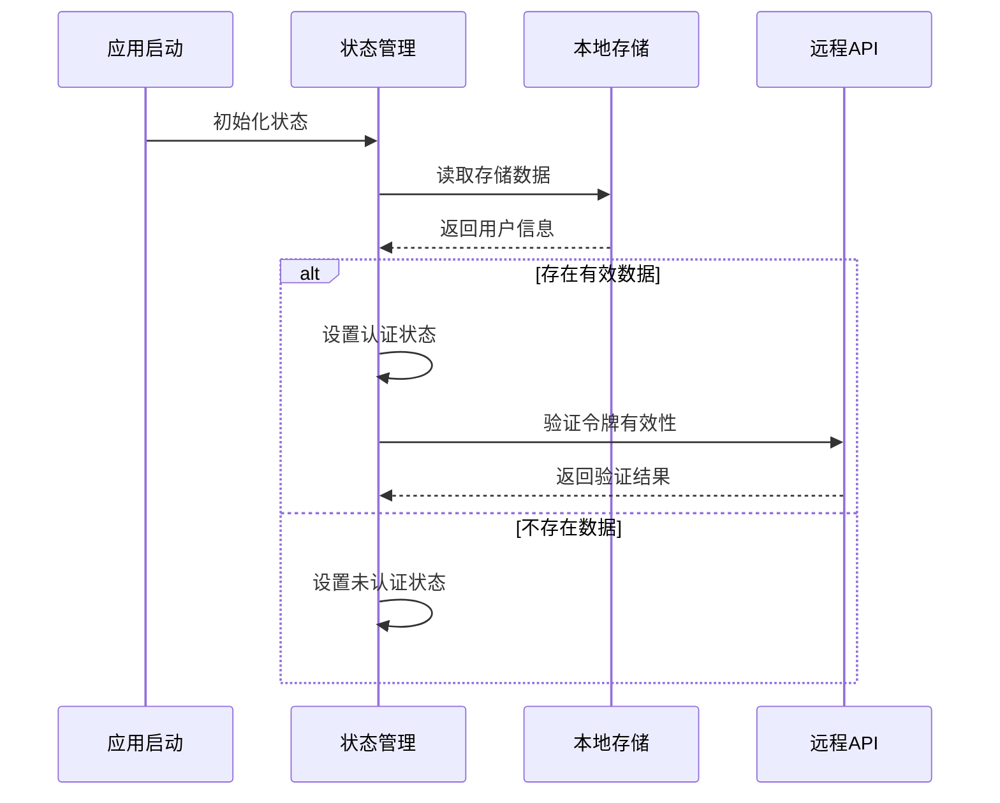

**图表来源**
- [authStore.ts:97-121](file://FreeDressApp/src/store/authStore.ts#L97-L121)

**章节来源**
- [authStore.ts:52-56](file://FreeDressApp/src/store/authStore.ts#L52-L56)
- [authStore.ts:72-77](file://FreeDressApp/src/store/authStore.ts#L72-L77)

## 故障排除指南

### 常见问题及解决方案

#### 登录状态异常

当用户登录状态异常时，可通过以下步骤排查：

1. **检查本地存储**
   - 验证ACCESS_TOKEN和REFRESH_TOKEN是否存在
   - 确认USER_INFO格式正确且可解析

2. **网络请求验证**
   - 检查API端点可达性
   - 验证认证令牌有效性

3. **状态同步**
   - 确保useAuthStore状态与本地存储一致
   - 检查异步操作的错误处理

#### 图像上传失败

图像上传失败的常见原因和解决方法：

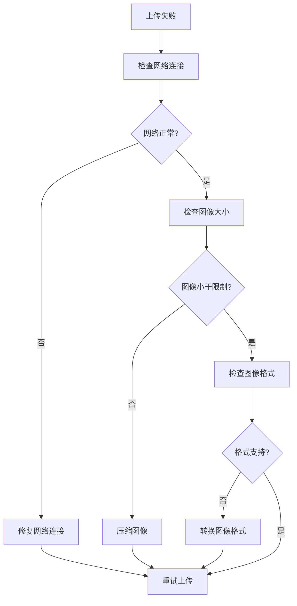

#### 列表数据加载问题

收藏列表数据加载异常的诊断流程：

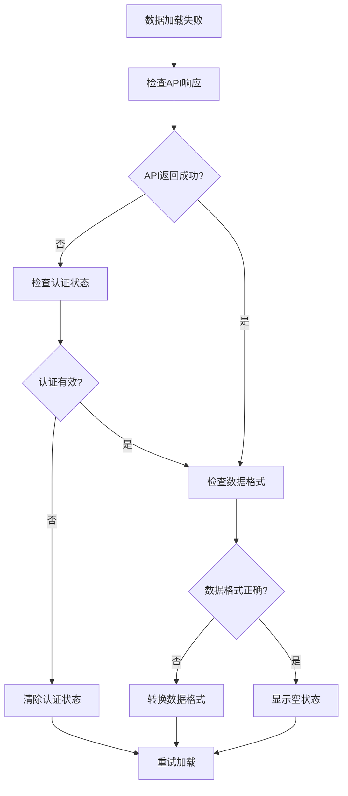

**章节来源**
- [authStore.ts:117-120](file://FreeDressApp/src/store/authStore.ts#L117-L120)
- [EditProfileScreen.tsx:72-76](file://FreeDressApp/src/screens/EditProfileScreen.tsx#L72-L76)
- [FavoritesScreen.tsx:44-48](file://FreeDressApp/src/screens/FavoritesScreen.tsx#L44-L48)

## 结论

畅搭(FreeDress)应用的个人中心页面组展现了现代移动应用开发的最佳实践：

### 设计优势

1. **模块化架构**：清晰的分层设计和职责分离
2. **状态管理**：基于Zustand的轻量级状态管理
3. **性能优化**：虚拟化列表、图像懒加载和本地缓存
4. **用户体验**：完整的错误处理和空状态提示

### 技术亮点

- **TypeScript强类型**：确保代码质量和开发效率
- **React Hooks**：现代化的函数式组件开发
- **响应式设计**：适配不同屏幕尺寸
- **国际化支持**：多语言文本处理

### 改进建议

1. **增加离线支持**：实现更完善的离线数据同步
2. **性能监控**：添加应用性能指标监控
3. **测试覆盖**：提高单元测试和集成测试覆盖率
4. **无障碍访问**：增强屏幕阅读器支持

个人中心页面组为畅搭应用提供了完整的用户账户管理功能，为后续的功能扩展奠定了坚实的技术基础。