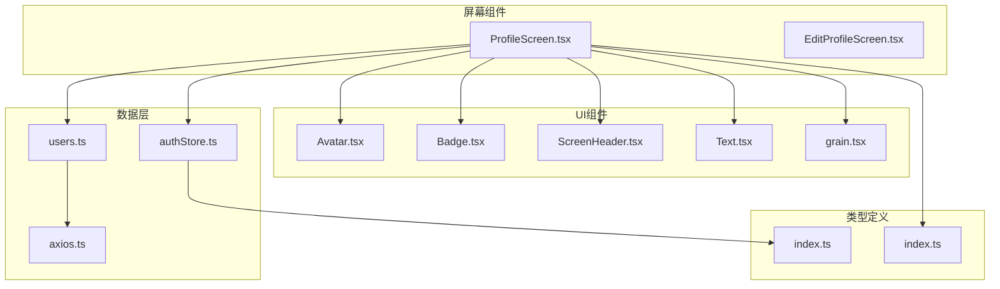
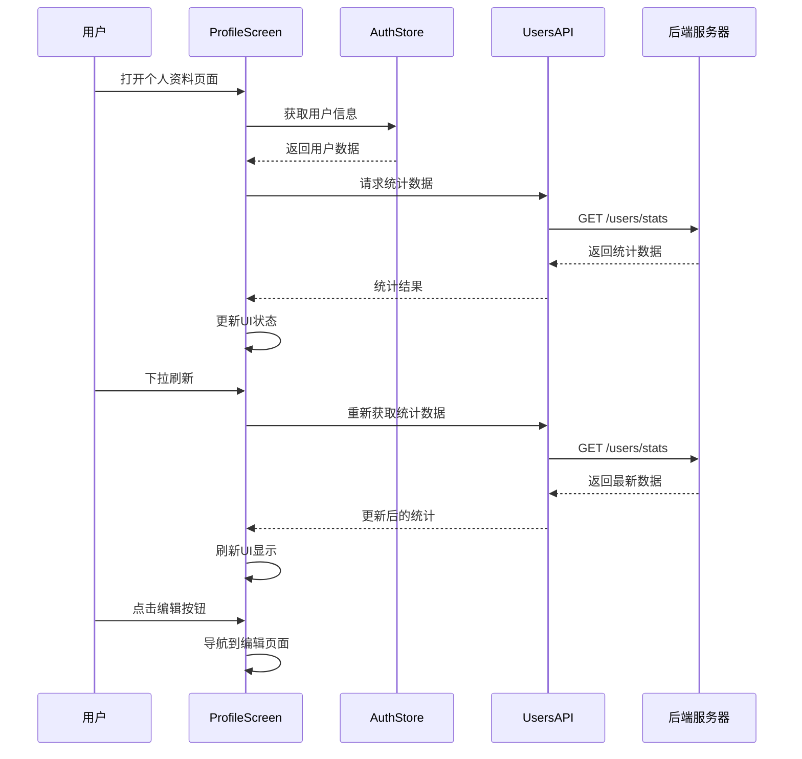
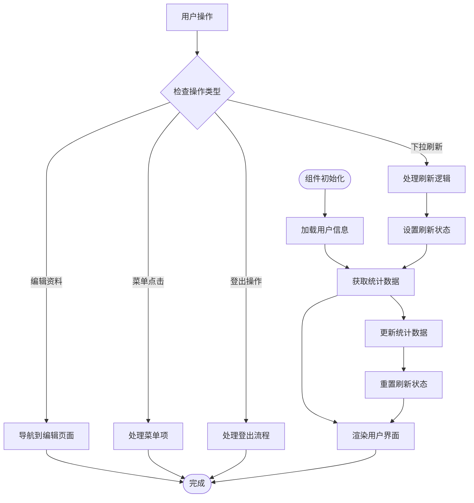
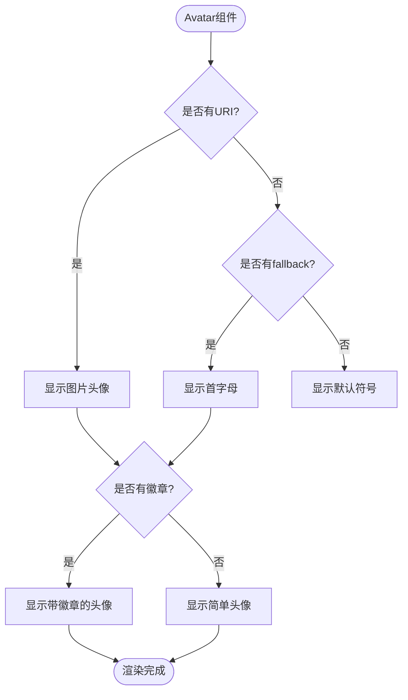
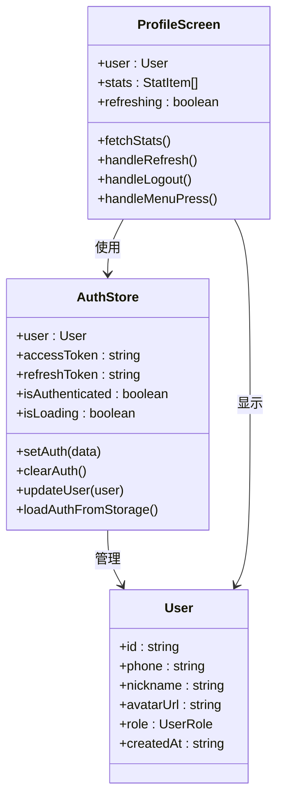
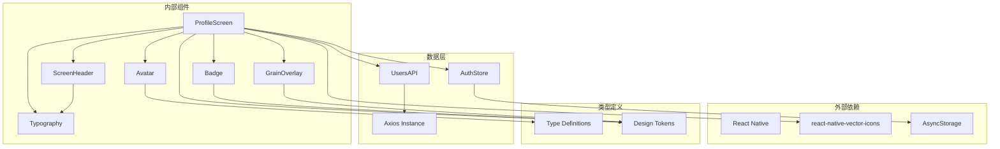
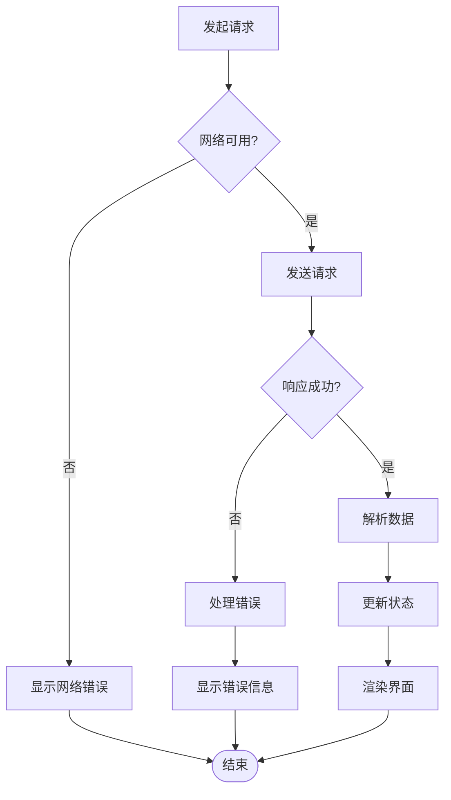

# 个人资料页面

<cite>
**本文档引用的文件**
- [ProfileScreen.tsx](file://FreeDressApp/src/screens/ProfileScreen.tsx)
- [Avatar.tsx](file://FreeDressApp/src/components/Avatar.tsx)
- [users.ts](file://FreeDressApp/src/api/users.ts)
- [authStore.ts](file://FreeDressApp/src/store/authStore.ts)
- [axios.ts](file://FreeDressApp/src/api/axios.ts)
- [ScreenHeader.tsx](file://FreeDressApp/src/components/ScreenHeader.tsx)
- [Badge.tsx](file://FreeDressApp/src/components/Badge.tsx)
- [index.ts](file://FreeDressApp/src/types/index.ts)
- [index.ts](file://FreeDressApp/src/constants/index.ts)
- [MainTabNavigator.tsx](file://FreeDressApp/src/navigation/MainTabNavigator.tsx)
- [EditProfileScreen.tsx](file://FreeDressApp/src/screens/EditProfileScreen.tsx)
- [grain.tsx](file://FreeDressApp/src/theme/grain.tsx)
- [Text.tsx](file://FreeDressApp/src/components/Text.tsx)
</cite>

## 目录
1. [简介](#简介)
2. [项目结构](#项目结构)
3. [核心组件](#核心组件)
4. [架构概览](#架构概览)
5. [详细组件分析](#详细组件分析)
6. [依赖关系分析](#依赖关系分析)
7. [性能考虑](#性能考虑)
8. [故障排除指南](#故障排除指南)
9. [结论](#结论)

## 简介

畅搭(FreeDress)应用的个人资料页面(ProfileScreen)是一个精心设计的用户界面，旨在展示用户的个人档案信息、统计数据和快捷操作菜单。该页面采用杂志风格的设计语言，运用暖灰棕单色调和烧赭色点缀，营造出独特的编辑室氛围。

页面主要功能包括：
- 用户头像展示与VIP标识
- 基本信息展示（昵称、手机号）
- 统计数据显示（衣橱数量、搭配次数、收藏统计、试穿次数）
- 快捷菜单导航
- 用户登出功能

## 项目结构

个人资料页面位于应用的屏幕组件目录中，采用React Native + TypeScript开发，遵循模块化设计原则：



**图表来源**
- [ProfileScreen.tsx:1-409](file://FreeDressApp/src/screens/ProfileScreen.tsx#L1-L409)
- [Avatar.tsx:1-93](file://FreeDressApp/src/components/Avatar.tsx#L1-L93)
- [users.ts:1-32](file://FreeDressApp/src/api/users.ts#L1-L32)

**章节来源**
- [ProfileScreen.tsx:1-409](file://FreeDressApp/src/screens/ProfileScreen.tsx#L1-L409)
- [MainTabNavigator.tsx:1-38](file://FreeDressApp/src/navigation/MainTabNavigator.tsx#L1-L38)

## 核心组件

### 用户卡片(User Card)
用户卡片是页面的核心展示区域，采用深色背景设计，突出用户个人信息：

- **头像区域**: 80x80像素圆形头像，支持VIP徽章显示
- **基本信息**: 昵称和手机号展示，采用不同透明度区分重要程度
- **装饰元素**: 个性化标语和杂志风格的装饰线条

### 统计面板(Statistics Panel)
四象限统计布局，清晰展示用户的核心数据指标：

- **衣橱数量**: 用户拥有的衣物总数
- **搭配次数**: 用户创建的搭配方案数量  
- **收藏统计**: 用户收藏的内容数量
- **试穿次数**: 用户进行虚拟试穿的总次数

### 快捷菜单(Menu List)
垂直排列的功能菜单，提供快速导航到各个功能模块：

- **收藏柜**: 查看用户收藏的衣物
- **搭配历史**: 浏览历史搭配记录
- **试穿记录**: 查看虚拟试穿历史
- **会员中心**: VIP会员专属功能
- **设置**: 应用配置选项
- **帮助与反馈**: 获取帮助和技术支持

**章节来源**
- [ProfileScreen.tsx:52-239](file://FreeDressApp/src/screens/ProfileScreen.tsx#L52-L239)
- [Avatar.tsx:21-71](file://FreeDressApp/src/components/Avatar.tsx#L21-L71)
- [Badge.tsx:23-75](file://FreeDressApp/src/components/Badge.tsx#L23-L75)

## 架构概览

个人资料页面采用分层架构设计，各层职责明确：



**图表来源**
- [ProfileScreen.tsx:63-86](file://FreeDressApp/src/screens/ProfileScreen.tsx#L63-L86)
- [authStore.ts:28-122](file://FreeDressApp/src/store/authStore.ts#L28-L122)
- [users.ts:29-31](file://FreeDressApp/src/api/users.ts#L29-L31)

### 数据流分析

页面的数据流遵循单向数据绑定原则：

1. **初始化阶段**: 组件挂载时自动获取用户统计数据
2. **状态管理**: 使用Zustand状态管理库维护用户认证状态
3. **API通信**: 通过Axios实例进行HTTP请求
4. **响应处理**: 解析后端返回的JSON数据并更新UI

**章节来源**
- [ProfileScreen.tsx:78-86](file://FreeDressApp/src/screens/ProfileScreen.tsx#L78-L86)
- [authStore.ts:28-57](file://FreeDressApp/src/store/authStore.ts#L28-L57)
- [axios.ts:24-38](file://FreeDressApp/src/api/axios.ts#L24-L38)

## 详细组件分析

### ProfileScreen 主组件

ProfileScreen是整个个人资料页面的核心组件，负责协调各个子组件的工作：

#### 状态管理
- **用户状态**: 通过useAuthStore获取当前登录用户信息
- **统计状态**: 管理四象限统计数据的状态
- **刷新状态**: 控制下拉刷新动画和交互

#### 核心功能实现



**图表来源**
- [ProfileScreen.tsx:52-101](file://FreeDressApp/src/screens/ProfileScreen.tsx#L52-L101)
- [ProfileScreen.tsx:82-86](file://FreeDressApp/src/screens/ProfileScreen.tsx#L82-L86)

#### 用户交互设计

页面实现了多种用户交互模式：

- **点击编辑**: 右上角编辑按钮，导航到编辑资料页面
- **下拉刷新**: 支持手动下拉刷新统计数据
- **菜单导航**: 点击菜单项进行页面跳转或提示
- **登出确认**: 二次确认对话框保护用户账户安全

**章节来源**
- [ProfileScreen.tsx:109-117](file://FreeDressApp/src/screens/ProfileScreen.tsx#L109-L117)
- [ProfileScreen.tsx:82-93](file://FreeDressApp/src/screens/ProfileScreen.tsx#L82-L93)
- [ProfileScreen.tsx:95-101](file://FreeDressApp/src/screens/ProfileScreen.tsx#L95-L101)

### Avatar 头像组件

Avatar组件提供了灵活的头像显示能力：

#### 组件特性
- **形状支持**: 圆形和方形两种显示模式
- **尺寸可调**: 支持多种尺寸规格
- **占位符**: 当没有头像URL时显示首字母占位符
- **边框装饰**: 可配置边框颜色和样式
- **徽章系统**: 支持在右下角显示徽章

#### 显示逻辑



**图表来源**
- [Avatar.tsx:21-71](file://FreeDressApp/src/components/Avatar.tsx#L21-L71)

**章节来源**
- [Avatar.tsx:9-19](file://FreeDressApp/src/components/Avatar.tsx#L9-L19)
- [Avatar.tsx:48-68](file://FreeDressApp/src/components/Avatar.tsx#L48-L68)

### 统计数据展示

统计数据采用四象限网格布局，每个单元格包含编号、数值和标签：

#### 数据结构
```typescript
interface StatItem {
  no: string;      // 编号 (01, 02, 03, 04)
  kicker: string;   // 标签 (PIECES, OUTFITS, SAVED, TRY-ONS)
  value: number;    // 数值
}
```

#### 展示逻辑
- **数值格式化**: 使用padStart方法确保两位数显示
- **颜色搭配**: 不同层级使用不同的颜色方案
- **响应式布局**: 根据屏幕宽度自动调整列数

**章节来源**
- [ProfileScreen.tsx:30-41](file://FreeDressApp/src/screens/ProfileScreen.tsx#L30-L41)
- [ProfileScreen.tsx:179-189](file://FreeDressApp/src/screens/ProfileScreen.tsx#L179-L189)

### 用户认证集成

个人资料页面与认证系统的深度集成：



**图表来源**
- [authStore.ts:28-122](file://FreeDressApp/src/store/authStore.ts#L28-L122)
- [ProfileScreen.tsx:54-61](file://FreeDressApp/src/screens/ProfileScreen.tsx#L54-L61)
- [index.ts:9-16](file://FreeDressApp/src/types/index.ts#L9-L16)

**章节来源**
- [authStore.ts:9-22](file://FreeDressApp/src/store/authStore.ts#L9-L22)
- [ProfileScreen.tsx:54-61](file://FreeDressApp/src/screens/ProfileScreen.tsx#L54-L61)

## 依赖关系分析

### 组件依赖图



**图表来源**
- [ProfileScreen.tsx:13-28](file://FreeDressApp/src/screens/ProfileScreen.tsx#L13-L28)
- [authStore.ts:1-5](file://FreeDressApp/src/store/authStore.ts#L1-L5)
- [users.ts:1-3](file://FreeDressApp/src/api/users.ts#L1-L3)

### 数据流依赖

页面的数据流依赖关系清晰明确：

1. **UI层依赖**: ProfileScreen依赖各种UI组件
2. **状态层依赖**: 通过AuthStore管理用户状态
3. **API层依赖**: 通过UsersAPI访问后端服务
4. **工具层依赖**: 通过Axios进行HTTP通信

**章节来源**
- [ProfileScreen.tsx:13-28](file://FreeDressApp/src/screens/ProfileScreen.tsx#L13-L28)
- [users.ts:19-31](file://FreeDressApp/src/api/users.ts#L19-L31)
- [axios.ts:12-18](file://FreeDressApp/src/api/axios.ts#L12-L18)

## 性能考虑

### 数据缓存策略

个人资料页面采用了多层次的数据缓存机制：

#### 本地存储
- **认证信息缓存**: 使用AsyncStorage缓存访问令牌和用户信息
- **自动加载**: 应用启动时自动从本地存储恢复认证状态
- **持久化**: 用户信息变更时同步更新本地存储

#### 状态管理优化
- **状态分离**: 将用户信息和统计数据分离管理
- **状态更新**: 仅在必要时更新相关状态
- **内存管理**: 及时清理不再使用的状态

### 图片优化

头像组件实现了基础的图片优化：

- **尺寸控制**: 通过size属性控制头像显示尺寸
- **占位符机制**: 无图片时显示首字母占位符
- **徽章优化**: 徽章组件使用绝对定位减少重绘

### 网络请求优化

API层实现了智能的请求管理：

- **请求拦截**: 自动添加认证头信息
- **响应拦截**: 统一处理响应数据和错误
- **重试机制**: 对401错误进行token刷新重试

**章节来源**
- [authStore.ts:52-57](file://FreeDressApp/src/store/authStore.ts#L52-L57)
- [axios.ts:24-38](file://FreeDressApp/src/api/axios.ts#L24-L38)
- [Avatar.tsx:48-68](file://FreeDressApp/src/components/Avatar.tsx#L48-L68)

## 故障排除指南

### 常见问题及解决方案

#### 统计数据加载失败
**问题描述**: 页面显示统计数据为0或加载失败
**可能原因**:
- 网络连接异常
- 用户未登录
- 后端服务不可用

**解决步骤**:
1. 检查网络连接状态
2. 确认用户已登录
3. 尝试下拉刷新页面
4. 检查后端服务状态

#### 头像显示异常
**问题描述**: 头像无法正常显示
**可能原因**:
- 头像URL无效
- 网络图片加载失败
- 用户未设置头像

**解决步骤**:
1. 检查头像URL是否有效
2. 确认网络连接正常
3. 使用默认占位符显示
4. 引导用户上传头像

#### 登出功能异常
**问题描述**: 登出操作无法正常执行
**可能原因**:
- 认证状态异常
- 本地存储损坏
- 异步操作冲突

**解决步骤**:
1. 检查认证状态
2. 清理本地存储
3. 重新初始化状态
4. 重启应用

### 错误处理机制

页面实现了完善的错误处理机制：



**图表来源**
- [ProfileScreen.tsx:73-76](file://FreeDressApp/src/screens/ProfileScreen.tsx#L73-L76)
- [axios.ts:49-104](file://FreeDressApp/src/api/axios.ts#L49-L104)

**章节来源**
- [ProfileScreen.tsx:73-76](file://FreeDressApp/src/screens/ProfileScreen.tsx#L73-L76)
- [axios.ts:49-104](file://FreeDressApp/src/api/axios.ts#L49-L104)

## 结论

畅搭(FreeDress)应用的个人资料页面展现了现代移动应用设计的最佳实践。通过精心设计的UI组件、高效的架构模式和完善的用户体验，该页面成功地为用户提供了直观、便捷的个人资料管理功能。

### 设计亮点

1. **视觉一致性**: 采用统一的杂志风格设计语言，营造专业氛围
2. **功能完整性**: 集成了用户信息展示、统计数据、快捷导航等核心功能
3. **交互友好**: 提供了丰富的用户交互模式和反馈机制
4. **性能优化**: 实现了多层次的缓存和优化策略

### 技术优势

1. **架构清晰**: 采用分层架构，职责分离明确
2. **状态管理**: 使用Zustand实现高效的状态管理
3. **API集成**: 通过Axios实现可靠的API通信
4. **类型安全**: 完整的TypeScript类型定义保证代码质量

### 改进建议

1. **加载状态**: 可以添加骨架屏或加载指示器提升用户体验
2. **错误处理**: 增加更详细的错误提示和重试机制
3. **性能监控**: 添加性能指标监控和分析
4. **离线支持**: 考虑实现部分功能的离线支持

个人资料页面作为畅搭应用的重要组成部分，为用户提供了完整的个人档案管理和数据展示功能，是应用用户体验设计的优秀范例。