# 收藏页面

<cite>
**本文档引用的文件**
- [FavoritesScreen.tsx](file://FreeDressApp/src/screens/FavoritesScreen.tsx)
- [outfits.ts](file://FreeDressApp/src/api/outfits.ts)
- [axios.ts](file://FreeDressApp/src/api/axios.ts)
- [index.ts](file://FreeDressApp/src/types/index.ts)
- [index.ts](file://FreeDressApp/src/constants/index.ts)
- [EmptyState.tsx](file://FreeDressApp/src/components/EmptyState.tsx)
- [Skeleton.tsx](file://FreeDressApp/src/components/Skeleton.tsx)
- [IconButton.tsx](file://FreeDressApp/src/components/IconButton.tsx)
- [RootNavigator.tsx](file://FreeDressApp/src/navigation/RootNavigator.tsx)
- [MainTabNavigator.tsx](file://FreeDressApp/src/navigation/MainTabNavigator.tsx)
- [WardrobeStack.tsx](file://FreeDressApp/src/navigation/WardrobeStack.tsx)
</cite>

## 目录
1. [简介](#简介)
2. [项目结构](#项目结构)
3. [核心组件](#核心组件)
4. [架构概览](#架构概览)
5. [详细组件分析](#详细组件分析)
6. [依赖关系分析](#依赖关系分析)
7. [性能考虑](#性能考虑)
8. [故障排除指南](#故障排除指南)
9. [结论](#结论)

## 简介

畅搭(FreeDress)应用的收藏页面是一个专门用于展示用户收藏搭配的核心功能模块。该页面实现了完整的收藏管理功能，包括收藏物品的展示、分类管理、批量操作以及用户交互体验优化。

收藏页面采用现代化的React Native技术栈构建，结合了TypeScript类型安全、Zustand状态管理、Reanimated动画库等先进技术。页面设计遵循极简主义美学，使用暖灰棕单色调系，营造出高级时装杂志般的视觉体验。

## 项目结构

收藏页面在整体项目架构中的位置如下：

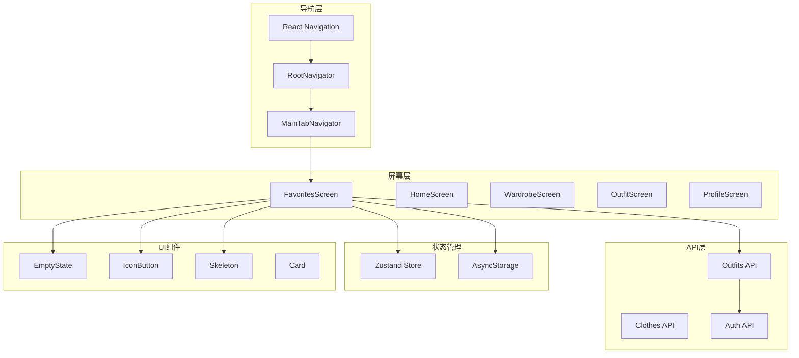

**图表来源**
- [RootNavigator.tsx:1-85](file://FreeDressApp/src/navigation/RootNavigator.tsx#L1-L85)
- [MainTabNavigator.tsx:1-38](file://FreeDressApp/src/navigation/MainTabNavigator.tsx#L1-L38)
- [FavoritesScreen.tsx:1-230](file://FreeDressApp/src/screens/FavoritesScreen.tsx#L1-L230)

**章节来源**
- [RootNavigator.tsx:1-85](file://FreeDressApp/src/navigation/RootNavigator.tsx#L1-L85)
- [MainTabNavigator.tsx:1-38](file://FreeDressApp/src/navigation/MainTabNavigator.tsx#L1-L38)
- [WardrobeStack.tsx:1-21](file://FreeDressApp/src/navigation/WardrobeStack.tsx#L1-L21)

## 核心组件

### 收藏页面主组件

收藏页面的核心是`FavoritesScreen`组件，它负责整个收藏功能的实现。该组件采用了函数式编程模式，使用React Hooks进行状态管理。

主要特性包括：
- **数据获取**：通过`getFavorites` API获取用户收藏的搭配
- **实时更新**：支持下拉刷新功能
- **交互设计**：提供取消收藏的便捷操作
- **空状态处理**：友好的空收藏提示界面

### API集成层

收藏功能通过专门的API模块与后端服务通信：

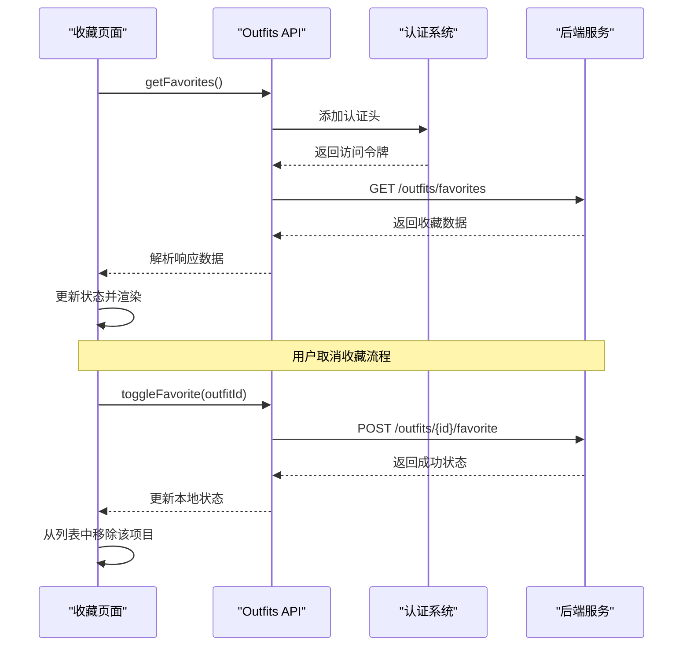

**图表来源**
- [FavoritesScreen.tsx:34-68](file://FreeDressApp/src/screens/FavoritesScreen.tsx#L34-L68)
- [outfits.ts:33-39](file://FreeDressApp/src/api/outfits.ts#L33-L39)
- [axios.ts:24-38](file://FreeDressApp/src/api/axios.ts#L24-L38)

**章节来源**
- [FavoritesScreen.tsx:1-230](file://FreeDressApp/src/screens/FavoritesScreen.tsx#L1-L230)
- [outfits.ts:1-40](file://FreeDressApp/src/api/outfits.ts#L1-L40)

## 架构概览

收藏页面采用分层架构设计，确保了良好的可维护性和扩展性：

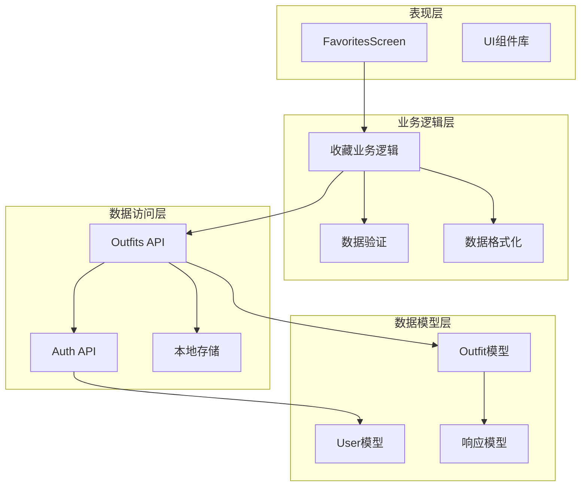

**图表来源**
- [FavoritesScreen.tsx:1-230](file://FreeDressApp/src/screens/FavoritesScreen.tsx#L1-L230)
- [outfits.ts:1-40](file://FreeDressApp/src/api/outfits.ts#L1-L40)
- [index.ts:1-98](file://FreeDressApp/src/types/index.ts#L1-L98)

### 数据流架构

收藏页面的数据流遵循单向数据流原则：

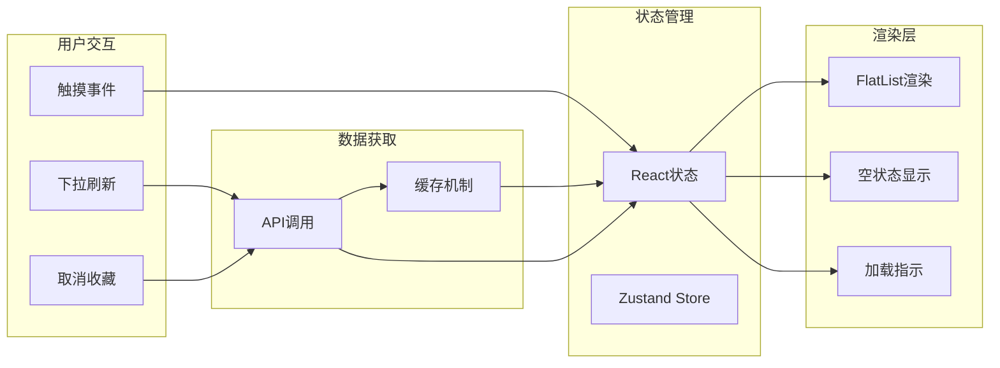

**图表来源**
- [FavoritesScreen.tsx:34-149](file://FreeDressApp/src/screens/FavoritesScreen.tsx#L34-L149)
- [axios.ts:1-108](file://FreeDressApp/src/api/axios.ts#L1-L108)

## 详细组件分析

### FavoritesScreen 组件分析

#### 组件结构

`FavoritesScreen`是一个高度模块化的组件，包含了完整的收藏管理功能：

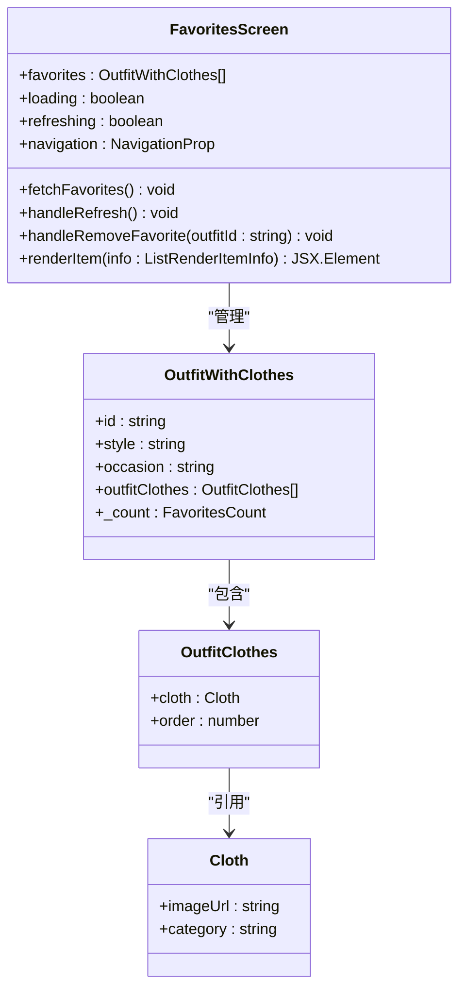

**图表来源**
- [FavoritesScreen.tsx:26-32](file://FreeDressApp/src/screens/FavoritesScreen.tsx#L26-L32)
- [index.ts:35-46](file://FreeDressApp/src/types/index.ts#L35-L46)

#### 数据获取与状态管理

组件使用React Hooks进行状态管理，实现了高效的状态更新机制：

| 状态属性 | 类型 | 用途 | 生命周期 |
|---------|------|------|----------|
| favorites | OutfitWithClothes[] | 收藏的搭配列表 | 组件挂载时初始化 |
| loading | boolean | 加载状态指示 | API调用期间设置 |
| refreshing | boolean | 刷新状态指示 | 下拉刷新期间设置 |

#### 渲染逻辑

收藏页面采用高效的FlatList组件进行列表渲染：

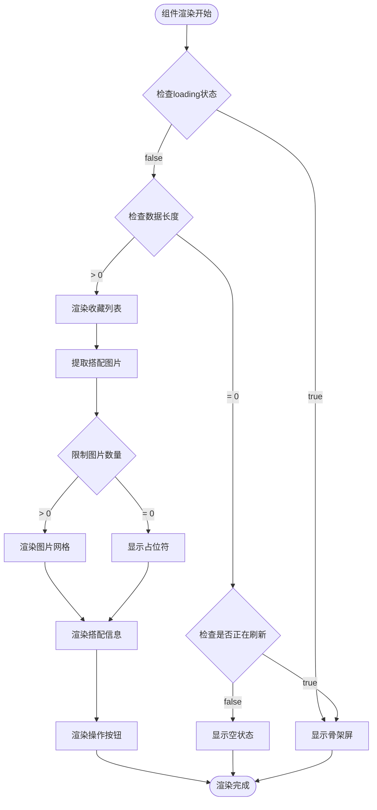

**图表来源**
- [FavoritesScreen.tsx:70-108](file://FreeDressApp/src/screens/FavoritesScreen.tsx#L70-L108)

**章节来源**
- [FavoritesScreen.tsx:1-230](file://FreeDressApp/src/screens/FavoritesScreen.tsx#L1-L230)

### API集成分析

#### Outfits API模块

收藏功能通过专门的API模块与后端服务通信，提供了完整的CRUD操作：

| 方法 | URL | 功能 | 参数 | 返回值 |
|------|-----|------|------|--------|
| getFavorites | GET /outfits/favorites | 获取收藏列表 | 无 | OutfitWithClothes[] |
| toggleFavorite | POST /outfits/{id}/favorite | 切换收藏状态 | outfitId: string | { favorited: boolean } |
| getOutfits | GET /outfits | 获取所有搭配 | 无 | OutfitWithClothes[] |
| getOutfit | GET /outfits/{id} | 获取指定搭配 | id: string | OutfitWithClothes |

#### 认证与授权

API调用通过Axios实例进行统一管理，实现了自动认证和错误处理：

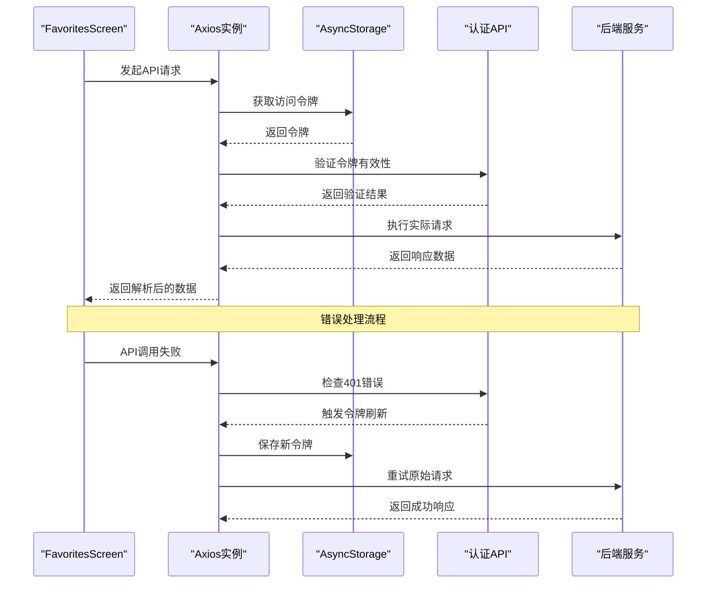

**图表来源**
- [axios.ts:24-105](file://FreeDressApp/src/api/axios.ts#L24-L105)
- [outfits.ts:33-39](file://FreeDressApp/src/api/outfits.ts#L33-L39)

**章节来源**
- [outfits.ts:1-40](file://FreeDressApp/src/api/outfits.ts#L1-L40)
- [axios.ts:1-108](file://FreeDressApp/src/api/axios.ts#L1-L108)

### UI组件集成

#### EmptyState 组件

收藏页面实现了专门的空状态组件，提供友好的用户体验：

| 属性 | 类型 | 默认值 | 描述 |
|------|------|--------|------|
| iconName | string | 'bookmark' | 显示的图标名称 |
| kicker | string | 'NOTHING HERE — YET' | 顶部标签文本 |
| title | string | 必需 | 主要标题文本 |
| subtitle | string | undefined | 副标题文本 |
| actionLabel | string | undefined | 操作按钮标签 |
| onAction | () => void | undefined | 操作回调函数 |

#### Skeleton 组件

为了提升用户体验，收藏页面集成了骨架屏组件，在数据加载期间提供视觉反馈：

| 属性 | 类型 | 默认值 | 描述 |
|------|------|--------|------|
| width | number \| string | '100%' | 骨架屏宽度 |
| height | number | 16 | 骨架屏高度 |
| borderRadius | number | RADIUS.sm | 圆角半径 |
| style | ViewStyle | undefined | 自定义样式 |

**章节来源**
- [EmptyState.tsx:1-102](file://FreeDressApp/src/components/EmptyState.tsx#L1-L102)
- [Skeleton.tsx:1-63](file://FreeDressApp/src/components/Skeleton.tsx#L1-L63)

## 依赖关系分析

### 外部依赖

收藏页面依赖以下关键外部库：

```mermaid
graph LR
subgraph "React Native生态"
RN[React Native]
RNVector[react-native-vector-icons]
Reanimated[react-native-reanimated]
Axios[Axios]
AsyncStorage[@react-native-async-storage]
end
subgraph "导航系统"
Navigation[@react-navigation/native]
StackNavigator[@react-navigation/native-stack]
end
subgraph "状态管理"
Zustand[zustand]
end
FavoritesScreen --> RN
FavoritesScreen --> RNVector
FavoritesScreen --> Reanimated
FavoritesScreen --> Axios
FavoritesScreen --> AsyncStorage
FavoritesScreen --> Navigation
FavoritesScreen --> StackNavigator
FavoritesScreen --> Zustand
```

**图表来源**
- [FavoritesScreen.tsx:1-230](file://FreeDressApp/src/screens/FavoritesScreen.tsx#L1-L230)
- [axios.ts:1-108](file://FreeDressApp/src/api/axios.ts#L1-L108)

### 内部依赖关系

收藏页面与其他组件的依赖关系如下：

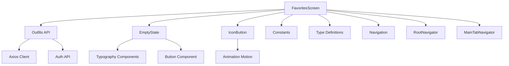

**图表来源**
- [FavoritesScreen.tsx:1-230](file://FreeDressApp/src/screens/FavoritesScreen.tsx#L1-L230)
- [EmptyState.tsx:1-102](file://FreeDressApp/src/components/EmptyState.tsx#L1-L102)
- [IconButton.tsx:1-126](file://FreeDressApp/src/components/IconButton.tsx#L1-L126)

**章节来源**
- [FavoritesScreen.tsx:1-230](file://FreeDressApp/src/screens/FavoritesScreen.tsx#L1-L230)
- [index.ts:1-212](file://FreeDressApp/src/constants/index.ts#L1-L212)

## 性能考虑

### 虚拟列表优化

收藏页面使用FlatList组件实现高性能列表渲染：

| 优化特性 | 实现方式 | 性能收益 |
|----------|----------|----------|
| 滚动性能 | FlatList原生滚动 | 减少重绘次数 |
| 内存管理 | 按需渲染可见项 | 降低内存占用 |
| 图片优化 | 懒加载机制 | 提升首屏速度 |
| 列表更新 | keyExtractor优化 | 减少不必要的重渲染 |

### 图片加载策略

收藏页面实现了智能的图片加载策略：

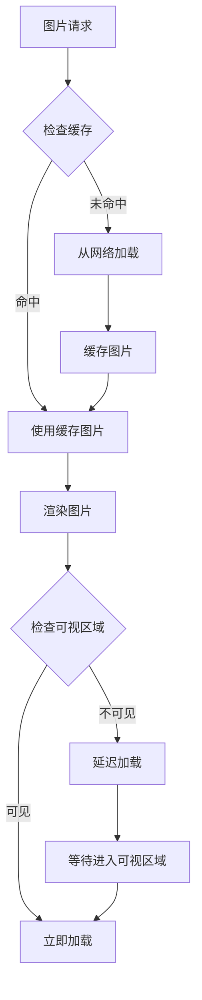

**图表来源**
- [FavoritesScreen.tsx:70-108](file://FreeDressApp/src/screens/FavoritesScreen.tsx#L70-L108)

### 状态管理优化

收藏页面采用React状态管理，配合useCallback优化：

| 优化策略 | 实现细节 | 效果 |
|----------|----------|------|
| 状态分离 | 将loading和refreshing分离 | 减少无关状态更新 |
| 回调优化 | useCallback包装异步函数 | 避免不必要的重渲染 |
| 数据结构 | 使用扁平化数据结构 | 提升查找效率 |
| 错误边界 | 统一的错误处理机制 | 提升稳定性 |

### 内存管理

收藏页面实现了完善的内存管理策略：

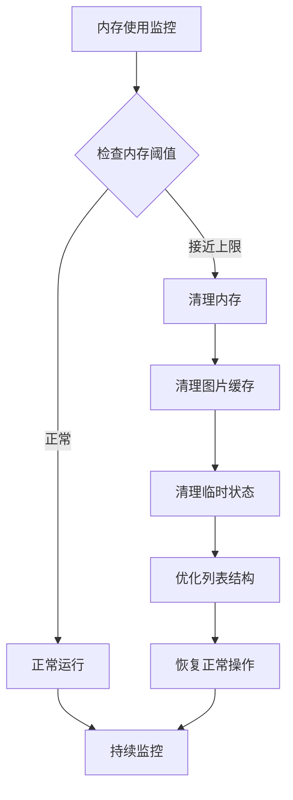

**章节来源**
- [FavoritesScreen.tsx:34-68](file://FreeDressApp/src/screens/FavoritesScreen.tsx#L34-L68)

## 故障排除指南

### 常见问题及解决方案

#### API调用失败

当收藏API调用失败时，系统会自动尝试令牌刷新：

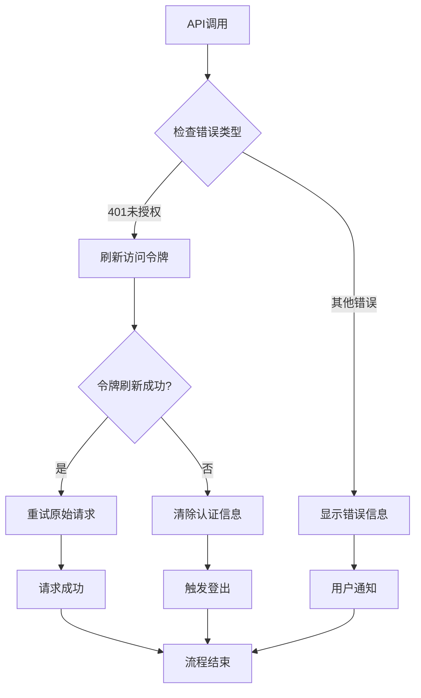

**图表来源**
- [axios.ts:44-105](file://FreeDressApp/src/api/axios.ts#L44-L105)

#### 网络连接问题

收藏页面实现了完善的网络状态检测和处理机制：

| 错误类型 | 检测方法 | 处理策略 |
|----------|----------|----------|
| 网络超时 | 设置超时时间 | 显示重试按钮 |
| 连接失败 | 检查网络状态 | 提供离线模式 |
| 服务器错误 | 监控HTTP状态码 | 显示错误详情 |
| 数据解析错误 | 验证响应格式 | 降级处理方案 |

#### 性能问题诊断

收藏页面提供了多种性能监控和诊断工具：

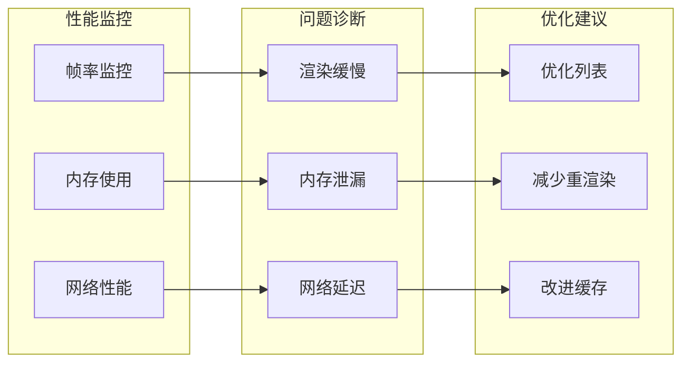

**章节来源**
- [axios.ts:1-108](file://FreeDressApp/src/api/axios.ts#L1-L108)
- [FavoritesScreen.tsx:40-68](file://FreeDressApp/src/screens/FavoritesScreen.tsx#L40-L68)

### 用户体验优化

#### 加载状态处理

收藏页面提供了多层次的加载状态反馈：

| 状态类型 | 视觉反馈 | 用户提示 |
|----------|----------|----------|
| 初始加载 | 骨架屏动画 | "正在加载收藏..." |
| 刷新中 | 下拉刷新指示器 | "更新中..." |
| 空状态 | 空状态图标 | "暂无收藏内容" |
| 错误状态 | 错误提示卡片 | "加载失败，请重试" |

#### 交互反馈

收藏页面实现了丰富的交互反馈机制：

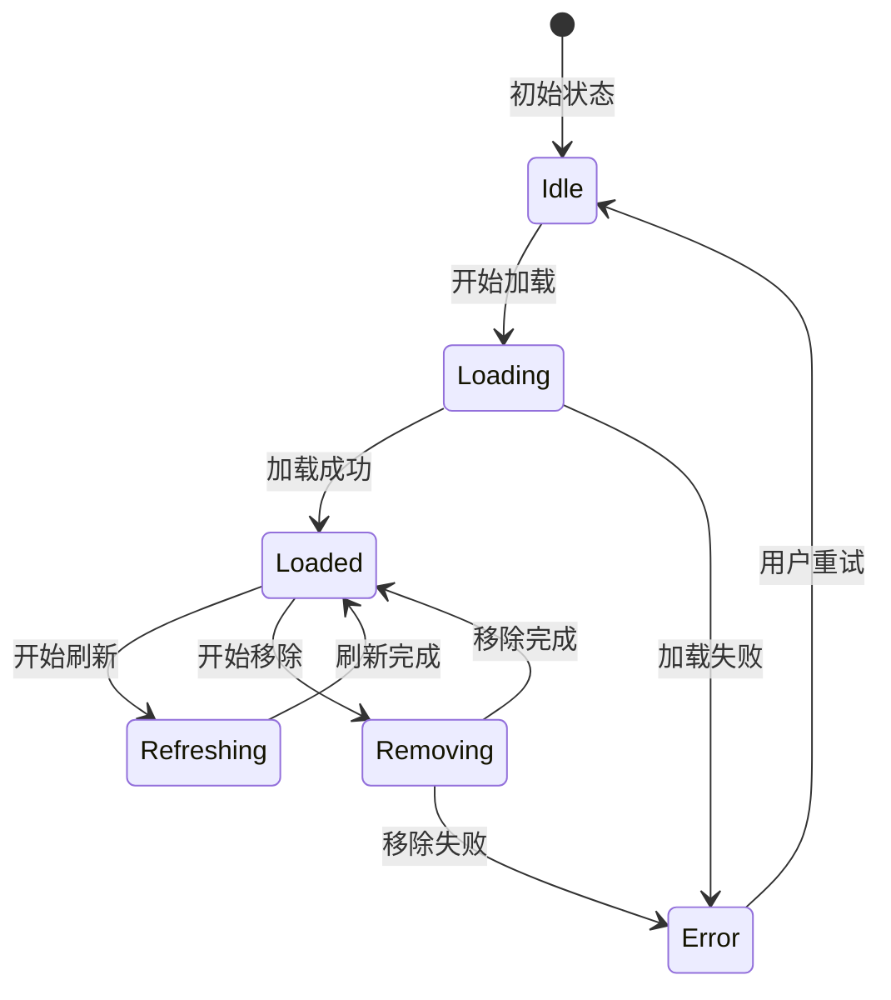

**章节来源**
- [FavoritesScreen.tsx:123-149](file://FreeDressApp/src/screens/FavoritesScreen.tsx#L123-L149)
- [EmptyState.tsx:1-102](file://FreeDressApp/src/components/EmptyState.tsx#L1-L102)

## 结论

畅搭(FreeDress)应用的收藏页面是一个设计精良、功能完整的用户界面模块。通过采用现代React Native开发技术和最佳实践，该页面实现了优秀的用户体验和性能表现。

### 主要成就

1. **架构设计**：采用分层架构，职责清晰，易于维护和扩展
2. **性能优化**：实现了虚拟列表、图片懒加载、内存管理等多重优化
3. **用户体验**：提供了丰富的交互反馈和错误处理机制
4. **技术选型**：合理选择技术栈，平衡了功能需求和开发效率

### 技术亮点

- **状态管理**：使用React Hooks实现高效的状态管理
- **API集成**：通过Axios实现统一的API调用和错误处理
- **UI组件**：集成多种专用UI组件，提升开发效率
- **性能监控**：内置性能监控和诊断工具

### 改进建议

1. **离线支持**：可以考虑实现更完善的离线数据同步机制
2. **数据缓存**：优化本地数据缓存策略，提升离线体验
3. **性能监控**：增加更详细的性能指标收集和分析
4. **测试覆盖**：完善单元测试和集成测试体系

收藏页面展现了现代移动应用开发的最佳实践，为用户提供了流畅、直观的收藏管理体验，是React Native应用开发的优秀范例。