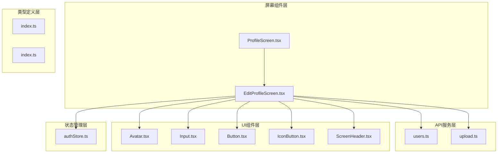
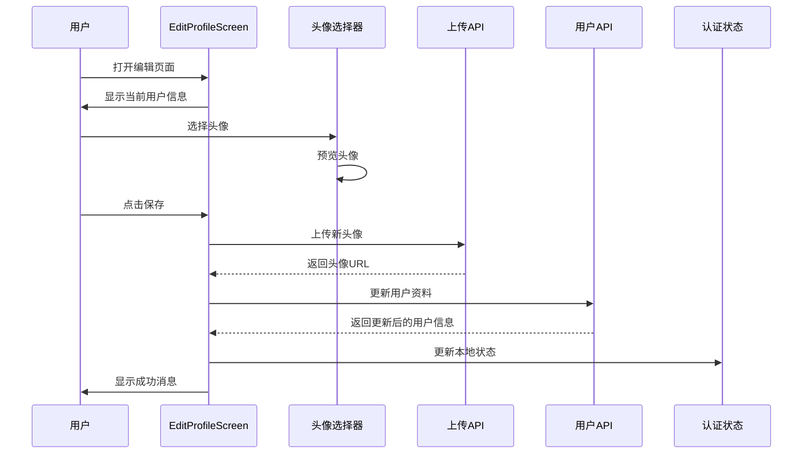
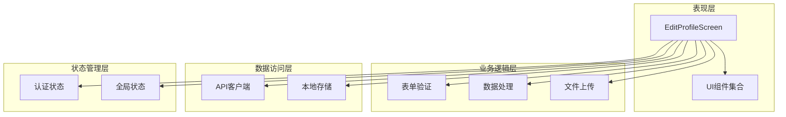
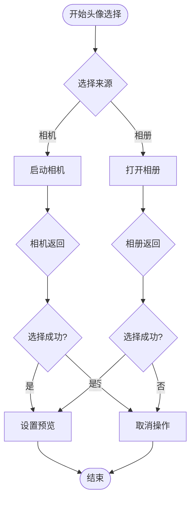
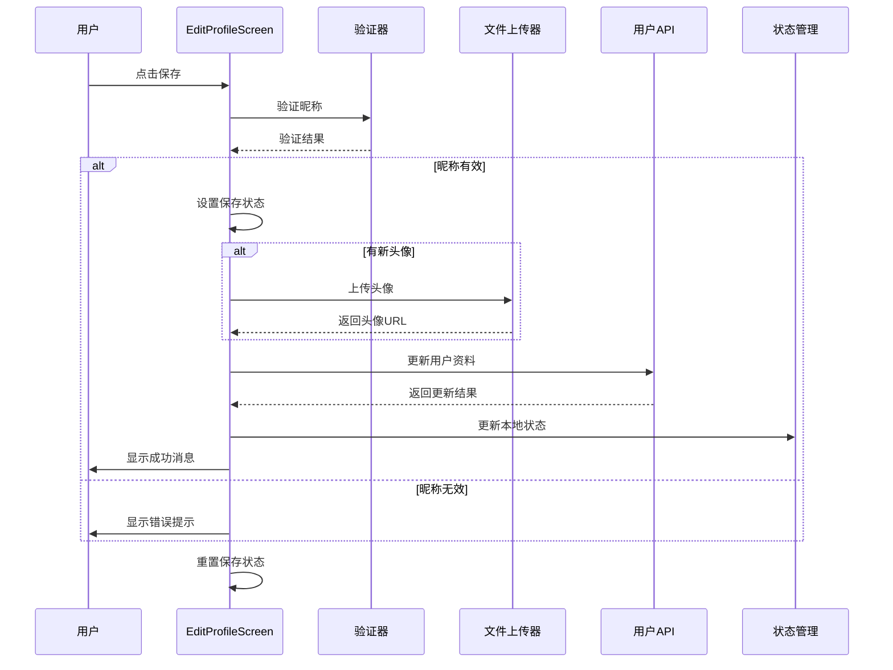
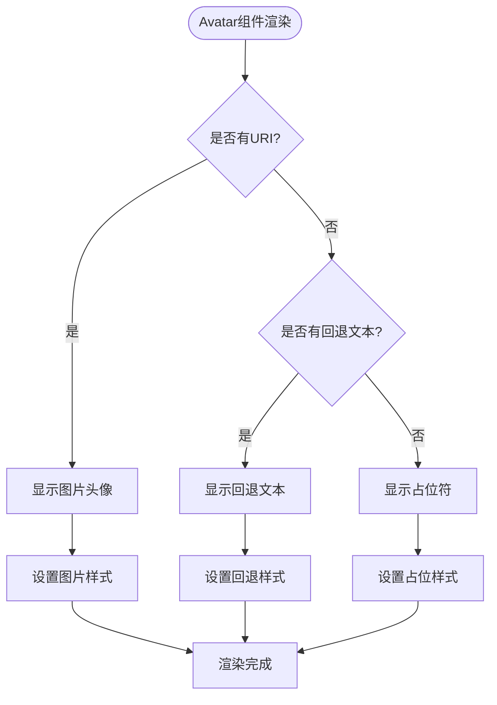
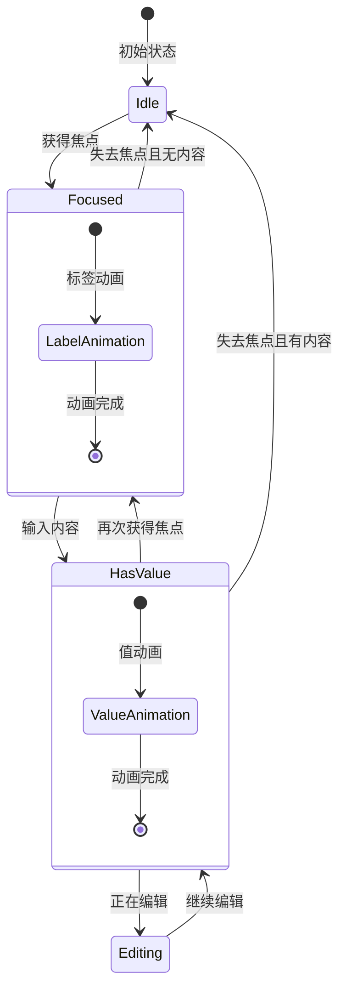
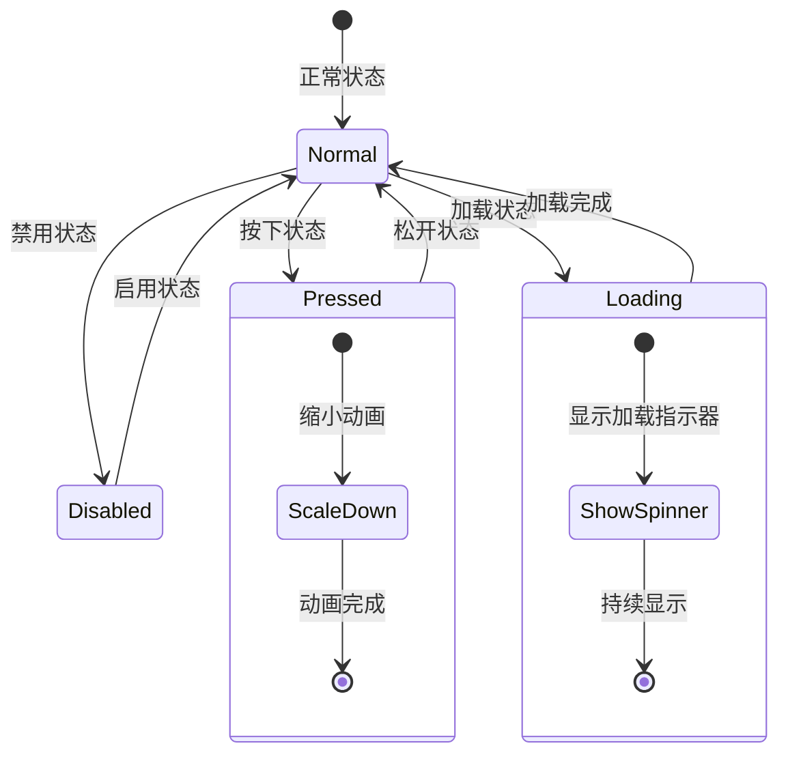
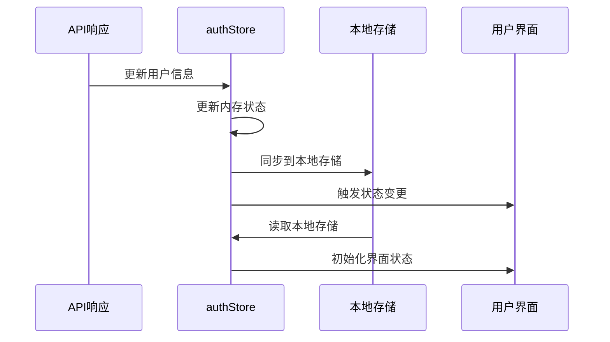

# 编辑资料页面

<cite>
**本文档引用的文件**
- [EditProfileScreen.tsx](file://FreeDressApp/src/screens/EditProfileScreen.tsx)
- [users.ts](file://FreeDressApp/src/api/users.ts)
- [upload.ts](file://FreeDressApp/src/api/upload.ts)
- [Avatar.tsx](file://FreeDressApp/src/components/Avatar.tsx)
- [Input.tsx](file://FreeDressApp/src/components/Input.tsx)
- [Button.tsx](file://FreeDressApp/src/components/Button.tsx)
- [IconButton.tsx](file://FreeDressApp/src/components/IconButton.tsx)
- [ScreenHeader.tsx](file://FreeDressApp/src/components/ScreenHeader.tsx)
- [authStore.ts](file://FreeDressApp/src/store/authStore.ts)
- [index.ts](file://FreeDressApp/src/types/index.ts)
- [index.ts](file://FreeDressApp/src/constants/index.ts)
- [ProfileScreen.tsx](file://FreeDressApp/src/screens/ProfileScreen.tsx)
</cite>

## 目录
1. [简介](#简介)
2. [项目结构](#项目结构)
3. [核心组件](#核心组件)
4. [架构概览](#架构概览)
5. [详细组件分析](#详细组件分析)
6. [依赖关系分析](#依赖关系分析)
7. [性能考虑](#性能考虑)
8. [故障排除指南](#故障排除指南)
9. [结论](#结论)

## 简介

编辑资料页面是畅搭(FreeDress)应用中的关键功能模块，允许用户修改个人资料信息。该页面实现了完整的用户资料编辑功能，包括头像更换、基本信息编辑和密码修改等核心功能。本文档将深入分析EditProfileScreen的设计和实现，涵盖表单设计、验证逻辑、数据更新流程、文件上传功能以及用户体验优化等方面。

## 项目结构

编辑资料页面位于React Native应用的屏幕组件目录中，采用模块化的架构设计：



**图表来源**
- [EditProfileScreen.tsx:1-186](file://FreeDressApp/src/screens/EditProfileScreen.tsx#L1-L186)
- [users.ts:1-32](file://FreeDressApp/src/api/users.ts#L1-L32)
- [upload.ts:1-21](file://FreeDressApp/src/api/upload.ts#L1-L21)

**章节来源**
- [EditProfileScreen.tsx:1-186](file://FreeDressApp/src/screens/EditProfileScreen.tsx#L1-L186)
- [ProfileScreen.tsx:1-409](file://FreeDressApp/src/screens/ProfileScreen.tsx#L1-L409)

## 核心组件

编辑资料页面由多个精心设计的组件构成，每个组件都有明确的职责和功能：

### 主要功能特性

1. **头像管理系统**：支持拍照和相册选择，实时预览和上传
2. **基本信息编辑**：昵称编辑和手机号只读显示
3. **数据持久化**：本地存储和服务器同步
4. **错误处理**：完善的异常捕获和用户反馈
5. **加载状态**：异步操作的可视化反馈

### 组件交互流程



**图表来源**
- [EditProfileScreen.tsx:49-77](file://FreeDressApp/src/screens/EditProfileScreen.tsx#L49-L77)
- [upload.ts:4-20](file://FreeDressApp/src/api/upload.ts#L4-L20)
- [users.ts:23-27](file://FreeDressApp/src/api/users.ts#L23-L27)

**章节来源**
- [EditProfileScreen.tsx:27-77](file://FreeDressApp/src/screens/EditProfileScreen.tsx#L27-L77)

## 架构概览

编辑资料页面采用了清晰的分层架构，确保了代码的可维护性和扩展性：



**图表来源**
- [EditProfileScreen.tsx:14-25](file://FreeDressApp/src/screens/EditProfileScreen.tsx#L14-L25)
- [authStore.ts:28-92](file://FreeDressApp/src/store/authStore.ts#L28-L92)

## 详细组件分析

### EditProfileScreen 主组件

EditProfileScreen是整个编辑资料页面的核心组件，负责协调所有子组件和业务逻辑。

#### 组件状态管理

组件使用React状态钩子管理关键状态：
- `nickname`: 用户昵称，支持双向绑定
- `avatarUri`: 临时头像URI，用于预览
- `saving`: 保存状态，控制加载指示器

#### 头像选择功能



**图表来源**
- [EditProfileScreen.tsx:35-47](file://FreeDressApp/src/screens/EditProfileScreen.tsx#L35-L47)

#### 数据保存流程



**图表来源**
- [EditProfileScreen.tsx:49-77](file://FreeDressApp/src/screens/EditProfileScreen.tsx#L49-L77)
- [users.ts:23-27](file://FreeDressApp/src/api/users.ts#L23-L27)
- [upload.ts:4-20](file://FreeDressApp/src/api/upload.ts#L4-L20)

**章节来源**
- [EditProfileScreen.tsx:27-162](file://FreeDressApp/src/screens/EditProfileScreen.tsx#L27-L162)

### 头像组件 Avatar

Avatar组件提供了灵活的头像显示功能，支持多种形状和样式配置。

#### 头像显示逻辑



**图表来源**
- [Avatar.tsx:48-68](file://FreeDressApp/src/components/Avatar.tsx#L48-L68)

#### 组件属性配置

| 属性名 | 类型 | 默认值 | 描述 |
|--------|------|--------|------|
| uri | string | undefined | 头像图片URI |
| size | number | 64 | 头像尺寸 |
| fallback | string | undefined | 回退显示文本 |
| shape | 'circle' \| 'square' | 'circle' | 形状类型 |
| borderColor | string | COLORS.mistGray | 边框颜色 |
| bg | string | COLORS.cream | 背景色 |
| stamp | React.ReactNode | undefined | 徽标组件 |

**章节来源**
- [Avatar.tsx:9-71](file://FreeDressApp/src/components/Avatar.tsx#L9-L71)

### 输入组件 Input

Input组件提供了多种样式的输入框，支持浮动标签和错误状态显示。

#### 输入验证机制



**图表来源**
- [Input.tsx:49-59](file://FreeDressApp/src/components/Input.tsx#L49-L59)

#### 样式变体系统

| 变体名称 | 特征 | 适用场景 |
|----------|------|----------|
| underline | 单线下划线 | 杂志风格首选，简洁优雅 |
| outline | 外边框 | 需要突出显示的输入框 |
| filled | 填充背景 | 需要强调的表单区域 |

**章节来源**
- [Input.tsx:21-140](file://FreeDressApp/src/components/Input.tsx#L21-L140)

### 按钮组件 Button

Button组件提供了丰富的按钮样式和交互效果，支持多种变体和颜色方案。

#### 按钮交互状态



**图表来源**
- [Button.tsx:64-78](file://FreeDressApp/src/components/Button.tsx#L64-L78)

**章节来源**
- [Button.tsx:29-133](file://FreeDressApp/src/components/Button.tsx#L29-L133)

### 认证状态管理

authStore提供了全局的状态管理，确保用户信息的一致性和持久化。

#### 状态同步机制



**图表来源**
- [authStore.ts:83-92](file://FreeDressApp/src/store/authStore.ts#L83-L92)

**章节来源**
- [authStore.ts:28-92](file://FreeDressApp/src/store/authStore.ts#L28-L92)

## 依赖关系分析

编辑资料页面的依赖关系体现了清晰的模块化设计：

```mermaid
graph LR
subgraph "外部依赖"
RN[React Native]
ImagePicker[react-native-image-picker]
AsyncStorage[@react-native-async-storage]
Zustand[zustand]
end
subgraph "内部模块"
EditProfile[EditProfileScreen]
Components[UI组件库]
API[API服务层]
Store[状态管理]
Types[类型定义]
Constants[设计常量]
end
EditProfile --> Components
EditProfile --> API
EditProfile --> Store
EditProfile --> Types
EditProfile --> Constants
Components --> RN
API --> RN
Store --> RN
Store --> Zutand
API --> ImagePicker
Store --> AsyncStorage
```

**图表来源**
- [EditProfileScreen.tsx:10-25](file://FreeDressApp/src/screens/EditProfileScreen.tsx#L10-L25)
- [authStore.ts:1-5](file://FreeDressApp/src/store/authStore.ts#L1-L5)

### 关键依赖关系

1. **图像选择依赖**: 使用react-native-image-picker进行媒体选择
2. **状态管理依赖**: 使用zustand进行轻量级状态管理
3. **本地存储依赖**: 使用@react-native-async-storage进行数据持久化
4. **API通信依赖**: 通过axios客户端进行HTTP请求

**章节来源**
- [EditProfileScreen.tsx:12-25](file://FreeDressApp/src/screens/EditProfileScreen.tsx#L12-L25)
- [authStore.ts:1-5](file://FreeDressApp/src/store/authStore.ts#L1-L5)

## 性能考虑

编辑资料页面在设计时充分考虑了性能优化：

### 渲染优化策略

1. **条件渲染**: 头像徽标仅在VIP用户时显示
2. **懒加载**: 头像图片按需加载
3. **状态最小化**: 仅在必要时更新组件状态

### 网络请求优化

1. **请求合并**: 头像上传和用户资料更新分离，避免不必要的网络请求
2. **缓存策略**: 本地存储用户信息，减少重复请求
3. **错误重试**: 自动处理网络异常情况

### 内存管理

1. **资源清理**: 及时释放图像资源
2. **状态清理**: 在组件卸载时清理相关状态
3. **存储优化**: 合理使用AsyncStorage，避免存储过多数据

## 故障排除指南

### 常见问题及解决方案

#### 头像上传失败

**问题描述**: 用户选择头像后无法上传

**可能原因**:
1. 网络连接异常
2. 文件格式不支持
3. 服务器端限制

**解决步骤**:
1. 检查网络连接状态
2. 确认文件格式为支持的图片格式
3. 验证服务器可用性
4. 查看控制台错误日志

#### 用户资料更新失败

**问题描述**: 保存修改后用户信息未更新

**可能原因**:
1. API请求失败
2. 认证状态过期
3. 本地存储同步问题

**解决步骤**:
1. 重新登录验证身份
2. 检查API响应状态码
3. 清除本地存储后重启应用
4. 验证用户权限

#### 表单验证错误

**问题描述**: 输入验证不生效或显示错误

**可能原因**:
1. 验证规则配置错误
2. 状态更新时机问题
3. UI组件状态不同步

**解决步骤**:
1. 检查验证函数实现
2. 确认状态更新逻辑
3. 验证组件生命周期
4. 查看控制台警告信息

**章节来源**
- [EditProfileScreen.tsx:49-77](file://FreeDressApp/src/screens/EditProfileScreen.tsx#L49-L77)

## 结论

编辑资料页面展现了现代React Native应用的最佳实践，具有以下特点：

### 设计优势

1. **模块化架构**: 清晰的组件分离和职责划分
2. **用户体验**: 完善的交互反馈和错误处理
3. **性能优化**: 合理的状态管理和资源控制
4. **可维护性**: 标准化的代码结构和命名约定

### 技术亮点

1. **状态管理**: 使用zustand实现轻量级状态管理
2. **文件处理**: 集成react-native-image-picker进行媒体选择
3. **类型安全**: 完整的TypeScript类型定义
4. **设计系统**: 统一的颜色、字体和间距规范

### 改进建议

1. **增强验证**: 添加更多输入验证规则
2. **国际化支持**: 考虑多语言环境适配
3. **无障碍访问**: 提升无障碍功能支持
4. **测试覆盖**: 增加单元测试和集成测试

该编辑资料页面为畅搭应用提供了稳定可靠的用户资料管理功能，为后续的功能扩展奠定了良好的基础。