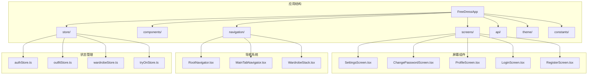
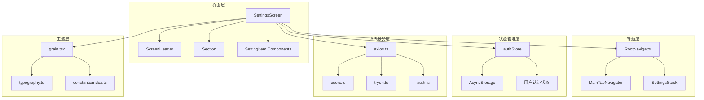
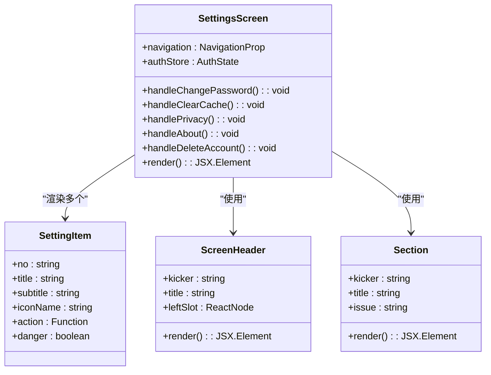
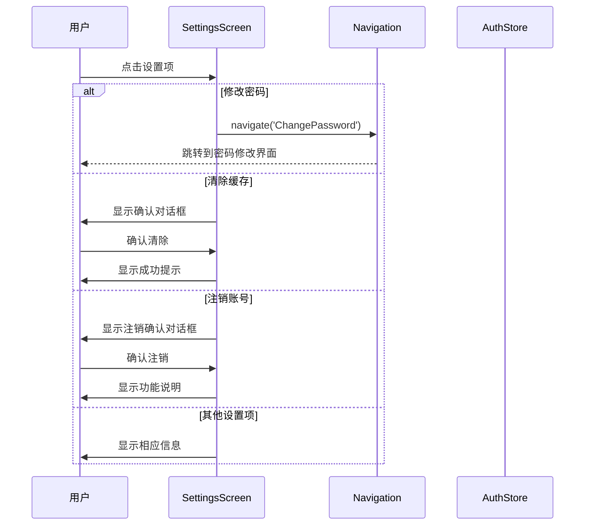
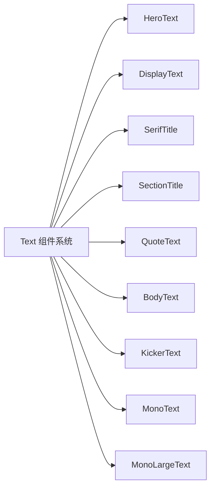
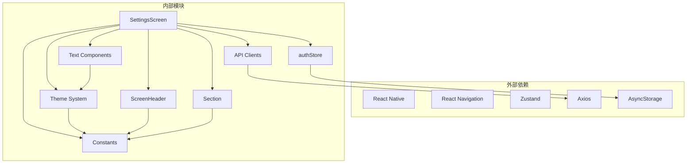

# 设置界面

<cite>
**本文档引用的文件**
- [SettingsScreen.tsx](file://FreeDressApp/src/screens/SettingsScreen.tsx)
- [ScreenHeader.tsx](file://FreeDressApp/src/components/ScreenHeader.tsx)
- [Section.tsx](file://FreeDressApp/src/components/Section.tsx)
- [Text.tsx](file://FreeDressApp/src/components/Text.tsx)
- [index.ts](file://FreeDressApp/src/components/index.ts)
- [authStore.ts](file://FreeDressApp/src/store/authStore.ts)
- [RootNavigator.tsx](file://FreeDressApp/src/navigation/RootNavigator.tsx)
- [MainTabNavigator.tsx](file://FreeDressApp/src/navigation/MainTabNavigator.tsx)
- [WardrobeStack.tsx](file://FreeDressApp/src/navigation/WardrobeStack.tsx)
- [ChangePasswordScreen.tsx](file://FreeDressApp/src/screens/ChangePasswordScreen.tsx)
- [ProfileScreen.tsx](file://FreeDressApp/src/screens/ProfileScreen.tsx)
- [index.ts](file://FreeDressApp/src/constants/index.ts)
- [grain.tsx](file://FreeDressApp/src/theme/grain.tsx)
- [typography.ts](file://FreeDressApp/src/theme/typography.ts)
- [axios.ts](file://FreeDressApp/src/api/axios.ts)
- [users.ts](file://FreeDressApp/src/api/users.ts)
- [tryon.ts](file://FreeDressApp/src/api/tryon.ts)
</cite>

## 目录
1. [简介](#简介)
2. [项目结构](#项目结构)
3. [核心组件](#核心组件)
4. [架构概览](#架构概览)
5. [详细组件分析](#详细组件分析)
6. [依赖关系分析](#依赖关系分析)
7. [性能考虑](#性能考虑)
8. [故障排除指南](#故障排除指南)
9. [结论](#结论)

## 简介

设置界面是FreeDress应用中的重要功能模块，为用户提供账户管理和系统配置的统一入口。该界面采用杂志风格的设计语言，结合现代化的React Native技术栈，提供了直观易用的设置体验。

设置界面主要包含以下核心功能：
- 修改密码功能
- 清除缓存功能  
- 隐私政策查看
- 关于应用信息
- 账号注销功能

界面设计遵循Editorial Couture的设计理念，采用暖灰棕单色调配色方案，营造出专业而舒适的用户体验。

## 项目结构

FreeDress应用采用模块化的项目结构，设置界面位于屏幕组件目录中，与其他功能模块并列组织：



**图表来源**
- [SettingsScreen.tsx:1-183](file://FreeDressApp/src/screens/SettingsScreen.tsx#L1-L183)
- [RootNavigator.tsx:1-103](file://FreeDressApp/src/navigation/RootNavigator.tsx#L1-L103)
- [authStore.ts:1-123](file://FreeDressApp/src/store/authStore.ts#L1-L123)

**章节来源**
- [SettingsScreen.tsx:1-183](file://FreeDressApp/src/screens/SettingsScreen.tsx#L1-L183)
- [RootNavigator.tsx:1-103](file://FreeDressApp/src/navigation/RootNavigator.tsx#L1-L103)

## 核心组件

设置界面的核心组件包括自定义UI组件库和状态管理模块。这些组件共同构成了完整的设置功能体系。

### 设置项数据结构

设置界面使用统一的数据结构来描述各个设置项：

```typescript
interface SettingItem {
  no: string;           // 编号标识
  title: string;        // 显示标题
  subtitle?: string;    // 副标题说明
  iconName: string;     // 图标名称
  action: () => void;   // 点击回调函数
  danger?: boolean;     // 是否为危险操作
}
```

### 主要设置项功能

设置界面包含以下五个核心设置项：

| 编号 | 设置项 | 功能描述 | 安全级别 |
|------|--------|----------|----------|
| 01 | 修改密码 | 支持用户更改账户密码 | 低 |
| 02 | 清除缓存 | 清理本地存储空间 | 低 |
| 03 | 隐私政策 | 查看应用隐私保护条款 | 低 |
| 04 | 关于畅搭 | 显示应用版本和介绍信息 | 低 |
| 05 | 注销账号 | 删除用户账户数据 | 高 |

**章节来源**
- [SettingsScreen.tsx:24-91](file://FreeDressApp/src/screens/SettingsScreen.tsx#L24-L91)
- [SettingsScreen.tsx:85-91](file://FreeDressApp/src/screens/SettingsScreen.tsx#L85-L91)

## 架构概览

设置界面采用分层架构设计，通过导航系统、状态管理和API服务实现功能解耦：



**图表来源**
- [SettingsScreen.tsx:33-137](file://FreeDressApp/src/screens/SettingsScreen.tsx#L33-L137)
- [RootNavigator.tsx:45-93](file://FreeDressApp/src/navigation/RootNavigator.tsx#L45-L93)
- [authStore.ts:28-78](file://FreeDressApp/src/store/authStore.ts#L28-L78)

## 详细组件分析

### SettingsScreen 组件

SettingsScreen是设置界面的核心组件，负责渲染所有设置项并处理用户交互。

#### 组件结构分析



**图表来源**
- [SettingsScreen.tsx:33-137](file://FreeDressApp/src/screens/SettingsScreen.tsx#L33-L137)
- [ScreenHeader.tsx:29-63](file://FreeDressApp/src/components/ScreenHeader.tsx#L29-L63)
- [Section.tsx:22-42](file://FreeDressApp/src/components/Section.tsx#L22-L42)

#### 设置项交互流程



**图表来源**
- [SettingsScreen.tsx:37-83](file://FreeDressApp/src/screens/SettingsScreen.tsx#L37-L83)
- [authStore.ts:62-78](file://FreeDressApp/src/store/authStore.ts#L62-L78)

**章节来源**
- [SettingsScreen.tsx:33-137](file://FreeDressApp/src/screens/SettingsScreen.tsx#L33-L137)
- [SettingsScreen.tsx:85-91](file://FreeDressApp/src/screens/SettingsScreen.tsx#L85-L91)

### ScreenHeader 组件

ScreenHeader提供统一的页面头部样式，支持左侧返回按钮、右侧操作区域和标题展示。

#### 设计特性

- **安全区域适配**：自动适配iOS安全区域
- **灵活布局**：支持左右槽位插槽
- **紧凑模式**：可选择紧凑或标准间距
- **分隔线**：可选的底部分隔线

**章节来源**
- [ScreenHeader.tsx:29-63](file://FreeDressApp/src/components/ScreenHeader.tsx#L29-L63)

### Section 组件

Section组件用于创建杂志风格的分区标题，提供清晰的内容分组。

#### 组件属性

| 属性名 | 类型 | 必填 | 描述 |
|--------|------|------|------|
| kicker | string | 否 | 英文小标题 |
| title | string | 否 | 中文主标题 |
| issue | string | 否 | 期号标识 |
| divider | boolean | 否 | 是否显示分隔线 |
| style | ViewStyle | 否 | 自定义样式 |

**章节来源**
- [Section.tsx:22-42](file://FreeDressApp/src/components/Section.tsx#L22-L42)

### 文本组件系统

文本组件系统提供多种预定义的排版样式，确保界面的一致性和可读性。

#### 文本组件类型



**图表来源**
- [Text.tsx:28-67](file://FreeDressApp/src/components/Text.tsx#L28-L67)
- [typography.ts:8-115](file://FreeDressApp/src/theme/typography.ts#L8-L115)

**章节来源**
- [Text.tsx:28-67](file://FreeDressApp/src/components/Text.tsx#L28-L67)
- [typography.ts:8-115](file://FreeDressApp/src/theme/typography.ts#L8-L115)

### 状态管理集成

设置界面与全局状态管理系统深度集成，特别是认证状态的管理。

#### 认证状态管理

```mermaid
flowchart TD
A[authStore] --> B{用户认证状态}
B --> |已认证| C[允许访问设置功能]
B --> |未认证| D[重定向到登录页面]
C --> E[clearAuth方法]
E --> F[清除本地存储]
E --> G[重置认证状态]
E --> H[触发登出流程]
F --> I[AsyncStorage.multiRemove]
G --> J[set({user: null, ...})]
```

**图表来源**
- [authStore.ts:28-78](file://FreeDressApp/src/store/authStore.ts#L28-L78)

**章节来源**
- [authStore.ts:28-78](file://FreeDressApp/src/store/authStore.ts#L28-L78)

## 依赖关系分析

设置界面的依赖关系体现了清晰的分层架构和模块化设计原则。



**图表来源**
- [SettingsScreen.tsx:1-22](file://FreeDressApp/src/screens/SettingsScreen.tsx#L1-L22)
- [authStore.ts:1-5](file://FreeDressApp/src/store/authStore.ts#L1-L5)

### 核心依赖关系

| 模块 | 依赖模块 | 用途 |
|------|----------|------|
| SettingsScreen | ScreenHeader, Section | 界面布局 |
| SettingsScreen | authStore | 认证状态管理 |
| SettingsScreen | axios | API通信 |
| ScreenHeader | constants | 设计令牌 |
| Section | constants | 设计令牌 |
| Text Components | typography | 排版样式 |
| authStore | AsyncStorage | 本地存储 |

**章节来源**
- [SettingsScreen.tsx:1-22](file://FreeDressApp/src/screens/SettingsScreen.tsx#L1-L22)
- [authStore.ts:1-5](file://FreeDressApp/src/store/authStore.ts#L1-L5)

## 性能考虑

设置界面在设计时充分考虑了性能优化，采用了多种策略来提升用户体验：

### 渲染优化

- **组件懒加载**：设置项按需渲染，减少初始渲染负担
- **样式缓存**：使用StyleSheet.create缓存样式对象
- **列表优化**：使用FlatList替代ScrollView进行大量数据渲染

### 网络优化

- **请求缓存**：合理利用HTTP缓存机制
- **并发请求**：批量处理多个API请求
- **错误重试**：实现智能的请求重试机制

### 内存管理

- **状态清理**：及时清理不再使用的状态
- **资源释放**：正确释放定时器和监听器
- **图片优化**：使用适当的图片尺寸和格式

## 故障排除指南

### 常见问题及解决方案

#### 设置界面无法显示

**问题症状**：设置界面空白或显示异常

**可能原因**：
1. 导航配置错误
2. 组件导入路径问题
3. 样式冲突

**解决步骤**：
1. 检查导航器配置
2. 验证组件导入路径
3. 清理样式缓存

#### 认证状态异常

**问题症状**：登录状态显示错误

**可能原因**：
1. 本地存储损坏
2. Token过期
3. 网络请求失败

**解决步骤**：
1. 清除本地存储数据
2. 重新登录
3. 检查网络连接

#### API请求失败

**问题症状**：设置项点击无响应

**可能原因**：
1. 服务器不可达
2. 认证令牌无效
3. 网络超时

**解决步骤**：
1. 检查网络连接
2. 验证认证状态
3. 查看服务器日志

**章节来源**
- [authStore.ts:97-121](file://FreeDressApp/src/store/authStore.ts#L97-L121)
- [axios.ts:44-105](file://FreeDressApp/src/api/axios.ts#L44-L105)

## 结论

设置界面作为FreeDress应用的重要组成部分，展现了现代移动应用开发的最佳实践。通过模块化的设计、清晰的分层架构和完善的错误处理机制，实现了功能完整、性能优良的用户体验。

### 设计亮点

1. **一致性**：统一的设计语言和交互模式
2. **可扩展性**：模块化的组件设计便于功能扩展
3. **可靠性**：完善的错误处理和状态管理
4. **性能**：优化的渲染和网络请求策略

### 技术优势

- 采用TypeScript提供类型安全保障
- 使用Zustand实现轻量级状态管理
- 集成Axios提供强大的网络通信能力
- 遵循React Native最佳实践

设置界面不仅满足了当前的功能需求，还为未来的功能扩展奠定了坚实的基础。其设计哲学体现了"少即是多"的极简主义理念，在保持功能完整性的同时，最大化地简化了用户的操作流程。