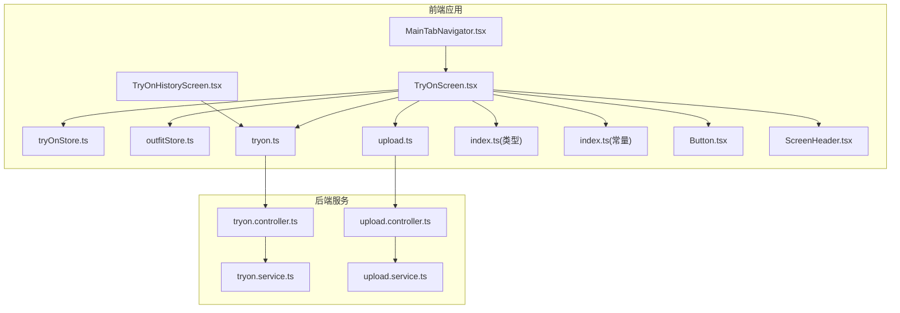
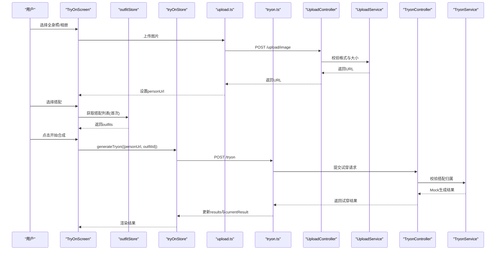
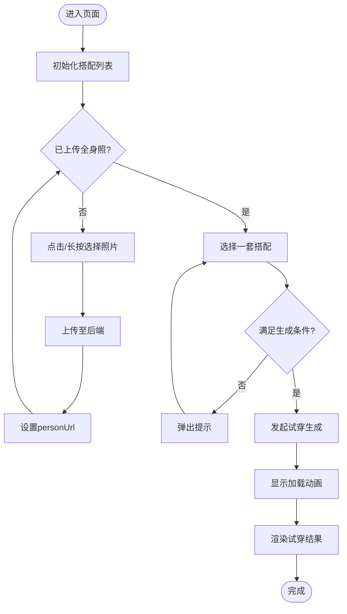
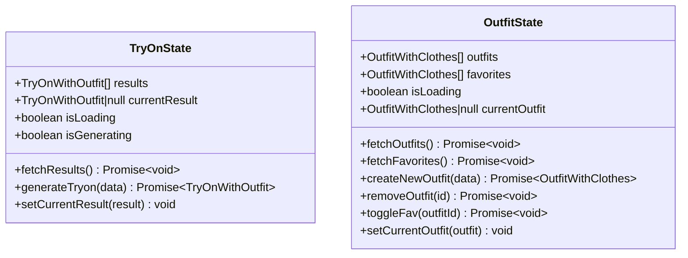
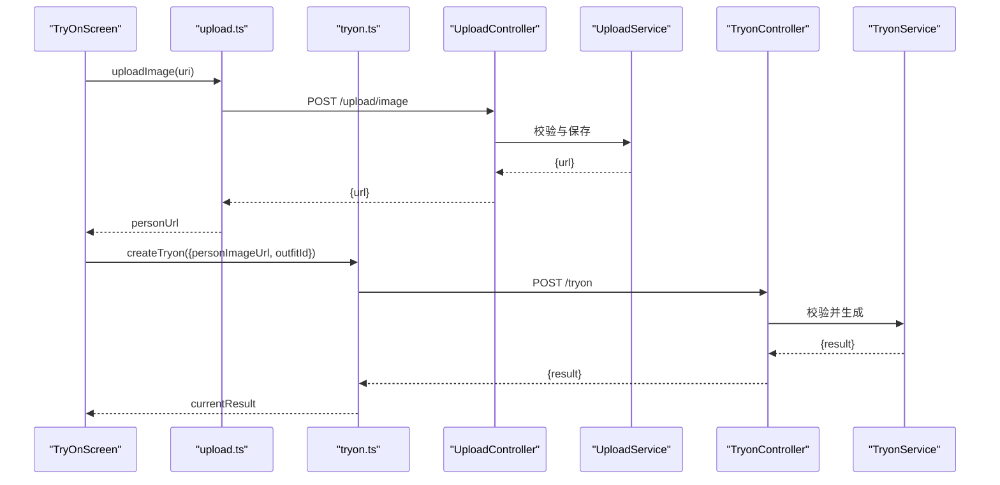
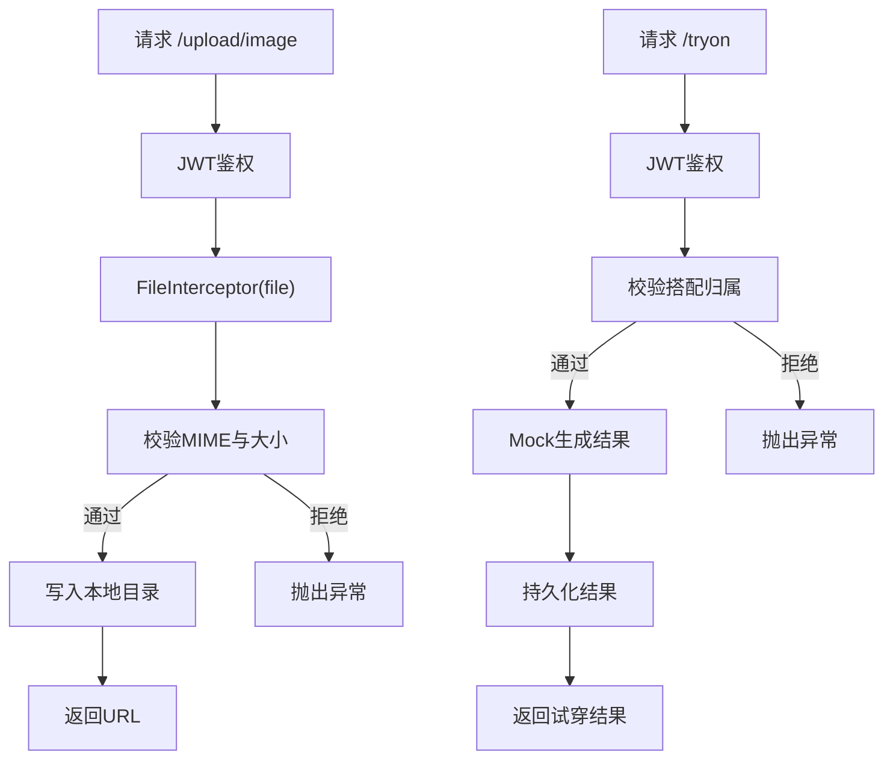
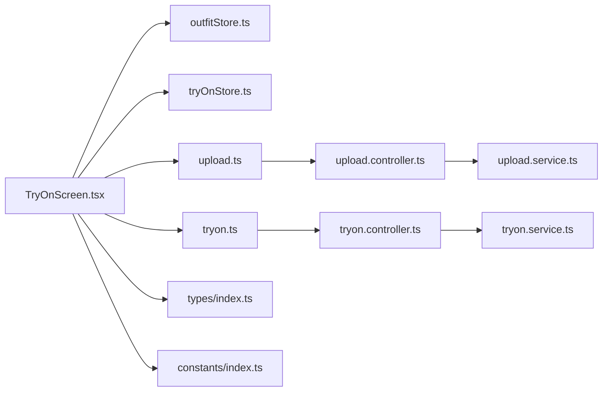

# AI试穿页面

<cite>
**本文档引用的文件**
- [TryOnScreen.tsx](file://FreeDressApp/src/screens/TryOnScreen.tsx)
- [tryOnStore.ts](file://FreeDressApp/src/store/tryOnStore.ts)
- [outfitStore.ts](file://FreeDressApp/src/store/outfitStore.ts)
- [tryon.ts](file://FreeDressApp/src/api/tryon.ts)
- [upload.ts](file://FreeDressApp/src/api/upload.ts)
- [index.ts](file://FreeDressApp/src/types/index.ts)
- [index.ts](file://FreeDressApp/src/constants/index.ts)
- [Button.tsx](file://FreeDressApp/src/components/Button.tsx)
- [ScreenHeader.tsx](file://FreeDressApp/src/components/ScreenHeader.tsx)
- [MainTabNavigator.tsx](file://FreeDressApp/src/navigation/MainTabNavigator.tsx)
- [TryOnHistoryScreen.tsx](file://FreeDressApp/src/screens/TryOnHistoryScreen.tsx)
- [tryon.controller.ts](file://backend/src/modules/tryon/tryon.controller.ts)
- [tryon.service.ts](file://backend/src/modules/tryon/tryon.service.ts)
- [upload.controller.ts](file://backend/src/modules/upload/upload.controller.ts)
- [upload.service.ts](file://backend/src/modules/upload/upload.service.ts)
</cite>

## 目录
1. [简介](#简介)
2. [项目结构](#项目结构)
3. [核心组件](#核心组件)
4. [架构总览](#架构总览)
5. [详细组件分析](#详细组件分析)
6. [依赖关系分析](#依赖关系分析)
7. [性能考量](#性能考量)
8. [故障排查指南](#故障排查指南)
9. [结论](#结论)

## 简介
本文件针对畅搭(FreeDress)应用中的AI试穿页面进行系统化技术文档整理，围绕TryOnScreen的设计与实现展开，覆盖以下关键主题：
- 全身照上传流程：拍照、相册选择、预览与上传处理
- 搭配选择与验证：搭配列表加载、选择逻辑与权限校验
- 试穿结果生成与展示：AI处理模拟、结果渲染与历史记录
- 用户交互设计：步骤引导、加载动画、错误提示与操作反馈
- 性能优化策略：图片压缩、上传进度、结果缓存与懒加载
- 安全与合规：文件大小限制、格式验证与隐私保护

## 项目结构
AI试穿页面位于前端应用的屏幕层，采用模块化组织：
- 屏幕层：TryOnScreen.tsx负责UI与业务流程编排
- 状态管理：tryOnStore.ts与outfitStore.ts分别管理试穿结果与搭配数据
- API封装：tryon.ts与upload.ts提供后端接口调用
- 类型定义：index.ts中定义TryOnResult等核心类型
- 常量与主题：index.ts中提供色彩、字体、间距等设计令牌
- 组件库：Button.tsx、ScreenHeader.tsx等通用组件
- 导航：MainTabNavigator.tsx将TryOnScreen集成到主标签页
- 后端控制器与服务：tryon.controller.ts与tryon.service.ts处理试穿请求；upload.controller.ts与upload.service.ts处理图片上传

**图表来源**
- [TryOnScreen.tsx:1-522](file://FreeDressApp/src/screens/TryOnScreen.tsx#L1-L522)
- [tryOnStore.ts:1-59](file://FreeDressApp/src/store/tryOnStore.ts#L1-L59)
- [outfitStore.ts:1-90](file://FreeDressApp/src/store/outfitStore.ts#L1-L90)
- [tryon.ts:1-28](file://FreeDressApp/src/api/tryon.ts#L1-L28)
- [upload.ts:1-21](file://FreeDressApp/src/api/upload.ts#L1-L21)
- [index.ts:1-98](file://FreeDressApp/src/types/index.ts#L1-L98)
- [index.ts:1-212](file://FreeDressApp/src/constants/index.ts#L1-L212)
- [Button.tsx:1-201](file://FreeDressApp/src/components/Button.tsx#L1-L201)
- [ScreenHeader.tsx:1-95](file://FreeDressApp/src/components/ScreenHeader.tsx#L1-L95)
- [MainTabNavigator.tsx:1-38](file://FreeDressApp/src/navigation/MainTabNavigator.tsx#L1-L38)
- [TryOnHistoryScreen.tsx:1-189](file://FreeDressApp/src/screens/TryOnHistoryScreen.tsx#L1-L189)
- [tryon.controller.ts:1-41](file://backend/src/modules/tryon/tryon.controller.ts#L1-L41)
- [tryon.service.ts:1-88](file://backend/src/modules/tryon/tryon.service.ts#L1-L88)
- [upload.controller.ts:1-51](file://backend/src/modules/upload/upload.controller.ts#L1-L51)
- [upload.service.ts:1-49](file://backend/src/modules/upload/upload.service.ts#L1-L49)

**章节来源**
- [TryOnScreen.tsx:1-522](file://FreeDressApp/src/screens/TryOnScreen.tsx#L1-L522)
- [MainTabNavigator.tsx:1-38](file://FreeDressApp/src/navigation/MainTabNavigator.tsx#L1-L38)

## 核心组件
- TryOnScreen：AI试穿主界面，包含步骤指示、上传区、搭配选择、生成按钮与结果展示
- tryOnStore：管理试穿结果列表、当前结果、加载状态与生成状态
- outfitStore：管理搭配列表、收藏状态与当前选中搭配
- API层：upload.ts负责图片上传；tryon.ts负责试穿请求与历史查询
- 类型系统：TryOnResult、ApiResponse等类型确保前后端数据契约一致
- 通用组件：Button、ScreenHeader等提升交互一致性与可维护性

**章节来源**
- [TryOnScreen.tsx:43-323](file://FreeDressApp/src/screens/TryOnScreen.tsx#L43-L323)
- [tryOnStore.ts:13-58](file://FreeDressApp/src/store/tryOnStore.ts#L13-L58)
- [outfitStore.ts:18-89](file://FreeDressApp/src/store/outfitStore.ts#L18-L89)
- [tryon.ts:12-27](file://FreeDressApp/src/api/tryon.ts#L12-L27)
- [upload.ts:4-20](file://FreeDressApp/src/api/upload.ts#L4-L20)
- [index.ts:48-64](file://FreeDressApp/src/types/index.ts#L48-L64)

## 架构总览
AI试穿页面遵循“屏幕层-状态层-API层-后端服务”的分层架构：
- 屏幕层：TryOnScreen通过useEffect初始化搭配列表，处理图片选择与上传，触发试穿生成
- 状态层：tryOnStore与outfitStore分别维护试穿结果与搭配数据，提供异步操作方法
- API层：upload.ts与tryon.ts封装HTTP请求，返回统一的ApiResponse结构
- 后端服务：UploadController/Service负责图片上传校验与存储；TryonController/Service负责试穿请求校验与Mock生成

**图表来源**
- [TryOnScreen.tsx:60-97](file://FreeDressApp/src/screens/TryOnScreen.tsx#L60-L97)
- [upload.ts:4-20](file://FreeDressApp/src/api/upload.ts#L4-L20)
- [tryon.ts:17-27](file://FreeDressApp/src/api/tryon.ts#L17-L27)
- [upload.controller.ts:33-49](file://backend/src/modules/upload/upload.controller.ts#L33-L49)
- [upload.service.ts:25-47](file://backend/src/modules/upload/upload.service.ts#L25-L47)
- [tryon.controller.ts:17-39](file://backend/src/modules/tryon/tryon.controller.ts#L17-L39)
- [tryon.service.ts:9-33](file://backend/src/modules/tryon/tryon.service.ts#L9-L33)

## 详细组件分析

### TryOnScreen：试穿主流程
- 步骤指示：根据personUrl与selectedOutfitId动态切换步骤状态
- 上传区：支持长按拍照与点击相册选择；上传中显示遮罩层与提示
- 搭配选择：横向滚动展示搭配卡片，选中态高亮；空状态提示前往搭配实验室
- 生成按钮：禁用条件包含生成中、未上传或未选择搭配；加载时显示动画点阵
- 结果展示：渲染试穿结果图与搭配信息；空态展示引导文案

**图表来源**
- [TryOnScreen.tsx:52-97](file://FreeDressApp/src/screens/TryOnScreen.tsx#L52-L97)

**章节来源**
- [TryOnScreen.tsx:43-323](file://FreeDressApp/src/screens/TryOnScreen.tsx#L43-L323)

### 状态管理：tryOnStore与outfitStore
- tryOnStore：维护results、currentResult、isLoading、isGenerating；提供fetchResults与generateTryon方法
- outfitStore：维护outfits、favorites、isLoading、currentOutfit；提供fetchOutfits、fetchFavorites、toggleFav等方法

**图表来源**
- [tryOnStore.ts:13-58](file://FreeDressApp/src/store/tryOnStore.ts#L13-L58)
- [outfitStore.ts:18-89](file://FreeDressApp/src/store/outfitStore.ts#L18-L89)

**章节来源**
- [tryOnStore.ts:24-58](file://FreeDressApp/src/store/tryOnStore.ts#L24-L58)
- [outfitStore.ts:32-89](file://FreeDressApp/src/store/outfitStore.ts#L32-L89)

### API层：上传与试穿
- uploadImage：构造FormData，附带文件名与MIME类型，调用POST /upload/image
- createTryon/getTryonResults：提交试穿请求与获取历史记录，返回统一ApiResponse结构

**图表来源**
- [upload.ts:4-20](file://FreeDressApp/src/api/upload.ts#L4-L20)
- [tryon.ts:17-27](file://FreeDressApp/src/api/tryon.ts#L17-L27)
- [upload.controller.ts:33-49](file://backend/src/modules/upload/upload.controller.ts#L33-L49)
- [upload.service.ts:25-47](file://backend/src/modules/upload/upload.service.ts#L25-L47)
- [tryon.controller.ts:17-39](file://backend/src/modules/tryon/tryon.controller.ts#L17-L39)
- [tryon.service.ts:9-33](file://backend/src/modules/tryon/tryon.service.ts#L9-L33)

**章节来源**
- [upload.ts:4-20](file://FreeDressApp/src/api/upload.ts#L4-L20)
- [tryon.ts:17-27](file://FreeDressApp/src/api/tryon.ts#L17-L27)

### 后端服务：上传与试穿
- UploadController/Service：基于JWT鉴权，使用FileInterceptor接收二进制文件；校验MIME与大小，写入本地目录并返回URL
- TryonController/Service：鉴权后校验搭配归属，Mock生成试穿结果并持久化

**图表来源**
- [upload.controller.ts:33-49](file://backend/src/modules/upload/upload.controller.ts#L33-L49)
- [upload.service.ts:25-47](file://backend/src/modules/upload/upload.service.ts#L25-L47)
- [tryon.controller.ts:17-39](file://backend/src/modules/tryon/tryon.controller.ts#L17-L39)
- [tryon.service.ts:9-33](file://backend/src/modules/tryon/tryon.service.ts#L9-L33)

**章节来源**
- [upload.controller.ts:28-50](file://backend/src/modules/upload/upload.controller.ts#L28-L50)
- [upload.service.ts:15-49](file://backend/src/modules/upload/upload.service.ts#L15-L49)
- [tryon.controller.ts:10-40](file://backend/src/modules/tryon/tryon.controller.ts#L10-L40)
- [tryon.service.ts:6-87](file://backend/src/modules/tryon/tryon.service.ts#L6-L87)

### 用户交互设计
- 步骤指示：通过activeStep高亮当前步骤，增强任务完成感
- 上传区：四角装饰边框与相机图标营造专业感；上传遮罩层提供即时反馈
- 搭配选择：横向滚动卡片，选中态以边框强调；空状态友好提示
- 生成按钮：加载态动画点阵与禁用态提升可用性
- 结果展示：结果图层叠加期号与书签徽标，增强品牌识别

**章节来源**
- [TryOnScreen.tsx:113-319](file://FreeDressApp/src/screens/TryOnScreen.tsx#L113-L319)
- [Button.tsx:49-133](file://FreeDressApp/src/components/Button.tsx#L49-L133)
- [ScreenHeader.tsx:29-63](file://FreeDressApp/src/components/ScreenHeader.tsx#L29-L63)

## 依赖关系分析
- TryOnScreen依赖outfitStore与tryOnStore进行数据与状态管理
- API层依赖axios客户端与后端路由
- 后端控制器依赖服务层与JWT守卫
- 类型系统贯穿前后端，确保数据结构一致性

**图表来源**
- [TryOnScreen.tsx:1-522](file://FreeDressApp/src/screens/TryOnScreen.tsx#L1-L522)
- [outfitStore.ts:1-90](file://FreeDressApp/src/store/outfitStore.ts#L1-L90)
- [tryOnStore.ts:1-59](file://FreeDressApp/src/store/tryOnStore.ts#L1-L59)
- [upload.ts:1-21](file://FreeDressApp/src/api/upload.ts#L1-L21)
- [tryon.ts:1-28](file://FreeDressApp/src/api/tryon.ts#L1-L28)
- [tryon.controller.ts:1-41](file://backend/src/modules/tryon/tryon.controller.ts#L1-L41)
- [upload.controller.ts:1-51](file://backend/src/modules/upload/upload.controller.ts#L1-L51)
- [tryon.service.ts:1-88](file://backend/src/modules/tryon/tryon.service.ts#L1-L88)
- [upload.service.ts:1-49](file://backend/src/modules/upload/upload.service.ts#L1-L49)
- [index.ts:1-98](file://FreeDressApp/src/types/index.ts#L1-L98)
- [index.ts:1-212](file://FreeDressApp/src/constants/index.ts#L1-L212)

**章节来源**
- [TryOnScreen.tsx:1-522](file://FreeDressApp/src/screens/TryOnScreen.tsx#L1-L522)
- [index.ts:48-64](file://FreeDressApp/src/types/index.ts#L48-L64)

## 性能考量
- 图片压缩与尺寸控制：前端可利用quality参数与裁剪工具减少上传体积；后端限制最大文件大小
- 上传进度：当前实现未显示进度条，建议在FormData基础上增加onUploadProgress回调
- 结果缓存：前端store已缓存results与currentResult，避免重复请求；后端可引入Redis缓存热点数据
- 懒加载与虚拟化：搭配列表使用水平滚动，建议结合FlatList优化长列表性能
- 动画与渲染：加载动画与按钮缩放使用reanimated，注意帧率与内存占用

[本节为通用性能指导，无需特定文件引用]

## 故障排查指南
- 上传失败：检查网络连接与后端鉴权；确认文件格式与大小限制
- 生成失败：确认已上传全身照且选择了有效搭配；查看后端日志定位异常
- 搭配为空：前往搭配实验室创建至少一套搭配
- 权限问题：确保JWT令牌有效且用户身份正确

**章节来源**
- [upload.service.ts:30-38](file://backend/src/modules/upload/upload.service.ts#L30-L38)
- [tryon.service.ts:13-18](file://backend/src/modules/tryon/tryon.service.ts#L13-L18)
- [TryOnHistoryScreen.tsx:42-50](file://FreeDressApp/src/screens/TryOnHistoryScreen.tsx#L42-L50)

## 结论
AI试穿页面通过清晰的分层架构与完善的交互设计，实现了从照片上传到试穿结果展示的完整闭环。前端以TryOnScreen为核心，配合状态管理与API封装，后端以控制器与服务实现鉴权、校验与Mock生成，整体具备良好的扩展性与可维护性。后续可在上传进度、缓存策略与真实AI集成方面进一步优化。