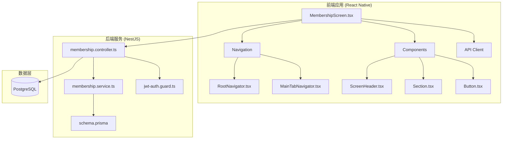
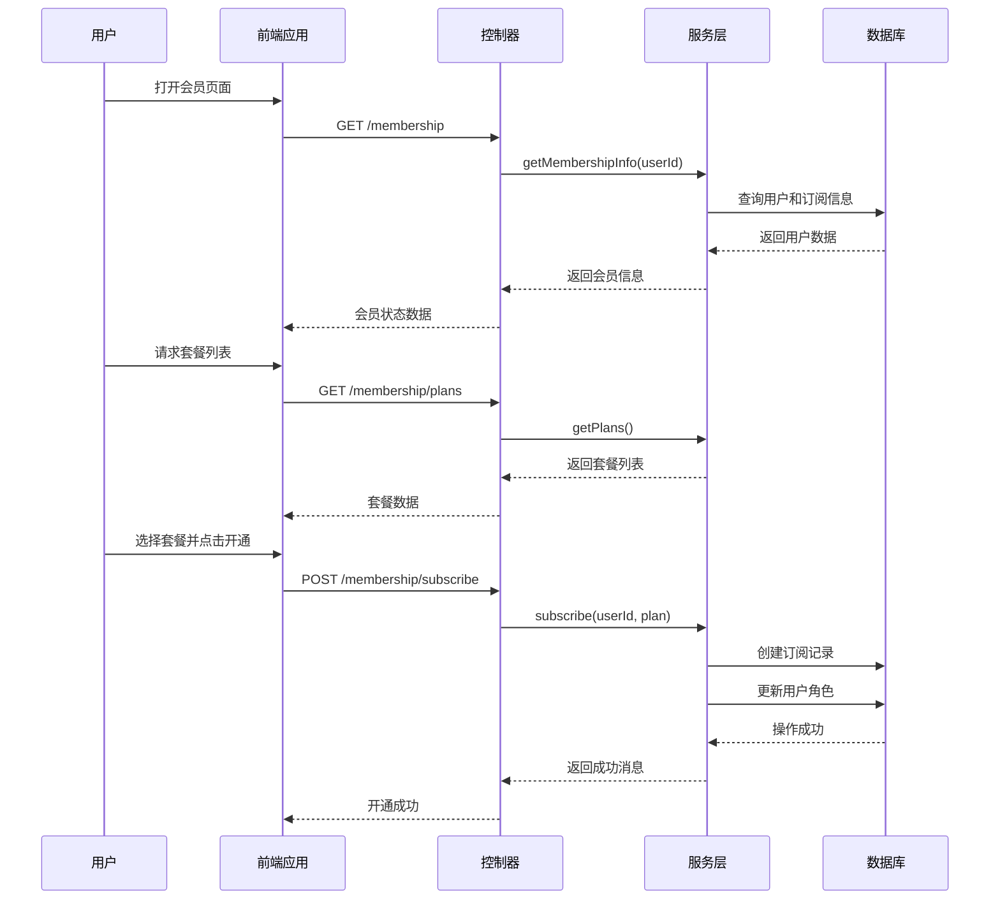
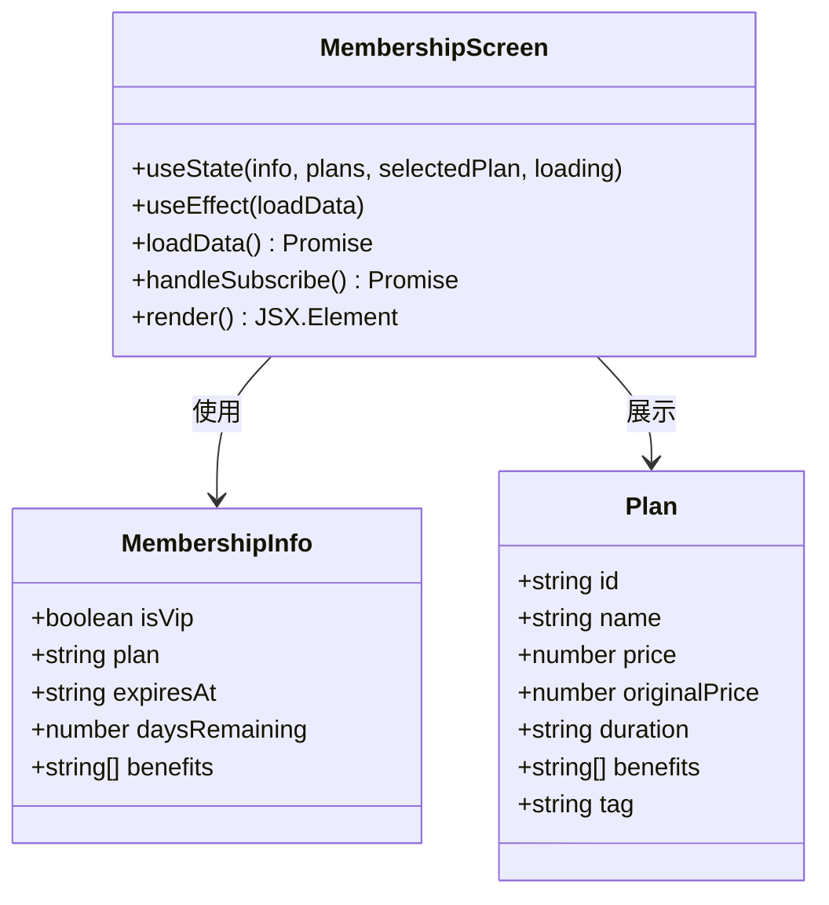
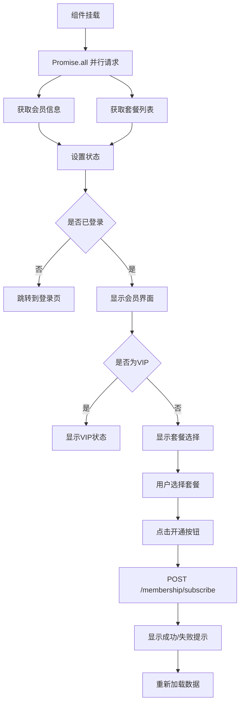
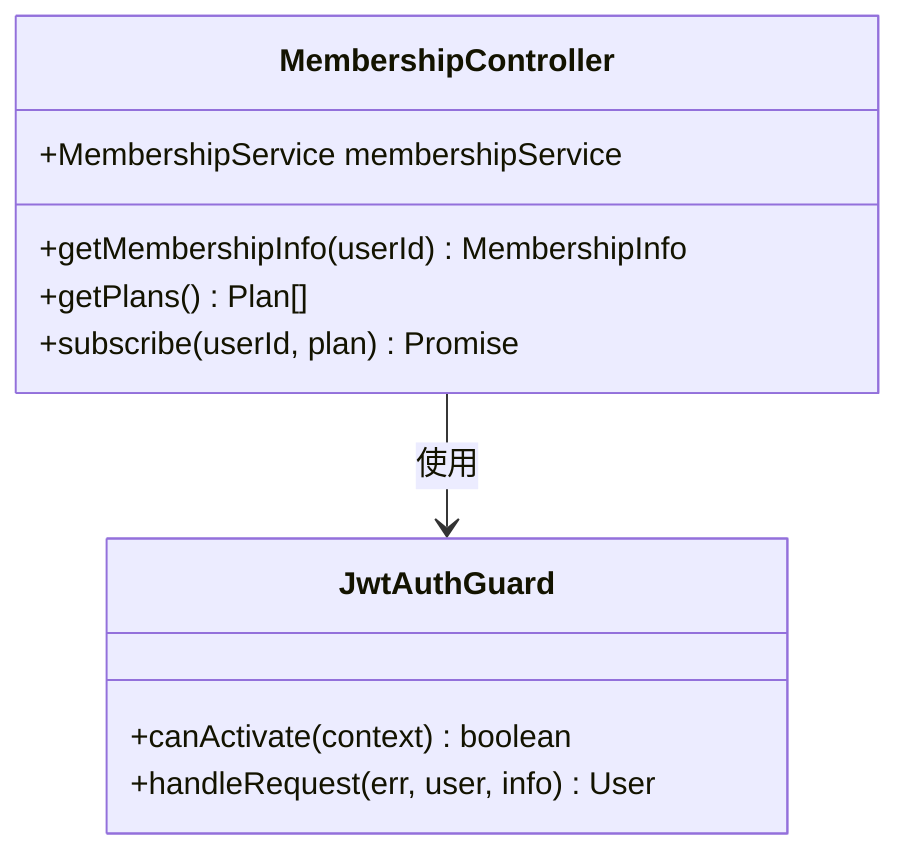
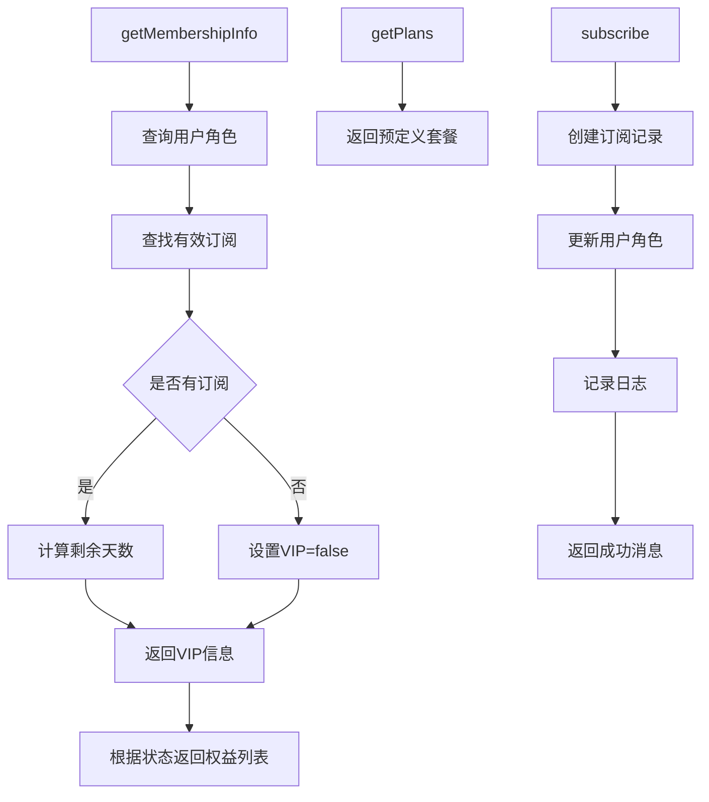
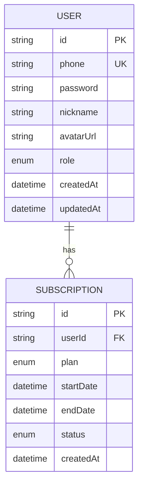
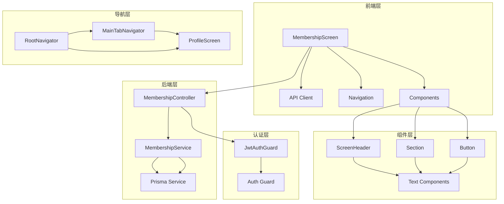

# 会员管理界面

<cite>
**本文档引用的文件**
- [MembershipScreen.tsx](file://FreeDressApp/src/screens/MembershipScreen.tsx)
- [membership.controller.ts](file://backend/src/modules/membership/membership.controller.ts)
- [membership.service.ts](file://backend/src/modules/membership/membership.service.ts)
- [membership.module.ts](file://backend/src/modules/membership/membership.module.ts)
- [schema.prisma](file://backend/prisma/schema.prisma)
- [jwt-auth.guard.ts](file://backend/src/common/guards/jwt-auth.guard.ts)
- [RootNavigator.tsx](file://FreeDressApp/src/navigation/RootNavigator.tsx)
- [MainTabNavigator.tsx](file://FreeDressApp/src/navigation/MainTabNavigator.tsx)
- [ScreenHeader.tsx](file://FreeDressApp/src/components/ScreenHeader.tsx)
- [Section.tsx](file://FreeDressApp/src/components/Section.tsx)
- [Button.tsx](file://FreeDressApp/src/components/Button.tsx)
- [index.ts](file://FreeDressApp/src/types/index.ts)
- [index.ts](file://FreeDressApp/src/constants/index.ts)
- [authStore.ts](file://FreeDressApp/src/store/authStore.ts)
</cite>

## 目录
1. [简介](#简介)
2. [项目结构](#项目结构)
3. [核心组件](#核心组件)
4. [架构概览](#架构概览)
5. [详细组件分析](#详细组件分析)
6. [依赖关系分析](#依赖关系分析)
7. [性能考虑](#性能考虑)
8. [故障排除指南](#故障排除指南)
9. [结论](#结论)

## 简介

会员管理界面是 FreeDress 应用中的核心功能模块，为用户提供会员状态查询、权益展示和套餐购买等功能。该系统采用前后端分离架构，前端使用 React Native 构建移动应用界面，后端基于 NestJS 提供 RESTful API 服务。

系统主要包含以下核心功能：
- 会员状态实时查询和展示
- 套餐列表展示和选择
- 会员权益对比和说明
- 简化的订阅流程（演示版）

## 项目结构

FreeDress 项目采用模块化架构，会员管理功能分布在多个层次中：

**图表来源**
- [MembershipScreen.tsx:1-249](file://FreeDressApp/src/screens/MembershipScreen.tsx#L1-L249)
- [membership.controller.ts:1-35](file://backend/src/modules/membership/membership.controller.ts#L1-L35)
- [schema.prisma:1-198](file://backend/prisma/schema.prisma#L1-L198)

**章节来源**
- [MembershipScreen.tsx:1-249](file://FreeDressApp/src/screens/MembershipScreen.tsx#L1-L249)
- [membership.controller.ts:1-35](file://backend/src/modules/membership/membership.controller.ts#L1-L35)
- [schema.prisma:1-198](file://backend/prisma/schema.prisma#L1-L198)

## 核心组件

会员管理界面的核心组件包括：

### 前端组件
- **MembershipScreen**: 主界面组件，负责渲染会员状态、权益列表和套餐选择
- **ScreenHeader**: 页面头部组件，提供返回按钮和标题显示
- **Section**: 区域分割组件，用于内容分区和标题展示
- **Button**: 按钮组件，支持多种样式变体和状态

### 后端组件
- **MembershipController**: 处理会员相关的 HTTP 请求
- **MembershipService**: 实现会员业务逻辑，包括状态查询和订阅处理
- **MembershipModule**: 会员模块的依赖注入配置

**章节来源**
- [MembershipScreen.tsx:26-42](file://FreeDressApp/src/screens/MembershipScreen.tsx#L26-L42)
- [membership.controller.ts:11-34](file://backend/src/modules/membership/membership.controller.ts#L11-L34)
- [membership.service.ts:12-16](file://backend/src/modules/membership/membership.service.ts#L12-L16)

## 架构概览

会员管理系统采用经典的三层架构模式：

**图表来源**
- [MembershipScreen.tsx:55-84](file://FreeDressApp/src/screens/MembershipScreen.tsx#L55-L84)
- [membership.controller.ts:14-33](file://backend/src/modules/membership/membership.controller.ts#L14-L33)
- [membership.service.ts:21-105](file://backend/src/modules/membership/membership.service.ts#L21-L105)

系统采用 JWT 认证机制，所有会员相关接口都需要有效的认证令牌。前端通过 API 客户端与后端进行通信，后端使用 Prisma ORM 进行数据库操作。

**章节来源**
- [RootNavigator.tsx:45-92](file://FreeDressApp/src/navigation/RootNavigator.tsx#L45-L92)
- [jwt-auth.guard.ts:8-21](file://backend/src/common/guards/jwt-auth.guard.ts#L8-L21)

## 详细组件分析

### 前端界面组件

#### MembershipScreen 组件分析

MembershipScreen 是会员管理界面的核心组件，实现了完整的会员状态管理和套餐购买流程：

**图表来源**
- [MembershipScreen.tsx:26-42](file://FreeDressApp/src/screens/MembershipScreen.tsx#L26-L42)
- [MembershipScreen.tsx:44-188](file://FreeDressApp/src/screens/MembershipScreen.tsx#L44-L188)

组件的主要功能包括：
- **状态管理**: 使用 React hooks 管理会员信息、套餐列表和选择状态
- **异步加载**: 并行加载会员信息和套餐列表
- **用户交互**: 支持套餐选择和订阅操作
- **UI 呈现**: 采用杂志风格的设计语言，提供清晰的信息层次

#### API 集成流程

**图表来源**
- [MembershipScreen.tsx:55-84](file://FreeDressApp/src/screens/MembershipScreen.tsx#L55-L84)
- [RootNavigator.tsx:66-81](file://FreeDressApp/src/navigation/RootNavigator.tsx#L66-L81)

**章节来源**
- [MembershipScreen.tsx:44-188](file://FreeDressApp/src/screens/MembershipScreen.tsx#L44-L188)

### 后端服务组件

#### 会员控制器分析

会员控制器负责处理客户端的所有会员相关请求：

**图表来源**
- [membership.controller.ts:11-34](file://backend/src/modules/membership/membership.controller.ts#L11-L34)
- [jwt-auth.guard.ts:8-21](file://backend/src/common/guards/jwt-auth.guard.ts#L8-L21)

控制器的职责包括：
- **认证保护**: 使用 JWT 守卫确保只有认证用户可以访问
- **数据获取**: 提供会员信息查询和套餐列表获取接口
- **业务处理**: 处理会员订阅请求并调用服务层逻辑

#### 会员服务层分析

会员服务层实现了核心的业务逻辑：

**图表来源**
- [membership.service.ts:21-51](file://backend/src/modules/membership/membership.service.ts#L21-L51)
- [membership.service.ts:56-77](file://backend/src/modules/membership/membership.service.ts#L56-L77)
- [membership.service.ts:82-105](file://backend/src/modules/membership/membership.service.ts#L82-L105)

服务层的关键特性：
- **状态计算**: 自动计算会员的有效性和剩余时间
- **权限控制**: 基于订阅状态和用户角色确定权益
- **简化实现**: 当前版本为演示用途，实际生产环境需要集成支付系统

**章节来源**
- [membership.controller.ts:14-33](file://backend/src/modules/membership/membership.controller.ts#L14-L33)
- [membership.service.ts:18-51](file://backend/src/modules/membership/membership.service.ts#L18-L51)

### 数据模型分析

会员管理系统的数据模型基于 Prisma 定义：

**图表来源**
- [schema.prisma:14-31](file://backend/prisma/schema.prisma#L14-L31)
- [schema.prisma:40-52](file://backend/prisma/schema.prisma#L40-L52)

数据模型设计特点：
- **用户角色**: 支持 USER 和 VIP 两种角色
- **订阅管理**: 独立的订阅表，支持月卡和年卡两种计划
- **状态跟踪**: 订阅状态包括 ACTIVE、EXPIRED、CANCELLED

**章节来源**
- [schema.prisma:34-37](file://backend/prisma/schema.prisma#L34-L37)
- [schema.prisma:54-63](file://backend/prisma/schema.prisma#L54-L63)

## 依赖关系分析

会员管理系统的依赖关系呈现清晰的分层结构：

**图表来源**
- [RootNavigator.tsx:13-25](file://FreeDressApp/src/navigation/RootNavigator.tsx#L13-L25)
- [MainTabNavigator.tsx:16-35](file://FreeDressApp/src/navigation/MainTabNavigator.tsx#L16-L35)
- [membership.controller.ts:1-10](file://backend/src/modules/membership/membership.controller.ts#L1-L10)

系统的关键依赖特性：
- **认证依赖**: 所有会员接口都依赖 JWT 认证
- **导航依赖**: 会员页面通过根导航器和标签导航器集成
- **组件复用**: UI 组件在多个页面中复用，保持一致的设计语言

**章节来源**
- [RootNavigator.tsx:66-81](file://FreeDressApp/src/navigation/RootNavigator.tsx#L66-L81)
- [MainTabNavigator.tsx:22-33](file://FreeDressApp/src/navigation/MainTabNavigator.tsx#L22-L33)

## 性能考虑

会员管理界面在性能方面采用了多项优化策略：

### 前端性能优化
- **并行数据加载**: 使用 Promise.all 同时获取会员信息和套餐列表，减少等待时间
- **状态缓存**: React hooks 状态管理避免不必要的重新渲染
- **懒加载**: 组件按需加载，减少初始包大小
- **动画优化**: 使用 Reanimated 提供流畅的交互体验

### 后端性能优化
- **数据库索引**: 在用户 ID 和到期日期字段建立索引，加速查询
- **查询优化**: 使用 Prisma 的 select 选项只获取必要字段
- **连接池**: NestJS 内置的连接池管理数据库连接
- **限流保护**: 全局限流防止 API 滥用

### 缓存策略
- **本地存储**: 使用 AsyncStorage 缓存认证信息
- **组件缓存**: React 组件状态缓存避免重复计算
- **网络缓存**: API 响应缓存策略减少服务器负载

## 故障排除指南

### 常见问题及解决方案

#### 认证相关问题
- **问题**: 用户无法访问会员页面
- **原因**: 缺少有效的 JWT 令牌或令牌过期
- **解决**: 检查认证状态，重新登录获取新令牌

#### 数据加载问题
- **问题**: 会员信息显示为空或加载缓慢
- **原因**: 网络请求失败或数据库查询超时
- **解决**: 检查 API 服务状态，确认数据库连接正常

#### 套餐选择问题
- **问题**: 套餐列表无法显示或选择无效
- **原因**: 前端状态管理错误或 API 响应格式不正确
- **解决**: 检查网络请求响应，验证数据格式

#### 订阅流程问题
- **问题**: 开通会员失败但无明确错误信息
- **原因**: 后端服务异常或数据库操作失败
- **解决**: 查看服务器日志，检查数据库连接和事务处理

### 调试工具和技巧

#### 前端调试
- 使用 React DevTools 检查组件状态和 props
- 利用 Flipper 进行网络请求监控
- 检查 AsyncStorage 中的认证数据

#### 后端调试
- 启用 NestJS 日志记录
- 使用 Prisma Studio 查看数据库状态
- 监控 API 响应时间和错误率

**章节来源**
- [authStore.ts:97-121](file://FreeDressApp/src/store/authStore.ts#L97-L121)
- [membership.service.ts:14-16](file://backend/src/modules/membership/membership.service.ts#L14-L16)

## 结论

会员管理界面展现了现代移动应用开发的最佳实践，通过清晰的架构设计和合理的组件划分，实现了功能完整且用户体验优秀的会员管理系统。

### 主要优势
- **架构清晰**: 前后端分离，职责明确，易于维护和扩展
- **用户体验**: 采用杂志风格的设计语言，提供优雅的视觉体验
- **技术先进**: 使用最新的 React Native 和 NestJS 技术栈
- **安全性强**: 完整的认证和授权机制，保护用户数据安全

### 改进建议
- **集成支付系统**: 当前版本为演示用途，需要集成真实的支付网关
- **增强错误处理**: 添加更详细的错误提示和重试机制
- **性能监控**: 实施更全面的性能监控和分析
- **国际化支持**: 添加多语言支持以服务更广泛的用户群体

该系统为 FreeDress 应用提供了坚实的会员管理基础，为后续的功能扩展和业务发展奠定了良好的技术基础。