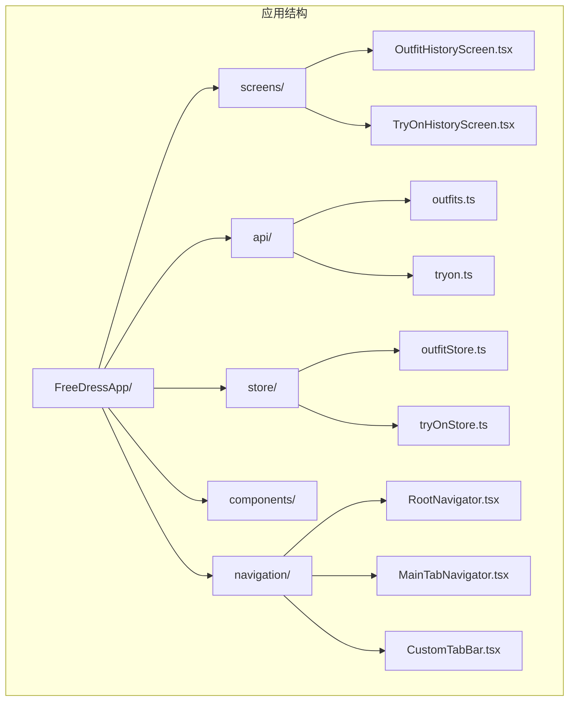
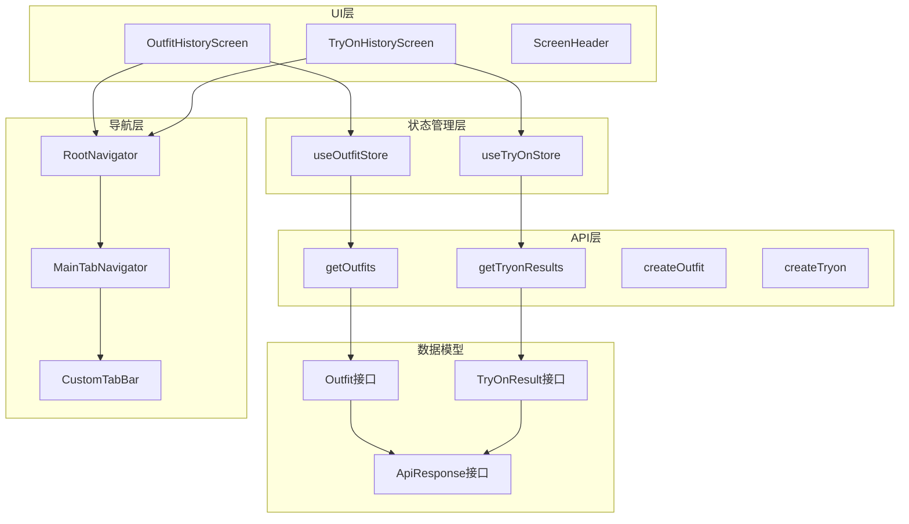
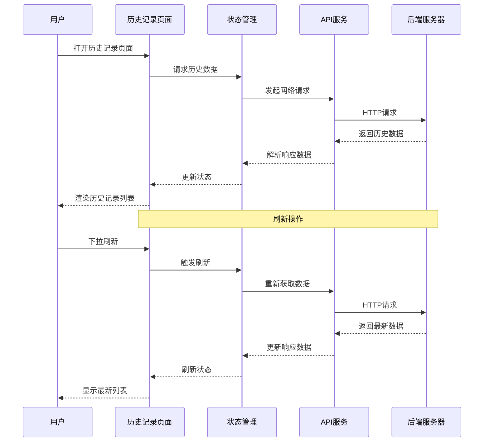
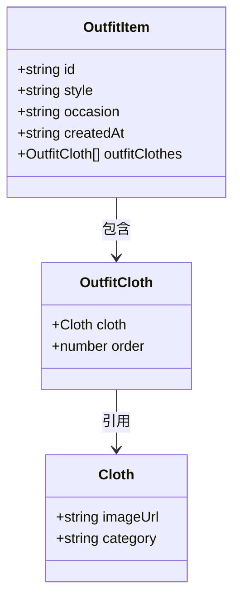
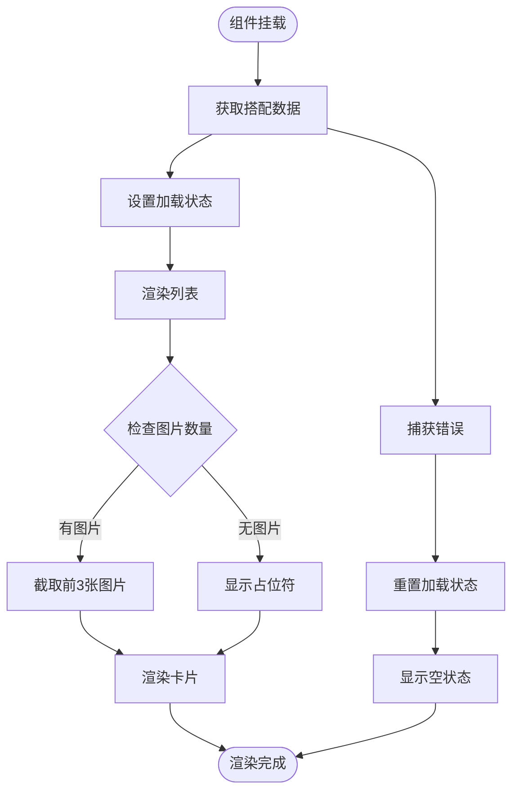
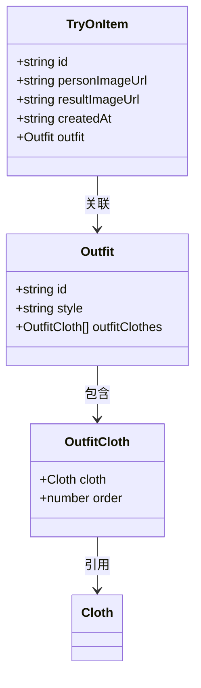
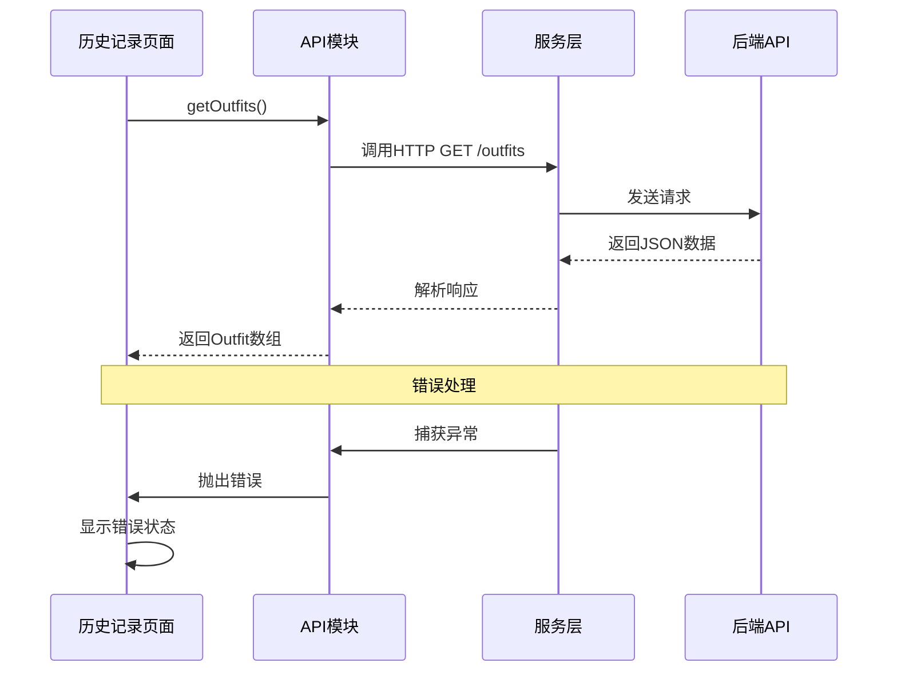
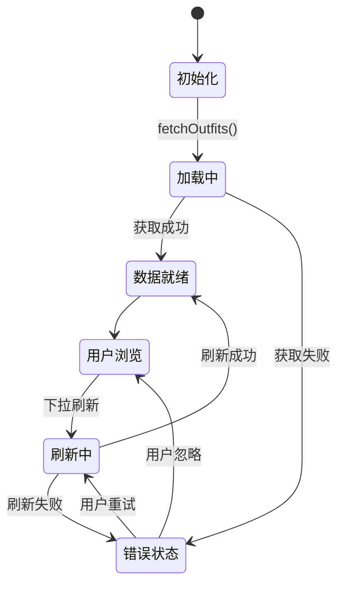
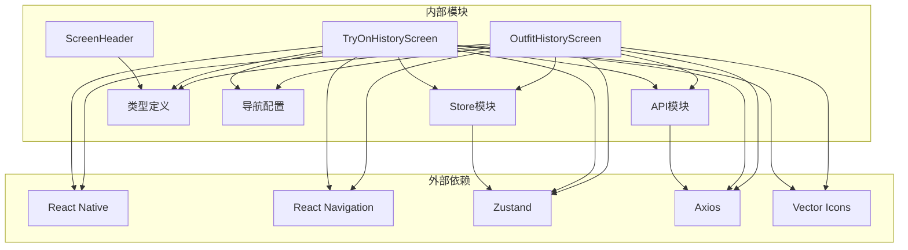

# 历史记录页面

<cite>
**本文档引用的文件**
- [OutfitHistoryScreen.tsx](file://FreeDressApp/src/screens/OutfitHistoryScreen.tsx)
- [TryOnHistoryScreen.tsx](file://FreeDressApp/src/screens/TryOnHistoryScreen.tsx)
- [outfits.ts](file://FreeDressApp/src/api/outfits.ts)
- [tryon.ts](file://FreeDressApp/src/api/tryon.ts)
- [outfitStore.ts](file://FreeDressApp/src/store/outfitStore.ts)
- [tryOnStore.ts](file://FreeDressApp/src/store/tryOnStore.ts)
- [index.ts](file://FreeDressApp/src/types/index.ts)
- [ScreenHeader.tsx](file://FreeDressApp/src/components/ScreenHeader.tsx)
- [index.ts](file://FreeDressApp/src/constants/index.ts)
- [RootNavigator.tsx](file://FreeDressApp/src/navigation/RootNavigator.tsx)
- [MainTabNavigator.tsx](file://FreeDressApp/src/navigation/MainTabNavigator.tsx)
- [CustomTabBar.tsx](file://FreeDressApp/src/navigation/CustomTabBar.tsx)
- [App.tsx](file://FreeDressApp/src/App.tsx)
</cite>

## 目录
1. [简介](#简介)
2. [项目结构](#项目结构)
3. [核心组件](#核心组件)
4. [架构概览](#架构概览)
5. [详细组件分析](#详细组件分析)
6. [依赖关系分析](#依赖关系分析)
7. [性能考虑](#性能考虑)
8. [故障排除指南](#故障排除指南)
9. [结论](#结论)

## 简介

畅搭(FreeDress)应用的历史记录页面组提供了两个核心功能页面：搭配历史记录和试穿历史记录。这两个页面采用统一的设计语言和交互模式，为用户提供完整的服装搭配和虚拟试穿历史管理功能。

历史记录页面基于React Native开发，采用了现代化的架构设计，包括API层、状态管理层和UI组件层的清晰分离。页面设计遵循编辑式时装的美学理念，使用暖灰棕单色调和极简主义风格，为用户营造专业的服装管理体验。

## 项目结构

历史记录页面组位于应用的屏幕(Screen)目录下，采用功能模块化的组织方式：

**图表来源**
- [OutfitHistoryScreen.tsx:1-212](file://FreeDressApp/src/screens/OutfitHistoryScreen.tsx#L1-L212)
- [TryOnHistoryScreen.tsx:1-189](file://FreeDressApp/src/screens/TryOnHistoryScreen.tsx#L1-L189)
- [RootNavigator.tsx:1-95](file://FreeDressApp/src/navigation/RootNavigator.tsx#L1-L95)

**章节来源**
- [OutfitHistoryScreen.tsx:1-212](file://FreeDressApp/src/screens/OutfitHistoryScreen.tsx#L1-L212)
- [TryOnHistoryScreen.tsx:1-189](file://FreeDressApp/src/screens/TryOnHistoryScreen.tsx#L1-L189)
- [RootNavigator.tsx:1-95](file://FreeDressApp/src/navigation/RootNavigator.tsx#L1-L95)

## 核心组件

历史记录页面组包含两个主要组件，每个都针对特定的业务场景进行了专门优化：

### OutfitHistoryScreen - 搭配历史记录

该组件负责展示用户的服装搭配历史，提供完整的搭配浏览和管理功能。组件采用函数式编程模式，使用React Hooks进行状态管理，实现了高效的性能表现。

### TryOnHistoryScreen - 试穿历史记录

该组件专注于虚拟试穿功能的历史记录展示，专门为AI试穿结果提供直观的视觉浏览体验。组件设计简洁明了，突出试穿结果图片的重要性。

### 共同特性

两个历史记录页面都具备以下核心特性：
- 实时数据刷新机制
- 空状态友好处理
- 响应式布局设计
- 统一的视觉风格
- 无缝的用户体验

**章节来源**
- [OutfitHistoryScreen.tsx:32-138](file://FreeDressApp/src/screens/OutfitHistoryScreen.tsx#L32-L138)
- [TryOnHistoryScreen.tsx:35-122](file://FreeDressApp/src/screens/TryOnHistoryScreen.tsx#L35-L122)

## 架构概览

历史记录页面组采用了分层架构设计，确保代码的可维护性和扩展性：

**图表来源**
- [outfitStore.ts:32-89](file://FreeDressApp/src/store/outfitStore.ts#L32-L89)
- [tryOnStore.ts:24-58](file://FreeDressApp/src/store/tryOnStore.ts#L24-L58)
- [outfits.ts:21-23](file://FreeDressApp/src/api/outfits.ts#L21-L23)
- [tryon.ts:21-23](file://FreeDressApp/src/api/tryon.ts#L21-L23)
- [RootNavigator.tsx:41-84](file://FreeDressApp/src/navigation/RootNavigator.tsx#L41-L84)

### 数据流架构

历史记录页面的数据流遵循单向数据流原则，确保状态的一致性和可预测性：

**图表来源**
- [OutfitHistoryScreen.tsx:38-57](file://FreeDressApp/src/screens/OutfitHistoryScreen.tsx#L38-L57)
- [TryOnHistoryScreen.tsx:41-60](file://FreeDressApp/src/screens/TryOnHistoryScreen.tsx#L41-L60)
- [outfitStore.ts:38-48](file://FreeDressApp/src/store/outfitStore.ts#L38-L48)
- [tryOnStore.ts:30-40](file://FreeDressApp/src/store/tryOnStore.ts#L30-L40)

**章节来源**
- [outfitStore.ts:1-90](file://FreeDressApp/src/store/outfitStore.ts#L1-L90)
- [tryOnStore.ts:1-59](file://FreeDressApp/src/store/tryOnStore.ts#L1-L59)

## 详细组件分析

### OutfitHistoryScreen 组件分析

OutfitHistoryScreen是搭配历史记录的核心组件，实现了完整的搭配历史浏览功能。

#### 数据结构设计

组件使用了专门的OutfitItem接口来描述搭配历史数据：

**图表来源**
- [OutfitHistoryScreen.tsx:24-30](file://FreeDressApp/src/screens/OutfitHistoryScreen.tsx#L24-L30)

#### 渲染逻辑实现

组件采用高效的FlatList进行列表渲染，支持无限滚动和虚拟化：

**图表来源**
- [OutfitHistoryScreen.tsx:64-96](file://FreeDressApp/src/screens/OutfitHistoryScreen.tsx#L64-L96)

#### 用户交互设计

组件实现了多种用户交互模式：

1. **下拉刷新**：支持手动刷新历史数据
2. **空状态处理**：无数据时显示友好的提示信息
3. **日期格式化**：将ISO日期格式化为本地化显示

**章节来源**
- [OutfitHistoryScreen.tsx:1-212](file://FreeDressApp/src/screens/OutfitHistoryScreen.tsx#L1-L212)

### TryOnHistoryScreen 组件分析

TryOnHistoryScreen专注于虚拟试穿历史记录的展示，提供了直观的试穿结果浏览体验。

#### 数据模型设计

组件使用了TryOnItem接口来描述试穿历史数据：

**图表来源**
- [TryOnHistoryScreen.tsx:24-33](file://FreeDressApp/src/screens/TryOnHistoryScreen.tsx#L24-L33)

#### 图片处理优化

组件特别优化了图片显示逻辑，针对试穿结果图片进行了专门处理：

- **固定尺寸**：使用统一的56x70像素尺寸
- **占位符处理**：无图片时显示占位符
- **懒加载支持**：利用React Native的Image组件优化

**章节来源**
- [TryOnHistoryScreen.tsx:1-189](file://FreeDressApp/src/screens/TryOnHistoryScreen.tsx#L1-L189)

### API 层设计

历史记录页面通过专门的API模块与后端服务通信：

**图表来源**
- [outfits.ts:21-23](file://FreeDressApp/src/api/outfits.ts#L21-L23)
- [tryon.ts:21-23](file://FreeDressApp/src/api/tryon.ts#L21-L23)

**章节来源**
- [outfits.ts:1-40](file://FreeDressApp/src/api/outfits.ts#L1-L40)
- [tryon.ts:1-28](file://FreeDressApp/src/api/tryon.ts#L1-L28)

### 状态管理层

应用使用Zustand作为状态管理解决方案，提供了轻量级但功能强大的状态管理能力：

**图表来源**
- [outfitStore.ts:38-48](file://FreeDressApp/src/store/outfitStore.ts#L38-L48)
- [tryOnStore.ts:30-40](file://FreeDressApp/src/store/tryOnStore.ts#L30-L40)

**章节来源**
- [outfitStore.ts:1-90](file://FreeDressApp/src/store/outfitStore.ts#L1-L90)
- [tryOnStore.ts:1-59](file://FreeDressApp/src/store/tryOnStore.ts#L1-L59)

## 依赖关系分析

历史记录页面组的依赖关系体现了清晰的关注点分离：

**图表来源**
- [OutfitHistoryScreen.tsx:1-22](file://FreeDressApp/src/screens/OutfitHistoryScreen.tsx#L1-L22)
- [TryOnHistoryScreen.tsx:1-22](file://FreeDressApp/src/screens/TryOnHistoryScreen.tsx#L1-L22)
- [RootNavigator.tsx:13-21](file://FreeDressApp/src/navigation/RootNavigator.tsx#L13-L21)

### 组件耦合度分析

历史记录页面组展现了良好的内聚性和低耦合性：

- **UI组件独立**：屏幕组件不直接依赖其他屏幕组件
- **状态管理解耦**：Store模块与UI组件通过接口隔离
- **API层抽象**：网络请求逻辑封装在专用模块中
- **导航系统分离**：导航配置与业务逻辑完全分离

**章节来源**
- [index.ts:1-98](file://FreeDressApp/src/types/index.ts#L1-L98)
- [ScreenHeader.tsx:1-95](file://FreeDressApp/src/components/ScreenHeader.tsx#L1-L95)

## 性能考虑

历史记录页面组在多个层面实现了性能优化策略：

### 列表渲染优化

1. **FlatList虚拟化**：自动处理列表项的创建和销毁
2. **keyExtractor优化**：使用唯一ID作为列表项标识
3. **内存管理**：自动回收不再可见的列表项

### 图片加载优化

1. **懒加载**：图片只在进入视口时加载
2. **尺寸控制**：合理设置图片尺寸避免过度渲染
3. **缓存策略**：利用React Native内置缓存机制

### 网络请求优化

1. **请求去重**：避免重复的相同请求
2. **错误重试**：智能的错误处理和重试机制
3. **超时控制**：合理的请求超时设置

### 状态更新优化

1. **选择性更新**：只更新必要的状态
2. **批处理更新**：合并多个状态更新操作
3. **防抖处理**：避免频繁的状态变更

**章节来源**
- [OutfitHistoryScreen.tsx:111-135](file://FreeDressApp/src/screens/OutfitHistoryScreen.tsx#L111-L135)
- [TryOnHistoryScreen.tsx:96-121](file://FreeDressApp/src/screens/TryOnHistoryScreen.tsx#L96-L121)

## 故障排除指南

### 常见问题及解决方案

#### 数据加载失败

**症状**：历史记录页面显示空白或错误信息

**可能原因**：
- 网络连接问题
- API服务不可用
- 认证令牌过期

**解决步骤**：
1. 检查网络连接状态
2. 验证API服务可用性
3. 重新登录获取新令牌
4. 查看控制台错误日志

#### 图片加载失败

**症状**：历史记录中的图片显示为占位符

**可能原因**：
- 图片URL无效
- 网络权限问题
- 图片格式不支持

**解决步骤**：
1. 验证图片URL的有效性
2. 检查网络权限配置
3. 确认图片格式兼容性
4. 尝试重新加载页面

#### 刷新功能异常

**症状**：下拉刷新无响应或显示错误

**可能原因**：
- 刷新回调函数异常
- 网络请求超时
- 状态管理错误

**解决步骤**：
1. 检查刷新回调函数实现
2. 验证网络请求配置
3. 查看状态管理日志
4. 重启应用尝试

**章节来源**
- [OutfitHistoryScreen.tsx:42-47](file://FreeDressApp/src/screens/OutfitHistoryScreen.tsx#L42-L47)
- [TryOnHistoryScreen.tsx:45-50](file://FreeDressApp/src/screens/TryOnHistoryScreen.tsx#L45-L50)

### 调试技巧

1. **启用开发者工具**：使用React Native Debugger进行调试
2. **查看网络请求**：监控API调用和响应
3. **状态检查**：验证Store中的数据状态
4. **错误边界**：实现错误边界组件捕获异常

## 结论

畅搭(FreeDress)应用的历史记录页面组展现了现代移动应用开发的最佳实践。通过精心设计的架构、优化的性能策略和完善的用户体验，为用户提供了高效、直观的历史记录管理功能。

### 主要成就

1. **架构清晰**：分层设计确保了代码的可维护性
2. **性能优秀**：多项优化策略提升了用户体验
3. **扩展性强**：模块化设计便于功能扩展
4. **用户体验佳**：直观的交互设计和友好的错误处理

### 技术亮点

- **状态管理**：Zustand提供了轻量级但强大的状态管理
- **API设计**：清晰的接口定义和错误处理
- **UI组件**：可复用的组件设计和一致的视觉风格
- **导航集成**：无缝的导航体验和路由管理

历史记录页面组不仅满足了当前的功能需求，还为未来的功能扩展奠定了坚实的基础。通过持续的优化和改进，这个模块将继续为用户提供优质的服装管理体验。