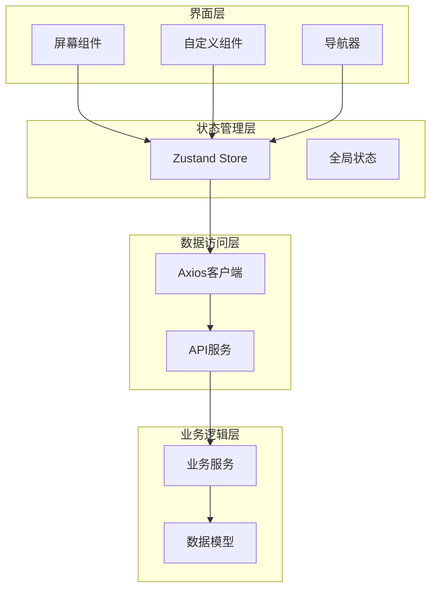
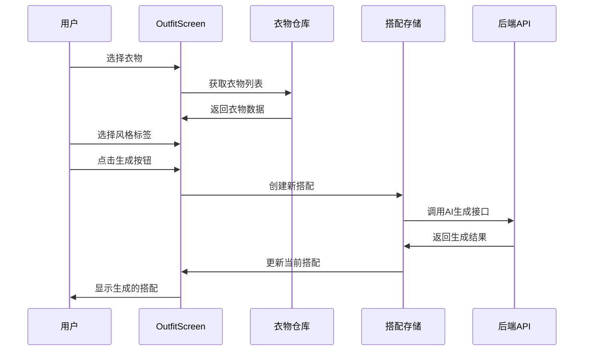
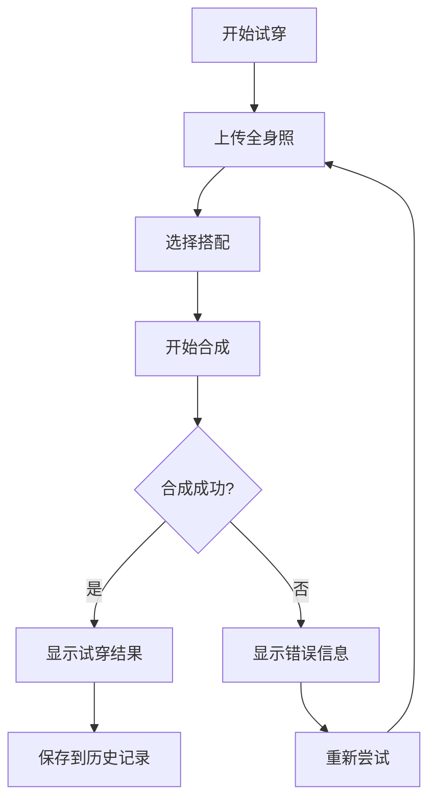
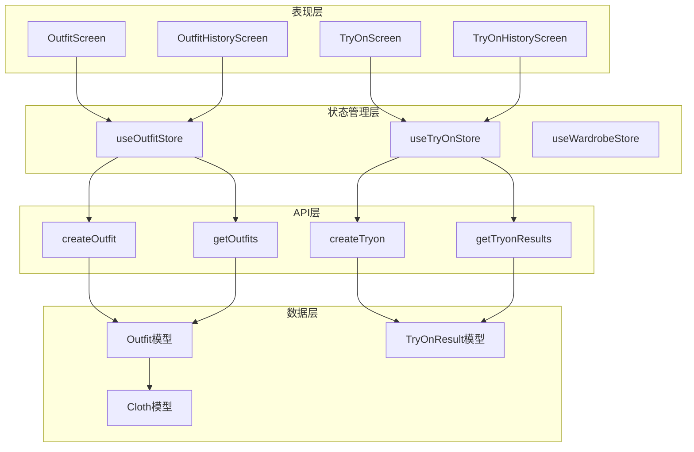
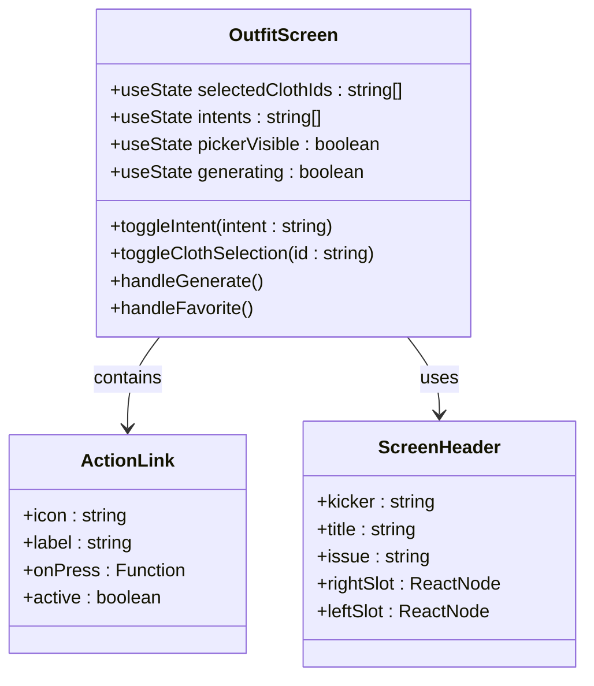
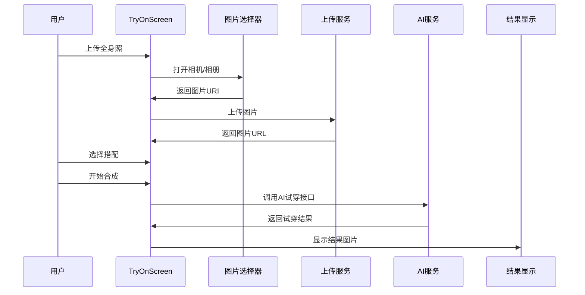
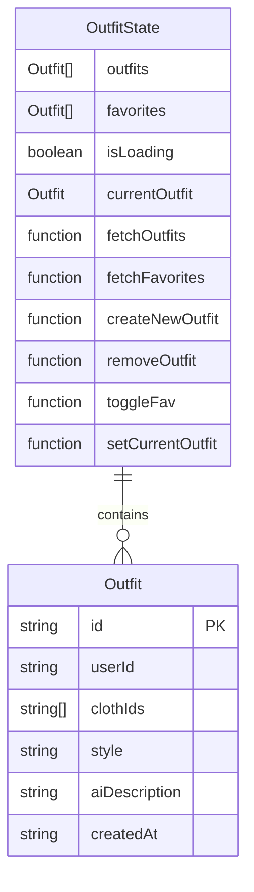
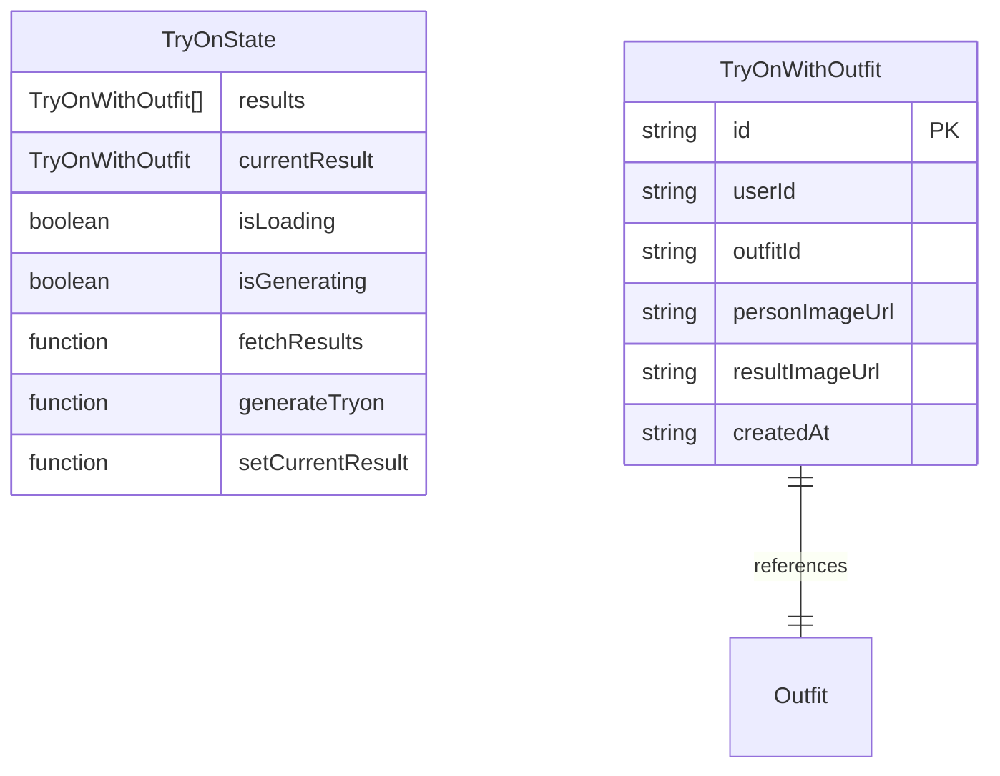
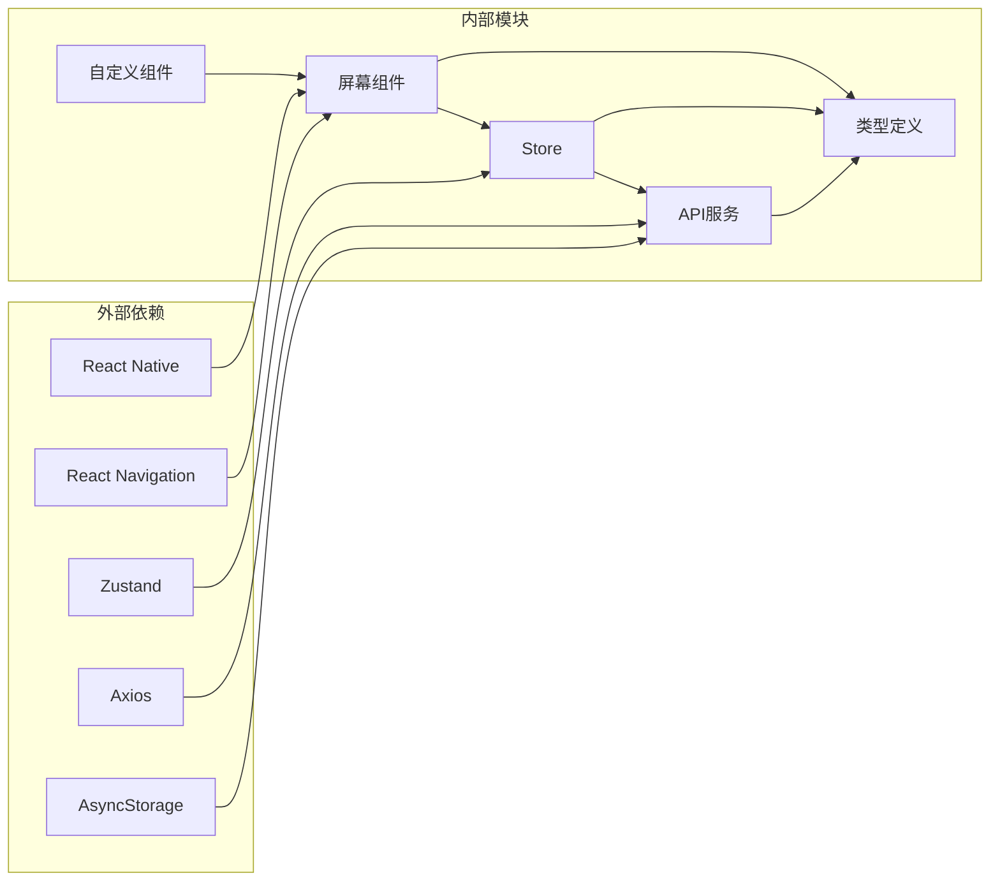

# 搭配和试穿页面

<cite>
**本文档引用的文件**
- [OutfitScreen.tsx](file://FreeDressApp/src/screens/OutfitScreen.tsx)
- [TryOnScreen.tsx](file://FreeDressApp/src/screens/TryOnScreen.tsx)
- [OutfitHistoryScreen.tsx](file://FreeDressApp/src/screens/OutfitHistoryScreen.tsx)
- [TryOnHistoryScreen.tsx](file://FreeDressApp/src/screens/TryOnHistoryScreen.tsx)
- [outfitStore.ts](file://FreeDressApp/src/store/outfitStore.ts)
- [tryOnStore.ts](file://FreeDressApp/src/store/tryOnStore.ts)
- [wardrobeStore.ts](file://FreeDressApp/src/store/wardrobeStore.ts)
- [outfits.ts](file://FreeDressApp/src/api/outfits.ts)
- [tryon.ts](file://FreeDressApp/src/api/tryon.ts)
- [axios.ts](file://FreeDressApp/src/api/axios.ts)
- [index.ts](file://FreeDressApp/src/types/index.ts)
- [ScreenHeader.tsx](file://FreeDressApp/src/components/ScreenHeader.tsx)
- [MainTabNavigator.tsx](file://FreeDressApp/src/navigation/MainTabNavigator.tsx)
- [WardrobeStack.tsx](file://FreeDressApp/src/navigation/WardrobeStack.tsx)
</cite>

## 目录
1. [简介](#简介)
2. [项目结构](#项目结构)
3. [核心组件](#核心组件)
4. [架构概览](#架构概览)
5. [详细组件分析](#详细组件分析)
6. [依赖关系分析](#依赖关系分析)
7. [性能考虑](#性能考虑)
8. [故障排除指南](#故障排除指南)
9. [结论](#结论)

## 简介

畅搭(FreeDress)应用是一个基于AI技术的智能服装搭配和虚拟试穿平台。本文档深入分析了四个核心页面的设计和实现：搭配实验室(OutfitScreen)、AI试穿(TryOnScreen)、搭配历史(OutfitHistoryScreen)和试穿历史(TryOnHistoryScreen)。系统采用React Native + TypeScript构建，结合Zustand状态管理和Axios网络请求，为用户提供从衣物选择到智能搭配再到虚拟试穿的完整体验。

## 项目结构

畅搭应用采用模块化架构设计，主要分为以下层次：

**图表来源**
- [OutfitScreen.tsx:1-603](file://FreeDressApp/src/screens/OutfitScreen.tsx#L1-L603)
- [MainTabNavigator.tsx:1-38](file://FreeDressApp/src/navigation/MainTabNavigator.tsx#L1-L38)
- [outfitStore.ts:1-90](file://FreeDressApp/src/store/outfitStore.ts#L1-L90)

**章节来源**
- [OutfitScreen.tsx:1-603](file://FreeDressApp/src/screens/OutfitScreen.tsx#L1-L603)
- [TryOnScreen.tsx:1-522](file://FreeDressApp/src/screens/TryOnScreen.tsx#L1-L522)
- [MainTabNavigator.tsx:1-38](file://FreeDressApp/src/navigation/MainTabNavigator.tsx#L1-L38)

## 核心组件

### 搭配实验室 (OutfitScreen)

搭配实验室是AI智能搭配的核心入口，提供衣物选择、风格推荐和搭配生成功能。

**关键特性：**
- **衣物选择器**：支持多选衣物，最多3-5件最佳搭配
- **风格标签系统**：9种预设风格(极简、商务、街头等)
- **实时预览**：生成的搭配即时显示在结果区域
- **收藏功能**：支持收藏喜欢的搭配

**数据流：**

**图表来源**
- [OutfitScreen.tsx:67-84](file://FreeDressApp/src/screens/OutfitScreen.tsx#L67-L84)
- [outfitStore.ts:59-64](file://FreeDressApp/src/store/outfitStore.ts#L59-L64)

### AI试穿 (TryOnScreen)

AI试穿功能允许用户上传全身照，选择搭配进行虚拟试穿。

**工作流程：**

**图表来源**
- [TryOnScreen.tsx:85-97](file://FreeDressApp/src/screens/TryOnScreen.tsx#L85-L97)
- [tryOnStore.ts:42-55](file://FreeDressApp/src/store/tryOnStore.ts#L42-L55)

### 历史记录管理

系统提供两个独立的历史记录页面：

**搭配历史 (OutfitHistoryScreen)**
- 展示所有创建的搭配记录
- 支持下拉刷新
- 显示搭配的基本信息和创建时间

**试穿历史 (TryOnHistoryScreen)**
- 展示所有AI试穿的结果
- 显示试穿效果图片和搭配信息
- 支持下拉刷新和空状态处理

**章节来源**
- [OutfitHistoryScreen.tsx:1-212](file://FreeDressApp/src/screens/OutfitHistoryScreen.tsx#L1-L212)
- [TryOnHistoryScreen.tsx:1-189](file://FreeDressApp/src/screens/TryOnHistoryScreen.tsx#L1-L189)

## 架构概览

系统采用分层架构，确保关注点分离和代码可维护性：

**图表来源**
- [outfitStore.ts:32-89](file://FreeDressApp/src/store/outfitStore.ts#L32-L89)
- [tryOnStore.ts:24-58](file://FreeDressApp/src/store/tryOnStore.ts#L24-L58)
- [outfits.ts:17-39](file://FreeDressApp/src/api/outfits.ts#L17-L39)

## 详细组件分析

### OutfitScreen 组件分析

OutfitScreen 是一个复杂的表单组件，集成了多种交互模式：

**组件结构：**

**图表来源**
- [OutfitScreen.tsx:37-361](file://FreeDressApp/src/screens/OutfitScreen.tsx#L37-L361)
- [ScreenHeader.tsx:29-63](file://FreeDressApp/src/components/ScreenHeader.tsx#L29-L63)

**核心功能实现：**

1. **衣物选择器弹窗**：使用Modal组件实现滑动选择界面
2. **风格标签系统**：支持多选风格标签，最多可选多个
3. **实时状态管理**：通过useState管理选择状态和UI状态
4. **错误处理**：完善的Alert提示和错误捕获

**章节来源**
- [OutfitScreen.tsx:295-358](file://FreeDressApp/src/screens/OutfitScreen.tsx#L295-L358)
- [OutfitScreen.tsx:53-57](file://FreeDressApp/src/screens/OutfitScreen.tsx#L53-L57)

### TryOnScreen 组件分析

TryOnScreen 实现了完整的AI试穿工作流程：

**步骤流程：**

**图表来源**
- [TryOnScreen.tsx:60-83](file://FreeDressApp/src/screens/TryOnScreen.tsx#L60-L83)
- [TryOnScreen.tsx:85-97](file://FreeDressApp/src/screens/TryOnScreen.tsx#L85-L97)

**动画效果：**
- 使用react-native-reanimated实现渐变动画
- 三个点状动画指示AI合成过程
- 流畅的过渡效果提升用户体验

**章节来源**
- [TryOnScreen.tsx:325-356](file://FreeDressApp/src/screens/TryOnScreen.tsx#L325-L356)
- [TryOnScreen.tsx:43-58](file://FreeDressApp/src/screens/TryOnScreen.tsx#L43-L58)

### Store 状态管理分析

系统使用Zustand实现轻量级状态管理：

**OutfitStore 状态结构：**

**图表来源**
- [outfitStore.ts:18-30](file://FreeDressApp/src/store/outfitStore.ts#L18-L30)

**TryOnStore 状态结构：**

**图表来源**
- [tryOnStore.ts:13-22](file://FreeDressApp/src/store/tryOnStore.ts#L13-L22)

**章节来源**
- [outfitStore.ts:32-89](file://FreeDressApp/src/store/outfitStore.ts#L32-L89)
- [tryOnStore.ts:24-58](file://FreeDressApp/src/store/tryOnStore.ts#L24-L58)

### API 服务层分析

**Outfits API 接口：**
- `createOutfit`: 创建新搭配
- `getOutfits`: 获取搭配列表
- `getOutfit`: 获取单个搭配详情
- `deleteOutfit`: 删除搭配
- `toggleFavorite`: 切换收藏状态
- `getFavorites`: 获取收藏列表

**TryOn API 接口：**
- `createTryon`: 生成试穿结果
- `getTryonResults`: 获取试穿结果列表
- `getTryonResult`: 获取单个试穿结果

**章节来源**
- [outfits.ts:17-39](file://FreeDressApp/src/api/outfits.ts#L17-L39)
- [tryon.ts:17-27](file://FreeDressApp/src/api/tryon.ts#L17-L27)

## 依赖关系分析

系统采用模块化依赖设计，确保各组件间的松耦合：

**主要依赖关系：**
- **屏幕组件**依赖于**自定义组件库**和**导航系统**
- **Store**通过**API服务**与后端通信
- **API服务**使用**Axios客户端**处理HTTP请求
- **所有模块**共享**类型定义**确保类型安全

**章节来源**
- [axios.ts:12-18](file://FreeDressApp/src/api/axios.ts#L12-L18)
- [index.ts:74-98](file://FreeDressApp/src/types/index.ts#L74-L98)

## 性能考虑

### 图片处理优化

1. **懒加载策略**：使用FlatList实现虚拟滚动，只渲染可见项
2. **图片缓存**：利用React Native的Image组件内置缓存机制
3. **尺寸优化**：根据显示需求调整图片尺寸，避免过度渲染

### 网络请求优化

1. **请求拦截器**：自动添加认证头，统一错误处理
2. **重试机制**：Token过期时自动刷新并重试请求
3. **超时控制**：设置合理的请求超时时间(10秒)

### 数据缓存策略

1. **本地存储**：使用AsyncStorage缓存认证信息
2. **状态持久化**：Zustand Store在内存中缓存最新数据
3. **分类统计**：缓存衣物分类统计数据减少重复请求

### 用户体验优化

1. **加载状态**：所有异步操作都有明确的加载指示
2. **错误处理**：友好的错误提示和重试机制
3. **动画效果**：流畅的过渡动画提升交互体验

**章节来源**
- [axios.ts:24-38](file://FreeDressApp/src/api/axios.ts#L24-L38)
- [axios.ts:44-105](file://FreeDressApp/src/api/axios.ts#L44-L105)

## 故障排除指南

### 常见问题及解决方案

**1. 搭配生成失败**
- 检查网络连接状态
- 确认选择了至少一件衣物
- 查看控制台错误日志
- 重试生成操作

**2. 图片上传失败**
- 检查图片格式是否为JPG/PNG
- 确认图片大小不超过限制
- 验证相机权限设置
- 重新选择图片

**3. 历史记录为空**
- 确认已创建过搭配或试穿记录
- 检查网络连接状态
- 下拉刷新页面
- 清除应用缓存后重试

**4. Token过期问题**
- 系统会自动处理Token刷新
- 如失败，需要重新登录
- 检查设备时间和网络设置

### 调试技巧

1. **启用开发者工具**：使用React DevTools检查组件状态
2. **监控网络请求**：使用Chrome DevTools Network面板
3. **日志输出**：在关键位置添加console.log语句
4. **状态检查**：使用Redux DevTools或类似工具

**章节来源**
- [OutfitScreen.tsx:79-83](file://FreeDressApp/src/screens/OutfitScreen.tsx#L79-L83)
- [TryOnScreen.tsx:76-82](file://FreeDressApp/src/screens/TryOnScreen.tsx#L76-L82)

## 结论

畅搭(FreeDress)应用的搭配和试穿页面组展现了现代移动应用开发的最佳实践。通过清晰的模块化架构、完善的错误处理机制和优秀的用户体验设计，系统为用户提供了从衣物管理到智能搭配再到虚拟试穿的完整解决方案。

**核心优势：**
- **模块化设计**：清晰的关注点分离便于维护和扩展
- **状态管理**：Zustand提供轻量级但强大的状态管理
- **用户体验**：流畅的动画效果和直观的操作流程
- **性能优化**：合理的缓存策略和资源管理

**未来改进建议：**
- 添加离线模式支持
- 实现更丰富的个性化推荐算法
- 增加社交分享功能
- 优化AI生成速度和质量

该系统为类似的AI服装应用提供了良好的技术参考和实现范例。