# 搭配页面

<cite>
**本文档引用的文件**
- [OutfitScreen.tsx](file://FreeDressApp/src/screens/OutfitScreen.tsx)
- [outfitStore.ts](file://FreeDressApp/src/store/outfitStore.ts)
- [outfits.ts](file://FreeDressApp/src/api/outfits.ts)
- [wardrobeStore.ts](file://FreeDressApp/src/store/wardrobeStore.ts)
- [clothes.ts](file://FreeDressApp/src/api/clothes.ts)
- [index.ts](file://FreeDressApp/src/types/index.ts)
- [index.ts](file://FreeDressApp/src/constants/index.ts)
- [ScreenHeader.tsx](file://FreeDressApp/src/components/ScreenHeader.tsx)
- [MainTabNavigator.tsx](file://FreeDressApp/src/navigation/MainTabNavigator.tsx)
- [RootNavigator.tsx](file://FreeDressApp/src/navigation/RootNavigator.tsx)
- [WardrobeStack.tsx](file://FreeDressApp/src/navigation/WardrobeStack.tsx)
- [WardrobeScreen.tsx](file://FreeDressApp/src/screens/WardrobeScreen.tsx)
- [ClothDetailSheet.tsx](file://FreeDressApp/src/components/ClothDetailSheet.tsx)
</cite>

## 目录
1. [简介](#简介)
2. [项目结构](#项目结构)
3. [核心组件](#核心组件)
4. [架构概览](#架构概览)
5. [详细组件分析](#详细组件分析)
6. [依赖关系分析](#依赖关系分析)
7. [性能考虑](#性能考虑)
8. [故障排除指南](#故障排除指南)
9. [结论](#结论)
10. [附录](#附录)

## 简介
搭配页面是畅搭(FreeDress)应用的核心功能模块，为用户提供AI驱动的服装搭配体验。该页面实现了从衣橱选择衣物、设置风格意图、生成AI搭配方案到收藏和试穿的完整流程。系统采用React Native + TypeScript技术栈，结合Zustand状态管理和Axios网络请求，提供了流畅的用户体验和强大的数据管理能力。

## 项目结构
搭配页面位于FreeDressApp/src/screens目录下，采用模块化的文件组织方式：

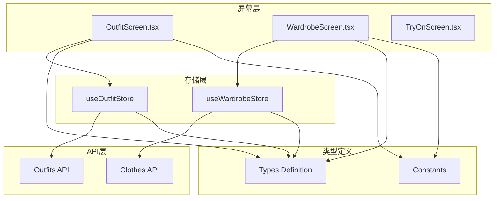

**图表来源**
- [OutfitScreen.tsx:1-603](file://FreeDressApp/src/screens/OutfitScreen.tsx#L1-L603)
- [wardrobeStore.ts:1-83](file://FreeDressApp/src/store/wardrobeStore.ts#L1-L83)
- [outfitStore.ts:1-90](file://FreeDressApp/src/store/outfitStore.ts#L1-L90)

**章节来源**
- [OutfitScreen.tsx:1-603](file://FreeDressApp/src/screens/OutfitScreen.tsx#L1-L603)
- [MainTabNavigator.tsx:1-37](file://FreeDressApp/src/navigation/MainTabNavigator.tsx#L1-L37)

## 核心组件
搭配页面由多个精心设计的组件构成，每个组件都有明确的职责分工：

### 主要组件架构
- **OutfitScreen**: 主界面组件，负责整体布局和业务逻辑
- **useOutfitStore**: 状态管理，处理搭配数据的增删改查
- **useWardrobeStore**: 衣物数据管理，提供衣物列表和分类统计
- **ScreenHeader**: 页面头部组件，统一的标题和导航样式
- **自定义UI组件**: Button、Tag、Section等复用组件

### 数据流设计
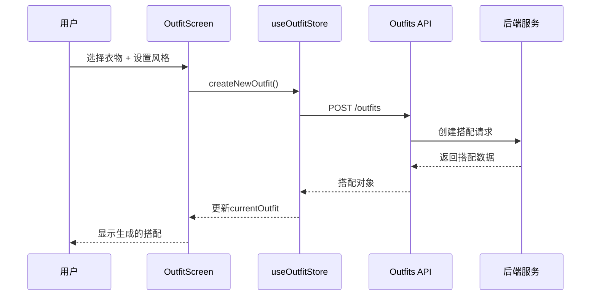

**图表来源**
- [outfitStore.ts:59-64](file://FreeDressApp/src/store/outfitStore.ts#L59-L64)
- [outfits.ts:17-19](file://FreeDressApp/src/api/outfits.ts#L17-L19)

**章节来源**
- [OutfitScreen.tsx:37-361](file://FreeDressApp/src/screens/OutfitScreen.tsx#L37-L361)
- [outfitStore.ts:32-89](file://FreeDressApp/src/store/outfitStore.ts#L32-L89)

## 架构概览
搭配页面采用分层架构设计，确保代码的可维护性和扩展性：

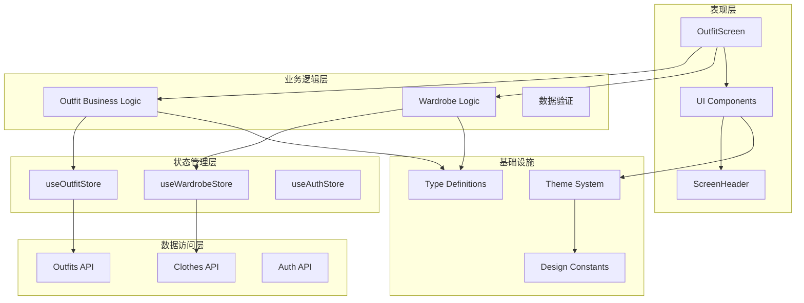

**图表来源**
- [OutfitScreen.tsx:15-31](file://FreeDressApp/src/screens/OutfitScreen.tsx#L15-L31)
- [index.ts:35-46](file://FreeDressApp/src/types/index.ts#L35-L46)

### 技术栈特点
- **TypeScript**: 提供强类型安全保障，减少运行时错误
- **React Hooks**: 函数式组件 + hooks模式，提升代码复用性
- **Zustand**: 轻量级状态管理，替代Redux的复杂性
- **React Navigation**: 原生导航解决方案，支持深度链接
- **Axios**: HTTP客户端，统一错误处理和拦截器

**章节来源**
- [index.ts:1-98](file://FreeDressApp/src/types/index.ts#L1-L98)
- [index.ts:15-52](file://FreeDressApp/src/constants/index.ts#L15-L52)

## 详细组件分析

### OutfitScreen组件分析
OutfitScreen是搭配页面的核心组件，实现了完整的搭配工作流程：

#### 核心功能模块
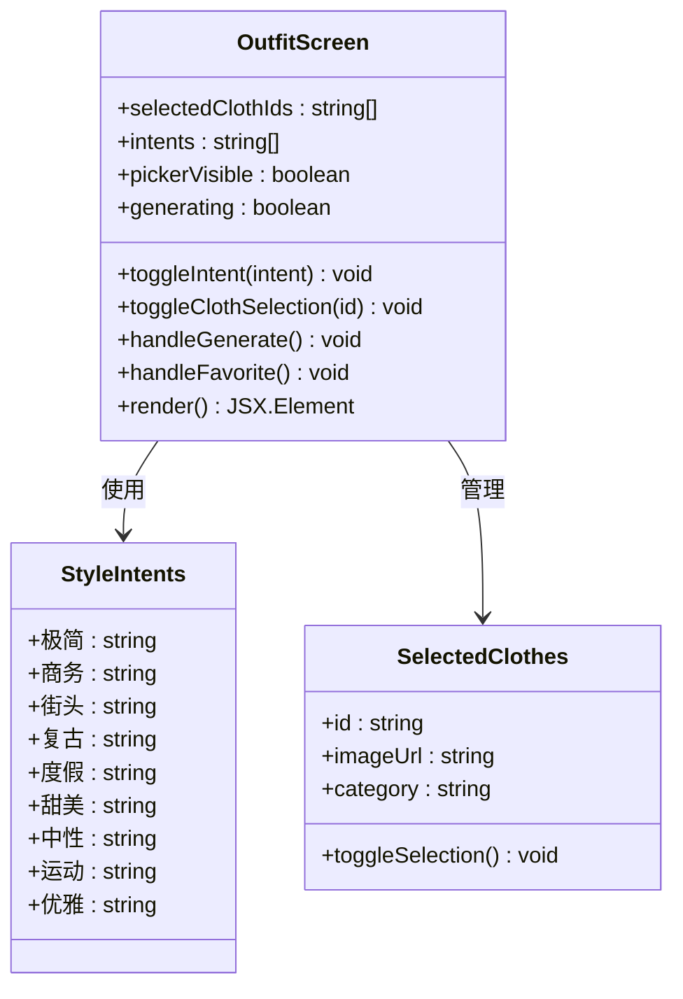

**图表来源**
- [OutfitScreen.tsx:33-35](file://FreeDressApp/src/screens/OutfitScreen.tsx#L33-L35)
- [OutfitScreen.tsx:59-63](file://FreeDressApp/src/screens/OutfitScreen.tsx#L59-L63)

#### 用户交互设计
系统提供了多种交互方式来增强用户体验：

1. **衣物拖拽选择**: 通过Modal弹窗展示衣物网格，支持多选
2. **点击选择**: 支持单击切换选中状态
3. **预览功能**: 实时显示已选衣物的缩略图
4. **风格匹配**: 多个风格标签可同时选择

#### 搭配逻辑实现
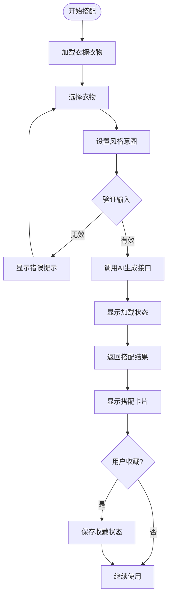

**图表来源**
- [OutfitScreen.tsx:67-84](file://FreeDressApp/src/screens/OutfitScreen.tsx#L67-L84)
- [outfitStore.ts:59-64](file://FreeDressApp/src/store/outfitStore.ts#L59-L64)

**章节来源**
- [OutfitScreen.tsx:37-361](file://FreeDressApp/src/screens/OutfitScreen.tsx#L37-L361)

### 状态管理系统
搭配页面的状态管理采用Zustand，提供了高效的数据流控制：

#### OutfitStore状态结构
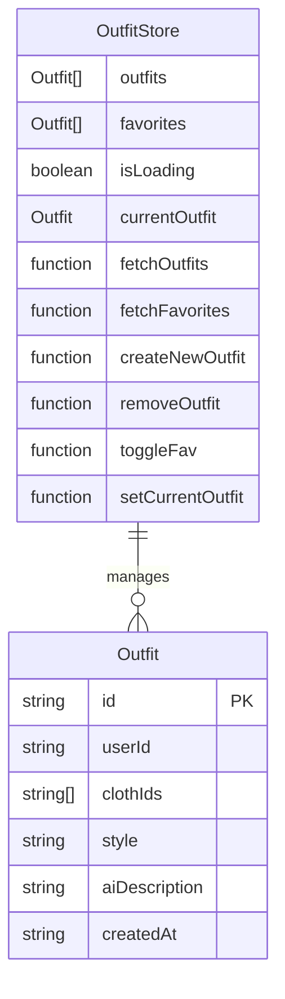

**图表来源**
- [outfitStore.ts:18-30](file://FreeDressApp/src/store/outfitStore.ts#L18-L30)
- [index.ts:35-46](file://FreeDressApp/src/types/index.ts#L35-L46)

#### 衣物选择器实现
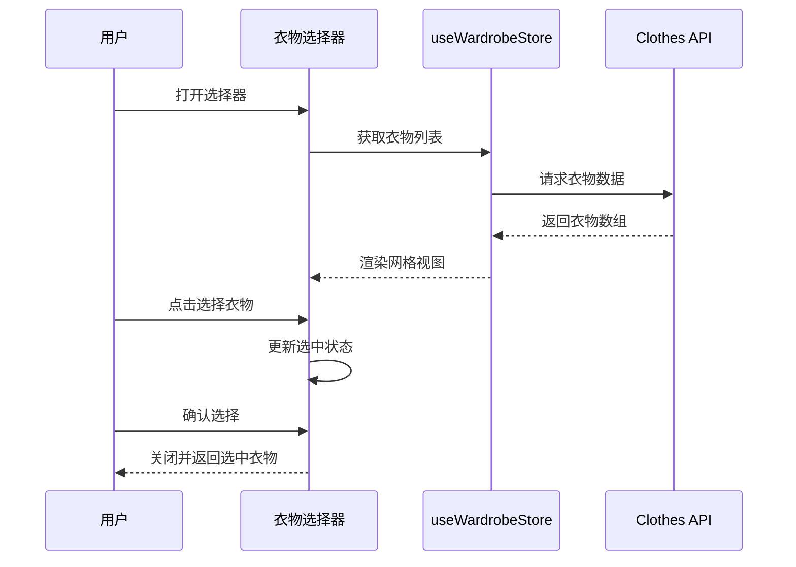

**图表来源**
- [OutfitScreen.tsx:296-358](file://FreeDressApp/src/screens/OutfitScreen.tsx#L296-L358)
- [wardrobeStore.ts:43-53](file://FreeDressApp/src/store/wardrobeStore.ts#L43-L53)

**章节来源**
- [outfitStore.ts:32-89](file://FreeDressApp/src/store/outfitStore.ts#L32-L89)
- [wardrobeStore.ts:35-82](file://FreeDressApp/src/store/wardrobeStore.ts#L35-L82)

### 数据管理策略
搭配页面采用了多层次的数据管理策略：

#### 搭配状态管理
- **临时状态**: 本地组件状态用于UI交互反馈
- **持久状态**: Zustand store管理全局状态
- **服务器同步**: 通过API接口保持数据一致性

#### 数据验证机制
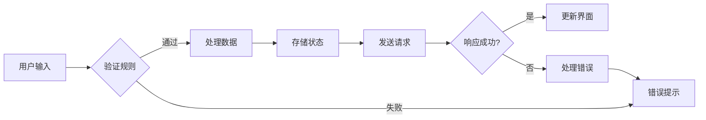

**图表来源**
- [OutfitScreen.tsx:67-84](file://FreeDressApp/src/screens/OutfitScreen.tsx#L67-L84)
- [outfitStore.ts:74-86](file://FreeDressApp/src/store/outfitStore.ts#L74-L86)

**章节来源**
- [OutfitScreen.tsx:67-93](file://FreeDressApp/src/screens/OutfitScreen.tsx#L67-L93)
- [outfits.ts:10-15](file://FreeDressApp/src/api/outfits.ts#L10-L15)

## 依赖关系分析

### 组件依赖图
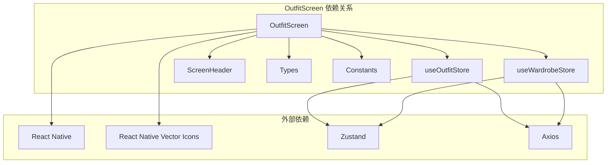

**图表来源**
- [OutfitScreen.tsx:15-31](file://FreeDressApp/src/screens/OutfitScreen.tsx#L15-L31)
- [outfitStore.ts:1](file://FreeDressApp/src/store/outfitStore.ts#L1)
- [wardrobeStore.ts:1](file://FreeDressApp/src/store/wardrobeStore.ts#L1)

### 导航集成
搭配页面作为主标签页的一部分，与其他页面形成完整的导航体系：

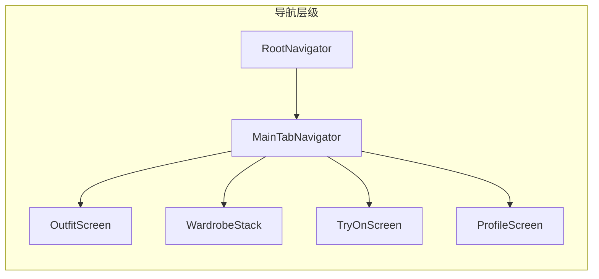

**图表来源**
- [RootNavigator.tsx:41-84](file://FreeDressApp/src/navigation/RootNavigator.tsx#L41-L84)
- [MainTabNavigator.tsx:22-34](file://FreeDressApp/src/navigation/MainTabNavigator.tsx#L22-L34)

**章节来源**
- [MainTabNavigator.tsx:16-34](file://FreeDressApp/src/navigation/MainTabNavigator.tsx#L16-L34)
- [WardrobeStack.tsx:9-20](file://FreeDressApp/src/navigation/WardrobeStack.tsx#L9-L20)

## 性能考虑

### 图片懒加载策略
搭配页面实现了高效的图片加载机制：
- **缩略图优先**: 使用较小尺寸的缩略图提升初始加载速度
- **按需加载**: 只在需要时才加载完整的图片资源
- **缓存机制**: 利用React Native的Image组件内置缓存

### 虚拟列表优化
对于大量衣物数据的展示，系统采用了虚拟化技术：
- **FlatList组件**: 替代ScrollView实现高性能滚动
- **列布局**: 3列网格布局，平衡视觉效果和性能
- **动态高度**: 根据内容调整行高，避免不必要的重排

### 状态缓存策略
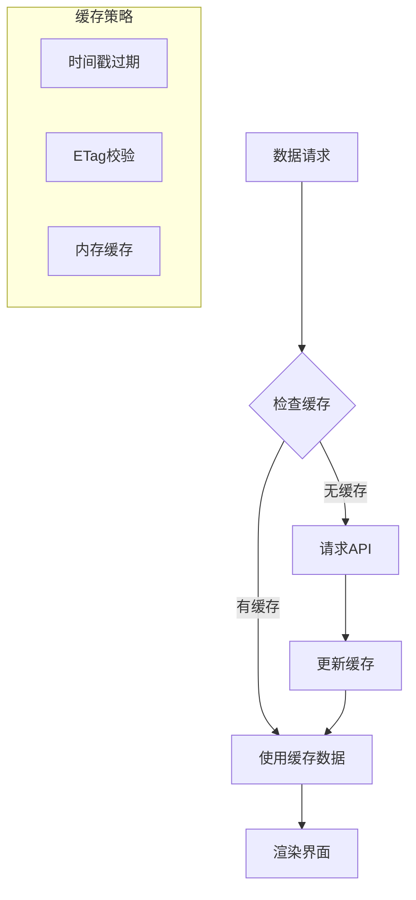

**图表来源**
- [wardrobeStore.ts:43-53](file://FreeDressApp/src/store/wardrobeStore.ts#L43-L53)
- [outfitStore.ts:38-48](file://FreeDressApp/src/store/outfitStore.ts#L38-L48)

### 性能优化建议
1. **图片压缩**: 在上传时进行适当的图片压缩
2. **批量请求**: 合并多个API请求减少网络开销
3. **防抖处理**: 对频繁触发的操作添加防抖机制
4. **内存管理**: 及时清理不再使用的组件实例

**章节来源**
- [OutfitScreen.tsx:322-348](file://FreeDressApp/src/screens/OutfitScreen.tsx#L322-L348)
- [index.ts:100-115](file://FreeDressApp/src/constants/index.ts#L100-L115)

## 故障排除指南

### 常见问题及解决方案

#### 搭配生成失败
当AI生成搭配失败时，系统会显示相应的错误提示：
- **网络连接问题**: 检查设备网络状态，重试请求
- **服务器异常**: 显示"请稍后重试"提示，等待服务恢复
- **参数验证失败**: 确保选择了至少一件衣物

#### 收藏功能异常
收藏状态同步可能出现问题：
- **状态不同步**: 手动刷新页面或重新登录
- **网络超时**: 检查API响应，确认收藏状态
- **权限问题**: 确认用户已登录且有相应权限

#### 图片加载问题
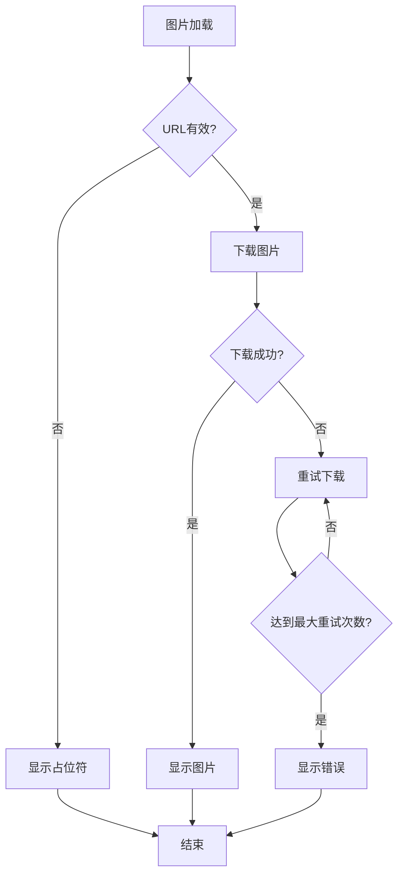

**图表来源**
- [OutfitScreen.tsx:148](file://FreeDressApp/src/screens/OutfitScreen.tsx#L148)
- [OutfitScreen.tsx:225](file://FreeDressApp/src/screens/OutfitScreen.tsx#L225)

**章节来源**
- [OutfitScreen.tsx:79-83](file://FreeDressApp/src/screens/OutfitScreen.tsx#L79-L83)
- [outfitStore.ts:74-86](file://FreeDressApp/src/store/outfitStore.ts#L74-L86)

### 错误处理最佳实践
1. **用户友好的错误提示**: 使用清晰易懂的语言描述问题
2. **自动重试机制**: 对于临时性错误提供自动重试
3. **日志记录**: 记录详细的错误信息便于调试
4. **降级处理**: 在错误情况下提供基本功能保证

## 结论
搭配页面展现了现代移动应用开发的最佳实践，通过合理的架构设计、完善的错误处理和优秀的用户体验，为用户提供了流畅的AI搭配体验。系统采用的技术栈和设计模式具有良好的可维护性和扩展性，能够适应未来功能需求的增长。

主要优势包括：
- **清晰的架构分层**: 便于理解和维护
- **完善的类型系统**: 提供编译时错误检测
- **高效的性能优化**: 确保流畅的用户体验
- **健壮的错误处理**: 提升系统的稳定性

## 附录

### API接口规范
搭配页面主要使用以下API接口：
- `POST /outfits`: 创建新的搭配
- `GET /outfits`: 获取搭配列表
- `GET /outfits/:id`: 获取特定搭配
- `DELETE /outfits/:id`: 删除搭配
- `POST /outfits/:id/favorite`: 切换收藏状态

### 最佳实践建议
1. **数据验证**: 在客户端和服务端都进行数据验证
2. **错误处理**: 实现统一的错误处理机制
3. **用户引导**: 提供清晰的使用指导和帮助信息
4. **性能监控**: 建立性能指标监控系统
5. **安全考虑**: 实施适当的安全措施保护用户数据