# 添加衣物页面

<cite>
**本文档引用的文件**
- [AddClothingScreen.tsx](file://FreeDressApp/src/screens/AddClothingScreen.tsx)
- [Input.tsx](file://FreeDressApp/src/components/Input.tsx)
- [Button.tsx](file://FreeDressApp/src/components/Button.tsx)
- [Tag.tsx](file://FreeDressApp/src/components/Tag.tsx)
- [ScreenHeader.tsx](file://FreeDressApp/src/components/ScreenHeader.tsx)
- [IconButton.tsx](file://FreeDressApp/src/components/IconButton.tsx)
- [Text.tsx](file://FreeDressApp/src/components/Text.tsx)
- [clothes.ts](file://FreeDressApp/src/api/clothes.ts)
- [upload.ts](file://FreeDressApp/src/api/upload.ts)
- [wardrobeStore.ts](file://FreeDressApp/src/store/wardrobeStore.ts)
- [index.ts](file://FreeDressApp/src/constants/index.ts)
- [index.ts](file://FreeDressApp/src/types/index.ts)
- [WardrobeStack.tsx](file://FreeDressApp/src/navigation/WardrobeStack.tsx)
</cite>

## 目录
1. [简介](#简介)
2. [项目结构](#项目结构)
3. [核心组件](#核心组件)
4. [架构概览](#架构概览)
5. [详细组件分析](#详细组件分析)
6. [依赖关系分析](#依赖关系分析)
7. [性能考虑](#性能考虑)
8. [故障排除指南](#故障排除指南)
9. [结论](#结论)

## 简介

添加衣物页面是畅搭(FreeDress)应用中的核心功能模块，允许用户通过直观的界面添加新的衣物到个人衣橱中。该页面实现了完整的衣物信息录入流程，包括图片上传、分类选择、属性设置和信息录入功能。

本页面采用现代化的React Native架构，结合了组件化设计、状态管理和API集成，为用户提供流畅的用户体验。页面设计遵循极简主义美学，使用温暖的中性色调和精致的排版系统，营造出高端杂志般的视觉体验。

## 项目结构

添加衣物页面位于应用的屏幕组件目录中，采用清晰的文件组织结构：

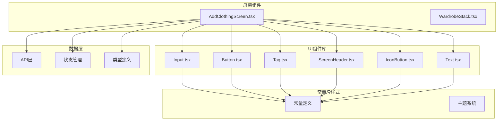

**图表来源**
- [AddClothingScreen.tsx:1-253](file://FreeDressApp/src/screens/AddClothingScreen.tsx#L1-L253)
- [WardrobeStack.tsx:1-21](file://FreeDressApp/src/navigation/WardrobeStack.tsx#L1-L21)

**章节来源**
- [AddClothingScreen.tsx:1-253](file://FreeDressApp/src/screens/AddClothingScreen.tsx#L1-L253)
- [WardrobeStack.tsx:1-21](file://FreeDressApp/src/navigation/WardrobeStack.tsx#L1-L21)

## 核心组件

添加衣物页面的核心功能由以下关键组件构成：

### 主要功能模块

1. **图片选择与预览** - 支持相机拍摄和相册选择
2. **分类选择** - 五种衣物分类选项
3. **属性设置** - 颜色、风格、季节选择
4. **标签系统** - 多关键词标签管理
5. **提交处理** - 完整的数据验证和上传流程

### 数据流设计

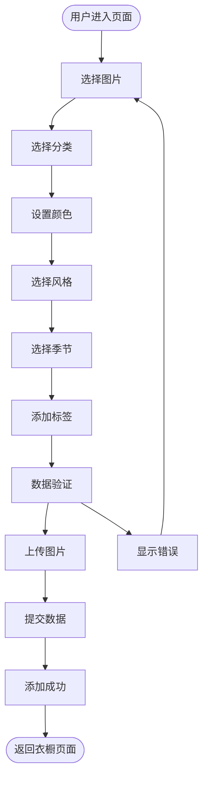

**图表来源**
- [AddClothingScreen.tsx:61-87](file://FreeDressApp/src/screens/AddClothingScreen.tsx#L61-L87)

**章节来源**
- [AddClothingScreen.tsx:29-209](file://FreeDressApp/src/screens/AddClothingScreen.tsx#L29-L209)

## 架构概览

添加衣物页面采用分层架构设计，确保代码的可维护性和扩展性：

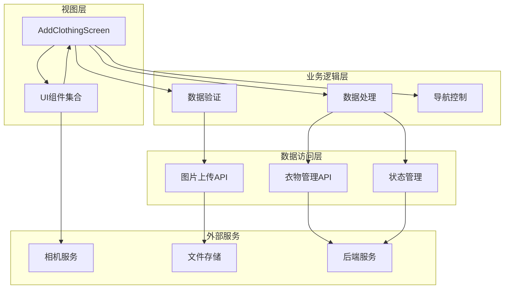

**图表来源**
- [AddClothingScreen.tsx:15-27](file://FreeDressApp/src/screens/AddClothingScreen.tsx#L15-L27)
- [upload.ts:4-20](file://FreeDressApp/src/api/upload.ts#L4-L20)
- [clothes.ts:30-32](file://FreeDressApp/src/api/clothes.ts#L30-L32)

## 详细组件分析

### 主屏幕组件分析

AddClothingScreen是整个页面的核心组件，负责协调所有子组件和业务逻辑：

#### 组件状态管理

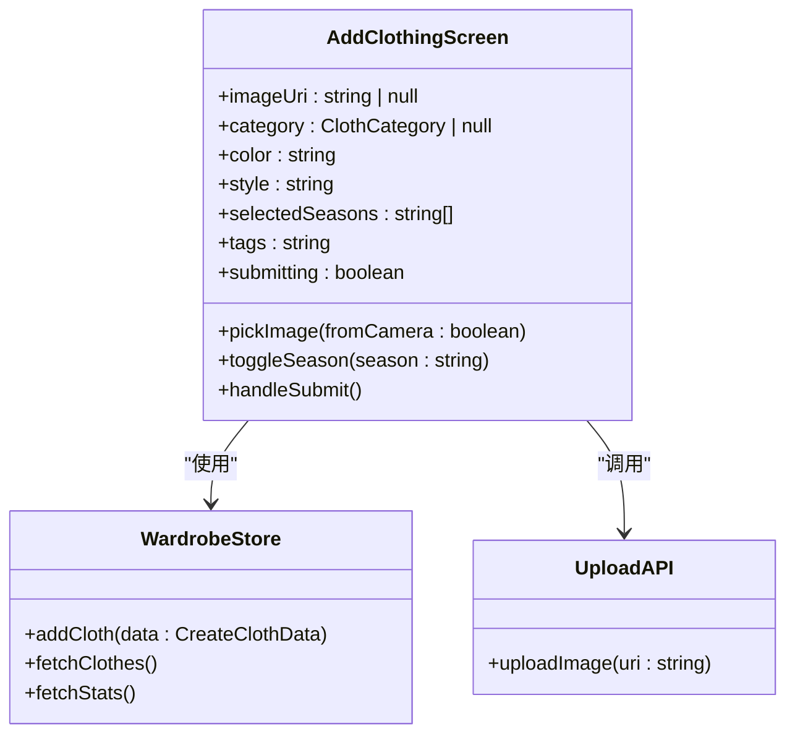

**图表来源**
- [AddClothingScreen.tsx:33-45](file://FreeDressApp/src/screens/AddClothingScreen.tsx#L33-L45)
- [wardrobeStore.ts:64-68](file://FreeDressApp/src/store/wardrobeStore.ts#L64-L68)
- [upload.ts:4](file://FreeDressApp/src/api/upload.ts#L4)

#### 图片上传流程

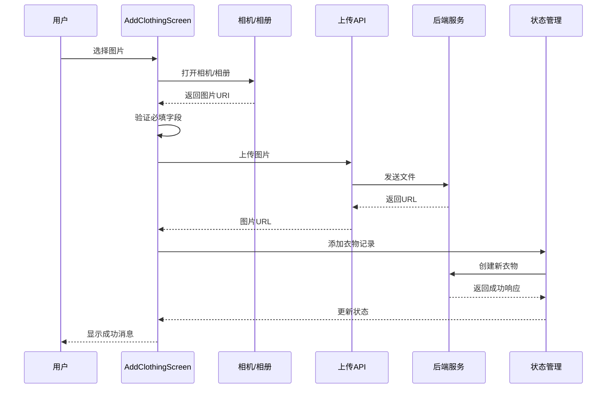

**图表来源**
- [AddClothingScreen.tsx:47-87](file://FreeDressApp/src/screens/AddClothingScreen.tsx#L47-L87)
- [upload.ts:4-20](file://FreeDressApp/src/api/upload.ts#L4-L20)
- [wardrobeStore.ts:64-68](file://FreeDressApp/src/store/wardrobeStore.ts#L64-L68)

**章节来源**
- [AddClothingScreen.tsx:29-209](file://FreeDressApp/src/screens/AddClothingScreen.tsx#L29-L209)

### UI组件系统

#### 输入组件(Input)

Input组件提供了多种样式变体，支持浮动标签和错误状态显示：

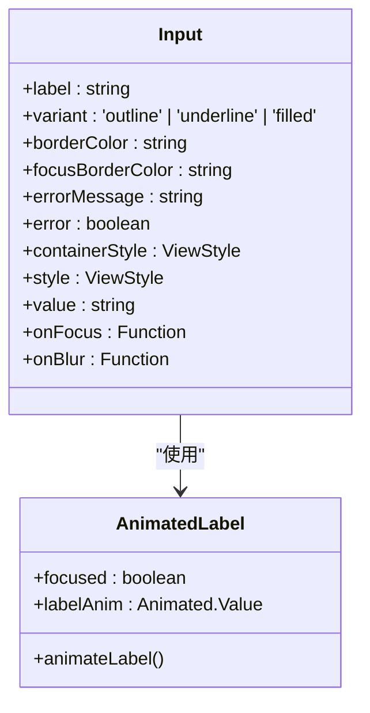

**图表来源**
- [Input.tsx:21-48](file://FreeDressApp/src/components/Input.tsx#L21-L48)
- [Input.tsx:49-59](file://FreeDressApp/src/components/Input.tsx#L49-L59)

#### 标签组件(Tag)

Tag组件实现了胶囊形状的选择器，支持激活和非激活状态：

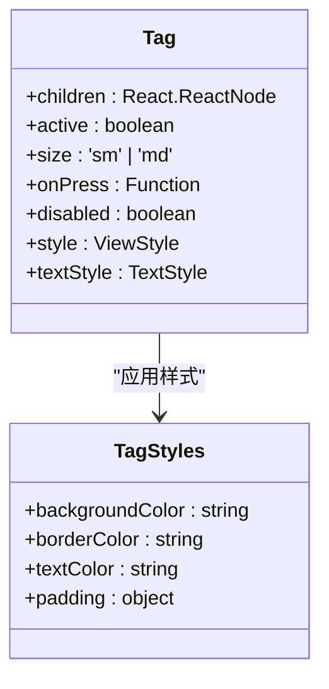

**图表来源**
- [Tag.tsx:22-40](file://FreeDressApp/src/components/Tag.tsx#L22-L40)
- [Tag.tsx:49-59](file://FreeDressApp/src/components/Tag.tsx#L49-L59)

#### 按钮组件(Button)

Button组件提供了丰富的交互反馈和加载状态：

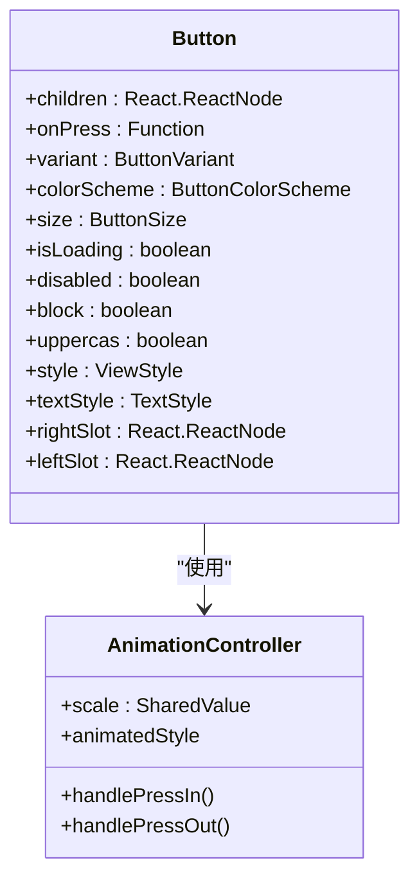

**图表来源**
- [Button.tsx:29-63](file://FreeDressApp/src/components/Button.tsx#L29-L63)
- [Button.tsx:64-78](file://FreeDressApp/src/components/Button.tsx#L64-L78)

**章节来源**
- [Input.tsx:1-183](file://FreeDressApp/src/components/Input.tsx#L1-L183)
- [Tag.tsx:1-91](file://FreeDressApp/src/components/Tag.tsx#L1-L91)
- [Button.tsx:1-201](file://FreeDressApp/src/components/Button.tsx#L1-L201)

### 数据验证逻辑

添加衣物页面实现了多层次的数据验证机制：

#### 必填字段检查

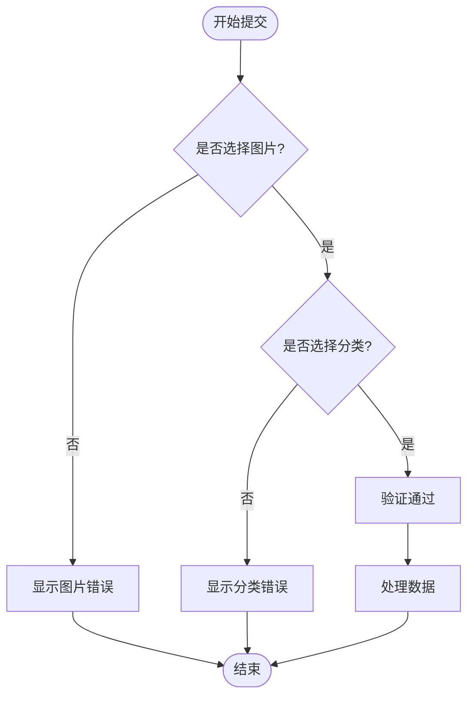

**图表来源**
- [AddClothingScreen.tsx:61-64](file://FreeDressApp/src/screens/AddClothingScreen.tsx#L61-L64)

#### 数据处理策略

页面采用了智能的数据处理策略，包括：

1. **标签解析** - 支持中文逗号、英文逗号和空格分隔
2. **季节选择** - 多选机制，支持取消选择
3. **条件数据传递** - 空值自动过滤，避免无效数据

**章节来源**
- [AddClothingScreen.tsx:61-87](file://FreeDressApp/src/screens/AddClothingScreen.tsx#L61-L87)

### 文件上传流程

#### 图片选择与预览

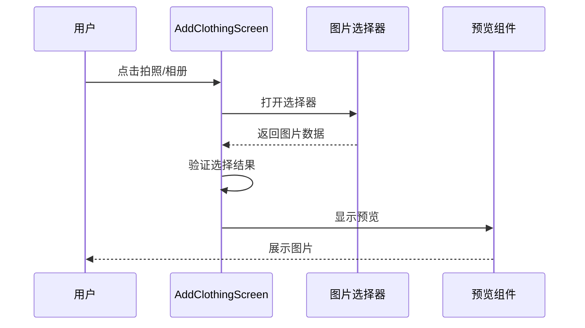

**图表来源**
- [AddClothingScreen.tsx:47-59](file://FreeDressApp/src/screens/AddClothingScreen.tsx#L47-L59)

#### 上传处理机制

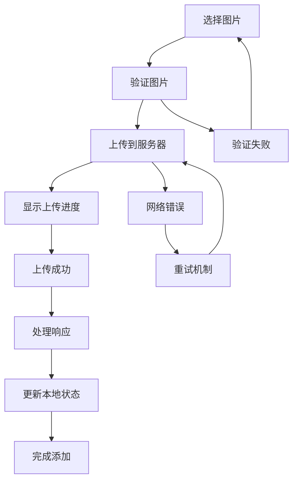

**图表来源**
- [upload.ts:4-20](file://FreeDressApp/src/api/upload.ts#L4-L20)

**章节来源**
- [AddClothingScreen.tsx:47-87](file://FreeDressApp/src/screens/AddClothingScreen.tsx#L47-L87)
- [upload.ts:1-21](file://FreeDressApp/src/api/upload.ts#L1-L21)

### 用户体验优化

#### 进度显示与反馈

页面实现了完整的用户反馈机制：

1. **加载状态** - 提交按钮的加载指示器
2. **错误提示** - 详细的错误消息显示
3. **成功反馈** - 添加成功的确认对话框
4. **实时预览** - 图片选择后的即时预览

#### 操作反馈设计

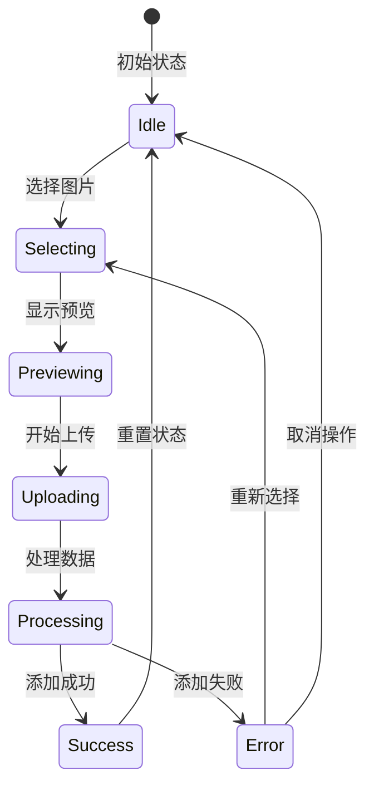

**图表来源**
- [AddClothingScreen.tsx:39](file://FreeDressApp/src/screens/AddClothingScreen.tsx#L39)
- [AddClothingScreen.tsx:65-86](file://FreeDressApp/src/screens/AddClothingScreen.tsx#L65-L86)

**章节来源**
- [AddClothingScreen.tsx:39-87](file://FreeDressApp/src/screens/AddClothingScreen.tsx#L39-L87)

## 依赖关系分析

添加衣物页面的依赖关系体现了清晰的分层架构：

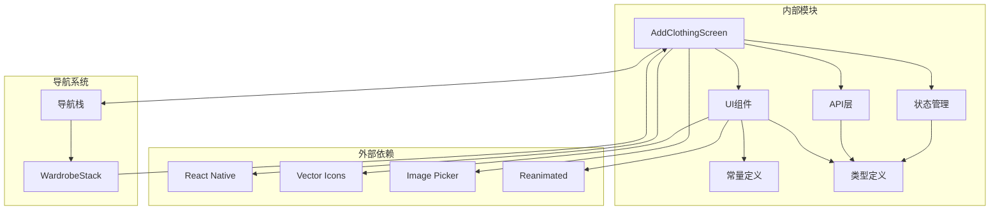

**图表来源**
- [AddClothingScreen.tsx:12-27](file://FreeDressApp/src/screens/AddClothingScreen.tsx#L12-L27)
- [WardrobeStack.tsx:2-5](file://FreeDressApp/src/navigation/WardrobeStack.tsx#L2-L5)

**章节来源**
- [AddClothingScreen.tsx:12-27](file://FreeDressApp/src/screens/AddClothingScreen.tsx#L12-L27)
- [WardrobeStack.tsx:1-21](file://FreeDressApp/src/navigation/WardrobeStack.tsx#L1-L21)

## 性能考虑

### 优化策略

1. **懒加载组件** - 使用React.lazy延迟加载重型组件
2. **状态最小化** - 仅在必要时更新组件状态
3. **内存管理** - 及时清理图片资源和事件监听器
4. **网络优化** - 合理的请求频率和缓存策略

### 最佳实践建议

1. **图片处理** - 在上传前进行适当的压缩和格式转换
2. **错误恢复** - 实现断点续传和重试机制
3. **用户体验** - 提供清晰的加载状态和进度指示
4. **数据一致性** - 确保本地状态与服务器状态同步

## 故障排除指南

### 常见问题及解决方案

#### 图片选择失败

**问题描述**: 用户无法从相册选择图片或相机无法启动

**解决方案**:
1. 检查设备权限设置
2. 验证图片选择器配置
3. 确认网络连接状态

#### 上传超时

**问题描述**: 图片上传过程中出现超时错误

**解决方案**:
1. 检查网络连接质量
2. 减少图片大小或分辨率
3. 实现重试机制和进度反馈

#### 数据验证错误

**问题描述**: 提交表单时出现数据验证错误

**解决方案**:
1. 检查必填字段是否完整
2. 验证数据格式和范围
3. 确认API接口状态

**章节来源**
- [AddClothingScreen.tsx:51-54](file://FreeDressApp/src/screens/AddClothingScreen.tsx#L51-L54)
- [AddClothingScreen.tsx:82-84](file://FreeDressApp/src/screens/AddClothingScreen.tsx#L82-L84)

## 结论

添加衣物页面展现了现代移动应用开发的最佳实践，通过精心设计的组件架构、完善的用户体验和健壮的错误处理机制，为用户提供了流畅而可靠的衣物添加体验。

该页面的主要优势包括：

1. **直观的用户界面** - 清晰的信息层级和一致的视觉设计
2. **强大的功能完整性** - 支持完整的衣物信息录入和管理
3. **优秀的性能表现** - 优化的状态管理和高效的渲染机制
4. **可靠的错误处理** - 全面的错误捕获和用户友好的反馈

通过持续的优化和改进，添加衣物页面将继续为畅搭(FreeDress)应用用户提供卓越的服务体验。